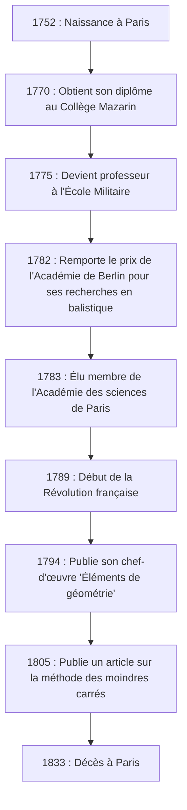
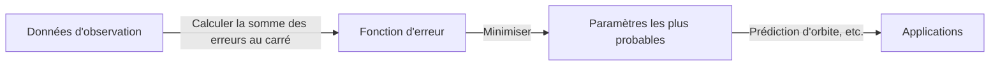

# [Adrien-Marie Legendre](https://kenji.blog/fr/p/legendre/) : Le géant de l'ombre des mathématiques et sa vie mouvementée

Dans l'histoire des mathématiques, il y a des figures dont les noms couronnent de nombreux théorèmes et concepts, mais dont la vie personnelle et le véritable visage restent étonnamment méconnus. Le grand mathématicien français **[Adrien-Marie Legendre](https://kenji.blog/fr/p/legendre/)** (1752–1833) en est sans doute un parfait exemple.

Dans cet article, nous plongeons profondément dans la vie de [Legendre](https://kenji.blog/fr/p/legendre/), ses immenses contributions au monde mathématique, sa querelle féroce avec le génie contemporain [Carl Friedrich Gauss](https://kenji.blog/fr/p/gauss/), et le "mystère du portrait" qui n'a été élucidé que récemment. En retraçant la trajectoire de sa vie, vous pourrez ressentir le souffle de la communauté scientifique française du XVIIIe au XIXe siècle.

## 1. Vie et contexte historique : Un mathématicien survivant à une France turbulente

[Legendre](https://kenji.blog/fr/p/legendre/) est né le 18 septembre 1752, dans une famille très riche à Paris, en France (bien que certaines théories suggèrent Toulouse, Paris est le plus probable). Sous l'Ancien Régime, avant la Révolution française, il a pu se plonger dans ses intérêts intellectuels, à savoir la recherche mathématique et physique, sans aucun souci financier.

Recevant une éducation avancée au Collège Mazarin à Paris, ses talents ont été reconnus très tôt. De 1775 à 1780, il a été professeur de mathématiques à l'École Militaire. Plus tard, en 1782, il a remporté le prix de l'Académie des sciences de Berlin pour son traité sur la balistique, ce qui lui a valu une renommée internationale. Cette réalisation a conduit à son élection comme membre de la prestigieuse Académie des sciences de Paris l'année suivante, en 1783.

Le diagramme ci-dessous montre une chronologie des événements majeurs de la vie de [Legendre](https://kenji.blog/fr/p/legendre/).

Sa vie a été grandement bouleversée par la Révolution française, qui a éclaté en 1789. Les vagues de la révolution l'ont dépouillé de sa fortune personnelle, le plongeant temporairement dans la détresse financière. Cependant, il n'a jamais perdu sa passion pour les mathématiques et a continué à contribuer à des projets scientifiques nationaux, tels que la normalisation des poids et mesures (l'établissement du système métrique).

## 2. Contributions immortelles au monde mathématique

Les réalisations de [Legendre](https://kenji.blog/fr/p/legendre/) couvrent presque tous les domaines des mathématiques de son époque, y compris la théorie des nombres, l'algèbre, l'analyse et la géométrie. Ses recherches ont souvent été complétées par d'autres génies (comme Gauss, [Abel](https://kenji.blog/fr/p/abel/) et [Jacobi](https://kenji.blog/fr/p/jacobi/)), mais sans les fondations qu'il a construites, leurs développements spectaculaires n'auraient pas été possibles.

### 2.1 Passion pour la théorie des nombres et le symbole de [Legendre](https://kenji.blog/fr/p/legendre/)

[Legendre](https://kenji.blog/fr/p/legendre/) était profondément fasciné par la théorie des nombres, initiée par des prédécesseurs tels que [Pierre de Fermat](https://kenji.blog/fr/p/fermat/) et [Leonhard Euler](https://kenji.blog/fr/p/euler/). L'une de ses plus grandes réalisations est son travail sur la "Loi de réciprocité quadratique". Cette loi est l'un des théorèmes les plus beaux et les plus importants de la théorie des nombres pour déterminer si un nombre premier est congruent à un carré modulo un autre nombre premier.

Il a formulé cette loi et en a donné une preuve partielle (une preuve complète a ensuite été fournie par le jeune Gauss). De plus, pour exprimer cette recherche de manière concise et élégante, il a introduit une notation connue aujourd'hui sous le nom de **symbole de [Legendre](https://kenji.blog/fr/p/legendre/)**.

$$
\left( \frac{a}{p} \right) = 
\begin{cases} 
1 & \text{si } a \text{ est un résidu quadratique modulo } p \text{ et } a \not\equiv 0 \pmod{p} \\
-1 & \text{si } a \text{ est un non-résidu quadratique modulo } p \\
0 & \text{si } a \equiv 0 \pmod{p}
\end{cases}
$$

Grâce à cette notation révolutionnaire, les propositions et preuves complexes de la théorie des nombres sont devenues extrêmement transparentes, apportant d'immenses avantages aux mathématiciens ultérieurs. Il a également laissé de nombreuses empreintes dans l'abîme de la théorie des nombres, telles que sa preuve du dernier théorème de [Fermat](https://kenji.blog/fr/p/fermat/) pour $ n=5 $ (prouvé indépendamment à la même époque par Dirichlet) et sa conjecture du théorème de Dirichlet sur les progressions arithmétiques.

### 2.2 Intégrales elliptiques et polynômes de [Legendre](https://kenji.blog/fr/p/legendre/)

Dans le domaine de l'analyse, [Legendre](https://kenji.blog/fr/p/legendre/) a consacré le temps étonnant de 40 ans à l'étude des "intégrales elliptiques". Il a montré que toutes les intégrales elliptiques peuvent être réduites à trois formes standard et a créé des tables numériques détaillées pour elles.

$$
F(\phi, k) = \int_0^\phi \frac{d\theta}{\sqrt{1 - k^2 \sin^2 \theta}}
$$

Sa classification, y compris l'intégrale elliptique incomplète de première espèce telle que montrée ci-dessus, est devenue la norme dans les mathématiques ultérieures. Peu de temps après avoir terminé une œuvre monumentale culminant ce domaine, les jeunes génies [Abel](https://kenji.blog/fr/p/abel/) et [Jacobi](https://kenji.blog/fr/p/jacobi/) ont introduit une perspective entièrement nouvelle appelée "fonctions elliptiques" (les fonctions inverses des intégrales elliptiques), réécrivant complètement le domaine. Bien que [Legendre](https://kenji.blog/fr/p/legendre/) ait été choqué que ses décennies de recherche soient devenues obsolètes, il a honnêtement reconnu leur jeune talent et les a passionnément loués — un épisode qui démontre son attitude sincère en tant qu'érudit.

De plus, en physique et en ingénierie, en particulier dans l'électromagnétisme et la mécanique quantique, les **polynômes de [Legendre](https://kenji.blog/fr/p/legendre/)** apparaissent invariablement lors de la résolution de l'équation de Laplace en coordonnées sphériques. Il s'agit d'un système de polynômes orthogonaux obtenus comme solutions à l'équation différentielle suivante (équation différentielle de [Legendre](https://kenji.blog/fr/p/legendre/)).

$$
(1-x^2)y'' - 2xy' + n(n+1)y = 0
$$

Ces polynômes sont devenus un outil indispensable dans toutes sortes de calculs dans la science et la technologie modernes.

### 2.3 'Éléments de géométrie' et son grand impact sur l'enseignement des mathématiques

Parallèlement à ses activités de recherche, [Legendre](https://kenji.blog/fr/p/legendre/) était également un éducateur exceptionnel. Son livre "Éléments de géométrie", publié en 1794, a réorganisé les "Éléments" d'[[Euclid](https://kenji.blog/fr/p/euclid/)e](https://kenji.blog/p/euclid/) pour les rendre plus accessibles et rigoureux pour les étudiants de son époque.

Ce manuel a connu un succès phénoménal, étant traduit en anglais et dans d'autres langues et lu dans le monde entier, pas seulement en France. Il a été largement adopté aux États-Unis et est resté la norme absolue pour l'enseignement de la géométrie tout au long du XIXe siècle. Dans ce livre, il a continuellement tenté de prouver le postulat des parallèles (le cinquième postulat d'[[Euclid](https://kenji.blog/fr/p/euclid/)e](https://kenji.blog/p/euclid/)), ajoutant de nouvelles preuves à chaque édition, bien qu'en fin de compte elles se soient toutes révélées imparfaites. Cependant, sa persévérance est devenue l'une des forces motrices importantes incitant la naissance de la géométrie non euclidienne.

### 2.4 Défi au théorème des nombres premiers

La question de savoir comment les nombres premiers sont distribués parmi les nombres naturels a longtemps fasciné les mathématiciens. [Legendre](https://kenji.blog/fr/p/legendre/) a minutieusement examiné les tables de nombres premiers et, avec une acuité étonnante, a conjecturé la formule d'approximation suivante pour le nombre de nombres premiers $ \pi(x) $ inférieurs ou égaux à $ x $.

$$
\pi(x) \approx \frac{x}{\ln(x) - A}
$$

Sur la base de ses propres données calculées à la main, il a déduit que la constante $ A $ était d'environ $ 1.08366 $ (dans l'édition de 1808 de sa 'Théorie des Nombres'). Cette formule suggérait qu'au fur et à mesure que $ x $ grandit, la densité de la distribution des nombres premiers s'approche de $ \frac{1}{\ln(x)} $, une vision extrêmement avancée pour les mathématiques de l'époque.

Il a été révélé plus tard que Gauss avait également fait une conjecture similaire en utilisant le logarithme intégral $ \text{Li}(x) $, et finalement, en 1896, le théorème des nombres premiers a été complètement et indépendamment prouvé par Jacques Hadamard et Charles de la Vallée Poussin. Bien qu'une preuve rigoureuse ait été hors de sa portée, cela montre à quel point l'intuition de [Legendre](https://kenji.blog/fr/p/legendre/) était fondamentalement correcte.

## 3. Querelle avec Gauss : La tragédie autour de la découverte des moindres carrés

En discutant de la vie de [Legendre](https://kenji.blog/fr/p/legendre/), on ne peut éviter le féroce différend de priorité, en particulier concernant la **méthode des moindres carrés**, avec [Carl Friedrich Gauss](https://kenji.blog/fr/p/gauss/), le "prince des mathématiques" allemand.

En 1805, dans son livre sur le calcul des orbites des comètes, [Legendre](https://kenji.blog/fr/p/legendre/) annonça publiquement pour la première fois au monde la "méthode des moindres carrés" — une méthode pour trouver la valeur la plus probable en minimisant les erreurs des données d'observation. C'était une technique révolutionnaire qui forme la base de tous les domaines traitant des données, de l'astronomie et de la géodésie aux statistiques modernes et à l'apprentissage automatique.

Cependant, quatre ans plus tard en 1809, Gauss utilisa largement la méthode des moindres carrés dans son propre livre sur la mécanique céleste, affirmant : "J'utilise cette méthode de façon routinière depuis 1795." D'après les preuves historiques, on considère que l'affirmation de Gauss était vraie, mais la priorité académique de la publication appartenait incontestablement à [Legendre](https://kenji.blog/fr/p/legendre/).

Le comportement de Gauss a profondément blessé la fierté de [Legendre](https://kenji.blog/fr/p/legendre/). [Legendre](https://kenji.blog/fr/p/legendre/) envoya une lettre à Gauss exigeant qu'il reconnaisse sa publication antérieure, mais Gauss maintint une attitude froide. Dans l'annexe de son propre travail, [Legendre](https://kenji.blog/fr/p/legendre/) exprima explicitement sa colère intense envers Gauss, déclarant qu'"une certaine personne revendique la découverte d'un autre comme sienne."

De plus, concernant le théorème des nombres premiers (la conjecture de [Legendre](https://kenji.blog/fr/p/legendre/) de $ \pi(x) \approx \frac{x}{\ln x - 1.08366} $) et la loi de réciprocité quadratique, bien que [Legendre](https://kenji.blog/fr/p/legendre/) les ait découverts et formulés en premier, Gauss les prouva complètement et les généralisa plus profondément, ce qui fit que tous les éloges publics se concentrèrent sur Gauss. Pour [Legendre](https://kenji.blog/fr/p/legendre/), Gauss était un mur trop haut qui lui arracha toutes ses réalisations, devenant son ennemi juré pour la vie.

## 4. Le mystère du portrait : Un grand malentendu de 200 ans

L'épisode le plus étrange et, pour nous aujourd'hui, le plus amusant concernant [Legendre](https://kenji.blog/fr/p/legendre/) concerne le mystère de son "portrait".

Pendant de nombreuses années, dans les manuels de mathématiques et les livres d'histoire des sciences du monde entier, un portrait particulier a été utilisé comme le visage d'[Adrien-Marie Legendre](https://kenji.blog/fr/p/legendre/). C'était une lithographie représentant le profil d'un homme à l'expression sévère et grincheuse. Tout le monde croyait sans l'ombre d'un doute qu'il s'agissait du visage du grand mathématicien [Legendre](https://kenji.blog/fr/p/legendre/).

Cependant, en 2005, un fait surprenant fut mis en lumière et secoua la communauté de l'histoire des mathématiques. Étonnamment, le portrait qui avait été publié en tant que "mathématicien [Legendre](https://kenji.blog/fr/p/legendre/)" pendant plus de 200 ans appartenait en réalité à une personne complètement différente : **Louis [Legendre](https://kenji.blog/fr/p/legendre/)** (1752–1797), un politicien pendant la Révolution française !

Un grand malentendu historique a été créé parce qu'ils partageaient le même nom de famille "[Legendre](https://kenji.blog/fr/p/legendre/)", étaient nés exactement la même année en 1752, avaient vécu à Paris à la même époque (la Révolution française) et, en outre, parce que le mathématicien [Legendre](https://kenji.blog/fr/p/legendre/) détestait au plus haut point laisser des portraits de lui-même en public.

Alors, à quoi ressemblait le vrai mathématicien [Legendre](https://kenji.blog/fr/p/legendre/) ?
Après la découverte de cette vérité, les historiens ont désespérément cherché des portraits authentiques. Enfin, en 2008, une caricature contemporaine (dessin satirique) le représentant a été découverte aux Archives nationales françaises.

Là, au lieu du profil sévère du politicien Louis [Legendre](https://kenji.blog/fr/p/legendre/), se trouvait la figure d'un homme âgé dodu, chaleureux et d'apparence légèrement mécontente. Son côté humain — épuisé par les disputes avec Gauss tout en louant les talents des jeunes [Abel](https://kenji.blog/fr/p/abel/) et [Jacobi](https://kenji.blog/fr/p/jacobi/) — est fidèlement rendu par cette aquarelle. Aujourd'hui, cette caricature est reconnue comme son seul portrait authentique.

## 5. Conclusion

[Adrien-Marie Legendre](https://kenji.blog/fr/p/legendre/) a terminé sa vie à Paris en 1833. Dans ses dernières années, il a fait face à des événements malheureux, comme la suspension de sa pension en raison de son opposition aux politiques gouvernementales.

Il est souvent traité comme une "figure de l'ombre" devant la brillance écrasante des génies de premier plan de son époque, comme Gauss et Laplace. Cependant, le rôle qu'il a joué dans la construction des fondations des mathématiques modernes est incommensurable. L'héritage qu'il a laissé, comme les polynômes de [Legendre](https://kenji.blog/fr/p/legendre/), le symbole de [Legendre](https://kenji.blog/fr/p/legendre/) et la formulation de la méthode des moindres carrés, continue de soutenir le cœur de la science et de la technologie modernes.

Sa vie a été colorée par un destin étrange, incluant non seulement des succès spectaculaires, mais aussi des tourments sur la priorité et la confusion posthume de son portrait. Lorsque nous rencontrons le nom de **[Legendre](https://kenji.blog/fr/p/legendre/)** dans les formules de mathématiques et de physique, ne le considérez pas seulement comme un symbole, mais prenez un moment pour réfléchir à la vie de ce grand mathématicien qui possédait un esprit indomptable et profondément humain.
