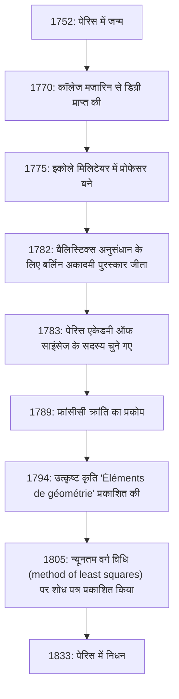
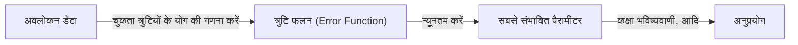

# [एड्रियन-मैरी लीजेंड्रे](https://kenji.blog/hi/p/legendre/): गणित के शैडो जायंट और उनका अशांत जीवन

गणित के इतिहास में ऐसी हस्तियां हैं जिनके नाम कई प्रमेयों और अवधारणाओं का ताज पहनते हैं, फिर भी उनका व्यक्तिगत जीवन और वास्तविक छवियां आश्चर्यजनक रूप से अज्ञात रहती हैं। महान फ्रांसीसी गणितज्ञ **[एड्रियन-मैरी लीजेंड्रे](https://kenji.blog/hi/p/legendre/)** ([Adrien-Marie Legendre](https://kenji.blog/hi/p/legendre/), 1752–1833) यकीनन एक प्रमुख उदाहरण हैं।

इस लेख में, हम लीजेंड्रे के जीवन, गणितीय दुनिया में उनके अपार योगदान, समकालीन प्रतिभा [कार्ल फ्रेडरिक गॉस](https://kenji.blog/hi/p/gauss/) के साथ उनके भयंकर विवाद, और "चित्र रहस्य" की गहराई में जाते हैं जिसे हाल ही में सुलझाया गया था। उनके जीवन पथ का पता लगाकर, आप 18वीं से 19वीं सदी तक फ्रांसीसी वैज्ञानिक समुदाय की सांस को महसूस कर पाएंगे।

## 1. जीवन और ऐतिहासिक संदर्भ: अशांत फ्रांस में जीवित एक गणितज्ञ

लीजेंड्रे का जन्म 18 सितंबर, 1752 को फ्रांस के पेरिस में एक बहुत धनी परिवार में हुआ था (हालांकि कुछ सिद्धांत टूलूज़ का सुझाव देते हैं, पेरिस सबसे संभावित है)। फ्रांसीसी क्रांति से पहले एंसिएन रेजीम (Ancien Régime) के दौरान, वह बिना किसी वित्तीय चिंता के अपनी बौद्धिक रुचियों - अर्थात् गणितीय और भौतिक अनुसंधान - में डूबने में सक्षम थे।

पेरिस के कॉलेज मजारिन (Collège Mazarin) में उन्नत शिक्षा प्राप्त करने के बाद, उनकी प्रतिभा को जल्द ही पहचान लिया गया। 1775 से 1780 तक, उन्होंने इकोले मिलिटेयर (École Militaire) में गणित के प्रोफेसर के रूप में कार्य किया। बाद में, 1782 में, उन्होंने बैलिस्टिक्स पर अपने ग्रंथ के लिए बर्लिन एकेडमी ऑफ साइंसेज का पुरस्कार जीता, जिससे उन्हें अंतर्राष्ट्रीय ख्याति मिली। इस उपलब्धि के कारण अगले वर्ष, 1783 में उन्हें प्रतिष्ठित पेरिस एकेडमी ऑफ साइंसेज के सदस्य के रूप में चुना गया।

नीचे दिया गया चित्र लीजेंड्रे के जीवन की प्रमुख घटनाओं की समयरेखा दिखाता है।

1789 में शुरू हुई फ्रांसीसी क्रांति ने उनके जीवन को बहुत उथल-पुथल कर दिया। क्रांति की लहरों ने उन्हें उनके निजी भाग्य से वंचित कर दिया, और अस्थायी रूप से उन्हें वित्तीय संकट में डाल दिया। हालाँकि, उन्होंने गणित के प्रति अपना जुनून कभी नहीं खोया और वजन और माप के मानकीकरण (मीट्रिक प्रणाली की स्थापना) जैसी राष्ट्रीय वैज्ञानिक परियोजनाओं में योगदान देना जारी रखा।

## 2. गणितीय दुनिया में अमर योगदान

लीजेंड्रे की उपलब्धियां उनके समय के गणित के लगभग सभी क्षेत्रों में फैली हुई हैं, जिनमें संख्या सिद्धांत, बीजगणित, विश्लेषण और ज्यामिति शामिल हैं। उनके शोध को अक्सर अन्य प्रतिभाओं (जैसे गॉस, एबेल और जैकोबी) द्वारा पूरा किया गया था, लेकिन उनके द्वारा निर्मित नींव के बिना, उनके नाटकीय विकास संभव नहीं होते।

### 2.1 संख्या सिद्धांत के लिए जुनून और लीजेंड्रे प्रतीक (Legendre Symbol)

लीजेंड्रे पियरे डी फर्मेट ([Pierre de Fermat](https://kenji.blog/hi/p/fermat/)) और [लियोनहार्ड यूलर](https://kenji.blog/hi/p/euler/) ([Leonhard Euler](https://kenji.blog/hi/p/euler/)) जैसे पूर्ववर्तियों द्वारा शुरू किए गए संख्या सिद्धांत से गहराई से मोहित थे। उनकी सबसे बड़ी उपलब्धियों में से एक "द्विघात पारस्परिकता का नियम (Law of quadratic reciprocity)" पर उनका काम है। यह नियम यह निर्धारित करने के लिए संख्या सिद्धांत में सबसे सुंदर और महत्वपूर्ण प्रमेयों में से एक है कि क्या एक अभाज्य संख्या दूसरे अभाज्य संख्या के मॉड्यूलो वर्ग के अनुरूप है।

उन्होंने इस नियम को तैयार किया और एक आंशिक प्रमाण दिया (एक पूर्ण प्रमाण बाद में युवा गॉस द्वारा प्रदान किया गया था)। इसके अलावा, इस शोध को संक्षिप्त और सुरुचिपूर्ण ढंग से व्यक्त करने के लिए, उन्होंने एक अंकन पेश किया जिसे आज **लीजेंड्रे प्रतीक** के रूप में जाना जाता है।

$$
\left( \frac{a}{p} \right) = 
\begin{cases} 
1 & \text{यदि } a \text{ मॉड्यूलो } p \text{ का एक द्विघात अवशेष है और } a \not\equiv 0 \pmod{p} \\
-1 & \text{यदि } a \text{ मॉड्यूलो } p \text{ का एक द्विघात गैर-अवशेष है} \\
0 & \text{यदि } a \equiv 0 \pmod{p}
\end{cases}
$$

इस अभूतपूर्व अंकन के लिए धन्यवाद, संख्या सिद्धांत में जटिल प्रस्ताव और प्रमाण अत्यंत पारदर्शी हो गए, जिससे बाद के गणितज्ञों को अपार लाभ हुआ। उन्होंने संख्या सिद्धांत की गहराई में कई पदचिह्न भी छोड़े, जैसे $ n=5 $ के लिए फर्मेट के अंतिम प्रमेय का उनका प्रमाण (डिरिचलेट (Dirichlet) द्वारा लगभग उसी समय स्वतंत्र रूप से सिद्ध किया गया) और अंकगणितीय प्रगति पर डिरिचलेट के प्रमेय का उनका अनुमान।

### 2.2 अण्डाकार अभिन्न और लीजेंड्रे बहुपद

विश्लेषण के क्षेत्र में, लीजेंड्रे ने "अण्डाकार अभिन्न (elliptic integrals)" के अध्ययन के लिए आश्चर्यजनक रूप से 40 वर्ष समर्पित किए। उन्होंने दिखाया कि सभी अण्डाकार अभिन्न को तीन मानक रूपों में कम किया जा सकता है और उनके लिए विस्तृत संख्यात्मक तालिकाएं बनाईं।

$$
F(\phi, k) = \int_0^\phi \frac{d\theta}{\sqrt{1 - k^2 \sin^2 \theta}}
$$

उनका वर्गीकरण, जिसमें ऊपर दिखाए गए पहले प्रकार का अधूरा अण्डाकार अभिन्न शामिल है, बाद के गणित में मानक बन गया। इस क्षेत्र की परिणति करने वाले एक स्मारकीय कार्य को पूरा करने के कुछ ही समय बाद, युवा प्रतिभाओं एबेल और जैकोबी ने "अण्डाकार कार्यों" (अण्डाकार अभिन्न के व्युत्क्रम कार्य) नामक एक बिल्कुल नया दृष्टिकोण पेश किया, जिसने क्षेत्र को पूरी तरह से फिर से लिख दिया। यद्यपि लीजेंड्रे को यह जानकर झटका लगा था कि उनका दशकों का शोध पुराना हो गया है, उन्होंने ईमानदारी से उनकी युवा प्रतिभा को पहचाना और जोश से उनकी प्रशंसा की - एक ऐसा एपिसोड जो एक विद्वान के रूप में उनके ईमानदार रवैये को प्रदर्शित करता है।

इसके अतिरिक्त, भौतिकी और इंजीनियरिंग में, विशेष रूप से विद्युत चुंबकत्व और क्वांटम यांत्रिकी में, गोलाकार निर्देशांक में लाप्लास के समीकरण को हल करते समय **लीजेंड्रे बहुपद** अनिवार्य रूप से प्रकट होते हैं। ये रूढ़िवादी बहुपदों (orthogonal polynomials) की एक प्रणाली हैं जिन्हें निम्नलिखित अवकल समीकरण (लीजेंड्रे के अवकल समीकरण) के समाधान के रूप में प्राप्त किया गया है।

$$
(1-x^2)y'' - 2xy' + n(n+1)y = 0
$$

ये बहुपद आधुनिक विज्ञान और प्रौद्योगिकी में सभी प्रकार की गणनाओं में एक अनिवार्य उपकरण बन गए हैं।

### 2.3 'Éléments de géométrie' और गणित शिक्षा पर इसका महान प्रभाव

अपनी शोध गतिविधियों के साथ-साथ, लीजेंड्रे एक उत्कृष्ट शिक्षक भी थे। 1794 में प्रकाशित उनकी पुस्तक "Éléments de géométrie" (ज्यामिति के तत्व), ने अपने समय के छात्रों के लिए अधिक सुलभ और कठोर होने के लिए [यूक्लिड](https://kenji.blog/hi/p/euclid/) के "एलिमेंट्स" को पुनर्गठित किया।

इस पाठ्यपुस्तक ने अभूतपूर्व सफलता हासिल की, जिसका अंग्रेजी और अन्य भाषाओं में अनुवाद किया गया और न केवल फ्रांस में बल्कि दुनिया भर में पढ़ा गया। इसे संयुक्त राज्य अमेरिका में व्यापक रूप से अपनाया गया और पूरे 19वीं सदी में ज्यामिति शिक्षा के लिए पूर्ण मानक बना रहा। इस पुस्तक में, उन्होंने लगातार समानांतर अभिधारणा ([यूक्लिड](https://kenji.blog/hi/p/euclid/) की पांचवीं अभिधारणा) को साबित करने का प्रयास किया, प्रत्येक संस्करण के साथ नए प्रमाण जोड़ते गए, हालांकि अंततः वे सभी त्रुटिपूर्ण साबित हुए। हालाँकि, उनकी दृढ़ता गैर-[यूक्लिड](https://kenji.blog/hi/p/euclid/)ियन ज्यामिति के जन्म को प्रेरित करने वाली महत्वपूर्ण प्रेरक शक्तियों में से एक बन गई।

### 2.4 अभाज्य संख्या प्रमेय के लिए चुनौती

प्राकृतिक संख्याओं के बीच अभाज्य संख्याएँ कैसे वितरित की जाती हैं, इस प्रश्न ने लंबे समय से गणितज्ञों को आकर्षित किया था। लीजेंड्रे ने अभाज्य संख्या तालिकाओं की सावधानीपूर्वक जांच की और आश्चर्यजनक तीक्ष्णता के साथ, $ x $ से कम या उसके बराबर अभाज्य संख्याओं $ \pi(x) $ की संख्या के लिए निम्नलिखित सन्निकटन सूत्र का अनुमान लगाया।

$$
\pi(x) \approx \frac{x}{\ln(x) - A}
$$

अपने स्वयं के व्यापक हाथ से गणना किए गए डेटा के आधार पर, उन्होंने यह निष्कर्ष निकाला कि स्थिरांक $ A $ लगभग $ 1.08366 $ था (उनके 'Théorie des Nombres' के 1808 संस्करण में)। इस सूत्र ने सुझाव दिया कि जैसे-जैसे $ x $ बड़ा होता जाता है, अभाज्य संख्या वितरण का घनत्व $ \frac{1}{\ln(x)} $ के करीब पहुंचता है, जो उस समय के गणित के लिए एक अत्यंत उन्नत अंतर्दृष्टि थी।

बाद में यह पता चला कि गॉस ने लॉगरिदमिक इंटीग्रल $ \text{Li}(x) $ का उपयोग करके एक समान अनुमान भी लगाया था, और अंततः, 1896 में, अभाज्य संख्या प्रमेय को जैक्स हैडामर्ड (Jacques Hadamard) और चार्ल्स डी ला वैली पॉसिन (Charles de la Vallée Poussin) द्वारा पूरी तरह से और स्वतंत्र रूप से सिद्ध किया गया था। यद्यपि एक कठोर प्रमाण उनकी पहुंच से बाहर था, यह दर्शाता है कि लीजेंड्रे का अंतर्ज्ञान अनिवार्य रूप से कितना सही था।

## 3. गॉस के साथ दुश्मनी: न्यूनतम वर्ग की खोज पर त्रासदी

लीजेंड्रे के जीवन पर चर्चा करते हुए, कोई भी भयंकर प्राथमिकता विवाद से नहीं बच सकता, विशेष रूप से **[न्यूनतम वर्ग विधि](https://kenji.blog/hi/p/method-of-least-squares/) ([Method of Least Squares](https://kenji.blog/hi/p/method-of-least-squares/))** के संबंध में, जर्मनी के "गणित के राजकुमार" [कार्ल फ्रेडरिक गॉस](https://kenji.blog/hi/p/gauss/) के साथ।

1805 में, धूमकेतुओं की कक्षाओं की गणना पर अपनी पुस्तक में, लीजेंड्रे ने दुनिया में पहली बार सार्वजनिक रूप से "[न्यूनतम वर्ग विधि](https://kenji.blog/hi/p/method-of-least-squares/)" की घोषणा की - जो अवलोकन डेटा की त्रुटियों को कम करके सबसे संभावित मूल्य खोजने की एक विधि है। यह एक क्रांतिकारी तकनीक थी जो खगोल विज्ञान और भूगणित से लेकर आधुनिक सांख्यिकी और मशीन लर्निंग तक डेटा से निपटने वाले हर क्षेत्र की नींव बनाती है।

हालाँकि, चार साल बाद 1809 में, गॉस ने खगोलीय यांत्रिकी पर अपनी पुस्तक में न्यूनतम वर्ग की विधि का बड़े पैमाने पर उपयोग किया, यह दावा करते हुए, "मैं 1795 से नियमित रूप से इस विधि का उपयोग कर रहा हूँ।" ऐतिहासिक साक्ष्यों से, गॉस का दावा सत्य माना जाता है, लेकिन प्रकाशन की अकादमिक प्राथमिकता निस्संदेह लीजेंड्रे की थी।

गॉस के व्यवहार ने लीजेंड्रे के गौरव को गहरा आघात पहुँचाया। लीजेंड्रे ने गॉस को एक पत्र भेजकर मांग की कि वह अपने पूर्व प्रकाशन को स्वीकार करें, लेकिन गॉस ने ठंडा रवैया बनाए रखा। अपने स्वयं के काम के परिशिष्ट में, लीजेंड्रे ने गॉस के प्रति अपना तीव्र क्रोध स्पष्ट रूप से व्यक्त किया, यह बताते हुए कि "एक निश्चित व्यक्ति किसी अन्य की खोज को अपना होने का दावा कर रहा है।"

इसके अलावा, अभाज्य संख्या प्रमेय (लीजेंड्रे का अनुमान $ \pi(x) \approx \frac{x}{\ln x - 1.08366} $) और द्विघात पारस्परिकता के नियम के संबंध में, भले ही लीजेंड्रे ने पहले उनकी खोज और निर्माण किया था, गॉस ने उन्हें पूरी तरह से साबित कर दिया और उन्हें अधिक गहराई से सामान्यीकृत किया, जिससे सभी सार्वजनिक प्रशंसा गॉस पर केंद्रित हो गई। लीजेंड्रे के लिए, गॉस एक बहुत ऊंची दीवार थे जिसने उनकी सभी उपलब्धियों को छीन लिया, और उनके आजीवन दास बन गए।

## 4. चित्र रहस्य: 200 वर्षों की एक बड़ी गलतफहमी

लीजेंड्रे के बारे में सबसे अजीब और, आज हमारे लिए सबसे मनोरंजक घटना, उनके "चित्र" के रहस्य से संबंधित है।

कई वर्षों तक, दुनिया भर में गणित की पाठ्यपुस्तकों और विज्ञान के इतिहास की पुस्तकों में, एक विशेष चित्र का उपयोग [एड्रियन-मैरी लीजेंड्रे](https://kenji.blog/hi/p/legendre/) के चेहरे के रूप में किया गया था। यह एक लिथोग्राफ था जिसमें एक कठोर, क्रोधी अभिव्यक्ति वाले व्यक्ति का प्रोफ़ाइल दर्शाया गया था। सभी को बिना किसी संदेह के विश्वास था कि यह महान गणितज्ञ लीजेंड्रे का चेहरा था।

हालाँकि, 2005 में, एक चौंकाने वाला तथ्य सामने आया जिसने गणित के इतिहास के समुदाय को हिलाकर रख दिया। चौंकाने वाली बात यह है कि जो चित्र 200 से अधिक वर्षों से "गणितज्ञ लीजेंड्रे" के रूप में प्रकाशित हो रहा था, वह वास्तव में एक बिल्कुल अलग व्यक्ति का था: **लुई लीजेंड्रे (Louis Legendre)** (1752–1797), फ्रांसीसी क्रांति के दौरान एक राजनेता!

एक बड़ी ऐतिहासिक गलतफहमी पैदा हुई क्योंकि उन्होंने एक ही उपनाम "लीजेंड्रे" साझा किया था, 1752 के बिल्कुल एक ही वर्ष में पैदा हुए थे, एक ही युग (फ्रांसीसी क्रांति) के दौरान पेरिस में रहते थे, और इसके अलावा, क्योंकि गणितज्ञ लीजेंड्रे सार्वजनिक रूप से अपने चित्र छोड़ने को बहुत नापसंद करते थे।

तो, असली गणितज्ञ लीजेंड्रे कैसे दिखते थे?
इस सच्चाई का पता चलने के बाद, इतिहासकारों ने बेतहाशा प्रामाणिक चित्रों की खोज की। अंततः, 2008 में, फ्रांसीसी राष्ट्रीय अभिलेखागार में उन्हें दर्शाने वाला एक समकालीन कैरिकेचर (व्यंग्यात्मक चित्र) खोजा गया।

वहाँ, राजनेता लुई लीजेंड्रे के कठोर प्रोफ़ाइल के बजाय, एक गोल-मटोल, गर्मजोशी से भरे, थोड़े असंतुष्ट दिखने वाले बुजुर्ग व्यक्ति की आकृति थी। उनका मानवीय पक्ष - गॉस के साथ तर्कों से थका हुआ फिर भी युवा एबेल और जैकोबी की प्रतिभा की प्रशंसा करता हुआ - उस जलरंग पेंटिंग से स्पष्ट रूप से व्यक्त होता है। आज, इस कैरिकेचर को उनके एकमात्र प्रामाणिक चित्र के रूप में मान्यता प्राप्त है।

## 5. निष्कर्ष

[एड्रियन-मैरी लीजेंड्रे](https://kenji.blog/hi/p/legendre/) ने 1833 में पेरिस में अपना जीवन समाप्त किया। अपने बाद के वर्षों में, उन्हें दुर्भाग्यपूर्ण घटनाओं का सामना करना पड़ा, जैसे कि सरकारी नीतियों के विरोध के कारण उनकी पेंशन काट दी गई।

गॉस और लाप्लास जैसे अपने समय के शीर्ष-स्तरीय प्रतिभाओं की भारी चमक के सामने उन्हें अक्सर "छाया आकृति" के रूप में माना जाता है। हालाँकि, आधुनिक गणित की नींव बनाने में उन्होंने जो भूमिका निभाई वह अथाह है। उन्होंने जो विरासत छोड़ी, जैसे लीजेंड्रे बहुपद, लीजेंड्रे प्रतीक, और न्यूनतम वर्ग की विधि का सूत्रीकरण, आधुनिक विज्ञान और प्रौद्योगिकी के मूल का समर्थन करना जारी रखता है।

उनका जीवन एक विचित्र भाग्य से रंगा हुआ था, जिसमें न केवल शानदार सफलताएँ शामिल थीं, बल्कि प्राथमिकता को लेकर पीड़ा और उनके चित्र का मरणोपरांत भ्रम भी शामिल था। जब हम गणित और भौतिकी के सूत्रों में **लीजेंड्रे** नाम का सामना करते हैं, तो कृपया इसे केवल एक प्रतीक के रूप में न सोचें, बल्कि इस एक महान गणितज्ञ के जीवन पर विचार करने के लिए एक क्षण लें, जिसके पास मानवता से भरी अदम्य भावना थी।
