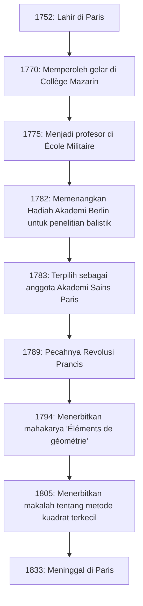
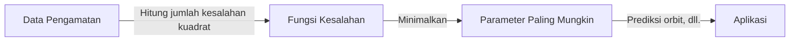

# [Adrien-Marie Legendre](https://kenji.blog/id/p/legendre/): Raksasa Bayangan Matematika dan Kehidupannya yang Penuh Gejolak

Dalam sejarah matematika, ada tokoh-tokoh yang namanya memahkotai banyak teorema dan konsep, namun kehidupan pribadi dan wajah asli mereka secara mengejutkan tetap tidak diketahui. Matematikawan besar Prancis **[Adrien-Marie Legendre](https://kenji.blog/id/p/legendre/)** (1752–1833) bisa dibilang adalah contoh utamanya.

Dalam artikel ini, kita mendalami kehidupan Legendre, kontribusinya yang luar biasa terhadap dunia matematika, perseteruan sengitnya dengan jenius kontemporer [Carl Friedrich Gauss](https://kenji.blog/id/p/gauss/), dan "misteri potret" yang baru terungkap akhir-akhir ini. Dengan melacak lintasan hidupnya, Anda akan dapat merasakan napas komunitas ilmiah Prancis dari abad ke-18 hingga abad ke-19.

## 1. Kehidupan dan Konteks Sejarah: Seorang Matematikawan yang Bertahan dari Prancis yang Penuh Gejolak

Legendre lahir pada 18 September 1752, dari keluarga yang sangat kaya di Paris, Prancis (meskipun beberapa teori menyarankan Toulouse, Paris adalah yang paling mungkin). Selama Ancien Régime sebelum Revolusi Prancis, ia dapat membenamkan dirinya dalam minat intelektualnya—yaitu, penelitian matematika dan fisika—tanpa kekhawatiran finansial.

Menerima pendidikan lanjutan di Collège Mazarin di Paris, bakatnya diakui sejak dini. Dari tahun 1775 hingga 1780, ia menjabat sebagai profesor matematika di École Militaire. Kemudian, pada tahun 1782, ia memenangkan hadiah dari Akademi Sains Berlin untuk risalahnya tentang balistik, membuatnya mendapatkan ketenaran internasional. Pencapaian ini mengarah pada pemilihannya sebagai anggota Akademi Sains Paris yang bergengsi pada tahun berikutnya, 1783.

Diagram di bawah ini menunjukkan garis waktu peristiwa-peristiwa besar dalam kehidupan Legendre.

Kehidupannya sangat terombang-ambing oleh Revolusi Prancis, yang pecah pada tahun 1789. Gelombang revolusi melucuti kekayaan pribadinya, untuk sementara waktu menjerumuskannya ke dalam kesulitan keuangan. Namun, ia tidak pernah kehilangan hasratnya terhadap matematika dan terus berkontribusi pada proyek-proyek ilmiah nasional, seperti standardisasi berat dan ukuran (pembentukan sistem metrik).

## 2. Kontribusi Abadi bagi Dunia Matematika

Pencapaian Legendre mencakup hampir semua bidang matematika pada masanya, termasuk teori bilangan, aljabar, analisis, dan geometri. Penelitiannya sering kali diselesaikan oleh para jenius lainnya (seperti Gauss, Abel, dan Jacobi), tetapi tanpa fondasi yang ia bangun, perkembangan dramatis mereka tidak akan mungkin terjadi.

### 2.1 Hasrat pada Teori Bilangan dan Simbol Legendre

Legendre sangat terpesona oleh teori bilangan, yang dipelopori oleh pendahulunya seperti [Pierre de Fermat](https://kenji.blog/id/p/fermat/) dan [Leonhard Euler](https://kenji.blog/id/p/euler/). Salah satu pencapaian terbesarnya adalah karyanya tentang "Hukum timbal balik kuadratik". Hukum ini adalah salah satu teorema paling indah dan penting dalam teori bilangan untuk menentukan apakah bilangan prima kongruen dengan modulo persegi bilangan prima lainnya.

Ia merumuskan hukum ini dan memberikan bukti parsial (bukti lengkap kemudian diberikan oleh Gauss muda). Selain itu, untuk mengungkapkan penelitian ini secara ringkas dan elegan, ia memperkenalkan notasi yang dikenal saat ini sebagai **simbol Legendre**.

$$
\left( \frac{a}{p} \right) = 
\begin{cases} 
1 & \text{jika } a \text{ adalah sisa kuadratik modulo } p \text{ dan } a \not\equiv 0 \pmod{p} \\
-1 & \text{jika } a \text{ adalah bukan sisa kuadratik modulo } p \\
0 & \text{jika } a \equiv 0 \pmod{p}
\end{cases}
$$

Berkat notasi terobosan ini, proposisi dan bukti kompleks dalam teori bilangan menjadi sangat transparan, membawa manfaat luar biasa bagi matematikawan berikutnya. Ia juga meninggalkan banyak jejak di jurang teori bilangan, seperti buktinya tentang [Teorema Terakhir Fermat](https://kenji.blog/id/p/fermats-last-theorem/) untuk $ n=5 $ (dibuktikan secara independen sekitar waktu yang sama oleh Dirichlet) dan dugaannya tentang teorema Dirichlet tentang progresi aritmatika.

### 2.2 Integral Eliptik dan Polinomial Legendre

Di bidang analisis, Legendre mendedikasikan waktu 40 tahun yang mencengangkan untuk mempelajari "integral eliptik". Ia menunjukkan bahwa semua integral eliptik dapat direduksi menjadi tiga bentuk standar dan membuat tabel numerik terperinci untuk integral tersebut.

$$
F(\phi, k) = \int_0^\phi \frac{d\theta}{\sqrt{1 - k^2 \sin^2 \theta}}
$$

Klasifikasinya, termasuk integral eliptik tidak lengkap jenis pertama seperti yang ditunjukkan di atas, menjadi standar dalam matematika selanjutnya. Tak lama setelah ia menyelesaikan karya monumental yang memuncak pada bidang ini, jenius muda Abel dan Jacobi memperkenalkan perspektif yang sama sekali baru yang disebut "fungsi eliptik" (fungsi invers dari integral eliptik), yang sepenuhnya menulis ulang bidang tersebut. Meskipun Legendre terkejut bahwa penelitian puluhan tahunnya telah menjadi usang, ia dengan jujur mengakui bakat muda mereka dan dengan penuh semangat memuji mereka—sebuah episode yang menunjukkan sikap tulusnya sebagai seorang sarjana.

Selain itu, dalam fisika dan teknik, terutama elektromagnetisme dan mekanika kuantum, **polinomial Legendre** selalu muncul saat memecahkan persamaan Laplace dalam koordinat bola. Ini adalah sistem polinomial ortogonal yang diperoleh sebagai solusi dari persamaan diferensial berikut (persamaan diferensial Legendre).

$$
(1-x^2)y'' - 2xy' + n(n+1)y = 0
$$

Polinomial ini telah menjadi alat yang sangat diperlukan dalam segala jenis perhitungan dalam sains dan teknologi modern.

### 2.3 'Éléments de géométrie' dan Dampak Besarnya pada Pendidikan Matematika

Bersamaan dengan kegiatan penelitiannya, Legendre juga seorang pendidik yang luar biasa. Bukunya "Éléments de géométrie" (Elemen Geometri), yang diterbitkan pada tahun 1794, menata ulang "Elemen" [Euclid](https://kenji.blog/id/p/euclid/) agar lebih mudah diakses dan ketat bagi siswa pada masanya.

Buku pelajaran ini mencapai kesuksesan fenomenal, diterjemahkan ke dalam bahasa Inggris dan bahasa lain serta dibaca di seluruh dunia, tidak hanya di Prancis. Buku ini diadopsi secara luas di Amerika Serikat dan tetap menjadi standar mutlak untuk pendidikan geometri sepanjang abad ke-19. Dalam buku ini, ia terus-menerus berusaha untuk membuktikan postulat paralel (postulat kelima [Euclid](https://kenji.blog/id/p/euclid/)), menambahkan bukti baru pada setiap edisi, meskipun pada akhirnya semuanya terbukti cacat. Namun, kegigihannya menjadi salah satu kekuatan pendorong penting yang mendorong lahirnya geometri non-[[Euclid](https://kenji.blog/id/p/euclid/)e](https://kenji.blog/p/euclid/)an.

### 2.4 Tantangan pada Teorema Bilangan Prima

Pertanyaan tentang bagaimana bilangan prima didistribusikan di antara bilangan asli telah lama memesona matematikawan. Legendre dengan susah payah memeriksa tabel bilangan prima dan, dengan ketajaman yang menakjubkan, menduga rumus perkiraan berikut untuk jumlah bilangan prima $ \pi(x) $ yang kurang dari atau sama dengan $ x $.

$$
\pi(x) \approx \frac{x}{\ln(x) - A}
$$

Berdasarkan data hitungan tangannya sendiri yang ekstensif, ia menyimpulkan bahwa konstanta $ A $ kira-kira $ 1.08366 $ (dalam edisi 1808 dari 'Théorie des Nombres'-nya). Rumus ini menunjukkan bahwa semakin besar $ x $, kepadatan distribusi bilangan prima mendekati $ \frac{1}{\ln(x)} $, sebuah wawasan yang sangat maju untuk matematika pada masa itu.

Belakangan terungkap bahwa Gauss juga membuat dugaan serupa menggunakan integral logaritmik $ \text{Li}(x) $, dan akhirnya, pada tahun 1896, teorema bilangan prima dibuktikan sepenuhnya dan secara independen oleh Jacques Hadamard dan Charles de la Vallée Poussin. Meskipun bukti yang ketat berada di luar jangkauannya, ini menunjukkan betapa benarnya intuisi Legendre pada dasarnya.

## 3. Perseteruan dengan Gauss: Tragedi Atas Penemuan Kuadrat Terkecil

Dalam membahas kehidupan Legendre, orang tidak dapat menghindari perselisihan prioritas yang sengit, terutama mengenai **[Metode Kuadrat Terkecil](https://kenji.blog/id/p/method-of-least-squares/)**, dengan [Carl Friedrich Gauss](https://kenji.blog/id/p/gauss/), "Pangeran Matematika" dari Jerman.

Pada tahun 1805, dalam bukunya tentang menghitung orbit komet, Legendre mengumumkan secara publik "[Metode Kuadrat Terkecil](https://kenji.blog/id/p/method-of-least-squares/)" untuk pertama kalinya di dunia—sebuah metode untuk menemukan nilai yang paling mungkin dengan meminimalkan kesalahan data pengamatan. Ini adalah teknik revolusioner yang membentuk dasar setiap bidang yang berhubungan dengan data, dari astronomi dan geodesi hingga statistik modern dan pembelajaran mesin.

Namun, empat tahun kemudian pada 1809, Gauss secara ekstensif menggunakan metode kuadrat terkecil dalam bukunya sendiri tentang mekanika angkasa, mengklaim, "Saya telah menggunakan metode ini secara rutin sejak 1795." Dari bukti sejarah, klaim Gauss dianggap benar, tetapi prioritas akademis publikasi tidak diragukan lagi milik Legendre.

Perilaku Gauss sangat melukai harga diri Legendre. Legendre mengirim surat kepada Gauss menuntutnya untuk mengakui publikasi sebelumnya, tetapi Gauss mempertahankan sikap dingin. Dalam lampiran karyanya sendiri, Legendre secara eksplisit mengungkapkan kemarahannya yang intens terhadap Gauss, yang menyatakan bahwa "orang tertentu mengklaim penemuan orang lain sebagai miliknya."

Lebih jauh, mengenai teorema bilangan prima (dugaan Legendre dari $ \pi(x) \approx \frac{x}{\ln x - 1.08366} $) dan hukum timbal balik kuadratik, meskipun Legendre telah menemukan dan merumuskannya terlebih dahulu, Gauss sepenuhnya membuktikan dan menggeneralisasikannya lebih dalam, menyebabkan semua pujian publik terfokus pada Gauss. Bagi Legendre, Gauss adalah dinding yang terlalu tinggi yang merenggut semua pencapaiannya, menjadi musuh bebuyutannya seumur hidup.

## 4. Misteri Potret: Kesalahpahaman Besar 200 Tahun

Episode paling aneh dan, bagi kita saat ini, yang paling lucu tentang Legendre berkaitan dengan misteri "potret"-nya.

Selama bertahun-tahun, di buku teks matematika dan buku sejarah sains di seluruh dunia, potret tertentu telah digunakan sebagai wajah [Adrien-Marie Legendre](https://kenji.blog/id/p/legendre/). Itu adalah litograf yang menggambarkan profil seorang pria dengan ekspresi buritan dan pemarah. Semua orang percaya tanpa keraguan bahwa ini adalah wajah matematikawan besar Legendre.

Namun, pada tahun 2005, sebuah fakta mengejutkan terungkap yang mengguncang komunitas sejarah matematika. Secara mengejutkan, potret yang telah diterbitkan sebagai "Matematikawan Legendre" selama lebih dari 200 tahun ternyata milik orang yang sama sekali berbeda: **Louis Legendre** (1752–1797), seorang politikus selama Revolusi Prancis!

Kesalahpahaman sejarah yang besar tercipta karena mereka memiliki nama keluarga yang sama "Legendre", lahir pada tahun yang sama persis 1752, tinggal di Paris selama era yang sama (Revolusi Prancis), dan lebih jauh lagi, karena matematikawan Legendre sangat tidak suka meninggalkan potret dirinya di depan umum.

Jadi, seperti apa tampang matematikawan asli Legendre?
Setelah kebenaran ini ditemukan, para sejarawan dengan putus asa mencari potret otentik. Akhirnya, pada 2008, karikatur kontemporer (gambar satir) yang menggambarkannya ditemukan di Arsip Nasional Prancis.

Di sana, alih-alih profil tegas politisi Louis Legendre, ada sosok pria tua yang montok, hangat, dan tampak sedikit tidak senang. Sisi manusianya—lelah akibat perdebatan dengan Gauss namun memuji bakat Abel dan Jacobi muda—tersampaikan dengan jelas dari lukisan cat air tersebut. Saat ini, karikatur ini diakui sebagai satu-satunya potret aslinya.

## 5. Kesimpulan

[Adrien-Marie Legendre](https://kenji.blog/id/p/legendre/) menutup usianya di Paris pada tahun 1833. Di tahun-tahun terakhirnya, ia menghadapi peristiwa-peristiwa malang, seperti diputusnya uang pensiun karena penentangannya terhadap kebijakan pemerintah.

Ia sering diperlakukan sebagai "tokoh bayangan" di hadapan kecemerlangan luar biasa dari para jenius tingkat atas pada masanya, seperti Gauss dan Laplace. Namun, perannya dalam membangun fondasi matematika modern tak terukur. Warisan yang ia tinggalkan, seperti polinomial Legendre, simbol Legendre, dan perumusan metode kuadrat terkecil, terus mendukung inti sains dan teknologi modern.

Kehidupannya diwarnai oleh takdir yang aneh, tidak hanya mencakup kesuksesan spektakuler tetapi juga penderitaan atas prioritas dan kebingungan anumerta akan potretnya. Saat kita menjumpai nama **Legendre** dalam rumus matematika dan fisika, mohon jangan hanya menganggapnya sebagai simbol, tetapi luangkan waktu sejenak untuk merenungkan kehidupan matematikawan hebat yang memiliki semangat gigih yang penuh dengan kemanusiaan ini.
