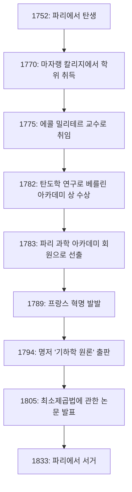

# [아드리앵마리 르장드르](https://kenji.blog/p/legendre/): 수학의 그림자 거인과 그의 파란만장한 생애

수학의 역사에는 수많은 정리와 개념에 이름이 붙어 있으면서도 개인적인 삶이나 진짜 모습은 놀라울 정도로 알려지지 않은 인물들이 있습니다. 위대한 프랑스 수학자 **[아드리앵마리 르장드르](https://kenji.blog/p/legendre/)** ([Adrien-Marie Legendre](https://kenji.blog/p/legendre/), 1752–1833)가 바로 그 대표적인 예라고 할 수 있습니다.

이 글에서는 르장드르의 생애, 그가 수학계에 남긴 엄청난 공헌, 동시대의 천재 [카를 프리드리히 가우스](https://kenji.blog/p/gauss/)와의 치열한 악연, 그리고 최근에야 밝혀진 '초상화의 미스터리'에 대해 깊이 파헤쳐 봅니다. 그의 삶의 궤적을 따라가다 보면 18세기에서 19세기에 이르는 프랑스 과학계의 숨결을 느낄 수 있을 것입니다.

## 1. 생애와 시대적 배경: 격동의 프랑스를 살아낸 수학자

르장드르는 1752년 9월 18일, 프랑스 파리의 매우 부유한 가정에서 태어났습니다 (툴루즈라는 설도 있지만 파리가 유력합니다). 프랑스 혁명 이전의 앙시앵 레짐 시기 동안, 그는 어떠한 경제적 걱정 없이 자신의 지적 관심사, 즉 수학과 물리학 연구에 몰두할 수 있었습니다.

파리의 마자랭 칼리지(Collège Mazarin)에서 고등 교육을 받은 그는 일찍부터 그 재능을 인정받았습니다. 1775년부터 1780년까지 에콜 밀리테르(육군사관학교)에서 수학 교수로 재직했습니다. 이후 1782년에는 탄도학에 관한 논문으로 베를린 과학 아카데미 상을 수상하며 국제적인 명성을 얻게 됩니다. 이 성과를 계기로 이듬해인 1783년, 명성 높은 파리 과학 아카데미의 회원으로 선출되었습니다.

아래 그림은 르장드르의 생애 주요 사건들을 보여주는 연대표입니다.

그의 삶은 1789년에 발발한 프랑스 혁명으로 인해 크게 요동쳤습니다. 혁명의 물결은 그에게서 개인적인 재산을 앗아갔고, 일시적으로 그를 경제적 궁핍에 빠뜨렸습니다. 그러나 그는 수학에 대한 열정을 잃지 않았고, 도량형의 표준화(미터법 제정)와 같은 국가적인 과학 프로젝트에 계속해서 공헌했습니다.

## 2. 수학계에 남긴 불멸의 공헌

르장드르의 업적은 정수론, 대수학, 해석학, 기하학 등 당시 수학의 거의 모든 분야에 걸쳐 있습니다. 그의 연구는 종종 다른 천재들(가우스, 아벨, 야코비 등)에 의해 완성되곤 했지만, 그가 다진 기초가 없었다면 그들의 비약적인 발전은 불가능했을 것입니다.

### 2.1 정수론에 대한 열정과 르장드르 기호

르장드르는 [피에르 드 페르마](https://kenji.blog/p/fermat/)와 [레온하르트 오일러](https://kenji.blog/p/euler/) 같은 선구자들이 개척한 정수론에 깊이 매료되었습니다. 그의 가장 위대한 업적 중 하나는 "이차 잉여의 상호 법칙"에 관한 연구입니다. 이 법칙은 어떤 소수가 다른 소수를 법으로 할 때 제곱수와 합동인지 여부를 판별하기 위한 정수론에서 가장 아름답고 중요한 정리 중 하나입니다.

그는 이 법칙을 공식화하고 부분적인 증명을 제시했습니다 (완전한 증명은 나중에 젊은 가우스에 의해 이루어집니다). 더욱이 이 연구를 간결하고 우아하게 표현하기 위해 오늘날 **르장드르 기호** 라고 불리는 표기법을 도입했습니다.

$$
\left( \frac{a}{p} \right) = 
\begin{cases} 
1 & \text{만약 } a \text{ 가 법 } p \text{ 에 대한 이차 잉여이고 } a \not\equiv 0 \pmod{p} \text{ 일 때} \\
-1 & \text{만약 } a \text{ 가 법 } p \text{ 에 대한 이차 비잉여일 때} \\
0 & \text{만약 } a \equiv 0 \pmod{p} \text{ 일 때}
\end{cases}
$$

이 획기적인 표기법 덕분에 정수론의 복잡한 명제와 증명은 매우 명확해졌고, 후대 수학자들에게 엄청난 혜택을 가져다주었습니다. 그는 또한 $ n=5 $ 일 때의 [페르마의 마지막 정리](https://kenji.blog/p/fermats-last-theorem/) 증명(디리클레와 거의 같은 시기에 독립적으로 증명)과 등차수열의 소수에 관한 디리클레 정리의 추측 등 정수론의 심연에 많은 발자취를 남겼습니다.

### 2.2 타원 적분과 르장드르 다항식

해석학 분야에서 르장드르는 '타원 적분' 연구에 무려 40년이라는 세월을 바쳤습니다. 그는 모든 타원 적분이 3가지 표준형으로 환원될 수 있음을 보여주었고, 이에 대한 상세한 수표를 작성했습니다.

$$
F(\phi, k) = \int_0^\phi \frac{d\theta}{\sqrt{1 - k^2 \sin^2 \theta}}
$$

위와 같은 제1종 불완전 타원 적분을 비롯한 그의 분류는 이후 수학의 표준이 되었습니다. 그가 이 분야를 집대성한 대작을 완성한 직후, 젊은 천재 아벨과 야코비가 '타원 함수'(타원 적분의 역함수)라는 전혀 새로운 관점을 도입하여 이 분야를 근본부터 다시 써버렸습니다. 르장드르는 수십 년간의 자신의 연구가 구식이 되었다는 사실에 충격을 받았지만, 젊은이들의 재능을 솔직하게 인정하고 열렬히 찬사했습니다. 이는 학자로서 그의 진정성 있는 태도를 보여주는 일화입니다.

또한 물리학과 공학, 특히 전자기학과 양자 역학에서 구면 좌표계의 라플라스 방정식을 풀 때 반드시 등장하는 것이 **르장드르 다항식** 입니다. 이는 다음 미분 방정식(르장드르의 미분 방정식)의 해로 얻어지는 직교 다항식계입니다.

$$
(1-x^2)y'' - 2xy' + n(n+1)y = 0
$$

이 다항식은 현대 과학 기술의 모든 계산에서 필수 불가결한 도구가 되었습니다.

### 2.3 '기하학 원론'과 수학 교육에 미친 지대한 영향

연구 활동과 병행하여 르장드르는 뛰어난 교육자이기도 했습니다. 1794년에 출판된 그의 저서 "기하학 원론 (Éléments de géométrie)"은 [유클리드](https://kenji.blog/p/euclid/)의 "원론"을 당시 학생들을 위해 더 이해하기 쉽고 엄밀하게 재구성한 것이었습니다.

이 교과서는 경이적인 성공을 거두며 프랑스뿐만 아니라 영어 등 다른 언어로 번역되어 전 세계에서 읽혔습니다. 미국에서도 널리 채택되어 19세기 내내 기하학 교육의 절대적인 표준으로 자리 잡았습니다. 그는 이 책에서 평행선 공준([유클리드](https://kenji.blog/p/euclid/)의 제5공준)을 증명하기 위해 끊임없이 시도했고, 판을 거듭할 때마다 새로운 증명을 추가했지만 결국 모두 결함이 있는 것으로 판명되었습니다. 그러나 그의 이러한 집념은 [비[유클리드](https://kenji.blog/p/euclid/) 기하학의 탄생](https://kenji.blog/p/non-euclidean-geometry/)을 촉구하는 중요한 원동력 중 하나가 되었습니다.

### 2.4 소수 정리의 추측

자연수 중에서 소수가 어떻게 분포하는지에 대한 문제는 오랫동안 수학자들을 매료시켰습니다. 르장드르는 소수표를 꼼꼼히 조사하여, $ x $ 이하의 소수의 개수 $ \pi(x) $ 에 대해 놀라운 예리함으로 다음과 같은 근사식을 추측했습니다.

$$
\pi(x) \approx \frac{x}{\ln(x) - A}
$$

그는 방대한 수작업 계산 데이터에 기반하여 상수 $ A $ 가 약 $ 1.08366 $ 이라고 추론했습니다 (1808년판 '정수론'에서). 이 공식은 $ x $ 가 커짐에 따라 소수 분포의 밀도가 $ \frac{1}{\ln(x)} $ 에 가까워짐을 시사하는 것으로, 당시 수학으로서는 매우 선구적인 통찰이었습니다.

나중에 가우스 역시 로그 적분 $ \text{Li}(x) $ 를 이용한 유사한 추측을 세웠다는 사실이 밝혀졌고, 마침내 1896년에 자크 아다마르와 샤를 드 라 발레푸생에 의해 독립적으로 소수 정리가 완전히 증명되었습니다. 엄밀한 증명은 그의 손이 미치지 못했지만, 르장드르의 직관이 본질적으로 얼마나 옳았는지를 보여줍니다.

## 3. 가우스와의 악연: [최소제곱법](https://kenji.blog/p/method-of-least-squares/) 발견을 둘러싼 비극

르장드르의 생애를 논할 때 빼놓을 수 없는 것이 독일의 "수학의 왕" [카를 프리드리히 가우스](https://kenji.blog/p/gauss/)와의 치열한 우선권 논쟁, 특히 **[최소제곱법](https://kenji.blog/p/method-of-least-squares/)** 을 둘러싼 갈등입니다.

1805년, 르장드르는 혜성의 궤도 계산에 관한 저서에서 관측 데이터의 오차를 최소화하여 가장 확률이 높은 값을 구하는 "[최소제곱법](https://kenji.blog/p/method-of-least-squares/)"을 세계 최초로 공식 발표했습니다. 이는 천문학과 측지학, 나아가 현대 통계학과 기계 학습에 이르기까지 데이터를 다루는 모든 분야의 기반이 되는 혁명적인 기법이었습니다.

그런데 그로부터 4년 후인 1809년, 가우스가 자신의 천체 역학 저서에서 [최소제곱법](https://kenji.blog/p/method-of-least-squares/)을 대대적으로 사용하며 "나는 1795년부터 이 기법을 일상적으로 사용해 왔다"고 주장했습니다. 역사적인 증거로 볼 때 가우스의 주장은 사실이었던 것으로 여겨지지만, 발표의 학술적 우선권은 의심할 여지 없이 르장드르에게 있었습니다.

가우스의 이러한 행동은 르장드르의 자존심에 깊은 상처를 입혔습니다. 르장드르는 가우스에게 편지를 보내 자신의 우선적인 발표를 인정해 줄 것을 요구했지만, 가우스는 냉담한 태도로 일관했습니다. 르장드르는 자신의 저작 부록에서 "어떤 사람이 다른 사람의 발견을 자신의 것이라고 주장하고 있다"며 가우스에 대한 격렬한 분노를 명시적으로 드러냈습니다.

더 나아가 소수 정리(르장드르의 추측 $ \pi(x) \approx \frac{x}{\ln x - 1.08366} $)나 이차 잉여의 상호 법칙에 관해서도, 르장드르가 먼저 발견하고 공식화했음에도 불구하고 가우스가 이를 완전히 증명하고 더 깊이 일반화했기 때문에 세상의 모든 찬사는 가우스에게 집중되었습니다. 르장드르에게 가우스는 자신의 업적을 모조리 앗아가는 너무나도 높은 벽이었으며, 평생의 숙적이 되고 말았습니다.

## 4. 초상화의 미스터리: 200년간의 거대한 착각

르장드르에 관한 가장 기이하고, 오늘날 우리에게 가장 흥미로운 일화는 그의 "초상화"에 얽힌 미스터리입니다.

오랜 세월 동안 전 세계의 수학 교과서나 과학사 서적에서는 [아드리앵마리 르장드르](https://kenji.blog/p/legendre/)의 얼굴로 특정 초상화 하나가 사용되어 왔습니다. 그것은 엄격하고 심술궂은 표정을 한 남자의 옆모습을 그린 판화였습니다. 누구나 의심 없이 이것이 위대한 수학자 르장드르의 얼굴이라고 믿었습니다.

그러나 2005년, 수학사 학계를 뒤흔드는 놀라운 사실이 발각됩니다. 충격적이게도 200년 이상 "수학자 르장드르"로 게재되어 온 그 초상화는 사실 그와는 전혀 다른 인물인 프랑스 혁명기의 정치인 **루이 르장드르** (Louis Legendre, 1752–1797)의 것이었던 것입니다!

이러한 역사적인 거대한 착각이 빚어진 것은 그들이 "르장드르"라는 같은 성을 가졌고, 1752년이라는 완전히 똑같은 해에 태어났으며, 같은 시대(프랑스 혁명기) 파리에서 살았고, 게다가 수학자 르장드르가 대중 앞에 자신의 초상화를 남기는 것을 극도로 싫어했기 때문이었습니다.

그렇다면 진짜 수학자 르장드르는 어떻게 생겼을까요?
이 진실이 밝혀진 후 역사가들은 필사적으로 진짜 초상화를 찾아 나섰습니다. 그리고 2008년, 마침내 프랑스 국립 문서 보관소에서 그가 그려진 당시의 캐리커처(풍자화)가 발견되었습니다.

그곳에는 정치인 루이 르장드르의 엄격한 옆모습 대신, 통통하고 따뜻하며 다소 불만스러운 표정을 지은 노년 남성의 모습이 있었습니다. 가우스와의 논쟁으로 신경을 쓰면서도 젊은 아벨과 야코비의 재능을 칭찬했던 그의 인간적인 면모가 그 수채화에서 생생하게 전해집니다. 현재 이 캐리커처는 그의 유일한 진짜 초상화로 인정받고 있습니다.

## 5. 맺음말

[아드리앵마리 르장드르](https://kenji.blog/p/legendre/)는 1833년 파리에서 생을 마감했습니다. 말년에는 정부 정책에 반대했다는 이유로 연금이 끊기는 등 불운한 일들을 겪기도 했습니다.

그는 동시대의 가우스나 라플라스와 같은 초일류 천재들의 압도적인 광채 앞에 종종 "그림자 같은 존재"로 취급되곤 합니다. 하지만 그가 현대 수학의 기초를 다지는 데 수행한 역할은 헤아릴 수 없습니다. 르장드르 다항식, 르장드르 기호, [최소제곱법](https://kenji.blog/p/method-of-least-squares/)의 공식화 등 그가 남긴 유산은 현대 과학 기술의 핵심을 계속해서 지탱하고 있습니다.

그의 인생은 화려한 성공뿐만 아니라 우선권을 둘러싼 고뇌와 사후 초상화가 뒤바뀌는 등의 기구한 운명으로 점철되어 있었습니다. 우리가 수학이나 물리학 공식 속에서 **르장드르** 라는 이름을 만났을 때, 부디 단순한 기호로만 생각하지 마시고 인간미 넘치고 불굴의 정신을 가졌던 이 위대한 수학자의 생애를 잠시나마 떠올려 보시기 바랍니다.
