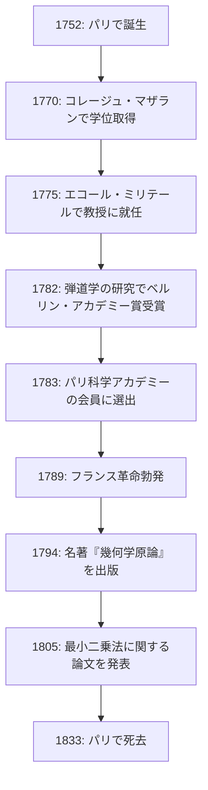
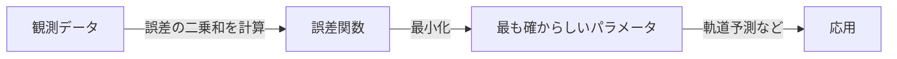

# [アドリアン＝マリ・ルジャンドル](https://kenji.blog/p/legendre/)：数学の影の巨人とその波乱に満ちた生涯

数学の歴史において、その名前が数多くの定理や概念に冠されながらも、個人的なエピソードや実像が意外なほど知られていない人物がいます。フランスの偉大な数学者 **[アドリアン＝マリ・ルジャンドル](https://kenji.blog/p/legendre/)** （[Adrien-Marie Legendre](https://kenji.blog/p/legendre/), 1752–1833）は、まさにその代表格と言えるでしょう。

本記事では、[ルジャンドル](https://kenji.blog/p/legendre/)の生涯、彼が数学界に残した多大なる貢献、同時代の天才[ガウス](https://kenji.blog/p/gauss/)との熾烈な確執、そして近年になってようやく判明した「肖像画の謎」について、深く掘り下げていきます。彼の人生の軌跡をたどることで、18世紀から19世紀にかけてのフランス科学界の息吹を感じ取ることができるはずです。

## 1. 生涯と時代背景：激動のフランスを生き抜いた数学者

[ルジャンドル](https://kenji.blog/p/legendre/)は1752年9月18日、フランスのパリ（またはトゥールーズという説もありますが、パリが有力です）で非常に裕福な家庭に生まれました。フランス革命前のアンシャン・レジーム期において、彼は経済的な心配をすることなく、自らの知的な興味、すなわち数学や物理学の研究に没頭することができました。

パリのコレージュ・マザラン（Collège Mazarin）で高度な教育を受けた彼は、若くしてその才能を認められ、1775年から1780年までエコール・ミリテール（陸軍士官学校）で数学の教授を務めました。その後、1782年には弾道学に関する論文でベルリン科学アカデミーの賞を受賞し、国際的な名声を得ることになります。この受賞がきっかけとなり、翌1783年には名門パリ科学アカデミーの会員に選出されました。

以下の図は、[ルジャンドル](https://kenji.blog/p/legendre/)の生涯における主要な出来事を示したタイムラインです。

彼の人生は、1789年に勃発したフランス革命によって大きく翻弄されます。革命の波は彼から個人的な財産を奪い去り、彼は一時的に経済的な困窮に陥りました。しかし、彼は数学への情熱を失うことはなく、その後も度量衡の標準化（メートル法の制定）に関わるなど、国家的な科学プロジェクトに貢献し続けました。

## 2. 数学界への不滅の貢献

[ルジャンドル](https://kenji.blog/p/legendre/)の業績は、数論、代数学、解析学、幾何学など、当時の数学のほぼすべての分野に及んでいます。彼の研究は、しばしば他の天才たち（ガウスやアーベル、[ヤコビ](https://kenji.blog/p/jacobi/)など）によって完成されることになりましたが、彼が築いた基礎がなければ、それらの飛躍的な発展はあり得ませんでした。

### 2.1 整数論への情熱と[ルジャンドル](https://kenji.blog/p/legendre/)記号

[ルジャンドル](https://kenji.blog/p/legendre/)は、ピエール・ド・フェルマーやレオンハルト・[オイラー](https://kenji.blog/p/euler/)といった先人たちが開拓した整数論に深く魅了されていました。彼の最大の功績の一つは、「平方剰余の相互法則（Law of quadratic reciprocity）」に関する研究です。この法則は、ある素数が別の素数を法として平方数に合同であるかどうかを判定するための、数論における最も美しく重要な定理の一つです。

彼はこの法則を定式化し、部分的な証明を与えました（完全な証明は後に若き[ガウス](https://kenji.blog/p/gauss/)によってなされます）。さらに、この研究を簡潔かつエレガントに表現するために、今日 **ルジャンドル記号** （[Legendre](https://kenji.blog/p/legendre/) symbol）と呼ばれる記法を導入しました。

$$
\left( \frac{a}{p} \right) = 
\begin{cases} 
1 & \text{if } a \text{ is a quadratic residue modulo } p \text{ and } a \not\equiv 0 \pmod{p} \\
-1 & \text{if } a \text{ is a quadratic non-residue modulo } p \\
0 & \text{if } a \equiv 0 \pmod{p}
\end{cases}
$$

この画期的な記法により、複雑な数論の命題や証明は極めて見通しが良くなり、後の数学者たちに多大な恩恵をもたらしました。また、[フェルマーの最終定理](https://kenji.blog/p/fermats-last-theorem/)の $ n=5 $ の場合の証明（ディリクレと同時期に独立して証明）や、等差数列中の素数に関するディリクレの定理の予想など、整数論の深淵に多くの足跡を残しています。

### 2.2 楕円積分と[ルジャンドル](https://kenji.blog/p/legendre/)多項式

解析学の分野において、[ルジャンドル](https://kenji.blog/p/legendre/)は「楕円積分」の研究に実に40年もの歳月を捧げました。彼はすべての楕円積分が3つの標準形に還元できることを示し、その詳細な数表を作成しました。

$$
F(\phi, k) = \int_0^\phi \frac{d\theta}{\sqrt{1 - k^2 \sin^2 \theta}}
$$

上記のような第一種楕円積分をはじめとする彼の分類は、その後の数学の標準となりました。彼がこの分野の集大成である大著を書き上げた直後、若き天才[アーベル](https://kenji.blog/p/abel/)とヤコビが「楕円関数（楕円積分の逆関数）」という全く新しい視点を導入し、この分野を根本から書き換えてしまいました。[ルジャンドル](https://kenji.blog/p/legendre/)は自身の長年の研究が時代遅れになったことにショックを受けつつも、彼ら若手の才能を素直に認め、熱烈に称賛したというエピソードは、彼の学者のとしての真摯な態度を示しています。

また、物理学や工学、特に電磁気学や量子力学において、球座標系でのラプラス方程式を解く際に必ず登場するのが **[ルジャンドル](https://kenji.blog/p/legendre/)多項式** です。これは以下の微分方程式（[ルジャンドル](https://kenji.blog/p/legendre/)の微分方程式）の解として得られる直交多項式系です。

$$
(1-x^2)y'' - 2xy' + n(n+1)y = 0
$$

この多項式は、現代の科学技術のあらゆる計算において不可欠なツールとなっています。

### 2.3 『幾何学原論』と数学教育への多大な影響

研究活動と並行して、[ルジャンドル](https://kenji.blog/p/legendre/)は優れた教育者でもありました。1794年に出版された彼の著書『幾何学原論（Éléments de géométrie）』は、[ユークリッド](https://kenji.blog/p/euclid/)の『原論』を当時の学生向けにわかりやすく、かつ厳密に再構成したものでした。

この教科書は驚異的な成功を収め、フランス国内のみならず、英語やその他の言語に翻訳されて世界中で読まれました。アメリカ合衆国でも広く採用され、19世紀を通じて幾何学教育の絶対的な標準であり続けました。彼はこの著書の中で、平行線公準（[ユークリッド](https://kenji.blog/p/euclid/)の第五公準）の証明を試み続け、版を重ねるごとに新しい証明を追加しましたが、結局それらはすべて間違いであることが判明しました。しかし、彼のこの執念は、非[ユークリッド幾何学の誕生](https://kenji.blog/p/non-euclidean-geometry/)を促す重要な原動力の一つとなりました。

### 2.4 素数定理への挑戦

素数が自然数の中にどのように分布しているかという問題は、古くから数学者たちを惹きつけてやみませんでした。[ルジャンドル](https://kenji.blog/p/legendre/)は、素数表を丹念に調べ上げ、$ x $ 以下の素数の個数 $ \pi(x) $ について、驚くべき鋭さで以下の近似式を予想しました。

$$
\pi(x) \approx \frac{x}{\ln(x) - A}
$$

彼は自らの膨大な手計算のデータに基づき、定数 $ A $ が約 $ 1.08366 $ であると推測しました（『整数論』1808年版）。この公式は、 $ x $ が大きくなるにつれて素数の分布の密度が $ \frac{1}{\ln(x)} $ に近づくことを示唆しており、当時の数学としては極めて先進的な洞察でした。

後に[ガウス](https://kenji.blog/p/gauss/)も対数積分 $ \text{Li}(x) $ を用いた類似の予想を立てていたことが判明し、最終的に1896年にジャック・アダマールとシャルル＝ジャン・ド・ラ・ヴァレ・プーサンによって、独立に素数定理が完全に証明されることになります。厳密な証明こそ彼の手には負えませんでしたが、[ルジャンドル](https://kenji.blog/p/legendre/)の直感がいかに本質を突いていたかが分かります。

## 3. [ガウス](https://kenji.blog/p/gauss/)との因縁：[最小二乗法](https://kenji.blog/p/method-of-least-squares/)の発見をめぐる悲劇

[ルジャンドル](https://kenji.blog/p/legendre/)の生涯を語る上で避けて通れないのが、ドイツの「数学の王」カール・フリードリヒ・ガウスとの熾烈な優先権争い、特に **[最小二乗法](https://kenji.blog/p/method-of-least-squares/)** をめぐる確執です。

1805年、[ルジャンドル](https://kenji.blog/p/legendre/)は彗星の軌道計算に関する著書の中で、観測データの誤差を最小化して最も確からしい値を求める「最小二乗法（[Method of Least Squares](https://kenji.blog/p/method-of-least-squares/)）」を世界で初めて公に発表しました。これは天文学や測地学、さらには現代の統計学や機械学習に至るまで、データを扱うあらゆる分野の基盤となる革命的な手法でした。

ところが、その4年後の1809年、[ガウス](https://kenji.blog/p/gauss/)が自身の天体力学の著書の中で最小二乗法を大々的に用いて見せ、「私は1795年からこの手法を日常的に使っていた」と主張したのです。歴史的な証拠から、ガウスのこの主張自体は事実であったと考えられていますが、学術的な発表の優先権は間違いなく[ルジャンドル](https://kenji.blog/p/legendre/)にありました。

この[ガウス](https://kenji.blog/p/gauss/)の振る舞いは、ルジャンドルのプライドを深く傷つけました。ルジャンドルはガウスに手紙を送り、自分が先に発表したことを認めるよう求めましたが、ガウスは冷淡な態度を取り続けました。ルジャンドルは自身の著作の付録の中で、「ある人物が、他人の発見を自分のものだと主張している」と[ガウス](https://kenji.blog/p/gauss/)への激しい怒りをも露わにしました。

さらに、素数定理（ $ \pi(x) \approx \frac{x}{\ln x - 1.08366} $ という[ルジャンドル](https://kenji.blog/p/legendre/)の予想）や、平方剰余の相互法則についても、ルジャンドルが先に発見・定式化していたにもかかわらず、ガウスがそれを完全に証明し、より深く一般化したため、世間の称賛はすべてガウスに集中してしまいました。ルジャンドルにとって、[ガウス](https://kenji.blog/p/gauss/)は自らの業績をことごとく奪い去っていく、高すぎる壁であり、生涯の宿敵となってしまったのです。

## 4. 肖像画の謎：200年間の大いなる勘違い

[ルジャンドル](https://kenji.blog/p/legendre/)に関する最も奇妙で、かつ現代の私たちにとって面白いエピソードは、彼の「肖像画」に関する謎です。

長年にわたり、世界中の数学の教科書や科学史の書籍において、[アドリアン＝マリ・ルジャンドル](https://kenji.blog/p/legendre/)の顔として、ある一枚の肖像画が使われ続けてきました。それは、横顔を描いた版画で、厳格で気難しそうな表情をした人物の絵でした。誰もが、これが偉大なる数学者[ルジャンドル](https://kenji.blog/p/legendre/)の顔だと信じて疑いませんでした。

しかし、2005年になって、数学史界を揺るがす驚くべき事実が発覚します。なんと、200年以上にわたって「数学者[ルジャンドル](https://kenji.blog/p/legendre/)」として掲載され続けてきたその肖像画は、彼とは全くの別人である **フランス革命期の政治家ルイ・ルジャンドル** （Louis [Legendre](https://kenji.blog/p/legendre/), 1752–1797）のものだったのです！

名前の姓が同じ「[ルジャンドル](https://kenji.blog/p/legendre/)」であったこと、そして両者が全く同じ1752年に生まれ、同時代（フランス革命期）のパリを生きていたこと、さらには数学者[ルジャンドル](https://kenji.blog/p/legendre/)が極端に公の場に肖像画を残すことを嫌っていたことが重なり、歴史的な大いなる勘違いが生み出されてしまったのです。

では、本物の数学者[ルジャンドル](https://kenji.blog/p/legendre/)はどのような顔をしていたのでしょうか？
この真実が発覚した後、歴史家たちは必死に本物の肖像画を探し求めました。そして2008年、ついにフランスの国立公文書館から、彼が描かれた当時のカリカチュア（風刺画）が発見されました。

そこには、政治家ルイ・[ルジャンドル](https://kenji.blog/p/legendre/)のような厳格な横顔ではなく、少し不機嫌そうな顔をした、ふくよかで温かみのある初老の男性の姿が描かれていました。ガウスとの論争で神経をすり減らしながらも、若きアーベルや[ヤコビ](https://kenji.blog/p/jacobi/)の才能を称賛した彼の人間臭い一面が、その水彩画からは生き生きと伝わってきます。現在では、このカリカチュアが唯一の確かな彼の肖像として認知されています。

## 5. 終わりに

[アドリアン＝マリ・ルジャンドル](https://kenji.blog/p/legendre/)は、1833年にパリでその生涯を閉じました。晩年は、政府の政策に反対したことで年金を打ち切られるなど、不遇な出来事もありました。

彼は、同時代の[ガウス](https://kenji.blog/p/gauss/)やラプラスといった超一級の天才たちの圧倒的な輝きの前に、しばしば「影の存在」として扱われがちです。しかし、彼が現代数学の基礎を築く上で果たした役割は計り知れません。ルジャンドル多項式、ルジャンドル記号、[最小二乗法](https://kenji.blog/p/method-of-least-squares/)の定式化など、彼が残した遺産は、現代の科学技術の根幹を支え続けています。

彼の人生は、華々しい成功だけでなく、優先権をめぐる苦悩や、後世における肖像画の取り違えといった、数奇な運命に彩られていました。私たちが数学や物理学の数式の中で **[ルジャンドル](https://kenji.blog/p/legendre/)** の名前に出会ったときは、単なる記号としてではなく、人間味あふれる不屈の精神を持った一人の偉大な数学者の生涯に、ぜひ思いを馳せてみてください。
