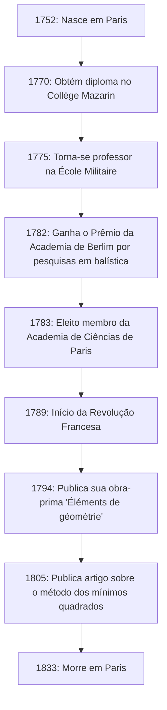

# Adrien-Marie Legendre: O Gigante das Sombras da Matemática e sua Vida Turbulenta

Na história da matemática, existem figuras cujos nomes coroam numerosos teoremas e conceitos, mas cujas vidas pessoais e verdadeiras imagens permanecem surpreendentemente desconhecidas. O grande matemático francês **Adrien-Marie Legendre** (1752–1833) é sem dúvida um excelente exemplo.

Neste artigo, nos aprofundamos na vida de Legendre, suas imensas contribuições para o mundo da matemática, sua feroz disputa com o gênio contemporâneo Carl Friedrich Gauss e o "mistério do retrato" que só foi desvendado recentemente. Ao traçar a trajetória de sua vida, você poderá sentir o sopro da comunidade científica francesa do século XVIII ao século XIX.

## 1. Vida e Contexto Histórico: Um Matemático Sobrevivendo a uma França Turbulenta

Legendre nasceu em 18 de setembro de 1752, em uma família muito rica em Paris, França (embora algumas teorias sugiram Toulouse, Paris é a mais provável). Durante o Antigo Regime, antes da Revolução Francesa, ele pôde mergulhar em seus interesses intelectuais — a saber, pesquisas matemáticas e físicas — sem quaisquer preocupações financeiras.

Recebendo uma educação avançada no Collège Mazarin em Paris, seus talentos foram reconhecidos desde cedo. De 1775 a 1780, ele atuou como professor de matemática na École Militaire. Mais tarde, em 1782, ele ganhou o prêmio da Academia de Ciências de Berlim por seu tratado sobre balística, ganhando fama internacional. Essa conquista o levou a ser eleito membro da prestigiada Academia de Ciências de Paris no ano seguinte, em 1783.

O diagrama abaixo mostra uma linha do tempo dos principais eventos da vida de Legendre.

Sua vida foi muito conturbada pela Revolução Francesa, que estourou em 1789. As ondas da revolução o despojaram de sua fortuna pessoal, jogando-o temporariamente em dificuldades financeiras. No entanto, ele nunca perdeu sua paixão pela matemática e continuou a contribuir para projetos científicos nacionais, como a padronização de pesos e medidas (o estabelecimento do sistema métrico).

## 2. Contribuições Imortais ao Mundo Matemático

As conquistas de Legendre abrangem quase todos os campos da matemática de seu tempo, incluindo teoria dos números, álgebra, análise e geometria. Suas pesquisas foram frequentemente concluídas por outros gênios (como Gauss, Abel e Jacobi), mas sem as bases que ele construiu, seus desenvolvimentos dramáticos não teriam sido possíveis.

### 2.1 Paixão pela Teoria dos Números e o Símbolo de Legendre

Legendre era profundamente fascinado pela teoria dos números, iniciada por predecessores como Pierre de Fermat e Leonhard Euler. Uma de suas maiores realizações é seu trabalho sobre a "Lei da reciprocidade quadrática". Esta lei é um dos teoremas mais belos e importantes da teoria dos números para determinar se um número primo é congruente a um quadrado módulo outro número primo.

Ele formulou essa lei e deu uma prova parcial (uma prova completa foi fornecida mais tarde pelo jovem Gauss). Além disso, para expressar essa pesquisa de forma concisa e elegante, ele introduziu uma notação conhecida hoje como o **símbolo de Legendre**.

$$
\left( \frac{a}{p} \right) = 
\begin{cases} 
1 & \text{se } a \text{ é um resíduo quadrático módulo } p \text{ e } a \not\equiv 0 \pmod{p} \\
-1 & \text{se } a \text{ é um não-resíduo quadrático módulo } p \\
0 & \text{se } a \equiv 0 \pmod{p}
\end{cases}
$$

Graças a essa notação inovadora, proposições e provas complexas na teoria dos números tornaram-se extremamente transparentes, trazendo imensos benefícios aos matemáticos posteriores. Ele também deixou muitas marcas no abismo da teoria dos números, como sua prova do Último Teorema de Fermat para $ n=5 $ (provado independentemente na mesma época por Dirichlet) e sua conjectura do teorema de Dirichlet sobre progressões aritméticas.

### 2.2 Integrais Elípticas e Polinômios de Legendre

No campo da análise, Legendre dedicou incríveis 40 anos ao estudo das "integrais elípticas". Ele mostrou que todas as integrais elípticas podem ser reduzidas a três formas padrão e criou tabelas numéricas detalhadas para elas.

$$
F(\phi, k) = \int_0^\phi \frac{d\theta}{\sqrt{1 - k^2 \sin^2 \theta}}
$$

Sua classificação, incluindo a integral elíptica incompleta de primeira espécie conforme mostrada acima, tornou-se o padrão na matemática subsequente. Pouco depois de concluir um trabalho monumental que culminou este campo, os jovens gênios Abel e Jacobi introduziram uma perspectiva inteiramente nova chamada "funções elípticas" (as funções inversas das integrais elípticas), reescrevendo o campo completamente. Embora Legendre tenha ficado chocado com o fato de que suas décadas de pesquisa haviam se tornado obsoletas, ele reconheceu honestamente o jovem talento deles e os elogiou apaixonadamente — um episódio que demonstra sua atitude sincera como acadêmico.

Além disso, na física e na engenharia, especialmente no eletromagnetismo e na mecânica quântica, os **polinômios de Legendre** aparecem invariavelmente ao resolver a equação de Laplace em coordenadas esféricas. Estes são um sistema de polinômios ortogonais obtidos como soluções da seguinte equação diferencial (equação diferencial de Legendre).

$$
(1-x^2)y'' - 2xy' + n(n+1)y = 0
$$

Esses polinômios tornaram-se uma ferramenta indispensável em todos os tipos de cálculos na ciência e tecnologia modernas.

### 2.3 'Éléments de géométrie' e seu Grande Impacto na Educação Matemática

Juntamente com suas atividades de pesquisa, Legendre também foi um educador notável. Seu livro "Éléments de géométrie" (Elementos de Geometria), publicado em 1794, reorganizou os "Elementos" de Euclides para torná-los mais acessíveis e rigorosos para os estudantes de sua época.

Este livro didático alcançou um sucesso fenomenal, sendo traduzido para o inglês e outros idiomas e lido em todo o mundo, não apenas na França. Foi amplamente adotado nos Estados Unidos e permaneceu o padrão absoluto para o ensino de geometria durante todo o século XIX. Neste livro, ele tentou continuamente provar o postulado das paralelas (o quinto postulado de Euclides), adicionando novas provas a cada edição, embora, no final, todas tenham se provado falhas. No entanto, sua persistência tornou-se uma das importantes forças motrizes que impulsionaram o nascimento da geometria não euclidiana.

### 2.4 Desafio ao Teorema dos Números Primos

A questão de como os números primos são distribuídos entre os números naturais há muito fascinava os matemáticos. Legendre examinou minuciosamente as tabelas de números primos e, com surpreendente perspicácia, conjecturou a seguinte fórmula de aproximação para o número de primos $ \pi(x) $ menores ou iguais a $ x $.

$$
\pi(x) \approx \frac{x}{\ln(x) - A}
$$

Com base em seus próprios extensos dados calculados à mão, ele deduziu que a constante $ A $ era aproximadamente $ 1.08366 $ (na edição de 1808 de sua 'Théorie des Nombres'). Esta fórmula sugeria que à medida que $ x $ cresce, a densidade da distribuição de números primos se aproxima de $ \frac{1}{\ln(x)} $, uma visão extremamente avançada para a matemática da época.

Mais tarde, foi revelado que Gauss também havia feito uma conjectura semelhante usando a integral logarítmica $ \text{Li}(x) $ e, finalmente, em 1896, o teorema dos números primos foi completa e independentemente provado por Jacques Hadamard e Charles de la Vallée Poussin. Embora uma prova rigorosa estivesse fora de seu alcance, isso mostra o quão essencialmente correta era a intuição de Legendre.

## 3. Disputa com Gauss: A Tragédia Sobre a Descoberta dos Mínimos Quadrados

Ao discutir a vida de Legendre, não se pode evitar a feroz disputa de prioridade, especialmente a respeito do **Método dos Mínimos Quadrados**, com Carl Friedrich Gauss, o "Príncipe da Matemática" da Alemanha.

Em 1805, em seu livro sobre o cálculo de órbitas de cometas, Legendre anunciou publicamente o "Método dos Mínimos Quadrados" pela primeira vez no mundo — um método para encontrar o valor mais provável minimizando os erros dos dados de observação. Esta foi uma técnica revolucionária que forma a base de todos os campos que lidam com dados, da astronomia e geodésia às estatísticas modernas e ao aprendizado de máquina.

No entanto, quatro anos depois, em 1809, Gauss usou extensivamente o método dos mínimos quadrados em seu próprio livro sobre mecânica celeste, alegando: "Tenho usado esse método rotineiramente desde 1795". A partir de evidências históricas, a alegação de Gauss é considerada verdadeira, mas a prioridade acadêmica da publicação inquestionavelmente pertencia a Legendre.

O comportamento de Gauss feriu profundamente o orgulho de Legendre. Legendre enviou uma carta a Gauss exigindo que ele reconhecesse sua publicação anterior, mas Gauss manteve uma atitude fria. No apêndice de seu próprio trabalho, Legendre expressou explicitamente sua intensa raiva de Gauss, afirmando que "certa pessoa está reivindicando a descoberta de outra como se fosse sua".

Além disso, em relação ao teorema dos números primos (conjectura de Legendre de $ \pi(x) \approx \frac{x}{\ln x - 1.08366} $) e à lei da reciprocidade quadrática, mesmo que Legendre os tenha descoberto e formulado primeiro, Gauss os provou completamente e os generalizou mais profundamente, fazendo com que todos os elogios públicos se concentrassem em Gauss. Para Legendre, Gauss era um muro alto demais que arrebatava todas as suas conquistas, tornando-se seu inimigo por toda a vida.

## 4. O Mistério do Retrato: Um Grande Mal-Entendido de 200 Anos

O episódio mais estranho e, para nós hoje, o mais divertido sobre Legendre diz respeito ao mistério do seu "retrato".

Durante muitos anos, em livros didáticos de matemática e de história da ciência em todo o mundo, um retrato em particular foi usado como sendo o rosto de Adrien-Marie Legendre. Era uma litografia retratando o perfil de um homem com uma expressão severa e ranzinza. Todos acreditavam, sem dúvida, que este era o rosto do grande matemático Legendre.

No entanto, em 2005, um fato surpreendente veio à tona, abalando a comunidade de história da matemática. De forma chocante, o retrato que havia sido publicado como o do "Matemático Legendre" por mais de 200 anos, na verdade, pertencia a uma pessoa completamente diferente: **Louis Legendre** (1752–1797), um político durante a Revolução Francesa!

Um grande mal-entendido histórico foi criado porque eles compartilhavam o mesmo sobrenome "Legendre", nasceram exatamente no mesmo ano de 1752, viveram em Paris durante a mesma época (a Revolução Francesa) e, além disso, porque o matemático Legendre não gostava muito de deixar retratos de si mesmo em público.

Então, como era o verdadeiro matemático Legendre?
Após a descoberta dessa verdade, os historiadores buscaram desesperadamente retratos autênticos. Finalmente, em 2008, foi descoberta nos Arquivos Nacionais da França uma caricatura contemporânea (desenho satírico) que o retratava.

Lá, em vez do perfil severo do político Louis Legendre, estava a figura de um homem rechonchudo, caloroso e de aparência ligeiramente descontente. Seu lado humano — exausto de discussões com Gauss, mas elogiando os talentos dos jovens Abel e Jacobi — é transmitido vividamente por aquela pintura em aquarela. Hoje, esta caricatura é reconhecida como o seu único retrato autêntico.

## 5. Conclusão

Adrien-Marie Legendre encerrou sua vida em Paris, em 1833. Em seus últimos anos, enfrentou acontecimentos infelizes, como o corte de sua pensão devido à sua oposição às políticas governamentais.

Muitas vezes, ele é tratado como uma "figura obscura" perante o brilho avassalador dos gênios de primeira linha da sua época, como Gauss e Laplace. No entanto, o papel que desempenhou na construção das fundações da matemática moderna é incomensurável. O legado que deixou, como os polinômios de Legendre, o símbolo de Legendre e a formulação do método dos mínimos quadrados, continua a apoiar o núcleo da ciência e da tecnologia modernas.

Sua vida foi marcada por um destino bizarro, incluindo não apenas sucessos espetaculares, mas também agonias em relação à prioridade e à confusão póstuma de seu retrato. Quando encontrarmos o nome **Legendre** nas fórmulas de matemática e física, por favor, não pensemos nele apenas como um símbolo, mas paremos um momento para refletir sobre a vida deste grande matemático que possuía um espírito indomável e cheio de humanidade.
