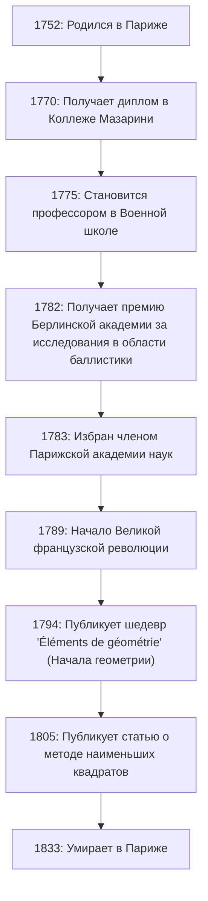

# [Адриен Мари Лежандр](https://kenji.blog/ru/p/legendre/): Теневой гигант математики и его бурная жизнь

В истории математики есть фигуры, чьи имена венчают многочисленные теоремы и концепции, однако их личная жизнь и истинный облик остаются удивительно неизвестными. Великий французский математик **[Адриен Мари Лежандр](https://kenji.blog/ru/p/legendre/)** (1752–1833), возможно, является ярким тому примером.

В этой статье мы глубоко погрузимся в жизнь Лежандра, его огромный вклад в математический мир, его ожесточенную вражду с гением-современником Карлом Фридрихом Гауссом и "тайну портрета", которая была разгадана совсем недавно. Проследив траекторию его жизни, вы сможете почувствовать дыхание французского научного сообщества XVIII-XIX веков.

## 1. Жизнь и исторический контекст: Математик, переживший бурную Францию

Лежандр родился 18 сентября 1752 года в очень богатой семье в Париже, Франция (хотя некоторые теории предполагают Тулузу, Париж является наиболее вероятным местом). Во время Старого порядка до Великой французской революции он мог погружаться в свои интеллектуальные интересы — а именно, математические и физические исследования — без каких-либо финансовых забот.

Получив передовое образование в Коллеже Мазарини в Париже, его таланты были признаны на раннем этапе. С 1775 по 1780 год он работал профессором математики в Военной школе (École Militaire). Позже, в 1782 году, он выиграл премию Берлинской академии наук за свой трактат по баллистике, что принесло ему международную известность. Это достижение привело к его избранию членом престижной Парижской академии наук в следующем, 1783 году.

Диаграмма ниже показывает хронологию основных событий в жизни Лежандра.

Его жизнь сильно потрясла Французская революция, разразившаяся в 1789 году. Волны революции лишили его личного состояния, временно ввергнув в финансовое бедствие. Однако он никогда не терял страсти к математике и продолжал вносить свой вклад в национальные научные проекты, такие как стандартизация мер и весов (создание метрической системы).

## 2. Бессмертный вклад в математический мир

Достижения Лежандра охватывают почти все области математики его времени, включая теорию чисел, алгебру, анализ и геометрию. Его исследования часто завершались другими гениями (такими как Гаусс, Абель и Якоби), но без заложенного им фундамента их впечатляющие разработки были бы невозможны.

### 2.1 Страсть к теории чисел и символ Лежандра

Лежандр был глубоко очарован теорией чисел, пионерами которой были такие предшественники, как [Пьер де Ферма](https://kenji.blog/ru/p/fermat/) и [Леонард Эйлер](https://kenji.blog/ru/p/euler/). Одним из его величайших достижений является работа над "Квадратичным законом взаимности". Этот закон является одной из самых красивых и важных теорем в теории чисел для определения того, сравнимо ли простое число с квадратом по модулю другого простого числа.

Он сформулировал этот закон и дал частичное доказательство (полное доказательство было позже предоставлено молодым Гауссом). Кроме того, чтобы выразить это исследование кратко и элегантно, он ввел обозначение, известное сегодня как **символ Лежандра**.

$$
\left( \frac{a}{p} \right) = 
\begin{cases} 
1 & \text{если } a \text{ - квадратичный вычет по модулю } p \text{ и } a \not\equiv 0 \pmod{p} \\
-1 & \text{если } a \text{ - квадратичный невычет по модулю } p \\
0 & \text{если } a \equiv 0 \pmod{p}
\end{cases}
$$

Благодаря этому новаторскому обозначению сложные утверждения и доказательства в теории чисел стали чрезвычайно прозрачными, принеся огромную пользу последующим математикам. Он также оставил много следов в глубинах теории чисел, таких как его доказательство Великой теоремы Ферма для $ n=5 $ (доказано независимо примерно в то же время Дирихле) и его гипотеза о теореме Дирихле об арифметических прогрессиях.

### 2.2 Эллиптические интегралы и полиномы Лежандра

В области анализа Лежандр посвятил поразительные 40 лет изучению "эллиптических интегралов". Он показал, что все эллиптические интегралы могут быть сведены к трем стандартным формам, и создал для них подробные числовые таблицы.

$$
F(\phi, k) = \int_0^\phi \frac{d\theta}{\sqrt{1 - k^2 \sin^2 \theta}}
$$

Его классификация, включающая неполный эллиптический интеграл первого рода, показанный выше, стала стандартом в последующей математике. Вскоре после того, как он завершил монументальную работу, увенчавшую эту область, молодые гении Абель и Якоби представили совершенно новую перспективу под названием "эллиптические функции" (функции, обратные эллиптическим интегралам), полностью переписав эту область. Хотя Лежандр был потрясен тем, что его десятилетия исследований устарели, он честно признал их молодой талант и страстно хвалил их — эпизод, который демонстрирует его искреннее отношение как ученого.

Кроме того, в физике и инженерии, особенно в электромагнетизме и квантовой механике, **многочлены Лежандра** неизменно появляются при решении уравнения Лапласа в сферических координатах. Это система ортогональных многочленов, полученных как решения следующего дифференциального уравнения (дифференциальное уравнение Лежандра).

$$
(1-x^2)y'' - 2xy' + n(n+1)y = 0
$$

Эти многочлены стали незаменимым инструментом во всех видах расчетов в современной науке и технике.

### 2.3 'Éléments de géométrie' и его огромное влияние на математическое образование

Наряду со своей исследовательской деятельностью, Лежандр был выдающимся педагогом. Его книга "Éléments de géométrie" (Начала геометрии), опубликованная в 1794 году, реорганизовала "Начала" [Евклид](https://kenji.blog/ru/p/euclid/)а, чтобы сделать их более доступными и строгими для студентов его времени.

Этот учебник имел феноменальный успех, был переведен на английский и другие языки и читался во всем мире, а не только во Франции. Он был широко принят в Соединенных Штатах и оставался абсолютным стандартом математического образования в области геометрии на протяжении всего XIX века. В этой книге он постоянно пытался доказать постулат о параллельных прямых (пятый постулат [Евклид](https://kenji.blog/ru/p/euclid/)а), добавляя новые доказательства в каждое издание, хотя в конечном итоге все они оказались ошибочными. Однако его настойчивость стала одной из важных движущих сил, способствовавших рождению неевклидовой геометрии.

### 2.4 Вызов теореме о распределении простых чисел

Вопрос о том, как простые числа распределены среди натуральных чисел, долгое время очаровывал математиков. Лежандр кропотливо изучал таблицы простых чисел и с поразительной остротой высказал гипотезу о следующей аппроксимирующей формуле для количества простых чисел $ \pi(x) $ меньших или равных $ x $.

$$
\pi(x) \approx \frac{x}{\ln(x) - A}
$$

Основываясь на собственных обширных данных, рассчитанных вручную, он пришел к выводу, что константа $ A $ составляла примерно $ 1.08366 $ (в издании его 'Théorie des Nombres' 1808 года). Эта формула предполагала, что по мере роста $ x $ плотность распределения простых чисел приближается к $ \frac{1}{\ln(x)} $, что было чрезвычайно передовым прозрением для математики того времени.

Позже выяснилось, что Гаусс также высказал подобную гипотезу, используя интегральный логарифм $ \text{Li}(x) $, и, наконец, в 1896 году [теорема о распределении простых чисел](/ru/p/prime-number-theorem-overview/) была полностью и независимо доказана Жаком Адамаром и Шарлем де ла Валле-Пуссеном. Хотя строгое доказательство было ему не по силам, это показывает, насколько по сути правильной была интуиция Лежандра.

## 3. Вражда с Гауссом: Трагедия открытия метода наименьших квадратов

Обсуждая жизнь Лежандра, нельзя обойти стороной ожесточенный спор о приоритете, особенно в отношении **Метода наименьших квадратов**, с Карлом Фридрихом Гауссом, "Королем математиков" из Германии.

В 1805 году в своей книге о вычислении орбит комет Лежандр впервые в мире публично объявил о "Методе наименьших квадратов" — методе нахождения наиболее вероятного значения путем минимизации ошибок данных наблюдений. Это был революционный метод, который составляет основу любой области, связанной с данными, от астрономии и геодезии до современной статистики и машинного обучения.

Однако четыре года спустя, в 1809 году, Гаусс широко использовал [метод наименьших квадратов](/ru/p/method-of-least-squares/) в своей собственной книге по небесной механике, заявив: "Я постоянно пользуюсь этим методом с 1795 года". Из исторических свидетельств заявление Гаусса считается правдивым, но академический приоритет публикации, несомненно, принадлежал Лежандру.

Поведение Гаусса глубоко уязвило гордость Лежандра. Лежандр послал Гауссу письмо с требованием признать его более раннюю публикацию, но Гаусс сохранил холодное отношение. В приложении к своей собственной работе Лежандр открыто выразил свой сильный гнев по отношению к Гауссу, заявив, что "некий человек выдает открытие другого за свое собственное".

Кроме того, что касается теоремы о простых числах (гипотеза Лежандра $ \pi(x) \approx \frac{x}{\ln x - 1.08366} $) и закона квадратичной взаимности, хотя Лежандр первым открыл и сформулировал их, Гаусс полностью доказал их и более глубоко обобщил, в результате чего все публичные похвалы сосредоточились на Гауссе. Для Лежандра Гаусс был слишком высокой стеной, которая отняла все его достижения, став его заклятым врагом на всю жизнь.

## 4. Тайна портрета: Великое недоразумение длиной в 200 лет

Самый странный и, для нас сегодня, самый забавный эпизод, касающийся Лежандра, связан с тайной его "портрета".

В течение многих лет в учебниках по математике и книгах по истории науки по всему миру в качестве лица Адриена Мари Лежандра использовался один конкретный портрет. Это была литография, изображающая профиль человека со строгим, сварливым выражением лица. Все без тени сомнения верили, что это было лицо великого математика Лежандра.

Однако в 2005 году выяснился поразительный факт, который потряс сообщество историков математики. Как это ни шокирует, портрет, который более 200 лет публиковался как "Математик Лежандр", на самом деле принадлежал совершенно другому человеку: **Луи Лежандру** (1752–1797), политику времен Французской революции!

Великое историческое недоразумение возникло из-за того, что они имели одну и ту же фамилию "Лежандр", родились в один и тот же 1752 год, жили в Париже в одну и ту же эпоху (Французская революция), и, кроме того, математик Лежандр крайне не любил оставлять свои портреты на публике.

Так как же выглядел настоящий математик Лежандр?
После того как эта правда была раскрыта, историки отчаянно искали подлинные портреты. Наконец, в 2008 году в Национальном архиве Франции была обнаружена современная ему карикатура (сатирический рисунок) с его изображением.

Там вместо строгого профиля политика Луи Лежандра была фигура полного, теплого, слегка недовольного на вид пожилого человека. Его человеческая сторона — измученная спорами с Гауссом, но все же восхваляющая таланты молодых Абеля и Якоби — живо передана на этой акварельной картине. Сегодня эта карикатура признана его единственным подлинным портретом.

## 5. Заключение

[Адриен Мари Лежандр](https://kenji.blog/ru/p/legendre/) завершил свою жизнь в Париже в 1833 году. В последние годы своей жизни он столкнулся с прискорбными событиями, такими как прекращение выплаты пенсии из-за его оппозиции политике правительства.

Его часто рассматривают как "фигуру в тени" перед подавляющим блеском гениев первого уровня его времени, таких как Гаусс и Лаплас. Однако роль, которую он сыграл в создании основ современной математики, неизмерима. Наследие, которое он оставил после себя, такое как полиномы Лежандра, символ Лежандра и формулировка метода наименьших квадратов, продолжает поддерживать ядро современной науки и техники.

Его жизнь была окрашена причудливой судьбой, включающей не только впечатляющие успехи, но и мучения из-за приоритета и посмертную путаницу с его портретом. Когда мы встречаем имя **Лежандр** в формулах математики и физики, пожалуйста, не думайте о нем просто как о символе, а найдите минутку, чтобы поразмыслить над жизнью этого великого математика, который обладал неукротимым духом, полным человечности.
