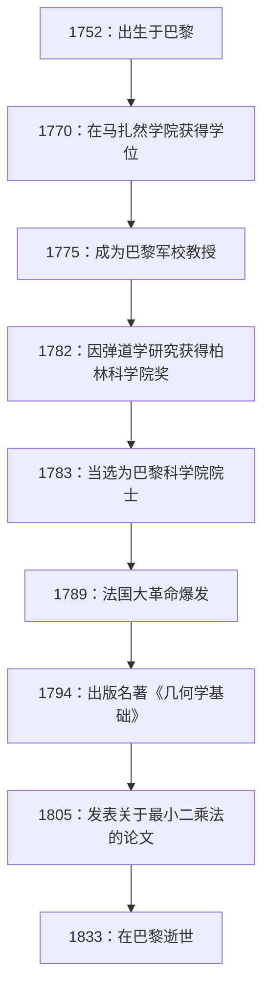
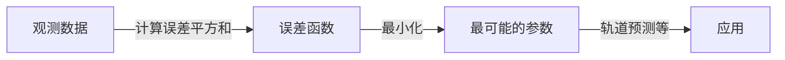

# [阿德里安-马里·勒让德](https://kenji.blog/zh-cn/p/legendre/)：数学的影子巨人及其跌宕起伏的一生

在数学史上，有些人的名字为众多定理和概念加冕，但他们的个人生活和真实面貌却令人惊讶地鲜为人知。法国伟大的数学家 **[阿德里安-马里·勒让德](https://kenji.blog/zh-cn/p/legendre/)** （[Adrien-Marie Legendre](https://kenji.blog/zh-cn/p/legendre/)，1752–1833）可以说就是一个典型的例子。

在本文中，我们将深入探讨勒让德的一生、他对数学界的巨大贡献、与同时代天才[卡尔·弗里德里希·高斯](https://kenji.blog/zh-cn/p/gauss/)的激烈恩怨，以及直到最近才被解开的“肖像之谜”。通过追寻他的人生轨迹，您将能够感受到18世纪到19世纪法国科学界的气息。

## 1. 生平与时代背景：在动荡的法国中幸存的数学家

勒让德于1752年9月18日出生于法国巴黎一个非常富裕的家庭（尽管有说法认为是图卢兹，但巴黎的可能性最大）。在法国大革命爆发前的旧制度时期，他能够毫无经济后顾之忧地沉浸在自己的智力兴趣——即数学和物理研究中。

他在巴黎马扎然学院（Collège Mazarin）接受了高等教育，其才华很早就得到了认可。从1775年到1780年，他在巴黎军校（École Militaire）担任数学教授。后来，在1782年，他凭借关于弹道学的论文获得了柏林科学院奖，从而获得了国际声誉。这一成就使他在第二年（1783年）当选为著名的巴黎科学院院士。

下图展示了勒让德一生中重大事件的时间表。

他的一生受到了1789年爆发的法国大革命的巨大冲击。革命的浪潮剥夺了他的个人财产，使他一度陷入经济困境。然而，他从未失去对数学的热情，并继续为国家科学项目做出贡献，例如度量衡的标准化（公制的建立）。

## 2. 对数学界的不朽贡献

勒让德的成就几乎涵盖了他那个时代数学的所有领域，包括数论、代数、分析和几何。他的研究经常由其他天才（如高斯、阿贝尔和雅可比）来完成，但如果没有他建立的基础，他们后来的戏剧性发展是不可能实现的。

### 2.1 对数论的热爱与勒让德符号

勒让德对由[皮埃尔·德·费马](https://kenji.blog/zh-cn/p/fermat/)和[莱昂哈德·欧拉](https://kenji.blog/zh-cn/p/euler/)等前辈开创的数论深深着迷。他最伟大的成就之一是他在“二次互反律”方面的工作。该定律是数论中最优美和最重要的定理之一，用于判断一个素数对另一个素数取模时是否与一个完全平方数同余。

他阐述了这一定律并给出了部分证明（后来由年轻的高斯给出了完整的证明）。此外，为了简洁优美地表达这项研究，他引入了今天被称为 **勒让德符号** 的记号。

$$
\left( \frac{a}{p} \right) = 
\begin{cases} 
1 & \text{如果 } a \text{ 是模 } p \text{ 的二次剩余，且 } a \not\equiv 0 \pmod{p} \\
-1 & \text{如果 } a \text{ 是模 } p \text{ 的二次非剩余} \\
0 & \text{如果 } a \equiv 0 \pmod{p}
\end{cases}
$$

得益于这种开创性的记号，数论中复杂的命题和证明变得非常清晰，给后来的数学家带来了巨大的便利。他还在数论的深渊中留下了许多足迹，例如他证明了[费马大定理](https://kenji.blog/zh-cn/p/fermats-last-theorem/)在 $ n=5 $ 时的情况（与狄利克雷在同一时期独立证明），以及他对关于等差数列的狄利克雷定理的猜想。

### 2.2 椭圆积分与勒让德多项式

在分析领域，勒让德惊人地花了40年的时间研究“椭圆积分”。他证明了所有的椭圆积分都可以简化为三种标准形式，并为它们制作了详细的数值表。

$$
F(\phi, k) = \int_0^\phi \frac{d\theta}{\sqrt{1 - k^2 \sin^2 \theta}}
$$

他的分类，包括如上所示的第一类不完全椭圆积分，成为后来数学的标准。就在他完成了该领域集大成的宏伟著作后不久，年轻的天才阿贝尔和雅可比引入了一个全新的视角，称为“椭圆函数”（椭圆积分的反函数），彻底重写了该领域。尽管勒让德对自己几十年的研究变得过时感到震惊，但他诚实地认可了这些年轻人的才华并热情地赞扬了他们——这一插曲展示了他作为学者的真诚态度。

此外，在物理学和工程学，特别是电磁学和量子力学中，在球坐标系中求解拉普拉斯方程时必然会出现 **勒让德多项式**。它们是一组正交多项式，作为以下微分方程（勒让德微分方程）的解而获得。

$$
(1-x^2)y'' - 2xy' + n(n+1)y = 0
$$

这些多项式已成为现代科学技术中各种计算不可或缺的工具。

### 2.3 《几何学基础》及其对数学教育的巨大影响

除了他的研究活动之外，勒让德还是一位杰出的教育家。他于1794年出版的《几何学基础》（Éléments de géométrie）一书重新组织了[欧几里得](https://kenji.blog/zh-cn/p/euclid/)的《几何原本》，使其对他那个时代的学者来说更容易理解、更严谨。

这本教科书取得了惊人的成功，被翻译成英语和其他语言，并在全世界阅读，而不仅仅是在法国。它在美国被广泛采用，并在整个19世纪一直是几何教育的绝对标准。在这本书中，他不断尝试证明平行公设（[欧几里得](https://kenji.blog/zh-cn/p/euclid/)的第五公设），在每个版本中都增加新的证明，尽管最终它们都被证明是有缺陷的。然而，他的执着成为了促使非欧几何诞生的重要原动力之一。

### 2.4 对素数定理的挑战

素数在自然数中是如何分布的，这个问题长期以来一直吸引着数学家。勒让德煞费苦心地研究了素数表，并以惊人的敏锐度猜想了以下关于小于或等于 $ x $ 的素数个数 $ \pi(x) $ 的近似公式。

$$
\pi(x) \approx \frac{x}{\ln(x) - A}
$$

基于他自己大量手工计算的数据，他推断常数 $ A $ 约为 $ 1.08366 $（在1808年版的《数论》中）。该公式表明，随着 $ x $ 变大，素数分布的密度接近 $ \frac{1}{\ln(x)} $，这在当时的数学中是极其先进的见解。

后来发现高斯也使用对数积分 $ \text{Li}(x) $ 做出了类似的猜想，最终在1896年，素数定理被雅克·阿达马和夏尔·德·拉瓦莱-普桑完全独立地证明。虽然严格的证明超出了他的能力范围，但它表明勒让德的直觉在本质上是多么正确。

## 3. 与高斯的恩怨：关于[最小二乘法](https://kenji.blog/zh-cn/p/method-of-least-squares/)发现的悲剧

在讨论勒让德的一生时，我们无法避开他与德国“数学王子”[卡尔·弗里德里希·高斯](https://kenji.blog/zh-cn/p/gauss/)之间激烈的优先权之争，尤其是关于 **[最小二乘法](https://kenji.blog/zh-cn/p/method-of-least-squares/)** 的争论。

1805年，在关于计算彗星轨道的著作中，勒让德在世界上首次公开发表了“[最小二乘法](https://kenji.blog/zh-cn/p/method-of-least-squares/)”——一种通过最小化观测数据的误差来寻找最可能值的方法。这是一项革命性的技术，构成了处理数据的每个领域的基础，从天文学和大地测量学到现代统计学和机器学习。

然而，四年后的1809年，高斯在他自己的天体力学著作中广泛使用了[最小二乘法](https://kenji.blog/zh-cn/p/method-of-least-squares/)，并声称：“我从1795年起就经常使用这种方法了。”从历史证据来看，高斯的说法被认为是真实的，但发表的学术优先权无疑属于勒让德。

高斯的行为深深伤害了勒让德的自尊。勒让德给高斯写了一封信，要求他承认自己先前的发表，但高斯保持冷淡的态度。在勒让德自己著作的附录中，他明确表达了对高斯的强烈愤怒，称“某人正将别人的发现据为己有”。

此外，关于素数定理（勒让德的猜想 $ \pi(x) \approx \frac{x}{\ln x - 1.08366} $）和二次互反律，即使勒让德首先发现并表述了它们，高斯却完全证明了它们，并对其进行了更深层次的推广，导致所有的公众赞誉都集中在高斯身上。对勒让德来说，高斯是一座太高的墙，夺走了他所有的成就，成为他一生的宿敌。

## 4. 肖像之谜：长达200年的巨大误会

关于勒让德最奇怪，也是对今天的我们来说最有趣的插曲，是关于他的“肖像”之谜。

多年来，在世界各地的数学教科书和科学史书籍中，一幅特定的肖像一直被用作[阿德里安-马里·勒让德](https://kenji.blog/zh-cn/p/legendre/)的面孔。那是一幅描绘了一个表情严厉、暴躁的男人侧脸的石版画。每个人都毫不怀疑这就是伟大的数学家勒让德的面孔。

然而在2005年，一个令人震惊的事实曝光了，震撼了数学史界。令人震惊的是，作为“数学家勒让德”出版了200多年的肖像，实际上属于一个完全不同的人：法国大革命时期的政治家 **路易·勒让德**（Louis Legendre，1752–1797）！

造成这个巨大的历史误会是因为他们有着相同的姓氏“勒让德”，出生在完全相同的年份1752年，生活在同一时代的巴黎（法国大革命时期），而且更重要的是，数学家勒让德极其讨厌在公众场合留下自己的肖像。

那么，真正的数学家勒让德长什么样呢？
在这个真相被发现后，历史学家们拼命寻找真实的肖像。最终在2008年，在法国国家档案馆发现了一幅描绘他的同时代的漫画（讽刺画）。

在那里，不再是政治家路易·勒让德严厉的侧面，而是一个矮胖、温暖、看起来略微不满的老人的形象。他那充满人情味的一面——疲于与高斯争论，却赞扬年轻的阿贝尔和雅可比的才华——通过那幅水彩画生动地传达出来。今天，这幅漫画被公认为他唯一真实的肖像。

## 5. 结语

[阿德里安-马里·勒让德](https://kenji.blog/zh-cn/p/legendre/)于1833年在巴黎结束了他的一生。晚年，他面临着不幸的事件，例如由于反对政府政策而被切断了养老金。

在他同时代的顶尖天才如高斯和拉普拉斯的压倒性光芒面前，他经常被视为一个“影子人物”。然而，他在奠定现代数学基础方面所发挥的作用是不可估量的。他留下的遗产，如勒让德多项式、勒让德符号和[最小二乘法](https://kenji.blog/zh-cn/p/method-of-least-squares/)的公式化，继续支撑着现代科学技术的核心。

他的一生被一种离奇的命运所染，不仅包括惊人的成功，还有对优先权的痛苦以及死后对其肖像的混淆。当我们在数学和物理学的公式中遇到 **勒让德** 这个名字时，请不要仅仅把他当作一个符号，而是花点时间回味这位拥有不屈不挠精神、充满人性的伟大数学家的一生。
