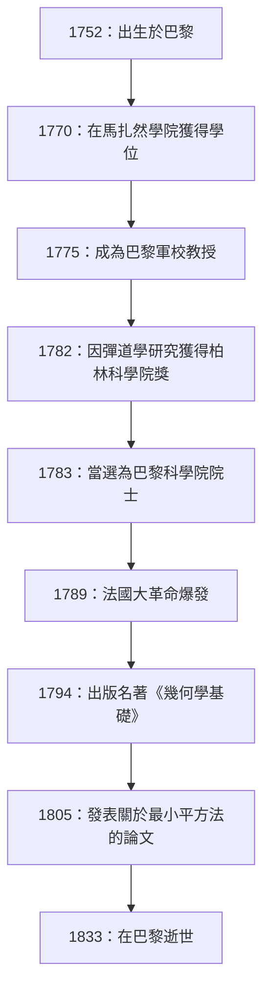
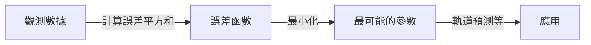

# [阿德里安-馬里·勒讓德](https://kenji.blog/zh-tw/p/legendre/)：數學的影子巨人及其跌宕起伏的一生

在數學史上，有些人的名字為眾多定理和概念加冕，但他們的個人生活和真實面貌卻令人驚訝地鮮為人知。法國偉大的數學家 **[阿德里安-馬里·勒讓德](https://kenji.blog/zh-tw/p/legendre/)** （[Adrien-Marie Legendre](https://kenji.blog/zh-tw/p/legendre/)，1752–1833）可以說就是一個典型的例子。

在本文中，我們將深入探討勒讓德的一生、他對數學界的巨大貢獻、與同時代天才[卡爾·弗里德里希·高斯](https://kenji.blog/zh-tw/p/gauss/)的激烈恩怨，以及直到最近才被解開的「肖像之謎」。透過追尋他的人生軌跡，您將能夠感受到18世紀到19世紀法國科學界的氣息。

## 1. 生平與時代背景：在動盪的法國中倖存的數學家

勒讓德於1752年9月18日出生於法國巴黎一個非常富裕的家庭（儘管有說法認為是圖盧茲，但巴黎的可能性最大）。在法國大革命爆發前的舊制度時期，他能夠毫無經濟後顧之憂地沉浸在自己的智力興趣——即數學和物理研究中。

他在巴黎馬扎然學院（Collège Mazarin）接受了高等教育，其才華很早就得到了[認可](https://kenji.blog/zh-tw/p/oauth2-oidc-authentication-authorization-difference/)。從1775年到1780年，他在巴黎軍校（École Militaire）擔任數學教授。後來，在1782年，他憑藉關於彈道學的論文獲得了柏林科學院獎，從而獲得了國際聲譽。這一成就使他在第二年（1783年）當選為著名的巴黎科學院院士。

下圖展示了勒讓德一生中重大事件的時間表。

他的一生受到了1789年爆發的法國大革命的巨大衝擊。革命的浪潮剝奪了他的個人財產，使他一度陷入經濟困境。然而，他從未失去對數學的熱情，並繼續為國家科學項目做出貢獻，例如度量衡的標準化（公制的建立）。

## 2. 對數學界的不朽貢獻

勒讓德的成就幾乎涵蓋了他那個時代數學的所有領域，包括數論、代數、分析和幾何。他的研究經常由其他天才（如高斯、阿貝爾和雅可比）來完成，但如果沒有他建立的基礎，他們後來的戲劇性發展是不可能實現的。

### 2.1 對數論的熱愛與勒讓德符號

勒讓德對由[皮埃爾·德·費馬](https://kenji.blog/zh-tw/p/fermat/)和萊昂哈德·歐拉等前輩開創的數論深深著迷。他最偉大的成就之一是他在「二次互反律」方面的工作。該定律是數論中最優美和最重要的定理之一，用於判斷一個質數對另一個質數取模時是否與一個完全平方數同餘。

他闡述了這一定律並給出了部分證明（後來由年輕的高斯給出了完整的證明）。此外，為了簡潔優美地表達這項研究，他引入了今天被稱為 **勒讓德符號** 的記號。

$$
\left( \frac{a}{p} \right) = 
\begin{cases} 
1 & \text{如果 } a \text{ 是模 } p \text{ 的二次剩餘，且 } a \not\equiv 0 \pmod{p} \\
-1 & \text{如果 } a \text{ 是模 } p \text{ 的二次非剩餘} \\
0 & \text{如果 } a \equiv 0 \pmod{p}
\end{cases}
$$

得益於這種開創性的記號，數論中複雜的命題和證明變得非常清晰，給後來的數學家帶來了巨大的便利。他還在數論的深淵中留下了許多足跡，例如他證明了[費馬最後定理](https://kenji.blog/zh-tw/p/fermats-last-theorem/)在 $ n=5 $ 時的情況（與狄利克雷在同一時期獨立證明），以及他對關於等差數列的狄利克雷定理的猜想。

### 2.2 橢圓積分與勒讓德多項式

在分析領域，勒讓德驚人地花了40年的時間研究「橢圓積分」。他證明了所有的橢圓積分都可以簡化為三種標準形式，並為它們製作了詳細的數值表。

$$
F(\phi, k) = \int_0^\phi \frac{d\theta}{\sqrt{1 - k^2 \sin^2 \theta}}
$$

他的分類，包括如上所示的第一類不完全橢圓積分，成為後來數學的標準。就在他完成了該領域集大成的宏偉著作後不久，年輕的天才阿貝爾和雅可比引入了一個全新的視角，稱為「橢圓函數」（橢圓積分的反函數），徹底重寫了該領域。儘管勒讓德對自己幾十年的研究變得過時感到震驚，但他誠實地[認可](https://kenji.blog/zh-tw/p/oauth2-oidc-authentication-authorization-difference/)了這些年輕人的才華並熱情地讚揚了他們——這一插曲展示了他作為學者的真誠態度。

此外，在物理學和工程學，特別是電磁學和量子力學中，在球座標系中求解拉普拉斯方程時必然會出現 **勒讓德多項式**。它們是一組正交多項式，作為以下微分方程（勒讓德微分方程）的解而獲得。

$$
(1-x^2)y'' - 2xy' + n(n+1)y = 0
$$

這些多項式已成為現代科學技術中各種計算不可或缺的工具。

### 2.3 《幾何學基礎》及其對數學教育的巨大影響

除了他的研究活動之外，勒讓德還是一位傑出的教育家。他於1794年出版的《幾何學基礎》（Éléments de géométrie）一書重新組織了[歐幾里得](https://kenji.blog/zh-tw/p/euclid/)的《幾何原本》，使其對他那個時代的學者來說更容易理解、更嚴謹。

這本教科書取得了驚人的成功，被翻譯成英語和其他語言，並在全世界閱讀，而不僅僅是在法國。它在美國被廣泛採用，並在整個19世紀一直是幾何教育的絕對標準。在這本書中，他不斷嘗試證明平行公設（[歐幾里得](https://kenji.blog/zh-tw/p/euclid/)的第五公設），在每個版本中都增加新的證明，儘管最終它們都被證明是有缺陷的。然而，他的執著成為了促使非歐幾何誕生的重要原動力之一。

### 2.4 對質數定理的挑戰

質數在自然數中是如何分布的，這個問題長期以來一直吸引著數學家。勒讓德煞費苦心地研究了質數表，並以驚人的敏銳度猜想了以下關於小於或等於 $ x $ 的質數個數 $ \pi(x) $ 的近似公式。

$$
\pi(x) \approx \frac{x}{\ln(x) - A}
$$

基於他自己大量手工計算的數據，他推斷常數 $ A $ 約為 $ 1.08366 $（在1808年版的《數論》中）。該公式表明，隨著 $ x $ 變大，質數分布的密度接近 $ \frac{1}{\ln(x)} $，這在當時的數學中是極其先進的見解。

後來發現高斯也使用對數積分 $ \text{Li}(x) $ 做出了類似的猜想，最終在1896年，質數定理被雅克·阿達馬和夏爾·德·拉瓦萊-普桑完全獨立地證明。雖然嚴格的證明超出了他的能力範圍，但它表明勒讓德的直覺在本質上是多麼正確。

## 3. 與高斯的恩怨：關於[最小平方法](https://kenji.blog/zh-tw/p/method-of-least-squares/)發現的悲劇

在討論勒讓德的一生時，我們無法避開他與德國「數學王子」[卡爾·弗里德里希·高斯](https://kenji.blog/zh-tw/p/gauss/)之間激烈的優先權之爭，尤其是關於 **[最小平方法](https://kenji.blog/zh-tw/p/method-of-least-squares/)** 的爭論。

1805年，在關於計算彗星軌道的著作中，勒讓德在世界上首次公開發表了「[最小平方法](https://kenji.blog/zh-tw/p/method-of-least-squares/)」——一種透過最小化觀測數據的誤差來尋找最可能值的方法。這是一項革命性的技術，構成了處理數據的每個領域的基礎，從天文學和大地測量學到現代統計學和機器學習。

然而，四年後的1809年，高斯在他自己的天體力學著作中廣泛使用了[最小平方法](https://kenji.blog/zh-tw/p/method-of-least-squares/)，並聲稱：「我從1795年起就經常使用這種方法了。」從歷史證據來看，高斯的說法被認為是真實的，但發表的學術優先權無疑屬於勒讓德。

高斯的行為深深傷害了勒讓德的自尊。勒讓德給高斯寫了一封信，要求他承認自己先前的發表，但高斯保持冷淡的態度。在勒讓德自己著作的附錄中，他明確表達了對高斯的強烈憤怒，稱「某人正將別人的發現據為己有」。

此外，關於質數定理（勒讓德的猜想 $ \pi(x) \approx \frac{x}{\ln x - 1.08366} $）和二次互反律，即使勒讓德首先發現並表述了它們，高斯卻完全證明了它們，並對其進行了更深層次的推廣，導致所有的公眾讚譽都集中在高斯身上。對勒讓德來說，高斯是一座太高的牆，奪走了他所有的成就，成為他一生的宿敵。

## 4. 肖像之謎：長達200年的巨大誤會

關於勒讓德最奇怪，也是對今天的我們來說最有趣的插曲，是關於他的「肖像」之謎。

多年來，在世界各地的數學教科書和科學史書籍中，一幅特定的肖像一直被用作[阿德里安-馬里·勒讓德](https://kenji.blog/zh-tw/p/legendre/)的面孔。那是一幅描繪了一個表情嚴厲、暴躁的男人側臉的石版畫。每個人都毫不懷疑這就是偉大的數學家勒讓德的面孔。

然而在2005年，一個令人震驚的事實曝光了，震撼了數學史界。令人震驚的是，作為「數學家勒讓德」出版了200多年的肖像，實際上屬於一個完全不同的人：法國大革命時期的政治家 **路易·勒讓德**（Louis [Legendre](https://kenji.blog/zh-tw/p/legendre/)，1752–1797）！

造成這個巨大的歷史誤會是因為他們有著相同的姓氏「勒讓德」，出生在完全相同的年份1752年，生活在同一時代的巴黎（法國大革命時期），而且更重要的是，數學家勒讓德極其討厭在公眾場合留下自己的肖像。

那麼，真正的數學家勒讓德長什麼樣呢？
在這個真相被發現後，歷史學家們拼命尋找真實的肖像。最終在2008年，在法國國家檔案館發現了一幅描繪他的同時代的漫畫（諷刺畫）。

在那裡，不再是政治家路易·勒讓德嚴厲的側面，而是一個矮胖、溫暖、看起來略微不滿的老人的形象。他那充滿人情味的一面——疲於與高斯爭論，卻讚揚年輕的阿貝爾和雅可比的才華——透過那幅水彩畫生動地傳達出來。今天，這幅漫畫被公認為他唯一真實的肖像。

## 5. 結語

[阿德里安-馬里·勒讓德](https://kenji.blog/zh-tw/p/legendre/)於1833年在巴黎結束了他的一生。晚年，他面臨著不幸的事件，例如由於反對政府政策而被切斷了養老金。

在他同時代的頂尖天才如高斯和拉普拉斯的壓倒性光芒面前，他經常被視為一個「影子人物」。然而，他在奠定現代數學基礎方面所發揮的作用是不可估量的。他留下的遺產，如勒讓德多項式、勒讓德符號和[最小平方法](https://kenji.blog/zh-tw/p/method-of-least-squares/)的公式化，繼續支撐著現代科學技術的核心。

他的一生被一種離奇的命運所染，不僅包括驚人的成功，還有對優先權的痛苦以及死後對其肖像的混淆。當我們在數學和物理學的公式中遇到 **勒讓德** 這個名字時，請不要僅僅把他當作一個符號，而是花點時間回味這位擁有不屈不撓精神、充滿人性的偉大數學家的一生。
