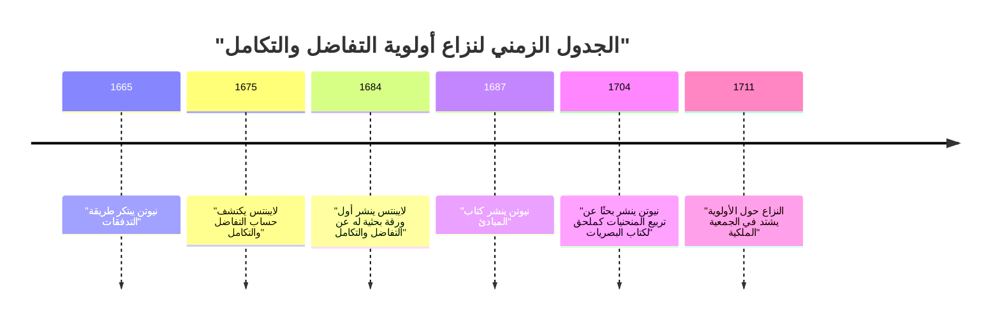
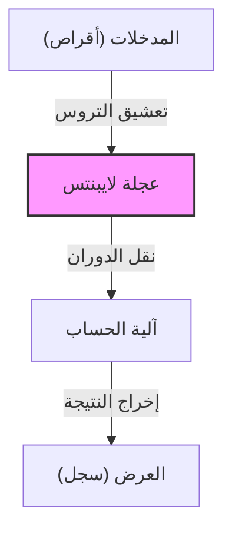

## مقدمة

غوتفريد فيلهلم لايبنتس (1646–1716) كان فيلسوفًا وعالم رياضيات وعالمًا ألمانيًا نشط خلال القرنين السابع عشر والثامن عشر. يُعترف به تاريخيًا كواحد من المثقفين النادرين الذين يستحقون لقب "العبقري العالمي". الإرث الذي تركه لا يشمل فقط الرياضيات والفلسفة بل يمتد أيضًا إلى القانون، والعلوم السياسية، والتاريخ، واللاهوت، واللغويات، وحتى الجيولوجيا والهندسة.

أفكاره، التي أرست الأساس للعلم الحديث، لم تكن مجرد تراكم للمعرفة، بل كانت مدعومة برؤية عظيمة تُعرف باسم *Characteristica universalis* (الخاصية العالمية) — وهي محاولة لدمج جميع مجالات التعلم. في هذا المقال، سنركز على حلقات من حياة لايبنتس المضطربة وإنجازاته الرياضية التي تشكل أساس العلوم والتكنولوجيا الحديثة، مع تقديم شرح متعمق لعالم أفكاره العميق.

## 1. الحياة والقصص: مسار العبقري

لم تكن حياة لايبنتس حياة باحث منعزل محبوس في برج عاجي؛ بل كانت مرتبطة ارتباطًا وثيقًا بأنشطته كدبلوماسي ومستشار سياسي يسافر في جميع أنحاء أوروبا.

### 1.1 الحياة المبكرة والموهبة المبكرة

في 1 يوليو 1646، وُلد لايبنتس في لايبزيغ، في الإمبراطورية الرومانية المقدسة (ألمانيا الحالية). والده، أستاذ الفلسفة الأخلاقية في جامعة لايبزيغ، توفي عندما كان لايبنتس في السادسة من عمره فقط. ومع ذلك، المكتبة الضخمة التي تركها والده عززت بشكل كبير فضوله الفكري. حتى قبل أن يتعلم في المدرسة، قرأ بشكل مستقل الأدب اللاتيني واليوناني في مكتبة والده، وأتقن أساسيات الفلسفة والمنطق.

يُقال إنه نظم الشعر باللاتينية في سن الثامنة وفهم بعمق منطق أرسطو في سن الثانية عشرة. في سن الخامسة عشرة، التحق بجامعة لايبزيغ لدراسة الفلسفة والقانون. ثم انتقل إلى جامعة ألتدورف، حيث حصل على الدكتوراه في القانون في سن مبكرة وهي عشرين عامًا. عرضت عليه الجامعة منصب أستاذ، لكنه رفض البقاء في الأوساط الأكاديمية، مفضلاً الأنشطة العملية في العالم الحقيقي.

### 1.2 المهنة كدبلوماسي والسنوات في باريس

بدأ لايبنتس حياته المهنية كدبلوماسي في خدمة أمير ناخب ماينتس. كانت ألمانيا في ذلك الوقت لا تزال تحمل ندوب حرب الثلاثين عامًا العميقة، وكرس نفسه للمشاريع السياسية والقانونية التي تهدف إلى الحفاظ على السلام.

في عام 1672، سافر إلى باريس في مهمة دبلوماسية جريئة (الخطة المصرية) لتحويل التهديد عن ألمانيا من خلال توجيه الملك لويس الرابع عشر ملك فرنسا نحو حملة في مصر. على الرغم من فشل هذه الخطة في النهاية، إلا أن إقامته في باريس أصبحت **أكبر نقطة تحول** في حياة لايبنتس الأكاديمية.

كانت باريس المركز الفكري لأوروبا في ذلك الوقت، وكان لديه الفرصة للتفاعل مع كبار العلماء وعلماء الرياضيات، بمن فيهم كريستيان هوغنس. بفضل دراسته المكثفة للرياضيات المتطورة تحت إشراف هوغنس، حقق لايبنتس قفزة مذهلة، واكتشف بشكل مستقل حساب التفاضل والتكامل في غضون بضع سنوات فقط.

### 1.3 الأنشطة في هانوفر والمساهمات في مجالات مختلفة

في عام 1676، بدأ لايبنتس في خدمة دوقية هانوفر (لاحقًا انتخابية براونشفايغ-لونيبورغ) كمستشار خاص وأمين مكتبة. هناك، تعامل مع مجموعة واسعة من المهام العملية، بما في ذلك تجميع تاريخ الدوقية وتصميم مضخات الصرف لمناجم جبال هارتس.

في مشروع التعدين على وجه الخصوص، ابتكر نظام ضخ متقدم باستخدام طاقة الرياح، ولكن ثبت صعوبة تحقيقه بالمعايير التكنولوجية في ذلك الوقت، مما أدى إلى انتكاسة. ومع ذلك، أدت ملاحظاته الجيولوجية خلال هذه الفترة إلى كتابة العمل الرائد *Protogaea* حول أصل الأرض، والذي أثر بشكل عميق على الجيولوجيا اللاحقة.

### 1.4 الصعوبات في السنوات الأخيرة والموت وحيدًا

اقترح لايبنتس إنشاء أكاديميات علمية على مختلف الملوك وشغل منصب أول رئيس لأكاديمية العلوم البروسية، ولعب دورًا مركزيًا في الشبكة الأكاديمية الأوروبية. كما حظي بمقابلة مع بطرس الأكبر إمبراطور روسيا وقدم نصائح حول إصلاح نظام التعليم الروسي.

ومع ذلك، في سنواته الأخيرة، تشوهت سمعته بشدة بسبب "النزاع حول أولوية حساب التفاضل والتكامل" الذي اندلع مع [إسحاق نيوتن](https://kenji.blog/ar/p/newton/). علاوة على ذلك، حتى بعد مغادرة سيده في هانوفر إلى لندن كملك بريطانيا العظمى جورج الأول، أُمر لايبنتس بإكمال تجميع كتب التاريخ وأُجبر على البقاء في هانوفر، وعانى من فترة من المحن. عندما توفي عن عمر يناهز 70 عامًا في 1716، يُقال إن سكرتيره فقط هو من حضر جنازته.

## 2. الإنجازات الرياضية: بناء أساس العلم الحديث

أعظم الموروثات التي تركها لايبنتس للعلم الحديث هي بلا شك إنشاء النظام الرمزي لحساب التفاضل والتكامل واقتراح النظام الثنائي.

### 2.1 اكتشاف التفاضل والتكامل وتنقيح الرموز

أدرك لايبنتس بوضوح أن مشكلة إيجاد المماس لمنحنى (التفاضل) ومشكلة إيجاد المساحة المحصورة بمنحنى (التكامل) هما عمليتان عكسيتان (النظرية الأساسية لحساب التفاضل والتكامل)، وصاغ هذا كخوارزمية قابلة للحساب.

$$
\int f(x) \,dx \quad \text{و} \quad \frac{d}{dx}f(x)
$$

رمز التكامل $\int$ (حرف S ممدود، من الكلمة اللاتينية *Summa*) ورمز التفاضل $d$ (من *differentia*، والتي تعني الفرق)، والتي نستخدمها بشكل طبيعي اليوم، تم اختراعها من قبل لايبنتس. نظرًا لأن تدوينه كان بديهيًا للغاية ومناسبًا للحساب الميكانيكي، فقد أدى إلى تسريع تطور الرياضيات في قارة أوروبا بشكل كبير. كما صاغ قاعدة الضرب للتفاضل (قاعدة لايبنتس).

$$
d(uv) = u \, dv + v \, du
$$

### 2.2 نزاع الأولوية مع نيوتن

حول حساب التفاضل والتكامل، وقعت واحدة من أشهر الخلافات في تاريخ العلوم مع الإنجليزي [إسحاق نيوتن](https://kenji.blog/ar/p/newton/). كان نيوتن قد توصل إلى مفهوم حساب التفاضل والتكامل (طريقة التدفقات) قبل لايبنتس ولكنه لم ينشره لفترة طويلة. في غضون ذلك، اكتشف لايبنتس حساب التفاضل والتكامل بشكل مستقل ونشره أولاً في ورقة بحثية عام 1684.

اليوم، الإجماع الشائع بين المؤرخين هو أن **كلا الرجلين اكتشفا حساب التفاضل والتكامل بشكل مستقل تمامًا**. بينما كانت طريقة نيوتن متجذرة في الفيزياء وعلم الحركة، كانت طريقة لايبنتس مبنية على نهج أكثر رسمية وجبرية.

### 2.3 إنشاء النظام الثنائي

النظام الثنائي، الذي يعبر عن جميع الأرقام باستخدام "0" و "1" فقط ويشكل أساس أجهزة الكمبيوتر الحديثة، تم وصفه أيضًا بشكل منهجي لأول مرة في العالم بواسطة لايبنتس. ابتكر هذا النظام الثنائي بربطه بفكره اللاهوتي القائل بأن العالم بأسره خُلق من العدم (0) والله (1).

$$
13_{10} = 1101_{2}
$$

$$
1 \times 2^3 + 1 \times 2^2 + 0 \times 2^1 + 1 \times 2^0 = 8 + 4 + 0 + 1 = 13
$$

لاحظ لايبنتس أيضًا أن المخططات السداسية الأربعة والستين في الكتاب الصيني القديم *I Ching* (مجموعات الين واليانغ) تتطابق تمامًا مع نظامه الثنائي، ووجد صلة عميقة بالفلسفة الشرقية.

### 2.4 المحددات وأنظمة المعادلات الخطية

في حل أنظمة المعادلات الخطية، توصل لايبنتس بشكل مستقل إلى مفهوم "المحدد" في نفس الوقت تقريبًا مع عالم الرياضيات الياباني سيكي تاكاكازو. لقد تعامل مع المعاملات كمصفوفة وابتكر طريقة لإزالتها بشكل منهجي، متخذًا خطوة مهمة نحو التطور اللاحق للجبر الخطي.

### 2.5 اختراع الآلة الحاسبة المتدرجة

لم يكن لايبنتس عالم رياضيات نظريًا فحسب، بل كان أيضًا مخترعًا عمليًا نحت اسمه في تاريخ الآلات الحاسبة الميكانيكية. قام بتحسين آلة [بليز باسكال](https://kenji.blog/ar/p/pascal/) الحاسبة (باسكالين)، والتي كانت لا تستطيع سوى الجمع والطرح، واخترع آلة حاسبة باستخدام "عجلة لايبنتس" قادرة على الضرب والقسمة.

كانت هذه الآلية ثورية واستمر اعتمادها كهيكل قياسي للآلات الحاسبة الميكانيكية على مدى مئات السنين القادمة.

## 3. الفلسفة والفكر: المونادولوجيا والتناغم الأزلي

كانت مساعي لايبنتس الرياضية مرتبطة ارتباطًا وثيقًا بنظامه الفلسفي الكبير. تعتبر فلسفته واحدة من قمم العقلانية.

### 3.1 المونادولوجيا

في عمله الفلسفي التمثيلي، *Monadology* (المونادولوجيا)، جادل بأن العالم يتكون من "المونادات"، وهي جواهر روحية نهائية تفتقر إلى الامتداد المكاني وغير قابلة للتجزئة.

على عكس الذرات المادية، كل موناد هو وحدة روحية لها إدراكها الخاص. كما يوحي قوله الشهير "المونادات ليس لها نوافذ"، لا تتفاعل المونادات بشكل مباشر مع بعضها البعض.

### 3.2 التناغم الأزلي

إذا كان الأمر كذلك، فلماذا يعمل عالم يتكون من مونادات بلا نوافذ بمثل هذا التناغم؟ أوضح لايبنتس أن الله قد برمج مسبقًا انتقال الحالات الداخلية لجميع المونادات لتكون متزامنة تمامًا. أطلق على هذا اسم "التناغم الأزلي" أو "التناغم المقرر سلفًا".

### 3.3 مبدأ السبب الكافي

قدم لايبنتس أيضًا مساهمات كبيرة في المنطق. اقترح "مبدأ السبب الكافي"، والذي ينص على أنه "لا يمكن أن تكون أي حقيقة واقعة أو موجودة وأي بيان صحيحًا دون وجود سبب كافٍ لكونه كذلك وليس غير ذلك". أصبح هذا المبدأ التوجيهي لاستفساراته العلمية والفلسفية.

## 4. الخاصية العالمية وحلم الذكاء الاصطناعي

اعتقد لايبنتس أنه يمكن اختزال الفكر البشري في الحساب الرياضي. حلم ببناء "خاصية عالمية" (*Characteristica universalis*) ترمز إلى جميع المفاهيم، و "حساب العقل" (*Calculus ratiocinator*) لمعالجة هذه الرموز وفقًا للقواعد.

العبارة التي تركها وراءه، "دعونا نحسب" (*Calculemus*)، ترمز إلى مثله الأعلى المتمثل في استخلاص الحقيقة من خلال الحساب بدلاً من الجدال كلما ظهرت خلافات. كان هذا المفهوم رائدًا للمنطق الرمزي ورؤية تاريخية تتصل مباشرة بالنظريات الحسابية ل[آلان تورينج](https://kenji.blog/ar/p/turing/) والمفهوم الحديث لـ **الذكاء الاصطناعي (AI)**.

## 5. خاتمة

من خلال عقله الفذ، وسع غوتفريد فيلهلم لايبنتس حدود المعرفة البشرية بشكل كبير في كل الاتجاهات. بدون نظامه الرمزي لحساب التفاضل والتكامل، كان تطور الفيزياء والهندسة الحديثة مستحيلاً، وبدون نظامه الثنائي، لن يكون مجتمع الكمبيوتر الحديث لدينا موجودًا.

على الرغم من أنه قضى سنواته الأخيرة في محنة بسبب نزاعه مع نيوتن والظروف السياسية، فإن بذور البحث الفكري التي زرعها تستمر في الازدهار بثراء في العالم الحديث بعد مئات السنين. لايبنتس هو حقًا "عبقري عالمي" يستمر في التألق عبر العصور.
