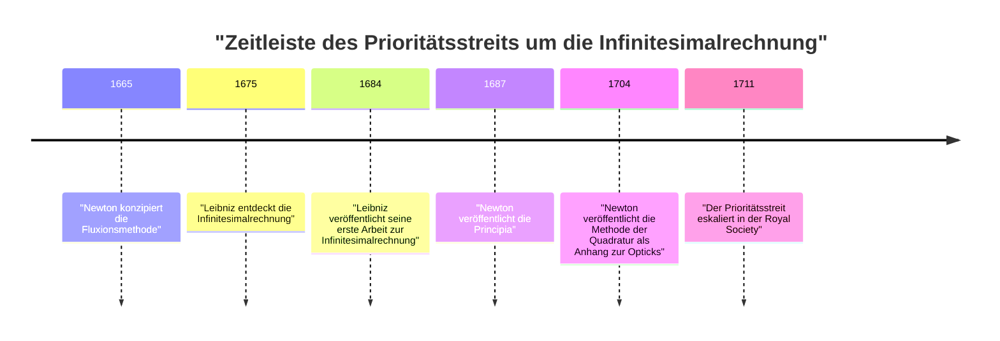
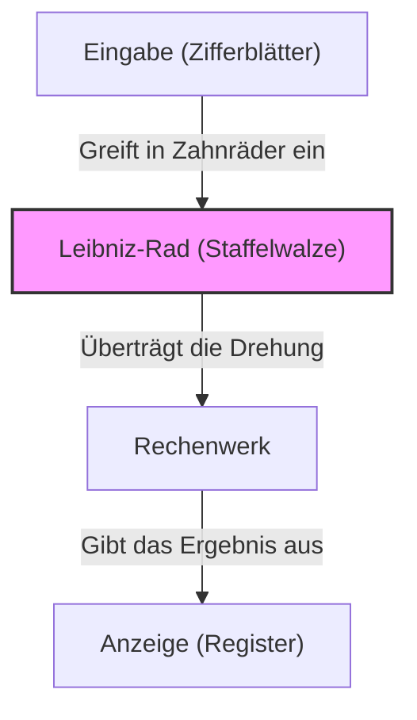

## Einleitung

Gottfried Wilhelm Leibniz (1646–1716) war ein deutscher Philosoph, Mathematiker und Wissenschaftler, der im 17. und 18. Jahrhundert wirkte. Er ist historisch als einer der seltenen Intellektuellen anerkannt, die den Titel eines „Universalgenies“ verdienen. Das Erbe, das er hinterließ, umfasst nicht nur Mathematik und Philosophie, sondern erstreckt sich auch auf Recht, Politikwissenschaft, Geschichte, Theologie, Linguistik und sogar Geologie und Ingenieurwesen.

Seine Gedanken, die den Grundstein für die moderne Wissenschaft legten, waren nicht nur eine Ansammlung von Wissen, sondern wurden von der großen Vision getragen, die als *Characteristica universalis* (Universalsprache) bekannt ist – einem Versuch, alle Wissensbereiche zu integrieren. In diesem Artikel beleuchten wir die Episoden aus Leibniz' turbulentem Leben und seine mathematischen Errungenschaften, die die Grundlage der modernen Wissenschaft und Technologie bilden.

## 1. Leben und Episoden: Die Laufbahn eines Genies

Leibniz' Leben war nicht das eines einsamen Gelehrten, der sich in einen Elfenbeinturm zurückzog, sondern war eng mit seinen Aktivitäten als Diplomat und politischer Berater verbunden, der durch ganz Europa reiste.

### 1.1 Frühes Leben und frühreifes Talent

Am 1. Juli 1646 wurde Leibniz in Leipzig im Heiligen Römischen Reich (dem heutigen Deutschland) geboren. Sein Vater, ein Professor für Moralphilosophie an der Universität Leipzig, verstarb, als Leibniz erst sechs Jahre alt war. Die riesige Bibliothek, die sein Vater hinterließ, förderte jedoch seine intellektuelle Neugier enorm. Noch bevor er in der Schule unterrichtet wurde, las er selbstständig lateinische und griechische Literatur in der Bibliothek seines Vaters und eignete sich die Grundlagen der Philosophie und Logik an.

Es wird gesagt, dass er mit acht Jahren Gedichte auf Latein schrieb und im Alter von zwölf Jahren die Logik des Aristoteles zutiefst verstand. Mit fünfzehn Jahren schrieb er sich an der Universität Leipzig ein, um Philosophie und Jura zu studieren. Anschließend wechselte er an die Universität Altdorf, wo er bereits im Alter von zwanzig Jahren in den Rechtswissenschaften promovierte. Die Universität bot ihm eine Professur an, doch er lehnte es ab, in der akademischen Welt zu bleiben, und entschied sich stattdessen für praktische Tätigkeiten im realen Leben.

### 1.2 Karriere als Diplomat und die Pariser Jahre

Im Dienst des Kurfürsten von Mainz begann Leibniz seine Karriere als Diplomat. Deutschland trug damals noch tiefe Narben des Dreißigjährigen Krieges, und er widmete sich politischen und rechtlichen Projekten zur Erhaltung des Friedens.

Im Jahr 1672 reiste er auf einer kühnen diplomatischen Mission (dem Ägyptenplan) nach Paris, um die Bedrohung für Deutschland abzuwenden, indem er König Ludwig XIV. von Frankreich zu einer Expedition nach Ägypten drängte. Obwohl dieser Plan letztendlich scheiterte, wurde sein Aufenthalt in Paris zum **größten Wendepunkt** in Leibniz' akademischem Leben.

Paris war zu dieser Zeit das intellektuelle Zentrum Europas, und er hatte die Gelegenheit, sich mit hochrangigen Wissenschaftlern und Mathematikern wie Christiaan Huygens auszutauschen. Durch das intensive Studium der neuesten Mathematik unter Huygens' Anleitung machte Leibniz einen erstaunlichen Sprung und entdeckte innerhalb weniger Jahre unabhängig die Infinitesimalrechnung.

### 1.3 Aktivitäten in Hannover und Beiträge in verschiedenen Bereichen

Im Jahr 1676 trat Leibniz in den Dienst des Herzogtums Hannover (des späteren Kurfürstentums Braunschweig-Lüneburg) als Hofrat und Bibliothekar ein. Hier kümmerte er sich um eine Vielzahl praktischer Aufgaben, darunter das Verfassen der Geschichte des Herzogtums und den Entwurf von Entwässerungspumpen für die Bergwerke im Harz.

Insbesondere bei dem Bergbauprojekt entwarf er ein fortschrittliches Pumpensystem, das Windkraft nutzte, aber mit den damaligen technologischen Standards schwer umsetzbar war, was zu einem Rückschlag führte. Seine geologischen Beobachtungen aus dieser Zeit führten jedoch dazu, dass er das bahnbrechende Werk *Protogaea* über den Ursprung der Erde schrieb, das die spätere Geologie tiefgreifend beeinflusste.

### 1.4 Härten in den späten Jahren und ein einsamer Tod

Leibniz schlug verschiedenen Monarchen die Gründung akademischer Akademien vor und diente als erster Präsident der Preußischen Akademie der Wissenschaften, womit er eine zentrale Rolle im akademischen Netzwerk Europas spielte. Er hatte auch eine Audienz bei Peter dem Großen von Russland und beriet ihn bei der Reform des russischen Bildungssystems.

In seinen späten Jahren wurde sein Ruf jedoch durch den mit [Isaac Newton](https://kenji.blog/de/p/newton/) entbrannten „Prioritätsstreit um die Infinitesimalrechnung“ schwer beschädigt. Nachdem sein Lehnsherr in Hannover als König Georg I. von Großbritannien nach London abgereist war, wurde Leibniz zudem angewiesen, in Hannover zu bleiben, um die Arbeit an den Geschichtsbüchern abzuschließen. Als er 1716 im Alter von 70 Jahren starb, soll nur sein Sekretär bei seiner Beerdigung anwesend gewesen sein.

## 2. Mathematische Errungenschaften: Das Fundament der modernen Wissenschaft

Das größte Vermächtnis, das Leibniz der modernen Wissenschaft hinterlassen hat, ist zweifellos die Etablierung des Symbolsystems der Infinitesimalrechnung und die Einführung des Binärsystems.

### 2.1 Die Entdeckung der Infinitesimalrechnung und die Verfeinerung der Symbole

Leibniz erkannte klar, dass das Problem der Bestimmung der Tangente an eine Kurve (Differenzialrechnung) und das Problem der Bestimmung der von einer Kurve eingeschlossenen Fläche (Integralrechnung) Umkehroperationen voneinander sind (der Hauptsatz der Differential- und Integralrechnung), und formulierte dies als einen berechenbaren Algorithmus.

$$
\int f(x) \,dx \quad \text{und} \quad \frac{d}{dx}f(x)
$$

Das Integralzeichen $\int$ (ein langgezogenes S für das lateinische Wort *Summa*) und das Differentialzeichen $d$ (für *differentia*, was Differenz bedeutet), die wir heute ganz selbstverständlich verwenden, wurden von Leibniz erfunden. Da seine Notation äußerst intuitiv und gut für mechanische Berechnungen geeignet war, beschleunigte sie die Entwicklung der Mathematik auf dem europäischen Kontinent erheblich. Er formulierte auch die Produktregel für die Differenziation (die Leibniz-Regel).

$$
d(uv) = u \, dv + v \, du
$$

### 2.2 Der Prioritätsstreit mit Newton

Um die Infinitesimalrechnung entbrannte mit dem Engländer [Isaac Newton](https://kenji.blog/de/p/newton/) einer der berühmtesten Streitigkeiten in der Geschichte der Wissenschaft. Newton war vor Leibniz auf das Konzept der Infinitesimalrechnung (die Fluxionsmethode) gekommen, hatte es jedoch lange Zeit nicht veröffentlicht. Leibniz hingegen entdeckte die Infinitesimalrechnung unabhängig davon und veröffentlichte sie 1684 als Erster in einer wissenschaftlichen Arbeit.

Heute ist es unter Historikern allgemein anerkannt, dass **beide Männer die Infinitesimalrechnung völlig unabhängig voneinander entdeckt haben**. Während Newtons Methode in der Physik und Kinematik verwurzelt war, basierte Leibniz' Ansatz auf einem formaleren und algebraischen Weg.

### 2.3 Die Etablierung des Binärsystems

Das Binärsystem, das alle Zahlen nur mit "0" und "1" ausdrückt und die Grundlage moderner Computer bildet, wurde ebenfalls zum ersten Mal systematisch von Leibniz beschrieben. Er entwickelte dieses Binärsystem in Verbindung mit seinem theologischen Gedanken, dass die gesamte Welt aus dem Nichts (0) und Gott (1) erschaffen wurde.

$$
13_{10} = 1101_{2}
$$

$$
1 \times 2^3 + 1 \times 2^2 + 0 \times 2^1 + 1 \times 2^0 = 8 + 4 + 0 + 1 = 13
$$

Leibniz bemerkte auch, dass die vierundsechzig Hexagramme des alten chinesischen Klassikers *I Ging* (Kombinationen aus Yin und Yang) perfekt mit seinem Binärsystem übereinstimmten, und entdeckte so eine tiefe Verbindung zur östlichen Philosophie.

### 2.4 Determinanten und lineare Gleichungssysteme

Bei der Lösung linearer Gleichungssysteme gelangte Leibniz etwa zur gleichen Zeit wie der japanische Mathematiker Seki Takakazu unabhängig zu dem Konzept der „Determinante“. Er behandelte die Koeffizienten als Matrix und entwickelte eine Methode, um sie systematisch zu eliminieren, womit er einen wichtigen Schritt für die spätere Entwicklung der linearen Algebra tat.

### 2.5 Die Erfindung der Staffelwalzen-Rechenmaschine

Leibniz war nicht nur ein theoretischer Mathematiker, sondern auch ein praktischer Erfinder, der sich in der Geschichte der mechanischen Rechenmaschinen einen Namen machte. Er verbesserte die Rechenmaschine von [Blaise Pascal](https://kenji.blog/de/p/pascal/) (die Pascaline), die nur addieren und subtrahieren konnte, und erfand eine Rechenmaschine (die Staffelwalze), die auch zur Multiplikation und Division fähig war.

Dieser Mechanismus war revolutionär und wurde in den folgenden Jahrhunderten als Standardstruktur für mechanische Rechenmaschinen übernommen.

## 3. Philosophie und Denken: Monadologie und prästabilierte Harmonie

Leibniz' mathematische Forschungen waren tief mit seinem grandiosen philosophischen System verbunden. Seine Philosophie gilt als einer der Höhepunkte des Rationalismus.

### 3.1 Die Monadologie

In seinem repräsentativen philosophischen Werk, der *Monadologie*, argumentierte er, dass die Welt aus „Monaden“ besteht, die die ultimativen geistigen Substanzen sind, keine räumliche Ausdehnung besitzen und unteilbar sind.

Im Gegensatz zu materiellen Atomen ist jede Monade eine spirituelle Einheit mit eigener Wahrnehmung. Wie sein berühmter Ausspruch „Die Monaden haben keine Fenster“ andeutet, interagieren Monaden nicht direkt miteinander.

### 3.2 Die prästabilierte Harmonie

Wenn das so ist, warum funktioniert dann eine Welt aus fensterlosen Monaden mit einer solchen Harmonie? Leibniz erklärte, dass Gott die Übergänge der inneren Zustände aller Monaden im Voraus so programmiert habe, dass sie perfekt synchronisiert sind. Er nannte dies die „prästabilierte Harmonie“.

### 3.3 Der Satz vom zureichenden Grunde

Leibniz leistete auch bedeutende Beiträge zur Logik. Er stellte den „Satz vom zureichenden Grunde“ auf, der besagt, dass „keine Tatsache als wahr oder existierend angesehen werden kann, ohne dass es einen zureichenden Grund dafür gibt, warum sie so und nicht anders ist“. Dies wurde zum Leitprinzip seiner wissenschaftlichen und philosophischen Untersuchungen.

## 4. Universalsprache und der Traum von der Künstlichen Intelligenz

Leibniz glaubte, dass das menschliche Denken auf mathematische Berechnungen reduziert werden könne. Er träumte davon, eine „Universalsprache“ (*Characteristica universalis*) zu konstruieren, die alle Konzepte symbolisiert, und einen *Calculus ratiocinator* (logischen Kalkül), um diese Symbole nach Regeln zu manipulieren.

Sein berühmter Satz „Lasst uns rechnen!“ (*Calculemus*) symbolisiert sein Ideal, die Wahrheit durch Berechnung statt durch Streit zu finden, wenn Meinungsverschiedenheiten auftraten. Dieses Konzept war ein Vorläufer der symbolischen Logik und eine historische Vision, die direkt mit den Berechnungsmodellen von [Alan Turing](https://kenji.blog/de/p/turing/) und dem modernen Konzept der **Künstlichen Intelligenz (KI)** verbunden ist.

## 5. Fazit

Durch seinen herausragenden Intellekt erweiterte Gottfried Wilhelm Leibniz die Grenzen des menschlichen Wissens in alle Richtungen erheblich. Ohne sein Symbolsystem der Infinitesimalrechnung wäre die Entwicklung der modernen Physik und Technik unmöglich gewesen, und ohne sein Binärsystem würde unsere heutige Computergesellschaft nicht existieren.

Obwohl er seine späten Jahre aufgrund seines Streits mit Newton und der politischen Umstände in Schwierigkeiten verbrachte, blühen die Samen der intellektuellen Forschung, die er gesät hat, noch hunderte Jahre später reich in der modernen Welt. Leibniz ist wahrlich ein „Universalgenie“, das über die Jahrhunderte hinweg hell leuchtet.
