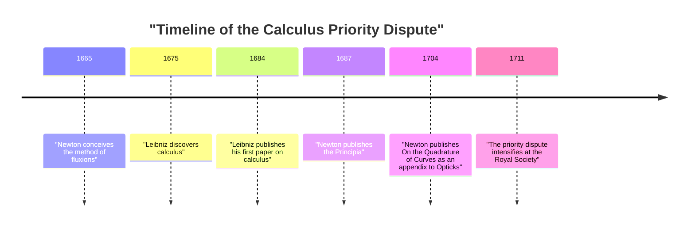
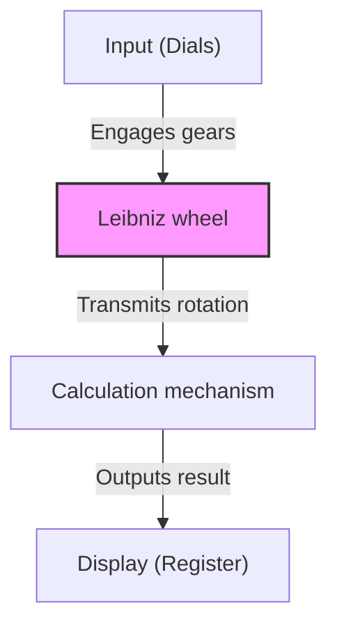

## Introduction

Gottfried Wilhelm Leibniz (1646–1716) was a German philosopher, mathematician, and scientist active during the 17th and 18th centuries. He is historically recognized as one of the rare intellectuals titled a "Universal Genius." The legacy he left behind spans not only mathematics and philosophy but also law, political science, history, theology, linguistics, and even geology and engineering.

His thoughts, which laid the foundation for modern science, were not merely an accumulation of knowledge but were supported by a grand vision known as *Characteristica universalis* (universal characteristic)—an attempt to integrate all fields of learning. In this article, we will focus on the episodes of Leibniz's turbulent life and his mathematical achievements that form the basis of modern science and technology, providing an in-depth explanation of his profound world of thought.

## 1. Life and Episodes: The Trajectory of a Genius

Leibniz's life was not that of a solitary scholar confined to an ivory tower; rather, it was intimately connected with his activities as a diplomat and political advisor traveling across Europe.

### 1.1 Early Life and Precocious Talent

On July 1, 1646, Leibniz was born in Leipzig, in the Holy Roman Empire (present-day Germany). His father, a professor of moral philosophy at the University of Leipzig, passed away when Leibniz was only six years old. However, the vast library left behind by his father greatly nurtured his intellectual curiosity. Before being taught at school, he independently read Latin and Greek literature in his father's library, mastering the foundations of philosophy and logic.

It is said that he composed poetry in Latin at the age of eight and deeply understood Aristotle's logic by the age of twelve. At fifteen, he enrolled at the University of Leipzig to study philosophy and law. He then transferred to the University of Altdorf, where he earned a doctorate in law at the young age of twenty. The university offered him a professorship, but he refused to remain in academia, opting instead for practical activities in the real world.

### 1.2 Career as a Diplomat and the Paris Years

Serving the Elector of Mainz, Leibniz began his career as a diplomat. Germany at the time still bore the deep scars of the Thirty Years' War, and he devoted himself to political and legal projects aimed at maintaining peace.

In 1672, he traveled to Paris on a bold diplomatic mission (the Egyptian Plan) to divert the threat to Germany by directing King Louis XIV of France toward an expedition in Egypt. Although this plan ultimately failed, his stay in Paris became the **greatest turning point** in Leibniz's academic life.

Paris was the intellectual center of Europe at the time, and he had the opportunity to interact with top-tier scientists and mathematicians, including Christiaan Huygens. Studying cutting-edge mathematics intensively under Huygens' guidance, Leibniz made an astonishing leap, independently discovering calculus within just a few years.

### 1.3 Activities in Hanover and Contributions to Various Fields

In 1676, Leibniz began serving the Duchy of Hanover (later the Electorate of Brunswick-Lüneburg) as a privy counselor and librarian. Here, he handled a wide range of practical duties, including compiling the duchy's history and designing drainage pumps for the mines in the Harz Mountains.

In the mining project in particular, he devised an advanced pump system using wind power, but it proved difficult to realize with the technological standards of the time, resulting in a setback. However, his geological observations during this period led him to write the groundbreaking work *Protogaea* regarding the origin of the Earth, which profoundly influenced later geology.

### 1.4 Hardships in Later Years and a Solitary Death

Leibniz proposed the establishment of academic academies to various monarchs and served as the first president of the Prussian Academy of Sciences, playing a central role in Europe's academic network. He also had an audience with Peter the Great of Russia and provided advice on reforming the Russian education system.

In his later years, however, his reputation was deeply tarnished by the "calculus priority dispute" that erupted with [Isaac Newton](https://kenji.blog/en/p/newton/). Furthermore, even after his lord in Hanover left for London as King George I of Great Britain, Leibniz was ordered to complete the compilation of the history books and was forced to remain in Hanover, enduring a period of misfortune. When he died at the age of 70 in 1716, it is said that only his secretary attended his funeral.

## 2. Mathematical Achievements: Building the Foundation of Modern Science

The greatest legacies Leibniz left to modern science are undoubtedly the establishment of the symbolic system of calculus and the proposition of the binary system.

### 2.1 The Discovery of Calculus and the Refinement of Symbols

Leibniz clearly recognized that the problem of finding the tangent of a curve (differentiation) and the problem of finding the area enclosed by a curve (integration) are inverse operations (the Fundamental Theorem of Calculus), and he formulated this as a computable algorithm.

$$
\int f(x) \,dx \quad \text{and} \quad \frac{d}{dx}f(x)
$$

The integral symbol $\int$ (an elongated letter S, standing for the Latin *Summa*) and the differential symbol $d$ (standing for *differentia*, meaning difference) that we use so naturally today were invented by Leibniz. Because his notation was extremely intuitive and suitable for mechanical calculation, it greatly accelerated the development of mathematics in continental Europe. He also formulated the product rule for differentiation (Leibniz's rule).

$$
d(uv) = u \, dv + v \, du
$$

### 2.2 The Priority Dispute with Newton

Over calculus, one of the most famous disputes in the history of science occurred with the English physicist [Isaac Newton](https://kenji.blog/en/p/newton/). Newton had arrived at the concept of calculus (the method of fluxions) earlier than Leibniz but had not published it for a long time. Meanwhile, Leibniz discovered calculus independently and published it first in a paper in 1684.

Today, it is the common consensus among historians that **both men discovered calculus completely independently**. While Newton's method was rooted in physics and kinematics, Leibniz's method was based on a more formal and algebraic approach.

### 2.3 The Establishment of the Binary System

The binary system, which expresses all numbers using only "0" and "1" and forms the foundation of modern computers, was also systematically described for the first time in the world by Leibniz. He devised this binary system by linking it to his theological thought that the entire world was created from nothingness (0) and God (1).

$$
13_{10} = 1101_{2}
$$

$$
1 \times 2^3 + 1 \times 2^2 + 0 \times 2^1 + 1 \times 2^0 = 8 + 4 + 0 + 1 = 13
$$

Leibniz also noticed that the sixty-four hexagrams of the ancient Chinese classic *I Ching* (combinations of Yin and Yang) perfectly matched his binary system, finding a deep connection with Eastern philosophy.

### 2.4 Determinants and Systems of Linear Equations

In solving systems of linear equations, Leibniz independently arrived at the concept of the "Determinant" around the same time as the Japanese mathematician Seki Takakazu. He treated the coefficients as an array and devised a method to systematically eliminate them, taking an important step toward the later development of linear algebra.

### 2.5 The Invention of the Stepped Reckoner

Leibniz was not only a theoretical mathematician but also a practical inventor who carved his name into the history of mechanical calculators. He improved upon [Blaise Pascal](https://kenji.blog/en/p/pascal/)'s calculator (the [Pascal](https://kenji.blog/en/p/pascal/)ine), which could only perform addition and subtraction, and invented a calculator using the "Leibniz wheel" (the Stepped Reckoner) capable of multiplication and division.

This mechanism was revolutionary and continued to be adopted as the standard structure for mechanical calculators over the next several hundred years.

## 3. Philosophy and Thought: Monads and Pre-established Harmony

Leibniz's mathematical pursuits were deeply tied to his grand philosophical system. His philosophy is considered one of the pinnacles of rationalism.

### 3.1 Monadology

In his representative philosophical work, *Monadology*, he argued that the world is composed of "Monads," which are ultimate spiritual substances that lack spatial extension and are indivisible.

Unlike material atoms, each monad is a spiritual unit with its own perception. As his famous saying "Monads have no windows" suggests, monads do not directly interact with one another.

### 3.2 Pre-established Harmony

If so, why does a world composed of windowless monads operate with such harmony? Leibniz explained that God had pre-programmed the transition of the internal states of all monads to be perfectly synchronized. He called this "Pre-established harmony."

### 3.3 The Principle of Sufficient Reason

Leibniz also made significant contributions to logic. He proposed the "Principle of sufficient reason," which states that "no fact can be real or existing and no statement true without a sufficient reason for its being so and not otherwise." This became the guiding principle of his scientific and philosophical inquiries.

## 4. Universal Characteristic and the Dream of Artificial Intelligence

Leibniz believed that human thought could be reduced to mathematical calculation. He dreamed of constructing a "Universal characteristic" (*Characteristica universalis*) that would symbolize all concepts, and a "Calculus ratiocinator" to manipulate those symbols according to rules.

The phrase he left behind, "Let us calculate" (*Calculemus*), symbolizes his ideal of deriving truth through calculation rather than argument whenever disagreements arose. This concept was a forerunner of symbolic logic and a historical vision that directly connects to the computational theories of [Alan Turing](https://kenji.blog/en/p/turing/) and others, as well as the modern concept of **Artificial Intelligence (AI)**.

## 5. Conclusion

Through his outstanding intellect, Gottfried Wilhelm Leibniz vastly expanded the frontiers of human knowledge in every direction. Without his symbolic system of calculus, the development of modern physics and engineering would have been impossible, and without his binary system, our modern computer society would not exist.

Although he spent his later years in hardship due to his dispute with Newton and political circumstances, the seeds of intellectual inquiry he sowed continue to bloom richly in the modern world hundreds of years later. Leibniz is truly a "Universal Genius" who continues to shine brightly across the ages.
