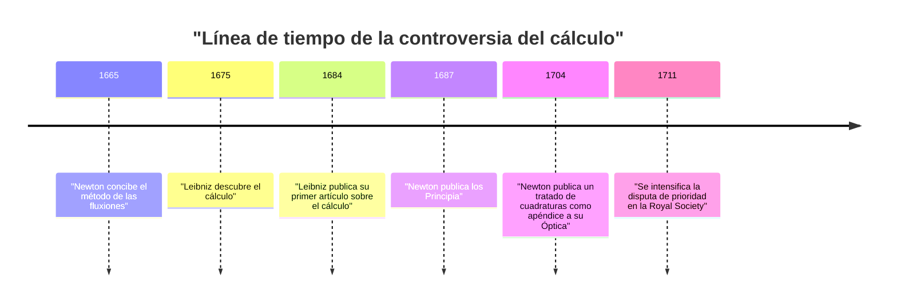
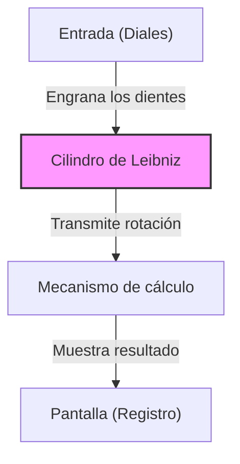

## Introducción

Gottfried Wilhelm Leibniz (1646–1716) fue un filósofo, matemático y científico alemán que estuvo activo durante los siglos XVII y XVIII. Históricamente es reconocido como uno de los raros intelectuales que ostentan el título de "Genio Universal". El legado que dejó abarca no solo las matemáticas y la filosofía, sino también el derecho, la ciencia política, la historia, la teología, la lingüística e incluso la geología y la ingeniería.

Sus pensamientos, que sentaron las bases para la ciencia moderna, no fueron simplemente una acumulación de conocimientos, sino que estuvieron respaldados por una visión grandiosa conocida como la *Characteristica universalis* (característica universal), un intento de integrar todos los campos del saber. En este artículo, nos centraremos en los episodios de la turbulenta vida de Leibniz y sus logros matemáticos que forman la base de la ciencia y tecnología modernas, brindando una explicación profunda de su mundo de pensamiento.

## 1. Vida y episodios: La trayectoria de un genio

La vida de Leibniz no fue la de un erudito solitario confinado en una torre de marfil; más bien, estuvo íntimamente conectada con sus actividades como diplomático y asesor político que viajaba por toda Europa.

### 1.1 Primeros años y talento precoz

El 1 de julio de 1646, Leibniz nació en Leipzig, en el Sacro Imperio Romano Germánico (actual Alemania). Su padre, profesor de filosofía moral en la Universidad de Leipzig, falleció cuando Leibniz tenía solo seis años. Sin embargo, la vasta biblioteca que dejó su padre nutrió enormemente su curiosidad intelectual. Antes de que le enseñaran en la escuela, leía de manera independiente literatura en latín y griego en la biblioteca de su padre, dominando los fundamentos de la filosofía y la lógica.

Se dice que compuso poesía en latín a los ocho años y que a los doce ya comprendía profundamente la lógica de Aristóteles. A los quince, se matriculó en la Universidad de Leipzig para estudiar filosofía y derecho. Luego se trasladó a la Universidad de Altdorf, donde obtuvo un doctorado en derecho a la joven edad de veinte años. La universidad le ofreció una cátedra, pero se negó a permanecer en el mundo académico, optando por actividades prácticas en el mundo real.

### 1.2 Carrera como diplomático y los años en París

Al servicio del Elector de Maguncia, Leibniz comenzó su carrera como diplomático. Alemania en ese momento todavía llevaba las profundas cicatrices de la Guerra de los Treinta Años, y él se dedicó a proyectos políticos y legales destinados a mantener la paz.

En 1672, viajó a París en una audaz misión diplomática (el Plan Egipcio) para desviar la amenaza a Alemania dirigiendo al rey Luis XIV de Francia hacia una expedición en Egipto. Aunque este plan finalmente fracasó, su estancia en París se convirtió en el **mayor punto de inflexión** de su vida académica.

París era el centro intelectual de Europa en ese momento, y tuvo la oportunidad de interactuar con científicos y matemáticos de primer nivel, incluido Christiaan Huygens. Al estudiar intensamente matemáticas de vanguardia bajo la dirección de Huygens, Leibniz dio un salto asombroso y descubrió de forma independiente el cálculo en tan solo unos años.

### 1.3 Actividades en Hannover y contribuciones en diversos campos

En 1676, Leibniz comenzó a servir al Ducado de Hannover (posteriormente Electorado de Brunswick-Lüneburg) como consejero privado y bibliotecario. Allí se ocupó de una amplia gama de tareas prácticas, como la compilación de la historia del ducado y el diseño de bombas de drenaje para las minas de las montañas de Harz.

En el proyecto minero, ideó un sistema avanzado de bombas que funcionaba con energía eólica, pero resultó difícil de implementar con el nivel tecnológico de la época, lo que representó un revés. No obstante, a partir de sus observaciones geológicas de ese período, escribió *Protogaea*, una obra innovadora sobre el origen de la Tierra que influyó profundamente en la geología posterior.

### 1.4 Dificultades en sus últimos años y una muerte solitaria

Leibniz propuso la creación de academias a varios monarcas y sirvió como primer presidente de la Academia Prusiana de las Ciencias, desempeñando un papel central en la red académica europea. También tuvo una audiencia con Pedro el Grande de Rusia y lo asesoró sobre la reforma del sistema educativo ruso.

En sus últimos años, sin embargo, su reputación se vio gravemente empañada por la "controversia sobre la paternidad del cálculo" con Isaac Newton. Además, tras la partida de su soberano de Hannover a Londres como el rey Jorge I de Gran Bretaña, se le ordenó permanecer en Hannover para terminar de compilar los libros de historia. Cuando murió a los 70 años en 1716, se dice que solo su secretario asistió a su funeral.

## 2. Logros matemáticos: Construyendo los cimientos de la ciencia moderna

El mayor legado que Leibniz dejó a la ciencia moderna es, sin duda, el establecimiento del sistema simbólico del cálculo y la propuesta del sistema binario.

### 2.1 El descubrimiento del cálculo y el refinamiento de los símbolos

Leibniz reconoció claramente que el problema de encontrar la tangente a una curva (derivación) y el problema de encontrar el área encerrada por una curva (integración) son operaciones inversas (el Teorema Fundamental del Cálculo), y lo formuló como un algoritmo computable.

$$
\int f(x) \,dx \quad \text{y} \quad \frac{d}{dx}f(x)
$$

El símbolo de integral $\int$ (una S alargada, de la palabra latina *Summa*) y el símbolo de diferencial $d$ (de *differentia*, que significa diferencia), que usamos con tanta naturalidad hoy en día, fueron inventados por Leibniz. Su notación, al ser extremadamente intuitiva y conveniente para el cálculo mecánico, aceleró en gran medida el desarrollo de las matemáticas en Europa continental. También formuló la regla del producto para la derivación (regla de Leibniz).

$$
d(uv) = u \, dv + v \, du
$$

### 2.2 La controversia de prioridad con Newton

En torno al cálculo se produjo una de las controversias más famosas en la historia de la ciencia, con el inglés Isaac Newton. Newton había llegado al concepto de cálculo (el método de fluxiones) antes que Leibniz, pero no lo publicó durante mucho tiempo. Por su parte, Leibniz descubrió el cálculo de forma independiente y lo publicó primero en un artículo en 1684.

Hoy en día, el consenso común entre los historiadores es que **ambos hombres descubrieron el cálculo de forma completamente independiente**. Mientras que el método de Newton estaba arraigado en la física y la cinemática, el enfoque de Leibniz se basaba en una vía más formal y algebraica.

### 2.3 El establecimiento del sistema binario

El sistema binario, que expresa todos los números utilizando solo "0" y "1" y constituye la base de las computadoras modernas, también fue descrito sistemáticamente por primera vez por Leibniz. Ideó este sistema vinculándolo a su pensamiento teológico de que el mundo entero fue creado a partir de la nada (0) y de Dios (1).

$$
13_{10} = 1101_{2}
$$

$$
1 \times 2^3 + 1 \times 2^2 + 0 \times 2^1 + 1 \times 2^0 = 8 + 4 + 0 + 1 = 13
$$

Leibniz también notó que los sesenta y cuatro hexagramas del clásico chino *I Ching* (combinaciones de Yin y Yang) coincidían perfectamente con su sistema binario, descubriendo una profunda conexión con la filosofía oriental.

### 2.4 Determinantes y sistemas de ecuaciones lineales

Al resolver sistemas de ecuaciones lineales, Leibniz llegó independientemente al concepto de "Determinante" casi al mismo tiempo que el matemático japonés Seki Takakazu. Trató los coeficientes como arreglos y diseñó un método para eliminarlos sistemáticamente, dando un paso importante hacia el posterior desarrollo del álgebra lineal.

### 2.5 La invención de la calculadora de engranajes escalonados

Leibniz no solo fue un matemático teórico, sino también un inventor práctico que dejó su huella en la historia de las calculadoras mecánicas. Mejoró la máquina de Blaise Pascal (la Pascalina), que solo podía sumar y restar, inventando una calculadora (la *Stepped Reckoner*) que empleaba el "cilindro de Leibniz" y era capaz de realizar multiplicaciones y divisiones.

Este mecanismo fue revolucionario y se adoptó como la estructura estándar de las calculadoras mecánicas durante los siglos siguientes.

## 3. Filosofía y pensamiento: Monadología y armonía preestablecida

La búsqueda matemática de Leibniz estaba profundamente vinculada a su grandioso sistema filosófico, el cual es considerado uno de los pináculos del racionalismo.

### 3.1 Monadología

En su obra filosófica representativa, la *Monadología*, argumentó que el mundo está compuesto de "Mónadas", que son sustancias espirituales últimas, sin extensión espacial e indivisibles.

A diferencia de los átomos materiales, cada mónada es una unidad espiritual con su propia percepción. Como sugiere su famosa frase "Las mónadas no tienen ventanas", las mónadas no interactúan directamente entre sí.

### 3.2 La armonía preestablecida

Si es así, ¿por qué un mundo compuesto de mónadas sin ventanas funciona con tanta armonía? Leibniz explicó que Dios había programado de antemano la transición de los estados internos de todas las mónadas para que estuvieran perfectamente sincronizadas. Llamó a esto la "Armonía preestablecida".

### 3.3 El principio de razón suficiente

Leibniz también hizo contribuciones significativas a la lógica. Propuso el "Principio de razón suficiente", que establece que "no puede haber ningún hecho verdadero o existente sin que haya una razón suficiente para que sea así y no de otro modo". Esto se convirtió en el principio rector de sus investigaciones científicas y filosóficas.

## 4. Característica universal y el sueño de la inteligencia artificial

Leibniz creía que el pensamiento humano podía reducirse al cálculo matemático. Soñaba con construir una "Característica universal" (*Characteristica universalis*) que simbolizara todos los conceptos, y un "Cálculo racional" (*Calculus ratiocinator*) para manipular esos símbolos según unas reglas.

La frase que dejó, "Calculemos" (*Calculemus*), simboliza su ideal de alcanzar la verdad a través del cálculo en lugar de la discusión cuando surgían desacuerdos. Esta idea fue precursora de la lógica simbólica y una visión histórica que se conecta directamente con las teorías computacionales de Alan Turing y el concepto moderno de **Inteligencia Artificial (IA)**.

## 5. Conclusión

A través de su extraordinario intelecto, Gottfried Wilhelm Leibniz expandió enormemente las fronteras del conocimiento humano en todas las direcciones. Sin su sistema simbólico para el cálculo, el desarrollo de la física y la ingeniería modernas habría sido imposible; y sin su sistema binario, nuestra sociedad informática moderna no existiría.

Aunque pasó sus últimos años en apuros debido a su disputa con Newton y las circunstancias políticas, las semillas de investigación intelectual que sembró continúan floreciendo ricamente cientos de años después. Leibniz es verdaderamente un "Genio Universal" que sigue brillando a través de las edades.
