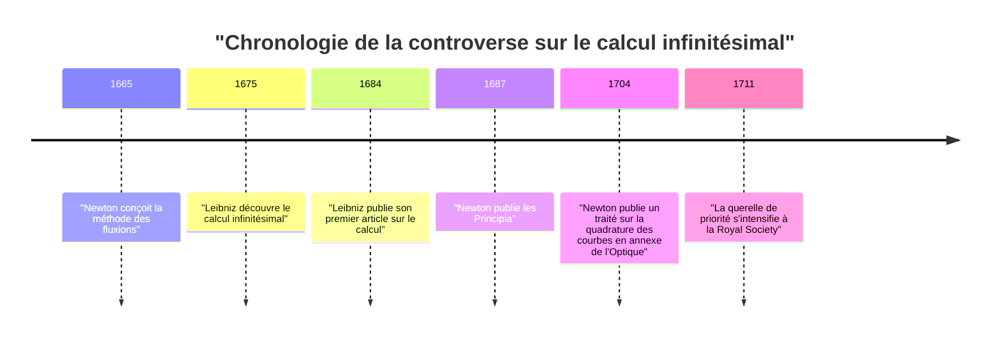
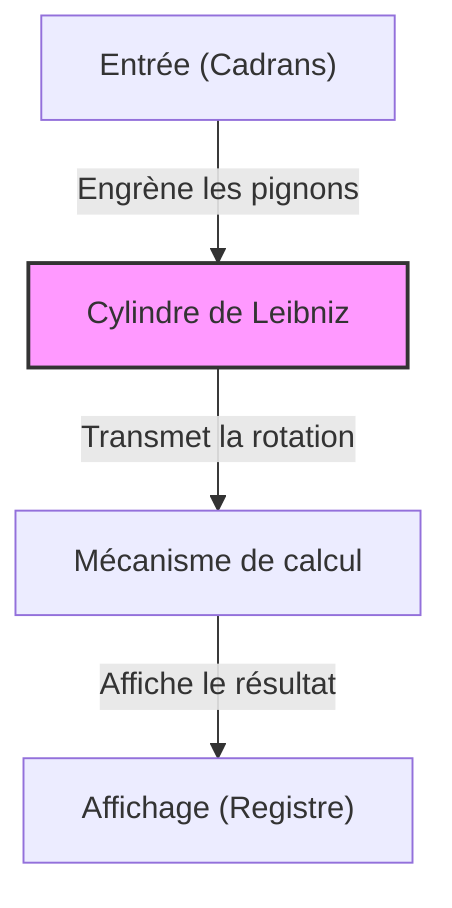

## Introduction

Gottfried Wilhelm Leibniz (1646–1716) était un philosophe, mathématicien et scientifique allemand actif aux XVIIe et XVIIIe siècles. Il est reconnu historiquement comme l'un des rares intellectuels à avoir mérité le titre de « Génie universel ». L'héritage qu'il a laissé englobe non seulement les mathématiques et la philosophie, mais s'étend également au droit, aux sciences politiques, à l'histoire, à la théologie, à la linguistique, et même à la géologie et à l'ingénierie.

Sa pensée, qui a jeté les bases de la science moderne, ne consistait pas simplement en une accumulation de connaissances, mais s'appuyait sur une vision grandiose, la *Characteristica universalis* (caractéristique universelle), tentative d'intégration de tous les domaines du savoir. Dans cet article, nous mettrons en lumière les épisodes tumultueux de la vie de Leibniz ainsi que ses réalisations mathématiques fondamentales pour la technologie moderne.

## 1. Vie et anecdotes : La trajectoire d'un génie

La vie de Leibniz ne fut pas celle d'un érudit solitaire confiné dans une tour d'ivoire ; elle fut au contraire intimement liée à ses activités de diplomate et de conseiller politique sillonnant l'Europe.

### 1.1 Jeunesse et talent précoce

Le 1er juillet 1646, Leibniz naquit à Leipzig, dans le Saint-Empire romain germanique (l'actuelle Allemagne). Son père, professeur de philosophie morale à l'Université de Leipzig, mourut alors que Leibniz n'avait que six ans. Cependant, la vaste bibliothèque paternelle nourrit considérablement sa curiosité intellectuelle. Avant même d'étudier à l'école, il lisait seul des textes latins et grecs dans la bibliothèque de son père, assimilant les fondements de la philosophie et de la logique.

On raconte qu'il écrivait des poèmes en latin à l'âge de huit ans et comprenait profondément la logique d'Aristote à douze ans. À quinze ans, il entra à l'Université de Leipzig pour y étudier la philosophie et le droit. Il rejoignit ensuite l'Université d'Altdorf où il obtint un doctorat en droit à l'âge de vingt ans. Bien que l'université lui ait offert une chaire de professeur, il refusa de s'enfermer dans le monde académique et choisit de s'impliquer dans le monde politique et diplomatique.

### 1.2 Carrière de diplomate et années parisiennes

Au service de l'Électeur de Mayence, Leibniz entama sa carrière diplomatique. L'Allemagne portait encore les lourdes cicatrices de la guerre de Trente Ans, et il se consacra à divers projets politiques et juridiques visant à maintenir la paix.

En 1672, il se rendit à Paris pour accomplir une mission diplomatique audacieuse (le plan égyptien) dont le but était de détourner la menace pesant sur l'Allemagne en incitant le roi Louis XIV à lancer une expédition en Égypte. Bien que ce plan échouât, son séjour à Paris marqua le **plus grand tournant** de sa vie intellectuelle.

Paris était alors le centre du savoir en Europe, ce qui lui donna l'occasion de fréquenter des scientifiques et des mathématiciens de premier plan, dont Christiaan Huygens. Étudiant intensément les mathématiques avancées sous la tutelle de Huygens, Leibniz fit des progrès fulgurants et découvrit le calcul infinitésimal de manière indépendante en l'espace de quelques années seulement.

### 1.3 Activités à Hanovre et contributions variées

En 1676, Leibniz entra au service du duché de Hanovre (futur électorat de Brunswick-Lunebourg) en tant que conseiller privé et bibliothécaire. Il y assuma de nombreuses tâches pratiques, de la rédaction de l'histoire du duché à la conception de pompes pour drainer l'eau des mines du massif du Harz.

Pour le projet minier, il inventa un système sophistiqué de pompage éolien, mais les limites technologiques de l'époque l'empêchèrent d'aboutir. Néanmoins, les observations géologiques qu'il fit alors le menèrent à écrire *Protogaea*, une œuvre fondatrice sur les origines de la Terre qui influença fortement la géologie moderne.

### 1.4 Les difficultés des dernières années et une mort solitaire

Leibniz proposa à divers monarques de créer des académies scientifiques et devint le premier président de l'Académie royale des sciences de Prusse, jouant un rôle central dans les réseaux académiques européens. Il rencontra également Pierre le Grand, à qui il conseilla de réformer le système éducatif russe.

Cependant, à la fin de sa vie, sa réputation fut gravement ternie par la violente controverse sur la priorité de l'invention du calcul infinitésimal qui l'opposa à [Isaac Newton](https://kenji.blog/fr/p/newton/). De plus, quand l'Électeur de Hanovre fut couronné roi de Grande-Bretagne sous le nom de George Ier et partit pour Londres, on ordonna à Leibniz de rester à Hanovre pour achever ses travaux historiques. Lorsqu'il mourut à 70 ans en 1716, on rapporte que seul son secrétaire assista à ses funérailles.

## 2. L'œuvre mathématique : Les fondations de la science moderne

Le plus grand héritage que Leibniz a laissé à la science moderne réside incontestablement dans l'élaboration du système de notation du calcul infinitésimal et l'invention du système binaire.

### 2.1 Découverte du calcul infinitésimal et élégance des notations

Leibniz comprit clairement que le problème de la détermination de la tangente à une courbe (la dérivation) et celui du calcul de l'aire sous une courbe (l'intégration) étaient des opérations inverses (le théorème fondamental de l'analyse), et il formalisa ce principe sous forme d'un algorithme calculable.

$$
\int f(x) \,dx \quad \text{et} \quad \frac{d}{dx}f(x)
$$

Le symbole d'intégrale $\int$ (un S allongé pour *Summa*, signifiant la somme) et le symbole de différentielle $d$ (pour *differentia*, la différence), que nous utilisons si couramment aujourd'hui, furent inventés par Leibniz. Ses notations se sont avérées extrêmement intuitives et propices au calcul mécanique, ce qui accéléra grandement le développement des mathématiques en Europe continentale. Il formalisa également la règle de dérivation d'un produit (la règle de Leibniz).

$$
d(uv) = u \, dv + v \, du
$$

### 2.2 La querelle de priorité avec Newton

Le calcul infinitésimal fut l'objet d'une des querelles les plus célèbres de l'histoire des sciences, opposant Leibniz au Britannique [Isaac Newton](https://kenji.blog/fr/p/newton/). Newton avait conçu sa méthode des fluxions avant Leibniz, mais tarda à la publier. De son côté, Leibniz découvrit le calcul de manière indépendante et fut le premier à publier ses résultats, en 1684.

Aujourd'hui, les historiens s'accordent à dire que **les deux hommes ont découvert le calcul infinitésimal de manière totalement indépendante**. L'approche de Newton était enracinée dans la physique et la cinématique, tandis que celle de Leibniz s'appuyait sur une méthode plus formelle et algébrique.

### 2.3 Le système binaire

Le système binaire, qui exprime tous les nombres uniquement avec des « 0 » et des « 1 » et qui est à la base de l'informatique moderne, a été systématisé pour la première fois au monde par Leibniz. Il a conçu ce système en l'associant à sa réflexion théologique, selon laquelle l'univers tout entier a été créé à partir du néant (0) et de Dieu (1).

$$
13_{10} = 1101_{2}
$$

$$
1 \times 2^3 + 1 \times 2^2 + 0 \times 2^1 + 1 \times 2^0 = 8 + 4 + 0 + 1 = 13
$$

Leibniz remarqua également que les soixante-quatre hexagrammes du *Yi Jing* (le Classique des changements, basé sur la combinaison du Yin et du Yang) correspondaient parfaitement à son système binaire, découvrant ainsi un lien profond avec la pensée orientale.

### 2.4 Déterminants et systèmes d'équations linéaires

En cherchant à résoudre les systèmes d'équations linéaires, Leibniz découvrit indépendamment la notion de « déterminant », à peu près à la même époque que le mathématicien japonais Seki Takakazu. En manipulant les coefficients comme des tableaux et en inventant une méthode systématique pour les éliminer, il fit un pas crucial vers le développement de l'algèbre linéaire.

### 2.5 L'invention de la machine à calculer à cylindres cannelés

Théoricien brillant, Leibniz n'en fut pas moins un inventeur pratique qui laissa son nom dans l'histoire des calculatrices mécaniques. Il améliora la machine de [Blaise Pascal](https://kenji.blog/fr/p/pascal/) (la [Pascal](https://kenji.blog/fr/p/pascal/)ine), qui ne pouvait faire que des additions et des soustractions, en concevant une machine utilisant un « cylindre de Leibniz » (le multiplicateur à cylindres cannelés) capable d'effectuer des multiplications et des divisions.

Ce mécanisme ingénieux devint le standard de l'architecture des calculatrices mécaniques pour les siècles à venir.

## 3. Philosophie et pensée : La Monadologie et l'Harmonie préétablie

Les recherches mathématiques de Leibniz étaient intimement liées à son vaste système philosophique, qui constitue l'un des sommets du rationalisme.

### 3.1 La Monadologie

Dans son ouvrage philosophique majeur, *La Monadologie*, il soutient que le monde est composé de « monades », des substances spirituelles ultimes, simples, inétendues et indivisibles.

À l'inverse des atomes matériels, chaque monade est une entité spirituelle possédant ses propres perceptions. Sa célèbre formule selon laquelle « les monades n'ont point de fenêtres » signifie qu'elles ne peuvent pas interagir directement les unes avec les autres.

### 3.2 L'Harmonie préétablie

Dès lors, comment expliquer l'harmonie parfaite d'un univers composé de monades sans fenêtres ? Leibniz explique que Dieu a préprogrammé les variations internes de chaque monade pour qu'elles s'accordent toutes parfaitement. C'est ce qu'il a appelé « l'harmonie préétablie ».

### 3.3 Le principe de raison suffisante

Leibniz a également apporté une contribution majeure à la logique avec son « principe de raison suffisante », selon lequel « rien n'est sans une raison suffisante pour qu'il en soit ainsi et non autrement ». Ce principe a servi de fil conducteur à toutes ses recherches philosophiques et scientifiques.

## 4. La Caractéristique universelle et le rêve de l'Intelligence Artificielle

Leibniz était persuadé que la pensée humaine pouvait être ramenée à des calculs mathématiques. Il rêvait de construire une « Caractéristique universelle » (*Characteristica universalis*) pour symboliser tous les concepts humains, couplée à un *Calculus ratiocinator* (calcul des raisonnements) permettant de manipuler ces symboles selon des règles strictes.

Son célèbre mot d'ordre « Calculons » (*Calculemus*) exprime son idéal consistant à résoudre tout différend non par des querelles, mais par le calcul exact de la vérité. Cette idée préfigurait la logique symbolique et l'informatique théorique développée par [Alan Turing](https://kenji.blog/fr/p/turing/), et constitue l'ancêtre spirituel du concept moderne de l' **Intelligence Artificielle (IA)**.

## 5. Conclusion

Grâce à son extraordinaire intelligence, Gottfried Wilhelm Leibniz a repoussé les frontières du savoir humain dans de multiples directions. Sans son système de notation du calcul infinitésimal, la physique et l'ingénierie modernes n'auraient jamais vu le jour ; sans son invention du système binaire, l'ère du numérique que nous connaissons aujourd'hui n'existerait pas.

Bien que ses dernières années aient été assombries par la querelle avec Newton et un isolement politique, les graines du savoir qu'il a semées n'ont cessé de s'épanouir et de porter leurs fruits jusqu'à notre époque, plusieurs siècles plus tard. Leibniz fut indubitablement un « Génie universel » dont l'éclat traverse les âges.
