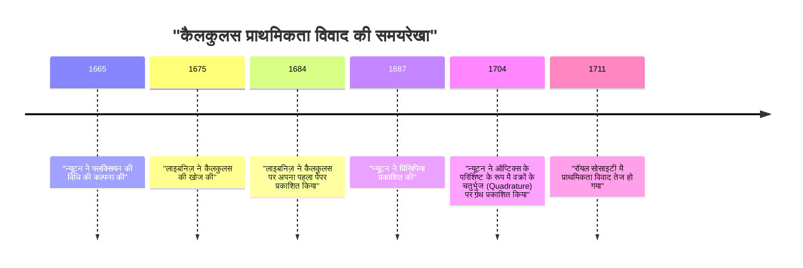
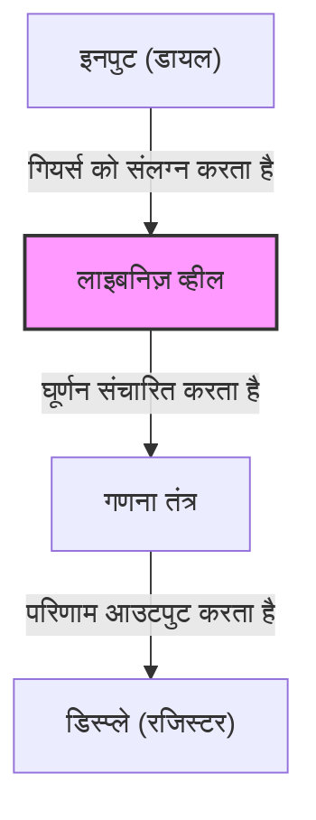

## प्रस्तावना

गॉटफ्रीड विल्हेम लाइबनिज़ (1646–1716) एक जर्मन दार्शनिक, गणितज्ञ और वैज्ञानिक थे जो 17वीं और 18वीं शताब्दी के दौरान सक्रिय थे। ऐतिहासिक रूप से उन्हें उन दुर्लभ बुद्धिजीवियों में से एक माना जाता है जिन्हें "सार्वभौमिक प्रतिभा" (Universal Genius) का खिताब दिया गया है। उनके द्वारा छोड़ी गई विरासत में न केवल गणित और दर्शन शामिल हैं, बल्कि कानून, राजनीति विज्ञान, इतिहास, धर्मशास्त्र, भाषा विज्ञान और यहां तक कि भूविज्ञान और इंजीनियरिंग भी शामिल हैं।

उनके विचार, जिन्होंने आधुनिक विज्ञान की नींव रखी, केवल ज्ञान का संचय नहीं थे, बल्कि *Characteristica universalis* (सार्वभौमिक विशेषता) नामक एक भव्य दृष्टिकोण द्वारा समर्थित थे—जो सीखने के सभी क्षेत्रों को एकीकृत करने का एक प्रयास था। इस लेख में, हम लाइबनिज़ के अशांत जीवन की घटनाओं और उनकी गणितीय उपलब्धियों पर ध्यान केंद्रित करेंगे जो आधुनिक विज्ञान और प्रौद्योगिकी का आधार बनती हैं, और उनके विचार की गहरी दुनिया का विस्तृत विवरण प्रदान करेंगे।

## 1. जीवन और घटनाएं: एक प्रतिभा की यात्रा

लाइबनिज़ का जीवन एक हाथीदांत की मीनार (ivory tower) में बंद किसी एकांत विद्वान का जीवन नहीं था; बल्कि, यह एक राजनयिक और राजनीतिक सलाहकार के रूप में उनकी गतिविधियों से घनिष्ठ रूप से जुड़ा हुआ था, जो पूरे यूरोप की यात्रा करते थे।

### 1.1 प्रारंभिक जीवन और शीघ्र विकसित प्रतिभा

1 जुलाई, 1646 को, लाइबनिज़ का जन्म पवित्र रोमन साम्राज्य (वर्तमान जर्मनी) के लीपज़िग में हुआ था। उनके पिता, जो लीपज़िग विश्वविद्यालय में नैतिक दर्शन के प्रोफेसर थे, का निधन तब हो गया था जब लाइबनिज़ केवल छह वर्ष के थे। हालाँकि, उनके पिता द्वारा छोड़े गए विशाल पुस्तकालय ने उनकी बौद्धिक जिज्ञासा को बहुत पोषित किया। स्कूल में पढ़ाए जाने से पहले ही, उन्होंने अपने पिता के पुस्तकालय में स्वतंत्र रूप से लैटिन और ग्रीक साहित्य पढ़ा, जिससे दर्शन और तर्कशास्त्र की मूल बातें सीख लीं।

कहा जाता है कि उन्होंने आठ साल की उम्र में लैटिन में कविता रची थी और बारह साल की उम्र में अरस्तू के तर्क को गहराई से समझ लिया था। पंद्रह साल की उम्र में, उन्होंने दर्शन और कानून का अध्ययन करने के लिए लीपज़िग विश्वविद्यालय में दाखिला लिया। उसके बाद उन्होंने अल्टडॉर्फ विश्वविद्यालय में स्थानांतरण लिया, जहाँ उन्होंने केवल बीस वर्ष की कम उम्र में कानून में डॉक्टरेट की उपाधि प्राप्त की। विश्वविद्यालय ने उन्हें प्रोफेसर पद की पेशकश की, लेकिन उन्होंने अकादमिक दुनिया में रहने से इनकार कर दिया, और इसके बजाय वास्तविक दुनिया में व्यावहारिक गतिविधियों को चुना।

### 1.2 राजनयिक के रूप में करियर और पेरिस के वर्ष

मेन्ज़ के निर्वाचक (Elector of Mainz) की सेवा करते हुए, लाइबनिज़ ने एक राजनयिक के रूप में अपना करियर शुरू किया। उस समय जर्मनी में अभी भी तीस वर्षीय युद्ध के गहरे निशान थे, और उन्होंने शांति बनाए रखने के उद्देश्य से राजनीतिक और कानूनी परियोजनाओं के लिए खुद को समर्पित कर दिया।

1672 में, उन्होंने जर्मनी के लिए खतरे को टालने के लिए फ्रांस के राजा लुई चौदहवें को मिस्र में एक अभियान की ओर निर्देशित करने के लिए एक साहसिक राजनयिक मिशन (मिस्र योजना) पर पेरिस की यात्रा की। यद्यपि यह योजना अंततः विफल रही, पेरिस में उनका प्रवास लाइबनिज़ के शैक्षणिक जीवन में **सबसे बड़ा मोड़** बन गया।

उस समय पेरिस यूरोप का बौद्धिक केंद्र था, और उन्हें क्रिश्चियन ह्यूजेंस सहित शीर्ष-स्तरीय वैज्ञानिकों और गणितज्ञों के साथ बातचीत करने का अवसर मिला। ह्यूजेंस के मार्गदर्शन में अत्याधुनिक गणित का गहन अध्ययन करते हुए, लाइबनिज़ ने एक आश्चर्यजनक छलांग लगाई, और कुछ ही वर्षों में स्वतंत्र रूप से कैलकुलस की खोज की।

### 1.3 हनोवर में गतिविधियां और विभिन्न क्षेत्रों में योगदान

1676 में, लाइबनिज़ ने हनोवर डची (बाद में ब्रंसविक-ल्यूनबर्ग का इलेक्टोरेट) के प्रिवी काउंसलर और लाइब्रेरियन के रूप में काम करना शुरू किया। यहाँ, उन्होंने डची के इतिहास को संकलित करने और हर्ज़ पर्वत में खदानों के लिए ड्रेनेज पंप डिजाइन करने सहित कई व्यावहारिक कर्तव्यों को संभाला।

विशेष रूप से खनन परियोजना में, उन्होंने पवन ऊर्जा का उपयोग करके एक उन्नत पंप प्रणाली तैयार की, लेकिन उस समय के तकनीकी मानकों के साथ इसे साकार करना मुश्किल साबित हुआ, जिसके परिणामस्वरूप एक झटका लगा। हालाँकि, इस अवधि के दौरान उनके भूवैज्ञानिक अवलोकनों ने उन्हें पृथ्वी की उत्पत्ति के संबंध में अभूतपूर्व कार्य *Protogaea* लिखने के लिए प्रेरित किया, जिसने बाद के भूविज्ञान को गहराई से प्रभावित किया।

### 1.4 बाद के वर्षों में कठिनाइयाँ और एक एकांत मृत्यु

लाइबनिज़ ने विभिन्न राजाओं को शैक्षणिक अकादमियों की स्थापना का प्रस्ताव दिया और प्रशियन एकेडमी ऑफ साइंसेज के पहले अध्यक्ष के रूप में कार्य किया, जिसने यूरोप के शैक्षणिक नेटवर्क में केंद्रीय भूमिका निभाई। उन्होंने रूस के पीटर द ग्रेट से भी मुलाकात की और रूसी शिक्षा प्रणाली में सुधार पर सलाह दी।

हालाँकि, उनके बाद के वर्षों में, [आइजैक न्यूटन](https://kenji.blog/hi/p/newton/) के साथ छिड़े "कैलकुलस प्राथमिकता विवाद" से उनकी प्रतिष्ठा को गहरा आघात लगा। इसके अलावा, हनोवर में उनके शासक के ग्रेट ब्रिटेन के राजा जॉर्ज प्रथम के रूप में लंदन जाने के बाद भी, लाइबनिज़ को इतिहास की पुस्तकों का संकलन पूरा करने का आदेश दिया गया और उन्हें हनोवर में रहने के लिए मजबूर किया गया, जहाँ उन्होंने दुर्भाग्य का दौर सहा। जब 1716 में 70 वर्ष की आयु में उनका निधन हुआ, तो कहा जाता है कि केवल उनके सचिव ही उनके अंतिम संस्कार में शामिल हुए थे।

## 2. गणितीय उपलब्धियां: आधुनिक विज्ञान की नींव का निर्माण

आधुनिक विज्ञान के लिए लाइबनिज़ द्वारा छोड़ी गई सबसे बड़ी विरासत निस्संदेह कैलकुलस की प्रतीकात्मक प्रणाली की स्थापना और बाइनरी प्रणाली का प्रस्ताव है।

### 2.1 कैलकुलस की खोज और प्रतीकों का परिशोधन

लाइबनिज़ ने स्पष्ट रूप से पहचाना कि एक वक्र की स्पर्शरेखा खोजने की समस्या (अवकलन / differentiation) और वक्र द्वारा घिरे क्षेत्र को खोजने की समस्या (समाकलन / integration) व्युत्क्रम संचालन हैं (कैलकुलस का मौलिक प्रमेय), और उन्होंने इसे एक गणना योग्य एल्गोरिदम के रूप में तैयार किया।

$$
\int f(x) \,dx \quad \text{और} \quad \frac{d}{dx}f(x)
$$

इंटीग्रल का प्रतीक $\int$ (लैटिन शब्द *Summa* से एक लंबा S) और डिफरेंशियल का प्रतीक $d$ (*differentia* से, जिसका अर्थ अंतर है), जिसे हम आज स्वाभाविक रूप से उपयोग करते हैं, लाइबनिज़ द्वारा आविष्कार किए गए थे। चूँकि उनका अंकन अत्यंत सहज और यांत्रिक गणना के लिए उपयुक्त था, इसने महाद्वीपीय यूरोप में गणित के विकास को बहुत गति दी। उन्होंने अवकलन के लिए उत्पाद नियम (लाइबनिज़ का नियम) भी तैयार किया।

$$
d(uv) = u \, dv + v \, du
$$

### 2.2 न्यूटन के साथ प्राथमिकता विवाद

कैलकुलस को लेकर, विज्ञान के इतिहास में सबसे प्रसिद्ध विवादों में से एक अंग्रेज [आइजैक न्यूटन](https://kenji.blog/hi/p/newton/) के साथ हुआ। न्यूटन लाइबनिज़ की तुलना में पहले ही कैलकुलस (फ्लक्सियन की विधि) की अवधारणा पर पहुँच चुके थे, लेकिन उन्होंने इसे लंबे समय तक प्रकाशित नहीं किया था। इस बीच, लाइबनिज़ ने स्वतंत्र रूप से कैलकुलस की खोज की और 1684 में एक शोध पत्र में इसे सबसे पहले प्रकाशित किया।

आज, इतिहासकारों के बीच यह आम सहमति है कि **दोनों व्यक्तियों ने पूरी तरह से स्वतंत्र रूप से कैलकुलस की खोज की थी**। जहाँ न्यूटन की विधि भौतिकी और कीनेमेटिक्स में निहित थी, वहीं लाइबनिज़ की विधि अधिक औपचारिक और बीजगणितीय दृष्टिकोण पर आधारित थी।

### 2.3 बाइनरी प्रणाली (Binary System) की स्थापना

बाइनरी प्रणाली, जो सभी संख्याओं को केवल "0" और "1" का उपयोग करके व्यक्त करती है और आधुनिक कंप्यूटरों की नींव बनाती है, को दुनिया में पहली बार व्यवस्थित रूप से लाइबनिज़ द्वारा वर्णित किया गया था। उन्होंने इस बाइनरी प्रणाली को अपने धार्मिक विचार से जोड़कर तैयार किया कि पूरी दुनिया शून्य (0) और ईश्वर (1) से बनाई गई थी।

$$
13_{10} = 1101_{2}
$$

$$
1 \times 2^3 + 1 \times 2^2 + 0 \times 2^1 + 1 \times 2^0 = 8 + 4 + 0 + 1 = 13
$$

लाइबनिज़ ने यह भी देखा कि प्राचीन चीनी क्लासिक *I Ching* (यिन और यांग के संयोजन) के चौंसठ हेक्साग्राम उनकी बाइनरी प्रणाली से पूरी तरह मेल खाते हैं, जिससे उन्हें पूर्वी दर्शन के साथ गहरा संबंध मिला।

### 2.4 सारणिक (Determinants) और रैखिक समीकरणों की प्रणालियाँ

रैखिक समीकरणों की प्रणालियों को हल करने में, लाइबनिज़ जापानी गणितज्ञ सेकी ताकाकाज़ु के लगभग उसी समय स्वतंत्र रूप से "[सारणिक](/hi/p/geometric-meaning-of-determinant/)" ([Determinant](/hi/p/geometric-meaning-of-determinant/)) की अवधारणा पर पहुँचे थे। उन्होंने गुणांकों को एक सरणी (array) के रूप में माना और उन्हें व्यवस्थित रूप से खत्म करने के लिए एक विधि तैयार की, जिससे बाद में रैखिक बीजगणित के विकास की दिशा में एक महत्वपूर्ण कदम उठाया गया।

### 2.5 स्टेप्ड रेकनर (Stepped Reckoner) का आविष्कार

लाइबनिज़ न केवल एक सैद्धांतिक गणितज्ञ थे, बल्कि एक व्यावहारिक आविष्कारक भी थे, जिन्होंने मैकेनिकल कैलकुलेटर के इतिहास में अपना नाम दर्ज कराया। उन्होंने [ब्लेज़ पास्कल](https://kenji.blog/hi/p/pascal/) के कैलकुलेटर (पास्कलीन) में सुधार किया, जो केवल जोड़ और घटाव कर सकता था, और "लाइबनिज़ व्हील" का उपयोग करके एक कैलकुलेटर (स्टेप्ड रेकनर) का आविष्कार किया जो गुणा और भाग करने में भी सक्षम था।

यह तंत्र क्रांतिकारी था और अगले कई सौ वर्षों तक मैकेनिकल कैलकुलेटर के लिए मानक संरचना के रूप में अपनाया जाता रहा।

## 3. दर्शन और विचार: मोनाडोलॉजी और पूर्व-स्थापित सद्भाव

लाइबनिज़ की गणितीय खोजें उनकी भव्य दार्शनिक प्रणाली से गहराई से जुड़ी हुई थीं। उनका दर्शन तर्कवाद के शिखरों में से एक माना जाता है।

### 3.1 मोनाडोलॉजी (Monadology)

अपने प्रतिनिधि दार्शनिक कार्य, *Monadology* में, उन्होंने तर्क दिया कि दुनिया "मोनाड्स" (Monads) से बनी है, जो परम आध्यात्मिक पदार्थ हैं जिनमें स्थानिक विस्तार का अभाव है और जो अविभाज्य हैं।

भौतिक परमाणुओं के विपरीत, प्रत्येक मोनाड अपनी स्वयं की धारणा वाली एक आध्यात्मिक इकाई है। जैसा कि उनकी प्रसिद्ध कहावत "मोनाड्स में खिड़कियां नहीं होती हैं" (Monads have no windows) से पता चलता है, मोनाड सीधे एक-दूसरे के साथ बातचीत नहीं करते हैं।

### 3.2 पूर्व-स्थापित सद्भाव (Pre-established Harmony)

यदि ऐसा है, तो बिना खिड़कियों वाले मोनाड्स से बनी दुनिया इतने सद्भाव के साथ कैसे काम करती है? लाइबनिज़ ने समझाया कि ईश्वर ने पहले से ही सभी मोनाड्स के आंतरिक राज्यों के संक्रमण को पूरी तरह से सिंक्रनाइज़ करने के लिए प्रोग्राम किया था। इसे उन्होंने "पूर्व-स्थापित सद्भाव" कहा।

### 3.3 पर्याप्त कारण का सिद्धांत (Principle of Sufficient Reason)

लाइबनिज़ ने तर्कशास्त्र में भी महत्वपूर्ण योगदान दिया। उन्होंने "पर्याप्त कारण का सिद्धांत" प्रस्तावित किया, जिसमें कहा गया है कि "कोई भी तथ्य सत्य या विद्यमान नहीं हो सकता है, और कोई भी कथन तब तक सत्य नहीं हो सकता है जब तक कि इसके ऐसा होने का पर्याप्त कारण न हो।" यह उनकी वैज्ञानिक और दार्शनिक जांच का मार्गदर्शक सिद्धांत बन गया।

## 4. सार्वभौमिक विशेषता और आर्टिफिशियल इंटेलिजेंस का सपना

लाइबनिज़ का मानना था कि मानवीय सोच को गणितीय गणनाओं तक घटाया जा सकता है। उन्होंने एक "सार्वभौमिक विशेषता" (*Characteristica universalis*) बनाने का सपना देखा जो सभी अवधारणाओं का प्रतीक होगा, और नियमों के अनुसार उन प्रतीकों में हेरफेर करने के लिए एक *Calculus ratiocinator* (तर्क गणना) की कल्पना की।

उनके द्वारा छोड़े गए वाक्यांश, "आइए गणना करें" (*Calculemus*), उनके उस आदर्श का प्रतीक है, जिसमें असहमति होने पर विवाद के बजाय गणना के माध्यम से सत्य प्राप्त किया जाता है। यह अवधारणा प्रतीकात्मक तर्क की अग्रदूत थी और एक ऐतिहासिक दृष्टि थी जो सीधे [एलन ट्यूरिंग](https://kenji.blog/hi/p/turing/) के कम्प्यूटेशनल सिद्धांतों और **आर्टिफिशियल इंटेलिजेंस (AI)** की आधुनिक अवधारणा से जुड़ती है।

## 5. निष्कर्ष

अपनी उत्कृष्ट बुद्धि के माध्यम से, गॉटफ्रीड विल्हेम लाइबनिज़ ने मानव ज्ञान की सीमाओं को हर दिशा में काफी हद तक बढ़ाया। कैलकुलस की उनकी प्रतीकात्मक प्रणाली के बिना, आधुनिक भौतिकी और इंजीनियरिंग का विकास असंभव होता, और उनकी बाइनरी प्रणाली के बिना, हमारा आधुनिक कंप्यूटर समाज मौजूद नहीं होता।

यद्यपि उन्होंने न्यूटन के साथ अपने विवाद और राजनीतिक परिस्थितियों के कारण अपने बाद के वर्ष कठिनाइयों में बिताए, लेकिन उनके द्वारा बोए गए बौद्धिक जांच के बीज सैकड़ों साल बाद आधुनिक दुनिया में समृद्ध रूप से खिल रहे हैं। लाइबनिज़ वास्तव में एक "सार्वभौमिक प्रतिभा" हैं जो युगों-युगों तक चमकते रहेंगे।
