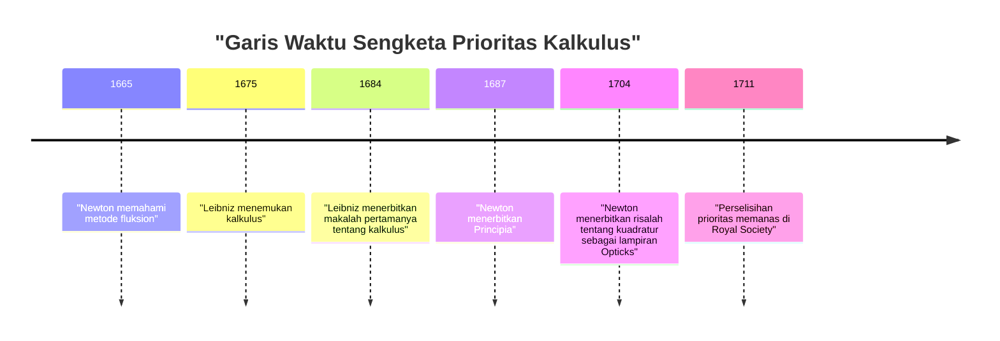
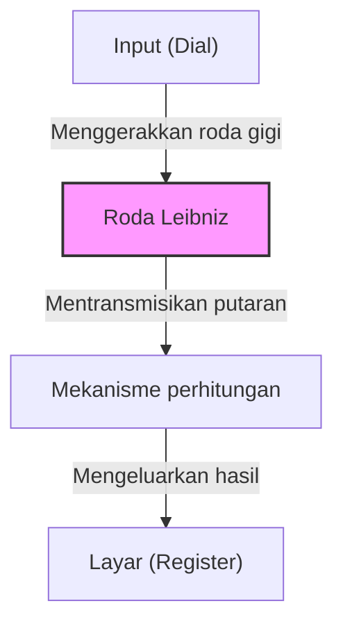

## Pengantar

Gottfried Wilhelm Leibniz (1646–1716) adalah seorang filsuf, matematikawan, dan ilmuwan Jerman yang aktif selama abad ke-17 dan ke-18. Secara historis ia diakui sebagai salah satu intelektual langka yang berhak menyandang gelar "Jenius Universal". Warisan yang ia tinggalkan tidak hanya mencakup matematika dan filsafat, tetapi juga hukum, ilmu politik, sejarah, teologi, linguistik, dan bahkan geologi serta teknik.

Pemikirannya, yang meletakkan dasar bagi sains modern, bukan sekadar akumulasi pengetahuan, tetapi didukung oleh visi besar yang dikenal sebagai *Characteristica universalis* (karakteristik universal)—sebuah upaya untuk mengintegrasikan semua bidang pembelajaran. Dalam artikel ini, kita akan berfokus pada episode kehidupan Leibniz yang bergejolak dan pencapaian matematikanya yang membentuk dasar ilmu pengetahuan dan teknologi modern.

## 1. Kehidupan dan Episode: Jejak Sang Jenius

Kehidupan Leibniz bukanlah kehidupan seorang sarjana penyendiri yang terkurung di menara gading; sebaliknya, kehidupannya sangat erat kaitannya dengan aktivitasnya sebagai diplomat dan penasihat politik yang bepergian ke seluruh Eropa.

### 1.1 Kehidupan Awal dan Bakat Luar Biasa

Pada 1 Juli 1646, Leibniz lahir di Leipzig, di Kekaisaran Romawi Suci (sekarang Jerman). Ayahnya, seorang profesor filsafat moral di Universitas Leipzig, meninggal dunia saat Leibniz baru berusia enam tahun. Namun, perpustakaan luas yang ditinggalkan ayahnya sangat memupuk keingintahuan intelektualnya. Bahkan sebelum diajari di sekolah, ia secara mandiri membaca literatur Latin dan Yunani di perpustakaan ayahnya, menguasai dasar-dasar filsafat dan logika.

Konon ia mengubah puisi dalam bahasa Latin pada usia delapan tahun dan sangat memahami logika Aristoteles pada usia dua belas tahun. Pada usia lima belas tahun, ia mendaftar di Universitas Leipzig untuk belajar filsafat dan hukum. Ia kemudian pindah ke Universitas Altdorf, tempat ia memperoleh gelar doktor di bidang hukum pada usia muda dua puluh tahun. Universitas tersebut menawarinya jabatan profesor, tetapi ia menolak untuk tetap berada di dunia akademis, dan memilih kegiatan praktis di dunia nyata.

### 1.2 Karier sebagai Diplomat dan Tahun-tahun di Paris

Melayani Elektor Mainz, Leibniz memulai kariernya sebagai diplomat. Jerman pada saat itu masih menanggung luka dalam akibat Perang Tiga Puluh Tahun, dan ia mengabdikan dirinya pada proyek-proyek politik dan hukum yang bertujuan untuk menjaga perdamaian.

Pada tahun 1672, ia melakukan perjalanan ke Paris dalam misi diplomatik yang berani (Rencana Mesir) untuk mengalihkan ancaman ke Jerman dengan mengarahkan Raja Louis XIV dari Prancis menuju ekspedisi di Mesir. Meskipun rencana ini pada akhirnya gagal, masa tinggalnya di Paris menjadi **titik balik terbesar** dalam kehidupan akademis Leibniz.

Paris adalah pusat intelektual Eropa pada saat itu, dan ia berkesempatan berinteraksi dengan ilmuwan dan matematikawan papan atas, termasuk Christiaan Huygens. Belajar matematika mutakhir secara intensif di bawah bimbingan Huygens, Leibniz membuat lompatan yang mencengangkan, menemukan kalkulus secara mandiri hanya dalam beberapa tahun.

### 1.3 Aktivitas di Hannover dan Kontribusi di Berbagai Bidang

Pada tahun 1676, Leibniz mulai melayani Kadipaten Hannover (kemudian menjadi Elektorat Brunswick-Lüneburg) sebagai penasihat rahasia dan pustakawan. Di sini, ia menangani berbagai tugas praktis, termasuk menyusun sejarah kadipaten dan merancang pompa drainase untuk tambang di Pegunungan Harz.

Dalam proyek pertambangan tersebut secara khusus, ia merancang sistem pompa canggih yang menggunakan tenaga angin, tetapi terbukti sulit direalisasikan dengan standar teknologi pada masa itu, yang mengakibatkan kegagalan. Namun, pengamatan geologisnya selama periode ini membawanya menulis karya inovatif *Protogaea* mengenai asal usul Bumi, yang sangat memengaruhi geologi di masa depan.

### 1.4 Kesulitan di Tahun-tahun Terakhir dan Kematian yang Sepi

Leibniz mengusulkan pendirian akademi akademik kepada berbagai raja dan menjabat sebagai presiden pertama Akademi Ilmu Pengetahuan Prusia, memainkan peran sentral dalam jaringan akademik Eropa. Ia juga bertemu dengan Peter yang Agung dari Rusia dan memberikan nasihat mengenai reformasi sistem pendidikan Rusia.

Akan tetapi, pada tahun-tahun terakhirnya, reputasinya sangat ternoda oleh "perselisihan prioritas kalkulus" yang meletus dengan [Isaac Newton](https://kenji.blog/id/p/newton/). Selain itu, bahkan setelah tuannya di Hannover berangkat ke London sebagai Raja George I dari Britania Raya, Leibniz diperintahkan untuk menyelesaikan penyusunan buku-buku sejarah dan dipaksa tetap tinggal di Hannover. Ketika ia meninggal pada usia 70 tahun pada 1716, konon hanya sekretarisnya yang menghadiri pemakamannya.

## 2. Pencapaian Matematika: Membangun Fondasi Sains Modern

Warisan terbesar yang ditinggalkan Leibniz untuk sains modern tidak diragukan lagi adalah pembentukan sistem simbolik kalkulus dan usulan sistem biner.

### 2.1 Penemuan Kalkulus dan Penyempurnaan Simbol

Leibniz secara jelas menyadari bahwa masalah menemukan garis singgung suatu kurva (diferensiasi) dan masalah menemukan luas daerah yang dibatasi oleh suatu kurva (integrasi) merupakan operasi kebalikan (Teorema Dasar Kalkulus), dan ia merumuskannya sebagai algoritme yang dapat dihitung.

$$
\int f(x) \,dx \quad \text{dan} \quad \frac{d}{dx}f(x)
$$

Simbol integral $\int$ (huruf S yang memanjang, dari kata Latin *Summa*) dan simbol diferensial $d$ (dari *differentia*, yang berarti perbedaan), yang biasa kita gunakan saat ini, diciptakan oleh Leibniz. Karena notasinya sangat intuitif dan cocok untuk perhitungan mekanis, hal ini sangat mempercepat perkembangan matematika di benua Eropa. Ia juga merumuskan aturan hasil kali untuk diferensiasi (aturan Leibniz).

$$
d(uv) = u \, dv + v \, du
$$

### 2.2 Sengketa Prioritas dengan Newton

Mengenai kalkulus, salah satu perselisihan paling terkenal dalam sejarah sains terjadi dengan ilmuwan Inggris [Isaac Newton](https://kenji.blog/id/p/newton/). Newton telah sampai pada konsep kalkulus (metode fluksion) lebih awal dari Leibniz tetapi tidak mempublikasikannya untuk waktu yang lama. Sementara itu, Leibniz menemukan kalkulus secara mandiri dan mempublikasikannya lebih dulu dalam sebuah makalah pada tahun 1684.

Saat ini, merupakan konsensus umum di antara para sejarawan bahwa **kedua pria tersebut menemukan kalkulus secara sepenuhnya mandiri**. Sementara metode Newton berakar pada fisika dan kinematika, metode Leibniz didasarkan pada pendekatan yang lebih formal dan aljabar.

### 2.3 Pembentukan Sistem Biner

Sistem biner, yang mengekspresikan semua angka hanya menggunakan "0" dan "1" dan membentuk fondasi komputer modern, juga pertama kali dideskripsikan secara sistematis di dunia oleh Leibniz. Ia merancang sistem biner ini dengan menghubungkannya pada pemikiran teologisnya bahwa seluruh dunia diciptakan dari ketiadaan (0) dan Tuhan (1).

$$
13_{10} = 1101_{2}
$$

$$
1 \times 2^3 + 1 \times 2^2 + 0 \times 2^1 + 1 \times 2^0 = 8 + 4 + 0 + 1 = 13
$$

Leibniz juga menyadari bahwa enam puluh empat heksagram dari buku klasik Tiongkok kuno *I Ching* (kombinasi Yin dan Yang) sangat cocok dengan sistem binernya, dan ia menemukan hubungan yang mendalam dengan filsafat Timur.

### 2.4 Determinan dan Sistem Persamaan Linear

Dalam menyelesaikan sistem persamaan linear, Leibniz secara mandiri sampai pada konsep "Determinan" pada waktu yang hampir bersamaan dengan matematikawan Jepang Seki Takakazu. Ia memperlakukan koefisien sebagai sebuah larik dan merancang metode untuk mengeliminasinya secara sistematis, mengambil langkah penting menuju perkembangan aljabar linear di kemudian hari.

### 2.5 Penemuan Kalkulator Stepped Reckoner

Leibniz bukan hanya seorang matematikawan teoretis tetapi juga seorang penemu praktis yang mengukir namanya dalam sejarah kalkulator mekanis. Ia menyempurnakan kalkulator [Blaise Pascal](https://kenji.blog/id/p/pascal/) ([Pascal](https://kenji.blog/id/p/pascal/)ine), yang hanya bisa melakukan penambahan dan pengurangan, dan menemukan kalkulator yang menggunakan "Roda Leibniz" (Stepped Reckoner) yang mampu melakukan perkalian dan pembagian.

Mekanisme ini revolusioner dan terus diadopsi sebagai struktur standar untuk kalkulator mekanis selama beberapa ratus tahun berikutnya.

## 3. Filsafat dan Pemikiran: Monadologi dan Harmoni yang Ditetapkan Sebelumnya

Pencarian matematika Leibniz sangat erat kaitannya dengan sistem filsafatnya yang agung. Filsafatnya dianggap sebagai salah satu puncak rasionalisme.

### 3.1 Monadologi

Dalam karya filosofis representatifnya, *Monadologi*, ia berargumen bahwa dunia terdiri dari "[Monad](https://kenji.blog/id/p/functional-programming-concepts-pure-functions-monads/)", yang merupakan substansi spiritual tertinggi yang tidak memiliki perluasan spasial dan tidak dapat dibagi.

Berbeda dengan atom material, setiap monad adalah unit spiritual dengan persepsinya sendiri. Seperti ungkapan terkenalnya "Monad tidak memiliki jendela", monad tidak berinteraksi langsung satu sama lain.

### 3.2 Harmoni yang Ditetapkan Sebelumnya

Jika demikian, mengapa dunia yang terdiri dari monad tanpa jendela beroperasi dengan harmoni yang sedemikian rupa? Leibniz menjelaskan bahwa Tuhan telah memprogram sebelumnya transisi keadaan internal semua monad agar tersinkronisasi secara sempurna. Ia menyebutnya "Harmoni yang ditetapkan sebelumnya" (Pre-established harmony).

### 3.3 Prinsip Alasan yang Cukup

Leibniz juga memberikan kontribusi signifikan pada logika. Ia mengusulkan "Prinsip alasan yang cukup", yang menyatakan bahwa "tidak ada fakta yang bisa benar atau ada tanpa adanya alasan yang cukup mengapa hal itu demikian dan bukan sebaliknya". Ini menjadi prinsip panduan bagi penyelidikan ilmiah dan filosofisnya.

## 4. Karakteristik Universal dan Impian Kecerdasan Buatan

Leibniz percaya bahwa pemikiran manusia dapat direduksi menjadi perhitungan matematika. Ia bermimpi membangun sebuah "Karakteristik universal" (*Characteristica universalis*) yang akan menyimbolkan semua konsep, dan sebuah *Calculus ratiocinator* untuk memanipulasi simbol-simbol tersebut menurut aturan.

Frasa yang ia tinggalkan, "Mari kita hitung" (*Calculemus*), melambangkan idealnya untuk mendapatkan kebenaran melalui perhitungan daripada perdebatan setiap kali terjadi perselisihan. Konsep ini adalah pelopor logika simbolik dan visi historis yang terhubung langsung dengan teori komputasi [Alan Turing](https://kenji.blog/id/p/turing/) dan konsep modern **Kecerdasan Buatan (AI)**.

## 5. Kesimpulan

Melalui kecerdasannya yang luar biasa, Gottfried Wilhelm Leibniz sangat memperluas batas pengetahuan manusia ke segala arah. Tanpa sistem simbolik kalkulusnya, perkembangan fisika dan teknik modern tidak mungkin terjadi, dan tanpa sistem binernya, masyarakat komputer modern kita tidak akan ada.

Meskipun ia menghabiskan tahun-tahun terakhirnya dalam kesulitan karena perselisihannya dengan Newton dan keadaan politik, benih penyelidikan intelektual yang ia tabur terus berkembang pesat di dunia modern ratusan tahun kemudian. Leibniz benar-benar seorang "Jenius Universal" yang terus bersinar melintasi zaman.
