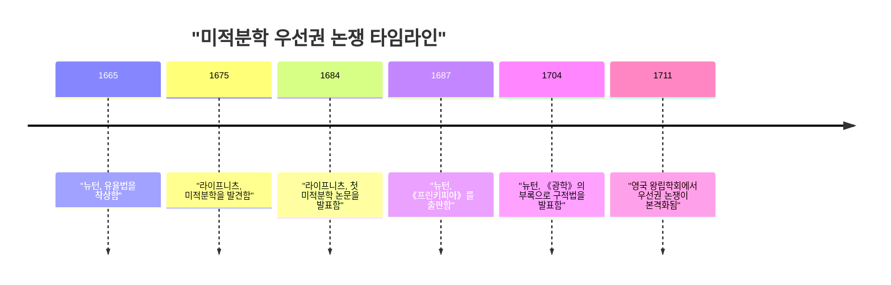
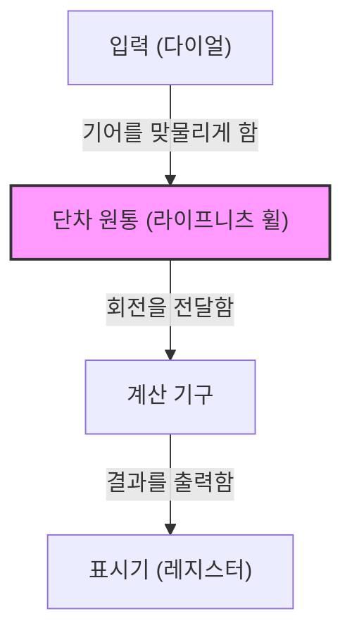

## 머리말

고트프리트 빌헬름 라이프니츠(Gottfried Wilhelm Leibniz, 1646–1716)는 17세기부터 18세기에 걸쳐 활약한 독일의 철학자, 수학자, 과학자이며 인류 역사상 보기 드문 '보편적 천재(Universal Genius)'로 불리는 지식인 중 한 명입니다. 그가 남긴 업적은 수학과 철학뿐만 아니라 법학, 정치학, 역사학, 신학, 언어학, 나아가 지질학과 공학 등 당시의 모든 학문 영역에 걸쳐 있습니다.

근대 과학의 초석을 다진 그의 사상은 단순한 지식의 축적에 머물지 않고, 모든 학문을 통합하려는 '보편 기호론(Characteristica universalis)'이라는 웅대한 비전에 바탕을 두고 있었습니다. 본 기사에서는 라이프니츠의 파란만장한 생애의 일화와 현대 과학 기술의 기반이 된 수학적 위업에 초점을 맞추어 그의 심오한 사상 세계를 자세히 해설합니다.

## 1. 생애와 일화: 천재의 궤적

라이프니츠의 생애는 상아탑에 틀어박힌 고독한 학자의 삶이 아니라, 유럽 전역을 누비는 외교관이자 정치 고문으로서의 활동과 밀접하게 연결되어 있었습니다.

### 1.1 유년기와 조숙한 재능

1646년 7월 1일, 라이프니츠는 신성 로마 제국(현재의 독일)의 라이프치히에서 태어났습니다. 그의 아버지는 라이프치히 대학교의 도덕철학 교수였으나, 라이프니츠가 불과 6살 때 세상을 떠났습니다. 그러나 아버지가 남긴 방대한 장서는 그의 지적 호기심을 크게 키워주었습니다. 그는 학교에서 배우기도 전에 아버지의 서재에서 라틴어와 그리스어 문헌을 독학으로 탐독하며 철학과 논리학의 기초를 다졌습니다.

8살 때 라틴어로 시를 지었고, 12살 때 아리스토텔레스의 논리학을 깊이 이해하고 있었다고 전해집니다. 15살에 라이프치히 대학교에 입학하여 철학과 법학을 공부했습니다. 그 후 알트도르프 대학교로 옮겨 불과 20살의 나이에 법학 박사 학위를 취득했습니다. 대학 측은 그에게 교수직을 제안했지만, 그는 학계에 머무는 것을 거부하고 현실 사회에서의 실무적인 활동을 선택했습니다.

### 1.2 외교관으로서의 활약과 파리 시대

마인츠 선제후를 섬기게 된 라이프니츠는 외교관으로서의 경력을 시작합니다. 당시 독일은 30년 전쟁의 상흔이 깊게 남아 있었고, 그는 평화 유지를 위한 정치적·법적 프로젝트를 위해 분주하게 움직였습니다.

1672년, 그는 프랑스의 루이 14세를 이집트 원정으로 향하게 함으로써 독일에 대한 위협을 돌리려는 대담한 외교 임무(이집트 계획)를 띠고 파리로 향했습니다. 이 계획 자체는 실패로 끝났지만, 파리 체류는 라이프니츠의 학문적 생애에 있어 **가장 큰 전환점** 이 되었습니다.

당시 파리는 유럽 학문의 중심지였으며, 그는 크리스티안 하위헌스를 비롯한 일류 과학자와 수학자들과 교류할 기회를 얻었습니다. 하위헌스의 지도 아래 최첨단 수학을 맹렬히 공부한 라이프니츠는 불과 몇 년 만에 미적분학을 독자적으로 발견하는 경이로운 도약을 이뤄냅니다.

### 1.3 하노버에서의 활동과 다방면으로의 공헌

1676년, 라이프니츠는 하노버 공국(이후 브라운슈바이크-뤼네부르크 선제후국)에 궁정 고문관 겸 도서관장으로 부임하게 됩니다. 이곳에서 그는 공국의 역사서 편찬과 하르츠 산맥 광산의 배수 펌프 설계 등 다양한 실무를 처리했습니다.

특히 광산 프로젝트에서는 풍력을 이용한 고도의 펌프 시스템을 고안했지만, 당시의 기술 수준으로는 실현이 어려워 좌절을 맛보게 됩니다. 그러나 이때의 지질학적 관찰을 바탕으로 지구의 기원에 관한 획기적인 저서인 '프로토가이아(Protogaea)'를 집필하여 후대 지질학에 큰 영향을 미쳤습니다.

### 1.4 말년의 불우함과 고독한 죽음

라이프니츠는 각국의 군주들에게 학술 아카데미의 설립을 제안하고, 프로이센 과학 아카데미의 초대 회장으로 취임하는 등 유럽 학술 네트워크의 중심적인 역할을 수행했습니다. 또한 러시아의 표트르 대제를 알현하고 러시아의 교육 제도 개혁에 조언을 제공하기도 했습니다.

그러나 말년에는 [아이작 뉴턴](https://kenji.blog/ko/p/newton/)과 벌어진 '미적분학 우선권 논쟁'으로 인해 명예가 크게 실추되었습니다. 게다가 하노버의 군주가 영국 국왕 조지 1세로서 런던으로 떠난 후에도 그는 역사서 편찬을 완성하라는 명령을 받고 하노버에 남겨지는 등 불우한 시절을 보냈습니다. 1716년 70세의 나이로 세상을 떠났을 때, 그의 장례식에 참석한 사람은 비서 단 한 명뿐이었다고 전해집니다.

## 2. 수학적 업적: 근대 과학의 기초를 다지다

라이프니츠가 현대 과학에 남긴 가장 큰 유산은 의심할 여지 없이 미적분학의 기호 체계 확립과 이진법의 제창입니다.

### 2.1 미적분학의 발견과 기호의 세련화

라이프니츠는 곡선의 접선을 구하는 문제(미분)와 곡선으로 둘러싸인 넓이를 구하는 문제(적분)가 서로 역연산 관계에 있다는 것(미적분학의 기본 정리)을 명확히 인식하고, 이를 계산 가능한 알고리즘으로 정식화했습니다.

$$
\int f(x) \,dx \quad \text{및} \quad \frac{d}{dx}f(x)
$$

현재 우리가 당연하게 사용하는 적분 기호 $\int$(라틴어 Summa의 첫 글자 S를 길게 늘인 것)나 미분 기호 $d$(차이를 의미하는 differentia의 첫 글자)는 모두 라이프니츠가 고안한 것입니다. 그의 기호법은 직관적이고 기계적인 계산에 매우 적합했기 때문에 유럽 대륙의 수학 발전을 크게 가속화시켰습니다. 또한 곱의 미분법(라이프니츠의 법칙)도 그에 의해 공식화되었습니다.

$$
d(uv) = u \, dv + v \, du
$$

### 2.2 뉴턴과의 우선권 논쟁

미적분학을 둘러싸고, 그는 영국의 [아이작 뉴턴](https://kenji.blog/ko/p/newton/)과 과학사에서 가장 유명한 논쟁 중 하나를 벌이게 됩니다. 뉴턴은 라이프니츠보다 먼저 미적분의 개념(유율법)에 도달했지만, 오랫동안 이를 발표하지 않았습니다. 반면 라이프니츠는 독자적으로 미적분학을 발견하여 1684년에 먼저 논문으로 발표했습니다.

오늘날 역사학자들의 공통된 견해는 **두 사람 모두 완전히 독립적으로 미적분학을 발견했다** 는 것입니다. 뉴턴의 방법은 물리학과 운동학에 뿌리를 두고 있었던 반면, 라이프니츠의 방법은 보다 형식적이고 대수학적인 접근에 기반하고 있었습니다.

### 2.3 이진법(Binary System)의 확립

현대 컴퓨터의 기반이 되는, 오직 '0'과 '1'만으로 모든 수를 표현하는 이진법 역시 라이프니츠가 세계 최초로 체계화했습니다. 그는 아무것도 없는 상태(0)와 신(1)으로부터 모든 세계가 창조된다는 신학적 사상과 결부시켜 이 이진법을 고안했습니다.

$$
13_{10} = 1101_{2}
$$

$$
1 \times 2^3 + 1 \times 2^2 + 0 \times 2^1 + 1 \times 2^0 = 8 + 4 + 0 + 1 = 13
$$

라이프니츠는 중국의 고전인 《주역》의 64괘(음과 양의 조합)가 자신의 이진법 체계와 완벽하게 일치한다는 사실을 깨닫고, 동양 사상과의 깊은 연관성을 발견하기도 했습니다.

### 2.4 행렬식과 연립일차방정식

연립일차방정식의 풀이에서 라이프니츠는 일본의 [세키 다카카즈](https://kenji.blog/ko/p/seki-takakazu/)와 거의 같은 시기에 독립적으로 '행렬식(Determinant)'의 개념에 도달했습니다. 그는 계수를 배열로 취급하고 이를 체계적으로 소거하는 기법을 고안하여 훗날 선형대수학의 발전을 향한 중요한 발걸음을 내디뎠습니다.

### 2.5 톱니바퀴식 계산기의 발명

이론적인 수학뿐만 아니라 실용적인 발명가로서의 면모도 지닌 라이프니츠는 기계식 계산기의 역사에도 이름을 남겼습니다. 그는 [블레즈 파스칼](https://kenji.blog/ko/p/pascal/)이 발명한 덧셈과 뺄셈만 가능한 계산기(파스칼린)를 개량하여 곱셈과 나눗셈도 가능한 '라이프니츠 휠(단차 원통)'을 이용한 계산기(스텝 레코너)를 발명했습니다.

이 메커니즘은 획기적이었으며, 이후 수백 년 동안 기계식 계산기의 표준적인 구조로 채택되었습니다.

## 3. 철학과 사상: 모나드와 예정조화

라이프니츠의 수학적 탐구는 그의 웅대한 철학 체계와 깊이 결부되어 있었습니다. 그의 철학은 합리주의의 정점 중 하나로 여겨집니다.

### 3.1 모나드론(단자론)

그의 대표적인 철학 저서 《모나드론》에서 그는 세계가 공간적인 연장을 갖지 않고 더 이상 분할할 수 없는 궁극적인 정신적 실체인 '모나드([Monad](https://kenji.blog/ko/p/functional-programming-concepts-pure-functions-monads/))'로 구성되어 있다고 주장했습니다.

물질적인 원자와 달리, 모나드는 각각이 고유한 지각을 갖는 정신적인 단위입니다. "모나드에는 창문이 없다"는 그의 유명한 말이 시사하듯, 모나드끼리는 서로 직접적으로 상호작용하지 않습니다.

### 3.2 예정조화설

그렇다면 왜 창문이 없는 모나드들로 구성된 세계가 이토록 완벽한 조화를 유지하며 움직이는 것일까요? 라이프니츠는 신이 미리 모든 모나드의 내부 상태 변화를 완전히 동기화시켜 프로그래밍해 놓았기 때문이라고 설명했습니다. 이를 '예정조화(Pre-established harmony)'라고 부릅니다.

### 3.3 충족이유율

라이프니츠는 논리학에서도 중요한 공헌을 했습니다. "어떠한 사실도 그것이 그렇게 되기 위한 충분한 이유가 없이는 참이거나 존재할 수 없다"는 '충족이유율(Principle of sufficient reason)'을 제창했으며, 이것이 그의 과학적·철학적 탐구의 지도 원리가 되었습니다.

## 4. 보편 기호론과 인공지능의 꿈

라이프니츠는 인간의 사고를 수학적인 계산으로 환원할 수 있다고 믿었습니다. 그는 모든 개념을 기호화하는 '보편 기호론(Characteristica universalis)'과 그 기호들을 규칙에 따라 조작하는 '추론 계산(Calculus ratiocinator)'의 구축을 꿈꿨습니다.

그가 남긴 "계산해 봅시다(Calculemus)"라는 말은 의견 충돌이 발생했을 때 논쟁이 아니라 계산에 의해 진리를 도출하겠다는 그의 이상을 상징합니다. 이 구상은 기호논리학의 선구자격인 아이디어였으며, 훗날 [앨런 튜링](https://kenji.blog/ko/p/turing/) 등의 계산 이론이나 현대 **인공지능(AI)** 의 개념과 직결되는 역사적인 비전이었습니다.

## 5. 맺음말

고트프리트 빌헬름 라이프니츠는 특출난 지성으로 인류 지식의 개척지를 모든 방향으로 크게 넓혔습니다. 그의 미적분학 기호 체계가 없었다면 근대 물리학과 공학의 발전은 불가능했을 것이며, 그의 이진법이 없었다면 현대의 컴퓨터 사회는 존재하지 않았을 것입니다.

생전에는 뉴턴과의 논쟁과 정치적인 상황으로 인해 불우한 말년을 보냈지만, 그가 뿌린 지적 탐구의 씨앗은 수백 년이 지난 오늘날에도 여전히 풍성한 꽃을 피우고 있습니다. 라이프니츠는 실로 시대를 초월하여 빛을 발하는 '보편적 천재'입니다.
