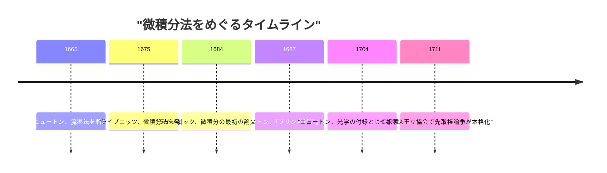
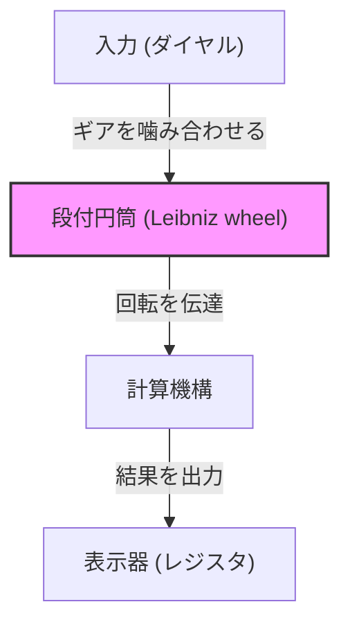

## はじめに

ゴットフリート・ヴィルヘルム・[ライプニッツ](https://kenji.blog/p/leibniz/)（Gottfried Wilhelm Leibniz, 1646–1716）は、17世紀から18世紀にかけて活躍したドイツの哲学者、数学者、科学者であり、人類の歴史において「普遍の天才（Universal Genius）」と称される稀有な知識人の一人です。彼が残した業績は、数学や哲学のみならず、法学、政治学、歴史学、神学、言語学、さらには地質学や工学など、当時のあらゆる学問領域に及んでいます。

近代科学の礎を築いた彼の思想は、単なる知識の集積に留まらず、すべての学問を統合する「普遍記号論（Characteristica universalis）」という壮大なビジョンに支えられていました。本記事では、[ライプニッツ](https://kenji.blog/p/leibniz/)の波乱に満ちた生涯のエピソードと、現代の科学技術の基盤ともなっている数学的な偉業に焦点を当て、その深遠な思想の世界を詳しく解説します。

## 1. 生涯とエピソード：天才の軌跡

[ライプニッツ](https://kenji.blog/p/leibniz/)の生涯は、象牙の塔にこもる孤独な学者のそれではなく、ヨーロッパ中を駆け回る外交官、政治顧問としての活動と密接に結びついていました。

### 1.1 幼少期と早熟な才能

1646年7月1日、[ライプニッツ](https://kenji.blog/p/leibniz/)は神聖ローマ帝国（現在のドイツ）のライプツィヒで誕生しました。父親はライプツィヒ大学の道徳哲学教授でしたが、[ライプニッツ](https://kenji.blog/p/leibniz/)がわずか6歳の時に他界します。しかし、父親が遺した膨大な蔵書が彼の知的好奇心を大いに育むことになりました。彼は学校で教えられるよりも前に、父の書庫でラテン語やギリシャ語の文献を独学で読み漁り、哲学や論理学の基礎を身につけました。

8歳の時にはラテン語で詩を作り、12歳でアリストテレスの論理学を深く理解していたと伝えられています。15歳でライプツィヒ大学に入学し、哲学と法学を学びました。その後、アルトドルフ大学に移り、わずか20歳で法学の博士号を取得しました。大学側は彼に教授職をオファーしましたが、彼は学問の世界にとどまることを拒み、実社会での実務的な活動を選びました。

### 1.2 外交官としての活躍とパリ時代

マインツ選帝侯に仕えることになった[ライプニッツ](https://kenji.blog/p/leibniz/)は、外交官としてのキャリアをスタートさせます。当時のドイツは三十年戦争の爪痕が深く残っており、彼は平和維持のための政治的・法的なプロジェクトに奔走しました。

1672年、彼はフランスのルイ14世をエジプト遠征へと向かわせることで、ドイツへの脅威を逸らすという大胆な外交任務（エジプト計画）を帯びてパリに赴きました。この計画自体は失敗に終わりましたが、パリ滞在は[ライプニッツ](https://kenji.blog/p/leibniz/)の学問的生涯において **最大の転機** となりました。

当時のパリはヨーロッパの学問の中心であり、彼はクリスティアーン・ホイヘンスをはじめとする一流の科学者や数学者たちと交流する機会を得ました。ホイヘンスの指導のもとで最先端の数学を猛勉強した[ライプニッツ](https://kenji.blog/p/leibniz/)は、わずか数年のうちに微積分法を独自に発見するという驚異的な飛躍を遂げます。

### 1.3 ハノーファーでの活動と多方面への貢献

1676年、[ライプニッツ](https://kenji.blog/p/leibniz/)はハノーファー公国（後のブラウンシュヴァイク＝リューネブルク選帝侯領）に宮廷顧問官兼図書館長として仕えることになります。ここで彼は、公国の歴史書の編纂や、ハルツ山地の鉱山の排水ポンプの設計など、多岐にわたる実務をこなしました。

特に鉱山プロジェクトでは、風力を利用した高度なポンプシステムを考案しましたが、当時の技術水準では実現が難しく、挫折を味わうことになります。しかし、この時の地質学的な観察から、地球の起源に関する画期的な著作『プロトガエア（Protogaea）』を執筆し、後の地質学に大きな影響を与えました。

### 1.4 晩年の不遇と孤独な死

[ライプニッツ](https://kenji.blog/p/leibniz/)は各国の君主に学術アカデミーの設立を提案し、ベルリン科学アカデミーの初代会長に就任するなど、ヨーロッパの学術ネットワークの中心的な役割を果たしました。また、ロシアのピョートル大帝にも謁見し、ロシアにおける教育制度の改革に助言を与えました。

しかし晩年は、アイザック・[ニュートン](https://kenji.blog/p/newton/)との間で勃発した「微積分法の先取権論争」によって名誉を深く傷つけられました。また、ハノーファーの主君がイギリス国王ジョージ1世としてロンドンへ去った後も、彼は歴史書の編纂を完成させるよう命じられ、ハノーファーに留め置かれるなど、不遇な時代を過ごしました。1716年に70歳で亡くなった際、彼の葬儀に参列したのは秘書ただ一人だったと言われています。

## 2. 数学的業績：近代科学の基礎を築く

[ライプニッツ](https://kenji.blog/p/leibniz/)が現代科学に残した最大の遺産は、間違いなく微積分法の記号体系の確立と、二進法の提唱です。

### 2.1 微積分法の発見と記号の洗練

[ライプニッツ](https://kenji.blog/p/leibniz/)は、曲線の接線を求める問題（微分）と、曲線に囲まれた面積を求める問題（積分）が、互いに逆の演算であること（微積分学の基本定理）を明確に認識し、それを計算可能なアルゴリズムとして定式化しました。

$$
\int f(x) \,dx \quad \text{および} \quad \frac{d}{dx}f(x)
$$

現在私たちが当たり前のように使っている積分記号 $\int$ （ラテン語の Summa の頭文字 S を引き伸ばしたもの）や、微分記号 $d$ （差を意味する differentia の頭文字）は、[ライプニッツ](https://kenji.blog/p/leibniz/)が考案したものです。彼の記号法は極めて直感的かつ機械的な計算に適していたため、ヨーロッパ大陸の数学の発展を大きく加速させました。また、積の微分法則（[ライプニッツ](https://kenji.blog/p/leibniz/)の法則）も彼によって定式化されました。

$$
d(uv) = u \, dv + v \, du
$$

### 2.2 [ニュートン](https://kenji.blog/p/newton/)との先取権論争

微積分法を巡っては、イギリスのアイザック・[ニュートン](https://kenji.blog/p/newton/)との間に科学史上最も有名な論争の一つが起こりました。ニュートンはライプニッツよりも早く微積分の概念（流率法）に到達していましたが、それを長らく発表していませんでした。一方、[ライプニッツ](https://kenji.blog/p/leibniz/)は独自に微積分法を発見し、1684年に先に論文として公表しました。

現在では、 **両者は完全に独立に微積分法を発見した** というのが歴史家たちの共通見解です。[ニュートン](https://kenji.blog/p/newton/)の方法は物理学と運動学に根ざしていたのに対し、[ライプニッツ](https://kenji.blog/p/leibniz/)の方法はより形式的で代数的なアプローチに基づいていました。

### 2.3 二進法（Binary System）の確立

現代のコンピュータの基盤となっている「 0 」と「 1 」だけで全ての数を表現する二進法も、[ライプニッツ](https://kenji.blog/p/leibniz/)が世界で初めて体系的に記述しました。彼は、何もない状態（0）と神（1）から全ての世界が創造されるという神学的な思想と結びつけて、この二進法を考案しました。

$$
13_{10} = 1101_{2}
$$

$$
1 \times 2^3 + 1 \times 2^2 + 0 \times 2^1 + 1 \times 2^0 = 8 + 4 + 0 + 1 = 13
$$

[ライプニッツ](https://kenji.blog/p/leibniz/)は、中国の古典『易経』の六十四卦（陰と陽の組み合わせ）が自身の二進法の体系と完全に一致していることにも気づき、東洋思想との間に深い繋がりを見出しました。

### 2.4 行列式と連立一次方程式

[ライプニッツ](https://kenji.blog/p/leibniz/)は、連立一次方程式の解法において、日本の[関孝和](https://kenji.blog/p/seki-takakazu/)とほぼ同時期に独立して「[行列式](/p/geometric-meaning-of-determinant/)（Determinant）」の概念に到達していました。彼は係数を配列として扱い、それらを系統的に消去する手法を考案し、後の線形代数学の発展に向けた重要な一歩を踏み出しました。

### 2.5 歯車式計算機の発明

理論的な数学だけでなく、実践的な発明家としての顔も持つ[ライプニッツ](https://kenji.blog/p/leibniz/)は、機械式計算機の歴史にも名を刻んでいます。彼は[ブレーズ・パスカル](https://kenji.blog/p/pascal/)が発明した加減算しかできない計算機（パスカリーヌ）を改良し、乗算・除算も可能な「段付円筒（Leibniz wheel）」を用いた計算機（ステップ・レコナー）を発明しました。

このメカニズムは画期的であり、その後数百年間にわたり機械式計算機の標準的な構造として採用され続けました。

## 3. 哲学と思想：[モナド](https://kenji.blog/p/functional-programming-concepts-pure-functions-monads/)と予定調和

[ライプニッツ](https://kenji.blog/p/leibniz/)の数学的探求は、彼の壮大な哲学体系と深く結びついていました。彼の哲学は、合理主義の頂点の一つとされています。

### 3.1 [モナド](https://kenji.blog/p/functional-programming-concepts-pure-functions-monads/)ロジー（単子論）

彼の代表的な哲学的著作『モナドロジー（単子論）』では、世界は空間的な広がりを持たず、これ以上分割不可能な究極の精神的実体である「モナド（[Monad](https://kenji.blog/p/functional-programming-concepts-pure-functions-monads/)）」から構成されていると主張しました。

物質的な原子とは異なり、モナドはそれぞれが独自の知覚を持つ精神的な単位です。有名な言葉「モナドには窓がない」が示すように、モナド同士は直接相互作用することはありません。

### 3.2 予定調和説

では、なぜ窓のないモナドたちから構成される世界が、これほどまでに調和を保って動いているのでしょうか。[ライプニッツ](https://kenji.blog/p/leibniz/)は、神があらかじめ全ての[モナド](https://kenji.blog/p/functional-programming-concepts-pure-functions-monads/)の内部状態の推移を完全にシンクロナイズさせてプログラムしているからだ、と説明しました。これを「予定調和（Pre-established harmony）」と呼びます。

### 3.3 充足理由の原理

[ライプニッツ](https://kenji.blog/p/leibniz/)は論理学においても重要な貢献をしました。「いかなる事象も、それがそうであるための十分な理由がなければ存在し得ない」とする「充足理由の原理（Principle of sufficient reason）」を提唱し、これが彼の科学的・哲学的探求の指導原理となりました。

## 4. 普遍記号論と人工知能の夢

[ライプニッツ](https://kenji.blog/p/leibniz/)は、人間の思考を数学的な計算に還元できると考えました。彼は、すべての概念を記号化する「普遍記号論（Characteristica universalis）」と、それらの記号を規則に従って操作する「推論計算（Calculus ratiocinator）」の構築を夢見ました。

彼が残した「計算しようではないか（Calculemus）」という言葉は、見解の相違が生じた際に、議論ではなく計算によって真理を導き出すという彼の理想を象徴しています。この構想は、記号論理学の先駆けであり、後の[アラン・チューリング](https://kenji.blog/p/turing/)らによる計算理論や、現代の **人工知能（AI）** の概念へと直結する歴史的なビジョンでした。

## 5. おわりに

ゴットフリート・ヴィルヘルム・[ライプニッツ](https://kenji.blog/p/leibniz/)は、その卓越した知性によって、人類の知識のフロンティアをあらゆる方向に大きく広げました。彼の微積分法の記号体系なしには近代物理学や工学の発展はあり得ず、彼の二進法なしには現代のコンピュータ社会は存在しませんでした。

生前は[ニュートン](https://kenji.blog/p/newton/)との論争や政治的な状況により不遇な晩年を過ごしましたが、彼が蒔いた知的探求の種は、数百年後の現代においてもなお豊かな花を咲かせ続けています。[ライプニッツ](https://kenji.blog/p/leibniz/)はまさに、時代を超えて輝き続ける「普遍の天才」なのです。
