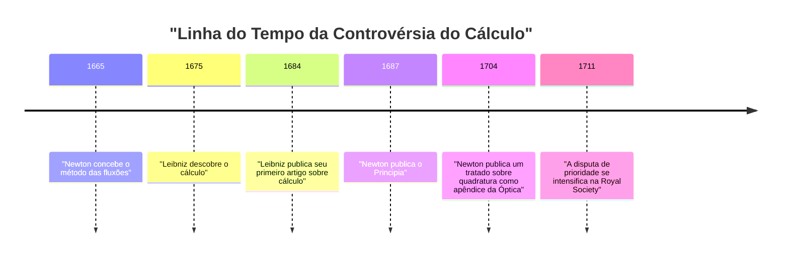
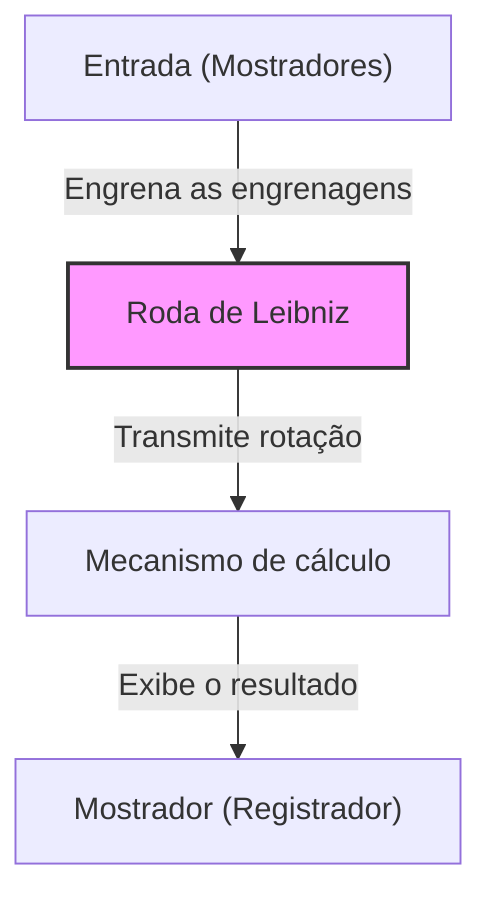

## Introdução

Gottfried Wilhelm Leibniz (1646–1716) foi um filósofo, matemático e cientista alemão que atuou durante os séculos XVII e XVIII. Ele é historicamente reconhecido como um dos raros intelectuais que merecem o título de "Gênio Universal". O legado que ele deixou abrange não apenas a matemática e a filosofia, mas também o direito, a ciência política, a história, a teologia, a linguística e até mesmo a geologia e a engenharia.

Seus pensamentos, que lançaram as bases da ciência moderna, não foram meramente um acúmulo de conhecimento, mas foram sustentados por uma visão grandiosa conhecida como *Characteristica universalis* (característica universal) — uma tentativa de integrar todos os campos do saber. Neste artigo, focaremos nos episódios da vida turbulenta de Leibniz e em suas realizações matemáticas que formam a base da ciência e da tecnologia modernas, fornecendo uma explicação aprofundada do seu profundo mundo de pensamento.

## 1. Vida e Episódios: A Trajetória de um Gênio

A vida de Leibniz não foi a de um estudioso solitário confinado em uma torre de marfim; ao contrário, esteve intimamente ligada às suas atividades como diplomata e conselheiro político viajando por toda a Europa.

### 1.1 Início de Vida e Talento Precoce

Em 1º de julho de 1646, Leibniz nasceu em Leipzig, no Sacro Império Romano-Germânico (atual Alemanha). Seu pai, professor de filosofia moral na Universidade de Leipzig, faleceu quando Leibniz tinha apenas seis anos. No entanto, a vasta biblioteca deixada por seu pai nutriu enormemente sua curiosidade intelectual. Antes mesmo de ser ensinado na escola, ele lia de forma independente literatura em latim e grego na biblioteca de seu pai, dominando os fundamentos da filosofia e da lógica.

Diz-se que ele compôs poesias em latim aos oito anos e compreendia profundamente a lógica de Aristóteles aos doze. Aos quinze, matriculou-se na Universidade de Leipzig para estudar filosofia e direito. Em seguida, transferiu-se para a Universidade de Altdorf, onde obteve um doutorado em direito com a jovem idade de vinte anos. A universidade ofereceu-lhe um cargo de professor, mas ele recusou-se a permanecer no mundo acadêmico, optando por atividades práticas no mundo real.

### 1.2 Carreira como Diplomata e os Anos em Paris

Servindo ao Eleitor de Mainz, Leibniz iniciou sua carreira como diplomata. A Alemanha da época ainda carregava as profundas cicatrizes da Guerra dos Trinta Anos, e ele dedicou-se a projetos políticos e jurídicos voltados à manutenção da paz.

Em 1672, ele viajou a Paris em uma ousada missão diplomática (o Plano Egípcio) para desviar a ameaça à Alemanha, direcionando o rei Luís XIV da França para uma expedição ao Egito. Embora esse plano tenha fracassado, sua estadia em Paris tornou-se o **maior ponto de virada** na vida acadêmica de Leibniz.

Paris era o centro intelectual da Europa na época, e ele teve a oportunidade de interagir com cientistas e matemáticos de alto nível, incluindo Christiaan Huygens. Estudando matemática de ponta intensivamente sob a orientação de Huygens, Leibniz deu um salto surpreendente, descobrindo o cálculo de forma independente em apenas alguns anos.

### 1.3 Atividades em Hanôver e Contribuições em Diversas Áreas

Em 1676, Leibniz começou a servir ao Ducado de Hanôver (posteriormente Eleitorado de Brunswick-Lüneburg) como conselheiro privado e bibliotecário. Lá, ele lidou com uma ampla gama de tarefas práticas, incluindo a compilação da história do ducado e o projeto de bombas de drenagem para as minas nas montanhas Harz.

No projeto de mineração, em particular, ele idealizou um sistema avançado de bombas movido a energia eólica, mas provou ser difícil de realizar com os padrões tecnológicos da época, resultando em um revés. No entanto, suas observações geológicas durante esse período levaram-no a escrever a obra pioneira *Protogaea* sobre a origem da Terra, que influenciou profundamente a geologia posterior.

### 1.4 Dificuldades nos Últimos Anos e uma Morte Solitária

Leibniz propôs o estabelecimento de academias a vários monarcas e atuou como o primeiro presidente da Academia Prussiana de Ciências, desempenhando um papel central na rede acadêmica europeia. Ele também teve uma audiência com Pedro, o Grande, da Rússia, e forneceu conselhos sobre a reforma do sistema educacional russo.

Em seus últimos anos, no entanto, sua reputação foi profundamente manchada pela "controvérsia sobre a prioridade do cálculo" que eclodiu com [Isaac Newton](https://kenji.blog/pt/p/newton/). Além disso, mesmo depois de seu soberano em Hanôver ter partido para Londres como Rei Jorge I da Grã-Bretanha, Leibniz recebeu ordens para concluir a compilação dos livros de história e foi forçado a permanecer em Hanôver, enfrentando um período de infortúnio. Quando ele morreu aos 70 anos em 1716, diz-se que apenas seu secretário compareceu ao seu funeral.

## 2. Realizações Matemáticas: Construindo as Bases da Ciência Moderna

Os maiores legados que Leibniz deixou para a ciência moderna são, sem dúvida, o estabelecimento do sistema simbólico do cálculo e a proposição do sistema binário.

### 2.1 A Descoberta do Cálculo e o Refinamento dos Símbolos

Leibniz reconheceu claramente que o problema de encontrar a tangente de uma curva (diferenciação) e o problema de encontrar a área delimitada por uma curva (integração) são operações inversas (o Teorema Fundamental do Cálculo), e ele formulou isso como um algoritmo computável.

$$
\int f(x) \,dx \quad \text{e} \quad \frac{d}{dx}f(x)
$$

O símbolo de integral $\int$ (um S alongado, da palavra latina *Summa*) e o símbolo de diferencial $d$ (de *differentia*, que significa diferença), que usamos com tanta naturalidade hoje, foram inventados por Leibniz. Como sua notação era extremamente intuitiva e adequada para cálculos mecânicos, ela acelerou grandemente o desenvolvimento da matemática na Europa continental. Ele também formulou a regra do produto para diferenciação (regra de Leibniz).

$$
d(uv) = u \, dv + v \, du
$$

### 2.2 A Controvérsia de Prioridade com Newton

Sobre o cálculo, ocorreu uma das controvérsias mais famosas da história da ciência, com o inglês [Isaac Newton](https://kenji.blog/pt/p/newton/). Newton havia chegado ao conceito de cálculo (o método das fluxões) antes de Leibniz, mas não o publicou por muito tempo. Enquanto isso, Leibniz descobriu o cálculo de forma independente e o publicou primeiro em um artigo de 1684.

Hoje, é consenso comum entre os historiadores que **ambos descobriram o cálculo de forma totalmente independente**. Enquanto o método de Newton estava enraizado na física e na cinemática, o método de Leibniz baseava-se em uma abordagem mais formal e algébrica.

### 2.3 O Estabelecimento do Sistema Binário

O sistema binário, que expressa todos os números usando apenas "0" e "1" e forma a base dos computadores modernos, também foi descrito sistematicamente pela primeira vez no mundo por Leibniz. Ele concebeu esse sistema binário associando-o ao seu pensamento teológico de que todo o mundo foi criado a partir do nada (0) e de Deus (1).

$$
13_{10} = 1101_{2}
$$

$$
1 \times 2^3 + 1 \times 2^2 + 0 \times 2^1 + 1 \times 2^0 = 8 + 4 + 0 + 1 = 13
$$

Leibniz também percebeu que os sessenta e quatro hexagramas do clássico chinês *I Ching* (combinações de Yin e Yang) combinavam perfeitamente com seu sistema binário, encontrando uma conexão profunda com a filosofia oriental.

### 2.4 Determinantes e Sistemas de Equações Lineares

Ao resolver sistemas de equações lineares, Leibniz chegou independentemente ao conceito de "Determinante" quase na mesma época que o matemático japonês Seki Takakazu. Ele tratou os coeficientes como uma matriz e concebeu um método para eliminá-los sistematicamente, dando um passo importante em direção ao posterior desenvolvimento da álgebra linear.

### 2.5 A Invenção da Calculadora de Roda Escalonada

Leibniz não foi apenas um matemático teórico, mas também um inventor prático que cravou seu nome na história das calculadoras mecânicas. Ele aprimorou a calculadora de [Blaise Pascal](https://kenji.blog/pt/p/pascal/) (a [Pascal](https://kenji.blog/pt/p/pascal/)ine), que só podia realizar adição e subtração, e inventou uma calculadora usando a "Roda de Leibniz" (o Cilindro Escalonado) capaz de realizar multiplicação e divisão.

Esse mecanismo foi revolucionário e continuou a ser adotado como a estrutura padrão para calculadoras mecânicas ao longo dos séculos seguintes.

## 3. Filosofia e Pensamento: Monadologia e Harmonia Pré-estabelecida

As buscas matemáticas de Leibniz estavam profundamente ligadas ao seu grandioso sistema filosófico. Sua filosofia é considerada um dos pináculos do racionalismo.

### 3.1 A Monadologia

Em sua obra filosófica representativa, *Monadologia*, ele argumentou que o mundo é composto por "Mônadas", que são substâncias espirituais primordiais que carecem de extensão espacial e são indivisíveis.

Ao contrário dos átomos materiais, cada mônada é uma unidade espiritual com sua própria percepção. Como sugere sua famosa frase "As mônadas não têm janelas", as mônadas não interagem diretamente umas com as outras.

### 3.2 A Harmonia Pré-estabelecida

Sendo assim, por que um mundo composto de mônadas sem janelas opera com tamanha harmonia? Leibniz explicou que Deus havia pré-programado a transição dos estados internos de todas as mônadas para que estivessem perfeitamente sincronizadas. Ele chamou isso de "Harmonia pré-estabelecida".

### 3.3 O Princípio da Razão Suficiente

Leibniz também fez contribuições significativas à lógica. Ele propôs o "Princípio da razão suficiente", que estabelece que "nenhum fato pode ser verdadeiro ou existente sem uma razão suficiente para que seja assim e não de outra forma". Isso se tornou o princípio orientador de suas investigações científicas e filosóficas.

## 4. Característica Universal e o Sonho da Inteligência Artificial

Leibniz acreditava que o pensamento humano poderia ser reduzido a cálculos matemáticos. Ele sonhava em construir uma "Característica universal" (*Characteristica universalis*) que simbolizaria todos os conceitos, e um "Cálculo racional" (*Calculus ratiocinator*) para manipular esses símbolos de acordo com regras.

A frase que ele deixou para trás, "Calculemos" (*Calculemus*), simboliza seu ideal de chegar à verdade por meio do cálculo, em vez da discussão, sempre que surgissem divergências. Esse conceito foi um precursor da lógica simbólica e uma visão histórica que se conecta diretamente com as teorias computacionais de [Alan Turing](https://kenji.blog/pt/p/turing/) e o conceito moderno de **Inteligência Artificial (IA)**.

## 5. Conclusão

Por meio de seu notável intelecto, Gottfried Wilhelm Leibniz expandiu enormemente as fronteiras do conhecimento humano em todas as direções. Sem o seu sistema simbólico do cálculo, o desenvolvimento da física e da engenharia modernas teria sido impossível, e sem o seu sistema binário, a nossa moderna sociedade da informática não existiria.

Embora ele tenha passado seus últimos anos em dificuldades devido à sua disputa com Newton e às circunstâncias políticas, as sementes da investigação intelectual que ele plantou continuam a florescer ricamente no mundo moderno centenas de anos depois. Leibniz é verdadeiramente um "Gênio Universal" que continua a brilhar através das eras.
