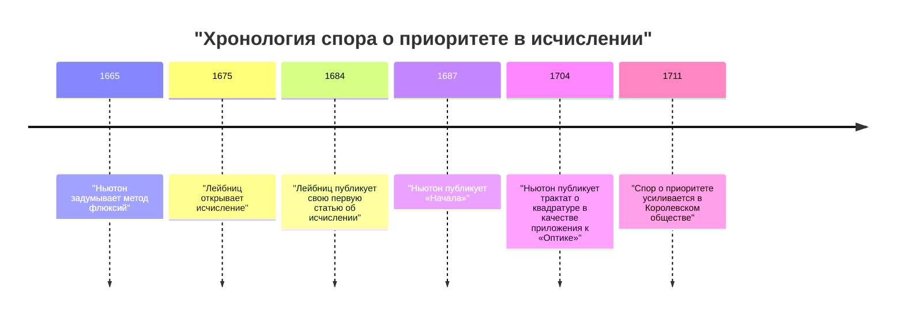
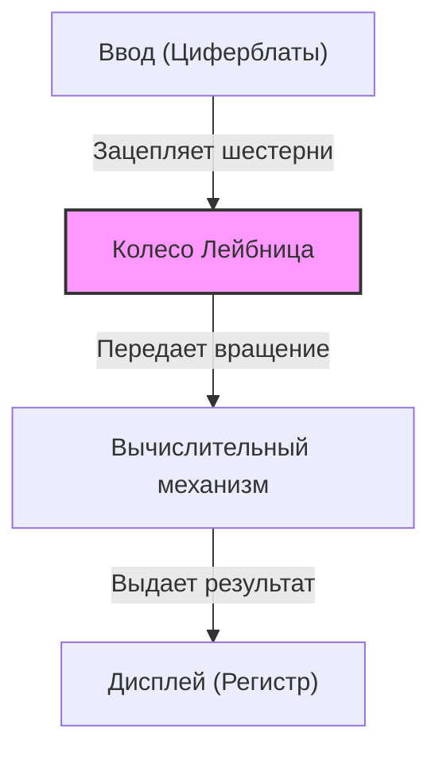

## Введение

Готфрид Вильгельм Лейбниц (1646–1716) был немецким философом, математиком и ученым, активно работавшим в XVII и XVIII веках. Исторически он признан одним из редких интеллектуалов, заслуживших титул «Универсального гения». Оставленное им наследие охватывает не только математику и философию, но и право, политологию, историю, теологию, лингвистику и даже геологию и инженерию.

Его идеи, заложившие основу современной науки, были не просто накоплением знаний, а опирались на грандиозное видение, известное как *Characteristica universalis* (универсальная характеристика) — попытку объединить все области знаний. В этой статье мы сосредоточимся на эпизодах бурной жизни Лейбница и его математических достижениях, составляющих основу современной науки и техники.

## 1. Жизнь и эпизоды: Траектория гения

Жизнь Лейбница не была жизнью одинокого ученого, запертого в башне из слоновой кости; скорее, она была тесно связана с его деятельностью в качестве дипломата и политического советника, путешествующего по всей Европе.

### 1.1 Ранние годы и ранний талант

1 июля 1646 года Лейбниц родился в Лейпциге, в Священной Римской империи (современная Германия). Его отец, профессор моральной философии Лейпцигского университета, скончался, когда Лейбницу было всего шесть лет. Однако огромная библиотека, оставленная отцом, значительно воспитала его интеллектуальное любопытство. Еще до того, как он пошел в школу, он самостоятельно читал латинскую и греческую литературу в библиотеке отца, осваивая основы философии и логики.

Говорят, что он писал стихи на латыни в восемь лет и глубоко понимал логику Аристотеля к двенадцати годам. В пятнадцать лет он поступил в Лейпцигский университет для изучения философии и права. Затем он перевелся в Альтдорфский университет, где получил докторскую степень по праву в молодом возрасте двадцати лет. Университет предложил ему должность профессора, но он отказался оставаться в академических кругах, предпочтя практическую деятельность в реальном мире.

### 1.2 Карьера дипломата и годы в Париже

Поступив на службу к курфюрсту Майнцскому, Лейбниц начал свою карьеру дипломата. В то время Германия все еще несла на себе глубокие шрамы Тридцатилетней войны, и он посвятил себя политическим и правовым проектам, направленным на поддержание мира.

В 1672 году он отправился в Париж с дерзкой дипломатической миссией («Египетский план»), чтобы отвести угрозу от Германии, направив короля Франции Людовика XIV в экспедицию в Египет. Хотя этот план в конечном итоге провалился, его пребывание в Париже стало **величайшим поворотным моментом** в академической жизни Лейбница.

В то время Париж был интеллектуальным центром Европы, и он имел возможность общаться с ведущими учеными и математиками, включая Христиана Гюйгенса. Интенсивно изучая передовую математику под руководством Гюйгенса, Лейбниц совершил поразительный скачок, самостоятельно открыв исчисление бесконечно малых всего за несколько лет.

### 1.3 Деятельность в Ганновере и вклад в различные области

В 1676 году Лейбниц поступил на службу в герцогство Ганновер (позже курфюршество Брауншвейг-Люнебург) в качестве тайного советника и библиотекаря. Здесь он занимался широким кругом практических задач, включая составление истории герцогства и проектирование дренажных насосов для рудников в горах Гарц.

В частности, в горнодобывающем проекте он разработал передовую насосную систему, использующую энергию ветра, но она оказалась труднореализуемой при технологических стандартах того времени, что привело к неудаче. Однако его геологические наблюдения в этот период побудили его написать новаторскую работу *Protogaea* о происхождении Земли, которая глубоко повлияла на последующую геологию.

### 1.4 Трудности в последние годы и одинокая смерть

Лейбниц предложил создание академических академий различным монархам и был первым президентом Прусской академии наук, играя центральную роль в европейской академической сети. Он также имел аудиенцию у Петра I в России и давал советы по реформированию российской системы образования.

Однако в последние годы его репутация была сильно запятнана «спором о приоритете в открытии дифференциального исчисления», вспыхнувшим с Исааком Ньютоном. Кроме того, даже после того, как его повелитель в Ганновере отбыл в Лондон в качестве короля Великобритании Георга I, Лейбницу приказали завершить работу над историческими книгами, и он был вынужден остаться в Ганновере. Когда он умер в возрасте 70 лет в 1716 году, говорят, что на его похоронах присутствовал только его секретарь.

## 2. Математические достижения: Создание фундамента современной науки

Величайшим наследием, которое Лейбниц оставил современной науке, несомненно, является создание символической системы исчисления и предложение двоичной системы.

### 2.1 Открытие исчисления и совершенствование символов

Лейбниц четко осознал, что задача нахождения касательной к кривой (дифференцирование) и задача нахождения площади, ограниченной кривой (интегрирование), являются обратными операциями (основная теорема анализа), и сформулировал это как вычислимый алгоритм.

$$
\int f(x) \,dx \quad \text{и} \quad \frac{d}{dx}f(x)
$$

Символ интеграла $\int$ (удлиненная буква S, от латинского *Summa*) и символ дифференциала $d$ (от *differentia*, что означает разность), которые мы так естественно используем сегодня, были изобретены Лейбницем. Поскольку его обозначения были чрезвычайно интуитивно понятными и подходили для механических вычислений, они значительно ускорили развитие математики в континентальной Европе. Он также сформулировал правило произведения для дифференцирования (правило Лейбница).

$$
d(uv) = u \, dv + v \, du
$$

### 2.2 Спор о приоритете с Ньютоном

Из-за исчисления возник один из самых известных споров в истории науки с англичанином Исааком Ньютоном. Ньютон пришел к концепции исчисления (метод флюксий) раньше Лейбница, но долгое время не публиковал ее. Между тем, Лейбниц открыл исчисление независимо и опубликовал его первым в статье в 1684 году.

Сегодня среди историков существует общее мнение, что **оба ученых открыли исчисление совершенно независимо**. В то время как метод Ньютона коренился в физике и кинематике, метод Лейбница был основан на более формальном и алгебраическом подходе.

### 2.3 Создание двоичной системы

Двоичная система, которая выражает все числа, используя только «0» и «1», и формирует основу современных компьютеров, также была впервые в мире систематически описана Лейбницем. Он разработал эту двоичную систему, связав ее со своей теологической мыслью о том, что весь мир был создан из небытия (0) и Бога (1).

$$
13_{10} = 1101_{2}
$$

$$
1 \times 2^3 + 1 \times 2^2 + 0 \times 2^1 + 1 \times 2^0 = 8 + 4 + 0 + 1 = 13
$$

Лейбниц также заметил, что шестьдесят четыре гексаграммы древнего китайского классического труда *И Цзин* (комбинации Инь и Ян) идеально совпадают с его двоичной системой, обнаружив глубокую связь с восточной философией.

### 2.4 Определители и системы линейных уравнений

При решении систем линейных уравнений Лейбниц независимо пришел к концепции «определителя» примерно в то же время, что и японский математик Сэки Такакадзу. Он рассматривал коэффициенты как массив и разработал метод их систематического исключения, сделав важный шаг к последующему развитию линейной алгебры.

### 2.5 Изобретение ступенчатого вычислителя

Лейбниц был не только математиком-теоретиком, но и практическим изобретателем, вписавшим свое имя в историю механических калькуляторов. Он усовершенствовал калькулятор Блеза Паскаля (Паскалину), который мог выполнять только сложение и вычитание, и изобрел калькулятор с использованием «колеса Лейбница» (ступенчатый валик), способный выполнять умножение и деление.

Этот механизм был революционным и продолжал использоваться в качестве стандартной конструкции для механических калькуляторов на протяжении следующих нескольких сотен лет.

## 3. Философия и мысль: Монадология и Предустановленная гармония

Математические поиски Лейбница были тесно связаны с его грандиозной философской системой. Его философия считается одной из вершин рационализма.

### 3.1 Монадология

В своем репрезентативном философском труде *Монадология* он утверждал, что мир состоит из «монад», которые являются конечными духовными субстанциями, лишенными пространственной протяженности и неделимыми.

В отличие от материальных атомов, каждая монада является духовной единицей со своим собственным восприятием. Как предполагает его знаменитое изречение «Монады не имеют окон», монады не взаимодействуют друг с другом напрямую.

### 3.2 Предустановленная гармония

Если так, то почему мир, состоящий из монад без окон, функционирует с такой гармонией? Лейбниц объяснял, что Бог заранее запрограммировал переходы внутренних состояний всех монад так, чтобы они были идеально синхронизированы. Он назвал это «Предустановленной гармонией».

### 3.3 Закон достаточного основания

Лейбниц также внес значительный вклад в логику. Он предложил «Закон достаточного основания», который гласит, что «ни одно явление не может оказаться истинным или действительным без достаточного основания для того, чтобы дело обстояло так, а не иначе». Это стало руководящим принципом его научных и философских изысканий.

## 4. Универсальная характеристика и мечта об искусственном интеллекте

Лейбниц верил, что человеческое мышление можно свести к математическим вычислениям. Он мечтал о создании «Универсальной характеристики» (*Characteristica universalis*), которая бы символизировала все понятия, и «Логического исчисления» (*Calculus ratiocinator*) для манипулирования этими символами по правилам.

Фраза, которую он оставил после себя, «Давайте посчитаем» (*Calculemus*), символизирует его идеал достижения истины через вычисления, а не через споры, всякий раз, когда возникали разногласия. Эта концепция была предвестником символической логики и историческим видением, которое напрямую связано с вычислительными теориями Алана Тьюринга и современной концепцией **Искусственного Интеллекта (ИИ)**.

## 5. Заключение

Благодаря своему выдающемуся интеллекту Готфрид Вильгельм Лейбниц значительно расширил границы человеческих знаний во всех направлениях. Без его символической системы исчисления развитие современной физики и инженерии было бы невозможно, а без его двоичной системы наше современное компьютерное общество не существовало бы.

Хотя последние годы жизни он провел в трудностях из-за спора с Ньютоном и политических обстоятельств, семена интеллектуальных исследований, которые он посеял, продолжают богато цвести в современном мире сотни лет спустя. Лейбниц — поистине «Универсальный гений», который продолжает сиять сквозь века.
