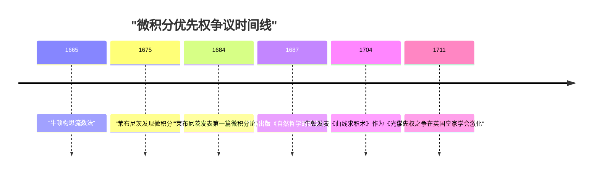
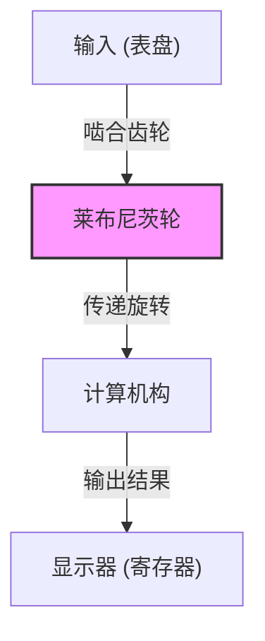

## 引言

戈特弗里德·威廉·莱布尼茨（Gottfried Wilhelm Leibniz, 1646–1716）是活跃于17至18世纪的德国哲学家、数学家和科学家，被誉为人类历史上罕见的“全才（Universal Genius）”。他留下的成就不仅涵盖数学和哲学，还触及法学、政治学、历史学、神学、语言学，甚至地质学和工程学等当时所有的学术领域。

他为近代科学奠定了基石，其思想不仅仅是知识的积累，而是由试图统合所有学问的“普遍记号论（Characteristica universalis）”这一宏大愿景所支撑的。本文将聚焦莱布尼茨充满波折的生平轶事，以及成为现代科技基础的数学伟业，为您深入解读他深邃的思想世界。

## 1. 生平与轶事：天才的轨迹

莱布尼茨的一生，并非那种将自己封闭在象牙塔中孤独求索的学者，而是与他作为奔走于欧洲各地的外交官和政治顾问的活动紧密相连。

### 1.1 早年生活与早熟的天赋

1646年7月1日，莱布尼茨出生于神圣罗马帝国（今德国）的莱比锡。他的父亲是莱比锡大学的道德哲学教授，但在莱比锡只有6岁时便离世了。然而，父亲留下的丰富藏书极大地培养了他的求知欲。在学校教授之前，他便已经在父亲的书房里自学阅读拉丁语和希腊语文献，掌握了哲学和逻辑学的基础。

据说他在8岁时便能用拉丁语写诗，12岁时就已深刻理解亚里士多德的逻辑学。15岁时，他进入莱比锡大学学习哲学和法学。此后转入阿尔特多夫大学，年仅20岁便获得了法学博士学位。大学曾向他提供教授职位，但他拒绝留在学术界，而是选择投身于现实社会的务实活动。

### 1.2 作为外交官的活跃与巴黎岁月

莱布尼茨开始为美因茨选帝侯效力，开启了他的外交官生涯。当时的德国仍深受三十年战争的创伤，他为维持和平的政治和法律项目四处奔走。

1672年，他肩负着一项大胆的外交任务（埃及计划）前往巴黎，目的是诱使法国国王路易十四远征埃及，从而转移对德国的威胁。这项计划本身虽然以失败告终，但在巴黎的逗留却成为了莱布尼茨学术生涯中 **最大的转折点** 。

当时的巴黎是欧洲的学术中心，他有机会与克里斯蒂安·惠更斯等顶尖科学家和数学家交流。在惠更斯的指导下，莱布尼茨猛烈攻读最前沿的数学，在短短几年内便取得了惊人的飞跃，独立发明了微积分。

### 1.3 汉诺威的活动与多方面贡献

1676年，莱布尼茨开始在汉诺威公国（后来的不伦瑞克-吕讷堡选侯国）担任宫廷顾问和图书馆馆长。在这里，他处理了广泛的实际事务，包括编纂公国历史以及为哈茨山脉的矿山设计排水泵。

特别是在矿山项目中，他设计了利用风能的高级泵送系统，但受限于当时的技术水平，实施起来十分困难，最终遭遇了挫折。不过，根据当时的地质观察，他写下了关于地球起源的开创性著作《原大地（Protogaea）》，对后来的地质学产生了重大影响。

### 1.4 晚年的不幸与孤独离世

莱布尼茨向各国君主提议建立学术机构，并担任了柏林科学院的首任院长，在欧洲学术网络中发挥了核心作用。他还觐见了俄罗斯的彼得大帝，对俄罗斯的教育制度改革提出了建议。

然而，在晚年，他与[艾萨克·牛顿](https://kenji.blog/zh-cn/p/newton/)之间爆发了“微积分优先权之争”，名誉受到了极大的损害。此外，在汉诺威的君主作为英国国王乔治一世前往伦敦后，他被命令留下来完成历史书的编纂，在汉诺威度过了一段不幸的时期。据说1716年他以70岁高龄去世时，只有他的秘书一人参加了他的葬礼。

## 2. 数学成就：奠定近代科学的基础

莱布尼茨留给现代科学的最大遗产，无疑是确立了微积分的符号体系以及提出二进制。

### 2.1 微积分的发现与符号的精炼

莱布尼茨清楚地认识到，求曲线切线的问题（微分）与求曲线所围面积的问题（积分）互为逆运算（微积分基本定理），并将其公式化为可计算的算法。

$$
\int f(x) \,dx \quad \text{和} \quad \frac{d}{dx}f(x)
$$

现在我们习以为常使用的积分符号 $\int$ （拉长了拉丁语 Summa 的首字母 S）和微分符号 $d$ （代表差 differentia 的首字母），都是由莱布尼茨发明的。他的记号法极其直观且便于机械计算，极大地加速了欧洲大陆数学的发展。此外，乘积法则（莱布尼茨法则）也是由他公式化的。

$$
d(uv) = u \, dv + v \, du
$$

### 2.2 与牛顿的优先权之争

围绕微积分，他与英国物理学家[艾萨克·牛顿](https://kenji.blog/zh-cn/p/newton/)之间发生了一场科学史上最著名的争论之一。牛顿比莱布尼茨更早地接触到了微积分的概念（流数法），但很长一段时间没有发表。而莱布尼茨则是独立发现了微积分，并在1684年率先以论文的形式发表。

如今，历史学家的共识是 **两人完全独立地发明了微积分** 。牛顿的方法根植于物理学和运动学，而莱布尼茨的方法则基于更加形式化和代数化的途径。

### 2.3 二进制（Binary System）的确立

构成现代计算机基础的、仅用“0”和“1”来表示所有数字的二进制，也是由莱布尼茨在世界上首次系统地描述的。他将一无所有（0）和上帝（1）创造整个世界的神学思想结合起来，发明了这种二进制。

$$
13_{10} = 1101_{2}
$$

$$
1 \times 2^3 + 1 \times 2^2 + 0 \times 2^1 + 1 \times 2^0 = 8 + 4 + 0 + 1 = 13
$$

莱布尼茨还注意到中国古典文献《易经》的六十四卦（阴阳组合）与他的二进制体系完全吻合，从而发现了与东方思想的深刻联系。

### 2.4 行列式与线性方程组

在解线性方程组时，莱布尼茨与日本数学家[关孝和](https://kenji.blog/zh-cn/p/seki-takakazu/)几乎在同一时期独立地得出了“行列式（Determinant）”的概念。他将系数作为数组处理，并设计了系统消除它们的方法，为后来线性代数的发展迈出了重要的一步。

### 2.5 步进计算器的发明

除了作为理论数学家，莱布尼茨还是一位实用的发明家，在机械计算器的历史上留下了自己的名字。他改进了[布莱兹·帕斯卡](https://kenji.blog/zh-cn/p/pascal/)发明的只能进行加减运算的计算器（[Pascal](https://kenji.blog/zh-cn/p/pascal/)ine），发明了一种使用“莱布尼茨轮（步进圆柱体）”的计算器（步进计算器），能够进行乘法和除法运算。

这一机制是革命性的，在接下来的几个世纪里，一直被作为机械计算器的标准结构而被广泛采用。

## 3. 哲学与思想：单子论与预定和谐

莱布尼茨的数学探索与他宏大的哲学体系紧密相连。他的哲学被认为是理性主义的顶峰之一。

### 3.1 单子论

在他的代表性哲学著作《单子论》中，他主张世界是由没有空间延伸且不可再分的终极精神实体——“单子（[Monad](https://kenji.blog/zh-cn/p/functional-programming-concepts-pure-functions-monads/)）”构成的。

与物质原子不同，每个单子都是具有自我知觉的精神单位。正如他的名言“单子没有窗户”所指出的，单子之间没有直接的相互作用。

### 3.2 预定和谐说

既然如此，为什么由没有窗户的单子组成的世界能够如此和谐地运转呢？莱布尼茨解释说，这是因为上帝预先将所有单子的内部状态变化完全同步地编程好了。他称之为“预定和谐（Pre-established harmony）”。

### 3.3 充足理由律

莱布尼茨在逻辑学上也做出了重要贡献。他提出了“充足理由律（Principle of sufficient reason）”，即“任何事物之所以如此，必然有其充足的理由”。这成为了他科学和哲学探索的指导原则。

## 4. 普遍记号论与人工智能的梦想

莱布尼茨认为，人类的思维可以还原为数学计算。他梦想构建一种“普遍记号论（Characteristica universalis）”将所有概念符号化，并建立一种“理性演算（Calculus ratiocinator）”来按照规则操作这些符号。

他留下的一句名言“让我们计算吧（Calculemus）”，象征着他的理想：在出现分歧时，不是通过争论，而是通过计算来得出真理。这一构想是符号逻辑的先驱，也是一个与后来阿兰·图灵等人的计算理论以及现代 **人工智能（AI）** 概念直接相连的历史性愿景。

## 5. 结语

戈特弗里德·威廉·莱布尼茨以其卓越的智慧，在各个方向上大大拓展了人类知识的边界。如果没有他的微积分符号体系，近代物理学和工程学的发展是不可能的；如果没有他的二进制，现代计算机社会也不复存在。

尽管晚年因与牛顿的争论和政治局势而在逆境中度过，但他播下的知识探索的种子，在数百年后的今天依然绽放着绚丽的花朵。莱布尼茨无愧于跨越时代、永远闪耀的“全才”之称。
