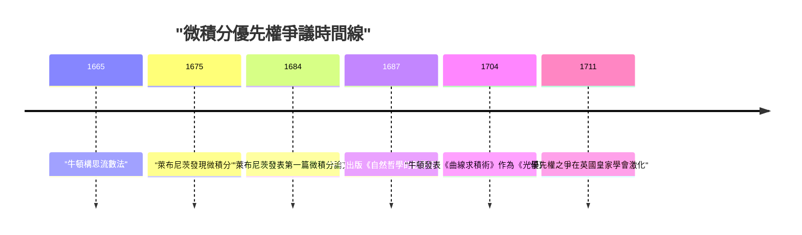
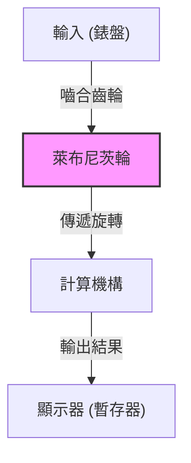

## 引言

戈特弗里德·威廉·萊布尼茨（Gottfried Wilhelm Leibniz, 1646–1716）是活躍於17至18世紀的德國哲學家、數學家和科學家，被譽為人類歷史上罕見的「全才（Universal Genius）」。他留下的成就不僅涵蓋數學和哲學，還觸及法學、政治學、歷史學、神學、語言學，甚至地質學和工程學等當時所有的學術領域。

他為近代科學奠定了基石，其思想不僅僅是知識的累積，而是由試圖統合所有學問的「普遍記號論（Characteristica universalis）」這一宏大願景所支撐的。本文將聚焦萊布尼茨充滿波折的生平軼事，以及成為現代科技基礎的數學偉業，為您深入解讀他深邃的思想世界。

## 1. 生平與軼事：天才的軌跡

萊布尼茨的一生，並非那種將自己封閉在象牙塔中孤獨求索的學者，而是與他作為奔走於歐洲各地的外交官和政治顧問的活動緊密相連。

### 1.1 早年生活與早熟的天賦

1646年7月1日，萊布尼茨出生於神聖羅馬帝國（今德國）的萊比錫。他的父親是萊比錫大學的道德哲學教授，但在萊布尼茨只有6歲時便離世了。然而，父親留下的豐富藏書極大地培養了他的求知慾。在學校教授之前，他便已經在父親的書房裡自學閱讀拉丁語和希臘語文獻，掌握了哲學和邏輯學的基礎。

據說他在8歲時便能用拉丁語寫詩，12歲時就已深刻理解亞里士多德的邏輯學。15歲時，他進入萊比錫大學學習哲學和法學。此後轉入阿爾特多夫大學，年僅20歲便獲得了法學博士學位。大學曾向他提供教授職位，但他拒絕留在學術界，而是選擇投身於現實社會的務實活動。

### 1.2 作為外交官的活躍與巴黎歲月

萊布尼茨開始為美因茨選帝侯效力，開啟了他的外交官生涯。當時的德國仍深受三十年戰爭的創傷，他為維持和平的政治和法律項目四處奔走。

1672年，他肩負著一項大膽的外交任務（埃及計劃）前往巴黎，目的是誘使法國國王路易十四遠征埃及，從而轉移對德國的威脅。這項計劃本身雖然以失敗告終，但在巴黎的逗留卻成為了萊布尼茨學術生涯中 **最大的轉捩點** 。

當時的巴黎是歐洲的學術中心，他有機會與克里斯蒂安·惠更斯等頂尖科學家和數學家交流。在惠更斯的指導下，萊布尼茨猛烈攻讀最前沿的數學，在短短幾年內便取得了驚人的飛躍，獨立發明了微積分。

### 1.3 漢諾威的活動與多方面貢獻

1676年，萊布尼茨開始在漢諾威公國（後來的不倫瑞克-呂訥堡選侯國）擔任宮廷顧問和圖書館館長。在這裡，他處理了廣泛的實際事務，包括編纂公國歷史以及為哈茨山脈的礦山設計排水泵。

特別是在礦山項目中，他設計了利用風能的高級泵送系統，但受限於當時的技術水平，實施起來十分困難，最終遭遇了挫折。不過，根據當時的地質觀察，他寫下了關於地球起源的開創性著作《原大地（Protogaea）》，對後來的地質學產生了重大影響。

### 1.4 晚年的不幸與孤獨離世

萊布尼茨向各國君主提議建立學術機構，並擔任了柏林科學院的首任院長，在歐洲學術網絡中發揮了核心作用。他還覲見了俄羅斯的彼得大帝，對俄羅斯的教育制度改革提出了建議。

然而，在晚年，他與[艾薩克·牛頓](https://kenji.blog/zh-tw/p/newton/)之間爆發了「微積分優先權之爭」，名譽受到了極大的損害。此外，在漢諾威的君主作為英國國王喬治一世前往倫敦後，他被命令留下來完成歷史書的編纂，在漢諾威度過了一段不幸的時期。據說1716年他以70歲高齡去世時，只有他的秘書一人參加了他的葬禮。

## 2. 數學成就：奠定近代科學的基礎

萊布尼茨留給現代科學的最大遺產，無疑是確立了微積分的符號體系以及提出二進制。

### 2.1 微積分的發現與符號的精煉

萊布尼茨清楚地認識到，求曲線切線的問題（微分）與求曲線所圍面積的問題（積分）互為逆運算（微積分基本定理），並將其公式化為可計算的演算法。

$$
\int f(x) \,dx \quad \text{和} \quad \frac{d}{dx}f(x)
$$

現在我們習以為常使用的積分符號 $\int$ （拉長了拉丁語 Summa 的首字母 S）和微分符號 $d$ （代表差 differentia 的首字母），都是由萊布尼茨發明的。他的記號法極其直觀且便於機械計算，極大地加速了歐洲大陸數學的發展。此外，乘積法則（萊布尼茨法則）也是由他公式化的。

$$
d(uv) = u \, dv + v \, du
$$

### 2.2 與牛頓的優先權之爭

圍繞微積分，他與英國物理學家[艾薩克·牛頓](https://kenji.blog/zh-tw/p/newton/)之間發生了一場科學史上最著名的爭論之一。牛頓比萊布尼茨更早地接觸到了微積分的概念（流數法），但很長一段時間沒有發表。而萊布尼茨則是獨立發現了微積分，並在1684年率先以論文的形式發表。

如今，歷史學家的共識是 **兩人完全獨立地發明了微積分** 。牛頓的方法根植於物理學和運動學，而萊布尼茨的方法則基於更加形式化和代數化的途徑。

### 2.3 二進制（Binary System）的確立

構成現代電腦基礎的、僅用「0」和「1」來表示所有數字的二進制，也是由萊布尼茨在世界上首次系統地描述的。他將一無所有（0）和上帝（1）創造整個世界的神學思想結合起來，發明了這種二進制。

$$
13_{10} = 1101_{2}
$$

$$
1 \times 2^3 + 1 \times 2^2 + 0 \times 2^1 + 1 \times 2^0 = 8 + 4 + 0 + 1 = 13
$$

萊布尼茨還注意到中國古典文獻《易經》的六十四卦（陰陽組合）與他的二進制體系完全吻合，從而發現了與東方思想的深刻聯繫。

### 2.4 行列式與線性方程組

在解線性方程組時，萊布尼茨與日本數學家[關孝和](https://kenji.blog/zh-tw/p/seki-takakazu/)幾乎在同一時期獨立地得出了「行列式（Determinant）」的概念。他將係數作為陣列處理，並設計了系統消除它們的方法，為後來線性代數的發展邁出了重要的一步。

### 2.5 步進計算器的發明

除了作為理論數學家，萊布尼茨還是一位實用的發明家，在機械計算器的歷史上留下了自己的名字。他改進了[布萊茲·帕斯卡](https://kenji.blog/zh-tw/p/pascal/)發明的只能進行加減運算的計算器（[Pascal](https://kenji.blog/zh-tw/p/pascal/)ine），發明了一種使用「萊布尼茨輪（步進圓柱體）」的計算器（步進計算器），能夠進行乘法和除法運算。

這一機制是革命性的，在接下來的幾個世紀裡，一直被作為機械計算器的標準結構而被廣泛採用。

## 3. 哲學與思想：單子論與預定和諧

萊布尼茨的數學探索與他宏大的哲學體系緊密相連。他的哲學被認為是理性主義的頂峰之一。

### 3.1 單子論

在他的代表性哲學著作《單子論》中，他主張世界是由沒有空間延伸且不可再分的終極精神實體——「單子（[Monad](https://kenji.blog/zh-tw/p/functional-programming-concepts-pure-functions-monads/)）」構成的。

與物質原子不同，每個單子都是具有自我知覺的精神單位。正如他的名言「單子沒有窗戶」所指出的，單子之間沒有直接的相互作用。

### 3.2 預定和諧說

既然如此，為什麼由沒有窗戶的單子組成的世界能夠如此和諧地運轉呢？萊布尼茨解釋說，這是因為上帝預先將所有單子的內部狀態變化完全同步地編程好了。他稱之為「預定和諧（Pre-established harmony）」。

### 3.3 充足理由律

萊布尼茨在邏輯學上也做出了重要貢獻。他提出了「充足理由律（Principle of sufficient reason）」，即「任何事物之所以如此，必然有其充足的理由」。這成為了他科學和哲學探索的指導原則。

## 4. 普遍記號論與人工智能的夢想

萊布尼茨認為，人類的思維可以還原為數學計算。他夢想構建一種「普遍記號論（Characteristica universalis）」將所有概念符號化，並建立一種「理性演算（Calculus ratiocinator）」來按照規則操作這些符號。

他留下的一句名言「讓我們計算吧（Calculemus）」，象徵著他的理想：在出現分歧時，不是通過爭論，而是通過計算來得出真理。這一構想是符號邏輯的先驅，也是一個與後來阿蘭·圖靈等人的計算理論以及現代 **人工智慧（AI）** 概念直接相連的歷史性願景。

## 5. 結語

戈特弗里德·威廉·萊布尼茨以其卓越的智慧，在各個方向上大大拓展了人類知識的邊界。如果沒有他的微積分符號體系，近代物理學和工程學的發展是不可能的；如果沒有他的二進制，現代電腦社會也不復存在。

儘管晚年因與牛頓的爭論和政治局勢而在逆境中度過，但他播下的知識探索的種子，在數百年後的今天依然綻放著絢麗的花朵。萊布尼茨無愧於跨越時代、永遠閃耀的「全才」之稱。
