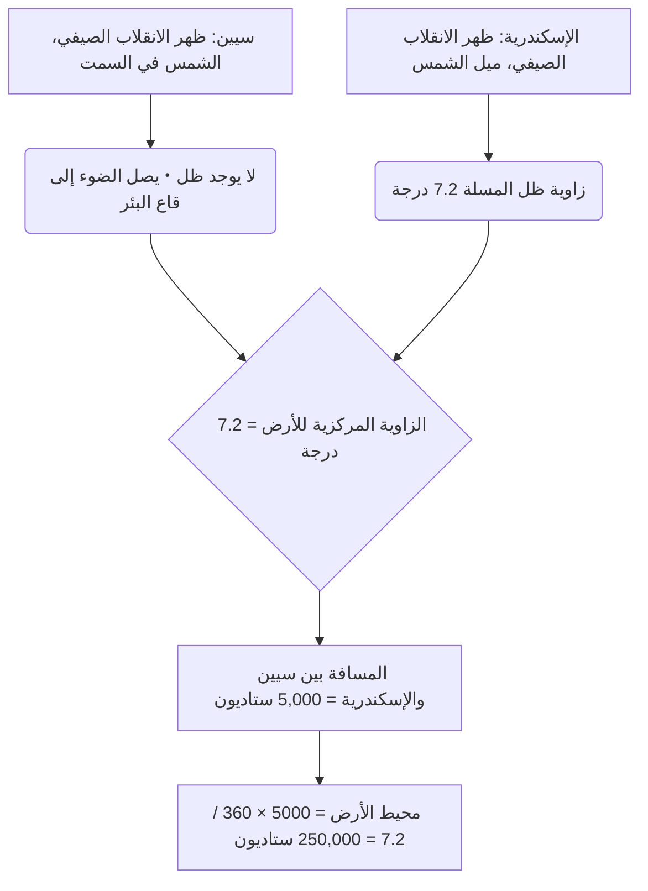
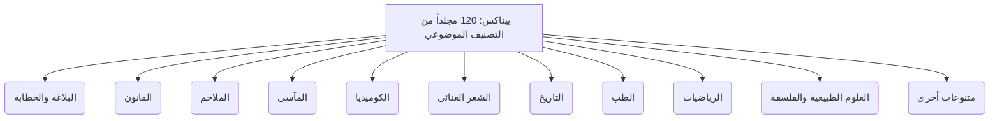
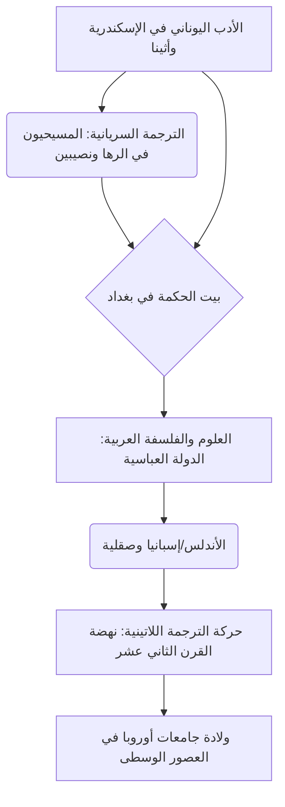

# مقدمة: ذكريات العصور القديمة المفقودة وقاعة المعرفة

في التاريخ، وخلال العملية التي جمعت فيها البشرية المعرفة ونظمتها ثم فقدتها بشكل مأساوي، ربما لا يوجد شيء يثير خيال الناس ويثير شعوراً بالرومانسية والحزن مثل "مكتبة الإسكندرية الكبرى" في مصر. لم يكن هذا المعبد الضخم للمعرفة، الذي جُمعت فيه كل حكمة عالم البحر الأبيض المتوسط القديم، مجرد مستودع للكتب. لقد كان معهداً للبحوث الأكاديمية المتطورة، ومدينة عالمية تتقاطع فيها الثقافات، وقبل كل شيء، تبلوراً لـ "الإمبريالية المعرفية".

في هذا المقال، ومن خلال تقاطع وجهات نظر أكاديمية متعددة مثل تاريخ البحر الأبيض المتوسط القديم، وفقه اللغة الكلاسيكي، وتاريخ الكتب، وعلم المكتبات والمعلومات، سنرسم تاريخ انتقال المعرفة من ولادة وازدهار مكتبة الإسكندرية، مروراً بلغز دمارها وصولاً إلى العصور الوسطى والحديثة، بتفاصيل وعمق أكاديمي غير مسبوق.

---

## الفصل الأول: طموح الإسكندر الأكبر وولادة العالم الهلنستي

### بناء الإسكندرية وإعادة تنظيم عالم البحر الأبيض المتوسط

في عام 332 قبل الميلاد، استسلمت مصر دون إراقة دماء للفاتح المقدوني الشاب الإسكندر الأكبر، الذي أمر ببناء عاصمة جديدة تحمل اسمه، "الإسكندرية"، في موقع قرية راكوتيس لصيد الأسماك على الطرف الغربي لدلتا النيل، المطلة على البحر الأبيض المتوسط. تبنت هذه المدينة، التي صممها دينوكراتيس، كبير مهندسي الملك، النظام الهيبودامي (الشبكة المتعامدة) الموجود في تخطيط المدن اليونانية، واستفادت إلى أقصى حد من التضاريس الضيقة الممتدة بين البحر الأبيض المتوسط وبحيرة مريوط، وكان محورها شارعاً رئيسياً رائعاً (شارع كانوبوس) يمتد من الشرق إلى الغرب.

لم يكن من المتوقع أن تكون الإسكندرية مجرد عاصمة لمصر، بل كانت بمثابة قلب الثقافة "الهلنستية" (Hellenism) التي دمجت العالم اليوناني المقدوني (هيلاس) مع العالم الشرقي. انطلق الملك نفسه في رحلته الاستكشافية الشرقية قبل اكتمال المدينة وتوفي في بابل، ولكن إرادته وإمبراطوريته الضخمة تم تقسيمها من قبل خلفائه (الديادوكوي). كان بطليموس الأول سوتر (المنقذ)، وهو صديق طفولة الملك ومقربه، هو من سيطر على مصر.

### السياسة الثقافية لبطليموس الأول و"الإمبريالية المعرفية"

أدرك بطليموس الأول، مؤسس الأسرة البطلمية، بعمق أن السيطرة العسكرية وحدها لا يمكن أن تحكم دولة ضخمة متعددة الأعراق. قرر بناء مركز ثقافي عالمي جديد في الإسكندرية ليحل محل أثينا. كان جوهر ذلك هو المفهوم الهائل المتمثل في "جمع كل كتب العالم في مكان واحد".

كان الدعامة النظرية لهذا المفهوم ديمتريوس فاليرس، وهو فيلسوف من المدرسة الأرسطية (المدرسة المشائية) الذي فر من أثينا. كان لدى ديمتريوس خبرة في حكم شؤون الدولة كطاغية في أثينا لمدة 10 سنوات، إلى جانب المعرفة حول بناء مجموعة الكتب في مدرسة أرسطو (ليقيون). ونصح بطليموس الأول بأن الشرط للإمبراطورية العالمية الحقيقية ليس مجرد الحكم بالقوة العسكرية، بل جمع وترجمة ودراسة سجلات وقوانين وأفكار وعلوم كل الأمم.

كان هذا شيئاً يجب أن يُطلق عليه "الإمبريالية المعرفية" (Intellectual Imperialism). في الماضي، كان لدى ملوك الإمبراطورية الأخمينية الفارسية والآشورية (على سبيل المثال، مكتبة نينوى للملك آشوربانيبال) أرشيفات، لكن مكتبة الأسرة البطلمية كانت مختلفة في البعد من حيث الحجم والغرض. لقد هدفوا إلى جمع أدبيات جميع اللغات في العالم المعروف (اليونانية والمصرية والعبرية والفارسية وغيرها) وترجمتها ودمجها في اللغة اليونانية. الأسطورة القائلة بأن الترجمة اليونانية للعهد القديم، "الترجمة السبعينية" (Septuagint)، تم إنشاؤها في الإسكندرية (رسالة أريستياس) تقع أيضاً ضمن سياق سياسة جمع المعرفة العالمية هذه.

---

## الفصل الثاني: الصورة الكاملة لمعهد الأبحاث الملكي ميوسيون (Museion)

### الهيكل كمعبد أكاديمي وامتيازات العلماء

ما نطلق عليه اليوم "مكتبة الإسكندرية" لم يكن مبنى مستقلاً، بل كان جزءاً من مجمع مؤسسات أكاديمية وبحثية ملكية ضخمة تسمى "ميوسيون" (Museion)، أو منشأة ملحقة به. تعني كلمة "ميوسيون" حرفياً "معبد الميوزات (الإلهات التسع للفنون والآداب)"، وهي أصل الكلمة الحديثة "متحف" (Museum).

يسجل الجغرافي سترابون أن الميوسيون كان مجاوراً لأراضي القصر الملكي (منطقة بروتشيون)، وكان يضم ممشى (بيريباتوس)، وغرفة نقاش (إكسيدرا)، وقاعة طعام كبيرة (سيسيتيون) للعلماء لتناول الطعام معاً. يمكن القول إن الميوسيون هو النموذج الأولي لمعاهد البحوث المتقدمة الحديثة وجامعات الدراسات العليا (على سبيل المثال، معهد الدراسات المتقدمة في برينستون).

حصل العلماء المدعوون إلى هنا (باحثو البلاط الملكي) على امتيازات مذهلة. فقد حصلوا على معاش كبير مدى الحياة من البلاط الملكي، وأُعفوا من جميع الضرائب، وحصلوا على سكن وطعام مجاني. كانت التزاماتهم الوحيدة هي السعي وراء المعرفة، والكتابة، وأحياناً تعليم أطفال العائلة المالكة. في أوجها، جمع هذا المجتمع الأكاديمي الداخلي أكثر من 100 من كبار العلماء في العالم، الذين انغمسوا في المناقشات والبحوث ليلاً ونهاراً.

### النقد النصي النهائي واختراع العلامات النقدية

كان من أهم المشاريع في الميوسيون تحديد نصوص الأدب الكلاسيكي مثل هوميروس. في ذلك الوقت، كانت مخطوطات ورق البردي المكتوبة بخط اليد مليئة بالأخطاء المطبعية، أو السهو من قبل النساخ، أو الإضافات التعسفية من قبل الممثلين.

أسس مديرو المكتبة المتعاقبون، مثل زينودوتوس من أفسس، وأريستوفانيس من بيزنطة، وأريستارخوس من ساموثريس، الانضباط المسمى بـ "النقد النصي" (Textual Criticism)، والذي قارن بين عدة مخطوطات مختلفة لاستعادة النص الأقرب إلى شكله الأصلي.

اخترعوا نظاماً لكتابة علامات نقدية خاصة في هوامش النص.
- **المسلة (Obelus, – أو ÷)**: تشير إلى سطر يُشتبه في أنه مزيف أو إضافة لاحقة.
- **النجمة (Asterisk, ※)**: تشير إلى سطر مهم تم إدراجه بشكل متكرر أو عن طريق الخطأ، ولكنه يجب أن يكون في الأصل في مكان آخر.
- **ديبلي (Diple, >)**: يشير إلى المقاطع المهمة التي يجب التعليق عليها أو المقاطع المثيرة للاهتمام نحويًا.

يمكن القول إن إضافة البيانات الوصفية باستخدام هذه العلامات هي تقنية معالجة معلومات رائدة، وهي بذرة لفكرة لغات الترميز الحديثة (XML و HTML).

### العصر الذهبي للعلوم: إراتوستينس وأرخميدس

حقق الميوسيون إنجازات بقيت في تاريخ البشرية ليس فقط في العلوم الإنسانية ولكن أيضاً في العلوم الطبيعية.

**قياس إراتوستينس لمحيط الأرض**
حسب إراتوستينس من قورينا، الذي شغل منصب مدير المكتبة الثالث، حجم الأرض من خلال رؤية هندسية مذهلة. لقد علم أنه عند ظهر يوم الانقلاب الصيفي، يصل ضوء الشمس إلى قاع بئر عميقة في مدينة سيين بجنوب مصر (أسوان حالياً) (تكون الشمس في السمت). من ناحية أخرى، في نفس الوقت من نفس اليوم، في الإسكندرية الواقعة إلى الشمال مباشرة، قام بقياس زاوية ظل مسلة مزولة شمسية، ووجد أن الشمس تميل بحوالي 7.2 درجة (1/50 من 360 درجة لمحيط كامل) من السمت.

بناءً على افتراض أن المسافة بين الإسكندرية وسيين تبلغ 5000 ستاديون (مقدرة من عدد أيام سفر قوافل الجمال)، وضع إراتوستينس المعادلة النسبية التالية.
`7.2 درجة : 360 درجة = 5,000 ستاديون : محيط الأرض`
ونتيجة للحسابات، تم حساب محيط الأرض بـ 250,000 ستاديون. بافتراض أن الستاديون الواحد يبلغ حوالي 157.5 متراً (الستاديون المصري)، فسيكون حوالي 39,375 كيلومتراً، بدقة مذهلة وخطأ يقل عن 2% مقارنة بالمحيط الاستوائي الفعلي للأرض (حوالي 40,075 كيلومتراً).

**علم التشريح والهندسة**
في مجال الطب، أجرى هيروفيلوس من خلقيدونية وإيراسيستراتوس من جزيرة كيا، تحت حماية الميوسيون، تشريحاً منهجياً لجسم الإنسان لأول مرة في تاريخ البشرية (وتقول إحدى النظريات إنهم أجروا تشريحاً حياً للمجرمين المدانين). أثبت هيروفيلوس أن الدماغ هو مقر الذكاء، وصنف الجهاز العصبي إلى أعصاب حركية وأعصاب حسية، وأشار إلى العلاقة بين نبض الدم ووظيفة ضخ القلب.

أيضاً، أرخميدس من سرقسطة هو من درس في الإسكندرية أو تفاعل مع علماء الميوسيون من خلال المراسلة. ابتكر "مضخة أرخميدس الحلزونية"، والتي استُخدمت أيضاً للتحكم في فيضانات نهر النيل، وأجرى أبحاثاً حول مبدأ الطفو، وحساب باي باستخدام طريقة الاستنفاد، وتربيع القطع المكافئ. يُقال أيضاً أن إقليدس، الذي ألف "العناصر" وأسس علم الهندسة، أخبر بطليموس الأول في الإسكندرية أنه "لا يوجد طريق ملكي إلى الهندسة".

---

## الفصل الثالث: جنون جمع الكتب وثورة فهرس الكتب

### جمع الكتب بأي وسيلة: مصادرة الميناء ومأساة أثينا

لإثراء مكتبة الميوسيون، قام ملوك الأسرة البطلمية المتعاقبون أحياناً بجمع الكتب بطرق قسرية يمكن وصفها بالجنون. لم تقم مكتبة الإسكندرية بشراء الكتب فحسب، بل زادت مجموعتها بشكل متفجر من خلال نظام يمارس سلطة الدولة.

الطريقة الأكثر شهرة هي نظام التفتيش والمصادرة القسري الذي يسمى "كتب السفن" (ek ploion). خضعت جميع السفن التجارية وسفن الركاب التي تدخل ميناء الإسكندرية، الذي كان مركز تجارة البحر الأبيض المتوسط، لتفتيش صارم من قبل مسؤولي الجمارك المصريين. إذا تم العثور على أي كتب (لفائف من ورق البردي) بين الحمولة، فسيتم مصادرتها على الفور، بغض النظر عمن كانت ملكه. أُرسلت الكتب المصادرة إلى غرفة نسخ المكتبة (السكربتوريوم)، حيث أنشأ النساخ المتخصصون نسخاً دقيقة وسريعة من خلال العمل ليلاً ونهاراً. ومما يثير الدهشة أن "النسخة المنشأة حديثاً" أُعيدت إلى المالك الأصلي، واحتُفظ بـ "الأصل" بشكل دائم في مجموعة المكتبة. تم إرفاق علامة منشأ (Provenance) بالنسخة تنص على "صودرت من سفينة...".

علاوة على ذلك، هناك حلقة احتيال دبلوماسي شهيرة في عهد بطليموس الثالث يورجيتيس. طلب الملك من حكومة أثينا استعارة "النسخ الأصلية الرسمية المعتمدة من الدولة" لثلاثة من كبار شعراء المأساة اليونانية (أسخيلوس، وسوفوكليس، ويوربيديس). كانت هذه النسخ الأصلية تراثاً ثقافياً مقدساً محفوظاً بعناية في الأرشيف الوطني في أثينا. اشترطت أثينا لإعارتها مبلغاً هائلاً كضمان نقدي قدره 15 تالنت (يقال إنه يعادل مليارات الين بقيمة اليوم)، لكن بطليموس الثالث دفعها بسهولة. ومع ذلك، عندما وصلت النسخ الأصلية إلى الإسكندرية، أمر الملك أفضل النساخ بإنشاء نسخ متقنة على أجود أنواع ورق البردي، وأعاد تلك النسخ إلى أثينا. ترك الملك أثينا تصادر وديعة الـ 15 تالنت (في الواقع عملية شراء بسعر باهظ للغاية)، وسرق النسخ الأصلية الثمينة ككنوز للمكتبة. لقد كانت هذه حادثة نهب لرأس المال الثقافي من قبل قوة عظمى في العصر الهلنستي.

### كاليماخوس و"بيناكس": ولادة أول فهرس شامل لتصنيف الكتب في العالم

نتيجة لعمليات الجمع هذه التي لا تعتمد على الوسائل، يُقال إن عدد الكتب في مكتبة الإسكندرية وصل إلى مئات الآلاف من اللفائف (تقول بعض النظريات إنها بين 500,000 إلى 700,000 لفيفة) في المبنى الرئيسي (منطقة بروتشيون) وأكثر من 40,000 لفيفة في فرع السيرابيوم. مع هذا الكم الهائل من المعلومات، لم يعد من الممكن العثور على الوثيقة المطلوبة بمجرد الذاكرة البشرية أو الترتيب المادي. أصبح "نظام البحث" (هندسة استرجاع المعلومات) لتحويل جبل من اللفائف إلى "قاعدة بيانات للمعرفة" أمراً لا غنى عنه.

كان كاليماخوس (حوالي 310 - 240 قبل الميلاد)، الشاعر والباحث العبقري من قورينا، هو من حقق أكبر اختراق في تاريخ علم المكتبات والمعلومات. يقال إنه لم يتولَّ منصب مدير المكتبة رسمياً، لكنه كان المسؤول الفعلي عن إدارة مجموعة المكتبة.

قام كاليماخوس بإنشاء فهرس ضخم مكون من 120 مجلداً يغطي مجموعة المكتبة بأكملها، يُدعى "بيناكس" (Pinakes: تعني حرفياً "الألواح"، واسمها الرسمي هو "فهرس الأشخاص الذين برزوا في كل فرع من فروع التعلم وكتاباتهم"). لم يكن هذا مجرد قائمة جرد (inventory)، بل كان أول "فهرس مصنف حسب الموضوع" (Subject Catalog) منهجي للبشرية.

أنشأ نظام تصنيف "بيناكس" الفئات التالية كتصنيفات رئيسية (Main Classes).

علاوة على ذلك، تكمن عبقرية كاليماخوس في حقيقة أنه أضاف معلومات بيبليوغرافية دقيقة (بيانات وصفية) تحت هذه التصنيفات الرئيسية. داخل كل فئة، تم ترتيب المؤلفين أبجدياً، وتم وصف البيانات المنظمة التالية.

- **اسم المؤلف والسيرة الذاتية**: اسم المؤلف، ومسقط رأسه، واسم والده، واسم معلمه، وسيرة ذاتية مختصرة. كان هذا بمثابة ضبط استنادي (Authority Control) للتمييز بين المؤلفين الذين يحملون نفس الاسم.
- **عنوان العمل**: إذا لم يكن هناك عنوان، فسيتم إعطاء عنوان مؤقت بناءً على المحتوى.
- **الكلمات الافتتاحية (Incipit)**: الكلمات القليلة الأولى أو السطر الأول من كل عمل. نظراً لأن لفائف البردي القديمة غالباً ما كانت تفقد عناوينها، فقد كانت هذه طريقة لتحديد العمل من خلال بداية النص (مثل دور قيمة التجزئة "Hash").
- **عدد المجلدات وإجمالي عدد الأسطر (Stichometry)**: عدد المجلدات في العمل بأكمله والعدد الدقيق لأسطر النص. كان تسجيل عدد الأسطر بمثابة أساس لحساب المكافآت المدفوعة للنساخ (Scriptores)، وفي الوقت نفسه لعب دوراً كـ "مجموع تدقيقي" (Checksum: التحقق من النزاهة) للتحقق مما إذا كان النص قد تم تغييره لاحقاً أو ما إذا كانت هناك صفحات مفقودة.

يمكن القول إن بنية تنظيم المعلومات الخاصة بكاليماخوس هي السلف الأصلي والعالمي لتقنيات معالجة المعلومات الأساسية، حيث أدت عبر فهارس مكتبات الأديرة في العصور الوسطى، للاتصال المباشر بتصنيف ديوي العشري (DDC)، وفهرس الوصول العام المتاح على الإنترنت (OPAC)، وحتى بنية قواعد البيانات العلائقية الحديثة.

---

## الفصل الرابع: مادية لفائف البردي (Volumen) وتقنية الكتابة: البيئة الإعلامية القديمة والقياسات الببليوغرافية

### هبة النيل والبنية التحتية للكتابة

إن وسيلة التسجيل "ورق البردي" (Papyrus) هي التي دعمت بشكل أساسي ازدهار مكتبة الإسكندرية من الجانب المادي. صُنع هذا الورق من نبات مائي يشبه القصب ينتمي إلى عائلة السعادى (Cyperus papyrus) ينمو برياً في الأراضي الرطبة في دلتا النيل، وكان أفضل وسيلة لتسجيل المعلومات في العالم المتوسطي القديم، متفوقاً على الألواح الطينية وجلود الحيوانات. وكما فصّل بليني الأكبر في كتابه "التاريخ الطبيعي"، كانت عملية تصنيع ورق البردي حرفة يدوية متخصصة للغاية.

أولاً، يتم نزع قشرة الساق السميكة للنبات (التي لها مقطع عرضي مثلث)، ويتم تقطيع اللب الداخلي (Pith) إلى شرائح رقيقة طولياً بإبرة أو شفرة رفيعة. يتم ترتيب هذه القطع الطويلة الرقيقة التي تشبه الشريط (فيلورا) على لوح خشبي مبلل دون فجوات، وتوضع طبقة أخرى فوقها، هذه المرة تتقاطع بزوايا قائمة. باستخدام المياه الموحلة لنهر النيل والمواد اللاصقة المعدة خصيصاً (أو المادة اللزجة للنبات نفسه)، يتم ضرب العمل بأكمله بقوة بمطرقة خشبية للضغط عليه ثم يتم تجفيفه في الشمس لإنشاء ورقة رقيقة وخفيفة ومرنة ومتينة (كوليما). يُطلق على ورق البردي عالي الجودة اسم "هيراتيكا (للكهنة)" أو "أوغوستا" تيمناً بالإمبراطور أوغسطس، وكان أبيض وأملساً ومكلفاً للغاية.

من خلال ضم هذه الأوراق الواحدة تلو الأخرى باستخدام معجون دقيق القمح، تم صنع "لفيفة" طويلة (Volumen، باليونانية "بيبليون"). تم تداول اللفائف النموذجية في السوق كوحدة مبيعات قياسية تتكون من حوالي 20 ورقة متصلة (سكاربوس).

تم استخدام قلم يسمى كالاموس، وهو مصنوع من قصبة صلبة مقسومة عند الحافة، كأداة كتابة. على عكس الفرشاة المصرية القديمة المصنوعة من القصب، تم قطع الحافة بشكل حاد لكتابة الأبجدية اليونانية بحدة. كان الحبر (Atramentum) في الغالب عبارة عن حبر كربوني مصنوع عن طريق خلط السخام والصمغ العربي والماء. هذا الحبر يلتصق فقط بسطح ألياف الورق ولا يتغلغل إلى الداخل، لذلك يمكن غسله بسهولة باستخدام إسفنجة (Sponge) وإعادة استخدامه. وفي الوقت نفسه، كان مستقراً كيميائياً للغاية، لذلك حتى بعد آلاف السنين، تحتفظ أوراق البردي الموجودة في المناطق الصحراوية القاحلة اليوم بحروفها السوداء العميقة. تم استخدام الحبر الأحمر (الزنجفر، وهو أكسيد الحديد أو كبريتيد الزئبق) للعناوين المهمة والزخارف، أو للقراءات الفوقية والعلامات النقدية للمساعدة في القراءة.

### حدود اللفائف وقيود القياسات الببليوغرافية: هندسة عدد الحروف والأسطر

ومع ذلك، كان لشكل لفافة البردي قيود مادية كتكنولوجيا للمعلومات.
1. **قيود الطول والوزن**: إذا كانت اللفيفة طويلة جداً، فستكون ثقيلة ويصعب التعامل معها، ويميل ورق البردي إلى الإرهاق والتلف عند فكه (explicare). كان الحد العملي هو حوالي 10 أمتار، وهو ما يعادل المجلد الأول من ملحمة هوميروس "الإلياذة" (حوالي 700 إلى 900 سطر). القول المأثور لكاليماخوس "كتاب كبير هو شر عظيم (Mega biblion, mega kakon)" لم يُترك فقط لأسباب جمالية، لأنه فضل الإيجاز الأنيق المميز للأدب الهلنستي، ولكن أشار أيضاً إلى تعقيد التعامل المادي مع اللفيفة وقابليتها للتدهور من وجهة نظر ممارس. كان يجب تقسيم الكتب التاريخية الطويلة حتماً إلى عدة لفائف (توموس) للتخزين والإدارة.
2. **صعوبة الوصول العشوائي**: كانت اللفيفة وسائط للوصول المتسلسل "Sequential Access" تتم قراءتها عن طريق التمرير بالترتيب من البداية إلى النهاية، وكان "الوصول العشوائي" للقفز فوراً إلى صفحة أو سطر معين (على سبيل المثال، فقرة معينة في منتصف المجلد السابع) أمراً بالغ الصعوبة. وقد فرض هذا عبئاً إدراكياً وتكلفة زمنية هائلة على العلماء عندما يفتحون ويقارنون مراجع متعددة في نفس الوقت (الإحالة المرجعية - Cross-reference).
3. **قواعد تخطيط كولومبوس**: تمت كتابة النص على اللفيفة في كتل مستمرة من الأحرف (فقرات أو أعمدة عمودية تسمى كولومبوس). كان عرض كل فقرة حوالي 5 إلى 8 سنتيمترات، وظلت المسافة بين الأسطر متساوية، ولم تكن هناك مسافات بين الكلمات (تقسيم الكلمات)، وكانت "scriptio continua (الكتابة المستمرة)"، حيث تُكتب الكلمات بشكل مستمر، شائعة. وتطلب ذلك درجة عالية من مهارات القراءة بصوت عالٍ من القارئ.
4. **التخزين والإدارة (خرطوش وسيليفوس)**: تم لف اللفيفة حول عمود خشبي (بكرة) يسمى أومفالوس وتم تخزينها في وضع مستقيم في كابسا (علبة أسطوانية) أو مكدسة أفقياً في حفر (أرفف). لتحديد المحتويات من الخارج، تم ربط بطاقة صغيرة من الرق أو البردي تسمى "Sillybos" بحافة اللفيفة، ومكتوب عليها اسم المؤلف والعنوان. لعب هذا دور كعب الكتاب اليوم، لكنه كان يعاني من ضعف التمزق بسهولة مع الإدخال والإخراج المتكرر.

### الانتقال إلى المخطوطة (Codex) وتكلفة تحويل الوسائط

من القرن الثاني إلى القرن الرابع الميلادي، مع الانتشار الهائل للمسيحية، حدث تحول نموذجي (أحد أكبر ثورات الإعلام في تاريخ البشرية) من لفائف البردي إلى "المخطوطة" (Codex: كتاب مجلد). تم تصنيع المخطوطة عن طريق طي الرق (Parchment) أو البردي إلى نصفين، وتجميعه، وربط الجزء الخلفي بخيط، وكانت تتمتع بكثافة معلومات عالية لأنه يمكن الكتابة على كلا الجانبين (recto و verso) دون إهدار (تقليل الحجم المادي)، وقبل كل شيء، كانت تتمتع بتفوق ساحق يتمثل في القدرة على فتح صفحة معينة بسرعة (تحقيق الوصول العشوائي واستخدام العلامات المرجعية).

في الأيام الأخيرة لمكتبة الإسكندرية، خلال هذه الفترة الانتقالية لوسائل الإعلام، لا بد أنها واجهت التكلفة الهائلة لـ "ترحيل التنسيق" (Format Migration)، أي عملية إعادة كتابة مجموعة ضخمة من اللفائف إلى تنسيق المخطوطة الجديد. كانت الوثائق التي لم تُشمل بعملية إعادة الكتابة هذه، أي "اللفائف التي لم يتم تحويلها إلى مخطوطات"، مقدر لها أن تصبح عفا عليها الزمن في النهاية، وتتوقف عن القراءة، وتُفقد إلى الأبد بسبب الرطوبة وأضرار الحشرات. إن اختيار واستبعاد المجموعات في المكتبة هو الذي حدد معدل بقاء النصوص التاريخية.

---

## الفصل الخامس: أسطورة الدمار والحقيقة: ما الذي دمر المكتبة؟

يعد السؤال حول "متى ومن دمر مكتبة الإسكندرية؟" أحد أكبر الألغاز في التاريخ، وغالباً ما يتم سردها كـ "أسطورة" مفادها أنها احترقت وتحولت إلى رماد في لحظة واحدة بسبب حريق درامي هائل. ومع ذلك، يظهر التاريخ وعلم الآثار الحديثان أن اختفاء المكتبة لم يكن حدثاً منفرداً، بل كان نتيجة عمليات تدمير وتراجع متعددة امتدت لعدة قرون.

### 1. 48 قبل الميلاد: يوليوس قيصر وحرب الإسكندرية

أسطورة التدمير الأكثر شهرة هي تلك التي قام بها الجنرال الروماني يوليوس قيصر. بعد أن تبع بومبي إلى مصر، انحاز قيصر إلى كيلوباترا السابعة وخاض حرب الإسكندرية. لمنع أسطول الأسرة البطلمية من الاستيلاء على أسطوله، أشعل قيصر النار في السفن الموجودة في الميناء. يروي مؤرخون لاحقون مثل بلوتارخ أن هذا الحريق انتشر من الميناء إلى اليابسة، وأحرق المكتبة الكبرى (أو مئات الآلاف من الكتب المخزنة في مستودعات الميناء).
ومع ذلك، لم يشر قيصر نفسه في كتابه "تعليقات على الحرب الأهلية" إلى تدمير المكتبة. بالإضافة إلى ذلك، عندما زار سترابون الإسكندرية بعد بضعة عقود، كانت منشآت الميوسيون لا تزال تعمل. ولذلك، من المرجح أن ما دُمر في حريق قيصر كان "فرعاً" للمكتبة أو جزءاً من الكتب التي كانت تُحفظ في مستودعات الميناء من أجل الاستيراد والتصدير.

### 2. سبعينيات القرن الثالث: التدمير الكامل للمدينة من قبل الإمبراطور أوريليانوس

يُعتقد أن الضربة القاضية لجسم المكتبة الرئيسي كانت الحرب الأهلية في الإمبراطورية الرومانية في أواخر القرن الثالث الميلادي. احتلت زنوبيا، ملكة تدمر، الإسكندرية، واندلعت بعد ذلك حرب شوارع شرسة حيث استعاد الإمبراطور الروماني أوريليانوس المدينة.
في هذه المعركة، تم تدمير وتخريب منطقة القصر الملكي (بروتشيون) بأكملها تماماً. الرأي الأرجح في علم التاريخ الحديث هو أن الميوسيون والمكتبة الكبرى قد دُمرا بالكامل مع المباني في هذا الوقت، كما تناثرت المجموعات واحترقت.

### 3. 391 م: الإمبراطور ثيودوسيوس وتدمير المسيحيين للسيرابيوم

حتى بعد اختفاء المكتبة الكبرى، كان هناك فرع للمكتبة (مكتبة شقيقة) في معبد "السيرابيوم" (Serapeum) الضخم للإله سيرابيس في الجزء الجنوبي الغربي من الإسكندرية، والذي حافظ على شريان الحياة للتعلم.
ومع ذلك، جعل الإمبراطور الروماني ثيودوسيوس الأول المسيحية دين الدولة وأصدر مرسوماً بتدمير المعابد الوثنية. رداً على ذلك، هاجم أسقف الإسكندرية المسيحي المتشدد ثيوفيلوس وحشد من الرهبان المتعصبين السيرابيوم، ودمروا المعبد الرائع بالكامل. في ذلك الوقت، يُفترض أن لفائف البردي المخزنة في المعبد قد أُحرقت أيضاً على أنها كتب وثنية شريرة. يُروى هذا الحادث جنباً إلى جنب مع القتل الوحشي لعالمة الرياضيات هيباتيا الذي حدث في العام اللاحق (415 م)، كمأساة ترمز إلى نهاية البحث الفكري الحر في العصور القديمة.

### 4. 642 م: الفتح الإسلامي وأسطورة الخليفة عمر

الأسطورة الأكثر إثارة التي ابتدعها الكتاب المسيحيون والعرب في القرن الثالث عشر هي أسطورة التدمير على يد الجيش الإسلامي. عندما غزا القائد العربي عمرو بن العاص الإسكندرية، سأل الخليفة عمر بن الخطاب عما يجب فعله بكتب المكتبة. ويقال إن عمر أجاب:
"إذا كانت هذه الكتب تتفق مع القرآن، فهي غير ضرورية لأن لدينا القرآن. وإذا كانت تتعارض مع القرآن، فهي ضارة. لذلك أحرقوها كلها."
ويقال إن الكتب وزعت كوقود لغلايات الحمامات العامة البالغ عددها 4000 حمام في الإسكندرية، واستمرت في الاحتراق لمدة نصف عام.
ومع ذلك، فقد استنتج الباحثون المعاصرون أن هذه القصة هي محض خيال (تلفيق لاحق). وذلك لأنه، بحلول وقت الفتح الإسلامي في القرن السابع، كانت المكتبة العظيمة التي كانت موجودة يوماً ما قد اختفت بالفعل دون أن تترك أثراً، بسبب قرون من الحروب، واستنزاف الميزانية، والتدهور الطبيعي لورق البردي (في المناخ الساحلي الرطب، يضمحل ورق البردي في بضع مئات من السنين).

---

## الفصل السادس: ملجأ المعرفة والرحلة الكبرى إلى العصور الوسطى وعصر النهضة: بقاء ذاكرة البشرية

تحولت المباني المادية للإسكندرية وورق البردي إلى رماد وعادت إلى التراب. ومع ذلك، فإن الحمض النووي لـ "الحكمة القديمة" المزروعة هناك لم يتم قطعه بالكامل. فمن خلال تتابع فكري مذهل امتد لعدة قرون، أكملت أجزاء منها رحلة طويلة عبر سوريا وبلاد فارس وشبه الجزيرة العربية وشمال إفريقيا وشبه الجزيرة الأيبيرية لتصل إلينا في العصر الحديث.

### من السريانية إلى العربية: بيت الحكمة في بغداد وحركة الترجمة الكبرى

من القرن الخامس إلى القرن السادس، هرب علماء الكنيسة النسطورية والمونوفيزية، فارين من اضطهاد بيزنطة للهراطقة من الكنيسة الأرثوذكسية (الخلقيدونية)، إلى سوريا وبلاد فارس الساسانية في الشرق. أصبحت بشكل خاص الرها (أورفة الحديثة)، ونصيبين، والمدرسة الطبية في جنديسابور في بلاد فارس قواعد جديدة لوراثة التعلم اليوناني. قاموا أولاً بترجمة النصوص اليونانية المعقدة، مثل منطق أرسطو ("الأورغانون")، وطب جالينوس وأبقراط، وعلم الفلك لبطليموس ("المجسطي")، إلى اللغة السريانية (لهجة من الآرامية). أصبح هذا أول جسر للمعرفة اليونانية في الشرق الأوسط.

في وقت لاحق، في القرن الثامن، نشأت الخلافة العباسية، وهي إمبراطورية إسلامية، وأنشأ خلفاء مثل المنصور والمأمون مؤسسة عملاقة للترجمة والبحث تسمى "بيت الحكمة" في عاصمتهم الجديدة بغداد. كان هذا مشروعاً وطنياً يمكن تسميته حقاً "الميوسيون الثاني".

هنا، أطلق المترجمون العباقرة، بقيادة حنين بن إسحاق (عربي مسيحي نسطوري)، حركة ترجمة واسعة النطاق غير مسبوقة (حركة الترجمة اليونانية العربية) من السريانية إلى العربية، أو مباشرة من اليونانية إلى العربية. لم يقم حنين بالترجمة الحرفية فحسب، بل قام أيضاً بمراجعة النصوص (طريقة فقه اللغة السكندري المتمثلة في مقارنة المخطوطات المتعددة لتحديد المعنى الدقيق) ثم أنشأ مصطلحات تقنية جديدة (مثل المفاهيم المجردة لـ "الكيف" و"الكم" و"الجوهر") للفلسفة والعلوم باللغة العربية.

ازدهرت معرفة الإسكندرية في الأراضي الخصبة الجديدة للعالم الإسلامي وتطورت بشكل فريد. استوعب كبار علماء الإسلام، مثل الخوارزمي (أبو الجبر)، والكندي (أبو الفلسفة العربية)، وابن سينا (المعروف باسم أفيسينا، مؤلف القانون في الطب)، وابن رشد (المعروف باسم ابن رشد، المعلق النهائي لأرسطو)، المعرفة اليونانية ليس فقط من خلال استيعابها ولكن أيضاً من خلال تجاوزها نقدياً، وبناء أعلى مستوى في العالم من العلوم والتكنولوجيا.

*(※ ما ورد أعلاه هو شجرة أنساب لحركة الترجمة اليونانية العربية اللاتينية)*

### حفظ الإمبراطورية البيزنطية للمخطوطات وعودتها إلى عصر النهضة الإيطالي

من ناحية أخرى، كانت هناك أيضاً سلالة للمعرفة ظلت داخل العالم الناطق باليونانية. في القسطنطينية، عاصمة الإمبراطورية الرومانية الشرقية (الإمبراطورية البيزنطية)، وفي أديرة جبل آثوس، قام الرهبان بنسخ النصوص الكلاسيكية اليونانية بلا توقف في مخطوطات رقية والحفاظ عليها. في القرن التاسع، حدث إحياء كلاسيكي يُعرف باسم "نهضة الأسرة المقدونية"، وتم تجميع أعمال مثل "مكتبة (ببليوتيكا)" للبطريرك فوتيوس و"سودا" (موسوعة يونانية ضخمة)، وتم تلخيص المعرفة القديمة والحفاظ عليها.

في "نهضة القرن الثاني عشر" في القرن الثاني عشر، تدفقت المعرفة المترجمة إلى اللاتينية من العالم الإسلامي (طليطلة في إسبانيا وصقلية في جنوب إيطاليا) عبر اللغة العربية إلى أوروبا الغربية، مما أدى إلى ولادة جامعات أوروبية (Universitas) في باريس وبولونيا.

علاوة على ذلك، عندما سقطت القسطنطينية في أيدي الإمبراطورية العثمانية عام 1453، فر العديد من العلماء البيزنطيين، بمن فيهم جورجيوس جيمستوس بليثون، إلى شبه الجزيرة الإيطالية حاملين معهم مخطوطات يونانية قيمة (مثل الأعمال الكاملة لأفلاطون). أدى هذا إلى إعادة الاكتشاف المباشر للكلاسيكيات اليونانية في فلورنسا التي تحكمها عائلة ميديتشي والبندقية حيث تطورت الطباعة، وأصبح قوة دافعة قوية لعصر النهضة الإيطالي القائم على الإنسانية.

### مسألة الإسكندرية الرقمية الحديثة والتحدي الأبدي

اليوم، في عام 2002، بالتعاون بين الحكومة المصرية واليونسكو، تم بناء مكتبة جديدة ضخمة على شكل قرص "مكتبة الإسكندرية الجديدة" (Bibliotheca Alexandrina) بالقرب من موقع المكتبة القديمة، محققة إحياءً رمزياً.

بالإضافة إلى ذلك، في الفضاء السيبراني للإنترنت، هناك نسخة حديثة من "حلم الإسكندرية" مثل "أرشيف الإنترنت" (Internet Archive)، والتي تحاول رقمنة جميع صفحات الويب والكتب ومقاطع الفيديو في العالم للحفاظ عليها. يمكن القول إن مشروع كتب جوجل (Google Books) هو التعبير الحديث عن الإمبريالية المعرفية للأسرة البطلمية.

ومع ذلك، يجب أن نتعلم دروساً قاسية من مصير المكتبة القديمة. حتى لو تغيرت وسيلة التسجيل من ورق البردي إلى رقائق السيليكون والتخزين السحابي، وازدادت الكمية الإجمالية للبيانات إلى نطاق إكسابايت، فإن المخاطر الأساسية التي تهدد الحفاظ على المعرفة وانتقالها لم تتغير. إنها مشكلة الحروب والإرهاب، والرقابة بسبب الأيديولوجيات السياسية الديكتاتورية، ونفاد تمويل المشاريع، وقبل كل شيء، "تقادم التنسيق (أزمة العصور المظلمة الرقمية)". في العصر الحديث حيث تصبح البرامج والأجهزة قديمة في غضون سنوات قليلة، لا توجد إجابة مؤكدة حول من سيتمكن من قراءة البيانات الرقمية الحالية وكيف سيتمكنون من قراءتها بعد 500 أو 1000 عام.

يخبرنا تاريخ صعود وسقوط مكتبة الإسكندرية، عبر آلاف السنين، كيف أن سعي البشرية لجمع المعرفة وحمايتها ونقلها هش، وفي الوقت نفسه يتطلب إرادة قوية وجهداً مستمراً (النسخ المتواصل من مخطوطة إلى مخطوطة).

---
