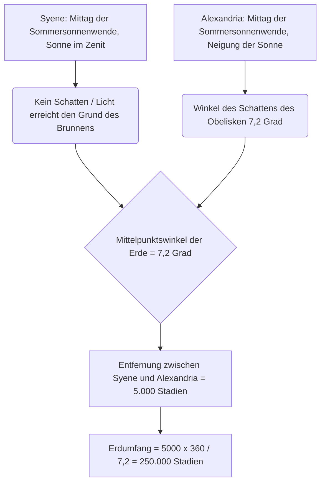
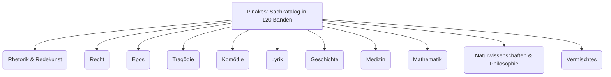
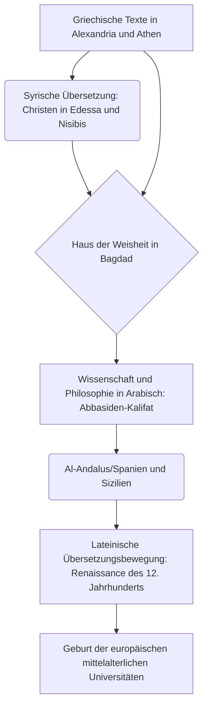

# Einleitung: Die verlorenen Erinnerungen der Antike und der Tempel des Wissens

In der Geschichte der Menschheit – dem Prozess, in dem Wissen gesammelt, systematisiert und dann auf grausame Weise wieder verloren ging – gibt es wahrscheinlich nichts, was die Vorstellungskraft mehr beflügelt und ein so starkes Gefühl von Romantik und Tragik hervorruft wie die "Große Bibliothek von Alexandria" in Ägypten. Dieser riesige Tempel des Wissens, in dem die gesamte Weisheit der antiken Mittelmeerwelt zusammengetragen wurde, war nicht nur ein Lagerhaus für Bücher. Es war ein hochmodernes wissenschaftliches Forschungsinstitut, eine Cosmopolis, in der sich verschiedene Kulturen kreuzten, und vor allem die Kristallisation eines "intellektuellen Imperialismus".

In diesem Artikel werden wir die Geschichte der Wissensvermittlung von der Geburt der Bibliothek von Alexandria über ihre Blütezeit und das Geheimnis ihrer Zerstörung bis hin zum Mittelalter und der Neuzeit mit beispielloser Detailliertheit und akademischer Tiefe nachzeichnen, indem wir die Perspektiven der antiken mediterranen Geschichte, der klassischen Philologie, der Buchgeschichte und der Bibliotheks- und Informationswissenschaft miteinander verknüpfen.

---

## Kapitel 1: Die Ambitionen Alexanders des Großen und die Geburt der hellenistischen Welt

### Der Bau von Alexandria und die Neuordnung der Mittelmeerwelt

Im Jahr 332 v. Chr. zwang der junge makedonische Eroberer Alexander der Große Ägypten zur kampflosen Übergabe und befahl den Bau einer neuen Hauptstadt, die seinen eigenen Namen tragen sollte, in dem Fischerdorf Rhakotis am westlichen Rand des Nildeltas, das dem Mittelmeer zugewandt war: "Alexandria". Die Stadt wurde von Dinokrates, dem Chefarchitekten des Königs, entworfen und übernahm das hippodamische System (ein rechtwinkliges Straßennetz), das in der griechischen Stadtplanung zu finden war. Die Hauptachse bildete eine prächtige, von Osten nach Westen verlaufende Prachtstraße (Canopische Straße), die die langgestreckte Topografie zwischen dem Mittelmeer und dem Mareotis-See optimal nutzte.

Es wurde erwartet, dass Alexandria nicht nur als Hauptstadt Ägyptens fungieren sollte, sondern als das Herzstück der "Hellenismus"-Kultur, die die Welt von Griechenland und Makedonien (Hellas) mit der Welt des Orients verschmelzen würde. Der König selbst wartete nicht auf die Fertigstellung der Stadt, sondern brach zu seinen östlichen Feldzügen auf und starb fern der Heimat in Babylon. Aber sein Wille und sein riesiges Reich wurden von seinen Diadochen (Nachfolgern) aufgeteilt. Es war Ptolemaios I. Soter (der Retter), ein Jugendfreund und enger Vertrauter des Königs, der die Kontrolle über Ägypten übernahm.

### Die Kulturpolitik von Ptolemaios I. und der "intellektuelle Imperialismus"

Ptolemaios I., der die ptolemäische Dynastie begründete, verstand zutiefst, dass militärische Herrschaft allein nicht ausreichte, um einen riesigen Vielvölkerstaat zu regieren. Er beschloss, in Alexandria ein neues kulturelles Zentrum der Welt aufzubauen, das Athen ersetzen sollte. Im Zentrum dieses Vorhabens stand die außergewöhnliche Idee, "alle Bücher der Welt an einem Ort zu versammeln".

Die theoretische Säule dieses Konzepts war Demetrios von Phaleron, ein Philosoph der aristotelischen Schule (Peripatetiker), der aus Athen ins Exil gegangen war. Demetrios verfügte sowohl über die Erfahrung, 10 Jahre lang als Tyrann von Athen die Staatsgeschäfte geführt zu haben, als auch über das Wissen bezüglich des Aufbaus der Bibliothek von Aristoteles' Lykeion. Er riet Ptolemaios I., dass nicht die bloße Herrschaft durch militärische Gewalt, sondern vielmehr das Sammeln, Übersetzen und Erforschen der Aufzeichnungen, Gesetze, Gedanken und Wissenschaften aller Völker die Bedingung für ein wahrhaft universelles Imperium sei.

Dies war das, was man als "intellektuellen Imperialismus (Intellectual Imperialism)" bezeichnen sollte. Die Könige des persischen Achämenidenreichs und Assyriens (wie die Bibliothek des Assurbanipal in Ninive) besaßen zwar auch Archive, aber das Ausmaß und der Zweck der der ptolemäischen Dynastie waren in einer ganz anderen Dimension. Ihr Ziel war es, Dokumente in allen bekannten Sprachen der Welt (Griechisch, Ägyptisch, Hebräisch, Persisch usw.) zu sammeln und ins Griechische zu übersetzen und zu integrieren. Die Legende, dass die Septuaginta (die griechische Übersetzung des Alten Testaments) in Alexandria erstellt wurde (Aristeasbrief), ist ebenfalls im Kontext dieser universellen Politik des Sammelns von Wissen anzusiedeln.

---

## Kapitel 2: Das Gesamtbild des königlichen Forschungsinstituts Museion

### Die Struktur als akademischer Tempel und die Privilegien der Gelehrten

Was wir heute die "Bibliothek von Alexandria" nennen, war kein unabhängiges Gebäude, sondern ein Teil oder ein angegliedertes Gebäude einer riesigen königlichen akademischen und Forschungsinstitution namens "Museion". "Museion" bedeutet wörtlich "Tempel der Musen (die neun Göttinnen der Künste)" und ist der Ursprung des modernen Wortes "Museum".

Der Geograf Strabon berichtet, dass das Museion an das Palastgelände (den Bezirk Brucheion) angrenzte und mit Wandelgängen (Peripatos), Gesprächsräumen (Exedra) und einem großen Speisesaal (Syssition) ausgestattet war, in dem die Gelehrten gemeinsam aßen. Das Museion kann als der Prototyp moderner Institute für fortgeschrittene Studien und Graduiertenschulen (wie das Institute for Advanced Study in Princeton) bezeichnet werden.

Die hierher eingeladenen Gelehrten (königliche Forscher) genossen erstaunliche Privilegien. Sie erhielten vom Königshaus eine großzügige lebenslange Rente, waren von allen Steuern befreit und bekamen kostenlose Unterkunft und Verpflegung. Ihre einzigen Verpflichtungen bestanden in der Suche nach Wissen, dem Verfassen von Schriften und manchmal in der Ausbildung der Kinder der königlichen Familie. Zu ihrer Blütezeit versammelte diese akademische Gemeinschaft mit Internatscharakter mehr als 100 der weltbesten Gelehrten, die sich Tag und Nacht Diskussionen und Forschungen widmeten.

### Die ultimative Textkritik und die Erfindung der editorischen Zeichen

Eines der wichtigsten Projekte im Museion war die Etablierung von Texten der klassischen Literatur, wie denen von Homer. In den handgeschriebenen Papyrusrollen jener Zeit waren Fehler und Auslassungen durch die Schreiber oder willkürliche Ergänzungen durch die Schauspieler weit verbreitet.

Aufeinanderfolgende Philologen wie Zenodotos von Ephesos, der erste Bibliotheksdirektor, Aristophanes von Byzanz und Aristarchos von Samothrake begründeten die Disziplin der "Textkritik (Textual Criticism)", die verschiedene Manuskripte verglich und untersuchte, um den Text wiederherzustellen, der seiner ursprünglichen Form am nächsten kam.

Sie erfanden ein System, bei dem spezielle editorische Zeichen an den Rändern des Textes notiert wurden.
- **Obelus (– oder ÷)**: Zeigt Zeilen an, die im Verdacht stehen, Fälschungen oder spätere Ergänzungen zu sein.
- **Asterisk (※)**: Zeigt wichtige Zeilen an, die sich wiederholen oder versehentlich eingefügt wurden, aber eigentlich an eine andere Stelle gehören.
- **Diple (>)**: Zeigt wichtige Textstellen, die annotiert werden sollten, oder grammatikalisch interessante Stellen an.

Die Zuweisung von Metadaten mit diesen Zeichen war eine bahnbrechende Informationsverarbeitungstechnologie, die als Keimzelle der Idee moderner Auszeichnungssprachen (XML und HTML) bezeichnet werden kann.

### Das goldene Zeitalter der Wissenschaft: Eratosthenes und Archimedes

Das Museion erbrachte nicht nur in den Geisteswissenschaften, sondern auch in den Naturwissenschaften Leistungen, die in der Menschheitsgeschichte Bestand haben.

**Eratosthenes' Messung des Erdumfangs**
Eratosthenes von Kyrene, der als dritter Bibliotheksdirektor diente, berechnete die Größe der Erde durch eine erstaunliche geometrische Einsicht. Er wusste, dass am Mittag der Sommersonnenwende in der südägyptischen Stadt Syene (heute Assuan) das Sonnenlicht bis auf den Grund tiefer Brunnen reichte (die Sonne stand im Zenit). Andererseits maß er zur gleichen Zeit am selben Tag in Alexandria, das genau im Norden lag, anhand des Winkels des Schattens des Obelisken einer Sonnenuhr, dass die Sonne um etwa 7,2 Grad (ein Fünfzigstel des vollen Kreises von 360 Grad) aus dem Zenit geneigt war.

Basierend auf der Tatsache, dass die Entfernung zwischen Alexandria und Syene 5.000 Stadien betrug (geschätzt aus der Anzahl der Reisetage von Kamelkarawanen), stellte Eratosthenes die folgende Proportionsgleichung auf:
`7,2 Grad : 360 Grad = 5.000 Stadien : Erdumfang`
Als Ergebnis der Berechnung ergab sich für den Erdumfang 250.000 Stadien. Unter der Annahme, dass 1 Stadion etwa 157,5 Meter (das ägyptische Stadion) beträgt, wären dies etwa 39.375 Kilometer. Verglichen mit dem tatsächlichen Äquatorumfang der Erde (etwa 40.075 Kilometer) war dies eine erstaunliche Genauigkeit mit einem Fehler von weniger als 2%.

**Anatomie und Geometrie**
Im Bereich der Medizin führten Herophilos von Chalkedon und Erasistratos von der Insel Keos unter dem Schutz des Museions die ersten systematischen menschlichen Sektionen in der Geschichte der Menschheit durch (einige Theorien besagen, dass es sich um Vivisektionen an zum Tode Verurteilten handelte). Herophilos bewies, dass das Gehirn der Sitz des Intellekts ist, klassifizierte das Nervensystem in motorische und sensorische Nerven und wies auf den Zusammenhang zwischen dem Blutpuls und der Pumpfunktion des Herzens hin.

Archimedes von Syrakus studierte in Alexandria oder interagierte durch Briefwechsel mit den Gelehrten des Museions. Er erfand die "Archimedische Schraube", eine Wasserpumpe, die auch für den Hochwasserschutz des Nils verwendet wurde, und beschäftigte sich mit dem Prinzip des Auftriebs, der Berechnung von Pi mit der Exhaustionsmethode und der Quadratur von Parabeln. Euklid, der die "Elemente" verfasste und die Geometrie systematisierte, soll ebenfalls in Alexandria zu Ptolemaios I. gesagt haben: "Es gibt keinen Königsweg in der Geometrie."

---

## Kapitel 3: Der Wahnsinn des Büchersammelns und die Revolution des Bibliothekskatalogs

### Büchersammeln mit allen Mitteln: Die Beschlagnahmungen im Hafen und die Tragödie von Athen

Um die Bibliothek des Museions zu bereichern, griffen aufeinanderfolgende Könige der ptolemäischen Dynastie zu teilweise wahnwitzigen und brutalen Methoden, um Bücher zusammenzutragen. Die Bibliothek von Alexandria vergrößerte ihren Bestand nicht nur durch den Kauf von Büchern, sondern explosionsartig durch ein System, das die Staatsmacht nutzte.

Die berühmteste Methode war das System der Zwangsbeschlagnahmung und Zensur, das als "Schiffsbücher (ek ploion)" bekannt war. Alle Handels- und Passagierschiffe, die in den Hafen von Alexandria, dem Zentrum des Mittelmeerhandels, einliefen, wurden strengen Kontrollen durch ägyptische Zollbeamte unterzogen. Wurden in der Fracht Bücher (Papyrusrollen) gefunden, wurden sie sofort beschlagnahmt, ganz gleich, wem sie gehörten. Die beschlagnahmten Bücher wurden in das Skriptorium der Bibliothek geschickt, wo spezialisierte Schreiber Tag und Nacht arbeiteten, um schnell und präzise Abschriften anzufertigen. Und erstaunlicherweise wurde dem ursprünglichen Besitzer "die neu angefertigte Kopie" zurückgegeben, während das "Original" dauerhaft in die Sammlung der Bibliothek aufgenommen wurde. Die Kopien wurden mit einem Provenienz-Etikett versehen, auf dem stand: "Beschlagnahmt von Schiff ...".

Darüber hinaus gibt es eine berühmte Geschichte über diplomatischen Betrug zur Zeit Ptolemaios III. Euergetes. Der König forderte von der Athener Regierung die Ausleihe der "offiziellen staatlich genehmigten Originale" der drei großen griechischen Tragödiendichter (Aischylos, Sophokles und Euripides). Diese Originale waren heiliges Kulturgut, das strengstens in den Staatsarchiven von Athen aufbewahrt wurde. Als Bedingung für die Ausleihe forderten die Athener eine enorme Kaution in Höhe von 15 Talenten Bargeld (man sagt, das entspräche heute mehreren zehn Millionen Euro), die Ptolemaios III. ohne zu zögern bezahlte. Doch als die Originale in Alexandria eintrafen, ließ der König seine besten Schreiber aufwändige Kopien auf feinstem Papyrus anfertigen und schickte stattdessen die Kopien zurück nach Athen. Der König überließ die Kaution von 15 Talenten den Athenern als konfiszierten Betrag (faktisch ein extrem teurer Ankauf) und stahl die wertvollen Originale als Schätze für die Bibliothek. Dies war ein Vorfall des Diebstahls von kulturellem Kapital durch eine Supermacht der hellenistischen Zeit.

### Kallimachos und "Pinakes": Die Geburt des weltweit ersten umfassenden systematischen Bibliothekskatalogs

Als Ergebnis dieser skrupellosen Sammlungsmethoden soll die Anzahl der Bücher in der Bibliothek von Alexandria Hunderttausende Bände (einigen Theorien zufolge 500.000 bis 700.000 Bände) im Hauptgebäude (im Bezirk Brucheion) und mehr als 40.000 Bände in der Zweigstelle Serapeum erreicht haben. Bei einer so enormen Menge an Informationen war es unmöglich, das gewünschte Dokument allein durch das menschliche Gedächtnis oder die physische Anordnung zu finden. Eine "Sucharchitektur (Information Retrieval Architecture)" wurde unabdingbar, um einen bloßen Berg von Schriftrollen in eine "Wissensdatenbank" zu verwandeln.

Dieser größte Durchbruch in der Geschichte der Bibliotheks- und Informationswissenschaft wurde von Kallimachos (ca. 310 v. Chr. - ca. 240 v. Chr.) erreicht, einem Dichter und genialen Gelehrten aus Kyrene. Obwohl er nie offiziell zum Bibliotheksdirektor ernannt wurde, war er de facto der Hauptverantwortliche für die Bestandsverwaltung der Bibliothek.

Kallimachos erstellte einen gewaltigen 120-bändigen Katalog namens "Pinakes (wörtlich 'Tafeln', offizieller Name: 'Verzeichnis jener, die in jedem Zweig des Lernens hervorragten, und derer, was sie verfassten')", der den gesamten Bestand der Bibliothek umfasste. Dies war nicht nur eine Bestandsliste (Inventar), sondern der erste systematische "Schlagwortkatalog (Sachkatalog)" der Menschheit.

Das Klassifizierungssystem der "Pinakes" umfasste die folgenden Kategorien als Hauptklassen (Main Classes):

Darüber hinaus lag die Genialität des Kallimachos in der Zuweisung präziser bibliografischer Informationen (Metadaten) unter diesen Hauptklassen. Innerhalb jeder Kategorie wurden die Autoren alphabetisch geordnet, und die folgenden strukturierten Daten wurden aufgezeichnet:

- **Name des Autors und Biografie**: Der Name des Autors, Geburtsort, Name des Vaters, Name des Lehrers und eine kurze Biografie. Dies diente als Normdatei (Authority Control), um Autoren mit demselben Namen zu unterscheiden.
- **Titel des Werkes**: Wenn es keinen Titel gab, wurde ein vorläufiger Titel basierend auf dem Inhalt vergeben.
- **Incipit (Anfangsworte)**: Die ersten paar Worte bis zur ersten Zeile jedes Werkes. Da die Titel bei antiken Papyrusrollen oft verloren gingen, war dies eine Methode zur Identifizierung des Werkes durch den Beginn des Textes (ähnlich einem Hash-Wert).
- **Anzahl der Bände und Gesamtzahl der Zeilen (Stichometrie)**: Die Anzahl der Bände für das gesamte Werk und die genaue Anzahl der Textzeilen. Die Aufzeichnung der Zeilenanzahl diente als Grundlage für die Berechnung der Vergütung, die den Schreibern (Scriptores) gezahlt wurde, und fungierte gleichzeitig als "Prüfsumme (Integritätsprüfung)", um zu überprüfen, ob der Text später nicht verändert wurde oder Seiten fehlten.

Diese Informationsarchitektur von Kallimachos kann als der eigentliche und universelle Ursprung von Informationsverarbeitungstechnologien angesehen werden, die über die Kataloge mittelalterlicher Klosterbibliotheken direkt zur Dewey-Dezimalklassifikation (DDC) in modernen Bibliotheken, zu OPACs (Online Public Access Catalogs) und sogar zur Struktur relationaler Datenbanken führen.

---

## Kapitel 4: Die Materialität und Schreibtechnik der Papyrusrolle (Volumen): Die antike Medienumgebung und Bibliometrie

### Das Geschenk des Nils und die Infrastruktur des Schreibens

Das, was den Wohlstand der Bibliothek von Alexandria von Grund auf materiell unterstützte, war das Speichermedium "Papyrus". Dieses Papier, das aus einem in den Sumpfgebieten des Nildeltas heimischen Sauergras (Cyperus papyrus) hergestellt wurde, war das ultimative Informationsspeichermedium in der antiken Mittelmeerwelt und übertraf Tontafeln und Tierhäute bei weitem. Wie Plinius der Ältere in seiner "Naturgeschichte (Naturalis historia)" detailliert beschreibt, war der Prozess der Papyrusherstellung ein hochspezialisiertes Handwerk.

Zunächst wurde die Rinde des dicken Stängels (mit dreieckigem Querschnitt) der Pflanze abgezogen, und das innere Mark (Pith) wurde mit einer Nadel oder einer dünnen Klinge der Länge nach in dünne Scheiben geschnitten. Diese dünnen, bandartigen Streifen (Philyrae) wurden lückenlos auf einem angefeuchteten Holzbrett aneinandergereiht, und eine weitere Schicht wurde darauf gelegt, diesmal in einem rechten Winkel gekreuzt. Mit dem schlammigen Wasser des Nils oder einem speziell zubereiteten Klebstoff (oder dem eigenen Schleim der Pflanze) wurde das Ganze mit einem Holzhammer kräftig geschlagen, um es zu pressen, und dann in der Sonne getrocknet, um ein einziges, dünnes, leichtes, flexibles und haltbares Blatt (Kollema) zu schaffen. Die höchste Qualität des Papyrus wurde "Hieratica (priesterlich)" oder nach Kaiser Augustus "Augusta" genannt, war weiß, glatt und extrem teuer.

Indem diese Blätter nacheinander mit Mehlkleister zusammengeklebt wurden, entstanden lange "Rollen" (Volumen, griechisch Biblion). Eine typische Schriftrolle bestand aus etwa 20 zusammengeklebten Kollemata (Scapus) und wurde auf dem Markt als Standardverkaufseinheit vertrieben.

Als Schreibgerät wurde ein Stift aus hartem Schilfrohr mit gespaltener Spitze namens Calamus verwendet. Im Gegensatz zur altägyptischen Binsenfeder (Pinsel) war die Spitze scharf zugeschnitten, um die Buchstaben des griechischen Alphabets präzise schreiben zu können. Die verwendete Tinte (Atramentum) war überwiegend eine Kohlenstofftinte aus Ruß, Gummi arabicum und Wasser. Da diese Tinte nur an der Oberfläche der Papierfasern haftete und nicht ins Innere eindrang, konnte sie leicht mit einem Schwamm abgewaschen und wiederverwendet werden. Gleichzeitig war sie jedoch chemisch extrem stabil, so dass Papyri, die heute nach Jahrtausenden in trockenen Wüstengebieten entdeckt werden, immer noch tiefschwarze Schriftzüge aufweisen. Für wichtige Überschriften, Verzierungen oder Lesehilfen (Rubrizierungen und editorische Zeichen) wurde rote Tinte (Zinnober aus Eisenoxid oder Quecksilbersulfid) verwendet.

### Die Grenzen der Schriftrolle und bibliometrische Einschränkungen: Die Geometrie von Zeichen und Zeilen

Das Format der Papyrusrolle wies jedoch physische Grenzen als Informationstechnologie auf.
1. **Einschränkungen in Länge und Gewicht**: Wenn eine Schriftrolle zu lang war, war sie schwer und unhandlich, und der Papyrus neigte beim Aufrollen (Explicare) zur Ermüdung und Beschädigung. Die praktische Grenze lag bei etwa 10 Metern Länge, was einem Buch von Homers "Ilias" (etwa 700 bis 900 Zeilen) entsprach. Kallimachos' berühmter Ausspruch "Ein großes Buch ist ein großes Übel (Mega biblion, mega kakon)" entsprang nicht nur ästhetischen Gründen im Sinne einer Vorliebe für die kultivierte Prägnanz der hellenistischen Literatur, sondern er verwies aus der Perspektive eines Praktikers auch auf die physischen Schwierigkeiten bei der Handhabung und die Anfälligkeit für den Verfall. Umfangreiche Geschichtswerke und Ähnliches mussten unweigerlich in mehrere Rollen (Tomoi) aufgeteilt werden, um gelagert und verwaltet zu werden.
2. **Schwierigkeit des wahlfreien Zugriffs (Random Access)**: Schriftrollen waren ein Medium des "sequentiellen Zugriffs", das von Anfang bis Ende der Reihe nach gescrollt und gelesen wurde, und es war extrem schwierig, sofort zu einer bestimmten Seite oder Zeile zu springen (zum Beispiel zu einem bestimmten Absatz in der Mitte des 7. Buches), also einen "wahlfreien Zugriff" durchzuführen. Dies zwang Gelehrten, die mehrere Dokumente gleichzeitig öffneten und verglichen (Querverweise), eine enorme kognitive Belastung und Zeitkosten auf.
3. **Die Layout-Regeln der Kolumbae**: Auf der Schriftrolle wurde der Text als durchgehende Blöcke (vertikale Absätze oder Spalten, Kolumbae genannt) geschrieben. Die Breite jedes Absatzes betrug etwa 5 bis 8 Zentimeter, der Zeilenabstand wurde gleichmäßig gehalten, es gab keine Leerzeichen zwischen den Wörtern (Worttrennung) und die "Scriptio continua (kontinuierliche Schrift)" war üblich, bei der die Buchstaben fortlaufend geschrieben wurden. Dies erforderte vom Leser fortgeschrittene Fähigkeiten im lauten Lesen.
4. **Lagerung und Verwaltung (Capsa und Sillybos)**: Die Schriftrollen wurden um eine Holzachse (Omphalos) gewickelt und aufrecht in einer zylindrischen Hülle (Capsa) oder liegend in Fächern (Nischen) gelagert. Um den Inhalt von außen zu identifizieren, wurde am Ende der Rolle ein kleines Etikett aus Pergament oder Papyrus namens "Sillybos" angebracht, auf dem der Name des Autors und der Titel standen. Dies erfüllte die Funktion eines heutigen Buchrückens, hatte aber den Nachteil, dass es durch häufiges Herausnehmen und Zurückstellen leicht abreißen konnte.

### Der Übergang zum Codex (Buchform) und die Kosten der Medienkonversion

Vom 2. bis zum 4. Jahrhundert n. Chr., einhergehend mit der explosionsartigen Verbreitung des Christentums, kam es zu einem Paradigmenwechsel (einer der größten Medienrevolutionen in der Geschichte der Menschheit) von der Papyrusrolle zum "Codex (Buchform)". Der Codex, der aus in der Mitte gefaltetem und gebündeltem Pergament oder Papyrus bestand, dessen Rücken mit Faden geheftet war, wies eine hohe Informationsdichte auf, da auf beiden Seiten (Recto und Verso) ohne Verschwendung geschrieben werden konnte (Reduzierung des physischen Volumens), und er bot vor allem den überwältigenden Vorteil, eine bestimmte Seite sofort aufschlagen zu können (Realisierung des wahlfreien Zugriffs und der Verwendung von Lesezeichen).

In der Spätphase der Bibliothek von Alexandria mussten sie in dieser Zeit des Medienwandels mit enormen Kosten konfrontiert gewesen sein, um die gigantische Sammlung von Schriftrollen in das neue Codex-Format umzuschreiben (Formatmigration). Die Dokumente, die bei diesem Umschreibeprozess ausgelassen wurden, d. h. "Schriftrollen, die nicht als Codex gebunden wurden", wurden bald obsolet, wurden nicht mehr gelesen und waren dazu verdammt, durch Feuchtigkeit und Insektenfraß für immer verloren zu gehen. Die Auswahl und Auslese von Büchern in der Bibliothek bestimmte die Überlebensrate der Texte in der Geschichte.

---

## Kapitel 5: Der Mythos und die Wahrheit der Zerstörung: Was zerstörte die Bibliothek?

Die Frage, "wann und von wem" die Bibliothek von Alexandria zerstört wurde, ist eines der größten Rätsel der Geschichte und wird oft als "Mythos" erzählt, wonach sie durch ein einziges dramatisches Großfeuer in einem Augenblick in Schutt und Asche gelegt wurde. Die moderne Geschichtswissenschaft und Archäologie zeigen jedoch, dass das Verschwinden der Bibliothek nicht auf ein einzelnes Ereignis, sondern auf das Ergebnis mehrerer Zerstörungs- und Verfallsprozesse im Laufe von Jahrhunderten zurückzuführen ist.

### 1. 48 v. Chr.: Julius Caesar und der Alexandrinische Krieg

Die berühmteste Legende der Zerstörung stammt von dem römischen Feldherrn Julius Caesar. Caesar, der Pompeius verfolgte und in Ägypten landete, stellte sich auf die Seite von Kleopatra VII. und kämpfte im Alexandrinischen Krieg. Um zu verhindern, dass seine eigene Flotte von der ptolemäischen Flotte erbeutet wurde, setzte Caesar die Schiffe im Hafen in Brand. Spätere Historiker wie Plutarch berichten, dass dieses Feuer vom Hafen auf das Land übergriff und die Große Bibliothek (oder Hunderttausende von Büchern in den Lagerhäusern des Hafens) niederbrannte.
In Caesars eigenen "Commentarii de bello civili (Bürgerkrieg)" wird das Niederbrennen der Bibliothek jedoch nicht erwähnt. Und als Strabon einige Jahrzehnte später Alexandria besuchte, waren die Einrichtungen des Museions noch in Betrieb. Daher wird angenommen, dass es höchstwahrscheinlich war, dass bei Caesars Brand nur ein "Zweig" der Bibliothek oder ein Teil der Bücher, die für den Import und Export in den Lagerhäusern des Hafens gelagert wurden, verloren ging.

### 2. Die 270er Jahre n. Chr.: Vollständige Zerstörung der Stadt durch Kaiser Aurelian

Was der Bibliothek den endgültigen Schlag versetzte, war vermutlich der römische Bürgerkrieg in der zweiten Hälfte des 3. Jahrhunderts n. Chr. Zenobia, die Königin des Palmyrenischen Reiches, besetzte Alexandria, und anschließend kam es zu heftigen Straßenkämpfen, als der römische Kaiser Aurelian die Stadt zurückeroberte.
In dieser Schlacht wurde der gesamte Palastbezirk (Brucheion) vollständig zerstört und verwüstet. Die vorherrschende Ansicht in der modernen Geschichtswissenschaft ist, dass das Museion und die Große Bibliothek zu dieser Zeit zusammen mit den Gebäuden vollständig zerstört wurden und die Buchsammlung ebenfalls verstreut und verbrannt wurde.

### 3. 391 n. Chr.: Zerstörung des Serapeums durch Kaiser Theodosius und Christen

Selbst nach dem Verschwinden der Großen Bibliothek existierte eine Zweigstelle (Schwesterbibliothek) im riesigen Tempel des Gottes Sarapis, dem "Serapeum", im Südwesten Alexandrias und hielt die Lebensader der Gelehrsamkeit am Leben.
Der römische Kaiser Theodosius I. erhob jedoch das Christentum zur Staatsreligion und erließ ein Edikt zur Zerstörung heidnischer Tempel. Daraufhin griffen Theophilus, der radikale christliche Bischof von Alexandria, und ein Mob fanatischer Mönche das Serapeum an und zerstörten den prächtigen Tempel vollständig. Es wird angenommen, dass zu dieser Zeit auch die im Tempel aufbewahrten Papyrusrollen als böse Bücher des Heidentums verbrannt wurden. Dieser Vorfall wird zusammen mit der brutalen Ermordung der Mathematikerin Hypatia, die sich später (im Jahr 415 n. Chr.) ereignete, als Tragödie weitergegeben, die das Ende der freien intellektuellen Forschung in der Antike symbolisiert.

### 4. 642 n. Chr.: Die islamische Eroberung und die Legende vom Kalifen Umar

Der sensationellste Mythos, der von christlichen und arabischen Chronisten des 13. Jahrhunderts erschaffen wurde, ist die Legende der Zerstörung durch die islamische Armee. Als der arabische General 'Amr ibn al-'As Alexandria eroberte, fragte er den Kalifen Umar ibn al-Chattab, was mit den Büchern in der Bibliothek geschehen solle. Umar soll geantwortet haben:
"Wenn der Inhalt dieser Bücher mit dem Koran übereinstimmt, brauchen wir sie nicht, da wir den Koran haben. Wenn sie dem Koran widersprechen, sind sie schädlich. Also verbrennt sie alle."
Und die Sammlung soll als Brennstoff für die Boiler der 4.000 öffentlichen Bäder in Alexandria verteilt worden sein und ein halbes Jahr lang gebrannt haben.
Moderne Forscher haben diese Episode jedoch als reine Fiktion (eine spätere Erfindung) abgetan. Denn zum Zeitpunkt der islamischen Eroberung im 7. Jahrhundert war die einst so große Bibliothek aufgrund jahrhundertelanger Kriege, versiegender Budgets und der natürlichen Alterung des Papyrus (im feuchten Küstenklima verrottet Papyrus in wenigen Jahrhunderten) längst spurlos verschwunden.

---

## Kapitel 6: Die Zuflucht des Wissens und die große Reise ins Mittelalter und in die Renaissance: Das Überleben des menschlichen Gedächtnisses

Die physischen Gebäude und Papyri von Alexandria verbrannten zu Asche und kehrten zur Erde zurück. Die DNA der "antiken Weisheit", die dort kultiviert worden war, starb jedoch nicht vollständig aus. Durch einen bemerkenswerten intellektuellen Staffellauf über mehrere Jahrhunderte hinweg vollendeten einige von ihnen eine epische Reise über Syrien, Persien, die Arabische Halbinsel, Nordafrika und die Iberische Halbinsel bis in unsere heutige Zeit.

### Vom Syrischen ins Arabische: Das Haus der Weisheit in Bagdad und die große Übersetzungsbewegung

Vom 5. bis zum 6. Jahrhundert flohen nestorianische und miaphysitische Gelehrte, die der Verfolgung von Häretikern durch die orthodoxe Fraktion (Chalcedonenser) im Byzantinischen Reich entgangen waren, nach Osten, nach Syrien und ins Sassanidenreich (Persien). Insbesondere Edessa (heute Şanlıurfa), Nisibis und die medizinische Schule von Gundischapur in Persien wurden zu neuen Zentren für die Bewahrung der griechischen Gelehrsamkeit. Sie übersetzten zuerst schwierige griechische Texte wie die Logik von Aristoteles ("Organon"), die Medizin von Galenos und Hippokrates und die Astronomie von Ptolemäus ("Almagest") ins Syrische (einen Dialekt des Aramäischen). Dies war die erste Brücke des griechischen Wissens in den Nahen Osten.

Später, im 8. Jahrhundert, entstand das islamische Abbasiden-Kalifat, und Kalifen wie al-Mansur und al-Ma'mun gründeten eine riesige Übersetzungs- und Forschungseinrichtung namens "Bait al-Hikma (Haus der Weisheit)" in der neuen Hauptstadt Bagdad. Dies war ein nationales Projekt, das wahrlich als "zweites Museion" bezeichnet werden konnte.

Hier entfalteten brillante Übersetzer wie Hunain ibn Ishaq (ein christlich-nestorianischer Araber) eine beispiellose, groß angelegte Übersetzungsbewegung (die griechisch-arabische Übersetzungsbewegung) vom Syrischen ins Arabische oder direkt vom Griechischen ins Arabische. Hunain lieferte nicht nur wörtliche Übersetzungen, sondern wandte auch Textkritik an (die philologische Methode von Alexandria, mehrere Manuskripte zu vergleichen, um die genaue Bedeutung zu bestimmen) und schuf neues wissenschaftliches und philosophisches Fachvokabular (wie abstrakte Konzepte für "Qualität", "Quantität" und "Essenz") im Arabischen.

Das Wissen von Alexandria blühte auf dem neuen fruchtbaren Boden der islamischen Welt auf und vollzog seine eigene einzigartige Entwicklung. Islamische Gelehrte wie al-Chwarizmi (der Vater der Algebra), al-Kindi (der Vater der arabischen Philosophie), Ibn Sina (lateinisch Avicenna, Autor des "Kanon der Medizin") und Ibn Ruschd (lateinisch Averroes, der ultimative Kommentator des Aristoteles) nahmen das griechische Wissen nicht nur auf, sondern überwanden es kritisch und bauten das weltweit höchste Niveau an Wissenschaft und Technologie auf.

*(※Das obige Diagramm ist ein Stammbaum der griechisch-arabisch-lateinischen Übersetzungsbewegung)*

### Bewahrung von Manuskripten im Byzantinischen Reich und Rückfluss in die italienische Renaissance

Auf der anderen Seite gibt es auch eine Linie des Wissens, die im griechischsprachigen Raum verblieb. In Konstantinopel, der Hauptstadt des Oströmischen (Byzantinischen) Reiches, und in den Klöstern auf dem Berg Athos wurden griechische klassische Texte von Mönchen endlos auf Pergament-Codices kopiert und aufbewahrt. Im 9. Jahrhundert fand eine klassische Wiederbelebung statt, die "Makedonische Renaissance" genannt wird, bei der die "Bibliotheke (Leseaufzeichnungen)" des Patriarchen Photios und die "Suda (eine riesige Enzyklopädie in griechischer Sprache)" zusammengestellt wurden und antikes Wissen zusammengefasst und bewahrt wurde.

Während der "Renaissance des 12. Jahrhunderts" im 12. Jahrhundert floss das Wissen, das aus der islamischen Welt (Toledo in Spanien und Sizilien in Süditalien) über das Arabische ins Lateinische übersetzt worden war, nach Westeuropa und förderte die Entstehung europäischer Universitäten (Universitas) in Paris und Bologna.

Als Konstantinopel 1453 an das Osmanische Reich fiel, flohen zudem viele byzantinische Gelehrte, darunter Georgios Gemistos Plethon, mit wertvollen griechischen Manuskripten (wie den gesammelten Werken Platons) auf die italienische Halbinsel. Dies löste in Florenz unter der Herrschaft der Medici und in Venedig, wo sich der Buchdruck entwickelte, eine direkte Wiederentdeckung der griechischen Klassiker aus und wurde zu einer mächtigen treibenden Kraft für die auf dem Humanismus basierende italienische Renaissance.

### Die Fragen an die moderne digitale Alexandria und die ewige Herausforderung

Heute, im Jahr 2002, wurde mit Zusammenarbeit der ägyptischen Regierung und der UNESCO die riesige, scheibenförmige neue Bibliothek "Bibliotheca Alexandrina (Die Neue Bibliothek von Alexandria)" nahe dem Standort der einstigen Bibliothek errichtet und erlebte so eine symbolische Wiederauferstehung.

Darüber hinaus gibt es im Cyberspace des Internets moderne Versionen des "Traums von Alexandria", wie das "Internet Archive", das versucht, alle Webseiten, Bücher und Videos der Welt zu digitalisieren und zu bewahren. Das Projekt Google Books kann ebenfalls als ein moderner Ausdruck des intellektuellen Imperialismus der ptolemäischen Dynastie bezeichnet werden.

Wir müssen jedoch schwere Lektionen aus dem Schicksal der antiken Bibliothek ziehen. Selbst wenn das Speichermedium von Papyrus zu Siliziumchips und Cloud-Speicher gewechselt hat und das Gesamtdatenvolumen auf Exabyte-Größe angewachsen ist, haben sich die grundlegenden Risiken, die die Erhaltung und Weitergabe von Wissen bedrohen, nicht geändert. Krieg, Terrorismus, Zensur durch diktatorische politische Ideologien, die Erschöpfung von Projektmitteln und vor allem das Problem der "Veralterung von Formaten (die Gefahr eines digitalen dunklen Zeitalters)". In einer modernen Welt, in der Software und Hardware innerhalb weniger Jahre veralten, gibt es keine sichere Antwort darauf, wer unsere heutigen digitalen Daten in 500 oder 1000 Jahren lesen kann und wie dies geschehen soll.

Die Geschichte vom Aufstieg und Fall der Bibliothek von Alexandria spricht über Jahrtausende hinweg tief zu uns und zeigt, wie zerbrechlich das Bemühen der Menschheit ist, Wissen zu sammeln, zu schützen und weiterzugeben, und gleichzeitig, wie viel ungebrochenen Willen und kontinuierliche Anstrengung (die unaufhörliche Transkription von Manuskript zu Manuskript) es erfordert.

---
