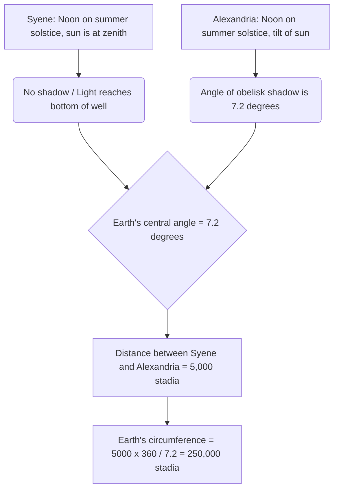
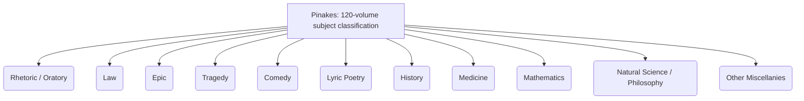
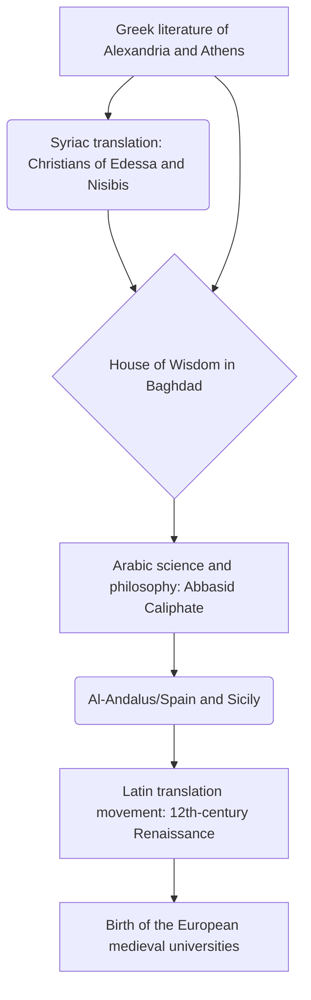

# Introduction: Lost Memories of Antiquity and the Temple of Knowledge

In the history of humanity's process of accumulating, systematizing, and tragically losing knowledge, perhaps nothing stirs the imagination and evokes a sense of romance and sorrow quite like the "Great Library of Alexandria" in Egypt. This massive temple of knowledge, where all the wisdom of the ancient Mediterranean world was gathered, was not merely a repository of books. It was a cutting-edge academic research institute, a cosmopolis where diverse cultures intersected, and above all, the crystallization of "Intellectual Imperialism."

In this article, by intersecting multiple academic perspectives—ancient Mediterranean history, classical philology, the history of the book, and library and information science—we will depict the history of knowledge transmission from the birth and prosperity of the Library of Alexandria, through the mystery of its destruction, down to the Middle Ages and modern times, with unprecedented detail and scholarly depth.

---

## Chapter 1: The Ambition of Alexander the Great and the Birth of the Hellenistic World

### The Construction of Alexandria and the Reorganization of the Mediterranean World

In 332 BC, the young Macedonian conqueror Alexander the Great forced the bloodless surrender of Egypt and ordered the construction of a new capital bearing his name, "Alexandria," on the site of the fishing village of Rhacotis at the western edge of the Nile Delta, facing the Mediterranean Sea. Designed by the king's chief architect Dinocrates, this city adopted the Hippodamian system (orthogonal street grid) seen in Greek urban planning and was centered on a magnificent main street (Canopic Way) running east to west, making the most of the long and narrow terrain situated between the Mediterranean Sea and Lake Mareotis.

Alexandria was expected to function not just as the capital of Egypt, but as the heart of "Hellenism" culture, fusing the Greek-Macedonian world (Hellas) with the world of the Orient. The great king himself departed on his eastern campaigns without waiting for the city's completion and died in Babylon, but his will and his vast empire were divided among his Diadochi (successors). It was Ptolemy I Soter (the Savior), a childhood friend and close aide of the king, who took control of Egypt.

### Cultural Policies of Ptolemy I and "Intellectual Imperialism"

Ptolemy I, who founded the Ptolemaic dynasty, deeply understood that a vast multi-ethnic state could not be governed by military rule alone. He decided to establish a new cultural center of the world in Alexandria to replace Athens. At the core of this was the staggering vision of "gathering all the books of the world in one place."

The theoretical pillar of this vision was the Peripatetic philosopher Demetrius of Phalerum, who had been exiled from Athens. Demetrius possessed both the experience of managing state affairs for ten years as the tyrant of Athens and the knowledge regarding the construction of the library at Aristotle's Lyceum. He advised Ptolemy I that the condition for a true universal empire was not merely rule by force, but the collection, translation, and study of the records, laws, ideas, and sciences of all peoples.

This could be called "Intellectual Imperialism." Kings of the Achaemenid Empire and Assyria in the past (such as the Library of Ashurbanipal in Nineveh) also had archives, but the scale and purpose of the Ptolemaic one belonged to a different dimension. They aimed to collect literature in all languages of the known world (Greek, Egyptian, Hebrew, Persian, etc.) and translate and integrate them into Greek. The legend that the Greek translation of the Old Testament, the "Septuagint," was created in Alexandria (the Letter of Aristeas) is also positioned within the context of this universal knowledge collection policy.

---

## Chapter 2: The Full Picture of the Royal Research Institute Museion

### Structure as an Academic Temple and the Privileges of Scholars

What we today call the "Library of Alexandria" was not an independent building, but rather a part, or an attached facility, of a massive royal academic and research complex called the "Museion." "Museion" literally means the "Temple of the Muses" (the nine goddesses presiding over the arts) and is the origin of the modern word "museum."

The geographer Strabo records that the Museion was adjacent to the royal palace grounds (the Bruchion district) and featured a walkway (peripatos), a discussion room (exedra), and a large dining hall (syssition) where scholars shared meals. The Museion can be said to be the prototype for modern institutes for advanced study or graduate universities (like the Institute for Advanced Study in Princeton).

The scholars (royal researchers) invited here were granted astonishing privileges. They were paid a generous lifelong pension by the royal court, exempted from all taxes, and provided with free housing and food. Their only duties were the pursuit of knowledge, writing activities, and sometimes the education of the royal children. At its peak, this boarding-school-style academic community gathered over a hundred world-class scholars who devoted themselves to discussion and research day and night.

### The Ultimate Textual Criticism and the Invention of Editing Symbols

One of the most important projects at the Museion was the establishment of texts of classical literature such as Homer. In the hand-copied papyrus scrolls of the time, misspellings by copyists, omissions, or arbitrary additions by actors were rampant.

Successive philologists, such as the first chief librarian Zenodotus of Ephesus, Aristophanes of Byzantium, and Aristarchus of Samothrace, established the discipline of "Textual Criticism," which involved comparing multiple different manuscripts to restore the text to its most original form.

They invented a system of writing special editing symbols in the margins of the texts.
- **Obelus (– or ÷)**: Indicates lines suspected to be forgeries or later additions.
- **Asterisk (※)**: Indicates important lines that were repeated or incorrectly inserted, but originally belonged elsewhere.
- **Diple (>)**: Indicates important passages to be annotated or passages of grammatical interest.

The addition of metadata using these symbols was a groundbreaking information processing technology that can be said to be the seed of the ideas behind modern markup languages (XML and HTML).

### The Golden Age of Science: Eratosthenes and Archimedes

The Museion achieved monumental accomplishments not only in the humanities but also in the natural sciences.

**Eratosthenes' Measurement of the Earth's Circumference**
Eratosthenes of Cyrene, who served as the third chief librarian, calculated the size of the Earth with astonishing geometric insight. He knew that at noon on the summer solstice in the southern Egyptian city of Syene (modern Aswan), sunlight reached the bottom of a deep well (the sun reached its zenith). On the other hand, at the same time on the same day in Alexandria, located due north, he measured from the angle of the shadow of a sundial obelisk that the sun was tilted about 7.2 degrees (one-fiftieth of a full 360-degree circle) from the zenith.

Based on the assumption that the distance between Alexandria and Syene was 5,000 stadia (estimated from the travel days of camel caravans), Eratosthenes set up the following proportional equation.
`7.2 degrees : 360 degrees = 5,000 stadia : Earth's full circumference`
As a result of the calculation, the Earth's circumference was calculated to be 250,000 stadia. Assuming 1 stadion to be approximately 157.5 meters (the Egyptian stadion), this would be about 39,375 kilometers, an astonishing precision with an error of less than 2% compared to the actual circumference of the Earth at the equator (about 40,075 kilometers).

**Anatomy and Geometry**
In the field of medicine, Herophilus of Chalcedon and Erasistratus of Ceos systematically performed the first human dissections in human history (some theories say vivisection on condemned criminals) under the protection of the Museion. Herophilus proved that the brain is the seat of intellect, classified the nervous system into motor and sensory nerves, and further pointed out the connection between blood pulse and the pumping function of the heart.

Furthermore, Archimedes of Syracuse studied in Alexandria or interacted with scholars of the Museion through correspondence. He invented "Archimedes' screw," which was also used for flood control of the Nile, and worked on the principles of buoyancy, the calculation of pi using the method of exhaustion, and the quadrature of the parabola. Euclid, who systematized geometry by writing "Elements," is also said to have told Ptolemy I in Alexandria that "there is no royal road to geometry."

---

## Chapter 3: The Madness of Book Collecting and the Revolution of the Library Catalog

### Book Collecting by Any Means: Port Confiscations and the Tragedy of Athens

In order to enrich the library of the Museion, successive kings of the Ptolemaic dynasty gathered books through forceful means that could sometimes be called madness. The Library of Alexandria explosively increased its collection not merely by buying books, but by a system that invoked state power.

The most famous method was the system of censorship and forced requisition known as the "books of the ships" (ek ploion). All merchant and passenger ships entering the port of Alexandria, the center of Mediterranean trade, were subjected to strict inspection by Egyptian customs officials. If books (papyrus scrolls) were found among the cargo, they were immediately confiscated regardless of who owned them. The confiscated books were sent to the library's scriptorium, where specialized scribes worked day and night to create quick and elaborate copies. Then, astonishingly, the "newly created copies" were returned to the original owners, while the "originals" were permanently kept as the library's collection. The copies were tagged with a provenance label saying "confiscated from the ship ~".

Furthermore, there is a famous episode of diplomatic fraud during the era of Ptolemy III Euergetes. The king demanded that the Athenian government lend the "state-authorized official originals" of the three great Greek tragic poets (Aeschylus, Sophocles, and Euripides). These originals were sacred cultural heritage strictly kept in the state archives of Athens. As a condition for the loan, Athens demanded a massive cash deposit of 15 talents (said to be worth tens of millions of dollars in today's value), which Ptolemy III readily paid. However, when the originals arrived in Alexandria, the king had his best scribes create exquisite copies on the finest papyrus, and sent those copies back to Athens instead. The king allowed the deposit of 15 talents to be forfeited to Athens (effectively an ultra-expensive purchase) and usurped the precious originals as the library's treasures. This was a cultural capital robbery by the superpower of the Hellenistic era.

### Callimachus and the "Pinakes": The Birth of the World's First Comprehensive Book Classification Catalog

As a result of such unsparing collection methods, the number of books in the Library of Alexandria is said to have reached hundreds of thousands of scrolls (some say 500,000 to 700,000) in the main building (Bruchion district) and over 40,000 scrolls in the Serapeum annex. With this massive amount of information, it was no longer possible to find a desired document merely by human memory or physical arrangement. A "search system (information retrieval architecture)" to transform a mere mountain of scrolls into a "knowledge database" became indispensable.

The one who achieved this greatest breakthrough in the history of library and information science was the poet and genius scholar from Cyrene, Callimachus (c. 310 BC - c. 240 BC). Although it is said he never officially became the chief librarian, he was the de facto person responsible for managing the library's collection.

Callimachus created the "Pinakes" (literally "Tablets", officially "Tables of Persons Eminent in Every Branch of Learning together with a List of Their Writings"), a massive 120-volume catalog covering the library's entire collection. This was not a mere inventory, but the first systematic "subject catalog" in human history.

The classification system of the "Pinakes" established the following categories as main classes.

Furthermore, the genius of Callimachus lay in the fact that he attached elaborate bibliographic information (metadata) under these main classifications. Within each category, authors were arranged in alphabetical order, and structured data like the following was described.

- **Author's Name and Biography**: The author's name, birthplace, father's name, teacher's name, and a brief biography. This functioned as Authority Control to distinguish authors with the same name.
- **Title of the Work**: If there was no title, a provisional title based on the content was assigned.
- **Incipit (Opening Words)**: The first few words to the first line of each work. Since titles were often lost on ancient papyrus scrolls, this was a method to identify the work by the beginning of the text (similar in role to a hash value).
- **Number of Volumes and Total Lines (Stichometry)**: The number of volumes of the entire work and the exact number of lines of text. The record of the number of lines served as the basis for calculating the remuneration paid to the scribe (scriptor), and at the same time played the role of a "checksum (integrity verification)" to verify whether the text had been subsequently altered or pages had fallen out.

Callimachus's architecture of information organization can be said to be the originator of essential and universal information processing technologies, connecting directly through the catalogs of medieval monastic libraries to the Dewey Decimal Classification (DDC) and OPAC (Online Public Access Catalog) of modern libraries, and even to the structure of relational databases.

---

## Chapter 4: The Materiality of the Papyrus Scroll (Volumen) and Writing Technology: Ancient Media Environments and Bibliometrics

### The Gift of the Nile and the Infrastructure of Writing

What fundamentally supported the prosperity of the Library of Alexandria from a material perspective was the recording medium known as "Papyrus." Made from the Cyperus papyrus, a sedge plant growing wild in the wetlands of the Nile Delta, this paper was the supreme information recording medium in the ancient Mediterranean world, surpassing clay tablets and animal skins. As Pliny the Elder details in his "Natural History," the manufacturing process of papyrus was a highly specialized handicraft.

First, the outer bark of the thick stem (which has a triangular cross-section) of the plant is peeled off, and the inner pith is sliced vertically into thin strips with a needle or a thin blade. These thin ribbon-like long pieces (philyrae) are placed tightly together on a dampened wooden board, and on top of that, another layer is placed, this time crossing at right angles. Using the muddy water of the Nile or a specially prepared adhesive (or the plant's own mucilage), the whole thing is vigorously beaten with a wooden mallet to compress it, and by drying it in the sun, a thin, light, flexible, yet durable single sheet (kollema) is completed. The highest quality papyrus was called "Hieratica (for priests)" or "Augusta" bearing the name of Emperor Augustus, and it was white, smooth, and extremely expensive.

These sheets were continuously pasted together with flour paste to make a long "scroll (Volumen, 'biblion' in Greek)". A standard scroll sold in the market consisted of about 20 kollemata pasted together (scapus) as a standard unit of sale.

For writing implements, a pen made by splitting the tip of a hard reed stem called a calamus was used. Unlike traditional Egyptian rush brushes, the tip was sharply cut to write the Greek alphabet sharply. The ink (atramentum) used was mainly carbon ink made by mixing soot, gum arabic, and water. Because this ink only adhered to the surface of the paper fibers and did not penetrate inside, it could easily be washed off with a sponge and reused, but at the same time, it was chemically extremely stable, so even today, papyri found in arid desert regions after thousands of years retain their black letters. Red ink (cinnabar, which is iron oxide or mercury sulfide) was used for important headings, decorations, or rubies and editing symbols to aid reading.

### The Limits of Scrolls and Bibliometric Constraints: The Geometry of Character Counts and Line Counts

However, there were physical limits as an information technology to the format of the papyrus scroll.
1. **Constraints of Length and Weight**: If a scroll is too long, it is heavy and cumbersome to handle, and the papyrus is prone to fatigue and tearing when unrolled (explicare). The practical limit was about 10 meters in length, which corresponded to one book of Homer's "Iliad" (about 700 to 900 lines). Callimachus's famous saying, "A big book is a big evil (Mega biblion, mega kakon)," was not only due to an aesthetic reason preferring the refined conciseness unique to Hellenistic literature, but also points out the cumbersomeness of physical handling and the susceptibility to degradation of the scroll from a practitioner's perspective. Lengthy history books and the like inevitably had to be divided into multiple scrolls (tomoi) for storage and management.
2. **Difficulty of Random Access**: The scroll was a "sequential access" medium read by scrolling in order from beginning to end, and "random access" to jump instantly to a specific page or line (e.g., a specific paragraph in the middle of the 7th volume) was extremely difficult. This forced an enormous cognitive load and time cost in tasks where scholars opened and cross-referenced multiple documents simultaneously.
3. **Layout Rules of Kolymbai**: On the scroll, characters were written as continuous blocks (vertical paragraphs or columns called kolymbai). The width of each paragraph was about 5 to 8 centimeters, line spacing was kept even, and there were no spaces between words (word spacing); a "scriptio continua (continuous writing)" where characters were written continuously was common. This demanded a high level of reading-aloud skills from the reader.
4. **Storage and Management (Cartouche and Sillybos)**: Scrolls were wrapped around a wooden axis (roller) called an omphalos, and stored standing in a capsa (cylindrical case) or stacked horizontally on a pit (shelf). To identify the contents from the outside, a small parchment or papyrus tag called a "Sillybos" was attached to the end of the scroll, and the author's name and title were written on it. This played the role of a spine today, but it had the weakness of being easily torn off through frequent taking in and out.

### The Transition to the Codex and the Cost of Media Conversion

From the 2nd to the 4th century AD, along with the explosive spread of Christianity, a paradigm shift (one of the greatest media revolutions in human history) occurred from the papyrus scroll to the "Codex (bound book)". The codex, made by folding parchment or papyrus in half, bundling them, and sewing the spine with thread, could be written on both sides (recto and verso) without waste, thus having high information density (reduction of physical volume), and above all, had the overwhelming advantage of being able to instantly open a specific page (realization of random access and utilization of bookmarks).

At the end of the Library of Alexandria, during this period of media transition, they must have faced an enormous cost of rewriting the vast collection of scrolls into the new codex format (format migration). The literature that was left out of this rewriting process, that is, the "scrolls that were not codicized," eventually became obsolete, were no longer read, and were destined to be forever lost to moisture and insect damage. The selection and culling of collections in the library came to determine the survival rate of historical texts.

---

## Chapter 5: The Myth and Truth of Destruction: What Destroyed the Library?

The question of "when and by whom was the Library of Alexandria destroyed" is one of the greatest mysteries in history, and it is often told as a "myth" that it was instantly reduced to ashes by a single dramatic great fire. However, modern history and archaeology show that the disappearance of the library was not a single event, but the result of multiple processes of destruction and decline spanning several centuries.

### 1. 48 BC: Julius Caesar and the Alexandrian War

The most famous legend of destruction is by the Roman general Julius Caesar. Caesar, who landed in Egypt in pursuit of Pompey, sided with Cleopatra VII and fought the Alexandrian War. To prevent his fleet from being captured by the Ptolemaic fleet, Caesar set fire to the ships in the harbor. Later historians such as Plutarch report that this fire spread from the harbor to the land, burning down the Great Library (or hundreds of thousands of books stored in warehouses in the harbor).
However, in Caesar's own "Commentaries on the Civil War," there is no mention of the library's destruction by fire. Furthermore, when Strabo visited Alexandria a few decades later, the facilities of the Museion were still functioning. Therefore, it is highly likely that what was lost in Caesar's fire was an "annex" of the library or a portion of the books stored in the harbor's warehouses for import and export.

### 2. 270s AD: Thorough Destruction of the City by Emperor Aurelian

It is thought that the decisive blow to the main body of the library was the civil war of the Roman Empire in the late 3rd century AD. Queen Zenobia of the Palmyrene Empire captured Alexandria, and then fierce street fighting occurred when the Roman Emperor Aurelian retook the city.
In this battle, the entire palace district (Bruchion) was thoroughly destroyed and laid waste. The most prominent view in modern history is that the Museion and the Great Library were also completely destroyed along with the buildings at this time, and the collection was scattered and burnt.

### 3. 391 AD: Destruction of the Serapeum by Emperor Theodosius and Christians

Even after the disappearance of the Great Library, a branch (sister library) of the library existed in the massive temple of the god Serapis, the "Serapeum," in the southwestern part of Alexandria, keeping the lifeblood of learning alive.
However, the Roman Emperor Theodosius I made Christianity the state religion and issued an edict to destroy pagan temples. In response to this, Theophilus, a hardline Christian bishop of Alexandria, and a mob of fanatical monks attacked the Serapeum and completely destroyed the magnificent temple. It is surmised that the papyrus scrolls stored in the temple at this time were also burned as evil pagan books. This incident, along with the brutal murder of the female mathematician Hypatia that occurred in a later year (415 AD), is handed down as a tragedy symbolizing the end of free intellectual inquiry in antiquity.

### 4. 642 AD: The Islamic Conquest and the Legend of Caliph Umar

The most sensational myth created by 13th-century Christian and Arab chroniclers is the legend of destruction by the Islamic army. When the Arab general 'Amr ibn al-'As conquered Alexandria, he asked Caliph Umar ibn al-Khattab what to do with the books in the library. Umar is said to have replied as follows:
"If those books are in agreement with the Quran, we have no need of them; and if these are opposed to the Quran, destroy them."
And so, the collection was distributed as fuel for the boilers of the 4,000 public baths in Alexandria, and they burned for half a year.
However, modern researchers conclude that this episode is complete fiction (a later fabrication). This is because by the time of the Islamic conquest in the 7th century, the former Great Library had already vanished without a trace due to centuries of war, depletion of budgets, and the natural deterioration of papyrus (papyrus rots in a few centuries in the humid coastal climate).

---

## Chapter 6: The Refuge of Knowledge and the Great Voyage to the Middle Ages and Renaissance: The Survival of Human Memory

The physical buildings and papyri of Alexandria were reduced to ashes and returned to the earth. However, the DNA of the "ancient wisdom" cultivated there was not completely severed. Through a remarkable intellectual relay spanning centuries, a portion of it accomplished a long voyage, passing through Syria, Persia, the Arabian Peninsula, North Africa, and the Iberian Peninsula, to reach us today.

### From Syriac to Arabic: The House of Wisdom in Baghdad and the Great Translation Movement

From the 5th to the 6th century, Nestorian and Monophysite scholars who fled the persecution of heretics by the orthodox Christian (Chalcedonian) faction in the Byzantine Empire sought refuge in eastern Syria and Sassanid Persia. In particular, the medical schools of Edessa (modern Şanlıurfa), Nisibis, and Gondishapur in Persia became new strongholds for inheriting Greek learning. They translated difficult Greek texts such as Aristotle's logic ("Organon"), the medicine of Galen and Hippocrates, and Ptolemy's astronomy ("Almagest") first into Syriac (a dialect of Aramaic). This became the first bridge of Greek knowledge in the Middle East.

Later, in the 8th century, the Islamic Abbasid Caliphate arose, and Caliphs Al-Mansur and Al-Ma'mun established a massive translation and research institution called the "Bayt al-Hikmah (House of Wisdom)" in their new capital, Baghdad. This was truly a national project that could be called the "Second Museion."

Here, brilliant translators, led by Hunayn ibn Ishaq (an Arab Nestorian Christian), carried out an unprecedented large-scale translation movement (the Graeco-Arabic translation movement) from Syriac to Arabic, or directly from Greek to Arabic. Hunayn did not merely do literal translations, but rather, after performing textual criticism (the Alexandrian philological method of comparing multiple manuscripts to determine the accurate meaning), he created new specialized terms for philosophy and science in Arabic (e.g., abstract concepts such as "quality", "quantity", "essence").

The knowledge of Alexandria blossomed in the new fertile soil of the Islamic world and achieved its own evolution. Great Islamic scholars such as Al-Khwarizmi (the father of algebra), Al-Kindi (the father of Arab philosophy), Ibn Sina (Latin name Avicenna, author of The Canon of Medicine), and Ibn Rushd (Latin name Averroes, the ultimate commentator on Aristotle) not only absorbed Greek knowledge but critically overcame it, building the world's highest level of science and technology.

*(※The above is a phylogenetic diagram of the Graeco-Arabic-Latin translation movement)*

### The Preservation of Manuscripts in the Byzantine Empire and the Return to the Italian Renaissance

On the other hand, there is also a lineage of knowledge that remained in the Greek-speaking world. In Constantinople, the capital of the Eastern Roman Empire (Byzantine Empire), and the monasteries of Mount Athos, classical Greek literature was continuously copied onto parchment codices and preserved by monks. In the 9th century, a classical revival known as the "Macedonian Renaissance" occurred, and works such as the Patriarch Photius's "Bibliotheca (Myriobiblon)" and the "Suda" (a massive Greek encyclopedia) were compiled, summarizing and preserving ancient knowledge.

During the "Renaissance of the 12th century," knowledge translated into Latin from the Islamic world (Toledo in Spain and Sicily in southern Italy) via Arabic flowed into Western Europe, prompting the birth of European universities (universitas) in Paris and Bologna.

Furthermore, when Constantinople fell to the Ottoman Empire in 1453, many Byzantine scholars, including Georgios Gemistos Plethon, fled to the Italian peninsula carrying precious Greek manuscripts (such as the complete works of Plato). This triggered a direct rediscovery of Greek classics in Florence, ruled by the Medici family, and Venice, where movable type printing was developing, becoming the driving force that powerfully drove the Italian Renaissance based on humanism.

### Questions for the Modern Digital Alexandria and Eternal Challenges

Today, in 2002, a massive disc-shaped new library, the "Bibliotheca Alexandrina (New Library of Alexandria)," was built near the site of the former library through the cooperation of the Egyptian government and UNESCO, achieving a symbolic revival.

Also, in the cyberspace of the Internet, there exists a modern version of the "Dream of Alexandria" that seeks to digitize and preserve all the world's web pages, books, and videos, such as the "Internet Archive." The Google Books project could also be said to be a modern manifestation of the intellectual imperialism of the Ptolemaic dynasty.

However, we need to learn a heavy lesson from the fate of the ancient library. Even if the recording medium has changed from papyrus to silicon chips and cloud storage, and the total amount of data has swelled to the exabyte scale, the fundamental risks threatening the preservation and transmission of knowledge have not changed. These are the problems of war and terrorism, censorship by dictatorial political ideologies, depletion of project funds, and above all, "obsolescence of formats (the crisis of a digital dark age)." In a modern age where software and hardware become outdated in a few years, there is no certain answer to who will be able to read our current digital data, and how, in 500 or 1,000 years.

The history of the rise and fall of the Library of Alexandria speaks deeply to us across thousands of years about how fragile the human endeavor of collecting, protecting, and passing on knowledge is, and at the same time, how much it requires unyielding will and continuous effort (the incessant transcription from manuscript to manuscript).

---
