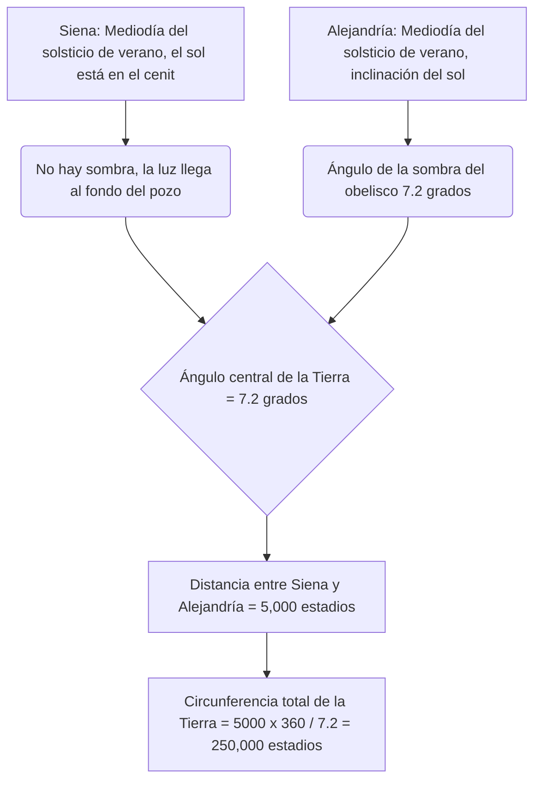
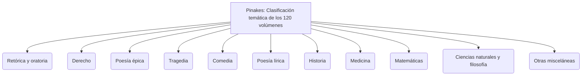
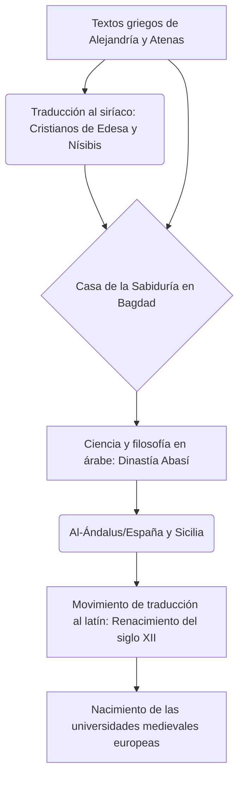

# Introducción: La memoria perdida de la antigüedad y el palacio del conocimiento

A lo largo de la historia, en el proceso mediante el cual la humanidad ha acumulado, sistematizado y lamentablemente perdido conocimiento, no hay entidad que despierte tanto la imaginación y evoque tanto romance y tristeza como la "Gran Biblioteca de Alejandría" (Great Library of Alexandria) en Egipto. Este gigantesco templo del conocimiento, donde se reunió toda la sabiduría del antiguo mundo mediterráneo, no era un mero depósito de libros. Fue un instituto de investigación académica de vanguardia, una cosmópolis donde se cruzaban diferentes culturas y, sobre todo, la cristalización del "imperialismo intelectual".

En este artículo, al cruzar múltiples perspectivas académicas como la historia antigua del Mediterráneo, la filología clásica, la historia del libro y la bibliotecología, trazaremos la historia de la transmisión del conocimiento desde el nacimiento y prosperidad de la Biblioteca de Alejandría, pasando por el misterio de su destrucción, hasta llegar a la Edad Media y la época moderna, con un nivel de detalle y profundidad académica sin precedentes.

---

## Capítulo 1: La ambición de Alejandro Magno y el nacimiento del mundo helenístico

### La construcción de Alejandría y la reorganización del mundo mediterráneo

En el año 332 a.C., el joven conquistador macedonio Alejandro Magno logró la rendición pacífica de Egipto y ordenó la construcción de una nueva capital que llevaría su nombre, "Alejandría", en el sitio de la aldea pesquera de Rhakotis, en el extremo occidental del delta del Nilo frente al mar Mediterráneo. Diseñada por el arquitecto principal del rey, Dinócrates, la ciudad adoptó el plan hipodámico (red ortogonal) visto en la planificación urbana griega, con un eje principal que era una magnífica avenida que se extendía de este a oeste (la Vía Canópica), aprovechando al máximo la estrecha franja de tierra entre el mar Mediterráneo y el lago Mareotis.

Se esperaba que Alejandría funcionara no solo como la capital de Egipto, sino como el corazón de la cultura del "Helenismo" (Hellenism), fusionando el mundo greco-macedonio (Hélade) y el mundo oriental. El propio rey partió hacia su expedición oriental antes de que se completara la ciudad y murió en Babilonia, pero su voluntad y su enorme imperio fueron divididos por los diádocos (sucesores). Quien tomó el control de Egipto fue Ptolomeo I Sóter (el Salvador), amigo de la infancia y estrecho colaborador del rey.

### Las políticas culturales de Ptolomeo I y el "imperialismo intelectual"

Ptolomeo I, fundador de la dinastía ptolemaica, comprendió profundamente que no podía gobernar un enorme estado multiétnico únicamente a través de la dominación militar. Decidió construir un nuevo centro cultural mundial en Alejandría para reemplazar a Atenas. El núcleo de esto era la colosal visión de "reunir todos los libros del mundo en un solo lugar".

El pilar teórico de esta visión fue Demetrio de Falero, un filósofo de la escuela aristotélica (escuela peripatética) exiliado de Atenas. Demetrio combinaba la experiencia de haber gobernado Atenas como tirano durante 10 años con el conocimiento sobre la construcción de la colección de libros del Liceo (escuela) de Aristóteles. Aconsejó a Ptolomeo I que la condición de un verdadero imperio universal no era el mero gobierno por la fuerza, sino la recopilación, traducción e investigación de los registros, leyes, pensamientos y ciencias de todos los pueblos.

A esto se le debería llamar "Imperialismo Intelectual" (Intellectual Imperialism). Antiguamente, los reyes de la dinastía aqueménida de Persia o Asiria (por ejemplo, la biblioteca de Nínive del rey Asurbanipal) también tenían archivos, pero la de la dinastía ptolemaica operaba en una escala y propósito completamente diferentes. Apuntaban a recopilar literatura en todos los idiomas del mundo conocido (griego, egipcio, hebreo, persa, etc.) y traducirla e integrarla al griego. La leyenda de que la traducción griega del Antiguo Testamento, la 'Septuaginta', se creó en Alejandría (la Carta de Aristeas) también se enmarca en el contexto de esta política de recopilación de conocimiento universal.

---

## Capítulo 2: La visión completa del Instituto de Investigación Real Museion (Museion)

### Estructura como templo académico y privilegios de los eruditos

Lo que hoy llamamos la "Biblioteca de Alejandría" no era un edificio independiente, sino parte o una instalación anexa al gigantesco complejo de instituciones reales de investigación académica llamado "Museion" (Museion). "Museion" significa literalmente "templo de las Musas (las nueve diosas de las artes)", y es el origen de la palabra moderna "museo".

El geógrafo Estrabón registró que el Museion estaba adyacente a los terrenos del palacio real (el distrito de Bruquión) y contaba con un paseo (peripatos), una sala de conferencias (exedra) y un gran comedor (syssition) para que los eruditos comieran juntos. El Museion puede considerarse el prototipo de los institutos de estudios avanzados o universidades de posgrado modernos (por ejemplo, el Instituto de Estudios Avanzados de Princeton).

A los eruditos invitados aquí (investigadores de la familia real) se les otorgaron privilegios asombrosos. Recibían una gran pensión vitalicia de la familia real, estaban exentos de todos los impuestos y se les proporcionaba alojamiento y comida gratuitos. Sus únicas obligaciones eran la búsqueda de conocimiento, la escritura y, a veces, la educación de los hijos de la realeza. En su apogeo, esta comunidad académica residencial reunió a más de 100 de los eruditos de primer nivel del mundo, inmersos en discusiones e investigaciones día y noche.

### La máxima crítica textual e invención de marcas de corrección

Uno de los proyectos más importantes en el Museion fue el establecimiento de textos de literatura clásica como los de Homero. Los rollos de papiro manuscritos de la época estaban plagados de errores de los escribas, omisiones o adiciones arbitrarias de los actores.

Sucesivos filólogos, como el primer director de la biblioteca Zenódoto de Éfeso, Aristófanes de Bizancio y Aristarco de Samotracia, establecieron la disciplina de la "Crítica Textual" (Textual Criticism), comparando múltiples manuscritos diferentes para restaurar el texto más cercano a su forma original.

Inventaron un sistema de escribir marcas especiales de edición en los márgenes de los textos.
- **Obelisco (Obelus, – o ÷)**: Indica una línea sospechosa de ser una falsificación o una adición posterior.
- **Asterisco (Asterisk, ※)**: Indica una línea importante que fue insertada repetida o erróneamente, pero que debería estar en otro lugar.
- **Diple (Diple, >)**: Indica un pasaje importante para anotar o un pasaje gramaticalmente interesante.

La adición de metadatos mediante estos símbolos fue una tecnología de procesamiento de información innovadora que se puede decir que es el origen de la ideología de los lenguajes de marcado modernos (XML y HTML).

### La edad de oro de la ciencia: Eratóstenes y Arquímedes

El Museion logró hazañas históricas no solo en las humanidades, sino también en las ciencias naturales.

**La medición de la circunferencia de la Tierra por Eratóstenes**
El tercer director de la biblioteca, Eratóstenes de Cirene, calculó el tamaño de la Tierra con una visión geométrica asombrosa. Aprendió que al mediodía del solsticio de verano en la ciudad sureña egipcia de Siena (actual Asuán), la luz del sol llegaba al fondo de los pozos profundos (el sol alcanzaba el cenit). Por otro lado, a la misma hora del mismo día en Alejandría, ubicada directamente al norte, midió por el ángulo de la sombra del obelisco de un reloj de sol que el sol estaba inclinado unos 7.2 grados (1/50 de un círculo completo de 360 grados) desde el cenit.

Eratóstenes, basándose en la suposición de que la distancia entre Alejandría y Siena era de 5,000 estadios (estimada a partir de los días de viaje de las caravanas de camellos), estableció la siguiente proporción:
`7.2 grados : 360 grados = 5,000 estadios : Circunferencia de la Tierra`
Como resultado del cálculo, se determinó que la circunferencia de la Tierra era de 250,000 estadios. Suponiendo que 1 estadio mide aproximadamente 157.5 metros (estadio egipcio), serían unos 39,375 kilómetros, una precisión asombrosa con un margen de error de menos del 2% en comparación con la circunferencia ecuatorial real de la Tierra (aproximadamente 40,075 kilómetros).

**Anatomía y Geometría**
En el campo de la medicina, Herófilo de Calcedonia y Erasístrato de la isla de Ceos realizaron sistemáticamente la primera disección humana en la historia de la humanidad (algunos dicen que disección en vivo de prisioneros condenados) bajo la protección del Museion. Herófilo demostró que el cerebro es el asiento de la inteligencia, clasificó el sistema nervioso en nervios motores y sensoriales, y además señaló la conexión entre el pulso de la sangre y la función de bombeo del corazón.

Además, quien estudió en Alejandría, o interactuó con los eruditos del Museion a través de correspondencia, fue Arquímedes de Siracusa. Inventó el "tornillo de Arquímedes", que también se usó para el control de inundaciones en el río Nilo, y formuló el principio de flotabilidad, el cálculo de pi por el método de exhaución y la cuadratura de la parábola. Euclides, que sistematizó la geometría escribiendo los "Elementos", también se dice que le dijo a Ptolomeo I en Alejandría que "no hay camino real para la geometría".

---

## Capítulo 3: La locura de coleccionar libros y la revolución del catálogo de la biblioteca

### Recolección de libros sin escrúpulos: confiscación en el puerto y la tragedia de Atenas

Para enriquecer la biblioteca del Museion, los reyes sucesivos de la dinastía ptolemaica recolectaron libros a veces usando métodos contundentes que podrían describirse como locura. La Biblioteca de Alejandría no solo compraba libros, sino que aumentó explosivamente su colección mediante un sistema que invocaba el poder del estado.

El método más famoso es el sistema de requisa forzada de censura y confiscación llamado "libros de los barcos (ek ploion)". Todos los buques mercantes y barcos de pasajeros que ingresaban al puerto de Alejandría, el centro del comercio mediterráneo, estaban sujetos a estrictas inspecciones por parte de los funcionarios de aduanas egipcios. Si se encontraban libros (rollos de papiro) en el cargamento, eran confiscados inmediatamente sin importar de quién fueran. Los libros confiscados se enviaban a la sala de copistas (scriptorium) de la biblioteca, donde escribas especializados hacían copias rápidas y exquisitas trabajando día y noche. Y, sorprendentemente, lo que se devolvía al propietario original era el "manuscrito recién creado", mientras que el "original" se guardaba permanentemente en la colección de la biblioteca. Los manuscritos llevaban una etiqueta de procedencia que decía "confiscado del barco ~".

Además, hay un famoso episodio de fraude diplomático de la época de Ptolomeo III Evérgetes. El rey exigió al gobierno de Atenas el préstamo de los "originales oficiales aprobados por el estado" de los tres grandes poetas trágicos griegos (Esquilo, Sófocles y Eurípides). Estos originales eran herencia cultural sagrada guardada bajo estricta vigilancia en los archivos estatales atenienses. Los atenienses exigieron un enorme depósito en efectivo de 15 talentos (se dice que equivale a millones de dólares en valor actual) como condición para el préstamo, y Ptolomeo III lo pagó fácilmente. Sin embargo, cuando los originales llegaron a Alejandría, el rey hizo que sus mejores escribas hicieran copias exquisitas en el papiro de la más alta calidad y envió las copias a Atenas. El rey dejó que Atenas confiscara el depósito de 15 talentos (efectivamente una compra a precio astronómico), y arrebató los valiosos originales como el mayor tesoro de su biblioteca. Este fue un caso de robo de capital cultural por parte de una superpotencia de la época helenística.

### Calímaco y 'Pinakes': el nacimiento del primer catálogo exhaustivo de clasificación de bibliotecas del mundo

Como resultado de tal recolección sin escrúpulos, se dice que el número de libros en la Biblioteca de Alejandría alcanzó cientos de miles (algunos dicen de 500,000 a 700,000 rollos) en el edificio principal (distrito del Bruquión) y más de 40,000 rollos en la sucursal del Serapeo. Con una cantidad de información tan masiva, ya era imposible encontrar la literatura deseada basándose únicamente en la memoria humana o la disposición física. Se volvió esencial una "arquitectura de búsqueda (arquitectura de recuperación de información)" para transformar la simple montaña de rollos en una "base de datos de conocimiento".

Quien logró este mayor avance en la historia de la bibliotecología fue el poeta y erudito genial de Cirene, Calímaco (c. 310 a.C. - c. 240 a.C.). Se dice que no asumió el cargo oficial de director de la biblioteca, pero fue el gerente práctico de facto a cargo de la colección de la biblioteca.

Calímaco creó un enorme catálogo de 120 volúmenes llamado "Pinakes" (Pinakes: literalmente "Tablas", nombre oficial "Tablas de aquellos que se han distinguido en cada rama del aprendizaje, y de sus obras"), que cubría toda la colección de la biblioteca. Esto no era una simple lista de posesiones (inventario), sino el primer "catálogo de clasificación temática (catálogo de materias)" sistemático de la humanidad.

El sistema de clasificación de 'Pinakes' establecía las siguientes categorías como clases principales.

Además, el genio de Calímaco radicaba en haber adjuntado información bibliográfica (metadatos) precisa bajo esta clasificación principal. Dentro de cada categoría, los autores estaban ordenados alfabéticamente y se describían datos estructurados como los siguientes:

- **Nombre del autor y biografía**: Nombre del autor, lugar de nacimiento, nombre del padre, nombre del maestro y breve historia (biografía). Esto funcionaba como un control de autoridad (Authority Control) para distinguir autores con el mismo nombre.
- **Título de la obra**: Si no había título, se asignaba un título provisional basado en el contenido.
- **Incipit (inicio)**: Desde las primeras palabras de cada obra hasta la primera línea. Dado que los rollos de papiro antiguos a menudo perdían sus títulos, este era un método (similar a un valor hash) para identificar la obra por el comienzo del texto.
- **Número de volúmenes y número total de líneas (esticometría)**: El número de volúmenes de toda la obra y el número exacto de líneas del texto. El registro del número de líneas servía como estándar para calcular la remuneración pagada a los copistas (scriptores), y al mismo tiempo desempeñaba el papel de "suma de comprobación (checksum, verificación de integridad)" para verificar si el texto había sido alterado posteriormente o si faltaban páginas.

Esta arquitectura de organización de la información de Calímaco puede considerarse el antepasado directo de tecnologías de procesamiento de información esenciales y universales que, pasando por los catálogos de las bibliotecas de los monasterios medievales, conducen a la Clasificación Decimal de Dewey (CDD) y al OPAC (Catálogo de Acceso Público en Línea) de las bibliotecas modernas, e incluso a la estructura de las bases de datos relacionales.

---

## Capítulo 4: La materialidad del rollo de papiro (Volumen) y la tecnología de escritura: el entorno de los medios antiguos y la bibliometría

### El regalo del Nilo y la infraestructura de escritura

Lo que sustentó materialmente la prosperidad de la Biblioteca de Alejandría desde su base fue el medio de grabación llamado "papiro" (Papyrus). Este papel, hecho de una planta emergente de la familia de las ciperáceas (Cyperus papyrus) que crece silvestre en los humedales del delta del Nilo, era el mejor medio de registro de información en el antiguo mundo mediterráneo, superando a las tablillas de arcilla y los pergaminos de piel de animales. Como detalla Plinio el Viejo en su "Historia Natural", el proceso de fabricación del papiro era una artesanía altamente especializada.

Primero, se quita la piel exterior del tallo grueso de la planta (que tiene una sección transversal triangular) y la médula interior (pith) se corta longitudinalmente en rodajas finas con una aguja o una hoja delgada. Estas tiras largas, finas como cintas (philyrae), se colocan sin espacios sobre una tabla de madera humedecida, y sobre ellas se coloca otra capa, esta vez cruzando en ángulo recto. Usando agua fangosa del río Nilo o un adhesivo especialmente formulado (o el mucílago de la propia planta), todo se golpea vigorosamente con un mazo de madera para prensarlo, y al secarlo al sol, se completa una hoja única delgada, ligera, flexible y duradera (kollema). El papiro de la más alta calidad se llamaba "Hieratica (para sacerdotes)" o "Augusta" por el emperador Augusto, y era blanco, liso y extremadamente caro.

Al unir sucesivamente estas hojas con pasta de harina de trigo, se creaba un "rollo largo (Volumen, 'biblion' en griego)". Un rollo general compuesto por unas 20 kollemata unidas (scapus) se distribuía en el mercado como la unidad estándar de venta.

Para los instrumentos de escritura, se usaba una pluma hecha de la punta partida del tallo duro de una caña llamada cálamo. A diferencia de los pinceles de junco tradicionales egipcios, su punta estaba cortada afilada para escribir nítidamente el alfabeto griego. La tinta principal (atramentum) era tinta de carbón hecha de hollín mezclado con goma arábiga y agua. Dado que esta tinta solo se adhería a la superficie de las fibras del papel y no penetraba en el interior, podía lavarse fácilmente con una esponja y reutilizarse; pero al mismo tiempo era químicamente extremadamente estable, por lo que incluso después de miles de años, los papiros encontrados en las zonas áridas del desierto hoy en día conservan letras negras como el carbón. Para los títulos importantes, las decoraciones o las marcas de corrección (rubricas) para ayudar en la lectura, se usaba tinta roja (bermellón que es óxido de hierro o sulfuro de mercurio).

### Las limitaciones del rollo y las restricciones bibliométricas: la geometría del número de letras y líneas

Sin embargo, existían limitaciones físicas como tecnología de la información en el formato del rollo de papiro.
1. **Restricciones de longitud y peso**: Si el rollo era demasiado largo, se volvía pesado y difícil de manejar, y el papiro era propenso a fatigarse y rasgarse al desenrollarse (explicare). El límite práctico de longitud era de unos 10 metros, lo que correspondía a un volumen (unas 700-900 líneas) de la "Ilíada" de Homero. Cuando Calímaco dejó el famoso dicho "Un gran libro es un gran mal (Mega biblion, mega kakon)", no solo se debió a una razón estética de que prefería la elegante concisión típica de la literatura helenística, sino también a que señalaba lo engorroso del manejo físico y la vulnerabilidad al deterioro del rollo desde la perspectiva de un practicante. Libros largos de historia, etc., inevitablemente tenían que dividirse en múltiples rollos (tomoi) para su almacenamiento y gestión.
2. **Dificultad de acceso aleatorio**: Un rollo era un medio de "acceso secuencial" en el que se deslizaba (scroll) para leer en orden de principio a fin, y era extremadamente difícil "acceder aleatoriamente" (saltar instantáneamente a una página o línea específica, por ejemplo, un párrafo específico en el medio del volumen 7). Esto imponía una enorme carga cognitiva y un alto costo de tiempo a los eruditos al abrir, comparar y hacer referencias cruzadas de múltiples documentos simultáneamente.
3. **Reglas de diseño de Kollema (Columnas)**: En el rollo, los caracteres se escribían como bloques continuos (párrafos/columnas altas llamadas selis). El ancho de cada columna era de unos 5-8 centímetros, el espaciado de líneas se mantenía uniforme y no había espacios entre palabras (separación de palabras); la "scriptio continua (escritura continua)" donde las letras se escribían continuamente era común. Esto requería habilidades de lectura en voz alta muy altas por parte del lector.
4. **Almacenamiento y gestión (Estuche y Sillybos)**: Los rollos se enrollaban alrededor de un eje de madera (omphalos) (rodillo) y se almacenaban de pie en capsa (estuches cilíndricos) o apilados horizontalmente en nichos (estantes). Para identificar el contenido desde el exterior, se adjuntaba una pequeña etiqueta de pergamino o papiro llamada "Sillybos" al final del rollo, donde se escribía el nombre del autor y el título. Esto desempeñaba el papel del lomo del libro actual, pero tenía la debilidad de que se rompía fácilmente con la entrada y salida frecuentes.

### Transición al Codex (libro encuadernado) y el costo de la conversión de medios

Entre los siglos II y IV d.C., con la difusión explosiva del cristianismo, se produjo un cambio de paradigma (una de las mayores revoluciones mediáticas en la historia humana) desde el rollo de papiro al "Codex (libro encuadernado)". El códice, que consiste en pergamino o papiro doblado por la mitad y cosido en el lomo con hilo, tiene una alta densidad de información porque se puede escribir por ambos lados (recto y verso) sin desperdicio (reducción del volumen físico), y sobre todo, tenía una ventaja abrumadora: poder abrir rápidamente una página específica (realización del acceso aleatorio y uso de marcadores).

En la etapa final de la Biblioteca de Alejandría, durante este período de transición de medios, debe haberse enfrentado al enorme costo del trabajo de reescritura de la gran colección de rollos al nuevo formato de códice (migración de formato). La literatura omitida de este trabajo de reescritura, es decir, los "rollos que no se convirtieron en códices", pronto quedó obsoleta, dejó de leerse y estaba destinada a perderse para siempre debido a la humedad y los daños por insectos. La selección y eliminación de las colecciones en las bibliotecas pasó a determinar la tasa de supervivencia de los textos en la historia.

---

## Capítulo 5: Mitos y verdades sobre la destrucción: ¿Qué destruyó la biblioteca?

La pregunta de "cuándo y por quién fue destruida" la Biblioteca de Alejandría es uno de los mayores misterios de la historia, y a menudo se cuenta como un "mito" de que fue reducida a cenizas en un instante por un dramático gran incendio. Sin embargo, la historia y arqueología modernas muestran que la desaparición de la biblioteca no fue un evento único, sino el resultado de múltiples procesos de destrucción y declive a lo largo de los siglos.

### 1. 48 a.C.: Julio César y la Guerra de Alejandría

La leyenda más famosa de la destrucción es por el general romano Julio César. Persiguiendo a Pompeyo, César desembarcó en Egipto, se puso del lado de Cleopatra VII y luchó en la Guerra de Alejandría. Para evitar que la flota de la dinastía ptolemaica capturara su propia flota, César prendió fuego a los barcos en el puerto. Historiadores posteriores como Plutarco informan que este fuego se propagó del puerto a la tierra, quemando la gran biblioteca (o cientos de miles de volúmenes almacenados en los almacenes del puerto).
Sin embargo, no se menciona la quema de la biblioteca en los propios "Comentarios sobre la guerra civil" de César. Además, cuando Estrabón visitó Alejandría unas décadas más tarde, las instalaciones del Museion seguían funcionando. Por lo tanto, se considera muy probable que lo que se perdió en el incendio de César fue una "sucursal" de la biblioteca, o una parte de los libros almacenados en los almacenes del puerto para su importación y exportación.

### 2. Década del 270 d.C.: La destrucción total de la ciudad por el emperador Aureliano

Se cree que el golpe decisivo al cuerpo principal de la biblioteca fue la guerra civil del Imperio Romano a fines del siglo III d.C. Zenobia, reina del Imperio de Palmira, ocupó Alejandría y el emperador romano Aureliano libró feroces batallas callejeras para recuperar la ciudad.
Durante esta batalla, todo el distrito de los palacios (Bruquión) fue completamente destruido y arruinado. La opinión más convincente en la historia moderna es que tanto el Museion como la gran biblioteca fueron destruidos completamente en este momento junto con los edificios, y la colección de libros se dispersó y se quemó.

### 3. Año 391 d.C.: El emperador Teodosio y la destrucción del Serapeo por los cristianos

Incluso después de la desaparición de la gran biblioteca, una biblioteca sucursal (hermana) existía en el "Serapeo" (Serapeum), un gigantesco templo del dios Serapis en el suroeste de Alejandría, manteniendo viva la vena del aprendizaje.
Sin embargo, el emperador romano Teodosio I hizo del cristianismo la religión del estado y emitió una orden para destruir los templos paganos. En respuesta, Teófilo, el obispo cristiano de línea dura de Alejandría, y una multitud de monjes fanáticos asaltaron el Serapeo y destruyeron el magnífico templo. Se presume que en este momento los rollos de papiro almacenados en el templo también fueron quemados como libros malvados paganos. Este incidente, junto con el brutal asesinato de la matemática Hipatia que ocurrió años más tarde (en 415 d.C.), se transmite como una tragedia que simboliza el fin de la libre investigación intelectual en la antigüedad.

### 4. Año 642 d.C.: La conquista islámica y la leyenda del califa Omar

El mito más sensacional creado por cronistas cristianos y árabes del siglo XIII es la leyenda de la destrucción por parte del ejército islámico. Cuando el general árabe Amr ibn al-A'as conquistó Alejandría, preguntó al califa Umar ibn al-Jattab qué hacer con los libros de la biblioteca. Se dice que Omar respondió así:
"Si esos libros están de acuerdo con el Corán, no son necesarios porque tenemos el Corán. Si son contrarios al Corán, son perjudiciales. Por lo tanto, quémenlos todos".
Y así, se dice que la colección fue distribuida como combustible a las calderas de los 4,000 baños públicos en Alejandría, y ardió durante medio año.
Sin embargo, los investigadores modernos han determinado que este episodio es pura ficción (una invención posterior). Esto se debe a que, para el momento de la conquista islámica en el siglo VII, la antigua gran biblioteca ya había desaparecido sin dejar rastro debido a siglos de guerras, agotamiento de fondos y la degradación natural del papiro (en un clima costero húmedo, el papiro se descompone en unos cientos de años).

---

## Capítulo 6: El refugio del conocimiento y el gran viaje hacia la Edad Media y el Renacimiento: la supervivencia de la memoria humana

El edificio físico y los papiros de Alejandría se convirtieron en cenizas y regresaron a la tierra. Sin embargo, el ADN de la "antigua sabiduría" cultivada allí no se extinguió por completo. A través de un asombroso relevo intelectual que abarcó siglos, una parte logró el largo viaje hasta nosotros en la actualidad pasando por Siria, Persia, la Península Arábiga, el norte de África y la Península Ibérica.

### Del siríaco al árabe: la Casa de la Sabiduría de Bagdad y el gran movimiento de traducción

Entre los siglos V y VI, los eruditos de la secta nestoriana y los monofisitas que huyeron de la persecución hereje de la facción ortodoxa cristiana (facción de Calcedonia) en el Imperio Bizantino se refugiaron en Siria y la Persia sasánida en el este. En particular, Edesa (actual Urfa) y Nísibis, y la escuela de medicina en Gundeshapur en Persia se convirtieron en nuevas bases para heredar el aprendizaje griego. Tradujeron textos griegos esotéricos como la lógica de Aristóteles ("Órganon"), la medicina de Galeno e Hipócrates, y la astronomía de Ptolomeo ("Almagesto") primero al siríaco (un dialecto del arameo). Este se convirtió en el primer puente para el conocimiento griego en el Medio Oriente.

Posteriormente, el Imperio Islámico Abasí surgió en el siglo VIII, y los califas Al-Mansur y Al-Mamun, entre otros, establecieron una enorme institución de investigación y traducción llamada "Bayt al-Hikma (Casa de la Sabiduría)" en la nueva capital de Bagdad. Este fue un proyecto nacional que realmente podría llamarse el "Segundo Museion".

Aquí, traductores geniales encabezados por Hunayn ibn Ishaq (un árabe cristiano nestoriano) desarrollaron un movimiento de traducción a gran escala sin precedentes (movimiento de traducción greco-árabe) del siríaco al árabe, o directamente del griego al árabe. Hunayn no solo hizo traducciones literales, sino que tras llevar a cabo la corrección textual (el método filológico de Alejandría de comparar múltiples manuscritos para determinar el significado exacto), creó en árabe una nueva terminología técnica para la filosofía y la ciencia (por ejemplo, conceptos abstractos como "calidad", "cantidad" y "esencia").

El conocimiento de Alejandría floreció en el nuevo campo fértil del mundo islámico y experimentó una evolución única. Grandes eruditos islámicos como Al-Juarismi (el padre del álgebra), Al-Kindi (el fundador de la filosofía árabe), Ibn Sina (conocido en latín como Avicena, autor del canon de la medicina) e Ibn Rushd (conocido en latín como Averroes, el comentarista supremo de Aristóteles) no solo absorbieron el conocimiento griego, sino que lo superaron críticamente y construyeron los niveles científicos y tecnológicos más altos del mundo.

*(※ Lo anterior es un árbol genealógico del movimiento de traducción greco-árabe-latino)*

### Conservación de manuscritos del Imperio Bizantino y su regreso al Renacimiento italiano

Por otro lado, existe una genealogía del conocimiento que permaneció en la esfera greco-hablante. En Constantinopla, la capital del Imperio Romano de Oriente (Imperio Bizantino), y en los monasterios del Monte Athos, la literatura clásica griega fue copiada sin cesar en códices de pergamino y conservada por los monjes. En el siglo IX, ocurrió un renacimiento clásico llamado "Renacimiento Macedónico", y se compilaron obras como la "Bibliotheca (Registro de lectura)" del Patriarca Focio y el "Suda (una enorme enciclopedia en griego)", en los que se resumió y conservó el conocimiento antiguo.

En el "Renacimiento del siglo XII", el conocimiento traducido al latín a través del árabe desde el mundo islámico (Toledo en España y Sicilia en el sur de Italia) fluyó hacia Europa occidental, impulsando el nacimiento de las universidades europeas (Universitas) en París y Bolonia.

Además, cuando Constantinopla cayó ante el Imperio Otomano en 1453, muchos eruditos bizantinos, incluido Georgios Gemistos Pletón, huyeron a la Península Itálica llevando consigo valiosos manuscritos griegos (como las obras completas de Platón). Esto provocó el redescubrimiento directo de los clásicos griegos en Florencia gobernada por la familia Médici, y Venecia, donde se desarrolló la imprenta de tipos móviles, convirtiéndose en el motor que impulsó poderosamente el Renacimiento italiano basado en el humanismo.

### Preguntas para la Alejandría digital moderna y el desafío eterno

Hoy, en 2002, con la cooperación del gobierno egipcio y la UNESCO, se construyó una enorme nueva biblioteca en forma de disco, "Bibliotheca Alexandrina (La Nueva Biblioteca de Alejandría)", cerca del sitio de la antigua biblioteca, logrando un renacimiento simbólico.

Además, en el ciberespacio de Internet existe un sueño alejandrino moderno, como el "Internet Archive", que intenta digitalizar y preservar todas las páginas web, libros y videos del mundo. El proyecto de Google Books también puede decirse que es una manifestación moderna del imperialismo intelectual de la dinastía ptolemaica.

Sin embargo, debemos aprender una grave lección del destino de la antigua biblioteca. Incluso si el medio de grabación cambia de papiro a chips de silicio y almacenamiento en la nube, y la cantidad total de datos se expande a escalas de exabytes, los riesgos fundamentales que amenazan la preservación y transmisión del conocimiento no han cambiado. Se trata de problemas como guerras, terrorismo, censura por ideologías políticas dictatoriales, agotamiento de fondos de proyectos y, sobre todo, la "obsolescencia del formato (la crisis de una Edad Oscura Digital)". En la era moderna, donde el software y el hardware quedan obsoletos en pocos años, no hay una respuesta segura de quién y cómo se podrán leer los datos digitales actuales dentro de 500 o 1,000 años.

La historia del auge y caída de la Biblioteca de Alejandría nos habla profundamente a través de milenios sobre cuán frágil es el esfuerzo humano de recopilar, proteger y transmitir el conocimiento, y al mismo tiempo, de la fuerte voluntad y el esfuerzo continuo (copia incesante de manuscrito a manuscrito) que requiere.

---
