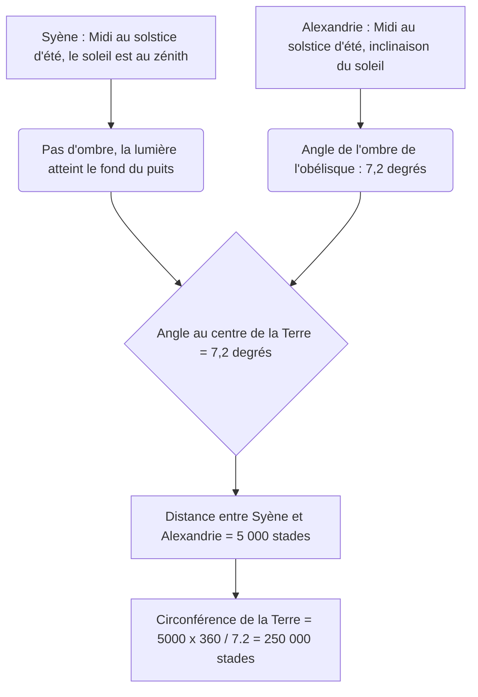
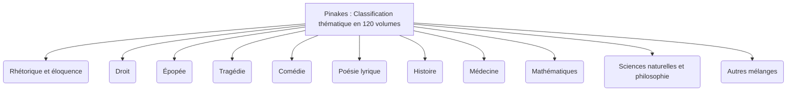
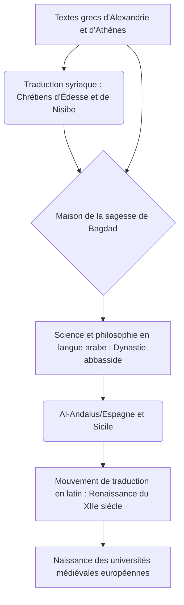

# Introduction : Les mémoires perdues de l'Antiquité et le temple du savoir

Dans l'histoire, au cours du processus par lequel l'humanité a accumulé, systématisé puis impitoyablement perdu ses connaissances, rien ne stimule autant l'imagination et n'évoque autant de romantisme et de tristesse que la « Grande Bibliothèque d'Alexandrie » (Great Library of Alexandria) en Égypte. Ce gigantesque temple du savoir, où fut rassemblée toute la sagesse du monde méditerranéen antique, n'était pas un simple dépôt de livres. C'était un institut de recherche académique de pointe, une cosmopolis où se croisaient différentes cultures et, surtout, la cristallisation de l'« impérialisme intellectuel ».

Dans cet article, en croisant de multiples perspectives académiques telles que l'histoire de la Méditerranée antique, la philologie classique, l'histoire du livre et la bibliothéconomie, nous retracerons l'histoire de la transmission du savoir, de la naissance et de la prospérité de la bibliothèque d'Alexandrie jusqu'à l'énigme de sa destruction, puis son transfert vers le Moyen Âge et l'époque moderne, avec des détails et une profondeur académique sans précédent.

---

## Chapitre 1 : L'ambition d'Alexandre le Grand et la naissance du monde hellénistique

### La construction d'Alexandrie et la réorganisation du monde méditerranéen

En 332 av. J.-C., le jeune conquérant macédonien Alexandre le Grand força l'Égypte à se rendre sans effusion de sang et ordonna la construction d'une nouvelle capitale portant son nom, « Alexandrie », sur le site du village de pêcheurs de Rhakotis, situé à l'extrémité ouest du delta du Nil et face à la mer Méditerranée. Conçue par l'architecte en chef du roi, Dinocrate, cette ville adopta le plan hippodamien (réseau de rues orthogonales) que l'on retrouve dans l'urbanisme grec. Son axe principal était une magnifique grande rue (la rue Canopique) s'étendant d'est en ouest, tirant le meilleur parti de la topographie étroite coincée entre la Méditerranée et le lac Maréotis.

Alexandrie ne devait pas seulement être la capitale de l'Égypte, mais aussi fonctionner comme le cœur de la culture de l'« Hellénisme (Hellenism) », fusionnant le monde gréco-macédonien (Hellas) et le monde oriental. Le roi lui-même partit pour son expédition orientale sans attendre l'achèvement de la ville et mourut à Babylone, mais sa volonté et son immense empire furent divisés par ses diadoques (successeurs). C'est Ptolémée Ier Sôter (le Sauveur), ami d'enfance et proche collaborateur du roi, qui prit le contrôle de l'Égypte.

### La politique culturelle de Ptolémée Ier et l'« impérialisme intellectuel »

Ptolémée Ier, fondateur de la dynastie ptolémaïque, comprenait profondément qu'une domination militaire ne suffisait pas pour gouverner un immense État multiethnique. Il décida de faire d'Alexandrie le nouveau centre culturel du monde, remplaçant ainsi Athènes. Le cœur de ce projet était l'idée extravagante de « rassembler tous les livres du monde en un seul endroit ».

Le pilier théorique de cette idée fut Démétrios de Phalère, un philosophe de l'école aristotélicienne (école péripatéticienne) exilé d'Athènes. Démétrios possédait à la fois l'expérience d'avoir dirigé les affaires de l'État en tant que tyran d'Athènes pendant 10 ans, et les connaissances concernant la constitution de la collection de la bibliothèque du Lycée (l'école) d'Aristote. Il conseilla à Ptolémée Ier qu'une véritable domination ne reposait pas sur la seule force militaire, mais que la condition d'un véritable empire universel était de collecter, traduire et étudier les archives, les lois, les pensées et les sciences de tous les peuples.

C'est ce que l'on devrait appeler l'« impérialisme intellectuel (Intellectual Imperialism) ». Autrefois, les rois de l'Empire perse achéménide ou de l'Assyrie (par exemple, la bibliothèque de Ninive du roi Assurbanipal) possédaient également des dépôts d'archives, mais celle de la dynastie ptolémaïque était d'une tout autre dimension en termes d'échelle et d'objectif. Ils ambitionnaient de collecter les documents dans toutes les langues du monde connu (grec, égyptien, hébreu, persan, etc.) et de les traduire et les intégrer en grec. La légende selon laquelle la « Septante (Septuaginta) », traduction grecque de l'Ancien Testament, aurait été créée à Alexandrie (Lettre d'Aristée) s'inscrit également dans le contexte de cette politique universelle de collecte du savoir.

---

## Chapitre 2 : La vue d'ensemble du Museion, l'institut de recherche royal

### Sa structure en tant que temple académique et les privilèges des savants

Ce que nous appelons aujourd'hui la « Bibliothèque d'Alexandrie » n'était pas un bâtiment indépendant, mais faisait partie ou constituait une annexe d'un immense complexe d'institutions royales académiques et de recherche appelé le « Museion (Museion) ». « Museion » signifie littéralement le « temple des Muses (les 9 déesses des arts) » et est l'origine du mot moderne « musée (museum) ».

Le géographe Strabon note que le Museion était adjacent au domaine du palais royal (le quartier de Broucheion) et comprenait une promenade (peripatos), une salle de discussion (exedra) et un grand réfectoire (syssition) où les savants prenaient leurs repas en commun. Le Museion peut être considéré comme le prototype des instituts d'études avancées ou des universités de cycles supérieurs d'aujourd'hui (comme l'Institute for Advanced Study de Princeton).

Les savants (chercheurs royaux) qui y étaient invités jouissaient de privilèges étonnants. Ils recevaient du palais royal une généreuse pension à vie, étaient exemptés de tous les impôts, et se voyaient offrir le logement et la nourriture gratuitement. Leurs seules obligations étaient la quête du savoir, l'écriture et, parfois, l'éducation des enfants de la famille royale. À son apogée, cette communauté académique en internat rassemblait plus de 100 des meilleurs savants du monde, qui se consacraient jour et nuit aux discussions et à la recherche.

### L'ultime critique textuelle et l'invention des signes critiques

L'un des travaux les plus importants du Museion fut l'établissement des textes de la littérature classique, comme ceux d'Homère. À l'époque, les rouleaux de papyrus copiés à la main étaient truffés d'erreurs de copistes, d'omissions ou d'ajouts arbitraires par les acteurs.

Les philologues successifs, tels que Zénodote d'Éphèse, premier directeur de la bibliothèque, Aristophane de Byzance et Aristarque de Samothrace, comparèrent plusieurs manuscrits différents et établirent la discipline de la « critique textuelle (Textual Criticism) », qui vise à restaurer le texte le plus proche de sa forme originale.

Ils inventèrent un système consistant à écrire des signes critiques spéciaux dans les marges du texte.
- **Obèle (Obelus, – ou ÷)** : indique une ligne soupçonnée d'être apocryphe ou un ajout ultérieur.
- **Astérisque (Asterisk, ※)** : indique une ligne répétée ou insérée par erreur, mais qui est importante et devrait se trouver ailleurs.
- **Diple (Diple, >)** : indique un passage important à annoter ou un passage grammaticalement intéressant.

L'ajout de métadonnées à l'aide de ces signes était une technologie de traitement de l'information révolutionnaire, que l'on pourrait considérer comme les prémices de la philosophie des langages de balisage modernes (XML ou HTML).

### L'âge d'or de la science : Ératosthène et Archimède

Le Museion ne réalisa pas seulement des prouesses dans les sciences humaines, mais aussi dans les sciences naturelles, laissant des réalisations gravées dans l'histoire de l'humanité.

**La mesure de la circonférence de la Terre par Ératosthène**
Le 3e directeur de la bibliothèque, Ératosthène de Cyrène, calcula la taille de la Terre grâce à une perspicacité géométrique étonnante. Il savait qu'à midi le jour du solstice d'été, dans la ville de Syène (l'actuelle Assouan) dans le sud de l'Égypte, la lumière du soleil atteignait le fond d'un puits profond (le soleil était au zénith). D'autre part, au même moment le même jour, à Alexandrie située plein nord, il mesura d'après l'angle de l'ombre de l'obélisque d'un cadran solaire que le soleil était incliné d'environ 7,2 degrés (un cinquantième d'un cercle complet de 360 degrés) par rapport au zénith.

Ératosthène, sur la base de la distance de 5 000 stades entre Alexandrie et Syène (déduite du nombre de jours de voyage des caravanes de chameaux), établit l'équation proportionnelle suivante.
`7,2 degrés : 360 degrés = 5 000 stades : Circonférence de la Terre`
Le résultat du calcul donna une circonférence terrestre de 250 000 stades. En supposant qu'un stade équivaut à environ 157,5 mètres (le stade égyptien), cela donne environ 39 375 kilomètres, soit une précision étonnante avec une marge d'erreur de moins de 2 % par rapport à la circonférence équatoriale réelle de la Terre (environ 40 075 kilomètres).

**Anatomie et géométrie**
Dans le domaine médical, Hérophile de Chalcédoine et Érasistrate de Céos, sous la protection du Museion, réalisèrent de manière systématique les premières dissections de corps humains (selon une théorie, des vivisections sur des condamnés à mort) de l'histoire de l'humanité. Hérophile prouva que le cerveau était le siège de l'intelligence, classa le système nerveux en nerfs moteurs et nerfs sensitifs, et souligna en outre la relation entre les pulsations sanguines et la fonction de pompe du cœur.

De plus, Archimède de Syracuse étudia à Alexandrie ou échangea avec les savants du Museion par correspondance. Il inventa la « vis d'Archimède » (une pompe à vis) qui fut également utilisée pour le contrôle des crues du Nil, et travailla sur le principe de la poussée d'Archimède, le calcul de la valeur de pi par la méthode d'exhaustion et la quadrature de la parabole. Euclide, qui systématisa la géométrie en écrivant les « Éléments », aurait également dit à Ptolémée Ier à Alexandrie : « Il n'y a pas de voie royale en géométrie ».

---

## Chapitre 3 : La frénésie de la collecte de livres et la révolution du catalogue

### Une collecte de livres sans scrupules : Confiscations au port et la tragédie d'Athènes

Pour enrichir la bibliothèque du Museion, les rois successifs de la dynastie ptolémaïque rassemblèrent des livres par des moyens autoritaires confinant parfois à la folie. La bibliothèque d'Alexandrie ne se contentait pas d'acheter des livres, mais augmentait de manière explosive sa collection grâce à un système mobilisant le pouvoir de l'État.

La méthode la plus célèbre est le système de censure et de réquisition forcée par confiscation connu sous le nom de « livres des navires (ek ploion) ». Tous les navires marchands ou de passagers entrant dans le port d'Alexandrie, qui était le centre du commerce méditerranéen, étaient soumis à des inspections rigoureuses par les douaniers égyptiens. Si des livres (rouleaux de papyrus) étaient trouvés dans la cargaison, ils étaient immédiatement confisqués, quel qu'en soit le propriétaire. Les livres confisqués étaient envoyés au scriptorium de la bibliothèque, où des copistes spécialisés travaillaient jour et nuit pour produire rapidement de belles copies. Et de façon surprenante, ce fut la « nouvelle copie » qui fut rendue au propriétaire d'origine, tandis que l'« original » fut conservé en permanence dans les collections de la bibliothèque. Une étiquette de provenance (provenance) indiquant « confisqué au navire... » était attachée à la copie.

Il y a aussi le célèbre épisode de fraude diplomatique à l'époque de Ptolémée III Évergète. Le roi exigea du gouvernement d'Athènes le prêt des « manuscrits originaux officiels reconnus par l'État » des trois grands poètes tragiques grecs (Eschyle, Sophocle et Euripide). Ces originaux étaient un héritage culturel sacré précieusement conservé dans les archives d'État d'Athènes. Les Athéniens exigèrent en guise de condition de prêt un dépôt de garantie colossal de 15 talents (qui équivaudrait aujourd'hui à des dizaines de millions d'euros), que Ptolémée III paya sans hésiter. Cependant, une fois les originaux arrivés à Alexandrie, le roi fit réaliser par ses meilleurs scribes de superbes copies sur le papyrus de la plus haute qualité et renvoya ces copies à Athènes. Le roi laissa les 15 talents de garantie être confisqués par Athènes (un achat ultra-coûteux de fait) et s'empara des précieux originaux pour en faire les trésors de sa bibliothèque. Il s'agissait là d'un cas de pillage de capital culturel par la superpuissance de l'époque hellénistique.

### Callimaque et les « Pinakes » : La naissance du premier catalogue classifié complet au monde

Grâce à ces méthodes de collecte impitoyables, la collection de la bibliothèque d'Alexandrie aurait atteint des centaines de milliers de rouleaux (certaines sources parlent de 500 000 à 700 000 rouleaux) dans le bâtiment principal (quartier du Broucheion) et plus de 40 000 dans l'annexe du Sérapéum. Face à une telle quantité d'informations, il n'était plus possible de retrouver un document spécifique en s'appuyant uniquement sur la mémoire humaine ou l'emplacement physique. Un « système de recherche (architecture de recherche d'informations) » devint indispensable pour transformer une simple montagne de rouleaux en une « base de données de connaissances ».

C'est Callimaque (vers 310 av. J.-C. - vers 240 av. J.-C.), poète originaire de Cyrène et savant de génie, qui réalisa la plus grande percée de l'histoire de la bibliothéconomie. Bien qu'il n'ait officiellement jamais été nommé directeur de la bibliothèque, il était le véritable responsable de la gestion de ses collections.

Callimaque créa un catalogue monumental de 120 volumes, couvrant l'ensemble de la collection de la bibliothèque, intitulé les « Pinakes (Pinakes : littéralement "tablettes", de son nom complet "Tableaux de ceux qui ont brillé dans toutes les branches du savoir et de leurs écrits") ». Il ne s'agissait pas d'une simple liste de possessions (inventaire), mais du premier « catalogue thématique (subject catalog) » systématique de l'histoire de l'humanité.

Le système de classification des « Pinakes » définissait les catégories suivantes comme classes principales (main class).

De plus, le génie de Callimaque réside dans le fait d'avoir ajouté de fines informations bibliographiques (métadonnées) sous ces grandes classifications. Dans chaque catégorie, les auteurs étaient classés par ordre alphabétique, et des données structurées telles que celles-ci étaient décrites :

- **Nom de l'auteur et biographie** : Le nom de l'auteur, son lieu de naissance, le nom de son père, le nom de son maître et une courte biographie (biography). Cela servait de contrôle d'autorité (Authority Control) pour distinguer les auteurs homonymes.
- **Titre de l'œuvre** : En l'absence de titre, un titre provisoire basé sur le contenu était attribué.
- **Incipit (premiers mots)** : Les premiers mots à la première ligne de chaque œuvre. Comme les titres étaient souvent perdus sur les anciens rouleaux de papyrus, cette méthode permettait d'identifier l'œuvre par son début (jouant le rôle d'une valeur de hachage).
- **Nombre de volumes et nombre total de lignes (stichométrie)** : Le nombre de volumes de l'œuvre complète et le nombre exact de lignes du texte. L'enregistrement du nombre de lignes servait de base pour calculer la rémunération à verser aux copistes (scriptor), tout en jouant le rôle d'une « somme de contrôle (vérification d'intégrité) » pour vérifier que le texte n'avait pas été altéré ultérieurement ou que des pages n'avaient pas été omises.

L'architecture de cette organisation de l'information par Callimaque peut être considérée comme l'ancêtre d'une technologie de traitement de l'information fondamentale et universelle, qui mène directement, via les catalogues des bibliothèques monastiques du Moyen Âge, à la classification décimale de Dewey (DDC) et aux OPAC (catalogues en ligne des bibliothèques) modernes, et même à la structure des bases de données relationnelles.

---

## Chapitre 4 : La matérialité et les techniques d'écriture du rouleau de papyrus (Volumen) : L'environnement médiatique antique et la bibliométrie

### Le don du Nil et l'infrastructure de l'écriture

Ce qui soutenait fondamentalement la prospérité de la bibliothèque d'Alexandrie d'un point de vue matériel était le support d'enregistrement appelé « papyrus (Papyrus) ». Fabriqué à partir d'une plante émergente de la famille des Cypéracées (Cyperus papyrus) qui poussait à l'état sauvage dans les marécages du delta du Nil, ce papier était le meilleur support d'enregistrement d'informations du monde méditerranéen antique, surpassant les tablettes d'argile et les peaux de bêtes. Comme Pline l'Ancien le détaille dans son « Histoire naturelle », le processus de fabrication du papyrus était un artisanat hautement spécialisé.

Tout d'abord, l'épiderme de l'épaisse tige de la plante (qui a une section triangulaire) était pelé, et la moelle interne (pith) était coupée verticalement en fines tranches avec une aiguille ou une lame fine. Ces fines bandes (philyra) en forme de ruban étaient placées côte à côte sans espace sur une planche de bois humidifiée, et sur celles-ci était placée une autre couche, cette fois à angle droit. En utilisant l'eau boueuse du Nil ou une colle spécialement préparée (ou le mucilage de la plante elle-même), l'ensemble était violemment frappé avec un maillet en bois pour le presser, puis séché au soleil pour produire une feuille mince, légère, flexible et durable (kollema). Le papyrus de la plus haute qualité était appelé « hieratica (pour les prêtres) » ou « augusta » du nom de l'empereur Auguste ; il était blanc, lisse et extrêmement cher.

Ces feuilles étaient collées l'une après l'autre avec de la pâte de farine de blé pour fabriquer de longs « rouleaux (Volumen, en grec biblion) ». Un rouleau typique, composé d'une vingtaine de feuilles collées (scapos), circulait sur le marché comme unité de vente standard.

Pour écrire, on utilisait un calame, la tige dure d'un roseau fendue à son extrémité. Contrairement au pinceau en jonc de l'Égypte ancienne, il était coupé de façon pointue pour tracer nettement l'alphabet grec. L'encre (atramentum) était principalement une encre au carbone fabriquée à partir de suie, de gomme arabique et d'eau. Cette encre n'adhérait qu'à la surface des fibres du papier et ne pénétrait pas à l'intérieur, de sorte qu'elle pouvait être facilement lavée à l'aide d'une éponge et le support réutilisé. Cependant, elle était également extrêmement stable chimiquement, de sorte que les papyrus découverts dans les régions arides des déserts conservent aujourd'hui encore des caractères d'un noir profond, même après des millénaires. L'encre rouge (vermillon fait d'oxyde de fer ou de sulfure de mercure) était utilisée pour les titres importants, les décorations ou les signes critiques et les aides à la lecture.

### Les limites des rouleaux et les contraintes bibliométriques : La géométrie du nombre de caractères et de lignes

Cependant, le format du rouleau de papyrus présentait des limites physiques en tant que technologie de l'information.
1. **Contraintes de longueur et de poids** : Si le rouleau était trop long, il devenait lourd et difficile à manipuler, et lors du déroulement (explicare), le papyrus se fatiguait et s'abîmait facilement. La limite pratique était d'environ 10 mètres de longueur, ce qui correspondait à un volume de l'« Iliade » d'Homère (environ 700 à 900 lignes). La célèbre phrase de Callimaque « Un grand livre est un grand mal (Mega biblion, mega kakon) » n'était pas seulement motivée par des raisons esthétiques (la préférence pour la concision raffinée typique de la littérature hellénistique), mais elle soulignait également, du point de vue d'un praticien, la lourdeur de la manipulation physique des rouleaux et leur vulnérabilité à la dégradation. Les longs livres d'histoire devaient inévitablement être divisés en plusieurs rouleaux (tomos) pour être conservés et gérés.
2. **Difficulté de l'accès aléatoire** : Le rouleau est un support à « accès séquentiel », que l'on lit en le faisant défiler dans l'ordre du début à la fin. Il était extrêmement difficile de passer instantanément à une page ou une ligne spécifique (par exemple, un paragraphe spécifique au milieu du septième volume), ce qu'on appelle l'« accès aléatoire ». Cela imposait une énorme charge cognitive et un coût en temps aux savants lorsqu'ils devaient ouvrir et comparer simultanément plusieurs documents (renvoi croisé, cross-reference).
3. **Les règles de mise en page du kollema** : Sur le rouleau, le texte était écrit sous forme de blocs continus de caractères (des paragraphes ou colonnes verticaux appelés kollemata). La largeur de chaque colonne était d'environ 5 à 8 centimètres, l'espacement entre les lignes était maintenu uniforme, et il n'y avait pas d'espaces entre les mots (séparation des mots) ; l'écriture continue (« scriptio continua ») était la norme. Cela exigeait des lecteurs de grandes compétences en matière de lecture à voix haute.
4. **Stockage et gestion (capsa et sillybos)** : Les rouleaux étaient enroulés autour d'un axe en bois (omphalos) et conservés debout dans des étuis cylindriques (capsa) ou empilés horizontalement sur des étagères. Afin d'identifier le contenu de l'extérieur, une petite étiquette en parchemin ou en papyrus appelée « sillybos (Sillybos) » était fixée à l'extrémité du rouleau, sur laquelle étaient écrits le nom de l'auteur et le titre. Elle jouait le rôle du dos des livres d'aujourd'hui, mais présentait l'inconvénient de se déchirer facilement à force d'être manipulée.

### Le passage au codex (livre broché) et le coût de la transition médiatique

Entre le IIe et le IVe siècle après J.-C., avec l'expansion explosive du christianisme, un changement de paradigme (l'une des plus grandes révolutions médiatiques de l'histoire de l'humanité) a eu lieu, passant du rouleau de papyrus au « codex (Codex : livre sous forme de cahier) ». Le codex, fait de parchemin ou de papyrus plié en deux, rassemblé et cousu au dos avec du fil, permettait d'écrire sans perte sur les deux faces (recto et verso), ce qui augmentait la densité d'information (réduction du volume physique). Par-dessus tout, il offrait l'avantage écrasant de pouvoir ouvrir instantanément une page spécifique (réalisation de l'accès aléatoire et utilisation du marque-page).

À la fin de la bibliothèque d'Alexandrie, lors de cette période de transition médiatique, on dut faire face au coût énorme du travail consistant à réécrire la vaste collection de rouleaux dans le nouveau format du codex (migration de format). Les documents qui ont été exclus de ce processus de réécriture, c'est-à-dire les « rouleaux non codifiés », sont rapidement devenus obsolètes, ont cessé d'être lus et ont été condamnés à se perdre à jamais à cause de l'humidité et des dommages causés par les insectes. La sélection et l'élimination des collections dans la bibliothèque ont fini par déterminer le taux de survie des textes dans l'histoire.

---

## Chapitre 5 : Le mythe de la destruction et la vérité : Qu'est-ce qui a détruit la bibliothèque ?

La question de savoir « quand et par qui la bibliothèque d'Alexandrie a été détruite » est l'un des plus grands mystères de l'histoire, et est souvent racontée comme un « mythe » selon lequel elle aurait été réduite en cendres en un instant lors d'un grand incendie dramatique. Cependant, l'histoire et l'archéologie modernes montrent que la disparition de la bibliothèque ne résulte pas d'un seul incident, mais est le résultat de plusieurs processus de destruction et de déclin qui se sont étalés sur plusieurs siècles.

### 1. 48 av. J.-C. : Jules César et la guerre d'Alexandrie

La légende de destruction la plus célèbre est attribuée au général romain Jules César. À la poursuite de Pompée, César débarqua en Égypte, prit parti pour Cléopâtre VII et combattit dans la guerre d'Alexandrie. Pour empêcher la flotte de la dynastie ptolémaïque de s'emparer de sa propre flotte, César mit le feu aux navires dans le port. Des historiens ultérieurs comme Plutarque rapportent que cet incendie s'étendit du port à la terre ferme et consuma la Grande Bibliothèque (ou des centaines de milliers de volumes entreposés dans les entrepôts du port).
Cependant, dans les « Commentaires sur la guerre civile » de César lui-même, il n'y a aucune mention de l'incendie de la bibliothèque. De plus, quelques décennies plus tard, lorsque Strabon visita Alexandrie, les installations du Museion étaient toujours opérationnelles. Par conséquent, il est fort probable que ce qui a été perdu dans l'incendie de César n'était qu'une « annexe » de la bibliothèque ou une partie des livres stockés dans les entrepôts du port pour l'exportation.

### 2. Les années 270 apr. J.-C. : La destruction totale de la ville par l'empereur Aurélien

Ce qui est considéré comme ayant porté le coup fatal au corps principal de la bibliothèque est la guerre civile de l'Empire romain à la fin du IIIe siècle apr. J.-C. Zénobie du royaume de Palmyre occupa Alexandrie, et par la suite, de violents combats de rue eurent lieu lorsque l'empereur romain Aurélien reprit la ville.
Lors de ces batailles, le quartier du palais royal (le Broucheion) fut complètement détruit et dévasté. L'opinion la plus répandue dans l'historiographie moderne est que le Museion et la Grande Bibliothèque ont également été complètement détruits avec les bâtiments à ce moment-là, et que les collections ont été dispersées et réduites en cendres.

### 3. 391 apr. J.-C. : L'empereur Théodose et la destruction du Sérapéum par les chrétiens

Même après la disparition de la Grande Bibliothèque, une annexe (bibliothèque sœur) de la bibliothèque existait dans le grand temple du dieu Sarapis, le « Sérapéum (Serapeum) », situé au sud-ouest d'Alexandrie, préservant ainsi la vie intellectuelle.
Cependant, l'empereur romain Théodose Ier fit du christianisme la religion d'État et publia un édit ordonnant la destruction des temples païens. En réponse à cela, l'évêque chrétien radical d'Alexandrie, Théophile, et une foule de moines fanatiques attaquèrent le Sérapéum et détruisirent complètement le magnifique temple. À cette époque, on suppose que les rouleaux de papyrus conservés dans le temple ont également été brûlés en tant que livres païens maléfiques. Cet événement, ainsi que le meurtre brutal de la mathématicienne Hypatie qui survint quelques années plus tard (en 415), est transmis comme une tragédie symbolisant la fin de la libre recherche intellectuelle dans l'Antiquité.

### 4. 642 apr. J.-C. : La conquête islamique et la légende du calife Omar

Le mythe le plus sensationnel créé par les chroniqueurs chrétiens et arabes du XIIIe siècle est la légende de la destruction par les armées islamiques. Lorsque le général arabe Amr ibn al-As a conquis Alexandrie, il a interrogé le calife Omar ibn al-Khattâb sur le sort à réserver aux livres de la bibliothèque. Omar aurait répondu ceci :
« Si ces livres sont en accord avec le Coran, ils sont inutiles car nous avons le Coran. S'ils sont contraires au Coran, ils sont nuisibles. Par conséquent, brûle-les tous. »
La collection aurait alors été distribuée pour servir de combustible aux chaudières des 4 000 bains publics d'Alexandrie, brûlant pendant six mois.
Cependant, les chercheurs modernes ont conclu que cet épisode est une pure fiction (une invention ultérieure). En effet, au moment de la conquête islamique au VIIe siècle, à cause de siècles de guerres, de l'épuisement des budgets et de la dégradation naturelle du papyrus (dans un climat côtier humide, le papyrus pourrit en quelques siècles), l'ancienne Grande Bibliothèque avait déjà disparu sans laisser de trace.

---

## Chapitre 6 : Le refuge du savoir et le grand voyage vers le Moyen Âge et la Renaissance : La survie de la mémoire humaine

Les bâtiments physiques et les papyrus d'Alexandrie ont été réduits en cendres et sont retournés à la terre. Cependant, l'ADN de la « sagesse antique » qui y a été cultivée ne s'est pas complètement éteint. Grâce à un étonnant relais intellectuel s'étendant sur plusieurs siècles, une partie de celle-ci a accompli un long voyage via la Syrie, la Perse, la péninsule arabique, l'Afrique du Nord et la péninsule ibérique, pour finalement parvenir jusqu'à nous aujourd'hui.

### Du syriaque à l'arabe : La Maison de la sagesse de Bagdad et le grand mouvement de traduction

Aux Ve et VIe siècles, les savants nestoriens et monophysites fuyant la répression des hérésies par l'orthodoxie chrétienne (chalcédoniens) dans l'Empire byzantin trouvèrent refuge en Syrie, à l'est, et dans la Perse sassanide. En particulier, Édesse (aujourd'hui Urfa), Nisibe, et l'école de médecine de Gondichapour en Perse devinrent de nouveaux centres pour la préservation du savoir grec. Ils traduisirent d'abord des textes grecs difficiles, tels que la logique d'Aristote (l'« Organon »), la médecine de Galien et d'Hippocrate, et l'astronomie de Ptolémée (l'« Almageste »), en syriaque (un dialecte de l'araméen). Ce fut le premier pont du savoir grec au Moyen-Orient.

Plus tard, au VIIIe siècle, avec l'essor de la dynastie abbasside de l'Empire islamique, les califes Al-Mansur et Al-Mamun fondèrent dans la nouvelle capitale de Bagdad un immense institut de traduction et de recherche appelé « Bayt al-Hikma (La Maison de la sagesse) ». Il s'agissait d'un projet d'État que l'on pourrait véritablement qualifier de « second Museion ».

Là, des traducteurs de génie comme Hunayn ibn Ishaq (un Arabe chrétien nestorien) lancèrent un mouvement de traduction massif sans précédent (le mouvement de traduction gréco-arabe), du syriaque à l'arabe, ou directement du grec à l'arabe. Hunayn ne se contenta pas d'une traduction littérale, mais appliqua des révisions textuelles (la méthode philologique d'Alexandrie consistant à comparer plusieurs manuscrits pour déterminer le sens exact) et créa de nouveaux termes techniques philosophiques et scientifiques en arabe (par exemple, des concepts abstraits comme « qualité », « quantité », « essence »).

Le savoir d'Alexandrie a fleuri dans la nouvelle plaine fertile du monde islamique, où il a connu sa propre évolution. De grands savants islamiques tels qu'Al-Khwârizmî (le père de l'algèbre), Al-Kindi (le fondateur de la philosophie arabe), Ibn Sina (connu sous le nom latin d'Avicenne, auteur du Canon de la médecine) et Ibn Rushd (connu sous le nom latin d'Averroès, l'ultime commentateur d'Aristote) n'ont pas seulement assimilé les connaissances grecques, mais les ont également dépassées de manière critique, bâtissant le plus haut niveau scientifique et technologique du monde.

*(※ Ce qui précède est un diagramme généalogique du mouvement de traduction gréco-arabo-latin)*

### La conservation des manuscrits dans l'Empire byzantin et le retour à la Renaissance italienne

D'autre part, il y a aussi une généalogie du savoir qui est restée dans la sphère de langue grecque. Dans la capitale de l'Empire romain d'Orient (Empire byzantin), Constantinople, et dans les monastères du mont Athos, les textes classiques grecs ont été inlassablement copiés sur des codex en parchemin et préservés par les moines. Au IXe siècle, un renouveau classique connu sous le nom de « Renaissance macédonienne » a eu lieu, et des œuvres telles que la « Bibliothèque » du patriarche Photios et la « Souda » (une immense encyclopédie grecque) ont été compilées, résumant et préservant les connaissances antiques.

Au cours de la « Renaissance du XIIe siècle », les connaissances traduites de l'arabe en latin depuis le monde islamique (Tolède en Espagne et la Sicile dans le sud de l'Italie) ont afflué en Europe occidentale, favorisant la naissance des universités européennes (Universitas) à Paris et à Bologne.

De plus, lors de la chute de Constantinople aux mains de l'Empire ottoman en 1453, de nombreux savants byzantins, tels que Georges Gémiste Pléthon, ont fui vers la péninsule italienne en emportant avec eux de précieux manuscrits grecs (comme les œuvres complètes de Platon). Cela a déclenché une redécouverte directe des classiques grecs à Florence, gouvernée par la famille Médicis, et à Venise, où l'imprimerie à caractères mobiles se développait, devenant le moteur puissant de la Renaissance italienne fondée sur l'humanisme (Humanism).

### Questions posées à l'Alexandrie numérique moderne et défis éternels

Aujourd'hui, en 2002, grâce à la coopération du gouvernement égyptien et de l'UNESCO, une gigantesque nouvelle bibliothèque en forme de disque, la « Bibliotheca Alexandrina (Nouvelle Bibliothèque d'Alexandrie) », a été construite près du site de l'ancienne bibliothèque, marquant une résurrection symbolique.

De plus, il existe dans le cyberespace d'Internet une version moderne du « rêve d'Alexandrie », comme « Internet Archive », qui tente de numériser et de conserver toutes les pages web, les livres et les vidéos du monde. Le projet Google Books peut également être considéré comme l'expression moderne de l'impérialisme intellectuel de la dynastie ptolémaïque.

Cependant, nous devons tirer de lourdes leçons du destin de la bibliothèque antique. Même si le support d'enregistrement est passé du papyrus à la puce de silicium et au stockage dans le cloud, et que la quantité totale de données a explosé pour atteindre l'échelle de l'exaoctet, les risques fondamentaux menaçant la préservation et la transmission des connaissances restent les mêmes. Il s'agit des guerres et du terrorisme, de la censure par des idéologies politiques dictatoriales, de l'épuisement des financements des projets, et surtout du problème de l'« obsolescence des formats (la crise d'un âge sombre numérique) ». À notre époque où les logiciels et le matériel deviennent obsolètes en quelques années, personne ne peut dire avec certitude qui pourra lire les données numériques actuelles dans 500 ou 1 000 ans, ni comment.

L'histoire de la grandeur et de la décadence de la bibliothèque d'Alexandrie nous rappelle profondément, à travers les millénaires, à quel point l'effort de l'humanité pour rassembler, protéger et transmettre la connaissance est fragile, tout en nécessitant simultanément une volonté tenace et un effort continu (une copie incessante de manuscrit en manuscrit).

---
