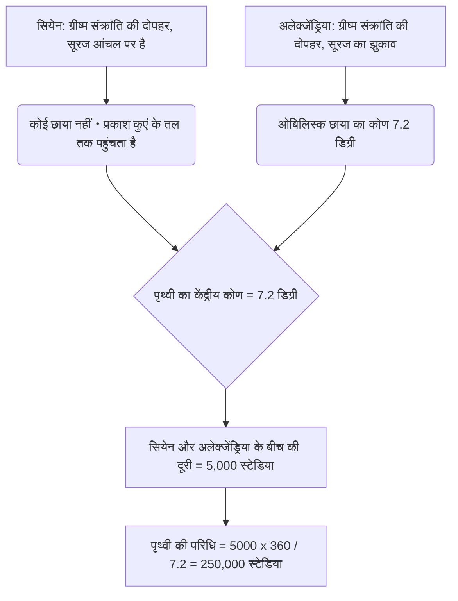
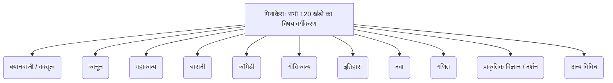
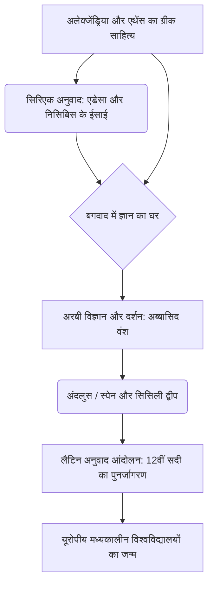

# परिचय: खोई हुई प्राचीन यादें और ज्ञान का मंदिर

पूरे इतिहास में, जैसे-जैसे मानवता ने ज्ञान संचय किया है, उसे व्यवस्थित किया है, और फिर निर्दयतापूर्वक उसे खो दिया है, मिस्र के "अलेक्जेंड्रिया के महान पुस्तकालय (Great Library of Alexandria)" जैसी कोई अन्य संस्था नहीं है जो लोगों की कल्पना को प्रेरित करती हो और रोमांस तथा दुख की भावना पैदा करती हो। यह ज्ञान का विशाल मंदिर, जहां प्राचीन भूमध्यसागरीय दुनिया का सारा ज्ञान एकत्र किया गया था, किताबों का केवल एक भंडार नहीं था। यह एक अत्याधुनिक शोध संस्थान था, एक महानगरीय केंद्र (Cosmopolis) जहां विभिन्न संस्कृतियां मिलती थीं, और सबसे बढ़कर, "बौद्धिक साम्राज्यवाद" का प्रतीक था।

इस लेख में, हम अलेक्जेंड्रिया के पुस्तकालय के जन्म और समृद्धि से लेकर इसके विनाश के रहस्य और मध्य युग तथा आधुनिक काल तक ज्ञान के संचरण के इतिहास का अभूतपूर्व विस्तार और अकादमिक गहराई के साथ वर्णन करेंगे, जिसमें प्राचीन भूमध्यसागरीय इतिहास, शास्त्रीय भाषाशास्त्र, पुस्तक इतिहास और पुस्तकालय सूचना विज्ञान के विभिन्न अकादमिक दृष्टिकोण शामिल हैं।

---

## अध्याय 1: सिकंदर महान की महत्वाकांक्षा और हेलेनिस्टिक दुनिया का जन्म

### अलेक्जेंड्रिया का निर्माण और भूमध्यसागरीय दुनिया का पुनर्गठन

332 ईसा पूर्व में, मैसेडोनिया के युवा विजेता, सिकंदर महान (Alexander the Great) ने बिना रक्तपात के मिस्र को आत्मसमर्पण करने के लिए मजबूर किया और नील नदी डेल्टा के पश्चिमी किनारे पर भूमध्य सागर के सामने एक मछली पकड़ने वाले गाँव राकोटिस में अपने नाम पर एक नई राजधानी "अलेक्जेंड्रिया" के निर्माण का आदेश दिया। राजा के मुख्य वास्तुकार डाइनोक्रेटेस (Dinocrates) द्वारा डिजाइन किए गए इस शहर ने ग्रीक शहरी नियोजन (ग्रिड पैटर्न) की हिप्पोडामियन प्रणाली (Hippodamian grid) को अपनाया, और भूमध्य सागर और मारेओटिस झील के बीच संकीर्ण इलाके का अधिकतम लाभ उठाया, जिसमें एक शानदार पूर्व-पश्चिम मार्ग (कैनोपिक स्ट्रीट) मुख्य अक्ष के रूप में था।

अलेक्जेंड्रिया से केवल मिस्र की राजधानी होने के बजाय "हेलेनिज्म (Hellenism)" संस्कृति के दिल के रूप में कार्य करने की उम्मीद थी जो ग्रीको-मैसेडोनियन दुनिया (हेलास) और ओरिएंट दुनिया को मिलाती है। राजा स्वयं शहर के पूरा होने की प्रतीक्षा किए बिना पूर्वी अभियान पर निकल पड़े और बेबीलोन में उनकी मृत्यु हो गई, लेकिन उनकी इच्छा और उनके विशाल साम्राज्य को डायडोची (उत्तराधिकारियों) द्वारा विभाजित कर दिया गया। जिसने मिस्र पर अधिकार कर लिया, वह राजा के बचपन के दोस्त और करीबी सहयोगी टॉलेमी प्रथम सोटर (उद्धारकर्ता) थे।

### टॉलेमी प्रथम की सांस्कृतिक नीति और "बौद्धिक साम्राज्यवाद"

टॉलेमी राजवंश के संस्थापक टॉलेमी प्रथम इस बात को गहराई से समझते थे कि केवल सैन्य नियंत्रण से विशाल बहुजातीय राज्य पर शासन नहीं किया जा सकता है। उन्होंने अलेक्जेंड्रिया में एथेंस की जगह दुनिया का एक नया सांस्कृतिक केंद्र बनाने का फैसला किया। इसके मूल में "दुनिया की सभी किताबों को एक स्थान पर इकट्ठा करने" की एक असाधारण अवधारणा थी।

इस अवधारणा का सैद्धांतिक आधार एरिस्टोटेलियन स्कूल (पेरिपेटेटिक स्कूल) के एक दार्शनिक डेमेट्रियस ऑफ फलेरम (Demetrius of Phalerum) थे, जिन्हें एथेंस से निर्वासित कर दिया गया था। डेमेट्रियस के पास 10 वर्षों तक एथेंस के तानाशाह के रूप में राष्ट्रीय राजनीति के प्रबंधन का अनुभव और अरस्तू के लाइसियम (Lyceum) में पुस्तक संग्रह के निर्माण का ज्ञान दोनों था। उन्होंने टॉलेमी प्रथम को सलाह दी कि एक सच्चे सार्वभौमिक साम्राज्य की शर्त केवल सैन्य बल द्वारा शासन करना नहीं है, बल्कि सभी लोगों के रिकॉर्ड, कानूनों, विचारों और विज्ञान को इकट्ठा करना, अनुवाद करना और उनका अध्ययन करना है।

इसे "बौद्धिक साम्राज्यवाद (Intellectual Imperialism)" कहा जाना चाहिए। एक समय में, अचमेनिद फ़ारसी और असीरियन राजाओं (जैसे राजा अशर्बनिपाल के नीनवे पुस्तकालय) के पास भी अभिलेखागार थे, लेकिन टॉलेमी राजवंश का पुस्तकालय पैमाने और उद्देश्य में पूरी तरह से अलग आयाम का था। उनका लक्ष्य ज्ञात दुनिया की सभी भाषाओं (ग्रीक, मिस्री, हिब्रू, फारसी, आदि) में साहित्य एकत्र करना और उसका ग्रीक में अनुवाद तथा एकीकरण करना था। यह किंवदंती कि पुराने नियम का ग्रीक अनुवाद, "सेप्टुआजेंट (Septuagint)", अलेक्जेंड्रिया (अरिस्टियास का पत्र) में बनाया गया था, इसी सार्वभौमिक ज्ञान संग्रह नीति के संदर्भ में रखी गई है।

---

## अध्याय 2: रॉयल रिसर्च इंस्टीट्यूट माउसियन (Museion) की पूरी तस्वीर

### एक शैक्षणिक मंदिर और विद्वानों के विशेषाधिकार के रूप में संरचना

जिसे हम आज "अलेक्जेंड्रिया का पुस्तकालय" कहते हैं, वह एक स्वतंत्र इमारत नहीं थी, बल्कि "माउसियन (Museion)" नामक एक विशाल शाही अकादमिक और अनुसंधान संस्थान परिसर का हिस्सा या उससे जुड़ी एक सुविधा थी। "माउसियन" का शाब्दिक अर्थ है "म्यूज का मंदिर" (साहित्य और कला की अध्यक्षता करने वाली 9 देवियां), और यह आधुनिक शब्द "म्यूजियम (संग्रहालय)" का मूल है।

भूगोलवेत्ता स्ट्रैबो (Strabo) का रिकॉर्ड है कि माउसियन शाही महल के मैदान (ब्रूचेन जिला) के निकट था और इसमें चलने के रास्ते (पेरीपेटोस), चर्चा कक्ष (एक्सेड्रा) और विद्वानों के एक साथ भोजन करने के लिए एक बड़ा डाइनिंग हॉल (सिसिटियन) था। माउसियन को आधुनिक उन्नत अनुसंधान संस्थानों और स्नातक विश्वविद्यालयों (जैसे प्रिंसटन इंस्टीट्यूट फॉर एडवांस्ड स्टडी) का प्रोटोटाइप कहा जा सकता है।

यहां आमंत्रित किए गए विद्वानों (शाही शोधकर्ताओं) को अविश्वसनीय विशेषाधिकार दिए गए थे। उन्हें शाही परिवार से एक बड़ी आजीवन पेंशन मिलती थी, सभी करों से छूट दी गई थी, और मुफ्त आवास और भोजन प्रदान किया गया था। उनका एकमात्र कर्तव्य ज्ञान का पीछा करना, लिखना और कभी-कभी शाही बच्चों को शिक्षित करना था। अपने चरम पर, इस आवासीय शैक्षणिक समुदाय ने 100 से अधिक विश्व स्तरीय विद्वानों को आकर्षित किया जिन्होंने दिन-रात खुद को चर्चा और शोध में डुबोए रखा।

### अंतिम पाठ्य आलोचना और महत्वपूर्ण प्रतीकों का आविष्कार

माउसियन की सबसे महत्वपूर्ण परियोजनाओं में से एक होमर जैसे शास्त्रीय साहित्य के ग्रंथों का निर्धारण था। उस समय हाथ से लिखे पेपिरस स्क्रॉल में अक्सर गलतियां, चूक, या अभिनेताओं द्वारा अनधिकृत परिवर्धन होते थे।

एफेसस के ज़ेनोडोटस (Zenodotus of Ephesus), बीजान्टियम के एरिस्टोफेनेस (Aristophanes of Byzantium), और समोथ्रेस के अरिस्टार्कस (Aristarchus of Samothrace) जैसे लगातार भाषाशास्त्रियों (प्रथम पुस्तकालयाध्यक्षों) ने कई अलग-अलग पांडुलिपियों की तुलना और जांच की, जिससे "पाठ्य आलोचना (Textual Criticism)" के अनुशासन की स्थापना हुई, जो पाठ को उसके मूल रूप के सबसे करीब पुनर्स्थापित करता है।

उन्होंने पाठ के हाशिये में विशेष महत्वपूर्ण प्रतीक लिखने की एक प्रणाली का आविष्कार किया।
- **ओबेलस (Obelus, – या ÷)**: उन पंक्तियों को इंगित करता है जो जालसाजी या बाद के परिवर्धन होने का संदेह है।
- **तारांकन (Asterisk, ※)**: महत्वपूर्ण पंक्तियों को इंगित करता है जिन्हें दोहराया गया है या गलती से डाला गया है, लेकिन मूल रूप से कहीं और होना चाहिए।
- **डिप्ले (Diple, >)**: एनोटेट किए जाने वाले महत्वपूर्ण अंशों या व्याकरणिक रूप से दिलचस्प अंशों को इंगित करता है।

इन प्रतीकों के साथ मेटाडेटा का असाइनमेंट एक ग्राउंडब्रेकिंग सूचना प्रसंस्करण तकनीक थी जिसे आधुनिक मार्कअप भाषाओं (XML और HTML) की अवधारणाओं की शुरुआत कहा जा सकता है।

### विज्ञान का स्वर्ण युग: एराटोस्थनीज और आर्किमिडीज

माउसियन ने न केवल मानविकी में, बल्कि प्राकृतिक विज्ञान में भी मानव इतिहास में महत्वपूर्ण उपलब्धियां हासिल कीं।

**एराटोस्थनीज का पृथ्वी की परिधि का मापन**
तीसरे लाइब्रेरियन, साइरेन के एराटोस्थनीज (Eratosthenes of Cyrene) ने उल्लेखनीय ज्यामितीय अंतर्दृष्टि के साथ पृथ्वी के आकार की गणना की। उन्होंने सीखा कि ग्रीष्म संक्रांति पर दोपहर में, दक्षिणी मिस्र के एक शहर सियेन (Syene, आधुनिक असवान) में, सूरज की रोशनी एक गहरे कुएं (सूरज सीधे ऊपर होता है) के तल तक पहुंचती है। दूसरी ओर, उसी दिन एक ही समय में, सीधे उत्तर में स्थित अलेक्जेंड्रिया में, उन्होंने एक धूपघड़ी (obelisk) की छाया के कोण से मापा कि सूरज आंचल (zenith) से लगभग 7.2 डिग्री (360 डिग्री की पूर्ण परिधि का 1/50 वां) झुका हुआ था।

एराटोस्थनीज ने इस आधार पर निम्नलिखित आनुपातिक समीकरण स्थापित किया कि अलेक्जेंड्रिया और सियेन के बीच की दूरी 5,000 स्टेडिया (ऊंट कारवां की यात्रा के दिनों से अनुमानित) थी।
`7.2 डिग्री : 360 डिग्री = 5,000 स्टेडिया : पृथ्वी की परिधि`
गणना के परिणामस्वरूप, पृथ्वी की परिधि की गणना 250,000 स्टेडिया के रूप में की गई थी। यह मानते हुए कि 1 स्टेडियन लगभग 157.5 मीटर (मिस्र का स्टेडियन) है, यह लगभग 39,375 किलोमीटर है, जो वास्तविक पृथ्वी की भूमध्यरेखीय परिधि (लगभग 40,075 किलोमीटर) की तुलना में 2% से कम त्रुटि के साथ आश्चर्यजनक रूप से सटीक था।

**एनाटॉमी और ज्योमेट्री**
चिकित्सा के क्षेत्र में, चाल्सीडॉन के हेरोफिलस (Herophilus) और सेओस के एरासिस्ट्रेटस (Erasistratus) ने माउसियन के संरक्षण में मानव इतिहास में पहली व्यवस्थित मानव रचना (कहा जाता है कि निंदनीय कैदियों का विच्छेदन) का प्रदर्शन किया। हेरोफिलस ने साबित किया कि मस्तिष्क बुद्धि की सीट है, तंत्रिका तंत्र को मोटर और संवेदी नसों में वर्गीकृत किया गया है, और रक्त नाड़ी और हृदय के पंपिंग फ़ंक्शन के बीच संबंध का भी उल्लेख किया।

इसके अलावा, सिरैक्यूज़ के आर्किमिडीज (Archimedes of Syracuse) ने अलेक्जेंड्रिया में अध्ययन किया, या पत्राचार के माध्यम से माउसियन के विद्वानों के साथ बातचीत की। उन्होंने "आर्किमिडीज स्क्रू" का आविष्कार किया, जिसका उपयोग नील नदी में बाढ़ नियंत्रण के लिए भी किया जाता था, और उन्होंने उछाल (buoyancy) के सिद्धांत, थकावट की विधि द्वारा पाई (Pi) की गणना और एक पैराबोला के चतुर्भुज की खोज की। "तत्वों (Elements)" को लिखकर ज्यामिति को व्यवस्थित करने वाले यूक्लिड (Euclid) के बारे में भी कहा जाता है कि उन्होंने अलेक्जेंड्रिया में टॉलेमी प्रथम से कहा था, "ज्यामिति के लिए कोई शाही सड़क नहीं है।"

---

## अध्याय 3: पुस्तक संग्रह का पागलपन और सूचीकरण क्रांति

### किसी भी साधन द्वारा पुस्तक संग्रह: बंदरगाह जब्ती और एथेंस की त्रासदी

माउसियन लाइब्रेरी को समृद्ध करने के लिए, टॉलेमी राजवंश के क्रमिक राजाओं ने किताबों को इकट्ठा करने के लिए आक्रामक और कभी-कभी पागलपन भरे तरीकों का इस्तेमाल किया। अलेक्जेंड्रिया के पुस्तकालय ने केवल किताबें नहीं खरीदीं, बल्कि एक ऐसी प्रणाली के माध्यम से अपने संग्रह का विस्फोट किया जिसने राज्य की शक्ति का उपयोग किया।

सबसे प्रसिद्ध विधि सेंसरशिप और जब्ती की अनिवार्य प्रणाली थी जिसे "जहाजों की किताबें (ek ploion)" कहा जाता था। सभी मालवाहक जहाजों और यात्री जहाजों को अलेक्जेंड्रिया के बंदरगाह में प्रवेश करने वाले, जो भूमध्यसागरीय व्यापार का केंद्र था, मिस्र के सीमा शुल्क अधिकारियों द्वारा सख्त निरीक्षण के अधीन किया गया था। यदि कार्गो में कोई पुस्तक (पेपिरस स्क्रॉल) पाई जाती थी, तो उसे तुरंत जब्त कर लिया जाता था, भले ही वह किसी की भी हो। जब्त की गई किताबों को पुस्तकालय के स्क्रिप्टोरियम (लेखन कक्ष) में भेजा गया, जहां पेशेवर शास्त्रियों ने दिन-रात जल्दी और विस्तृत पांडुलिपियां बनाईं। और आश्चर्यजनक रूप से, मूल मालिक को "नई बनाई गई पांडुलिपि" लौटा दी गई, और "मूल" को पुस्तकालय के संग्रह में स्थायी रूप से रख लिया गया। पांडुलिपि को एक उद्गम (provenance) टैग के साथ चिह्नित किया गया था: "~ जहाज से जब्त"।

इसके अलावा, टॉलेमी तृतीय यूरेगेट्स के समय की एक प्रसिद्ध कूटनीतिक धोखाधड़ी की घटना भी है। राजा ने मांग की कि एथेंस सरकार तीन प्रमुख ग्रीक दुखद कवियों (एशिलस, सोफोक्लेस, यूरिपिड्स) के "राज्य-अधिकृत आधिकारिक मूल" उधार दे। ये मूल प्रतियां एथेंस के राष्ट्रीय अभिलेखागार में कड़ाई से संरक्षित एक पवित्र सांस्कृतिक विरासत थीं। एथेंस ने 15 टैलेंट (जिसे वर्तमान मूल्य में अरबों येन के बराबर कहा जाता है) की विशाल नकद जमा राशि को ऋण की शर्त के रूप में मांगा, जिसे टॉलेमी तृतीय ने आसानी से चुका दिया। हालांकि, जब मूल अलेक्जेंड्रिया पहुंचे, तो राजा ने बेहतरीन शास्त्रियों से बेहतरीन पेपिरस का उपयोग करके विस्तृत पांडुलिपियां बनवाईं और पांडुलिपियों को वापस एथेंस भेज दिया। राजा ने 15-टैलेंट जमा को एथेंस द्वारा जब्त किए जाने की अनुमति दी (प्रभावी रूप से एक अत्यंत महंगी खरीद) और कीमती मूल प्रतियों को पुस्तकालय के खजाने के रूप में लूट लिया। यह हेलेनिस्टिक युग की महाशक्ति द्वारा सांस्कृतिक पूंजी की डकैती की घटना थी।

### कैलिमाचस और "पिनाकेस (Pinakes)": दुनिया की पहली व्यापक पुस्तक वर्गीकरण सूची का जन्म

संग्रह के ऐसे क्रूर तरीकों के परिणामस्वरूप, अलेक्जेंड्रिया के पुस्तकालय का संग्रह मुख्य भवन (ब्रूचेन जिला) में सैकड़ों हजारों स्क्रॉल (कुछ सिद्धांत 500,000 से 700,000 कहते हैं) और सेरापियम शाखा में 40,000 से अधिक स्क्रॉल तक पहुंच गया। सूचना की इतनी बड़ी मात्रा के साथ, केवल मानव स्मृति और भौतिक व्यवस्था के माध्यम से वांछित साहित्य को खोजना अब संभव नहीं था। स्क्रॉल के ढेर को "ज्ञान डेटाबेस" में बदलने के लिए एक "खोज प्रणाली (सूचना पुनर्प्राप्ति वास्तुकला)" आवश्यक हो गई।

पुस्तकालय और सूचना विज्ञान में यह सबसे बड़ी ऐतिहासिक सफलता साइरेन के एक कवि और प्रतिभाशाली विद्वान, कैलिमाचस (Callimachus, 310 ईसा पूर्व - 240 ईसा पूर्व) द्वारा हासिल की गई थी। हालांकि यह कहा जाता है कि उन्होंने आधिकारिक तौर पर लाइब्रेरियन का पद नहीं संभाला था, लेकिन वे पुस्तकालय के संग्रह प्रबंधन के वास्तविक प्रभारी थे।

कैलिमाचस ने "पिनाकेस (Pinakes: जिसका शाब्दिक अर्थ है 'गोलियां', आधिकारिक नाम 'ज्ञान की हर शाखा में चमकने वालों और उनके द्वारा लिखी गई चीजों की तालिकाएं' है)" नामक एक विशाल 120-खंड सूची बनाई, जिसमें पुस्तकालय के पूरे संग्रह को शामिल किया गया। यह सिर्फ एक होल्डिंग सूची (इन्वेंट्री) नहीं थी, बल्कि मानव जाति की पहली व्यवस्थित "विषय वर्गीकरण सूची (सब्जेक्ट कैटलॉग)" थी।

"पिनाकेस" की वर्गीकरण प्रणाली ने प्रमुख वर्गीकरण (मुख्य वर्गों) के रूप में निम्नलिखित श्रेणियां निर्धारित कीं:

इसके अलावा, कैलिमाचस की प्रतिभा इस प्रमुख वर्गीकरण के तहत विस्तृत ग्रंथ सूची संबंधी जानकारी (मेटाडेटा) जोड़ने में निहित थी। प्रत्येक श्रेणी के भीतर, लेखकों को वर्णानुक्रम में व्यवस्थित किया गया था और निम्नलिखित संरचित डेटा का वर्णन किया गया था:

- **लेखक का नाम और जीवनी**: लेखक का नाम, जन्म स्थान, पिता का नाम, गुरु का नाम और संक्षिप्त जीवनी। इसने एक ही प्रथम और अंतिम नाम वाले लेखकों की पहचान करने के लिए प्राधिकरण नियंत्रण (Authority Control) के रूप में काम किया।
- **रचना का शीर्षक**: यदि कोई शीर्षक नहीं था, तो सामग्री के आधार पर एक अस्थायी शीर्षक दिया गया था।
- **प्रारंभ (Incipit)**: प्रत्येक रचना के पहले कुछ शब्दों से लेकर पहली पंक्ति तक। चूंकि प्राचीन पेपिरस स्क्रॉल अक्सर अपना शीर्षक खो देते थे, इसलिए यह पाठ के प्रारंभ में काम की पहचान करने का एक तरीका था (हैश मान की तरह कार्य करना)।
- **खंडों और पंक्तियों की कुल संख्या (स्टिचोमेट्री)**: पूरी रचना के खंडों की संख्या और पाठ की सटीक पंक्तियों की संख्या। पंक्तियों की संख्या की रिकॉर्डिंग एक लेखक (स्क्रिप्टर) को भुगतान किए जाने वाले पारिश्रमिक की गणना के लिए एक मानक के रूप में कार्य करती थी, और साथ ही "चेकसम (अखंडता सत्यापन)" की भूमिका निभाई, ताकि यह सत्यापित किया जा सके कि पाठ बाद में परिवर्तित नहीं हुआ था या पृष्ठ गायब नहीं हुए थे।

कैलिमाचस के इस सूचना संगठन वास्तुकला को आवश्यक और सार्वभौमिक सूचना प्रसंस्करण प्रौद्योगिकी का पूर्वज कहा जा सकता है जो मध्यकालीन मठ पुस्तकालय के कैटलॉग के माध्यम से आधुनिक पुस्तकालयों के डेवी दशमलव वर्गीकरण (DDC) और OPAC (ऑनलाइन सार्वजनिक पहुंच कैटलॉग) और यहां तक कि संबंधपरक डेटाबेस (Relational Database) की संरचना से सीधे जुड़ता है।

---

## अध्याय 4: पेपिरस स्क्रॉल (वॉल्यूमन) और लेखन प्रौद्योगिकी की भौतिकता: प्राचीन मीडिया पर्यावरण और बिब्लियोमेट्रिक्स

### नील नदी का उपहार और लेखन अवसंरचना

अलेक्जेंड्रिया पुस्तकालय की समृद्धि मूल रूप से "पेपिरस (Papyrus)" नामक एक रिकॉर्डिंग माध्यम द्वारा भौतिक रूप से समर्थित थी। नील डेल्टा के आर्द्रभूमि के मूल निवासी सेज परिवार (साइपरस पेपिरस) के एक आकस्मिक पौधे से बने इस कागज ने प्राचीन भूमध्यसागरीय दुनिया में क्ले टैबलेट और जानवरों की खाल को पीछे छोड़ दिया, जिससे यह सबसे अच्छा सूचना रिकॉर्डिंग माध्यम बन गया। जैसा कि प्लिनी द एल्डर (Pliny the Elder) ने अपने "प्राकृतिक इतिहास (Naturalis Historia)" में विस्तार से बताया है, पेपिरस निर्माण प्रक्रिया एक उच्च विशिष्ट हस्तशिल्प थी।

सबसे पहले, पौधे के मोटे तने (जिसका एक त्रिकोणीय क्रॉस-सेक्शन है) के एपिडर्मिस को छील दिया जाता है, और आंतरिक पिथ को एक सुई या पतले ब्लेड का उपयोग करके लंबवत रूप से पतला काटा जाता है। इन पतली रिबन जैसी पट्टियों (फ़िल्यूरा) को एक नम लकड़ी के बोर्ड पर बिना किसी अंतराल के रखा जाता है, और उनके ऊपर एक और परत रखी जाती है, इस बार समकोण पर प्रतिच्छेद करते हुए। नील नदी के कीचड़ वाले पानी या विशेष रूप से तैयार चिपकने वाले (या पौधे के स्वयं के श्लेष्म) का उपयोग करते हुए, पूरे को एक साथ दबाने के लिए लकड़ी के मैलेट (mallet) से जोर से पीटा जाता है, और फिर धूप में सुखाया जाता है, जिसके परिणामस्वरूप एक पतली, हल्की, लचीली और टिकाऊ चादर (कोलेमा) बनती है। उच्चतम गुणवत्ता वाले पेपिरस को "हिरेटिका (पुजारियों के लिए)" या सम्राट ऑगस्टस के नाम पर "ऑगस्टा" कहा जाता था, और यह सफेद, चिकना और बेहद महंगा था।

इन चादरों को आटे के लेप के साथ एक के बाद एक जोड़कर एक लंबा "स्क्रॉल (वॉल्यूमेन, ग्रीक में बिब्लियन)" बनाया जाता था। एक सामान्य स्क्रॉल एक मानक बिक्री इकाई (स्काल्पोस) के रूप में बाजार में वितरित किया जाता था, जिसमें लगभग 20 कोलेमा एक साथ जुड़े होते थे।

लेखन उपकरण के रूप में एक कलम, जिसे कैलामस (Calamus) कहा जाता है, जो एक कठोर नरकट (reed) के तने की नोक को विभाजित करके बनाई गई थी, का उपयोग किया गया था। प्राचीन मिस्र के ब्रश (brush) के विपरीत, ग्रीक वर्णमाला को तेजी से लिखने के लिए टिप को तेजी से काटा गया था। मुख्य स्याही (एट्रामेंटम) कालिख (soot), गम अरबी और पानी से बनी एक कार्बन स्याही थी। यह स्याही केवल कागज के तंतुओं की सतह पर चिपकती थी और अंदर तक प्रवेश नहीं करती थी, इसलिए इसे स्पंज से आसानी से धोया जा सकता था और पुन: उपयोग किया जा सकता था। हालांकि, यह रासायनिक रूप से बेहद स्थिर भी थी, इसलिए रेगिस्तान के शुष्क क्षेत्रों में आज पाए जाने वाले पेपिरस अभी भी हजारों वर्षों के बाद काले अक्षरों को बनाए रखते हैं। लाल स्याही (लौह ऑक्साइड और पारा सल्फाइड, या सिनेबार) का उपयोग महत्वपूर्ण शीर्षकों, सजावट, या पढ़ने में सहायता के लिए रुबी और महत्वपूर्ण प्रतीकों के लिए किया गया था।

### स्क्रॉल की सीमाएँ और बिब्लियोमेट्रिक बाधाएँ: अक्षरों और पंक्तियों की ज्यामिति

हालांकि, एक सूचना प्रौद्योगिकी के रूप में पेपिरस स्क्रॉल प्रारूप की भौतिक सीमाएँ थीं।
1. **लंबाई और वजन की बाधाएं**: यदि स्क्रॉल बहुत लंबा है, तो यह भारी और संभालने में मुश्किल होगा, और पेपिरस थक जाएगा और अनरोल करते समय (एक्सप्लीकेयर) आसानी से टूट जाएगा। व्यावहारिक सीमा लंबाई में लगभग 10 मीटर थी, जो होमर के इलियड के एक खंड (लगभग 700 से 900 पंक्तियों) के बराबर थी। कैलिमाचस ने प्रसिद्ध रूप से कहा था "एक बड़ी किताब एक बड़ी बुराई है (मेगा बिब्लियन, मेगा काकोन)", न केवल सौंदर्य कारणों से क्योंकि वह हेलेनिस्टिक साहित्य की विशेषता परिष्कृत संक्षिप्तता पसंद करते थे, बल्कि एक व्यवसायी के दृष्टिकोण से एक स्क्रॉल के भौतिक संचालन की जटिलता और गिरावट की भेद्यता को इंगित करने के लिए भी। लंबे इतिहास की किताबों को अनिवार्य रूप से कई स्क्रॉल (टोम) में विभाजित करना, सहेजना और प्रबंधित करना पड़ता था।
2. **रैंडम एक्सेस की कठिनाई**: स्क्रॉल एक "अनुक्रमिक एक्सेस" मीडिया था जिसे शुरू से अंत तक क्रम में स्क्रॉल करके पढ़ा जाता था, और एक विशिष्ट पृष्ठ या पंक्ति (जैसे कि वॉल्यूम 7 के मध्य में एक विशिष्ट पैराग्राफ) पर तुरंत कूदना (रैंडम एक्सेस) अत्यंत कठिन था। इससे विद्वानों पर अत्यधिक संज्ञानात्मक भार और समय की लागत पड़ी जब उन्होंने एक साथ कई ग्रंथों (क्रॉस-रेफरेंसिंग) को खोला और तुलना की।
3. **कोलिम्बोस लेआउट नियम**: स्क्रॉल पर, वर्णों को निरंतर ब्लॉकों (ऊर्ध्वाधर पैराग्राफ / कॉलम जिन्हें कोलिम्बोस कहा जाता है) के रूप में लिखा गया था। प्रत्येक पैराग्राफ की चौड़ाई लगभग 5 से 8 सेंटीमीटर थी, लाइन रिक्ति को समान रखा गया था, और शब्दों के बीच कोई रिक्त स्थान (कोई शब्द पृथक्करण नहीं) नहीं था। "स्क्रिप्टियो कॉन्टिनुआ (निरंतर लेखन)", जहां पात्रों को लगातार लिखा जाता था, आम था। इसके लिए पाठक को उन्नत जोर से पढ़ने के कौशल की आवश्यकता होती है।
4. **भंडारण और प्रबंधन (कार्टूच और सिलीबोस)**: स्क्रॉल को ओम्फलोस नामक एक लकड़ी की धुरी (रोलर) के चारों ओर लपेटा गया था और एक कैपसा (बेलनाकार केस) में सीधा संग्रहीत किया गया था या एक गड्ढे (शेल्फ) में क्षैतिज रूप से ढेर किया गया था। सामग्री को बाहर से पहचानने के लिए, स्क्रॉल के अंत में एक छोटा चर्मपत्र या पेपिरस टैग जुड़ा हुआ था जिसे "सिलीबोस (Sillybos)" कहा जाता था, जिस पर लेखक का नाम और शीर्षक लिखा गया था। इसने आज की रीढ़ की हड्डी की भूमिका निभाई, लेकिन इसमें एक कमजोरी थी कि बार-बार उपयोग के साथ इसे फाड़ना आसान था।

### कोडेक्स (Codex: पुस्तक प्रारूप) में संक्रमण और मीडिया रूपांतरण की लागत

दूसरी शताब्दी ईस्वी से चौथी शताब्दी ईस्वी तक, ईसाई धर्म के विस्फोटक प्रसार के साथ, पेपिरस स्क्रॉल से "कोडेक्स (Codex: बाउंड बुक)" में एक प्रतिमान बदलाव (मानव इतिहास की सबसे बड़ी मीडिया क्रांतियों में से एक) हुआ। चर्मपत्र या पेपिरस से बना एक कोडेक्स जिसे आधे में मोड़ दिया जाता है और रीढ़ की हड्डी पर धागे से बांध दिया जाता है, उच्च सूचना घनत्व (भौतिक मात्रा में कमी) रखता है क्योंकि दोनों पक्षों (रेक्टो और वर्सो) पर बिना किसी अपशिष्ट के लिखा जा सकता है, और सबसे ऊपर, इसके पास एक विशिष्ट पृष्ठ को जल्दी से खोलने में सक्षम होने का भारी लाभ था (यादृच्छिक पहुंच की प्राप्ति और बुकमार्क का उपयोग)।

अलेक्जेंड्रिया के पुस्तकालय के अंतिम दिनों में, मीडिया संक्रमण के इस दौर में, इसे स्क्रॉल के विशाल संग्रह को एक नए कोडेक्स प्रारूप (प्रारूप प्रवासन) में फिर से लिखने की भारी लागत का सामना करना पड़ा होगा। जो साहित्य इस पुनर्लेखन प्रक्रिया से छूट गया था, यानी "स्क्रॉल जो कोडेक्स में परिवर्तित नहीं हुए थे," अंततः अप्रचलित हो गए, अपठित हो गए, और नमी और कीट क्षति के कारण हमेशा के लिए खो जाने के लिए बर्बाद हो गए। पुस्तकालय में संग्रह के चयन और छांटने ने ऐतिहासिक ग्रंथों की जीवित रहने की दर निर्धारित की।

---

## अध्याय 5: विनाश का मिथक और सच्चाई: पुस्तकालय को किसने नष्ट किया?

अलेक्जेंड्रिया का पुस्तकालय "कब और किसने नष्ट किया?" यह सवाल इतिहास के सबसे बड़े रहस्यों में से एक है, और अक्सर इसे एक "मिथक" के रूप में बताया जाता है कि यह एक नाटकीय आग से पल भर में राख हो गया था। हालांकि, आधुनिक इतिहास और पुरातत्व बताते हैं कि पुस्तकालय का गायब होना एक भी घटना नहीं थी, बल्कि कई शताब्दियों में विनाश और गिरावट की कई प्रक्रियाओं का परिणाम था।

### 1. 48 ईसा पूर्व: जूलियस सीज़र और अलेक्जेंड्रिया का युद्ध

विनाश की सबसे प्रसिद्ध किंवदंती रोमन जनरल जूलियस सीज़र (Julius Caesar) द्वारा है। पोम्पी का पीछा करते हुए मिस्र में उतरने के बाद, सीज़र ने क्लियोपेट्रा VII का पक्ष लिया और अलेक्जेंड्रियन युद्ध लड़ा। अपने बेड़े को टॉलेमिक बेड़े द्वारा कब्जा किए जाने से रोकने के लिए, सीज़र ने बंदरगाह में जहाजों को आग लगा दी। प्लूटार्क जैसे बाद के इतिहासकारों ने रिपोर्ट किया है कि यह आग बंदरगाह से जमीन तक फैल गई और महान पुस्तकालय (या बंदरगाह गोदामों में संग्रहीत सैकड़ों हजारों स्क्रॉल) को जला दिया।
हालाँकि, सीज़र के अपने "गृह युद्ध (Bellum Civile)" में पुस्तकालय के जलने का कोई उल्लेख नहीं है। इसके अलावा, जब स्ट्रैबो ने कई दशकों बाद अलेक्जेंड्रिया का दौरा किया, तो माउसियन सुविधाएं अभी भी काम कर रही थीं। इसलिए, यह अत्यधिक संभावना है कि सीज़र की आग में जो खो गया था वह पुस्तकालय की "शाखा" या आयात और निर्यात के लिए बंदरगाह गोदामों में संग्रहीत कुछ किताबें थीं।

### 2. 270 के दशक ईस्वी: सम्राट ऑरेलियन द्वारा शहर का पूर्ण विनाश

माना जाता है कि तीसरी शताब्दी ईस्वी के उत्तरार्ध में रोमन साम्राज्य के गृहयुद्ध ने पुस्तकालय के मुख्य निकाय को एक निर्णायक झटका दिया था। पाल्मायरन साम्राज्य (Palmyrene Empire) की ज़ेनोबिया (Zenobia) ने अलेक्जेंड्रिया पर कब्जा कर लिया, और उसके बाद रोमन सम्राट ऑरेलियन द्वारा शहर को फिर से हासिल करने के लिए एक भयंकर शहरी लड़ाई लड़ी गई।
इस लड़ाई में, पूरे शाही महल जिला (ब्रूचेन) पूरी तरह से नष्ट हो गया और बर्बाद हो गया। आधुनिक इतिहास में यह सबसे प्रमुख दृष्टिकोण है कि माउसियन और महान पुस्तकालय भी इस समय अपनी इमारतों के साथ पूरी तरह से नष्ट हो गए थे, और संग्रह बिखर गया और जल गया।

### 3. 391 ईस्वी: सम्राट थियोडोसियस और ईसाइयों द्वारा सेरापियम का विनाश

महान पुस्तकालय के गायब होने के बाद भी, पुस्तकालय की एक शाखा (बहन पुस्तकालय) अलेक्जेंड्रिया के दक्षिण-पश्चिम में भगवान सेरापिस के एक विशाल मंदिर "सेरापियम (Serapeum)" में मौजूद थी, जो सीखने के जीवनरक्त को बनाए रखती थी।
हालांकि, रोमन सम्राट थियोडोसियस प्रथम ने ईसाई धर्म को राज्य धर्म बना दिया और बुतपरस्त मंदिरों को नष्ट करने का फरमान जारी किया। इसके जवाब में, अलेक्जेंड्रिया के एक कट्टरपंथी ईसाई बिशप थियोफिलस और कट्टरपंथी भिक्षुओं की भीड़ ने सेरापियम पर हमला किया और शानदार मंदिर को नष्ट कर दिया। यह अनुमान लगाया जाता है कि उस समय, मंदिर में रखे गए पेपिरस स्क्रॉल को भी बुतपरस्त दुष्ट पुस्तकों के रूप में जला दिया गया था। यह घटना, बाद के वर्ष (415 ईस्वी) में महिला गणितज्ञ हाइपैटिया (Hypatia) की नृशंस हत्या के साथ, प्राचीन काल में मुफ्त बौद्धिक अन्वेषण के अंत का प्रतीक होने वाली त्रासदी के रूप में सौंप दी गई है।

### 4. 642 ईस्वी: इस्लामी विजय और खलीफा उमर की किंवदंती

13वीं शताब्दी में ईसाई और अरब क्रॉनिकलर्स (इतिहासकारों) द्वारा बनाया गया सबसे सनसनीखेज मिथक इस्लामी सेना द्वारा विनाश की किंवदंती है। जब अरब जनरल अम्र इब्न अल-आस (Amr ibn al-Aas) ने अलेक्जेंड्रिया पर विजय प्राप्त की, तो उन्होंने खलीफा उमर इब्न अल-खत्ताब से पुस्तकालय की पुस्तकों के उपचार के बारे में पूछा। कहा जाता है कि उमर ने इस प्रकार उत्तर दिया:
"यदि वे किताबें कुरान से सहमत हैं, तो वे अनावश्यक हैं क्योंकि कुरान है। यदि वे कुरान के खिलाफ हैं, तो वे हानिकारक हैं। इसलिए उन सभी को जला दो।"
और कहा जाता है कि संग्रह को अलेक्जेंड्रिया में 4,000 सार्वजनिक स्नानागार के बॉयलर के लिए ईंधन के रूप में वितरित किया गया था और आधे साल तक जलाया गया था।
हालांकि, आधुनिक शोधकर्ता इस प्रकरण को पूरी तरह से कल्पना (बाद के मनगढ़ंत) मानते हैं। ऐसा इसलिए है क्योंकि 7 वीं शताब्दी के इस्लामी विजय के समय तक, पूर्व महान पुस्तकालय सैकड़ों वर्षों के युद्ध, धन की कमी और पेपिरस के प्राकृतिक बिगड़ने (नमी वाले तटीय जलवायु में, पेपिरस सैकड़ों वर्षों में सड़ जाता है) के कारण बिना किसी निशान के पहले ही गायब हो गया था।

---

## अध्याय 6: ज्ञान की शरण और मध्य युग एवं पुनर्जागरण की महान यात्रा: मानवता की स्मृति का अस्तित्व

अलेक्जेंड्रिया की भौतिक इमारतें और पेपिरस राख और मिट्टी में बदल गए। हालांकि, वहां खेती की गई "प्राचीन ज्ञान" का डीएनए पूरी तरह से नहीं खोया था। एक अद्भुत सदियों पुराने बौद्धिक रिले के माध्यम से, इसका कुछ हिस्सा सीरिया, फारस, अरब प्रायद्वीप, उत्तरी अफ्रीका और इबेरियन प्रायद्वीप के माध्यम से आधुनिक समय में हमारे लिए एक लंबी यात्रा को पूरा करने में कामयाब रहा।

### सिरिएक से अरबी तक: बगदाद में ज्ञान का घर और महान अनुवाद आंदोलन

5 वीं और 6 वीं शताब्दी में, नेस्टोरियन और मोनोफिसाइट विद्वान जो बीजान्टिन साम्राज्य में रूढ़िवादी ईसाइयों (चेल्सीडोनियन) द्वारा विधर्मी उत्पीड़न से बच गए थे, वे पूर्व में सीरिया और ससानिड फारस भाग गए। विशेष रूप से एडेसा (आधुनिक ऊर्फा), निसिबिस और फारस में गुंडीशापुर के मेडिकल स्कूल ग्रीक छात्रवृत्ति को विरासत में प्राप्त करने के लिए नए आधार बन गए। उन्होंने पहली बार अरस्तू के तर्क ('ऑर्गेनन'), गैलेन और हिप्पोक्रेट्स की दवा, और टॉलेमी के खगोल विज्ञान ('अल्मागेस्ट') जैसे कठिन ग्रीक साहित्य का सीरियाई (अरामी की एक बोली) में अनुवाद किया। यह मध्य पूर्व में ग्रीक ज्ञान का पहला पुल बन गया।

बाद में, 8वीं शताब्दी में अब्बासिद खिलाफत (Abbasid Caliphate) के उदय के साथ, खलीफा अल-मंसूर और अल-मामुन ने अपनी नई राजधानी बगदाद में "बेत अल-हिकमा (ज्ञान का घर, House of Wisdom)" नामक एक विशाल अनुवाद और अनुसंधान संस्थान की स्थापना की। यह वास्तव में एक राष्ट्रीय परियोजना थी जिसे "दूसरा माउसियन" कहा जा सकता था।

यहां, हुनायन इब्न इशाक (Hunayn ibn Ishaq, एक नेस्टोरियन ईसाई अरब) सहित प्रतिभाशाली अनुवादकों ने सीरियाई से अरबी, या सीधे ग्रीक से अरबी (ग्रीको-अरबी अनुवाद आंदोलन) में एक अभूतपूर्व बड़े पैमाने पर अनुवाद आंदोलन शुरू किया। हुनायन ने केवल एक शाब्दिक अनुवाद नहीं किया, बल्कि पाठ को संशोधित भी किया (एलेक्जेंड्रियन दार्शनिक विधि सटीक अर्थ निर्धारित करने के लिए कई पांडुलिपियों की तुलना करने के लिए), और अरबी में नए दार्शनिक और वैज्ञानिक शब्द बनाए (जैसे "गुणवत्ता," "मात्रा," और "सार" जैसी अमूर्त अवधारणाएं)।

अलेक्जेंड्रिया के ज्ञान ने इस्लामी दुनिया के नए उपजाऊ मैदान में प्रवेश किया और अपना खुद का विकास किया। अल-ख्वारिज्मी (बीजगणित के पिता), अल-किंदी (अरब दर्शन के संस्थापक), इब्न सिना (लैटिन नाम एविसेना, 'द कैनन ऑफ मेडिसिन' के लेखक), और इब्न रुश्द (लैटिन नाम एवर्रोस, अरस्तू के अंतिम टिप्पणीकार) जैसे महान इस्लामी विद्वानों ने न केवल ग्रीक ज्ञान को अवशोषित किया, बल्कि इसे गंभीर रूप से पार कर लिया, जिससे दुनिया में विज्ञान और प्रौद्योगिकी के उच्चतम स्तर का निर्माण हुआ।

*(※ऊपर ग्रीक-अरबी-लैटिन अनुवाद आंदोलन का एक वंशावली वृक्ष है)*

### बीजान्टिन साम्राज्य की पांडुलिपि का संरक्षण और इतालवी पुनर्जागरण में वापसी

दूसरी ओर, ज्ञान की वंशावली भी है जो ग्रीक भाषी दुनिया में बनी रही। कॉन्स्टेंटिनोपल (पूर्वी रोमन साम्राज्य, या बीजान्टिन साम्राज्य की राजधानी) और माउंट एथोस के मठों में, भिक्षुओं ने अंतहीन रूप से ग्रीक शास्त्रीय ग्रंथों को चर्मपत्र कोडेक्स में कॉपी और संरक्षित किया। 9 वीं शताब्दी में, एक शास्त्रीय पुनरुद्धार हुआ जिसे "मैसेडोनियन पुनर्जागरण" कहा जाता है, जिसमें पैट्रिआर्क फोटियस की "बिब्लियोथेका (पुस्तकालय)" और "सुदा (एक विशाल ग्रीक विश्वकोश)" का संकलन हुआ, जिसने प्राचीन ज्ञान को संक्षेप में और संरक्षित किया।

12 वीं शताब्दी के "12 वीं शताब्दी के पुनर्जागरण" में, इस्लामी दुनिया (स्पेन में टोलेडो और दक्षिणी इटली में सिसिली) से अरबी के माध्यम से लैटिन में अनुवादित ज्ञान पश्चिमी यूरोप में प्रवाहित हुआ, जिसने पेरिस और बोलोग्ना में यूरोपीय विश्वविद्यालयों (यूनिवर्सिटास) के जन्म को प्रेरित किया।

इसके अलावा, जब 1453 में तुर्क साम्राज्य द्वारा कॉन्स्टेंटिनोपल गिर गया, तो कई बीजान्टिन विद्वान, जिनमें जॉर्ज जेमिस्टोस प्लेथॉन (George Gemistos Plethon) शामिल थे, कीमती ग्रीक पांडुलिपियों (जैसे प्लेटो के पूर्ण कार्यों) के साथ इतालवी प्रायद्वीप भाग गए। इसने फ्लोरेंस में ग्रीक क्लासिक्स की सीधी पुनर्खोज को प्रेरित किया, जिस पर मेडिसी परिवार का शासन था, और वेनिस में, जहां टाइपोग्राफी (मुद्रण) विकसित हो रही थी, और इतालवी पुनर्जागरण को मानवतावाद (humanism) के आधार पर दृढ़ता से चलाने के लिए प्रेरक शक्ति बन गया।

### आधुनिक डिजिटल अलेक्जेंड्रिया के लिए प्रश्न और शाश्वत चुनौतियां

आज, मिस्र की सरकार और यूनेस्को के सहयोग से 2002 में पूर्व पुस्तकालय की साइट के पास एक विशाल डिस्क के आकार का नया पुस्तकालय, "बिब्लियोथेका अलेक्जेंड्रिना (नया अलेक्जेंड्रिया पुस्तकालय)" बनाया गया था, जो एक प्रतीकात्मक पुनरुद्धार प्राप्त कर रहा है।

साइबर स्पेस (इंटरनेट) में, दुनिया के सभी वेब पेजों, किताबों और वीडियो को डिजिटाइज़ करने और संरक्षित करने के लिए "इंटरनेट आर्काइव (Internet Archive)" जैसी "अलेक्जेंड्रिया के सपने" का एक आधुनिक संस्करण भी है। Google Books परियोजना को टॉलेमिक बौद्धिक साम्राज्यवाद की आधुनिक अभिव्यक्ति भी कहा जा सकता है।

हालाँकि, हमें प्राचीन पुस्तकालय के भाग्य से एक भारी सबक सीखने की आवश्यकता है। भले ही रिकॉर्डिंग माध्यम पेपिरस से सिलिकॉन चिप्स और क्लाउड स्टोरेज में बदल गया हो, और डेटा की कुल मात्रा एक्साबाइट पैमाने तक बढ़ गई हो, ज्ञान के संरक्षण और संचरण के लिए आवश्यक जोखिम नहीं बदले हैं। युद्ध या आतंकवाद, तानाशाही राजनीतिक विचारधाराओं के कारण सेंसरशिप, परियोजना निधि की कमी, और सबसे ऊपर "प्रारूप अप्रचलन (डिजिटल डार्क एज का संकट)" की समस्या है। आज की दुनिया में जहां सॉफ्टवेयर और हार्डवेयर कुछ ही वर्षों में पुराने हो जाते हैं, इसका कोई निश्चित जवाब नहीं है कि 500 या 1,000 साल बाद आज के डिजिटल डेटा को कौन और कैसे पढ़ पाएगा।

अलेक्जेंड्रिया के पुस्तकालय के उत्थान और पतन का इतिहास हमें हजारों वर्षों के समय में गहराई से बोलता है कि ज्ञान को इकट्ठा करने, उसकी रक्षा करने और उसे प्रसारित करने का मानवीय प्रयास कितना नाजुक है, और साथ ही, इसके लिए कितनी दृढ़ इच्छाशक्ति और निरंतर प्रयास (एक पांडुलिपि से दूसरी पांडुलिपि में निरंतर प्रतिलेखन) की आवश्यकता है।

---
