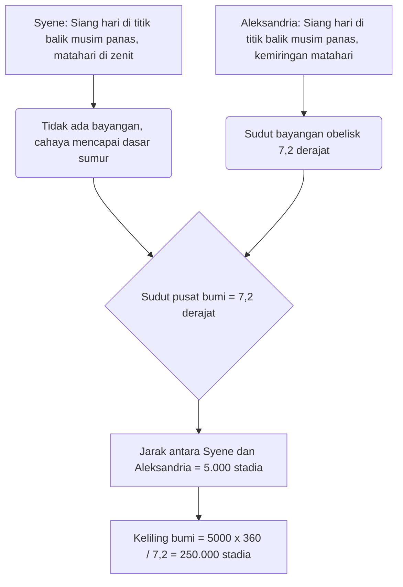
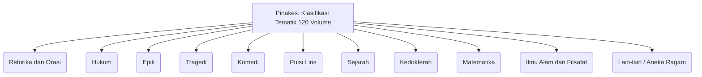
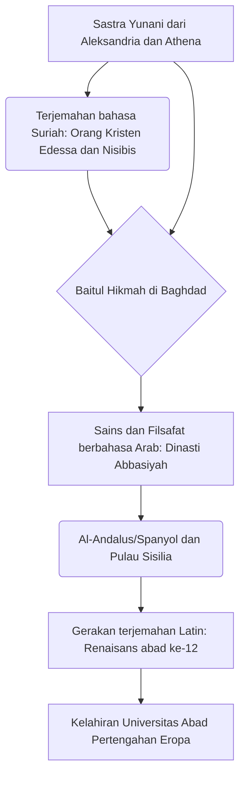

# Pendahuluan: Ingatan Kuno yang Hilang dan Kuil Pengetahuan

Sepanjang sejarah, dalam proses bagaimana umat manusia mengumpulkan, mensistematisasikan, dan kemudian secara tragis kehilangan pengetahuan, mungkin tidak ada yang lebih membangkitkan imajinasi dan membangkitkan rasa romansa sekaligus kesedihan daripada "Perpustakaan Besar Aleksandria" (Great Library of Alexandria) di Mesir. Kuil pengetahuan raksasa tempat semua kebijaksanaan dunia Mediterania kuno dikumpulkan ini bukanlah sekadar tempat penyimpanan buku. Ia adalah lembaga penelitian akademis paling mutakhir, kosmopolis tempat bertemunya berbagai budaya, dan di atas segalanya, kristalisasi dari "imperialisme pengetahuan".

Dalam artikel ini, dengan menyilangkan berbagai perspektif akademis dari sejarah Mediterania kuno, filologi klasik, sejarah buku, dan ilmu perpustakaan dan informasi, kami akan menggambarkan sejarah pewarisan pengetahuan sejak kelahiran, masa kejayaan, dan misteri kehancuran Perpustakaan Aleksandria hingga ke Abad Pertengahan dan modern, dengan detail dan kedalaman akademis yang belum pernah ada sebelumnya.

---

## Bab 1: Ambisi Alexander Agung dan Kelahiran Dunia Hellenistik

### Pembangunan Aleksandria dan Reorganisasi Dunia Mediterania

Pada tahun 332 SM, penakluk muda dari Makedonia, Alexander Agung, membuat Mesir menyerah tanpa pertumpahan darah, dan memerintahkan pembangunan ibu kota baru yang dinamai menurut namanya, "Aleksandria", di lokasi desa nelayan Rhacotis yang menghadap ke Laut Tengah, di ujung barat delta Sungai Nil. Dirancang oleh arsitek utama raja, Dinocrates, kota ini mengadopsi sistem Hippodamian (jaringan jalan ortogonal) yang terlihat dalam perencanaan kota Yunani, dengan poros utama jalan besar yang megah (Jalan Canopic) yang membentang dari timur ke barat, memanfaatkan topografi memanjang antara Laut Tengah dan Danau Mareotis.

Aleksandria diharapkan tidak hanya menjadi ibu kota Mesir, tetapi juga berfungsi sebagai jantung budaya "Hellenisme" (Hellenism) yang menyatukan dunia Yunani-Makedonia (Hellas) dan dunia Orient. Sang Raja sendiri berangkat untuk ekspedisi ke timur sebelum kota itu selesai dan meninggal di Babilonia, tetapi wasiatnya dan kerajaan raksasanya dibagi-bagi oleh para Diadochi (penerusnya). Yang menguasai Mesir adalah teman masa kecil dan orang kepercayaan Raja, Ptolemy I Soter (Penyelamat).

### Kebijakan Budaya Ptolemy I dan "Imperialisme Pengetahuan"

Ptolemy I, yang mendirikan dinasti Ptolemaik, sangat memahami bahwa negara multietnis yang besar tidak dapat diperintah hanya dengan dominasi militer. Ia memutuskan untuk membangun pusat budaya dunia baru di Aleksandria untuk menggantikan Athena. Inti dari ini adalah ide yang luar biasa untuk "mengumpulkan semua buku di dunia di satu tempat".

Pilar teoretis dari ide ini adalah Demetrius dari Phalerum, seorang filsuf dari sekolah Aristotelian (Peripatetik) yang diasingkan dari Athena. Demetrius memiliki pengalaman memimpin politik nasional sebagai tiran Athena selama 10 tahun, serta pengetahuan tentang membangun koleksi buku di Lyceum (sekolah) Aristoteles. Ia menyarankan kepada Ptolemy I bahwa, alih-alih memerintah dengan kekuatan militer semata, mengumpulkan, menerjemahkan, dan mempelajari catatan, hukum, pemikiran, dan sains dari semua bangsa adalah prasyarat untuk kerajaan universal yang sejati.

Ini adalah apa yang bisa disebut "Imperialisme Pengetahuan" (Intellectual Imperialism). Dulu raja-raja dari dinasti Achaemenid Persia dan Asiria (seperti Perpustakaan Niniwe milik Raja Ashurbanipal) juga memiliki arsip, tetapi perpustakaan dinasti Ptolemaik memiliki skala dan tujuan yang berbeda. Mereka bertujuan untuk mengumpulkan literatur dalam semua bahasa dunia yang diketahui (Yunani, Mesir, Ibrani, Persia, dll.) dan menerjemahkannya ke dalam bahasa Yunani serta mengintegrasikannya. Legenda bahwa Septuaginta (terjemahan Alkitab Ibrani ke dalam bahasa Yunani) dibuat di Aleksandria (Surat Aristeas) juga diposisikan dalam konteks kebijakan pengumpulan pengetahuan universal ini.

---

## Bab 2: Gambaran Keseluruhan Lembaga Penelitian Kerajaan Museion

### Struktur sebagai Kuil Akademis dan Hak Istimewa Para Cendekiawan

Apa yang kita sebut "Perpustakaan Aleksandria" hari ini bukanlah bangunan yang berdiri sendiri, melainkan bagian dari kompleks lembaga penelitian dan akademik kerajaan raksasa yang disebut "Museion" (Museion), atau fasilitas tambahannya. "Museion" secara harfiah berarti "Kuil para Muses (sembilan dewi yang memimpin seni dan sains)", dan merupakan asal usul kata modern "museum" (museum).

Ahli geografi Strabo mencatat bahwa Museion bersebelahan dengan tanah istana (distrik Brucheion) dan dilengkapi dengan jalan setapak (peripatos), ruang percakapan (exedra), dan ruang makan besar (syssition) untuk para cendekiawan makan bersama. Museion juga dapat dikatakan sebagai prototipe lembaga penelitian tingkat lanjut dan universitas pascasarjana modern (seperti Institute for Advanced Study di Princeton).

Para cendekiawan yang diundang ke sini (peneliti kerajaan) diberikan hak istimewa yang mengejutkan. Mereka menerima uang pensiun seumur hidup dalam jumlah besar dari istana, dibebaskan dari semua pajak, dan diberikan perumahan dan makanan gratis. Satu-satunya kewajiban mereka adalah mencari pengetahuan, menulis, dan terkadang mendidik anak-anak keluarga kerajaan. Pada puncaknya, lebih dari 100 cendekiawan kelas dunia berkumpul di komunitas akademis asrama penuh ini, membenamkan diri dalam diskusi dan penelitian siang dan malam.

### Kritik Teks Klasik dan Penemuan Simbol Kritik

Salah satu proyek terpenting di Museion adalah menetapkan teks sastra klasik, seperti tulisan-tulisan Homer. Pada saat itu, gulungan papirus yang disalin dengan tangan dipenuhi dengan kesalahan ketik dan kelalaian oleh penyalin, atau penambahan sewenang-wenang oleh para aktor.

Para filolog berturut-turut seperti kepala perpustakaan pertama Zenodotus dari Efesus, Aristophanes dari Byzantium, dan Aristarchus dari Samothrace membandingkan berbagai manuskrip yang berbeda dan mendirikan disiplin "Kritik Teks" (Textual Criticism) untuk mengembalikan teks sedekat mungkin ke bentuk aslinya.

Mereka menemukan sistem penulisan simbol kritik khusus di margin teks.
- **Obelus (– atau ÷)**: Menunjukkan baris yang dicurigai sebagai pemalsuan atau penambahan di kemudian hari.
- **Asterisk (※)**: Menunjukkan baris-baris penting yang diulang atau dimasukkan secara keliru, tetapi sebenarnya harus berada di tempat lain.
- **Diple (>)**: Menunjukkan bagian penting untuk dianotasi atau secara tata bahasa menarik.

Pemberian metadata dengan simbol-simbol ini adalah teknologi pemrosesan informasi revolusioner yang dapat dikatakan sebagai benih pemikiran untuk bahasa markup modern (XML dan HTML).

### Zaman Keemasan Sains: Eratosthenes dan Archimedes

Museion membuat pencapaian luar biasa tidak hanya di bidang humaniora tetapi juga dalam ilmu alam, meninggalkan jejak dalam sejarah manusia.

**Pengukuran Keliling Bumi oleh Eratosthenes**
Kepala perpustakaan ketiga, Eratosthenes dari Kirene, menghitung ukuran bumi dengan wawasan geometris yang menakjubkan. Ia mengetahui bahwa pada siang hari di titik balik matahari musim panas, di kota Syene (Aswan modern) di Mesir selatan, sinar matahari mencapai dasar sumur yang dalam (matahari berada di zenit). Di sisi lain, pada waktu yang sama di hari yang sama, di Aleksandria yang terletak tepat di utara, ia mengukur dari sudut bayangan obelisk jam matahari bahwa matahari miring sekitar 7,2 derajat (1/50 dari seluruh keliling lingkaran 360 derajat) dari zenit.

Berdasarkan fakta bahwa jarak antara Aleksandria dan Syene adalah 5.000 stadia (diperkirakan dari jumlah hari perjalanan karavan unta), Eratosthenes menetapkan persamaan proporsional berikut:
`7,2 derajat : 360 derajat = 5.000 stadia : Keliling seluruh bumi`
Sebagai hasil perhitungan, keliling bumi dihitung menjadi 250.000 stadia. Mengasumsikan 1 stadion sekitar 157,5 meter (stadion Mesir), itu menjadi sekitar 39.375 kilometer, dengan akurasi yang luar biasa dengan margin kesalahan kurang dari 2% dibandingkan dengan keliling ekuator bumi yang sebenarnya (sekitar 40.075 kilometer).

**Anatomi dan Geometri**
Di bidang kedokteran, Herophilus dari Kalsedon dan Erasistratus dari Ceos secara sistematis melakukan pembedahan tubuh manusia pertama dalam sejarah manusia (beberapa mengatakan viviseksi tahanan yang dihukum mati) di bawah perlindungan Museion. Herophilus membuktikan bahwa otak adalah pusat kecerdasan, mengklasifikasikan sistem saraf menjadi saraf motorik dan sensorik, dan juga menunjukkan hubungan antara denyut darah dan fungsi pompa jantung.

Selain itu, Archimedes dari Sirakusa belajar di Aleksandria atau berinteraksi melalui korespondensi dengan para cendekiawan Museion. Ia menemukan "Sekrup Archimedes" yang juga digunakan untuk mengendalikan air di Sungai Nil, dan mengerjakan prinsip daya apung, menghitung pi dengan metode penghabis, dan menentukan luas parabola. Euklides, yang menulis "Elemen" dan mensistematisasikan geometri, juga dikatakan telah memberi tahu Ptolemy I di Aleksandria bahwa "tidak ada jalan kerajaan menuju geometri".

---

## Bab 3: Kegilaan Mengumpulkan Buku dan Revolusi Katalog Perpustakaan

### Pengumpulan Buku Tanpa Ragu: Penyitaan di Pelabuhan dan Tragedi Athena

Untuk memperkaya perpustakaan Museion, raja-raja dinasti Ptolemaik berturut-turut terkadang menggunakan cara-cara pemaksaan yang hampir gila untuk mengumpulkan buku-buku. Perpustakaan Aleksandria secara eksplosif meningkatkan koleksinya bukan hanya dengan membeli buku, tetapi melalui sistem yang memberlakukan kekuasaan negara.

Metode yang paling terkenal adalah sistem sensor dan penyitaan paksa yang disebut "buku dari kapal" (ek ploion). Semua kapal niaga dan kapal penumpang yang memasuki pelabuhan Aleksandria, pusat perdagangan Mediterania, diperiksa secara ketat oleh pejabat bea cukai Mesir. Jika buku (gulungan papirus) ditemukan dalam kargo, buku itu segera disita terlepas dari siapa pemiliknya. Buku-buku yang disita dikirim ke ruang penyalinan perpustakaan (scriptorium), dan salinan yang cepat dan teliti dibuat sepanjang waktu oleh juru tulis profesional. Dan secara mengejutkan, "salinan yang baru dibuat" dikembalikan kepada pemilik aslinya, sementara "asli" (orisinal) secara permanen disimpan sebagai koleksi perpustakaan. Salinan tersebut diberi tag asal (provenance) yang berbunyi "disita dari kapal ~".

Selain itu, ada episode penipuan diplomatik yang terkenal pada masa Ptolemy III Euergetes. Raja menuntut dari pemerintah Athena peminjaman "naskah asli resmi yang disetujui negara" dari tiga penyair tragis besar Yunani (Aeschylus, Sophocles, dan Euripides). Naskah-naskah asli ini adalah warisan budaya suci yang disimpan dengan ketat di Arsip Negara Athena. Pihak Athena menuntut jaminan uang tunai sebesar 15 talenta (dikatakan bernilai miliaran yen dalam nilai saat ini) sebagai syarat peminjaman, tetapi Ptolemy III dengan mudah membayarnya. Namun, ketika naskah aslinya tiba di Aleksandria, raja menyuruh juru tulis terbaiknya membuat salinan yang sangat teliti di atas papirus terbaik dan mengirimkan salinannya kembali ke Athena. Raja membiarkan Athena menyita jaminan 15 talenta (yang pada dasarnya adalah harga pembelian yang sangat tinggi) dan merebut naskah asli yang berharga sebagai harta karun perpustakaan. Ini adalah insiden perampokan modal budaya oleh negara adidaya di era Hellenistik.

### Callimachus dan "Pinakes": Kelahiran Katalog Klasifikasi Buku Komprehensif Pertama di Dunia

Sebagai hasil dari pengumpulan melalui cara apa pun, jumlah koleksi Perpustakaan Aleksandria dikatakan telah mencapai ratusan ribu gulungan (beberapa mengatakan 500.000 hingga 700.000 gulungan) di gedung utama (distrik Brucheion), dan lebih dari 40.000 gulungan di cabang Serapeum. Dengan jumlah informasi yang begitu besar, tidak lagi mungkin untuk menemukan dokumen yang diinginkan hanya dengan ingatan manusia atau penataan fisik. "Sistem pencarian (arsitektur pencarian informasi)" menjadi sangat penting untuk mengubah gunung gulungan buku semata menjadi "basis data pengetahuan".

Pencapaian terobosan terbesar dalam sejarah ilmu perpustakaan ini diselesaikan oleh penyair jenius dan cendekiawan kelahiran Kirene, Callimachus (sekitar 310 SM - sekitar 240 SM). Meskipun dikatakan ia tidak secara resmi menjabat sebagai kepala perpustakaan, ia adalah orang yang secara praktis bertanggung jawab untuk mengelola koleksi perpustakaan.

Callimachus membuat katalog besar 120 volume "Pinakes" (Pinakes: secara harfiah "loak/papan tulisan", nama resminya adalah "Daftar orang-orang yang unggul dalam setiap bidang keilmuan dan tulisan-tulisan mereka") yang mencakup seluruh koleksi perpustakaan. Ini bukan sekadar daftar kepemilikan (inventaris), tetapi "katalog klasifikasi berdasarkan subjek (subject catalog)" sistematis pertama milik umat manusia.

Sistem klasifikasi "Pinakes" menetapkan kategori berikut sebagai klasifikasi utama (kelas utama).

Selanjutnya, kegeniusan Callimachus terletak pada fakta bahwa ia menambahkan informasi bibliografi (metadata) yang terperinci di bawah klasifikasi utama ini. Di setiap kategori, penulis diurutkan secara alfabetis, dan data terstruktur berikut dideskripsikan.

- **Nama penulis dan biografi**: Nama penulis, tempat lahir, nama ayah, nama guru, dan biografi singkat. Ini berfungsi sebagai Kontrol Otoritas (Authority Control) untuk mengidentifikasi penulis dengan nama yang sama.
- **Judul karya**: Jika tidak ada judul, judul sementara berdasarkan isi diberikan.
- **Incipit (pembukaan)**: Beberapa kata pertama hingga baris pertama setiap karya. Karena judul sering hilang pada gulungan papirus kuno, ini adalah metode (peran seperti nilai hash) untuk mengidentifikasi karya dengan bagian awal teks.
- **Jumlah volume dan total baris (stichometry)**: Jumlah volume seluruh karya dan jumlah baris teks yang tepat. Catatan jumlah baris berfungsi sebagai dasar untuk menghitung remunerasi yang dibayarkan kepada penyalin (scriptor), dan pada saat yang sama memainkan peran "checksum (verifikasi integritas)" untuk memverifikasi apakah teks telah diubah kemudian atau apakah ada halaman yang hilang.

Arsitektur pengaturan informasi oleh Callimachus ini dapat dikatakan sebagai pencetus sejati dari teknologi pemrosesan informasi universal dan mendasar, yang mengarah langsung ke katalog perpustakaan biara abad pertengahan, Sistem Klasifikasi Desimal Dewey (DDC) dan OPAC (katalog perpustakaan daring) di perpustakaan modern, dan bahkan struktur basis data relasional.

---

## Bab 4: Materialitas dan Teknologi Penyalinan Gulungan Papirus (Volumen): Lingkungan Media Kuno dan Bibliometrik

### Hadiah Sungai Nil dan Infrastruktur Penulisan

Apa yang secara mendasar mendukung kemakmuran Perpustakaan Aleksandria dari sudut pandang material adalah media perekaman yang disebut "Papirus" (Papyrus). Dibuat dari tanaman air cyperaceous (Cyperus papyrus) yang tumbuh liar di lahan basah Delta Sungai Nil, kertas ini merupakan media perekaman informasi terbaik di dunia Mediterania kuno, mengungguli loh tanah liat dan kulit hewan. Seperti yang dirinci Pliny the Elder dalam "Natural History", proses pembuatan papirus adalah kerajinan tangan yang sangat terspesialisasi.

Pertama, kulit luar batang tanaman yang tebal (berpotongan segitiga) dikupas, dan empulur bagian dalam (pith) diiris tipis-tipis memanjang menggunakan jarum atau pisau tipis. Potongan panjang seperti pita (philyrae) yang tipis ini diletakkan rapat-rapat di atas papan kayu basah, lalu di atasnya, selapis lagi diletakkan menyilang tegak lurus. Dengan menggunakan air berlumpur Sungai Nil atau perekat yang diformulasikan secara khusus (atau getah tanaman itu sendiri), bahan ini dipukul keras dengan palu kayu untuk direkatkan bersama-sama dan dikeringkan di bawah sinar matahari untuk membentuk satu lembaran tipis, ringan, fleksibel, dan tahan lama (kollema). Papirus kualitas tertinggi, disebut "Hieratica (untuk para pendeta)" atau "Augusta" yang dinamai kaisar Augustus, berwarna putih, halus, dan sangat mahal.

Lembaran-lembaran ini direkatkan secara berurutan dengan pasta tepung terigu untuk membuat "gulungan" (Volumen, dalam bahasa Yunani biblion) yang panjang. Gulungan biasa, terbuat dari sekitar 20 lembar kollema yang direkatkan menjadi satu (scapus), merupakan satuan standar penjualan dan beredar di pasar.

Alat tulis yang digunakan adalah pena yang disebut calamus, dibuat dari batang alang-alang yang keras yang ujungnya dibelah. Berbeda dengan sikat buluh tradisional Mesir (brush), ujungnya dipotong tajam untuk menulis abjad Yunani dengan tajam. Tinta (atramentum) sebagian besar merupakan tinta karbon yang terbuat dari campuran jelaga, gom arab, dan air. Karena tinta ini hanya menempel pada permukaan serat kertas dan tidak menembus ke dalam, ia dapat dengan mudah dibersihkan dan digunakan kembali menggunakan spons, tetapi pada saat yang sama sangat stabil secara kimia, sedemikian rupa sehingga gulungan papirus yang ditemukan di daerah gurun kering bahkan setelah ribuan tahun masih mempertahankan tulisan berwarna hitam. Tinta merah (berasal dari oksida besi atau merkuri sulfida, cinnabar) digunakan untuk judul yang penting, dekorasi, rubrikasi untuk membantu pembacaan, dan simbol kritik.

### Keterbatasan Gulungan dan Kendala Bibliometrik: Geometri Karakter dan Baris

Namun, terdapat batasan fisik sebagai teknologi informasi pada format gulungan papirus.
1. **Kendala panjang dan berat**: Jika gulungan terlalu panjang, maka akan berat dan sulit dikendalikan, dan saat digulung (explicare), papirus akan cepat lelah dan mudah rusak. Batas praktisnya sekitar 10 meter panjangnya, yang setara dengan satu buku (sekitar 700 hingga 900 baris) dari "Iliad" karya Homer. Ungkapan terkenal Callimachus "Buku besar adalah kejahatan besar (Mega biblion, mega kakon)" bukan hanya karena alasan estetika lebih menyukai keanggunan ringkas khas sastra Hellenistik, tetapi juga menunjukkan kerumitan fisik dalam penanganan dan kerentanan gulungan dari sudut pandang praktisi. Karya sejarah yang panjang, tak terelakkan, harus dipisah dan dikelola dalam beberapa gulungan (tomos).
2. **Kesulitan akses acak**: Gulungan adalah media "akses sekuensial" yang dibaca secara berurutan dari awal sampai akhir, membuatnya sangat sulit untuk "mengakses secara acak" halaman atau baris tertentu seketika (misalnya, paragraf tertentu di tengah buku ke-7). Ini membebani biaya kognitif dan waktu yang sangat besar pada cendekiawan yang membandingkan dan merujuk beberapa dokumen secara bersamaan (rujukan silang).
3. **Aturan tata letak Kollema**: Pada gulungan, karakter ditulis sebagai blok yang berurutan (paragraf/kolom memanjang vertikal yang disebut kollema). Lebar masing-masing paragraf adalah sekitar 5 hingga 8 sentimeter, spasi antar baris dijaga agar rata, tidak ada spasi di antara kata-kata, dan umumnya dipraktikkan "scriptio continua (tulisan bersambung)" di mana karakter ditulis secara berurutan. Ini menuntut tingkat keterampilan membaca lantang yang tinggi dari pembacanya.
4. **Penyimpanan dan Manajemen (Cartouche dan Sillybos)**: Gulungan itu digulung pada sumbu kayu (roller) yang disebut umbilicus dan disimpan berdiri di dalam capsa (wadah silinder) atau ditumpuk secara horizontal di rak (pit). Untuk mengidentifikasi isi dari luar, tag perkamen atau papirus kecil yang disebut "Sillybos" dilampirkan ke ujung gulungan, dengan nama penulis dan judul tertulis di atasnya. Ini memenuhi peran tulang punggung buku saat ini, namun kelemahannya adalah mudah robek karena sering dimasukkan dan dikeluarkan.

### Transisi ke Codex (Buku Jilid) dan Biaya Transformasi Media

Antara abad ke-2 dan ke-4 Masehi, bersamaan dengan penyebaran kekristenan yang eksplosif, pergeseran paradigma dari gulungan papirus ke "Codex (buku berjilid)"—salah satu revolusi media terbesar dalam sejarah umat manusia—terjadi. Codex, terbuat dari perkamen atau papirus yang dilipat dua menjadi bundel dan dijahit dengan benang di bagian punggungnya, memiliki kepadatan informasi yang tinggi (mengurangi volume fisik) karena kedua sisi (recto dan verso) dapat ditulis tanpa dibuang, dan di atas semua itu, memberikan keunggulan luar biasa karena mampu membuka halaman tertentu secara instan (realisasi akses acak dan penggunaan penanda buku).

Di hari-hari terakhir Perpustakaan Aleksandria, dalam periode transisi media ini, mereka pasti menghadapi biaya besar untuk menulis ulang koleksi gulungan yang sangat banyak ke format Codex baru (migrasi format). Dokumen-dokumen yang terlewatkan dari pekerjaan penulisan ulang ini, yaitu "gulungan yang tidak dicodexkan", akhirnya menjadi usang, tidak dibaca, dan ditakdirkan hilang selamanya akibat kelembaban dan kerusakan serangga. Seleksi dan pemusnahan koleksi di perpustakaan menjadi faktor penentu kelangsungan hidup teks dalam sejarah.

---

## Bab 5: Mitos dan Kebenaran Kehancuran: Apa yang Menghancurkan Perpustakaan?

Pertanyaan "kapan dan oleh siapa" Perpustakaan Aleksandria dihancurkan adalah salah satu misteri terbesar dalam sejarah, dan sering diceritakan sebagai "mitos" di mana perpustakaan itu hancur menjadi abu dalam sekejap akibat satu kebakaran dramatis yang besar. Namun, sejarah dan arkeologi modern menunjukkan bahwa lenyapnya perpustakaan bukanlah satu peristiwa tunggal, melainkan hasil dari serangkaian proses kehancuran dan penurunan yang membentang selama berabad-abad.

### 1. 48 SM: Julius Caesar dan Perang Aleksandria

Legenda kehancuran yang paling terkenal adalah oleh jenderal Romawi Julius Caesar. Caesar, yang mengejar Pompey dan mendarat di Mesir, berpihak pada Cleopatra VII dan bertempur dalam Perang Aleksandria. Untuk mencegah armada pasukannya sendiri direbut oleh armada Ptolemaik, Caesar membakar kapal-kapal di pelabuhan. Para sejarawan kemudian seperti Plutarch melaporkan bahwa api ini menyebar dari pelabuhan ke daratan dan membakar habis Perpustakaan Besar (atau ratusan ribu gulungan buku di gudang pelabuhan).
Namun, dalam karya Caesar sendiri "Komentar tentang Perang Saudara (De Bello Civili)", tidak ada penyebutan pembakaran perpustakaan. Selain itu, ketika Strabo mengunjungi Aleksandria beberapa dekade kemudian, fasilitas Museion masih berfungsi. Oleh karena itu, sangat mungkin bahwa apa yang hilang dalam kebakaran Caesar adalah "cabang" perpustakaan atau sebagian dari buku-buku yang disimpan di gudang pelabuhan untuk keperluan ekspor dan impor.

### 2. Tahun 270-an M: Penghancuran Menyeluruh Kota oleh Kaisar Aurelianus

Pukulan telak yang dianggap telah diberikan pada tubuh utama perpustakaan adalah perang saudara Kekaisaran Romawi pada paruh kedua abad ke-3 M. Zenobia dari Kerajaan Palmyra menduduki Aleksandria, dan peperangan kota yang sengit terjadi setelahnya saat Kaisar Romawi Aurelianus merebut kembali kota tersebut.
Dalam pertempuran ini, seluruh area istana (Brucheion) hancur total dan luluh lantak. Pandangan yang paling kuat dalam sejarah modern adalah bahwa Museion dan Perpustakaan Besar hancur sepenuhnya bersama dengan bangunan-bangunannya pada masa ini, dan koleksinya tercerai-berai atau dibakar habis.

### 3. Tahun 391 M: Penghancuran Serapeum oleh Kaisar Theodosius dan Umat Kristen

Bahkan setelah Perpustakaan Besar lenyap, sebuah cabang (perpustakaan saudara) masih ada di dalam kuil dewa Serapis yang besar, "Serapeum", yang terletak di bagian barat daya Aleksandria, dan mempertahankan denyut nadi akademis.
Namun, Kaisar Romawi Theodosius I menjadikan agama Kristen sebagai agama negara dan mengeluarkan perintah untuk menghancurkan kuil-kuil pagan. Menanggapi ini, uskup Kristen garis keras Aleksandria, Theophilus, bersama gerombolan biarawan yang fanatik, menyerang Serapeum dan menghancurkan sepenuhnya kuil yang megah itu. Diperkirakan bahwa gulungan papirus yang disimpan di dalam kuil pada waktu itu juga dibakar sebagai buku-buku jahat pagan. Insiden ini, bersamaan dengan pembunuhan brutal ahli matematika wanita Hypatia yang terjadi pada tahun-tahun berikutnya (415 M), telah diwariskan sebagai tragedi yang melambangkan akhir dari pencarian intelektual yang bebas di zaman kuno.

### 4. Tahun 642 M: Penaklukan Islam dan Legenda Khalifah Umar

Mitos paling sensasional yang diciptakan oleh penulis kronik Kristen dan Arab abad ke-13 adalah legenda kehancuran oleh tentara Islam. Ketika jenderal Arab Amr ibn al-As menaklukkan Aleksandria, ia bertanya kepada Khalifah Umar ibn al-Khattab tentang apa yang harus dilakukan dengan buku-buku di perpustakaan. Umar konon menjawab:
"Jika buku-buku itu sejalan dengan Al-Qur'an, kita tidak membutuhkannya karena kita sudah memiliki Al-Qur'an. Jika mereka bertentangan dengan Al-Qur'an, maka mereka berbahaya. Oleh karena itu, bakarlah semuanya."
Dan, dikatakan bahwa koleksi buku-buku tersebut dibagikan sebagai bahan bakar untuk boiler dari 4.000 pemandian umum di Aleksandria dan terus terbakar selama setengah tahun.
Namun, para peneliti modern telah menyimpulkan bahwa episode ini adalah fiksi mutlak (pemalsuan yang dibuat di masa berikutnya). Karena, pada saat penaklukan Islam di abad ke-7, Perpustakaan Besar masa lalu telah menghilang tanpa jejak karena berabad-abad peperangan, habisnya anggaran, dan degradasi alami dari papirus (dalam iklim tepi laut yang lembab, papirus membusuk dalam beberapa ratus tahun).

---

## Bab 6: Perlindungan Pengetahuan dan Pelayaran Besar Menuju Abad Pertengahan dan Renaisans: Kelangsungan Hidup Ingatan Kemanusiaan

Bangunan fisik dan papirus Aleksandria menjadi abu dan kembali ke tanah. Namun, DNA dari "kebijaksanaan kuno" yang dipupuk di sana tidak terputus sama sekali. Berkat estafet intelektual yang menakjubkan selama berabad-abad, sebagian di antaranya telah menyelesaikan pelayaran panjang mencapai kita hari ini melalui Suriah, Persia, Jazirah Arab, Afrika Utara, dan Semenanjung Iberia.

### Dari Bahasa Suriah ke Bahasa Arab: Rumah Kebijaksanaan di Baghdad dan Gerakan Penerjemahan Besar

Pada abad ke-5 dan ke-6, para cendekiawan dari sekte Nestorian dan Monofisit, yang melarikan diri dari penganiayaan terhadap bidah oleh ortodoksi Kristen (Kalsedon) di Kekaisaran Bizantium, mencari perlindungan di Suriah timur dan Persia Sassania. Secara khusus, Edessa (sekarang Urfa), Nisibis, dan sekolah kedokteran Gundeshapur di Persia menjadi basis baru untuk mewarisi pengetahuan Yunani. Mereka menerjemahkan literatur Yunani yang sulit seperti logika Aristoteles ("Organon"), kedokteran Galenus dan Hippocrates, dan astronomi Ptolemeus ("Almagest") pertama-tama ke dalam bahasa Suriah (salah satu dialek bahasa Aram). Ini menjadi jembatan pertama bagi pengetahuan Yunani di Timur Tengah.

Kemudian, pada abad ke-8, dinasti Abbasiyah Kekaisaran Islam bangkit, dan para Khalifah Al-Mansur dan Al-Ma'mun mendirikan lembaga penerjemahan dan penelitian raksasa yang disebut "Baitul Hikmah (Rumah Kebijaksanaan)" di ibu kota baru Baghdad. Ini adalah proyek nasional yang benar-benar bisa disebut "Museion Kedua".

Di sini, penerjemah jenius seperti Hunayn ibn Ishaq (seorang Arab Kristen Nestorian) melakukan gerakan penerjemahan berskala besar yang belum pernah terjadi sebelumnya (Gerakan Penerjemahan Yunani-Arab) dari bahasa Suriah ke bahasa Arab, atau langsung dari bahasa Yunani ke bahasa Arab. Hunayn tidak sekadar menerjemahkan kata demi kata, melainkan ia terlebih dahulu memvalidasi teks (sebuah metode filologi Aleksandria untuk membandingkan beberapa naskah dan menetapkan makna yang tepat), dan kemudian menciptakan terminologi khusus dalam filsafat dan sains ke dalam bahasa Arab (seperti konsep abstrak "kualitas", "kuantitas", "esensi").

Pengetahuan Aleksandria mekar di ladang baru dunia Islam dan menempuh evolusinya sendiri. Para cendekiawan agung Islam seperti Al-Khawarizmi (bapak aljabar), Al-Kindi (bapak filsafat Arab), Ibnu Sina (nama Latin Avicenna, penulis Kanon Kedokteran), dan Ibnu Rusyd (nama Latin Averroes, komentator pamungkas Aristoteles) tidak hanya menyerap pengetahuan Yunani, tetapi juga secara kritis melampauinya, membangun standar sains dan teknologi tertinggi di dunia.

*(※ Di atas adalah silsilah Gerakan Penerjemahan Yunani-Arab-Latin)*

### Pelestarian Manuskrip oleh Kekaisaran Bizantium dan Pengembalian ke Renaisans Italia

Di sisi lain, ada silsilah pengetahuan yang tetap berada di wilayah berbahasa Yunani. Di Konstantinopel, ibu kota Kekaisaran Romawi Timur (Kekaisaran Bizantium), dan di biara-biara Gunung Athos, para biarawan terus-menerus menyalin dan melestarikan literatur klasik berbahasa Yunani ke dalam codex perkamen. Pada abad ke-9, terjadi kebangkitan klasik yang dikenal sebagai "Renaisans Makedonia", di mana pengetahuan kuno diringkas dan dilestarikan melalui kompilasi karya-karya seperti "Bibliotheca (Catatan Bacaan)" oleh Patriark Photius dan "Suda" (ensiklopedia besar berbahasa Yunani).

Dalam "Renaisans abad ke-12" pada abad ke-12, pengetahuan yang diterjemahkan dari dunia Islam (Toledo di Spanyol dan Sisilia di Italia selatan) melalui bahasa Arab ke dalam bahasa Latin mengalir ke Eropa Barat, mendorong kelahiran universitas-universitas Eropa (Universitas) di Paris dan Bologna.

Selain itu, ketika Konstantinopel jatuh ke tangan Kekaisaran Ottoman pada tahun 1453, banyak cendekiawan Bizantium, termasuk Georgius Gemistus Pletho, melarikan diri ke Semenanjung Italia dengan membawa manuskrip berbahasa Yunani yang berharga (seperti karya lengkap Plato). Hal ini memicu penemuan kembali secara langsung klasik Yunani di Florence, yang diperintah oleh keluarga Medici, dan di Venesia, tempat pencetakan tipe bergerak berkembang, yang menjadi kekuatan pendorong yang kuat bagi Renaisans Italia berdasarkan humanisme.

### Pertanyaan Menuju Aleksandria Digital Modern dan Tantangan Abadi

Saat ini, pada tahun 2002, berkat kerja sama pemerintah Mesir dan UNESCO, perpustakaan baru yang sangat besar berbentuk piringan, "Bibliotheca Alexandrina (Perpustakaan Aleksandria Baru)", dibangun di dekat situs perpustakaan kuno, menandai kebangkitan simbolis.

Juga, di ruang siber internet, ada "Impian Aleksandria" versi modern, seperti "Internet Archive", yang mencoba mendigitalkan dan melestarikan semua halaman web, buku, dan video di dunia. Proyek Google Books dapat dikatakan sebagai manifestasi modern yang persis dari imperialisme pengetahuan dinasti Ptolemaik.

Namun, kita harus mempelajari pelajaran berharga dari nasib perpustakaan kuno. Meskipun media penyimpanan telah berubah dari papirus menjadi cip silikon atau penyimpanan komputasi awan, dan jumlah total data telah membengkak hingga skala exabyte, risiko mendasar yang mengancam pelestarian dan pewarisan pengetahuan belum berubah. Perang, terorisme, penyensoran oleh ideologi politik diktator, kehabisan dana proyek, dan di atas segalanya, masalah "keusangan format (krisis Abad Kegelapan Digital)". Di era modern di mana perangkat lunak dan perangkat keras menjadi usang hanya dalam beberapa tahun, tidak ada jawaban pasti tentang siapa dan bagaimana data digital saat ini akan dibaca dalam 500 atau 1.000 tahun mendatang.

Sejarah jatuh bangunnya Perpustakaan Aleksandria secara mendalam menyuarakan kepada kita lintas ribuan tahun tentang betapa rapuhnya tindakan umat manusia dalam mengumpulkan, melindungi, dan mewariskan pengetahuan, sekaligus betapa ia membutuhkan kemauan yang tangguh dan upaya yang berkelanjutan (penyalinan tanpa henti dari satu manuskrip ke manuskrip lainnya).

---
