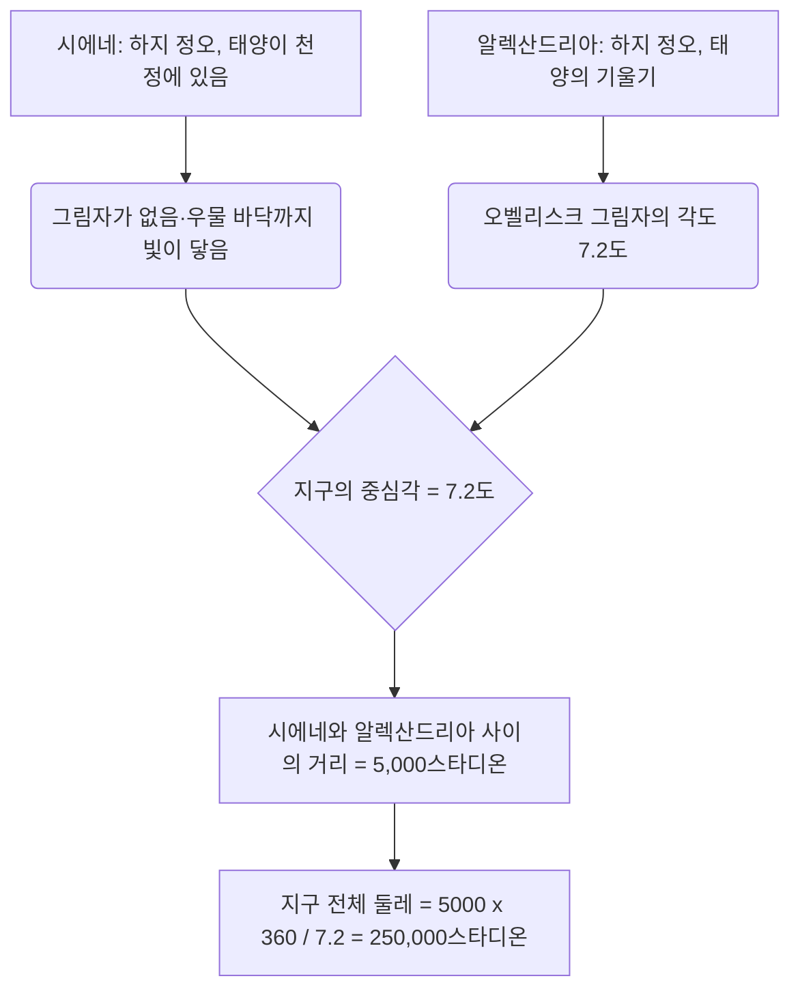
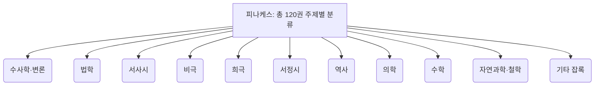
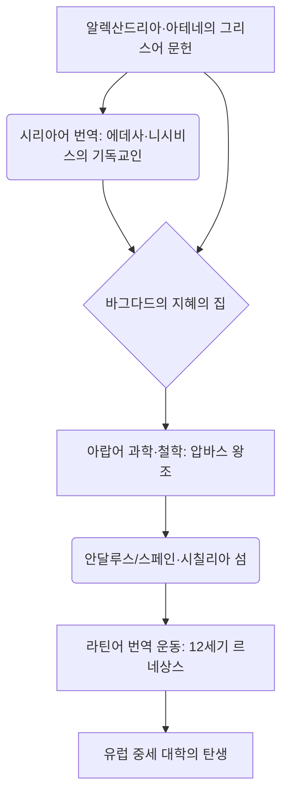

# 서론: 잃어버린 고대의 기억과 지식의 전당

역사상 인류가 지식을 축적하고, 체계화하고, 그리고 무참히 잃어버린 과정에 있어서, 이집트의 '알렉산드리아 도서관(Great Library of Alexandria)'만큼 사람들의 상상력을 자극하고 낭만과 비애를 느끼게 하는 존재는 없을 것입니다. 고대 지중해 세계의 모든 지혜가 모인 이 거대한 지식의 신전은 단순한 서적의 보관소가 아니었습니다. 그것은 최첨단 학술 연구소이자, 이문화가 교차하는 코스모폴리스이며, 무엇보다도 '지식 제국주의'의 결정체였습니다.

본고에서는 고대 지중해사, 고전문헌학, 서물사(서적의 역사), 문헌정보학이라는 여러 학문적 시각을 교차시키면서, 알렉산드리아 도서관의 탄생부터 번영, 그리고 파괴의 수수께끼에서 중세와 근대로 이어지는 지식 계승의 역사를 그 어느 때보다 상세하고 학술적인 깊이로 그려냅니다.

---

## 제1장: 알렉산드로스 대왕의 야망과 헬레니즘 세계의 탄생

### 알렉산드리아의 건설과 지중해 세계의 재편

기원전 332년, 마케도니아의 젊은 정복자 알렉산드로스 대왕은 이집트를 무혈입성으로 점령하고, 나일강 삼각주 서쪽 끝, 지중해와 맞닿은 어촌 라코티스의 땅에 자신의 이름을 딴 새 수도 '알렉산드리아'의 건설을 명했습니다. 대왕의 수석 건축가 디노크라테스가 설계한 이 도시는 그리스의 도시 계획에서 볼 수 있는 히포다모스 방식(직교로망)을 채택하여, 지중해와 마레오티스 호수 사이에 낀 길쭉한 지형을 최대한 살린, 동서로 뻗은 장대한 대로(카노푸스 거리)를 주축으로 삼았습니다.

알렉산드리아는 단순한 이집트의 수도에 머물지 않고, 그리스·마케도니아 세계(헬라스)와 오리엔트 세계를 융합하는 '헬레니즘(Hellenism)' 문화의 심장부로 기능할 것이 기대되었습니다. 대왕 자신은 도시가 완성되기를 기다리지 않고 동방 원정을 떠났다가 바빌론에서 객사하지만, 그의 유지와 거대한 제국은 디아도코이(후계자)들에 의해 분할됩니다. 이집트를 장악한 것은 대왕의 소꿉친구이자 측근이었던 프톨레마이오스 1세 소테르(구원자)였습니다.

### 프톨레마이오스 1세의 문화 정책과 '지식 제국주의'

프톨레마이오스 왕조를 연 프톨레마이오스 1세는 군사적 지배만으로는 거대한 다민족 국가를 통치할 수 없다는 것을 깊이 이해하고 있었습니다. 그는 아테네를 대신할 새로운 세계의 문화적 중심지를 알렉산드리아에 세우기로 결심합니다. 그 핵심이 된 것이 '세계의 모든 책을 한곳에 모은다'는 엄청난 구상이었습니다.

이 구상의 이론적 지주가 된 것은 아테네에서 망명해 온 아리스토텔레스 학파(소요학파)의 철학자 데메트리오스 팔레레우스입니다. 데메트리오스는 아테네의 참주로서 10년 동안 국정을 담당한 경험과 아리스토텔레스의 리케이온(학원) 장서 구축에 관한 지식을 아울러 가지고 있었습니다. 그는 프톨레마이오스 1세에게 단순한 무력에 의한 지배가 아니라, 모든 민족의 기록, 법률, 사상, 과학을 수집하고 번역하고 연구하는 것이야말로 진정한 보편 제국의 조건이라고 진언했습니다.

이것은 '지식 제국주의(Intellectual Imperialism)'라고 부를 만한 것이었습니다. 일찍이 아케메네스 왕조 페르시아나 아시리아의 왕들(예를 들어 아슈르바니팔 왕의 니네베 도서관)도 문서고를 가졌지만, 프톨레마이오스 왕조의 그것은 규모와 목적 차원이 달랐습니다. 그들은 알려진 세계의 모든 언어(그리스어, 이집트어, 히브리어, 페르시아어 등)의 문헌을 모아 그리스어로 번역하고 통합하는 것을 목표로 했던 것입니다. 구약성경의 그리스어 번역본인 '70인역 성경(셉투아진타)'이 알렉산드리아에서 작성되었다는 전설(아리스테아스의 편지)도 이 보편적인 지식 수집 정책의 맥락에 자리매김합니다.

---

## 제2장: 왕립 연구소 무세이온(Museion)의 전모

### 학술 신전으로서의 구조와 학자의 특권

우리가 오늘날 '알렉산드리아 도서관'이라고 부르는 것은 독립된 건물이 아니라, '무세이온(Museion)'이라 불리는 왕립 거대 학술·연구 기관군(群)의 일부 혹은 그 부속 시설이었습니다. '무세이온'은 글자 그대로 '무사(문예를 관장하는 9명의 여신)의 신전'을 의미하며 현대의 '뮤지엄(박물관)'의 어원이 되었습니다.

지리학자 스트라본은 무세이온이 왕궁 부지(브루케이온 지구)에 인접해 있으며, 산책로(페리파토스), 담화실(엑세드라), 그리고 학자들이 공동으로 식사하기 위한 대식당(쉬시티온)을 갖추고 있었다고 기록하고 있습니다. 무세이온은 현대의 고등연구소나 대학원 대학(예를 들어 프린스턴 고등연구소)의 원형이라고도 할 수 있습니다.

이곳에 초빙된 학자들(왕실 연구원)에게는 놀라운 특권이 주어졌습니다. 그들은 왕실로부터 많은 종신 연금을 지급받았고, 일체의 세금을 면제받았으며, 무료로 주거와 식사를 제공받았습니다. 그들의 유일한 의무는 지식 탐구, 저술 활동, 그리고 때때로 왕족 자제들의 교육을 담당하는 것이었습니다. 이 전원 기숙사 형태의 학술 공동체에는 전성기 시절 100명이 넘는 세계 최고 수준의 학자들이 집결하여 밤낮을 가리지 않고 토론과 연구에 몰두했습니다.

### 궁극의 문헌 교정과 교정 기호의 발명

무세이온에서의 가장 중요한 사업 중 하나가 호메로스 등 고전 문학 텍스트의 확정이었습니다. 당시의 필사 파피루스 두루마리에는 필사생에 의한 오기, 누락, 혹은 배우들에 의한 제멋대로의 가필이 만연해 있었습니다.

초대 도서관장인 에페소스의 제노도토스, 비잔티움의 아리스토파네스, 그리고 사모트라케의 아리스타르코스 등 역대 문헌학자들은 여러 이본(寫本)을 비교 검토하여 가장 본래의 형태에 가까운 텍스트를 복원하는 '문헌 교정(Textual Criticism)' 학문을 확립했습니다.

그들은 텍스트의 여백에 특수한 교정 기호를 적어 넣는 시스템을 발명했습니다.
- **오벨루스(Obelus, – 또는 ÷)**: 위작이나 후대의 가필로 의심되는 행을 표시한다.
- **아스테리스크(Asterisk, ※)**: 반복되거나 잘못 삽입되었지만, 본래는 다른 곳에 있어야 할 중요한 행을 표시한다.
- **디플레(Diple, >)**: 주석을 달아야 할 중요한 부분이나 문법적으로 흥미로운 부분을 표시한다.

이러한 기호를 통한 메타데이터 부여는 현대의 마크업 언어(XML이나 HTML) 사상의 맹아라고도 할 수 있는 획기적인 정보 처리 기술이었습니다.

### 과학의 황금시대: 에라토스테네스와 아르키메데스

무세이온은 인문과학뿐만 아니라 자연과학 분야에서도 인류 역사에 남을 업적을 올렸습니다.

**에라토스테네스의 지구 전체 둘레 측정**
제3대 도서관장을 지낸 키레네의 에라토스테네스는 놀라운 기하학적 통찰력으로 지구의 크기를 계산했습니다. 그는 하짓날 정오에 이집트 남부 도시 시에네(현재의 아스완)에서는 깊은 우물 바닥까지 태양광이 닿는다(태양이 천정에 온다)는 것을 알았습니다. 반면 같은 날 같은 시각, 정북쪽에 위치한 알렉산드리아에서는 해시계 오벨리스크 그림자의 각도를 통해 태양이 천정에서 약 7.2도(전체 원주 360도의 50분의 1) 기울어져 있음을 측정했습니다.

에라토스테네스는 알렉산드리아와 시에네의 거리가 5,000스타디온(낙타 대상의 이동 일수에서 추정)이라는 것을 바탕으로 다음과 같은 비례식을 세웠습니다.
`7.2도 : 360도 = 5,000스타디온 : 지구의 전체 둘레`
계산 결과, 지구 전체 둘레는 250,000스타디온으로 산출되었습니다. 1스타디온을 약 157.5미터(이집트의 스타디온)로 가정하면 약 39,375킬로미터가 되어, 실제 지구의 적도 둘레(약 40,075킬로미터)와 비교해 오차가 불과 2% 미만이라는 경이적인 정밀도였습니다.

**해부학과 기하학**
의학 분야에서는 칼케돈의 헤로필로스와 케오스 섬의 에라시스트라토스가 무세이온의 보호 아래 인류 역사상 최초로 인체 해부(일설에는 사형수 생체 해부)를 체계적으로 실시했습니다. 헤로필로스는 뇌가 지성의 자리임을 증명하고, 신경계를 운동 신경과 감각 신경으로 분류했으며, 나아가 혈액의 맥박과 심장의 펌프 기능의 연관성을 지적했습니다.

또한, 알렉산드리아에서 배우거나 무세이온의 학자들과 서신을 통해 교류했던 인물이 시라쿠사의 아르키메데스입니다. 그는 나일강 치수에도 사용된 '아르키메데스의 나선 양수기'를 고안했고, 부력의 원리, 실진법을 이용한 원주율 계산, 포물선의 구적 등을 수행했습니다. 『원론』을 저술하여 기하학을 체계화한 에우클레이데스(유클리드)도 알렉산드리아에서 프톨레마이오스 1세에게 "기하학에는 왕도가 없다"고 말했다고 전해집니다.

---

## 제3장: 서적 수집의 광기와 장서 목록의 혁명

### 수단을 가리지 않는 서적 수집: 항구의 몰수와 아테네의 비극

무세이온의 도서관을 충실히 하기 위해 프톨레마이오스 왕조의 역대 왕들은 때로는 광기라고도 할 수 있는 강압적인 수단으로 책을 긁어모았습니다. 알렉산드리아 도서관은 단순히 책을 사는 것뿐만 아니라 국가 권력을 발동한 시스템을 통해 장서를 폭발적으로 늘려 나갔던 것입니다.

가장 유명한 수법이 '선박의 책(ek ploion)'이라 불리는 검열과 몰수의 강제 징용 시스템입니다. 지중해 교역의 중심이었던 알렉산드리아 항에 입항하는 모든 상선과 여객선은 이집트 세관원의 엄격한 임검을 받았습니다. 적하물 중에 책(파피루스 두루마리)이 발견되면 그것이 누구의 것이든 즉각 몰수되었습니다. 몰수된 책은 도서관 필사실(스크립토리움)로 보내져 전문 서기들에 의해 밤낮을 가리지 않고 빠르고 정교한 필사본이 작성되었습니다. 그리고 놀랍게도 원래 주인에게는 '새로 작성된 필사본'이 반환되었고, '원본(오리지널)'은 도서관의 장서로 영구히 수장되었습니다. 필사본에는 '~배에서 몰수한 것'이라는 이력(프로비넌스) 태그가 붙여졌습니다.

게다가 프톨레마이오스 3세 에우에르게테스 시대의 유명한 외교적 사기 에피소드가 있습니다. 왕은 아테네 정부에 대해 그리스 3대 비극 시인(아이스킬로스, 소포클레스, 에우리피데스)의 '국가 공인 공식 원본'의 대여를 요구했습니다. 이 원본들은 아테네의 국가 공문서관에 엄중히 보관되어 있던 신성한 문화유산이었습니다. 아테네 측은 대여 조건으로 15탈란톤(현재 가치로 수백억 원 상당으로 알려짐)이라는 막대한 현금 보증금을 요구했지만, 프톨레마이오스 3세는 선뜻 이를 지불했습니다. 그러나 원본이 알렉산드리아에 도착하자 왕은 가장 우수한 서기에게 최고급 파피루스로 정교한 필사본을 만들게 하고, 그 필사본을 아테네로 돌려보냈습니다. 왕은 15탈란톤의 보증금을 그대로 아테네에 몰수되게 내버려 두고(사실상 초고액 매입), 귀중한 원본을 도서관의 지보로 빼앗은 것입니다. 이것은 헬레니즘 시대 초대 강대국에 의한 문화 자본의 강탈 사건이었습니다.

### 칼리마코스와 『피나케스』: 세계 최초 종합 도서 분류 목록의 탄생

이러한 수단을 가리지 않는 수집의 결과, 알렉산드리아 도서관의 장서 수는 본관(브루케이온 지구)에서 수십만 권(일설에는 50만 권에서 70만 권), 세라페움 분관에서 4만 권 이상에 달했다고 전해집니다. 이처럼 거대한 정보량이 되면 더 이상 인간의 기억이나 물리적 배치만으로는 목적하는 문헌을 찾아내는 것이 불가능합니다. 단순한 두루마리의 산을 '지식의 데이터베이스'로 바꾸기 위한 '검색 시스템(정보 검색 아키텍처)'이 필수적이게 되었습니다.

이 문헌정보학에 있어 사상 최대의 돌파구를 이룩해 낸 이가 바로 키레네 출신의 시인이자 천재적인 학자인 칼리마코스(기원전 310년경 - 기원전 240년경)입니다. 그는 정식 도서관장에 취임하지는 않았다고 알려져 있으나, 도서관 장서 관리의 실질적 책임자였습니다.

칼리마코스는 도서관 전체 장서를 망라한 120권에 이르는 거대한 목록 『피나케스(Pinakes: 글자 그대로 '서판', 정식 명칭은 '모든 학문 분야에서 활약한 사람들과 그 저작의 목록')』를 작성했습니다. 이것은 단순한 소장 목록(인벤토리)이 아니라, 인류 최초의 체계적인 '주제별 분류 목록(서브젝트 카탈로그)'이었습니다.

『피나케스』의 분류 체계는 대분류(메인 클래스)로서 다음과 같은 카테고리를 설정하고 있었습니다.

더 나아가 칼리마코스의 천재성은 이 대분류 아래 정교한 서지 정보(메타데이터)를 부여한 점에 있습니다. 각 카테고리 안에서 저자는 알파벳순으로 배열되었고, 다음과 같은 구조화된 데이터가 기술되어 있었습니다.

- **저자명과 전기**: 저자의 이름, 출신지, 아버지의 이름, 스승의 이름, 간단한 경력(바이오그래피). 이것은 동명이인의 저자를 식별하기 위한 전거 제어(Authority Control)로 기능했습니다.
- **저작의 제목**: 제목이 없는 경우 내용에 기초한 가제가 부여되었습니다.
- **인시핏(시작 부분)**: 각 저작의 첫 몇 단어에서 첫 줄. 고대 파피루스 두루마리에는 제목이 손실된 경우가 많았기 때문에, 본문의 첫머리로 작품을 특정하는(해시값 같은 역할) 수법입니다.
- **권수와 총행수(스티코메트리)**: 저작 전체의 권수와 정확한 텍스트의 행수. 행수의 기록은 필사생(스크립토르)에게 지불할 보수 계산의 기준이 됨과 동시에, 텍스트가 나중에 변조되거나 페이지가 누락되지 않았는지를 검증하기 위한 '체크섬(무결성 검증)' 역할을 수행했습니다.

칼리마코스의 이 정보 정리 아키텍처는 중세 수도원 도서관의 목록을 거쳐 현대 도서관의 듀이 십진분류법(DDC)이나 OPAC(온라인 열람 목록), 나아가 관계형 데이터베이스 구조로 직접 이어지는, 본질적이고 보편적인 정보 처리 기술의 시조라고 할 수 있습니다.

---

## 제4장: 파피루스 두루마리(Volumen)의 물질성과 서사 기술: 고대의 미디어 환경과 계량서지학

### 나일강의 선물과 서사의 인프라스트럭처

알렉산드리아 도서관의 번영을 물질적인 측면에서 근본적으로 지탱하고 있었던 것이 '파피루스(Papyrus)'라는 기록 매체입니다. 나일강 삼각주의 습지대에 자생하는 사초과 정수 식물(Cyperus papyrus)로 만들어지는 이 종이는 고대 지중해 세계에서 점토판이나 짐승 가죽을 능가하는 최고의 정보 기록 미디어였습니다. 대 플리니우스가 『박물지』에서 상술하고 있듯이, 파피루스의 제조 공정은 고도로 전문화된 수공업이었습니다.

먼저 식물의 굵은 줄기(삼각형 단면을 가짐) 껍질을 벗겨내고, 내부의 심(pith)을 바늘이나 얇은 칼로 세로로 얇게 슬라이스합니다. 이 얇은 리본 모양의 긴 조각(필뤼라)을 촉촉한 나무판 위에 틈새 없이 늘어놓고, 그 위에 다시 한 층, 이번에는 직각으로 교차하도록 늘어놓습니다. 나일강의 흙탕물이나 특별히 조제된 접착제(혹은 식물 자체의 점액)를 사용하면서 나무망치로 전체를 세게 두드려 압착시키고 햇빛에 건조함으로써, 얇고 가볍고 유연하면서도 내구성 있는 한 장의 시트(콜레마)가 완성됩니다. 최고 품질의 파피루스는 '히에라티카(신관용)' 혹은 아우구스투스 황제의 이름을 딴 '아우구스타'로 불리며 하얗고 매끄러워 매우 비쌌습니다.

이 시트들을 밀가루 풀로 차례차례 이어 붙임으로써 긴 '두루마리(Volumen, 그리스어로 비블리온)'가 만들어졌습니다. 일반적인 두루마리는 20장 정도의 콜레마를 이어 붙인 것(스칼포스)이 표준적인 판매 단위로 시장에 유통되었습니다.

필기구로는 칼라무스라 불리는 딱딱한 갈대 줄기의 끝을 쪼갠 펜이 사용되었습니다. 이집트 예로부터 내려온 골풀 붓(브러시)과 달리, 그리스어 알파벳을 날카롭게 기록하기 위해 끝이 뾰족하게 커팅되어 있었습니다. 잉크(아틀라멘툼)는 그을음과 아라비아고무, 물을 섞어 만든 탄소 잉크가 주류였습니다. 이 잉크는 종이 섬유 표면에 부착될 뿐 내부까지 침투하지 않기 때문에 해면(스펀지)으로 쉽게 씻어내어 재사용할 수 있었으나, 동시에 화학적으로 매우 안정적이었기 때문에 수천 년의 시간이 지난 현재에도 사막의 건조지대에서 발견되는 파피루스는 새까만 글씨를 유지하고 있습니다. 중요한 제목이나 장식, 혹은 독해를 돕기 위한 루비나 교정 기호에는 붉은색 잉크(산화철이나 황화수은인 주사)가 사용되었습니다.

### 두루마리의 한계와 계량서지학적 제약: 글자 수와 행수의 기하학

그러나 파피루스 두루마리라는 포맷에는 정보 기술로서 물리적인 한계가 존재했습니다.
1. **길이와 무게의 제약**: 두루마리가 너무 길면 무겁고 다루기 불편하며, 펼칠 때(엑스플리카레) 파피루스가 피로해져 파손되기 쉽습니다. 실용적인 한계는 길이 약 10미터 정도로, 이는 호메로스의 『일리아스』 1권 분량(약 700~900행)에 해당했습니다. 칼리마코스가 "큰 책은 큰 재앙이다(Mega biblion, mega kakon)"라는 유명한 말을 남긴 것은 헬레니즘 문학 특유의 세련된 간결함을 선호했다는 미학적인 이유뿐만 아니라, 두루마리의 물리적 취급의 번거로움과 열화되기 쉬움을 실무자의 시점에서 지적한 것이기도 합니다. 방대한 역사서 등은 필연적으로 여러 개의 두루마리(토모스)로 분할하여 보존 및 관리할 수밖에 없었습니다.
2. **랜덤 액세스의 어려움**: 두루마리는 처음부터 끝까지 순서대로 스크롤하며 읽는 '순차 접근(Sequential Access)' 미디어이며, 특정 페이지나 행(예를 들어 제7권의 한가운데 특정 단락)으로 순식간에 이동하는 '임의 접근(Random Access)'이 극히 어려웠습니다. 이는 학자가 여러 문헌을 동시에 펴놓고 비교 참조하는(상호 참조, 크로스 레퍼런스) 작업에 있어 거대한 인지적 부하와 시간적 비용을 강요하는 것이었습니다.
3. **콜림보스의 레이아웃 규칙**: 두루마리 위에는 글자가 연속된 블록(콜림보스라 불리는 세로로 긴 단락, 칼럼)으로 쓰였습니다. 각 단락의 폭은 약 5~8센티미터, 행간은 균등하게 유지되었고, 단어 사이의 공백(띄어쓰기)은 존재하지 않으며 글자가 연속해서 쓰이는 '스크립티오 콘티누아(연속 서사)'가 일반적이었습니다. 이는 독자에게 고도의 음독 스킬을 요구하는 것이었습니다.
4. **보관과 관리(카르투슈와 실리보스)**: 두루마리는 옴팔로스라 불리는 나무 축(롤러)에 감겨, 캅사(원통형 케이스)에 세워서 보관되거나 피트(선반)에 가로로 쌓였습니다. 내용물을 밖에서 식별하기 위해 두루마리의 끝에는 '실리보스(Sillybos)'라 불리는 작은 양피지나 파피루스 태그가 부착되어 그곳에 저자명과 제목이 적혀 있었습니다. 이것은 오늘날의 책등 역할을 했지만 잦은 입출고로 찢어지기 쉽다는 약점이 있었습니다.

### 코덱스(책자본)로의 이행과 미디어 전환의 비용

기원후 2세기에서 4세기에 걸쳐 기독교의 폭발적인 보급과 함께, 파피루스 두루마리에서 '코덱스(Codex: 책자본)'로의 패러다임 시프트(인류 역사상 가장 큰 미디어 혁명 중 하나)가 일어납니다. 양피지(퍼치먼트)나 파피루스를 반으로 접어 묶고 등을 실로 엮은 코덱스는 앞뒤 양면(렉토와 베르소)에 낭비 없이 쓸 수 있어 정보 밀도가 높고(물리적 부피 감소), 무엇보다 특정 페이지를 휙 펼칠 수 있다는(랜덤 액세스의 실현과 책갈피의 활용) 압도적인 우위성이 있었습니다.

알렉산드리아 도서관의 말기에는 이 미디어 전환기에 팽대한 두루마리 장서를 새로운 코덱스 형식으로 다시 쓰는 작업(포맷 마이그레이션)이라는 막대한 비용에 직면했을 것입니다. 이 재작업에서 누락된 문헌, 즉 '코덱스화되지 못한 두루마리'는 이내 시대에 뒤떨어지게 되고 읽히지 않게 되어 습기나 충해에 의해 영원히 상실될 운명을 걸었습니다. 도서관에서의 장서의 선택과 도태가 역사상 텍스트의 생존율을 결정짓게 된 것입니다.

---

## 제5장: 파괴의 신화와 진실: 무엇이 도서관을 멸망시켰는가?

알렉산드리아 도서관이 '언제, 누구에 의해 파괴되었는가'라는 질문은 역사상 최대의 미스터리 중 하나이며, 종종 하나의 극적인 대화재에 의해 순식간에 잿더미로 변했다는 '신화'로 이야기되곤 합니다. 그러나 현대 역사학과 고고학은 도서관의 소멸이 단일 사건이 아니라, 수 세기에 걸친 복합적인 파괴와 쇠퇴 과정의 결과임을 보여줍니다.

### 1. 기원전 48년: 율리우스 카이사르와 알렉산드리아 전쟁

가장 유명한 파괴 전설은 로마의 장군 율리우스 카이사르에 의한 것입니다. 폼페이우스를 쫓아 이집트에 상륙한 카이사르는 클레오파트라 7세 편에 서서 알렉산드리아 전쟁을 치렀습니다. 아군 함대가 프톨레마이오스 왕조 함대에 빼앗기는 것을 막기 위해 카이사르는 항구의 배에 불을 질렀습니다. 플루타르코스 등 후대의 역사가들은 이 불이 항구에서 육지로 번져 대도서관(또는 항구 창고에 있던 수십만 권의 책)을 모조리 태워버렸다고 전합니다.
그러나 카이사르 자신의 『내란기』에는 도서관 소실에 대한 언급이 없습니다. 또한 그로부터 수십 년 후 스트라본이 알렉산드리아를 방문했을 때 무세이온 시설은 여전히 기능하고 있었습니다. 따라서 카이사르의 화재로 손실된 것은 도서관의 '분관'이나 수출입을 위해 항구 창고에 보관되어 있던 서적의 일부였을 가능성이 높다고 여겨집니다.

### 2. 서기 270년대: 아우렐리아누스 황제에 의한 도시의 철저한 파괴

도서관 본체에 결정적인 타격을 준 것으로 여겨지는 것이 서기 3세기 후반 로마 제국의 내란입니다. 팔미라 왕국의 제노비아가 알렉산드리아를 점령했고, 그 후 로마 황제 아우렐리아누스가 도시를 탈환하기 위한 격렬한 시가전이 벌어졌습니다.
이 전투에서 왕궁 지구(브루케이온) 전체가 철저하게 파괴되고 황폐화되었습니다. 무세이온과 대도서관도 이때 건물째 완전히 파괴되었고 장서도 흩어지고 소실되었다고 보는 것이 현대 역사학에서 가장 유력한 견해입니다.

### 3. 서기 391년: 테오도시우스 황제와 기독교인들에 의한 세라페움 파괴

대도서관이 소멸한 후에도 알렉산드리아 남서부에 있는 사라피스 신의 거대 신전 '세라페움(Serapeum)'에는 도서관의 분관(자매관)이 존재하여 학문의 명맥을 유지하고 있었습니다.
그러나 로마 황제 테오도시우스 1세가 기독교를 국교화하고 이교도 신전의 파괴령을 내립니다. 이에 따라 알렉산드리아의 강경파 기독교 주교 테오필로스와 열광적인 수도사 무리가 세라페움을 습격하여 장려한 신전을 철저히 파괴했습니다. 이때 신전 안에 보관되어 있던 파피루스 두루마리도 이교도의 사악한 책으로 여겨져 분서(焚書)되었을 것으로 추측됩니다. 이 사건은 훗날(서기 415년) 일어난 여성 수학자 히파티아의 참살 사건과 함께 고대의 자유로운 지적 탐구의 종언을 상징하는 비극으로 전해 내려오고 있습니다.

### 4. 서기 642년: 이슬람 정복과 칼리프 우마르의 전설

13세기 기독교인과 아랍 연대기 작가들에 의해 창조된 가장 선정적인 신화가 이슬람 군대에 의한 파괴 전설입니다. 아랍 장군 아므르 이븐 알아스가 알렉산드리아를 정복했을 때, 칼리프 우마르 이븐 알카타브에게 도서관 서적의 처분을 물었습니다. 우마르는 이렇게 대답했다고 합니다.
"만약 그 책들이 코란과 일치한다면 코란이 있으니 불필요하다. 만약 코란에 반한다면 유해하다. 그러므로 모두 불태워버려라."
그리고 장서는 알렉산드리아에 있는 4,000개 공중목욕탕 보일러의 땔감으로 분배되어 반년 동안 불탔다는 것입니다.
그러나 현대의 연구자들은 이 에피소드를 완전한 픽션(후대의 날조)으로 단정하고 있습니다. 왜냐하면 7세기 이슬람 정복 시점에서는 수백 년에 걸친 전란, 예산의 고갈, 그리고 파피루스의 자연 열화(습기 많은 바닷가 기후에서는 파피루스가 수백 년 안에 썩음)로 인해 한때의 대도서관은 이미 흔적도 없이 사라져 있었기 때문입니다.

---

## 제6장: 지식의 피난과 중세·르네상스로의 대항해: 인류 기억의 서바이벌

알렉산드리아의 물리적인 건물과 파피루스는 재가 되고 흙으로 돌아갔습니다. 그러나 그곳에서 배양된 '고대의 지혜'의 DNA는 완전히 끊어진 것이 아니었습니다. 놀라운 수 세기에 걸친 지식의 릴레이를 통해 그 일부는 시리아, 페르시아, 아라비아반도, 북아프리카, 이베리아반도를 거쳐 현대의 우리에게 이르는 장대한 항해를 완수했던 것입니다.

### 시리아어에서 아랍어로: 바그다드의 지혜의 집과 대번역 운동

5세기에서 6세기에 걸쳐 비잔틴 제국의 기독교 정통파(칼케돈파)의 이단 탄압을 피해 네스토리우스파나 단성론파 학자들은 동방의 시리아나 사산 왕조 페르시아로 피난했습니다. 특히 에데사(현재의 우르파)나 니시비스, 그리고 페르시아의 군데샤푸르 의학교는 그리스의 학문을 계승하는 새로운 거점이 되었습니다. 그들은 아리스토텔레스의 논리학(『오르가논』), 갈레노스와 히포크라테스의 의학, 프톨레마이오스의 천문학(『알마게스트』) 등 난해한 그리스어 문헌을 먼저 시리아어(아람어의 한 방언)로 번역했습니다. 이것이 중동에서 그리스 지식의 첫 번째 가교가 됩니다.

그 후 8세기에 이슬람 제국 압바스 왕조가 일어나고, 칼리프 알 만수르나 알 마문 등은 새 수도 바그다드에 '바이트 알히크마(지혜의 집)'라는 거대한 번역·연구 기관을 설립했습니다. 이것은 그야말로 '제2의 무세이온'이라고 부를 수 있는 국가적 프로젝트였습니다.

이곳에서 후나인 이븐 이스하크(네스토리우스파 기독교도 아랍인)를 비롯한 천재적인 번역가들이 시리아어에서 아랍어로, 혹은 그리스어에서 직접 아랍어로 번역하는 전대미문의 대규모 번역 운동(그리스-아랍어 번역 운동)을 전개했습니다. 후나인은 단순한 직역이 아니라, 텍스트의 교정(여러 이본을 비교하여 정확한 의미를 확정하는 알렉산드리아의 문헌학적 수법)을 거친 후에 아랍어로 새로운 철학·과학 전문 용어(예를 들어 '질', '양', '본질' 등의 추상 개념)를 창조했습니다.

알렉산드리아의 지식은 이슬람 세계라는 새로운 옥토에서 꽃피어 독자적인 진화를 이루었습니다. 알콰리즈미(대수학의 아버지), 알킨디(아랍 철학의 시조), 이븐 시나(라틴명 아비센나, 의학전범의 저자), 그리고 이븐 루슈드(라틴명 아베로에스, 아리스토텔레스의 궁극적 주석가) 등 이슬람의 대학자들은 그리스의 지식을 흡수할 뿐만 아니라 그것을 비판적으로 뛰어넘어 세계 최고봉의 과학 기술 수준을 구축했습니다.

*(※ 위는 그리스-아랍-라틴 번역 운동의 계통도)*

### 비잔틴 제국의 사본 보존과 이탈리아 르네상스로의 환류

한편, 그리스어권에 머물렀던 지식의 계보도 있습니다. 동로마 제국(비잔틴 제국)의 수도 콘스탄티노플이나 아토스산의 수도원에서는 수도사들에 의해 그리스어 고전 문헌이 양피지 코덱스에 끊임없이 필사되어 보존되었습니다. 9세기에는 '마케도니아조 르네상스'라 불리는 고전 부흥이 일어나, 포티오스 총대주교의 『비블리오테케(독서록)』나 『수다(그리스어 거대 백과사전)』 등이 편찬되어 고대 지식이 요약·보존되었습니다.

12세기의 '12세기 르네상스'에서 이슬람 세계(스페인의 톨레도나 남이탈리아의 시칠리아)로부터 아랍어를 거쳐 라틴어로 번역된 지식이 서유럽으로 유입되어, 파리나 볼로냐에서 유럽 대학(우니베르시타스)의 탄생을 촉진했습니다.

게다가 1453년에 콘스탄티노플이 오스만 제국에 의해 함락되자, 게오르기오스 게미스토스 플레톤을 비롯한 많은 비잔틴 학자들이 귀중한 그리스어 사본(플라톤 전집 등)을 품고 이탈리아반도로 망명했습니다. 이것이 메디치 가문이 지배하는 피렌체나 활판 인쇄가 발전하는 베네치아에서 그리스 고전의 직접적인 재발견을 일으켜, 인문주의(휴머니즘)에 기초한 이탈리아 르네상스를 강력하게 견인하는 원동력이 된 것입니다.

### 현대의 디지털 알렉산드리아를 향한 질문과 영원한 과제

오늘날, 2002년 이집트 정부와 유네스코의 협력으로 옛 도서관 터 근처에 거대한 원반형 신도서관 '비블리오테카 알렉산드리나(신알렉산드리아 도서관)'가 건설되어 상징적인 부활을 이루었습니다.

또한 인터넷의 사이버 공간에는 '인터넷 아카이브(Internet Archive)'와 같이 세계의 모든 웹페이지, 서적, 동영상을 디지털화하여 보존하려는 현대판 '알렉산드리아의 꿈'이 존재하고 있습니다. 구글 북스(Google Books) 프로젝트도 바로 프톨레마이오스 왕조의 지식 제국주의가 현대적으로 발현된 것이라고 할 수 있습니다.

그러나 우리는 고대 도서관의 운명에서 무거운 교훈을 배울 필요가 있습니다. 기록 매체가 파피루스에서 실리콘 칩이나 클라우드 스토리지로 바뀌고 데이터 총량이 엑사바이트 규모로 부풀어 올랐다 하더라도, 지식의 보존과 계승을 위협하는 본질적인 위험은 변하지 않았습니다. 전쟁이나 테러리즘, 독재적인 정치 이데올로기에 의한 검열, 프로젝트 자금의 고갈, 그리고 무엇보다 '포맷의 진부화(디지털 암흑시대의 위기)'라는 문제입니다. 소프트웨어와 하드웨어가 몇 년 만에 규격에 뒤처지는 현대에 500년 후, 1000년 후에 현재의 디지털 데이터를 누가 어떻게 읽을 수 있을지 확실한 답은 없습니다.

알렉산드리아 도서관의 흥망사는 인류가 지식을 모으고 지키며 전해가는 영위가 얼마나 취약하며, 동시에 얼마나 강인한 의지와 지속적인 노력(사본에서 사본으로의 끊임없는 전사)을 필요로 하는지를 수천 년의 시간을 넘어 우리에게 깊이 이야기해 주고 있는 것입니다.

---
