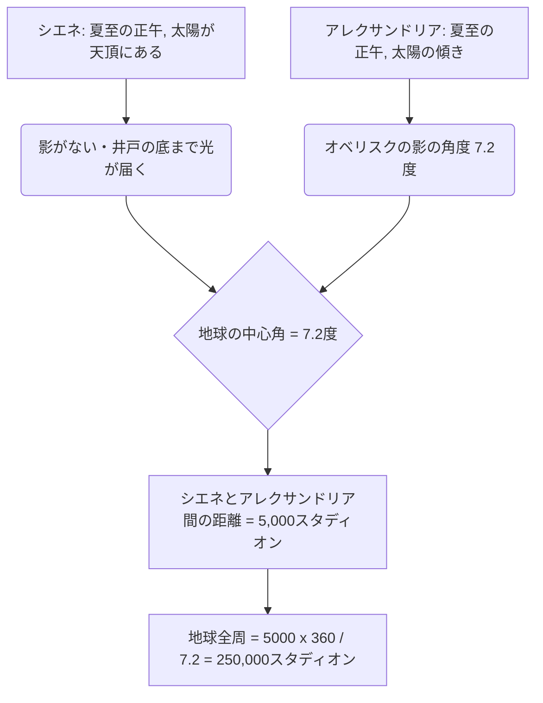
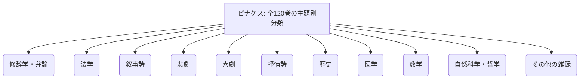
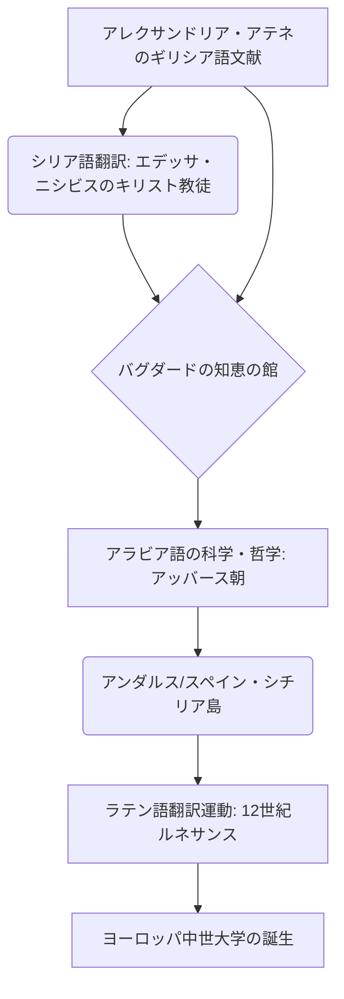

# はじめに：失われた古代の記憶と知の殿堂

歴史上、人類が知識を集積し、体系化し、そして無残にも失ってきた過程において、エジプトの「アレクサンドリア図書館（Great Library of Alexandria）」ほど、人々の想像力を掻き立て、ロマンと悲哀を感じさせる存在はないでしょう。古代地中海世界のあらゆる叡智が集められたこの巨大な知識の神殿は、単なる書物の保管庫ではありませんでした。それは最先端の学術研究所であり、異文化が交差するコスモポリスであり、そして何よりも「知の帝国主義」の結晶でした。

本稿では、古代地中海史、古典文献学、書物史、図書館情報学という複数の学問的視座を交差させながら、アレクサンドリア図書館の誕生から繁栄、そして破壊の謎から中世・近代へと至る知の継承史を、かつてないほどの詳細さと学術的深みをもって描き出します。

---

## 第1章：アレクサンドロス大王の野望とヘレニズム世界の誕生

### アレクサンドリアの建設と地中海世界の再編

紀元前332年、マケドニアの若き征服者アレクサンドロス大王は、エジプトを無血開城させ、ナイル川デルタの西端、地中海に面した漁村ラコティスの地に自らの名を冠した新首都「アレクサンドリア」の建設を命じました。大王の主任建築家ディノクラテスによって設計されたこの都市は、ギリシアの都市計画に見られるヒッポダモス方式（直交路網）を採用し、地中海とマレオティス湖に挟まれた細長い地形を最大限に生かした、東西に延びる壮麗な大通り（カノポス通り）を主軸としていました。

アレクサンドリアは、単なるエジプトの首都にとどまらず、ギリシア・マケドニアの世界（ヘラス）とオリエントの世界を融合させる「ヘレニズム（Hellenism）」文化の心臓部として機能することが期待されていました。大王自身は都市の完成を待たずに東方遠征へと旅立ち、バビロンで客死しますが、彼の遺志と巨大な帝国は、ディアドコイ（後継者）たちによって分割されます。エジプトを掌握したのは、大王の幼なじみであり側近であったプトレマイオス1世ソーテール（救済者）でした。

### プトレマイオス1世の文化政策と「知の帝国主義」

プトレマイオス朝を開いたプトレマイオス1世は、軍事的な支配だけでは巨大な多民族国家を統治できないことを深く理解していました。彼は、アテネに代わる新たな世界の文化的中心をアレクサンドリアに築くことを決意します。その中核をなしたのが、「世界のすべての書物を一堂に集める」という途方もない構想でした。

この構想の理論的支柱となったのが、アテネから亡命してきたアリストテレス学派（逍遥学派）の哲学者デメトリオス・ファレレウスです。デメトリオスはアテネの僭主として10年間にわたり国政を担った経験と、アリストテレスのリュケイオン（学園）の蔵書構築に関する知識を併せ持っていました。彼はプトレマイオス1世に対し、単なる武力による支配ではなく、あらゆる民族の記録、法律、思想、科学を収集し、翻訳し、研究することこそが、真の普遍帝国の条件であると進言しました。

これは「知の帝国主義（Intellectual Imperialism）」と呼ぶべきものでした。かつてアケメネス朝ペルシアやアッシリアの王たち（例えばアッシュールバニパル王のニネヴェ図書館）も文書庫を持ちましたが、プトレマイオス朝のそれは規模も目的も次元が異なっていました。彼らは、既知の世界のすべての言語（ギリシア語、エジプト語、ヘブライ語、ペルシア語など）の文献を集め、ギリシア語に翻訳・統合することを目指したのです。旧約聖書のギリシア語訳である『七十人訳聖書（セプトゥアギンタ）』がアレクサンドリアで作成されたという伝説（アリステアスの手紙）も、この普遍的な知識収集政策の文脈に位置づけられます。

---

## 第2章：王立研究所ムセイオン（Museion）の全貌

### 学術神殿としての構造と学者の特権

私たちが今日「アレクサンドリア図書館」と呼んでいるものは、独立した建物ではなく、「ムセイオン（Museion）」と呼ばれる王立の巨大な学術・研究機関群の一部、あるいはその付属施設でした。「ムセイオン」とは文字通り「ムーサ（文芸を司る9人の女神）の神殿」を意味し、現代の「ミュージアム（博物館）」の語源となっています。

地理学者のストラボンは、ムセイオンが王宮の敷地（ブルケイオン地区）に隣接し、散策路（ペリパトス）、談話室（エクセドラ）、そして学者たちが共同で食事をとるための大食堂（シュッシティオン）を備えていたと記録しています。ムセイオンは、現代の高等研究所や大学院大学（例えばプリンストン高等研究所）の原型とも言えます。

ここに招かれた学者たち（王室の研究員）には、驚くべき特権が与えられていました。彼らは王室から多額の終身年金を支給され、一切の税金を免除され、無料で住居と食事が提供されました。彼らの唯一の義務は、知識の探求、著作活動、そして時には王族の子弟の教育を行うことでした。この全寮制の学術共同体には、最盛期には100人以上の世界トップクラスの学者が集結し、昼夜を問わず議論と研究に没頭していました。

### 究極の文献校訂と校訂記号の発明

ムセイオンにおける最も重要な事業の一つが、ホメロスなどの古典文学のテキストの確定でした。当時の手抄きのパピルス巻物には、書写生による誤記、脱落、あるいは役者たちによる勝手な加筆が蔓延していました。

初代図書館長であるエフェソスのゼノドトス、ビザンティウムのアリストファネス、そしてサモトラケのアリスタルコスといった歴代の文献学者たちは、複数の異なる写本を比較検討し、最も本来の形に近いテキストを復元する「文献校訂（Textual Criticism）」の学問を確立しました。

彼らは、テキストの余白に特殊な校訂記号を書き込むシステムを発明しました。
- **オベリスク（Obelus, – または ÷）**: 偽作や後代の加筆と疑われる行を示す。
- **アステリスク（Asterisk, ※）**: 繰り返しや誤って挿入されたが、本来は他の場所にあるべき重要な行を示す。
- **ディプレ（Diple, >）**: 注釈すべき重要な箇所や、文法的に興味深い箇所を示す。

これらの記号によるメタデータの付与は、現代のマークアップ言語（XMLやHTML）の思想の萌芽とも言える、画期的な情報処理技術でした。

### 科学の黄金時代：エラトステネスとアルキメデス

ムセイオンは人文科学だけでなく、自然科学の分野でも人類史に残る業績を上げました。

**エラトステネスの地球全周測定**
第3代図書館長を務めたキュレネのエラトステネスは、驚くべき幾何学的洞察によって地球の大きさを計算しました。彼は、夏至の日の正午、エジプト南部の都市シエネ（現在のアスワン）では深い井戸の底まで太陽の光が届く（太陽が天頂に来る）ことを知りました。一方、同日の同じ時刻、真北に位置するアレクサンドリアでは、日時計のオベリスクの影の角度から、太陽が天頂から約7.2度（全円周360度の50分の1）傾いていることを測定しました。

エラトステネスは、アレクサンドリアとシエネの距離が5,000スタディオン（ラクダの隊商の移動日数から推測）であることをもとに、以下の比例式を立てました。
`7.2度 : 360度 = 5,000スタディオン : 地球の全周`
計算の結果、地球の全周は250,000スタディオンと算出されました。1スタディオンを約157.5メートル（エジプトのスタディオン）と仮定すると、約39,375キロメートルとなり、実際の地球の赤道周囲（約40,075キロメートル）と比べて誤差わずか2%未満という驚異的な精度でした。

**解剖学と幾何学**
医学分野では、カルケドンのヘロフィロスとケオス島のエラシストラトスが、ムセイオンの保護の下、人類史上初となる人体解剖（一説には死刑囚の生体解剖）を体系的に行いました。ヘロフィロスは脳が知性の座であることを証明し、神経系を運動神経と感覚神経に分類、さらに血液の脈拍と心臓のポンプ機能の関連性を指摘しました。

また、アレクサンドリアで学び、あるいはムセイオンの学者たちと文通を通して交流したのが、シラクサのアルキメデスです。彼はナイル川の治水にも使われた「アルキメデスの螺旋揚水機」を考案し、浮力の原理や、取り尽くし法による円周率の計算、放物線の求積などを行いました。『原論』を著し幾何学を体系化したエウクレイデス（ユークリッド）も、アレクサンドリアでプトレマイオス1世に「幾何学に王道なし」と語ったと伝えられています。

---

## 第3章：書物収集の狂気と蔵書目録の革命

### 手段を選ばない書物収集：港の没収とアテネの悲劇

ムセイオンの図書館を充実させるため、プトレマイオス朝の歴代の王たちは、時に狂気とも言える強引な手段で書物をかき集めました。アレクサンドリアの図書館は、単に本を買うだけでなく、国家権力を発動したシステムによって蔵書を爆発的に増やしていったのです。

最も有名な手法が「船舶の書物（ek ploion）」と呼ばれる検閲と没収の強制徴用システムです。地中海交易の中心であったアレクサンドリア港に入港するすべての商船や客船は、エジプトの税関役人による厳しい臨検を受けました。積荷の中に書物（パピルスの巻物）が見つかれば、それが誰のものであろうと即座に没収されました。没収された書物は図書館の筆写室（スクリプトリウム）に送られ、専門の書記たちによって昼夜を徹して素早く精巧な写本が作成されました。そして、驚くべきことに、元の持ち主には「新たに作成された写本」の方が返却され、「原本（オリジナル）」は図書館の蔵書として永久に収蔵されたのです。写本には「〜船から没収されたもの」という来歴（プロヴェナンス）タグが付けられました。

さらに、プトレマイオス3世エウエルゲテスの時代の有名な外交的詐欺エピソードがあります。王はアテネ政府に対し、ギリシアの三大悲劇詩人（アイスキュロス、ソフォクレス、エウリピデス）の「国家公認の公式原本」の貸し出しを要求しました。これらの原本は、アテネの国家公文書館に厳重に保管されていた神聖な文化遺産でした。アテネ側は貸し出しの条件として、15タラントン（現在の価値で数十億円相当とも言われる）という莫大な現金保証金を要求しましたが、プトレマイオス3世はあっさりとこれを支払いました。しかし、原本がアレクサンドリアに到着すると、王は最も優秀な書記に最高級のパピルスで精巧な写本を作成させ、その写本の方をアテネに送り返しました。王は15タラントンの保証金はそのままアテネに没収されるに任せ（事実上の超高額な買い取り）、貴重な原本を図書館の至宝として奪い取ったのです。これはヘレニズム時代の超大国による、文化資本の強奪事件でした。

### カリマコスと『ピナケス』：世界初の総合図書分類目録の誕生

このような手段を選ばない収集の結果、アレクサンドリア図書館の蔵書数は、本館（ブルケイオン地区）で数十万巻（一説には50万巻から70万巻）、セラペウムの分館で4万巻以上に達したと伝えられています。これほど巨大な情報量になると、もはや人間の記憶や物理的な配置だけでは、目当ての文献を見つけ出すことは不可能です。単なる巻物の山を「知識のデータベース」へと変えるための「検索システム（情報検索アーキテクチャ）」が不可欠となりました。

この図書館情報学における史上最大のブレイクスルーを成し遂げたのが、キュレネ出身の詩人にして天才的な学者であるカリマコス（紀元前310年頃 - 前240年頃）です。彼は正式な図書館長には就任しなかったとされていますが、図書館の蔵書管理の実質的な責任者でした。

カリマコスは、図書館の全蔵書を網羅した120巻にも及ぶ巨大な目録『ピナケス（Pinakes：文字通り「書板」、正式名称は「あらゆる学問分野で活躍した人々とその著作の目録」）』を作成しました。これは単なる所蔵リスト（インベントリ）ではなく、人類初の体系的な「主題別分類目録（サブジェクト・カタログ）」でした。

『ピナケス』の分類体系は、大分類（メイン・クラス）として以下のカテゴリーを設定していました。

さらに、カリマコスの天才性は、この大分類の下に精緻な書誌情報（メタデータ）を付与した点にあります。各カテゴリーの中で、著者はアルファベット順に配列され、以下のような構造化データが記述されていました。

- **著者名と伝記**: 著者の名前、出身地、父親の名前、師匠の名前、簡単な経歴（バイオグラフィー）。これは同姓同名の著者を識別するための典拠コントロール（Authority Control）として機能しました。
- **著作のタイトル**: タイトルがない場合は内容に基づく仮のタイトルが付与されました。
- **インキピット（書き出し）**: 各著作の最初の数語から最初の一行。古代のパピルス巻物にはタイトルが失われていることが多かったため、本文の出だしで作品を特定する（ハッシュ値のような役割）手法です。
- **巻数と総行数（スティコメトリー）**: 著作全体の巻数と、正確なテキストの行数。行数の記録は、筆写生（スクリプトル）に支払う報酬の計算の基準となると同時に、テキストが後から改ざんされたり、ページが脱落したりしていないかを検証するための「チェックサム（整合性検証）」の役割を果たしました。

カリマコスのこの情報整理のアーキテクチャは、中世の修道院図書館の目録を経て、現代の図書館のデューイ十進分類法（DDC）やOPAC（オンライン蔵書目録）、さらにはリレーショナル・データベースの構造へと直接的に繋がる、本質的で普遍的な情報処理技術の始祖と言えます。

---

## 第4章：パピルス巻物（Volumen）の物質性と書写技術：古代のメディア環境と計量書誌学

### ナイルの賜物と書写のインフラストラクチャー

アレクサンドリア図書館の繁栄を物質的な側面から根底で支えていたのが、「パピルス（Papyrus）」という記録媒体です。ナイル川デルタの湿地帯に自生するカヤツリグサ科の抽水植物（Cyperus papyrus）から作られるこの紙は、古代地中海世界において、粘土板や獣皮を凌駕する最高の情報記録メディアでした。大プリニウスが『博物誌』の中で詳述しているように、パピルスの製造工程は高度に専門化された手工業でした。

まず、植物の太い茎（トライアングル状の断面を持つ）の表皮を剥ぎ取り、内部の髄（ピス）を針や薄い刃物で縦に薄くスライスします。この薄いリボン状の細長い片（フィリューラ）を、湿らせた木の板の上に隙間なく並べ、その上にもう一層、今度は直角に交差するように並べます。ナイル川の泥水や特別に調合された接着剤（あるいは植物自体の粘液）を用いながら、木槌で全体を激しく叩いて圧着させ、天日で乾燥させることで、薄く、軽く、柔軟で、かつ耐久性のある一枚のシート（コッレーマ）が完成します。最高品質のパピルスは「ヒエラティカ（神官用）」あるいはアウグストゥス帝の名を冠した「アウグスタ」と呼ばれ、白く滑らかで極めて高価でした。

これらのシートを、小麦粉の糊で次々と繋ぎ合わせることで、長い「巻物（Volumen、ギリシア語でビブリオン）」が作られました。一般的な巻物は、20枚程度のコッレーマを繋ぎ合わせたもの（スカルポス）が標準的な販売単位として市場に流通していました。

筆記具には、カラムスと呼ばれる硬い葦の茎の先を割ったペンが使われました。エジプト古来のイグサの筆（ブラシ）とは異なり、ギリシア語のアルファベットをシャープに記すために先が鋭くカットされていました。インク（アトランメンタム）は、煤（すす）とアラビアゴム、水を混ぜて作られた炭素インクが主流でした。このインクは紙の繊維の表面に付着するだけで内部まで浸透しないため、海綿（スポンジ）で簡単に洗い落として再利用することができましたが、同時に化学的に極めて安定していたため、数千年の時を経た現在でも砂漠の乾燥地帯で発見されるパピルスは黒々とした文字を保っています。重要な見出しや装飾、あるいは読解を助けるためのルビや校訂記号には、赤色のインク（酸化鉄や硫化水銀である朱）が用いられました。

### 巻物の限界と計量書誌学的制約：文字数と行数の幾何学

しかし、パピルス巻物というフォーマットには、情報技術としての物理的な限界が存在しました。
1. **長さと重さの制約**: 巻物が長すぎると、重くて取り回しが悪く、巻き開く（エクスプリカーレ）際にパピルスが疲労し破損しやすくなります。実用的な限界は長さ約10メートル程度で、これはホメロスの『イリアス』の1巻分（約700〜900行）に相当しました。カリマコスが「大著は大きな災いである（Mega biblion, mega kakon）」という有名な言葉を残したのは、ヘレニズム文学特有の洗練された簡潔さを好んだという美学的な理由だけでなく、巻物の物理的な取り扱いの煩雑さと劣化のしやすさを実務家の視点から指摘したものでもあります。長大な歴史書などは、必然的に複数の巻物（トモス）に分割して保存・管理せざるを得ませんでした。
2. **ランダムアクセスの困難さ**: 巻物は最初から最後まで順番にスクロールして読む「シーケンシャル・アクセス」のメディアであり、特定のページや行（例えば第7巻の真ん中の特定のパラグラフ）に瞬時に飛ぶ「ランダム・アクセス」が極めて困難でした。これは、学者が複数の文献を同時に開いて比較参照する（相互参照・クロスリファレンス）作業において、巨大な認知負荷と時間的コストを強いるものでした。
3. **コリュンボスのレイアウト規則**: 巻物の上には、文字が連続したブロック（コリュンボスと呼ばれる縦長の段落・コラム）として書かれました。各段落の幅は約5〜8センチメートル、行間は均等に保たれ、単語間の空白（分かち書き）は存在せず、文字が連続して書かれる「スクリプティオ・コンティヌア（連続書字）」が一般的でした。これは読者に高度な音読のスキルを要求するものでした。
4. **保管と管理（カルトゥーシュとシリュボス）**: 巻物は、オンパロスと呼ばれる木の軸（ローラー）に巻き付けられ、カプサ（円筒形のケース）に立てて保管されるか、ピット（棚）に横積みされました。中身を外から識別するために、巻物の端には「シリュボス（Sillybos）」と呼ばれる小さな羊皮紙やパピルスのタグが取り付けられ、そこに著者名とタイトルが書かれていました。これは今日の背表紙の役割を果たしていましたが、頻繁な出し入れで千切れやすいという弱点がありました。

### コデックス（冊子本）への移行とメディア転換のコスト

紀元後2世紀から4世紀にかけて、キリスト教の爆発的な普及とともに、パピルス巻物から「コデックス（Codex：冊子本）」へのパラダイムシフト（人類史における最大のメディア革命の一つ）が起こります。羊皮紙（パーチメント）やパピルスを二つ折りにして束ね、背を糸で綴じたコデックスは、表裏両面（レクトとヴェルソ）に無駄なく書き込めるため情報密度が高く（物理的体積の削減）、何よりも特定のページをパッと開くことができる（ランダムアクセスの実現と栞の活用）という圧倒的な優位性がありました。

アレクサンドリア図書館の末期には、このメディアの転換期において、膨大な巻物の蔵書を新しいコデックスの形式に書き換える作業（フォーマット・マイグレーション）という莫大なコストに直面したはずです。この書き換え作業から漏れた文献、すなわち「コデックス化されなかった巻物」は、やがて時代遅れとなり、読まれなくなり、湿気や虫害によって永遠に失われる運命を辿りました。図書館における蔵書の選択と淘汰が、歴史上のテキストの生存率を決定づけることになったのです。

---

## 第5章：破壊の神話と真実：何が図書館を滅ぼしたのか？

アレクサンドリア図書館が「いつ、誰によって破壊されたのか」という問いは、歴史上の最大のミステリーの一つであり、しばしば一つのドラマチックな大火災によって一瞬にして灰燼に帰したという「神話」として語られがちです。しかし、現代の歴史学と考古学は、図書館の消滅が単一の事件ではなく、数世紀にわたる複数の破壊と衰退のプロセスの結果であることを示しています。

### 1. 紀元前48年：ユリウス・カエサルとアレクサンドリア戦争

最も有名な破壊の伝説は、ローマの将軍ユリウス・カエサルによるものです。ポンペイウスを追ってエジプトに上陸したカエサルは、クレオパトラ7世に加担してアレクサンドリア戦争を戦いました。自軍の艦隊がプトレマイオス朝の艦隊に奪われるのを防ぐため、カエサルは港の船に火を放ちました。プルタルコスなどの後代の歴史家は、この火災が港から陸地へと延焼し、大図書館（あるいは港の倉庫にあった数十万巻の書物）を焼き尽くしたと伝えています。
しかし、カエサル自身の『内乱記』には図書館の焼失についての言及はありません。また、その数十年後にストラボンがアレクサンドリアを訪れた際、ムセイオンの施設は依然として機能していました。したがって、カエサルの火災で失われたのは、図書館の「分館」や、輸出入のために港の倉庫に保管されていた書物の一部であった可能性が高いと考えられています。

### 2. 西暦270年代：アウレリアヌス帝による都市の徹底破壊

図書館の本体に決定的な打撃を与えたと考えられるのが、西暦3世紀後半のローマ帝国の内乱です。パルミラ王国のゼノビアがアレクサンドリアを占領し、その後ローマ皇帝アウレリアヌスが都市を奪還するための激しい市街戦が行われました。
この戦闘において、王宮地区（ブルケイオン）全体が徹底的に破壊され、荒廃しました。ムセイオンと大図書館も、この時に建物ごと完全に破壊され、蔵書も四散・焼失したとするのが、現代の歴史学において最も有力な見解です。

### 3. 西暦391年：テオドシウス帝とキリスト教徒によるセラペウム破壊

大図書館の消滅後も、アレクサンドリアの南西部にあるサラピス神の巨大な神殿「セラペウム（Serapeum）」には、図書館の分館（姉妹館）が存在し、学問の命脈を保っていました。
しかし、ローマ皇帝テオドシウス1世がキリスト教を国教化し、異教の神殿の破壊令を出します。これを受けて、アレクサンドリアの強硬派のキリスト教司教テオフィロスと熱狂的な修道士の群衆がセラペウムを襲撃し、壮麗な神殿を破壊し尽くしました。この時、神殿内に保管されていたパピルスの巻物も、異教の邪悪な書物として焚書にされたと推測されています。この事件は、後年（西暦415年）に起こる女性数学者ヒュパティアの惨殺事件とともに、古代における自由な知的探求の終焉を象徴する悲劇として語り継がれています。

### 4. 西暦642年：イスラム征服とカリフ・ウマルの伝説

13世紀のキリスト教徒やアラブ人の年代記作家たちによって創り出された最もセンセーショナルな神話が、イスラム軍による破壊伝説です。アラブの将軍アムル・イブン・アル＝アースがアレクサンドリアを征服した際、カリフ・ウマル・イブン・アル＝ハッターブに図書館の書物の処遇を尋ねました。ウマルはこう答えたとされます。
「もしそれらの書物がコーランと一致するなら、コーランがあるから不要である。もしコーランに反するなら、有害である。ゆえにすべて燃やしてしまえ」
そして、蔵書はアレクサンドリアにある4,000の公衆浴場のボイラーの燃料として分配され、半年間燃え続けたというのです。
しかし、現代の研究者はこのエピソードを完全なフィクション（後代の捏造）と断定しています。なぜなら、7世紀のイスラム征服の時点では、数百年にも及ぶ戦乱、予算の枯渇、そしてパピルスの自然劣化（湿気の多い海辺の気候ではパピルスは数百年で朽ちる）により、かつての大図書館はすでに跡形もなく消え去っていたからです。

---

## 第6章：知の避難と中世・ルネサンスへの大航海：人類の記憶のサバイバル

アレクサンドリアの物理的な建物とパピルスは灰に帰し、土に還りました。しかし、そこで培われた「古代の叡智」のDNAは、完全に途絶えたわけではありませんでした。驚くべき数世紀にわたる知的リレーによって、その一部はシリア、ペルシア、アラビア半島、北アフリカ、イベリア半島を経由して、現代の私たちへと至る長大な航海を成し遂げたのです。

### シリア語からアラビア語へ：バグダードの知恵の館と大翻訳運動

5世紀から6世紀にかけて、ビザンツ帝国におけるキリスト教正統派（カルケドン派）の異端弾圧を逃れたネストリウス派や単性論派の学者たちは、東方のシリアやササン朝ペルシアへと避難しました。特にエデッサ（現在のウルファ）やニシビス、そしてペルシアのジュンディーシャープールの医学校は、ギリシアの学問を継承する新たな拠点となりました。彼らは、アリストテレスの論理学（『オルガノン』）、ガレノスとヒポクラテスの医学、プトレマイオスの天文学（『アルマゲスト』）などの難解なギリシア語文献を、まずシリア語（アラム語の一方言）に翻訳しました。これが中東におけるギリシア知の第一の橋渡しとなります。

その後、8世紀にイスラム帝国アッバース朝が興り、カリフ・アル＝マンスールやアル＝マアムーンらは、新首都バグダードに「バイト・アル＝ヒクマ（知恵の館）」という巨大な翻訳・研究機関を設立しました。これはまさに「第二のムセイオン」とも呼べる国家的プロジェクトでした。

ここで、フナイン・イブン・イスハーク（ネストリウス派キリスト教徒のアラブ人）をはじめとする天才的な翻訳家たちが、シリア語からアラビア語へ、あるいはギリシア語から直接アラビア語への前代未聞の大規模な翻訳運動（ギリシア・アラビア翻訳運動）を展開しました。フナインは単なる直訳ではなく、テキストの校訂（複数の写本を比較して正確な意味を確定させる、アレクサンドリアの文献学的手法）を行った上で、アラビア語に新しい哲学・科学の専門用語（例えば「質」「量」「本質」などの抽象概念）を創造しました。

アレクサンドリアの知は、イスラム世界という新たな沃野で花開き、独自の進化を遂げました。アル＝フワーリズミー（代数学の父）、アル＝キンディー（アラブ哲学の祖）、イブン・スィーナー（ラテン名アヴィケンナ、医学典範の著者）、そしてイブン・ルシュド（ラテン名アヴェロエス、アリストテレスの究極の注釈者）といったイスラムの大学者たちは、ギリシアの知識を吸収するだけでなく、それを批判的に乗り越え、世界最高峰の科学技術水準を築き上げました。

*(※上記はギリシア・アラビア・ラテン翻訳運動の系統図)*

### ビザンツ帝国の写本保存とイタリア・ルネサンスへの還流

一方、ギリシア語圏に留まった知の系譜もあります。東ローマ帝国（ビザンツ帝国）の首都コンスタンティノープルや、アトス山の修道院では、修道士たちによってギリシア語の古典文献が羊皮紙のコデックスに延々と筆写され、保存されていました。9世紀には「マケドニア朝ルネサンス」と呼ばれる古典復興が起こり、フォティオス総主教の『ビブリオテケ（読書録）』や、『スーダ（ギリシア語の巨大な百科事典）』などが編纂され、古代の知識が要約・保存されました。

12世紀の「12世紀ルネサンス」において、イスラム世界（スペインのトレドや南イタリアのシチリア）からアラビア語経由でラテン語に翻訳された知識が西欧に流入し、パリやボローニャにおけるヨーロッパの大学（ウニヴェルシタス）の誕生を促しました。

さらに、1453年にコンスタンティノープルがオスマン帝国によって陥落すると、ゲオルギオス・ゲミストス・プレトンをはじめとする多くのビザンツの学者たちが、貴重なギリシア語写本（プラトン全集など）を抱えてイタリア半島へと亡命しました。これが、メディチ家が支配するフィレンツェや、活版印刷が発展するヴェネツィアにおけるギリシア古典の直接的な再発見を引き起こし、人文主義（ヒューマニズム）に基づくイタリア・ルネサンスを力強く牽引する原動力となったのです。

### 現代のデジタルアレクサンドリアへの問いと永遠の課題

今日、2002年にエジプト政府とユネスコの協力によって、かつての図書館の跡地近くに巨大な円盤型の新図書館「ビブリオテカ・アレクサンドリナ（新アレクサンドリア図書館）」が建設され、象徴的な復活を遂げました。

また、インターネットのサイバー空間には「インターネット・アーカイブ（Internet Archive）」のような、世界のすべてのウェブページ、書籍、動画をデジタル化して保存しようとする現代版の「アレクサンドリアの夢」が存在しています。Google Booksのプロジェクトも、まさにプトレマイオス朝の知の帝国主義の現代的発露と言えるでしょう。

しかし、私たちは古代の図書館の運命から重い教訓を学ぶ必要があります。記録媒体がパピルスからシリコンチップやクラウドストレージへと変わり、データの総量がエクサバイト規模に膨れ上がったとしても、知識の保存と継承を脅かす本質的なリスクは変わっていません。戦争やテロリズム、独裁的な政治イデオロギーによる検閲、プロジェクト資金の枯渇、そして何よりも「フォーマットの陳腐化（デジタル・ダークエイジの危機）」という問題です。ソフトウェアやハードウェアが数年で規格遅れになる現代において、500年後、1000年後に現在のデジタルデータを誰がどのように読むことができるのか、確実な答えはありません。

アレクサンドリア図書館の興亡史は、人類が知識を集め、守り、伝えていくという営みがいかに脆く、同時にいかに強靭な意志と継続的な努力（写本から写本への絶え間ない転写）を必要とするかを、数千年の時を超えて私たちに深く語りかけているのです。

---
