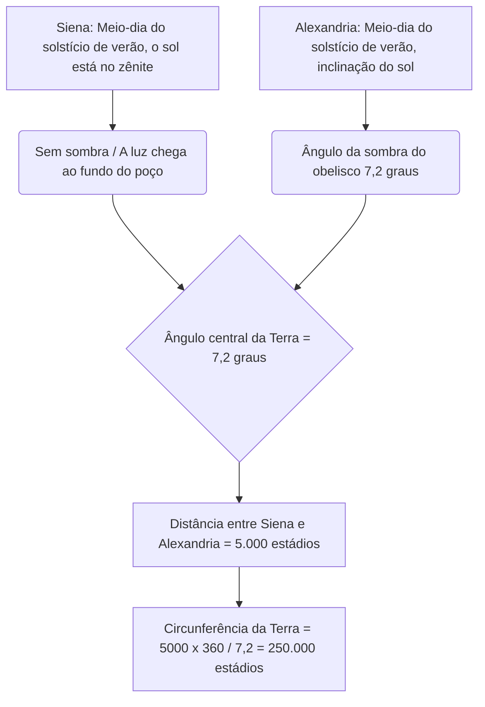
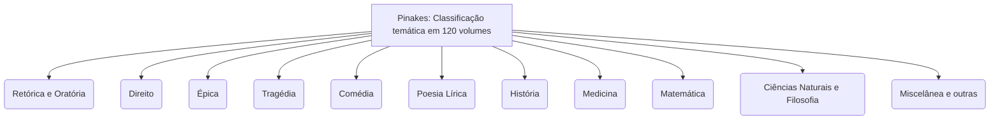
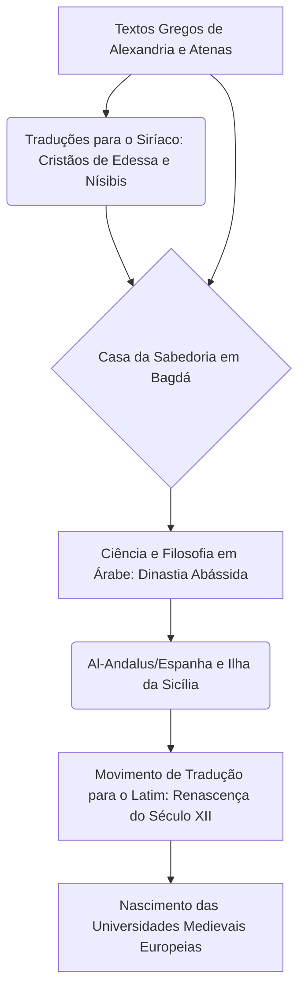

# Introdução: As Memórias Perdidas da Antiguidade e o Templo do Conhecimento

Ao longo da história, no processo em que a humanidade acumulou, sistematizou e, tragicamente, perdeu conhecimento, não há nada que estimule mais a imaginação e evoque tanto um sentimento de romance e tristeza quanto a "Grande Biblioteca de Alexandria", no Egito. Este gigantesco templo de conhecimento, que reunia toda a sabedoria do antigo mundo mediterrâneo, não era apenas um repositório de livros. Era um instituto de pesquisa de ponta, uma cosmópole onde diferentes culturas se cruzavam e, acima de tudo, a cristalização do "imperialismo do conhecimento".

Neste artigo, ao cruzar as perspectivas acadêmicas da história do antigo Mediterrâneo, filologia clássica, história do livro e biblioteconomia, descreveremos com detalhes e profundidade acadêmica sem precedentes a história da transmissão do conhecimento — desde o nascimento e prosperidade da Biblioteca de Alexandria, passando pelo mistério de sua destruição, até chegar à Idade Média e à era moderna.

---

## Capítulo 1: A Ambição de Alexandre, o Grande e o Nascimento do Mundo Helenístico

### A Construção de Alexandria e a Reorganização do Mundo Mediterrâneo

Em 332 a.C., o jovem conquistador macedônio Alexandre, o Grande, fez o Egito se render sem derramamento de sangue e ordenou a construção de uma nova capital com o seu nome, "Alexandria", no local da vila de pescadores Rhacotis, de frente para o Mar Mediterrâneo, no extremo oeste do Delta do Nilo. Projetada por Dinócrates, arquiteto-chefe do rei, a cidade adotou o sistema hipodamiano (rede ortogonal) visto no planejamento urbano grego, e tinha como eixo principal uma magnífica avenida estendendo-se de leste a oeste (a Avenida Canópica), tirando o máximo proveito da estreita faixa de terra imprensada entre o Mar Mediterrâneo e o Lago Mareotis.

Alexandria deveria funcionar não apenas como a capital do Egito, mas como o coração da cultura do "Helenismo", que fundiu o mundo greco-macedônio (Hellas) com o mundo oriental. O próprio Alexandre partiu para suas campanhas orientais antes da conclusão da cidade e morreu na Babilônia, mas sua vontade e seu vasto império foram divididos pelos Diádocos (sucessores). O Egito foi tomado por Ptolomeu I Sóter (o Salvador), amigo de infância e assessor próximo do rei.

### A Política Cultural de Ptolomeu I e o "Imperialismo do Conhecimento"

Ptolomeu I, que fundou a dinastia ptolomaica, compreendeu profundamente que não poderia governar uma vasta nação multiétnica apenas com o domínio militar. Ele decidiu construir em Alexandria um novo centro cultural mundial para substituir Atenas. O núcleo disso foi a ideia extraordinária de "reunir todos os livros do mundo em um só lugar".

O pilar teórico desse conceito foi Demétrio de Faleros, um filósofo da escola aristotélica (escola peripatética) que estava exilado de Atenas. Demétrio tinha a experiência de ter servido nos assuntos de Estado durante dez anos como tirano de Atenas, bem como o conhecimento sobre a construção da coleção de livros do Liceu de Aristóteles. Ele aconselhou a Ptolomeu I que a condição de um império verdadeiramente universal não era apenas a dominação por força militar, mas sim coletar, traduzir e estudar os registros, leis, ideias e ciências de todos os povos.

Isso poderia ser chamado de "Imperialismo do Conhecimento" (Intellectual Imperialism). Reis dos antigos impérios persa aquemênida e assírio (por exemplo, a Biblioteca de Nínive do Rei Assurbanípal) também possuíam arquivos, mas a dinastia ptolomaica tinha uma escala e um propósito totalmente diferentes. Eles pretendiam coletar literaturas de todas as línguas do mundo conhecido (grego, egípcio, hebraico, persa, etc.) e traduzi-las e integrá-las ao grego. A lenda de que a tradução grega do Antigo Testamento, a "Septuaginta", foi criada em Alexandria (segundo a Carta de Aristeias) também se insere no contexto dessa política universal de coleta de conhecimento.

---

## Capítulo 2: O Quadro Completo do Instituto de Pesquisa Real Museion

### A Estrutura como um Templo Acadêmico e os Privilégios dos Eruditos

O que hoje chamamos de "Biblioteca de Alexandria" não era um edifício independente, mas sim parte de um enorme complexo de instituições de estudo e pesquisa reais chamado "Museion" (ou um centro anexo a ele). "Museion" significa literalmente "o templo das Musas (as nove deusas que presidem as artes)" e é a origem da palavra moderna "museu".

O geógrafo Estrabão registra que o Museion ficava adjacente aos terrenos do palácio real (no bairro de Bruchion) e era equipado com passeios (peripatos), salas de conversação (exedras) e um grande refeitório (syssition) para os estudiosos fazerem suas refeições juntos. O Museion pode ser considerado o protótipo dos modernos institutos de estudos avançados ou universidades de pós-graduação (como o Instituto de Estudos Avançados de Princeton).

Os eruditos convidados para cá (pesquisadores reais) recebiam privilégios surpreendentes. Recebiam polpudas pensões vitalícias da família real, eram isentos de todos os impostos e recebiam alojamento e alimentação gratuitos. As suas únicas obrigações eram a busca pelo conhecimento, a escrita e, ocasionalmente, a educação dos filhos da família real. No seu auge, esta comunidade acadêmica residencial reuniu mais de 100 dos melhores estudiosos do mundo, que se dedicavam às discussões e à pesquisa dia e noite.

### A Edição Definitiva de Textos e a Invenção das Marcas Críticas

Uma das empreitadas mais importantes do Museion foi o estabelecimento dos textos da literatura clássica, como Homero. Naquela época, os rolos de papiro manuscritos eram repletos de erros de escrita, omissões feitas por copistas ou adições arbitrárias feitas por atores.

Sucessivos estudiosos de filologia, como o primeiro diretor da biblioteca, Zenódoto de Éfeso, Aristófanes de Bizâncio e Aristarco da Samotrácia, estabeleceram a disciplina de "Crítica Textual" (Textual Criticism), comparando e examinando múltiplos manuscritos diferentes para restaurar o texto à sua forma mais original.

Eles inventaram um sistema para inscrever marcas críticas especiais nas margens dos textos.
- **Obelus (– ou ÷)**: Indica uma linha suspeita de ser espúria ou uma interpolação posterior.
- **Asterisk (※)**: Indica uma linha importante que foi repetida ou inserida por engano, mas que originalmente pertence a outro lugar.
- **Diple (>)**: Indica uma passagem importante a ser anotada ou uma passagem de interesse gramatical.

A adição de metadados com estes símbolos foi uma tecnologia de processamento de informação revolucionária, que pode ser considerada o germe das ideias das linguagens de marcação modernas (como XML e HTML).

### A Idade de Ouro da Ciência: Eratóstenes e Arquimedes

O Museion obteve conquistas históricas não apenas nas ciências humanas, mas também no campo das ciências naturais.

**A Medição da Circunferência da Terra por Eratóstenes**
Eratóstenes de Cirene, que serviu como terceiro diretor da biblioteca, calculou o tamanho da Terra através de um impressionante raciocínio geométrico. Ele aprendeu que, ao meio-dia do solstício de verão, na cidade de Siena, no sul do Egito (atual Assuão), a luz do sol chegava ao fundo de poços profundos (o sol estava no zênite). Por outro lado, no mesmo horário do mesmo dia, em Alexandria, localizada diretamente ao norte, ele mediu, a partir do ângulo da sombra de um obelisco do relógio de sol, que o sol estava inclinado a cerca de 7,2 graus do zênite (um cinquenta avos de um círculo completo de 360 graus).

Eratóstenes, com base na distância entre Alexandria e Siena ser de 5.000 estádios (estimada a partir dos dias de viagem de uma caravana de camelos), estabeleceu a seguinte equação proporcional:
`7,2 graus : 360 graus = 5.000 estádios : circunferência total da Terra`
Como resultado do cálculo, a circunferência da Terra foi calculada como 250.000 estádios. Assumindo que 1 estádio equivale a cerca de 157,5 metros (o estádio egípcio), o resultado seria de cerca de 39.375 quilômetros, uma precisão surpreendente com um erro de menos de 2% em comparação com a circunferência equatorial real da Terra (cerca de 40.075 quilômetros).

**Anatomia e Geometria**
No campo da medicina, Herófilo da Calcedônia e Erasístrato da ilha de Ceos realizaram sistematicamente as primeiras dissecações do corpo humano na história da humanidade (segundo uma teoria, a vivissecção de criminosos condenados) sob a proteção do Museion. Herófilo provou que o cérebro era a sede da inteligência, classificou o sistema nervoso em nervos motores e sensoriais e também apontou a conexão entre a pulsação do sangue e a função de bomba do coração.

Além disso, quem estudou em Alexandria ou interagiu com os eruditos do Museion por meio de correspondência foi Arquimedes de Siracusa. Ele inventou o "Parafuso de Arquimedes" para bombear água, que também foi usado no controle de inundações do Nilo, e elaborou o princípio da flutuabilidade, o cálculo do pi através do método da exaustão e a quadratura da parábola. Conta-se também que Euclides, que escreveu "Os Elementos" e sistematizou a geometria, disse a Ptolomeu I em Alexandria que "não há estrada real para a geometria".

---

## Capítulo 3: A Loucura da Coleta de Livros e a Revolução dos Catálogos de Bibliotecas

### Coleta de Livros a Qualquer Custo: Confiscos no Porto e a Tragédia de Atenas

Para enriquecer a biblioteca do Museion, sucessivos reis da dinastia ptolomaica juntaram livros utilizando métodos coercivos, por vezes beirando a loucura. A Biblioteca de Alexandria expandiu explosivamente a sua coleção não apenas comprando livros, mas através de um sistema que mobilizava o poder do Estado.

O método mais famoso era um sistema de inspeção e confisco forçado, conhecido como "livros dos navios (ek ploion)". Todos os navios mercantes e de passageiros que entravam no porto de Alexandria, o centro do comércio no Mediterrâneo, passavam por rigorosas inspeções pelos funcionários da alfândega egípcia. Se livros (rolos de papiro) fossem encontrados na carga, eram imediatamente confiscados, não importando de quem fossem. Os livros confiscados eram enviados para as salas de cópia da biblioteca (scriptorium), onde escribas especialistas trabalhavam dia e noite para criar cópias rápidas e elaboradas. Surpreendentemente, os proprietários originais recebiam de volta a "cópia recém-criada", enquanto o "original" era mantido permanentemente como parte da coleção da biblioteca. As cópias recebiam uma etiqueta de proveniência, dizendo que haviam sido "confiscadas do navio de tal e tal".

Além disso, há um famoso episódio de fraude diplomática durante a época de Ptolomeu III Evérgeta. O rei exigiu do governo ateniense o empréstimo dos "manuscritos oficiais originais aprovados pelo Estado" dos três grandes poetas trágicos gregos (Ésquilo, Sófocles e Eurípides). Estes originais eram patrimônios culturais sagrados estritamente guardados nos arquivos estatais de Atenas. Como condição para o empréstimo, Atenas exigiu um enorme depósito em dinheiro de 15 talentos (que valeria dezenas de milhões de dólares no valor atual), que Ptolomeu III pagou prontamente. No entanto, quando os originais chegaram a Alexandria, o rei fez com que os seus melhores escribas criassem cópias requintadas no papiro de mais alta qualidade e enviou as cópias de volta a Atenas. O rei deixou Atenas confiscar o depósito de 15 talentos (efetivamente uma compra a um preço incrivelmente alto) e roubou os preciosos originais como os maiores tesouros de sua biblioteca. Tratou-se de um caso de extorsão de capital cultural por uma superpotência da era helenística.

### Calímaco e os "Pinakes": O Nascimento do Primeiro Catálogo Abrangente de Classificação de Livros do Mundo

Como resultado desta coleta indiscriminada, diz-se que o número de livros na Biblioteca de Alexandria atingiu várias centenas de milhares de rolos (uma teoria sugere de 500.000 a 700.000 rolos) no edifício principal (bairro Bruchion) e mais de 40.000 no anexo do Serapeu. Com uma quantidade tão gigantesca de informação, não é mais possível encontrar o documento desejado apenas com base na memória humana ou arranjo físico. Tornou-se essencial um "sistema de busca (arquitetura de recuperação de informações)" para transformar uma simples pilha de rolos em uma "base de dados de conhecimento".

Aquele que alcançou esse maior avanço na história da biblioteconomia foi o poeta e erudito genial de Cirene, Calímaco (c. 310 a.C. - 240 a.C.). Embora se diga que não tenha assumido formalmente o cargo de diretor da biblioteca, ele era o responsável na prática pela gestão do acervo da biblioteca.

Calímaco criou o massivo catálogo de 120 volumes "Pinakes" (que significa literalmente "tábuas"; o nome oficial era "Tabelas de pessoas eminentes em cada ramo do saber e a lista de seus escritos"), cobrindo todos os livros da biblioteca. Isto não era um simples inventário, mas sim o primeiro "catálogo de classificação temática (subject catalog)" sistemático da humanidade.

O sistema de classificação dos "Pinakes" estabelecia as seguintes categorias como classes principais:

Além disso, a genialidade de Calímaco reside no fato de ele ter atribuído informações bibliográficas refinadas (metadados) sob essas classificações principais. Dentro de cada categoria, os autores foram organizados alfabeticamente, e os seguintes dados estruturados foram descritos:

- **Nome do autor e biografia**: Nome do autor, local de nascimento, nome do pai, nome do professor e uma breve biografia. Isso funcionou como controle de autoridade (Authority Control) para distinguir autores com o mesmo nome.
- **Título da obra**: Caso não houvesse título, um título provisório era dado com base no conteúdo.
- **Incipit (palavras iniciais)**: As primeiras palavras ou a primeira linha de cada obra. Como os antigos rolos de papiro frequentemente perdiam seus títulos, esta era uma técnica (como uma função de hash) para identificar uma obra pelo começo de seu texto.
- **Número de rolos e número total de linhas (esticometria)**: O número de volumes (rolos) de toda a obra e o número exato de linhas do texto. O registro do número de linhas servia não apenas como base para o cálculo da remuneração a ser paga aos escribas (scriptores), mas também desempenhava um papel de "checksum (verificação de integridade)" para atestar se o texto havia sido adulterado posteriormente ou se faltavam páginas.

Esta arquitetura de organização da informação de Calímaco pode ser considerada a progenitora da tecnologia fundamental e universal de processamento de dados, que se conecta diretamente, através dos catálogos das bibliotecas monásticas medievais, à Classificação Decimal de Dewey (DDC) ou OPAC (Online Public Access Catalog) em bibliotecas modernas, e mesmo à estrutura dos bancos de dados relacionais.

---

## Capítulo 4: A Materialidade dos Rolos de Papiro (Volumen) e a Tecnologia da Escrita: O Antigo Ambiente de Mídia e a Bibliometria

### O Presente do Nilo e a Infraestrutura da Escrita

O que sustentou no fundo a prosperidade da Biblioteca de Alexandria a partir de um aspecto material foi o meio de registro conhecido como "Papiro" (Papyrus). Este papel, feito a partir da planta aquática (Cyperus papyrus) que cresce naturalmente nos pântanos do Delta do Nilo, foi a melhor mídia de gravação de informações do antigo mundo mediterrâneo, superando de longe as tábuas de argila ou pergaminhos (pele de animais). Como detalhado por Plínio, o Velho, em sua "História Natural", o processo de fabricação do papiro era um ofício altamente especializado.

Primeiro, a casca do caule grosso da planta (com sua seção transversal triangular) era removida e a medula interna era cortada verticalmente em fatias finas usando uma agulha ou uma lâmina fina. Essas tiras compridas e finas (filyra) parecidas com fitas, eram organizadas sem vãos em uma prancha de madeira umedecida e sobre ela uma segunda camada era colocada em ângulos retos. Com o uso de águas lamacentas do rio Nilo ou adesivos especialmente preparados (ou a própria mucilagem da planta), o todo era fortemente golpeado com um macete de madeira para ser comprimido. Após secar ao sol, completava-se uma única folha (kollema) fina, leve, flexível e ainda durável. O papiro da mais alta qualidade era chamado de "hierática (para uso sacerdotal)" ou "Augusta", em homenagem ao imperador Augusto, sendo branco, liso e extremamente caro.

As longas "leis" de livros (volumen, biblion em grego) foram feitas unindo essas folhas uma após a outra com uma cola feita de farinha de trigo. Um rolo típico consistia na junção de cerca de 20 folhas (scapus) e circulava no mercado como uma unidade de venda padrão.

A ferramenta de escrita usada era uma caneta chamada calamus, feita dividindo a ponta de uma haste rígida de junco. Ao contrário dos antigos pincéis de junco do Egito, era cortada afiada na ponta para escrever nitidamente o alfabeto grego. A tinta (atramentum) usada era predominantemente tinta de carbono feita pela mistura de fuligem, goma arábica e água. Esta tinta aderia apenas à superfície das fibras do papel e não penetrava no interior, de modo que podia ser facilmente lavada com uma esponja e reutilizada. Ao mesmo tempo, era quimicamente muito estável, por isso os papiros descobertos nas áreas áridas do deserto, mesmo depois de milhares de anos, mantêm suas letras negras intactas. A tinta vermelha (vermelhão feito de óxido de ferro ou sulfeto de mercúrio) era usada para títulos importantes, decorações, ou guias de pronúncia (ruby) e símbolos de edição para ajudar a leitura.

### As Limitações dos Rolos e as Restrições Bibliométricas: A Geometria de Caracteres e Linhas

No entanto, o formato do rolo de papiro tinha restrições físicas como tecnologia da informação.
1. **Restrições de Comprimento e Peso**: Quando um rolo era muito longo, tornava-se pesado e difícil de manusear, e no processo de desenrolar e abrir (explicare), o papiro ficava fadigado e rasgava facilmente. O limite prático era um comprimento de cerca de 10 metros, que correspondia a um livro da "Ilíada" de Homero (cerca de 700 a 900 linhas). O famoso dito de Calímaco, "Um grande livro é um grande mal" (Mega biblion, mega kakon), não foi deixado apenas devido a uma preferência estética pela requintada concisão, característica da literatura helenística, mas também apontava da perspectiva do profissional praticante a natureza trabalhosa e a fragilidade do manuseio físico dos rolos. Documentos longos, como os livros de história, não tinham alternativa senão serem divididos e administrados em múltiplos rolos (tomos).
2. **Dificuldade no Acesso Aleatório**: Um rolo é uma mídia de "acesso sequencial" em que se rola de ponta a ponta na ordem para a leitura, tornando extremamente difícil um "acesso aleatório" instantâneo a uma página ou linha específica (por exemplo, um parágrafo no meio do Livro 7). Na prática onde os eruditos deveriam abrir múltiplos livros ao mesmo tempo, compará-los e fazer referência a eles (referência cruzada), tal limitação impunha grandes encargos cognitivos e custos de tempo.
3. **Regras de Layout do Kolymbos**: No rolo, as palavras eram escritas em blocos contínuos (parágrafos e colunas verticais chamados kolymbos). Cada parágrafo tinha entre 5 a 8 centímetros de largura, as linhas eram espaçadas igualmente, não havia espaço (separação de palavras) entre os vocábulos e o formato geral era uma "scriptio continua" (escrita contínua), na qual as palavras eram escritas sem intervalos. Isso exigia habilidades altamente avançadas de leitura em voz alta do leitor.
4. **Armazenamento e Gerenciamento (Cartucho e Sillybos)**: Os rolos eram enrolados em eixos de madeira (rolos) chamados omphalos e eram armazenados na vertical em estojos cilíndricos (capsa) ou deitados em prateleiras (poços). A fim de identificar o conteúdo de fora, uma pequena etiqueta de pergaminho ou papiro chamada "Sillybos" era anexada ao final do rolo, contendo o nome do autor e o título. Isso desempenhava a função do moderno título da lombada de um livro, mas tinha a desvantagem de que rompia com facilidade através das remoções e devoluções frequentes.

### Transição para o Códice (Livro em Caderno) e os Custos da Mudança de Mídia

Do século II ao IV d.C., com a difusão explosiva do cristianismo, ocorreu uma mudança de paradigma (uma das maiores revoluções de mídia na história da humanidade) dos rolos de papiro para os "Códices" (Codex: livro no formato de brochura/caderno). O códice, feito dobrando-se o pergaminho ou o papiro ao meio, empilhando-os em blocos e os unindo nas costas com linha, tinha vantagens enormes, porque ambos os lados de cada folha (recto e verso) podiam ser preenchidos sem desperdício e a densidade da informação era alta (redução do volume físico); além disso, tornava possível folhear e abrir instantaneamente páginas específicas (a realização do acesso aleatório e o uso de marcadores).

Nos dias finais da Biblioteca de Alexandria, este período de transição da mídia deve ter confrontado os gestores com um custo formidável: a massiva tarefa de reescrever a enorme coleção de rolos de papel num formato inovador de Códice (migração de formato). Aquelas literaturas deixadas de fora nesta imensa conversão, isto é, os "rolos que não foram transformados em códices", acabaram se tornando antiquados, pararam de ser lidos e encontraram seu destino de desaparecimento eterno através do apodrecimento, da umidade ou dos danos provocados por insetos. A seleção e a triagem das coleções na biblioteca determinaram decisivamente as taxas de sobrevivência dos textos históricos.

---

## Capítulo 5: O Mito da Destruição e a Verdade: O Que Realmente Destruiu a Biblioteca?

A questão sobre "quando e por quem" a Biblioteca de Alexandria foi destruída é um dos grandes mistérios da história e muitas vezes é narrada como um "mito" dramático no qual tudo foi transformado instantaneamente em cinzas por um grande incêndio. No entanto, a história e a arqueologia modernas têm demonstrado que a destruição da biblioteca não foi um evento único, mas o resultado de múltiplos processos de destruição e declínio que ocorreram no transcorrer de vários séculos.

### 1. 48 a.C.: Júlio César e a Guerra de Alexandria

A lenda mais famosa da destruição está atrelada ao general romano Júlio César. Perseguindo Pompeu e desembarcando no Egito, César travou a Guerra de Alexandria ao lado de Cleópatra VII. A fim de evitar que sua frota caísse nas mãos da frota ptolomaica, César ordenou que incendiassem os navios no porto. Os historiadores das eras subsequentes, como Plutarco, transmitiram o relato de que esse fogo se espalhou dos estaleiros para a cidade, incinerando a Grande Biblioteca (ou milhares de rolos guardados em armazéns perto do cais).
No entanto, no "De Bello Civili (Comentários sobre a Guerra Civil)" do próprio César, não há qualquer menção à perda da biblioteca por meio do incêndio. Ademais, quando Estrabão visitou Alexandria algumas décadas após a Guerra, as facilidades do Museion ainda estavam funcionando. Logo, é mais provável que as partes afetadas e destruídas no incêndio de César tenham sido um "braço (anexo)" da biblioteca e os rolos de livros armazenados nos armazéns do porto devido à importação ou exportação.

### 2. A Década de 270 d.C.: A Devastação Completa da Cidade pelo Imperador Aureliano

Acredita-se que o golpe definitivo no corpo principal da biblioteca ocorreu no final do século III d.C. durante as guerras civis do Império Romano. A Rainha Zenóbia de Palmira tomou Alexandria e em seguida ocorreu um combate muito duro e brutal da parte do imperador romano Aureliano, que tentava recuperar a cidade.
Nesse intenso combate, toda a área real (Bruchion) sofreu profunda e maciça destruição, caindo em ruína. Na história moderna, há forte e firme concordância de que o Museion e a Grande Biblioteca foram destruídos integralmente neste tempo juntamente com as fundações e os edifícios de modo que todas as coleções do acervo foram espalhadas ou queimadas.

### 3. 391 d.C.: A Destruição do Serapeu pelo Imperador Teodósio e pelos Cristãos

Até mesmo após a Grande Biblioteca estar acabada, a instituição acadêmica sobrevivia através de seu braço auxiliar que funcionava no formidável templo do deus Serápis (chamado "Serapeu"), no sudoeste de Alexandria.
Aconteceu, porém, que o imperador romano Teodósio I tomou o Cristianismo por religião do estado e expediu um edito oficial para estilhaçar todos os santuários pagãos do império. Diante deste edito, o contumaz e ferrenho bispo de Alexandria chamado Teófilo e grupos e multidões de religiosos cristãos arrebatados atacaram e arrasaram totalmente e impiedosamente o sumptuoso Serapeu. Presume-se que, com este ato, os rolos e os papéis lá resguardados tenham todos perecido por incineração após terem sido repudiados como livros pagãos indesejados. Este pavoroso evento, unido em memórias a outro subsequente (ocorrido no ano de 415 d.C.) a envolver a cruel matança de Hipátia, erudita em matemática, é reconhecido perpetuamente pelas tradições de gerações em diante por caracterizar e denotar o final fatal de qualquer sondagem libertária do saber intelectual na era antiga.

### 4. 642 d.C.: A Conquista Islâmica e a Lenda do Califa Omar

O mito, de fato, mais escandaloso — desenhado minuciosamente a partir das mentes de repórteres de contos cronistas árabes e de cristãos do século XIII — é de que houve uma incineração por forças militares Islâmicas. É dito na lenda que, quando Amr ibn al-Aas (General Árabe) tomou Alexandria, o mesmo interrogou o Califa Omar ibn al-Khattab no que concerne a decidir os fins dos livros nas estantes. De acordo com a história fabulosa, ele respondera o seguinte:
"Se os seus teores tiverem similaridade ao Corão, nós somos detentores dele pelo que os demais se consagram sem préstimo e dispensáveis. Na condição de haver discrepância sobre a sua conformidade com o livro do Corão, resultam nocivos e detestáveis, devendo ser portanto destruídos com fogo todos."
Então afirma-se que os exemplares foram partilhados ao redor e utilizados tal qual materiais de queima e lenha a aquecer 4.000 fornalhas de casas de banhos na cidade durante 6 meses completos até virarem cinzas por total.
Sem sombra de dúvida no presente dia, os analistas classificam peremptoriamente a referida historinha inteira por total ficcional ou fantasia criada séculos adiante. Pelo simples fato de que, já no séc. VII à época das penetrações muçulmanas as ruínas, pelo motivo de ter passado através de muitos e longos séculos mergulhada e envolvida no fogo bélico e em escassez financeira acrescidos pela caducidade perante decaimentos provindos por condições de climas, ventos com brisas do mar (afinal os itens eram rolos de papéis propensos a apodrecimento e decomposição num curto lapso histórico nessas condições ambientais), a Biblioteca se dissolvera não possuindo nenhuns e nem remotos espólios dela no cenário.

---

## Capítulo 6: O Refúgio da Sabedoria e a Grande Viagem para a Idade Média e a Renascença: A Sobrevivência das Memórias da Humanidade

O edifício tangível e físico da Biblioteca de Alexandria bem como o papiro de seu entorno, voltaram a ser fuligem, retornaram no decurso para o substrato de areia da Terra. Independentemente disto, o "Cadeia do DNA" das "grandes noções sagradas dos pensamentos helênicos" em nada foi finalizada. Para espantar e agitar uma sucessão surpreendente pelo decorrer da roda evolutiva dos próximos marcos no tempo perante variadas e grandiosas jornadas — este legado passou por lugares de rotas exóticas do porte da Síria, Pérsia, Península Arábica, do Norte de terras da África, passando por sobre e pela Península Ibérica de Espanha até encostar nas suas mãos atualmente e hoje em dia.

### Do Siríaco ao Árabe: A Casa da Sabedoria em Bagdá e o Grande Movimento de Tradução

No período a caminhar entre as épocas dos séculos V ao VI os monges e letrados nestorianos bem como estudiosos crentes da vertente monofisista (foragidos em face dos cruéis perigos perante o império dos bizantinos ortodoxos a se proclamarem pela diretriz de Calcedônia) abandonaram a pátria pelas margens a Oriente. Desta forma alcançaram abrigos providenciais ao longo da Pérsia Sassânida. As regiões de Edessa (do presente denominada na geografia como Şanlıurfa), o distrito de Nísibis bem a como, num caráter espetacular, a venerável escola em campos de estudos médicos localizada na famosa e brilhante universidade e academia de Gondishapur, aclamada entre as nações persas, se revestiram de novos braços para transmitir as ideias de aprendizados e disciplinas advindas das antigas linhas e dogmas gregos. Os monges trataram e puseram em termos da linguística Siríaca e Aramaica variados manuais da estrita linguagem Helênica (obras as mais severas tais as da ordem Lógica de Aristóteles na formatação do material intitulado 'Organon', assim como referências cirúrgico-sanitárias de sábios a exemplo das formulações de Cláudio Galeno e das anotações consagradas das tradições a de Hipócrates. De forma parelha, abordaram temas de cosmos e esferas do grego Ptolomeu no famoso "Almagesto"). Esta conjuntura operou nos moldes formadores que vieram alicerçar com pedras de união as teses gregas espalhando luz no âmbito do mundo oriental nas extensões arábicas do Médio Oriente.

De volta, mais à frente em passos temporais ao decorrer do séc. VIII por causa do desabrochar da notória dinastia do Império islâmico de Abássidas em conformidade das atuações vindas dos líderes califas, em específico a força criativa e mantenedora do grande Al-Mansur bem assim em favor de empenhos do Al-Mamun que impuseram por fim na metrópole governamental (sua cidade e centro da chefia do controle político) chamada e imponente Bagdá uma notabilíssima e esplêndida instalação, que fora um incalculável reduto vocacionado na exatidão, e o título designativo que o revestiu era no belíssimo rótulo de "Bayt al-Hikma", o que na nossa própria gramática é falado "A Casa Da Sabedoria". Literalmente seria este centro tido, nas visões majestosas das ordens governamentais, como um verdadeiro e singular reflexo correspondente à "Segunda Encarnação de um Museion".

E naquele ambiente de labor, talentos na tradução das escalas divinas na aptidão, de forma preeminente a figurar tal qual gênio brilhantíssimo nesta esfera despontou Husayn Ibn Ishaq (sábio de denominação árabe da confissão nestoriana do modelo e fé de religião Cristã) uniu forças, criando movimento (no evento conhecido de tradução do grego para as línguas de expressão da arábica, um processo incomparável). Isto é, se dera do molde das transferências textuais idiomáticas partindo pela primeira etapa pela transcrição grega à linguagem síria seguindo à conversão no espectro da arábica bem como a fazer transferências da formatação primária no grego reto ao dialeto dos muçulmanos numa gigantesca movimentação jamais tida na crônica universal outrora. Como adendo de excelência este Hunayn Ibn não aplicou tão somente traduções a esmo sem critério (procedia por analogia na correção da edição, averiguando de um leque variado os formatos dos escritos no modelo clássico estendido desde as tradições biblioteconômicas de Alexandria para validar acuradamente todas as sentenças lógicas de conteúdo real) construindo termos intelectuais que careciam a referida gramática com fito a compor expressões do ramo e noções abstractas (surgindo palavras designando qualidades conceituais equivalentes a "naturezas essenciais", "massas ou quantidades" com "substâncias") inovando os termos na fala local por completa e total novidade.

A inteligência de Alexandria floresceu de uma vez por todas nas fecundas terras e férteis novos jardins provindos e brotados entre espaços e comunidades Muçulmanas e assumiu sua distinta manifestação singular a elevar o próprio e inaudito rumo singular. Os formidáveis estudiosos de cunho superior oriundos dos redutos do Islã – cujas personas icônicas em nomes proeminentes constam como figura principal de grandezas de invenções do gênio tais quais Al-Khwarizmi, dito pai por invento na Álgebra; a eminente e reverenciadíssima imagem pilar e alicerce, por vezes atribuída pelo povo nas feições da concepção de filósofo dos domínios da Arábia — o afamado mestre sábio intitulado Al-Kindi; seguido, então na escala, por grandezas da autoridade no saber médico tais como o gênio mestre, cujo vocábulo para o nome nos anais de origem é por Avicena mas que ao verdadeiro título no próprio solo tem o som vocal Ibn Sina; chegando ao ponto elevado do autor insigne no conhecimento nas referências aristotélicas o doutor Ibn Rushd (para as crônicas hispânico-romanas nomeado de Averróis) não acederam simplesmente com assimilar passivo da matriz provida e outorgada pelos ideais da pátria originária Grega. De modo antagônico, e formidável ascenderam a níveis cimeiros para se apossar com um apelo em análises superando crítica a si a estabelecer um patamar sem equívoco sendo inequivocamente e indubitavelmente um dos auges mais sumos e altos dentre o primor e cúpula na tecnologia científica universal alcançados na idade do mundo antigo.

*(※ O esquema acima representa o diagrama de linhagem do movimento de tradução Greco-Árabe-Latino)*

### Preservação dos Manuscritos no Império Bizantino e o Retorno à Renascença Italiana

Por outro lado, há também uma linhagem de conhecimento que permaneceu dentro da esfera linguística grega. Na capital do Império Romano do Oriente (Império Bizantino), Constantinopla, e nos mosteiros do Monte Athos, a literatura clássica grega foi incessantemente copiada em códices de pergaminho e preservada pelos monges. No século IX, ocorreu um renascimento clássico chamado de "Renascença Macedônica", durante o qual obras como a "Bibliotheca (Registro de Leitura)" do Patriarca Fócio e o "Suda (uma gigantesca enciclopédia grega)" foram compiladas, e o conhecimento antigo foi resumido e preservado.

Durante o "Renascimento do Século XII", o conhecimento que havia sido traduzido para o latim através do árabe do mundo islâmico (Toledo na Espanha e Sicília no sul da Itália) fluiu para a Europa Ocidental e promoveu o nascimento das universidades europeias (Universitas) em Paris e Bolonha.

Além disso, quando Constantinopla caiu diante do Império Otomano em 1453, muitos eruditos bizantinos, incluindo Jorge Gemisto Pletão, fugiram para a Península Itálica, carregando valiosos manuscritos gregos (como as obras completas de Platão). Isto desencadeou uma redescoberta direta dos clássicos gregos em Florença, governada pela família Médici, e em Veneza, onde a impressão tipográfica com tipos móveis estava se desenvolvendo. Isso serviu como uma poderosa força motriz liderando o Renascimento Italiano baseado no humanismo (Humanism).

### A Questão à Alexandria Digital Moderna e a Tarefa Eterna

Hoje, em 2002, através da cooperação do governo egípcio e da UNESCO, foi construída uma nova biblioteca em forma de disco gigante nas proximidades do local da antiga biblioteca, a "Bibliotheca Alexandrina (Nova Biblioteca de Alexandria)", alcançando assim um renascimento simbólico.

Além disso, no espaço cibernético da Internet, existe um "Sonho de Alexandria" dos tempos modernos, que busca digitalizar e preservar todas as páginas da web, livros e vídeos do mundo, como o "Internet Archive". O projeto do Google Books pode, da mesma forma, ser considerado como uma expressão moderna do imperialismo de conhecimento da dinastia ptolomaica.

No entanto, precisamos extrair uma lição difícil do destino da biblioteca da antiguidade. Mesmo que os suportes de gravação tenham mudado de rolos de papiro para chips de silício e armazenamento em nuvem, e o volume total de dados tenha se expandido para uma escala de exabytes, os riscos fundamentais que ameaçam a preservação e a transmissão de conhecimento não mudaram. Existem as problemáticas de guerras, terrorismo, censura por ideologias políticas ditatoriais, esgotamento do financiamento de projetos e, mais do que qualquer coisa, a questão da "obsolescência dos formatos (a crise da Idade das Trevas Digital)". Em um momento em que softwares e hardwares ficam defasados em questão de poucos anos, não existe uma resposta segura sobre quem ou como os dados digitais atuais poderão ser lidos daqui a 500 ou 1.000 anos.

A história da ascensão e queda da Biblioteca de Alexandria relata e conversa intimamente conosco a um cruzar que vence milênios sem fim a nos demonstrar e fazer sentir quanta imensa labuta exige de forma tenaz o ser e homem a abrigar e agrupar, salvar do dano e em seguida transpassar (perpetuamente cópia, a transmutação e espelhamentos de geração, perante infinitas transmissões de suportes no saber a diante das escrituras) todo este infinito conhecimento sagrado se confirmando numa lida e labor ao passo em que é por muito e frágil em que se apresenta uma inabalável vontade hercúlea necessária à glória perante toda as gerações a percorrer.

---
