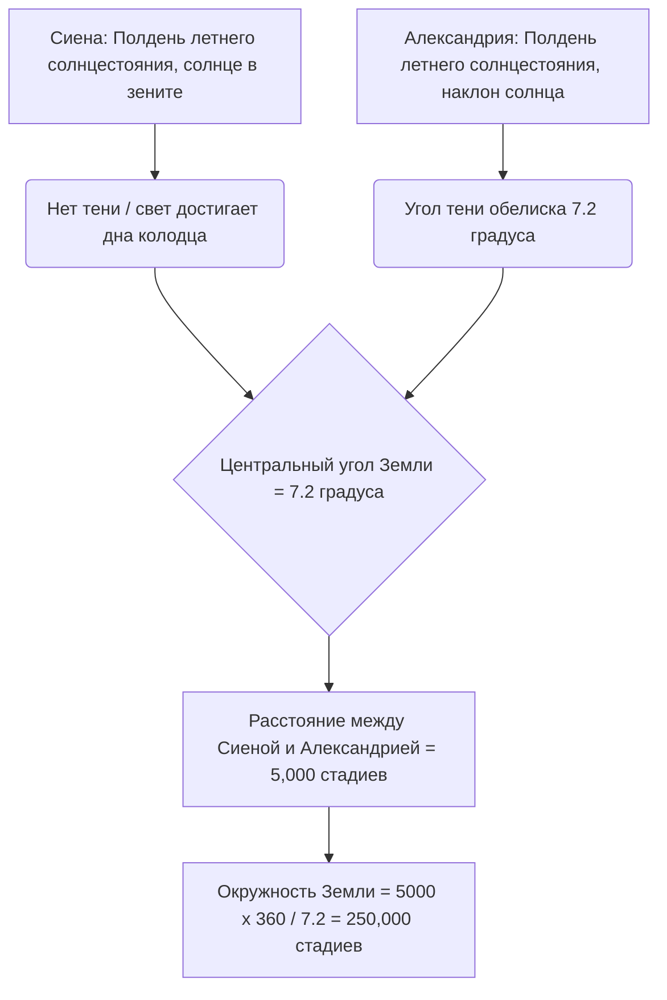
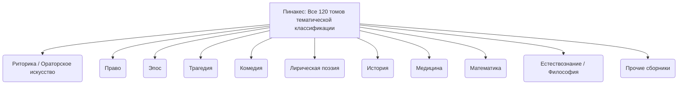
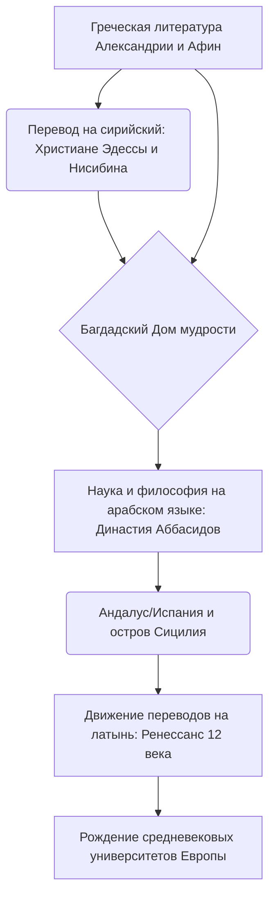

# Введение: Утраченная память древности и храм знаний

В истории, когда человечество накапливало, систематизировало и безжалостно теряло знания, вряд ли найдется что-то, что так же сильно будоражит воображение и вызывает чувство романтики и печали, как египетская «Великая Александрийская библиотека». Этот гигантский храм знаний, в котором была собрана вся мудрость древнего средиземноморского мира, не был просто хранилищем книг. Это был передовой научно-исследовательский институт, космополис, где пересекались разные культуры, и, прежде всего, воплощение «интеллектуального империализма».

В данной статье, переплетая различные академические перспективы — древнюю средиземноморскую историю, классическую филологию, историю книги и библиотековедение, — мы с беспрецедентной детализацией и научной глубиной проследим историю передачи знаний от рождения и процветания Александрийской библиотеки до загадки ее разрушения и перехода в Средневековье и Новое время.

---

## Глава 1: Амбиции Александра Македонского и рождение эллинистического мира

### Строительство Александрии и реорганизация средиземноморского мира

В 332 году до н.э. молодой македонский завоеватель Александр Великий бескровно покорил Египет и приказал построить новую столицу, названную его именем, «Александрию», на месте рыбацкой деревни Ракотис на западном краю дельты Нила, с видом на Средиземное море. Спроектированный главным архитектором царя Динократом, этот город перенял гипподамову систему (ортогональную сетку улиц), характерную для греческого градостроительства, и максимально использовал вытянутую территорию между Средиземным морем и озером Мареотис. Главной осью служила великолепная широкая улица (проспект Канопус), протянувшаяся с востока на запад.

Ожидалось, что Александрия будет функционировать не просто как столица Египта, но как сердце «эллинистической (Hellenism)» культуры, объединяющей греко-македонский мир (Элладу) и мир Востока. Сам царь отправился в восточный поход, не дожидаясь завершения строительства города, и умер в Вавилоне, но его воля и огромная империя были разделены между его диадохами (преемниками). Контроль над Египтом захватил Птолемей I Сотер (Спаситель), друг детства и близкий соратник царя.

### Культурная политика Птолемея I и «интеллектуальный империализм»

Птолемей I, основатель династии Птолемеев, глубоко понимал, что огромным многонациональным государством невозможно управлять только с помощью военного господства. Он решил создать в Александрии новый культурный центр мира, который заменил бы Афины. Ядром этого замысла стала невероятная идея «собрать все книги мира в одном месте».

Теоретической опорой этой идеи стал Деметрий Фалерский, философ-перипатетик (из школы Аристотеля), изгнанный из Афин. Деметрий обладал опытом управления государством в качестве тирана Афин в течение 10 лет и знаниями о формировании библиотеки Ликея (школы Аристотеля). Он убедил Птолемея I в том, что условием истинной универсальной империи является не просто господство силой оружия, а сбор, перевод и изучение записей, законов, идей и научных достижений всех народов.

Это можно назвать «интеллектуальным империализмом (Intellectual Imperialism)». Цари империи Ахеменидов и Ассирии в прошлом (например, библиотека Ашшурбанипала в Ниневии) также имели архивы, но у династии Птолемеев масштаб и цели были совершенно иными. Они стремились собрать литературу на всех известных языках мира (греческом, египетском, иврите, персидском и т.д.) и перевести и объединить её на греческом языке. Легенда (Послание Аристея) о том, что «Септуагинта» (греческий перевод Ветхого Завета) была создана в Александрии, также вписывается в контекст этой универсальной политики сбора знаний.

---

## Глава 2: Полная картина Королевского исследовательского института Мусейон (Museion)

### Структура как академического храма и привилегии ученых

То, что мы сегодня называем «Александрийской библиотекой», не было отдельным зданием, а было частью, или пристройкой к гигантскому королевскому комплексу академических и исследовательских институтов, называемому «Мусейон (Museion)». Буквально «Мусейон» означает «храм муз» (девяти богинь, покровительниц искусств) и является корнем современного слова «музей».

Географ Страбон отмечает, что Мусейон примыкал к территории дворца (район Брухейон) и включал в себя место для прогулок (перипатос), комнату для бесед (экседра) и большую столовую (сисситион), где ученые вместе принимали пищу. Мусейон можно назвать прототипом современных институтов перспективных исследований или аспирантур (например, Института перспективных исследований в Принстоне).

Приглашенным сюда ученым (королевским исследователям) предоставлялись удивительные привилегии. Они получали щедрую пожизненную пенсию от королевского двора, были освобождены от всех налогов и обеспечивались бесплатным жильем и питанием. Их единственной обязанностью было стремление к знаниям, написание трудов и иногда обучение детей из королевской семьи. В этом академическом сообществе интернатного типа в период его расцвета собралось более 100 лучших ученых мира, которые день и ночь погружались в дискуссии и исследования.

### Высшая текстологическая критика и изобретение знаков редактирования

Одной из важнейших задач в Мусейоне было установление текстов классической литературы, такой как Гомер. В переписанных вручную папирусных свитках того времени были распространены ошибки переписчиков, пропуски или самовольные добавления актеров.

Сменявшие друг друга филологи, такие как первый директор библиотеки Зенодот Эфесский, Аристофан Византийский и Аристарх Самофракийский, основали науку «текстологической критики (Textual Criticism)», сравнивая множество различных рукописей для восстановления текста, наиболее близкого к оригинальному.

Они изобрели систему нанесения специальных редакторских знаков на поля текста:
- **Обелиск (Obelus, – или ÷)**: Обозначает строки, подозреваемые в том, что они являются подделкой или поздними добавлениями.
- **Астериск (Asterisk, ※)**: Указывает на строки, которые повторяются или были ошибочно вставлены, но на самом деле являются важными строками, которые должны находиться в другом месте.
- **Дипла (Diple, >)**: Указывает на важные фрагменты, требующие аннотаций, или интересные с грамматической точки зрения места.

Добавление метаданных с помощью этих символов было революционной технологией обработки информации, которую можно назвать зародышем концепции современных языков разметки (таких как XML и HTML).

### Золотой век науки: Эратосфен и Архимед

Мусейон добился исторических достижений не только в гуманитарных, но и в естественных науках.

**Измерение окружности Земли Эратосфеном**
Эратосфен Киренский, который служил третьим директором библиотеки, вычислил размер Земли благодаря удивительной геометрической проницательности. Он знал, что в полдень в день летнего солнцестояния в южном египетском городе Сиене (нынешний Асуан) солнечный свет достигает дна глубокого колодца (солнце находится в зените). С другой стороны, в то же время в тот же день в Александрии, расположенной строго на север, он измерил по углу тени от солнечных часов-обелиска, что солнце наклонено примерно на 7.2 градуса от зенита (1/50 часть полной окружности в 360 градусов).

Основываясь на том, что расстояние между Александрией и Сиеной составляет 5,000 стадиев (предположительно, по количеству дней пути каравана верблюдов), Эратосфен составил следующее уравнение пропорции:
`7.2 градуса : 360 градусов = 5,000 стадиев : полная окружность Земли`
В результате расчетов окружность Земли составила 250,000 стадиев. Если предположить, что 1 стадий равен примерно 157.5 метрам (египетский стадий), то получится около 39,375 километров, что было поразительной точностью с погрешностью менее 2% по сравнению с реальной окружностью Земли по экватору (около 40,075 километров).

**Анатомия и геометрия**
В области медицины Герофил Халкидонский и Эрасистрат Кеосский под покровительством Мусейона систематически проводили первые в истории человечества вскрытия человеческого тела (по одной из версий, вивисекцию приговоренных к смертной казни). Герофил доказал, что мозг является вместилищем интеллекта, классифицировал нервную систему на двигательные и сенсорные нервы, а также указал на связь между пульсом крови и насосной функцией сердца.

Кроме того, Архимед из Сиракуз учился в Александрии или общался с учеными Мусейона через переписку. Он изобрел «Архимедов винт» (водоподъемную машину), который также использовался для борьбы с наводнениями на Ниле, и открыл принцип плавучести, рассчитал число пи методом исчерпывания и нашел квадратуру параболы. Евклид, который систематизировал геометрию, написав «Начала», как говорят, сказал Птолемею I в Александрии, что «в геометрии нет царских путей».

---

## Глава 3: Безумие коллекционирования книг и революция в библиотечных каталогах

### Беспринципный сбор книг: Конфискация в порту и афинская трагедия

Чтобы пополнить библиотеку Мусейона, цари династии Птолемеев собирали книги порой безумными и насильственными методами. Александрийская библиотека увеличивала свои фонды взрывными темпами не просто путем покупки книг, но благодаря системе, задействующей государственную власть.

Наиболее известным методом была система принудительной реквизиции путем цензуры и конфискации, называемая «книги с кораблей (ek ploion)». Все торговые и пассажирские суда, заходившие в порт Александрии, который был центром средиземноморской торговли, подвергались строгому досмотру египетскими таможенниками. Если в грузе находили книги (папирусные свитки), их немедленно конфисковывали, независимо от того, кому они принадлежали. Конфискованные книги отправлялись в переписную комнату (скрипторий) библиотеки, где специалисты-писцы день и ночь работали над созданием быстрых и точных копий. Удивительно, но первоначальным владельцам возвращалась «вновь созданная копия», а «оригинал» навсегда оставался в коллекции библиотеки. К копиям прикрепляли бирку происхождения (провенанс): «Конфисковано с такого-то корабля».

Кроме того, есть известный эпизод дипломатического мошенничества времен Птолемея III Эвергета. Царь потребовал от афинского правительства одолжить «официально признанные государством оригиналы» произведений трех великих греческих трагиков (Эсхила, Софокла и Еврипида). Эти оригиналы были священным культурным наследием, которое строго хранилось в государственном архиве Афин. Афиняне потребовали огромный денежный залог в размере 15 талантов (как говорят, эквивалент миллиардам иен в современных деньгах) в качестве условия кредита, но Птолемей III легко его заплатил. Однако, когда оригиналы прибыли в Александрию, царь приказал своим лучшим писцам сделать изысканные копии на папирусе высочайшего качества и отправил эти копии обратно в Афины. Царь позволил Афинам конфисковать залог в 15 талантов (фактически, это была покупка по непомерно высокой цене), и захватил драгоценные оригиналы как величайшее сокровище библиотеки. Это был инцидент грабежа культурного капитала сверхдержавой эллинистической эпохи.

### Каллимах и «Пинакес»: Рождение первого в мире сводного систематического каталога книг

В результате таких беспринципных методов сбора количество книг в Александрийской библиотеке достигло сотен тысяч свитков в главном здании (район Брухейон) (от 500,000 до 700,000 свитков по одной из версий) и более 40,000 свитков в филиале в Серапеуме. При таком огромном объеме информации найти нужный документ, полагаясь только на человеческую память или физическое расположение, стало невозможно. Стала необходимой «поисковая система (архитектура поиска информации)», чтобы превратить простую гору свитков в «базу данных знаний».

Величайший прорыв в истории библиотековедения совершил Каллимах, поэт и гениальный ученый из Кирены (ок. 310 г. до н.э. - ок. 240 г. до н.э.). Хотя говорят, что он не занимал официальную должность директора библиотеки, он был фактическим руководителем управления коллекциями библиотеки.

Каллимах создал гигантский 120-томный каталог под названием «Пинакес (Pinakes: буквально «таблички», официальное название «Каталог тех, кто прославился во всех областях знаний, и их трудов»)», охватывающий всю коллекцию библиотеки. Это был не просто инвентарный список (инвентаризация), а первый в истории человечества систематический «предметный каталог (Subject Catalog)».

Система классификации «Пинакес» устанавливала следующие категории в качестве основных классов (Main Class):

Кроме того, гениальность Каллимаха заключается в том, что он добавил к этим основным классам точную библиографическую информацию (метаданные). В каждой категории авторы были расположены в алфавитном порядке и имели следующие структурированные данные:

- **Имя автора и биография**: Имя автора, место рождения, имя отца, имя учителя, краткая биография (Biography). Это служило авторитетным контролем (Authority Control) для различения авторов с одинаковыми именами.
- **Название произведения**: Если названия не было, присваивалось временное название, основанное на содержании.
- **Инкупит (Начало)**: От первых нескольких слов до первой строки каждого произведения. Поскольку в древних папирусных свитках названия часто терялись, это был метод идентификации произведения по началу текста (игравший роль хеш-значения).
- **Количество свитков и общее количество строк (Стихометрия)**: Общее количество свитков в произведении и точное количество строк в тексте. Запись количества строк служила стандартом для расчета вознаграждения, выплачиваемого писцам (скрипторам), а также играла роль «контрольной суммы (проверки целостности)» для проверки того, не был ли текст позже изменен или страницы пропущены.

Эту архитектуру организации информации Каллимаха можно назвать прародителем фундаментальных и универсальных технологий обработки информации, которые ведут через каталоги средневековых монастырских библиотек непосредственно к десятичной классификации Дьюи (DDC), электронным каталогам (OPAC) современных библиотек и структурам реляционных баз данных.

---

## Глава 4: Материальность и технология письма на папирусных свитках (Volumen): Древняя медиасреда и библиометрия

### Дар Нила и инфраструктура письма

Материальную основу процветания Александрийской библиотеки составлял носитель информации под названием «папирус (Papyrus)». Бумага, изготовленная из водно-болотного растения семейства осоковых (Cyperus papyrus), произрастающего в диком виде в заболоченных землях дельты Нила, была лучшим средством записи информации в древнем средиземноморском мире, превосходящим глиняные таблички и шкуры животных. Как подробно описывает Плиний Старший в своей «Естественной истории», процесс изготовления папируса был высокоспециализированным ручным трудом.

Сначала с толстых стеблей растения (имеющих треугольное сечение) сдирали кожицу, а сердцевину (пиф) разрезали продольно на тонкие полоски иглой или тонким лезвием. Эти тонкие, похожие на ленты полоски (филюры) плотно укладывали на влажную деревянную доску без зазоров, а поверх них укладывали еще один слой, на этот раз под прямым углом. Используя грязную воду из Нила или специально приготовленный клей (или слизь самого растения), все это интенсивно отбивали деревянным молотком для прессования и сушили на солнце, чтобы получить один тонкий, легкий, гибкий и прочный лист (коллема). Папирус высочайшего качества назывался «иератика (жреческий)» или «августа» в честь императора Августа; он был белым, гладким и чрезвычайно дорогим.

Склеивая эти листы один за другим крахмальным клейстером, делали длинные «свитки (Volumen, по-гречески библион)». Обычный свиток состоял примерно из 20 склеенных коллем (скарпос) и распространялся на рынке как стандартная единица продажи.

В качестве пишущего инструмента использовалась ручка, сделанная из расщепленного конца твердого тростника, называемая каламом. В отличие от традиционных египетских тростниковых кистей, она была остро заточена, чтобы четко писать буквы греческого алфавита. Чернила (атраментум) в основном представляли собой углеродные чернила, изготовленные путем смешивания сажи с гуммиарабиком и водой. Эти чернила только прилипали к поверхности бумажных волокон и не проникали внутрь, поэтому их можно было легко смыть губкой и использовать повторно, но в то же время они были химически чрезвычайно стабильны, поэтому даже сейчас, тысячи лет спустя, на папирусах, найденных в засушливых районах пустыни, сохраняются черные буквы. Красные чернила (киноварь из оксида железа или сульфида ртути) использовались для важных заголовков и украшений, а также для руби или редакционных знаков, облегчающих чтение.

### Ограничения свитков и библиометрические ограничения: Геометрия символов и строк

Однако формат папирусного свитка имел физические ограничения как информационная технология.
1. **Ограничения по длине и весу**: Если свиток слишком длинный, он становится тяжелым и неудобным в обращении, а при разматывании (экспликаре) папирус легко изнашивается и рвется. Практический предел длины составлял около 10 метров, что соответствовало одному тому «Илиады» Гомера (около 700-900 строк). Известное высказывание Каллимаха «Большая книга — это большое зло (Mega biblion, mega kakon)» было не только эстетическим предпочтением утонченной лаконичности, характерной для эллинистической литературы, но и указанием с точки зрения практика на сложность физического обращения со свитками и их подверженность порче. Длинные исторические труды неизбежно приходилось делить на несколько свитков (томосов) для хранения и управления.
2. **Сложность произвольного доступа**: Свиток — это носитель «последовательного доступа», который читается путем прокрутки по порядку от начала до конца, и «произвольный доступ», позволяющий мгновенно перескочить на определенную страницу или строку (например, определенный абзац в середине 7-го тома), был крайне затруднен. Это накладывало огромную когнитивную нагрузку и временные затраты при работе ученых, открывающих и сравнивающих несколько документов одновременно (перекрестные ссылки / cross-references).
3. **Правила верстки колумбы**: Буквы на свитках писались непрерывными блоками (вертикально вытянутыми абзацами или столбцами, называемыми колумба). Ширина каждого абзаца составляла около 5-8 сантиметров, интервалы между строками сохранялись равномерными, пробелов между словами не было (раздельное написание), и буквы писались непрерывно в стиле «скриптио континуа (непрерывное письмо)». Это требовало от читателя высоких навыков чтения вслух.
4. **Хранение и управление (картуш и силлибос)**: Свитки наматывались на деревянную ось (валик), называемую омфалос, и хранились вертикально в капсе (цилиндрическом футляре) или укладывались горизонтально на полках (питах). Для идентификации содержимого снаружи к краю свитка прикреплялась небольшая пергаментная или папирусная бирка под названием «силлибос (Sillybos)», на которой писались имя автора и название. Она выполняла функцию современного корешка книги, но имела тот недостаток, что ее было легко оторвать при частом извлечении и возвращении на место.

### Переход к кодексу (книге) и стоимость смены медиа

С 2 по 4 век нашей эры, вместе со взрывным распространением христианства, произошел сдвиг парадигмы (одна из величайших медиареволюций в истории человечества) от папирусных свитков к «кодексам (Codex: книгам со страницами)». Кодекс, в котором листы пергамента или папируса складывались пополам и сшивались по корешку нитью, имел высокую информационную плотность (уменьшение физического объема), поскольку записи могли быть сделаны на обеих сторонах (ректо и версо) без потерь, и, что наиболее важно, обладал подавляющим преимуществом: можно было мгновенно открыть определенную страницу (реализация произвольного доступа и использование закладок).

В последние годы существования Александрийской библиотеки, в этот период перехода медиа, они, должно быть, столкнулись с огромными затратами на перезапись своей обширной коллекции свитков в новый формат кодекса (миграция форматов). Документы, которые были пропущены в ходе этой работы по перезаписи, то есть «свитки, не преобразованные в кодексы», со временем устарели, перестали читаться и были обречены быть навсегда утерянными из-за влажности и насекомых-вредителей. Отбор и выбраковка коллекции в библиотеке определили выживаемость исторических текстов.

---

## Глава 5: Мифы и правда о разрушении: Что уничтожило библиотеку?

Вопрос о том, «когда и кем была разрушена Александрийская библиотека», является одной из величайших загадок в истории и часто рассказывается как «миф» о том, что она была в одно мгновение превращена в пепел одним драматическим большим пожаром. Однако современная история и археология показывают, что исчезновение библиотеки было результатом не единичного инцидента, а множества процессов разрушения и упадка, продолжавшихся на протяжении нескольких столетий.

### 1. 48 год до н.э.: Юлий Цезарь и Александрийская война

Самая известная легенда о разрушении связана с римским полководцем Юлием Цезарем. Цезарь, который высадился в Египте, преследуя Помпея, встал на сторону Клеопатры VII и участвовал в Александрийской войне. Чтобы не дать флоту династии Птолемеев захватить флот его армии, Цезарь поджег корабли в порту. Более поздние историки, такие как Плутарх, сообщают, что огонь перекинулся с порта на сушу и сжег Великую библиотеку (или сотни тысяч книг, хранившихся на складах порта).
Однако в собственных «Записках о Гражданской войне» Цезаря не упоминается о сожжении библиотеки. Более того, когда несколько десятилетий спустя Александрию посетил Страбон, сооружения Мусейона все еще функционировали. Следовательно, считается весьма вероятным, что во время пожара, устроенного Цезарем, были утеряны лишь «филиал» библиотеки или часть книг, хранившихся на портовых складах для импорта и экспорта.

### 2. 270-е годы н.э.: Полное разрушение города императором Аврелианом

Считается, что решающий удар по главному зданию библиотеки был нанесен во время гражданской войны в Римской империи во второй половине 3 века н.э. Зеновия, царица Пальмирского царства, оккупировала Александрию, после чего последовали ожесточенные уличные бои римского императора Аврелиана за возвращение города.
В этих боях весь дворцовый район (Брухейон) был полностью разрушен и опустошен. Наиболее убедительным мнением в современной истории является то, что Мусейон и Великая библиотека были полностью разрушены вместе с их зданиями в это время, а коллекция книг была разбросана и сожжена.

### 3. 391 год н.э.: Разрушение Серапеума императором Феодосием и христианами

Даже после исчезновения Великой библиотеки филиал (сестринская библиотека) продолжал существовать в Серапеуме (Serapeum), гигантском храме бога Сераписа в юго-западной части Александрии, поддерживая жизнь науки.
Однако римский император Феодосий I сделал христианство государственной религией и издал указ о разрушении языческих храмов. В ответ на это радикальный христианский епископ Александрии Феофил и толпа фанатичных монахов напали на Серапеум и полностью разрушили великолепный храм. Предполагается, что папирусные свитки, хранившиеся в храме, также были сожжены в это время как злые языческие книги. Этот инцидент, наряду с жестоким убийством женщины-математика Гипатии, произошедшим позже (в 415 г. н.э.), передается из поколения в поколение как трагедия, символизирующая конец свободных интеллектуальных исследований в древности.

### 4. 642 год н.э.: Исламское завоевание и легенда о халифе Умаре

Самым сенсационным мифом, созданным христианскими и арабскими летописцами 13 века, является легенда о разрушении, совершенном исламской армией. Когда арабский полководец Амр ибн аль-Ас завоевал Александрию, он спросил халифа Умара ибн аль-Хаттаба, что делать с книгами в библиотеке. Говорят, что Умар ответил следующее:
«Если эти книги согласуются с Кораном, то они не нужны, потому что есть Коран. Если они противоречат Корану, они вредны. Поэтому сожги их все».
Говорят, что коллекция была распределена в качестве топлива для котлов 4,000 общественных бань в Александрии и горела полгода.
Однако современные исследователи считают этот эпизод полной выдумкой (более поздней фальсификацией). Это связано с тем, что ко времени исламского завоевания в 7 веке некогда Великая библиотека уже бесследно исчезла из-за сотен лет войн, нехватки средств и естественного износа папируса (в сыром прибрежном климате папирус распадается за несколько сотен лет).

---

## Глава 6: Убежище знаний и великое плавание в Средневековье и Ренессанс: Выживание памяти человечества

Физические здания и папирусы Александрии обратились в пепел и вернулись в землю. Однако ДНК «древней мудрости», выращенная там, не была полностью утрачена. Благодаря удивительной интеллектуальной эстафете, длившейся на протяжении нескольких веков, часть её совершила долгое плавание, достигнув нас сегодня через Сирию, Персию, Аравийский полуостров, Северную Африку и Пиренейский полуостров.

### От сирийского к арабскому: Багдадский Дом мудрости и Великое переводческое движение

С 5 по 6 века ученые, принадлежавшие к несторианам и монофизитам, спасаясь от преследований еретиков со стороны ортодоксальной христианской фракции (халкидонитов) в Византийской империи, бежали в Сирию на востоке и в Сасанидскую Персию. В частности, Эдесса (нынешняя Урфа), Нисибин и медицинская школа в Гундишапуре в Персии стали новыми центрами, унаследовавшими греческую науку. Сначала они переводили сложные греческие тексты, такие как логика Аристотеля («Органон»), медицина Галена и Гиппократа, астрономия Птолемея («Альмагест»), на сирийский язык (диалект арамейского языка). Это стало первым мостом для греческих знаний на Ближнем Востоке.

Позже, в 8 веке, возникла Исламская империя Аббасидов, и халифы аль-Мансур и аль-Мамун основали в новой столице Багдаде гигантский институт переводов и исследований под названием «Байт аль-Хикма (Дом мудрости)». Это был воистину национальный проект, который можно назвать «Вторым Мусейоном».

Здесь гениальные переводчики, такие как Хунайн ибн Исхак (араб-христианин несторианского толка), развернули беспрецедентное крупномасштабное переводческое движение (греко-арабское переводческое движение) с сирийского на арабский язык или непосредственно с греческого на арабский. Хунайн не делал дословных переводов, а использовал текстологическую критику (сравнение множества рукописей для определения точного значения, александрийский филологический метод), а затем создавал новые термины для философии и науки (например, абстрактные понятия, такие как «качество», «количество», «сущность») на арабском языке.

Знания Александрии расцвели на новой плодородной почве исламского мира и прошли свою собственную эволюцию. Великие исламские ученые, такие как аль-Хорезми (отец алгебры), аль-Кинди (отец арабской философии), Ибн Сина (латинское имя Авиценна, автор Канона врачебной науки) и Ибн Рушд (латинское имя Аверроэс, величайший комментатор Аристотеля), не только впитали греческие знания, но и критически превзошли их, создав высочайший уровень научно-технических достижений в мире.

*(※ Выше приведено генеалогическое древо греко-арабо-латинского переводческого движения)*

### Сохранение рукописей в Византийской империи и возвращение в эпоху Итальянского Возрождения

С другой стороны, существовала линия знаний, которая оставалась в грекоязычном мире. В Константинополе, столице Восточной Римской империи (Византийской империи), и в монастырях на горе Афон монахи бесконечно переписывали и сохраняли классическую греческую литературу в виде пергаментных кодексов. В 9 веке произошло классическое возрождение, названное «Македонским ренессансом», в ходе которого были составлены «Библиотека» («Мириобиблион») патриарха Фотия и «Суда» (огромная византийская энциклопедия), в которых обобщались и сохранялись знания древности.

Во время «Ренессанса 12 века» знания, переведенные на латынь через арабский язык из исламского мира (Толедо в Испании и Сицилия на юге Италии), хлынули в Западную Европу и стимулировали рождение европейских университетов (Universitas) в Париже и Болонье.

Более того, когда в 1453 году Константинополь пал под натиском Османской империи, многие византийские ученые, в том числе Георгий Гемист Плифон, бежали на итальянский полуостров с ценными греческими рукописями (такими как полное собрание сочинений Платона). Это привело к прямому переоткрытию греческой классики во Флоренции, которой правила семья Медичи, и в Венеции, где развивалось книгопечатание, и стало движущей силой, мощно направляющей Итальянское Возрождение, основанное на гуманизме.

### Вопросы к современной цифровой Александрии и вечные вызовы

Сегодня, в 2002 году, благодаря сотрудничеству египетского правительства и ЮНЕСКО, недалеко от руин бывшей библиотеки была построена гигантская дискообразная новая библиотека «Библиотека Александрина» (Новая Александрийская библиотека), что ознаменовало ее символическое возрождение.

Кроме того, в киберпространстве Интернета существует современная версия «мечты Александрии», такая как «Архив Интернета (Internet Archive)», который пытается оцифровать и сохранить все веб-страницы, книги и видео в мире. Проект Google Books также можно назвать современным проявлением интеллектуального империализма династии Птолемеев.

Однако нам необходимо извлечь тяжелый урок из судьбы древней библиотеки. Несмотря на то, что носитель информации сменился с папируса на кремниевые чипы и облачное хранилище, а общий объем данных увеличился до эксабайтных масштабов, основные риски, угрожающие сохранению и передаче знаний, не изменились. Это проблемы войн, терроризма, цензуры диктаторских политических идеологий, истощения финансирования проектов и, прежде всего, «устаревания форматов (кризис цифровых темных веков)». В современном мире, где программное обеспечение и аппаратные средства устаревают за несколько лет, нет точного ответа на то, кто и как сможет прочитать сегодняшние цифровые данные через 500 или 1000 лет.

История взлетов и падений Александрийской библиотеки глубоко говорит нам сквозь тысячелетия о том, насколько хрупок процесс сбора, сохранения и передачи знаний человечеством, и в то же время насколько он требует сильной воли и постоянных усилий (непрерывного переписывания с рукописи на рукопись).

---

