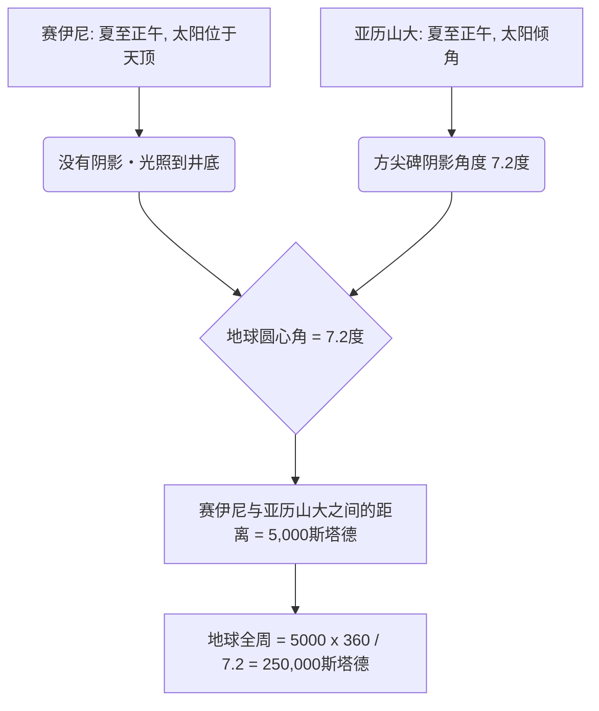
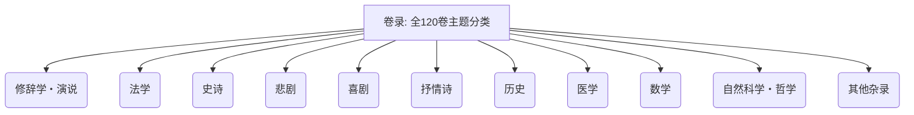
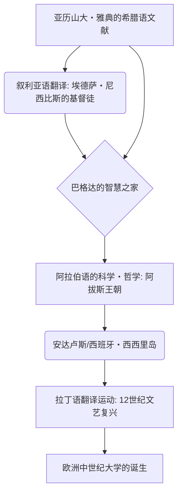

# 引言：失落的古代记忆与知识殿堂

在人类历史上，关于知识的积累、系统化以及随后无情丧失的过程中，埃及的“亚历山大图书馆（Great Library of Alexandria）”无疑是最能激发人们想象力、令人感到浪漫与悲哀的存在。这座汇聚了古代地中海世界所有智慧的巨大知识神殿，并不仅仅是一个简单的书籍储藏室。它是最前沿的学术研究机构，是异文化交汇的世界都市（Cosmopolis），更重要的是，它是“知识帝国主义”的结晶。

本文将交织古代地中海史、古典文献学、书籍史、图书馆信息学等多个学科视角，以空前的详细程度和学术深度，描绘从亚历山大图书馆的诞生到繁荣、从毁灭之谜到中世纪与近代的知识传承史。

---

## 第一章：亚历山大大帝的野心与希腊化世界的诞生

### 亚历山大城的建设与地中海世界的重组

公元前332年，马其顿年轻的征服者亚历山大大帝兵不血刃地占领了埃及，并下令在尼罗河三角洲西端、面朝地中海的渔村拉科蒂斯（Rhacotis）建设一座以自己名字命名的新首都“亚历山大（Alexandria）”。这座城市由大帝的首席建筑师丁诺克拉特斯（Dinocrates）设计，采用了希腊城市规划中的希波达莫斯模式（网格状街道），充分利用了夹在地中海和马雷奥蒂斯湖之间的狭长地形，以一条东西走向的壮丽大道（卡诺普斯大道）为主轴。

亚历山大城不仅是埃及的首都，还被寄予厚望，要成为融合希腊-马其顿世界（Hellas）与东方世界的“希腊化（Hellenism）”文化的心脏。大帝本人未能等到城市完工便踏上东征之途，最终客死巴比伦，但他的遗志和庞大帝国被继业者（Diadochi）们瓜分。掌握埃及的是大帝的儿时玩伴兼亲信托勒密一世·索特尔（Ptolemy I Soter，意为救主）。

### 托勒密一世的文化政策与“知识帝国主义”

开创托勒密王朝的托勒密一世深知，仅靠军事统治无法管理庞大的多民族国家。他决定在亚历山大城建立一个取代雅典的新的世界文化中心。其中的核心便是“将全世界所有的书籍汇聚一堂”这一宏大构想。

这一构想的理论支柱是从雅典流亡而来的亚里士多德学派（逍遥学派）哲学家法勒鲁姆的德米特里（Demetrius of Phalerum）。德米特里曾作为雅典僭主执政十年，同时具备关于亚里士多德的吕克昂（Lyceum）学园藏书建设的知识。他向托勒密一世进言：真正的普遍帝国不能仅靠武力统治，而必须收集、翻译并研究所有民族的记录、法律、思想和科学。

这堪称“知识帝国主义（Intellectual Imperialism）”。曾经阿契美尼德王朝的波斯和亚述的国王们（例如亚述巴尼拔国王的尼尼微图书馆）也拥有档案馆，但托勒密王朝的图书馆在规模和倾向上都有着天壤之别。他们的目标是收集已知世界所有语言（希腊语、埃及语、希伯来语、波斯语等）的文献，并将其翻译整合为希腊语。旧约圣经的希腊语译本《七十士译本（Septuagint）》在亚历山大城编纂的传说（阿利斯提亚书信），也应置于这一普遍知识收集政策的背景之下。

---

## 第二章：皇家研究院缪斯神殿（Museion）的全貌

### 作为学术神殿的结构与学者的特权

我们今天所称的“亚历山大图书馆”，并非一栋独立的建筑，而是被称为“缪斯神殿（Museion）”的巨大的皇家学术研究机构群的一部分，或是其附属设施。“Museion”字面意思是“缪斯（掌管文艺的九位女神）的神殿”，这也是现代“Museum（博物馆）”一词的词源。

地理学家斯特拉波（Strabo）记载，缪斯神殿毗邻王宫区（布鲁克伊翁区，Bruchion），设有散步道（Peripatos）、会客室（Exedra）以及供学者们共同进餐的大食堂（Syssition）。缪斯神殿可以说是现代高等研究院或研究生院大学（如普林斯顿高等研究院）的雏形。

受邀来到这里的学者们（皇家研究员）享有惊人的特权。他们由王室发放高额的终身年金，免除一切赋税，并免费提供食宿。他们唯一的义务就是探索知识、从事著述，有时还要负责王室子弟的教育。在这个全寄宿制的学术共同体中，鼎盛时期聚集了上百位世界顶尖的学者，他们日以继夜地沉浸在讨论与研究之中。

### 极致的文献考勘与校勘符号的发明

缪斯神殿最重要的事业之一是确定荷马等古典文学的文本。当时手抄的纸莎草卷轴中，抄写员的笔误、漏字，或者演员们擅自添加的内容泛滥成灾。

首任图书馆长以弗所的泽诺多托斯（Zenodotus of Ephesus）、拜占庭的阿里斯托芬（Aristophanes of Byzantium）以及萨莫色雷斯的阿里斯塔库斯（Aristarchus of Samothrace）等历代文献学家，确立了比较多份不同手稿、还原最接近本来面貌文本的“文献考勘（Textual Criticism）”学问。

他们在文本的空白处发明了一套书写特殊校勘符号的系统：
- **方尖碑号（Obelus, – 或 ÷）**：标注被怀疑为伪作或后世添加的行。
- **星号（Asterisk, ※）**：标注重复或错误插入、但原本应在其他位置的重要行。
- **双矢号（Diple, >）**：标注需要注释的重要位置或在语法上值得关注的位置。

这种通过符号附加元数据的做法，可以说是现代标记语言（XML或HTML）思想的萌芽，是一项划时代的信息处理技术。

### 科学的黄金时代：埃拉托斯特尼与阿基米德

缪斯神殿不仅在人文科学领域，在自然科学领域也取得了名留人类史册的成就。

**埃拉托斯特尼测量地球周长**
第三任图书馆长昔兰尼的埃拉托斯特尼（Eratosthenes of Cyrene）以惊人的几何学洞察力计算出了地球的大小。他知道，在夏至日正午，埃及南部城市赛伊尼（Syene，今阿斯旺）阳光能直射到深井底（太阳位于天顶）。另一方面，在同一天的同一时间，位于正北方的亚历山大城，通过日晷方尖碑阴影的角度，他测出太阳偏离天顶约7.2度（全圆周360度的五十分之一）。

埃拉托斯特尼基于亚历山大和赛伊尼之间距离为5,000斯塔德（根据骆驼商队的行进天数推测），建立以下比例式：
`7.2度 : 360度 = 5,000斯塔德 : 地球全周`
计算结果得出地球全周为250,000斯塔德。如果假设1斯塔德约为157.5米（埃及的斯塔德），则约为39,375公里，与实际的地球赤道周长（约40,075公里）相比，误差不到2%，精度惊人。

**解剖学与几何学**
在医学领域，卡尔西顿的赫罗菲拉斯（Herophilus）和科斯岛的埃拉西斯特拉图斯（Erasistratus）在缪斯神殿的保护下，进行了人类历史上首次系统的人体解剖（有说法称是对死囚进行活体解剖）。赫罗菲拉斯证明了大脑是智力的所在，将神经系统分为运动神经和感觉神经，并指出了血液脉搏与心脏泵血功能的关联性。

此外，曾在亚历山大城学习、或通过通信与缪斯神殿学者交流的，还有锡拉库萨的阿基米德（Archimedes）。他发明了也曾用于尼罗河治水的“阿基米德螺旋提水机”，并提出了浮力原理、利用穷竭法计算圆周率以及抛物线求积等。著有《几何原本》并使几何学系统化的欧几里得（Euclid），据传也在亚历山大城对托勒密一世说过“几何学无坦途（几何无王者之道）”。

---

## 第三章：书籍收集的疯狂与藏书目录的革命

### 不择手段的书籍收集：港口没收与雅典的悲剧

为了充实缪斯神殿的图书馆，托勒密王朝历代国王有时采取甚至可以说疯狂的强硬手段搜罗书籍。亚历山大图书馆不仅仅是买书，而是动用国家权力机制让藏书呈爆炸性增长。

最著名的手法被称为“船上之书（ek ploion）”的审查和没收强制征用系统。所有驶入地中海贸易中心亚历山大港的商船和客船，都要接受埃及海关官员的严格检查。如果货物中发现书籍（纸莎草卷轴），无论归谁所有，都立即被没收。被没收的书籍被送往图书馆的抄写室（Scriptorium），由专业的抄写员日夜赶工，迅速制作出精美的副本。令人惊讶的是，归还给原主的是“新制作的副本”，而“原件”则作为图书馆的藏书被永久收藏。副本上会被打上“没收自某某船只”的来源（Provenance）标签。

此外，还有托勒密三世·欧厄尔葛忒斯（Ptolemy III Euergetes）时期著名的外交欺诈事件。国王向雅典政府要求借阅希腊三大悲剧诗人（埃斯库罗斯、索福克勒斯、欧里庇得斯）的“国家认可的官方原件”。这些原件被严密保管在雅典的国家档案馆中，是神圣的文化遗产。雅典方面作为借阅条件，要求支付15塔兰同（据称相当于现在数十亿日元的价值）的巨额现金保证金，而托勒密三世毫不犹豫地支付了。然而，当原件抵达亚历山大后，国王让最优秀的抄写员用最顶级的纸莎草制作了精美的副本，并将副本送回了雅典。国王任由那15塔兰同的保证金被雅典没收（实际上成了天价的收购），从而夺取了珍贵的原件作为图书馆的至宝。这是希腊化时代超级大国实施的文化资本强夺事件。

### 卡利马科斯与《卷录》（Pinakes）：世界首个综合图书分类目录的诞生

这种不择手段收集的结果是，据传亚历山大图书馆的藏书量在主馆（布鲁克伊翁区）达到了数十万卷（一说为50万到70万卷），在塞拉皮翁（Serapeum）分馆达到了4万卷以上。面对如此庞大的信息量，单靠人类的记忆或物理排列已不可能找到目标文献。将单纯的书山转变为“知识数据库”的“检索系统（信息检索架构）”变得不可或缺。

在图书馆信息学上实现这一史上最大突破的，是出身昔兰尼的诗人兼天才学者卡利马科斯（Callimachus，约公元前310年 - 前240年）。据称他并未正式就任图书馆长，但实质上是图书馆藏书管理的负责人。

卡利马科斯编制了多达120卷、涵盖图书馆所有藏书的巨大目录《卷录》（Pinakes：字面意思是“书板”，全称为《在各门学问中卓越的人及其著作目录》）。这不仅仅是简单的馆藏清单（Inventory），而是人类史上第一个系统的“主题分类目录（Subject Catalog）”。

《卷录》的分类体系设定了以下大类（Main Class）：

不仅如此，卡利马科斯的天才之处在于，他在大分类下附加了精细的书目信息（元数据）。在各个分类中，作者按字母顺序排列，并记录了以下结构化数据：

- **作者姓名与传记**：作者的名字、出生地、父亲的名字、老师的名字、简要经历（Biography）。这作为区分同名作者的规范控制（Authority Control）发挥了作用。
- **著作标题**：如果没有标题，则根据内容赋予暂定标题。
- **首句（Incipit）**：每部著作开头的几个词到第一行。由于古代纸莎草卷轴的标题经常丢失，这是通过正文开头来识别作品（类似于哈希值的作用）的手法。
- **卷数与总行数（Stichometry）**：整部著作的卷数和精确的文本行数。行数记录不仅是计算付给抄写员（Scriptor）报酬的基准，同时起到了验证文本日后是否被篡改或漏页的“校验和（完整性验证）”作用。

卡利马科斯的这种信息整理架构，经由中世纪修道院图书馆的目录，直接连接到现代图书馆的杜威十进分类法（DDC）和OPAC（在线公共书目查询系统），甚至是关系型数据库的结构，可以说是本质且普遍的信息处理技术的鼻祖。

---

## 第四章：纸莎草卷轴（Volumen）的物质性与抄写技术：古代的媒介环境与计量书志学

### 尼罗河的馈赠与书写基础设施

从物质层面根本上支撑亚历山大图书馆繁荣的，是“纸莎草（Papyrus）”这种记录介质。这种由生长在尼罗河三角洲湿地莎草科挺水植物（Cyperus papyrus）制成的纸张，在古代地中海世界是超越泥板和兽皮的顶级信息记录媒介。正如老普林尼在《自然史》中详细记述的那样，纸莎草的制造工艺是高度专业化的手工业。

首先，剥去植物粗大茎干（截面呈三角形）的表皮，用针或薄刀片将内部的髓纵向切成薄片。将这些薄丝带状的长条（Philyra）没有缝隙地并排铺在湿润的木板上，然后在其上再铺一层，这次与上一层垂直交叉。使用尼罗河的泥水或特制的粘合剂（或植物自身的粘液），用木槌用力敲打使之压实，在阳光下晒干后，就完成了一张薄、轻、柔软且耐用的纸张（Kollema）。最高品质的纸莎草被称为“Hieratica（祭司用）”或冠以奥古斯都之名的“Augusta”，洁白光滑且极其昂贵。

用面糊将这些纸张一张张拼接起来，就制成了长长的“卷轴（Volumen，希腊语为Biblion）”。一般的卷轴由约20张Kollema拼接而成（Scapus），作为标准的销售单位在市场上流通。

书写工具使用顶端劈开的坚硬芦苇茎制成的笔（Calamus）。与埃及古老的灯心草笔（刷子）不同，为了锐利地书写希腊字母，笔尖被切割得很锋利。墨水（Atramentum）主要是由烟灰、阿拉伯胶和水混合制成的碳素墨水。这种墨水仅附着在纸张纤维表面，不会渗透到内部，因此可以用海绵轻松洗掉并重复使用；但同时其化学性质极其稳定，即使经过数千年，今天在沙漠干燥地带发现的纸莎草依然保持着乌黑的字迹。重要的标题、装饰，或为了辅助阅读的注音和校勘符号，则使用了红色墨水（氧化铁或硫化汞制成的朱砂）。

### 卷轴的局限与计量书志学的制约：字数与行数的几何学

然而，纸莎草卷轴这种格式存在着作为信息技术的物理局限。
1. **长度与重量的制约**：卷轴过长会沉重且不易处理，在展开（Explicare）时纸莎草容易疲劳破损。实用的极限长度约为10米左右，这相当于荷马《伊利亚特》的1卷（约700至900行）。卡利马科斯留下“大书是大灾难（Mega biblion, mega kakon）”的名言，不仅是出于偏爱希腊化文学特有的洗练简洁的美学原因，更是从实务人员的角度指出了卷轴物理处理的繁琐和易损性。长篇的历史书等，不可避免地必须分割成多个卷轴（Tomos）来保存和管理。
2. **随机存取的困难**：卷轴是从头到尾顺序滚动的“顺序存取（Sequential Access）”媒介，瞬间跳转到特定页面或行（例如第7卷中间的某个段落）的“随机存取（Random Access）”极其困难。这迫使学者在同时翻开多部文献进行比较参考（交叉引用、交叉参考）时，承受巨大的认知负荷和时间成本。
3. **栏（Kolymbos）的排版规则**：卷轴上的文字被写成连续的块（被称为Kolymbos的纵长段落或栏）。每栏的宽度约5到8厘米，行距保持均匀，单词之间没有空格（分词书写），文字连续书写的“连续书写（Scriptio Continua）”是普遍做法。这对读者提出了高度的朗读技巧要求。
4. **保管与管理（标签与书匣）**：卷轴卷在被称为Omphalos的木轴（滚筒）上，竖立存放在Capsa（圆筒形书匣）中，或平堆在架子上。为了从外部识别内容，卷轴末端系有被称为“Sillybos”的羊皮纸或纸莎草小标签，上面写有作者名和标题。这起到了今天书脊的作用，但存在频繁取放容易撕裂的弱点。

### 向抄本（册子本，Codex）的过渡与媒介转换的成本

从公元2世纪到4世纪，随着基督教的爆发式普及，发生了从纸莎草卷轴向“册子本（Codex）”的范式转移（人类史上最大的媒介革命之一）。将羊皮纸或纸莎草对折成叠并用线缝合书脊的册子本，由于可以在正反两面（Recto和Verso）无浪费地书写，信息密度高（减少物理体积），最重要的是可以瞬间翻开特定页面（实现随机存取并利用书签），具有压倒性的优势。

在亚历山大图书馆的末期，在这个媒介转换期，必定面临了将庞大卷轴藏书重写为新册子本格式（格式迁移）的巨大成本。在这个重写作业中被遗漏的文献，即“未能被制成册子本的卷轴”，最终变得过时、无人阅读，并因潮湿或虫害而走向永远消失的命运。图书馆对藏书的选择和淘汰，决定了历史上文本的存活率。

---

## 第五章：毁灭的神话与真相：是什么毁灭了图书馆？

“亚历山大图书馆何时、被谁毁灭”这一问题，是历史上最大的谜团之一，往往被讲述为一场戏剧性的大火灾使其瞬间化为灰烬的“神话”。然而，现代历史学和考古学表明，图书馆的消失并非单一事件，而是几个世纪内多次破坏和衰退过程的结果。

### 1. 公元前48年：尤利乌斯·凯撒与亚历山大战争

最著名的毁灭传说是罗马将军尤利乌斯·凯撒造成的。凯撒追击庞培登陆埃及，并支持克娄巴特拉七世，参与了亚历山大战争。为了防止自己的舰队被托勒密王朝的舰队夺走，凯撒下令烧毁港口内的船只。普鲁塔克等后世历史学家记载，这场火灾从港口蔓延至陆地，将大图书馆（或港口仓库中的数十万卷藏书）焚烧殆尽。
然而，凯撒自己的《内战记》中并未提及图书馆被烧毁一事。此外，几十年后斯特拉波访问亚历山大城时，缪斯神殿的设施依然在运作。因此，现代历史学认为，凯撒的火灾中烧毁的很可能是图书馆的“分馆”或为进出口保存在港口仓库中的部分书籍。

### 2. 公元270年代：奥勒良皇帝对城市的彻底破坏

现代历史学中最有力的观点认为，对图书馆本体造成决定性打击的，是公元3世纪后半叶罗马帝国内战。巴尔米拉王国的芝诺比娅占领了亚历山大城，随后罗马皇帝奥勒良为夺回城市展开了激烈的巷战。
在这场战斗中，整个王宫区（布鲁克伊翁）遭到彻底破坏和荒废。缪斯神殿和大图书馆也在此时连同建筑一起被彻底摧毁，藏书四散和烧毁。

### 3. 公元391年：狄奥多西皇帝与基督徒破坏塞拉皮翁

大图书馆消失后，亚历山大城西南部供奉塞拉皮斯神的巨大神殿“塞拉皮翁（Serapeum）”中还存在图书馆的分馆（姐妹馆），维系着学术的命脉。
然而，罗马皇帝狄奥多西一世将基督教定为国教，并颁布了破坏异教神殿的法令。受此影响，亚历山大城的强硬派基督教主教狄奥菲鲁斯带领狂热的修士群众袭击了塞拉皮翁，将壮丽的神殿彻底摧毁。据推测，当时神殿内存放的纸莎草卷轴也作为异教邪恶书籍被焚毁。这一事件，连同后来（公元415年）发生的女性数学家希帕提娅被惨杀事件，作为象征古代自由智力探索终结的悲剧被传颂至今。

### 4. 公元642年：伊斯兰征服与哈里发欧麦尔的传说

由13世纪的基督徒或阿拉伯编年史家创造出来的最耸人听闻的神话，是伊斯兰军队毁灭图书馆的传说。据说阿拉伯将军阿姆鲁·伊本·阿斯征服亚历山大城时，向哈里发欧麦尔·伊本·哈塔卜请示如何处置图书馆的书籍。欧麦尔这样回答：
“如果那些书籍与《古兰经》一致，那么有《古兰经》就够了，它们是多余的。如果与《古兰经》相悖，那么它们是有害的。因此，全部烧掉。”
于是，藏书被分配到亚历山大城的4,000个公共浴池作为锅炉燃料，烧了整整半年。
然而，现代研究者断定这个插曲完全是虚构的（后世的伪造）。因为在7世纪伊斯兰征服时，经历了数百年的战乱、预算枯竭以及纸莎草的自然老化（在潮湿的海滨气候下，纸莎草在数百年内就会腐烂），昔日的大图书馆早已荡然无存。

---

## 第六章：知识的避难与向中世纪、文艺复兴的大航海：人类记忆的幸存

亚历山大城的物理建筑和纸莎草化为了灰烬，回归了尘土。但是，在那里培育的“古代智慧”的DNA并未完全断绝。经过几个世纪令人惊叹的智力接力，其一部分经由叙利亚、波斯、阿拉伯半岛、北非、伊比利亚半岛，完成了直达现代我们的漫长航程。

### 从叙利亚语到阿拉伯语：巴格达的智慧之家与大翻译运动

在5世纪到6世纪期间，为了逃避拜占庭帝国正统派基督教（迦克墩派）对异端的镇压，聂斯脱里派和一性论派的学者们逃亡到了东方的叙利亚和萨珊波斯。特别是埃德萨（今乌尔法）、尼西比斯以及波斯贡迪沙普尔的医学院，成为了传承希腊学问的新基地。他们将亚里士多德的逻辑学（《工具论》）、盖伦和希波克拉底的医学、托勒密的天文学（《天文学大成》）等深奥的希腊语文献，首先翻译成叙利亚语（阿拉米语的一种方言）。这是中东地区希腊知识的第一座桥梁。

此后，在8世纪崛起的伊斯兰帝国阿拔斯王朝中，哈里发曼苏尔和马蒙等人在新首都巴格达设立了名为“智慧之家（Bayt al-Hikmah）”的巨大翻译研究机构。这堪称“第二座缪斯神殿”的国家项目。

在这里，以侯奈因·伊本·伊斯哈格（聂斯脱里派基督教徒阿拉伯人）为首的天才翻译家们，展开了前所未有的大规模翻译运动（希腊-阿拉伯翻译运动），从叙利亚语译成阿拉伯语，或从希腊语直接译成阿拉伯语。侯奈因不仅仅是直译，他还在对文本进行考勘（比较多份手稿确定准确含义，即亚历山大城的文献学手法）的基础上，在阿拉伯语中创造了新的哲学和科学专业术语（例如“质”、“量”、“本质”等抽象概念）。

亚历山大的知识在伊斯兰世界这片新的沃土上开花结果，并实现了独特的进化。花剌子密（代数学之父）、肯迪（阿拉伯哲学之祖）、伊本·西那（拉丁名阿维森纳，医学典范的作者）以及伊本·鲁世德（拉丁名阿威罗伊，亚里士多德的终极注释者）等伊斯兰大学者们，不仅吸收了希腊知识，还对其进行了批判性的超越，建立了世界巅峰水平的科学技术。

*(※上图为希腊-阿拉伯-拉丁翻译运动的系统图)*

### 拜占庭帝国的手稿保存与向意大利文艺复兴的回流

另一方面，也有一支知识系谱留在了希腊语圈。在东罗马帝国（拜占庭帝国）的首都君士坦丁堡和阿索斯山的修道院里，修士们将希腊语的古典文献不断地抄写在羊皮纸册子本上并加以保存。9世纪爆发了被称为“马其顿王朝文艺复兴”的古典复兴运动，编纂了佛提乌大教长的《万卷书》（Bibliotheca，或译藏书）以及《苏达辞书》（Suda，希腊语的巨大百科全书），从而对古代知识进行了摘要和保存。

在12世纪的“12世纪文艺复兴”中，从伊斯兰世界（西班牙的托莱多和南意大利的西西里）经由阿拉伯语被翻译成拉丁语的知识流入西欧，促进了巴黎和博洛尼亚等欧洲大学（Universitas）的诞生。

此外，在1453年君士坦丁堡被奥斯曼帝国攻陷时，以乔治乌斯·格弥斯托斯·普莱松（Georgios Gemistos Plethon）为首的许多拜占庭学者，怀揣珍贵的希腊语手稿（如柏拉图全集等）流亡到意大利半岛。这引发了在美第奇家族统治的佛罗伦萨以及活字印刷发展起来的威尼斯，对希腊古典进行直接的重新发现，成为强有力地推动基于人文主义（Humanism）的意大利文艺复兴的原动力。

### 对现代数字亚历山大的追问与永恒的课题

今天，在埃及政府和联合国教科文组织的合作下，2002年在昔日图书馆遗址附近，一座巨大的圆盘形新图书馆“亚历山大图书馆（Bibliotheca Alexandrina）”落成，实现了象征性的复兴。

此外，在互联网的网络空间中，存在着像“档案馆（Internet Archive）”这样试图将世界上所有的网页、书籍和视频数字化并保存下来的现代版“亚历山大之梦”。Google Books项目也可以说是托勒密王朝知识帝国主义的现代体现。

然而，我们必须从古代图书馆的命运中吸取沉重的教训。即使记录介质从纸莎草变成了硅芯片和云存储，数据总量膨胀到了艾字节（Exabyte）规模，威胁知识保存和传承的本质风险并没有改变。战争、恐怖主义、独裁政治意识形态的审查、项目资金的枯竭，以及最重要的“格式过时（数字黑暗时代的危机）”问题。在软件和硬件几年就变得不符合标准的现代，500年后、1000年后谁能以何种方式读取现在的数字数据，并没有确切的答案。

亚历山大图书馆的兴衰史，跨越数千年的时光，深刻地向我们诉说着人类收集、保护并传承知识的努力是多么脆弱，同时又需要多么坚韧的意志和持续不断的努力（从手稿到手稿的不断转抄）。

---
