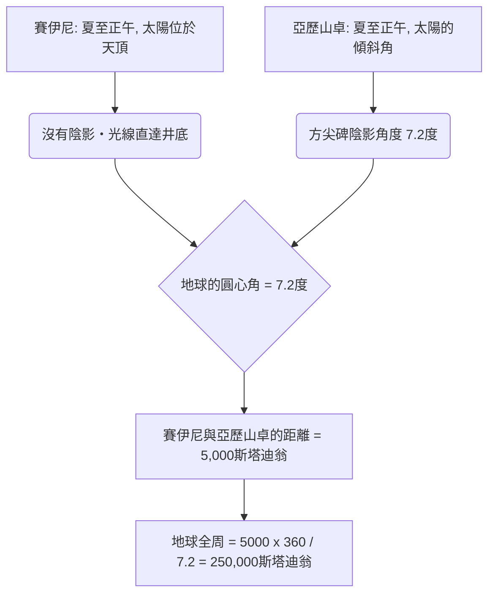
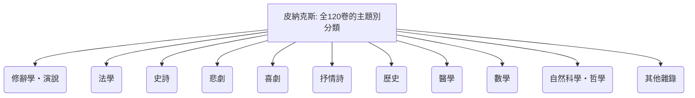
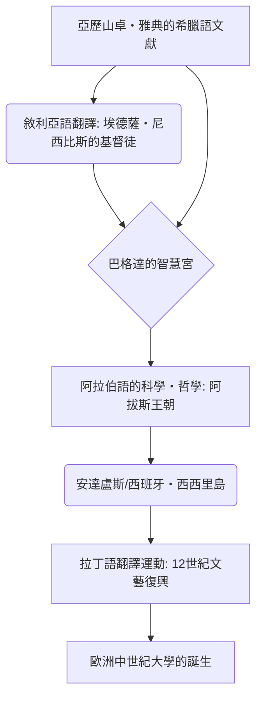

# 前言：失落的古代記憶與知識殿堂

在歷史上，人類收集、體系化知識，隨後又無情失去的過程中，埃及的「亞歷山大圖書館（Great Library of Alexandria）」無疑是最能激發人們想像力，讓人感受到浪漫與悲哀的存在。這座匯集了古代地中海世界所有智慧的巨大知識神殿，絕不僅僅是一個單純的書籍儲存庫。它曾是最尖端的學術研究所，是異文化交匯的國際大都會，更重要的是，它是「知識帝國主義」的結晶。

本文將交叉運用古代地中海史、古典文獻學、書籍史以及圖書館資訊學等多個學術視角，以前所未有的細節與學術深度，描繪出亞歷山大圖書館從誕生到繁榮，再從破壞之謎到中世紀與近代的知識傳承史。

---

## 第1章：亞歷山大大帝的野心與希臘化世界的誕生

### 亞歷山卓的建設與地中海世界的重組

西元前332年，馬其頓的年輕征服者亞歷山大大帝使埃及無血開城，並下令在尼羅河三角洲西端、面臨地中海的漁村拉科提斯（Rhacotis），建設一座冠以自己名字的新首都「亞歷山卓（Alexandria）」。由大帝的首席建築師迪諾克拉特斯（Dinocrates）設計的這座城市，採用了希臘都市計畫中常見的希波達莫斯（Hippodamian）網格系統，充分利用了夾在地中海與馬雷奧蒂斯湖（Lake Mareotis）之間狹長的地形，以一條東西延伸的壯麗大道（卡諾波斯大道，Canopic Way）為主軸。

亞歷山卓不僅僅被期望作為埃及的首都，更要成為融合希臘與馬其頓世界（Hellas）以及東方世界（Orient）的「希臘化（Hellenism）」文化心臟。大帝本人並未等到城市完工便踏上東征之旅，並客死於巴比倫，但他未竟的遺志與龐大的帝國，被他的繼業者（Diadochi）們所瓜分。掌握埃及的，是大帝的兒時玩伴兼親信——托勒密一世·索特爾（Ptolemy I Soter，意為救主）。

### 托勒密一世的文化政策與「知識帝國主義」

開創托勒密王朝的托勒密一世深知，單靠軍事統治無法管理一個龐大的多民族國家。他決心在亞歷山卓建立一個取代雅典的新世界文化中心。這個計畫的核心，便是一個異想天開的構想：「將世界上所有的書籍匯集於一堂」。

支撐這個構想的理論支柱，是從雅典流亡而來的亞里斯多德學派（逍遙學派）哲學家法勒魯姆的德米特里（Demetrius of Phalerum）。德米特里擁有作為雅典僭主主政十年的經驗，同時具備亞里斯多德的呂克昂（Lyceum，學園）藏書建構知識。他向托勒密一世進言：與其單純以武力統治，不如收集、翻譯並研究所有民族的紀錄、法律、思想與科學，這才是真正普世帝國的條件。

這可稱之為「知識帝國主義（Intellectual Imperialism）」。過去阿契美尼德王朝的波斯與亞述的國王們（例如亞述巴尼拔國王的尼尼微圖書館）也曾擁有文獻庫，但托勒密王朝的規模與目的完全不在同一個層次。他們的目標是收集已知世界所有語言（希臘語、埃及語、希伯來語、波斯語等）的文獻，並將其翻譯與整合為希臘語。舊約聖經的希臘語譯本《七十士譯本（Septuagint）》據說就是在亞歷山卓完成的傳說（阿里斯提亞斯書信），也是放在這種普世知識收集政策的脈絡中。

---

## 第2章：皇家研究所「繆斯神殿（Museion）」的全貌

### 作為學術神殿的結構與學者的特權

我們今天所稱的「亞歷山大圖書館」，並非一座獨立的建築，而是被稱為「繆斯神殿（Museion）」的皇家巨大學術研究機構群的一部分，或是其附屬設施。「Museion」字面上的意思是「繆斯（掌管文藝的九位女神）的神殿」，這也是現代「博物館（Museum）」一詞的語源。

地理學家斯特拉波記錄道，繆斯神殿緊鄰王宮區域（Bruchion），設有散步道（Peripatos）、談話室（Exedra），以及供學者們共同用餐的大食堂（Syssition）。可以說，繆斯神殿是現代高等研究所與研究所大學（例如普林斯頓高等研究院）的原型。

被受邀至此的學者們（皇家研究員），被賦予了驚人的特權。他們從王室獲得高額的終身年金，免除一切稅務，並免費提供住宿與飲食。他們唯一的義務是探求知識、從事著作活動，有時還需教育王族子弟。在這個全宿制的學術共同體中，最鼎盛時期聚集了上百位世界頂級學者，不分晝夜地沉浸在討論與研究中。

### 終極的文獻校勘與校勘記號的發明

繆斯神殿最重要的一項事業，是確立荷馬等古典文學的文本。在當時手抄的紙莎草卷軸中，抄寫員的筆誤、漏字，或是演員們隨意的添加內容非常普遍。

歷任圖書館長，包括以弗所的澤諾多托斯（Zenodotus）、拜占庭的阿里斯托芬（Aristophanes of Byzantium），以及薩莫色雷斯的阿里斯塔克斯（Aristarchus of Samothrace）等文獻學家，確立了比較多個不同抄本，並還原最接近本來面貌文本的「文獻校勘（Textual Criticism）」學問。

他們發明了一套在文本空白處寫上特殊校勘記號的系統。
- **方尖碑號（Obelus, – 或 ÷）**：標示疑似偽作或後人添加的行。
- **星號（Asterisk, ※）**：標示重複或錯誤插入，但原本應該在其他地方的重要行。
- **右尖號（Diple, >）**：標示需要註解的重要段落，或文法上有趣的段落。

這種賦予中繼資料（Metadata）的記號，可說是現代標記語言（XML或HTML）思想的萌芽，是一項劃時代的資訊處理技術。

### 科學的黃金時代：埃拉托斯特尼與阿基米德

繆斯神殿不僅在人文科學，在自然科學領域也留下了人類歷史上的成就。

**埃拉托斯特尼測量地球周長**
擔任第三任圖書館長的昔蘭尼的埃拉托斯特尼（Eratosthenes），以驚人的幾何學洞察力計算出了地球的大小。他得知，在夏至正午，埃及南部城市賽伊尼（Syene，現在的阿斯旺）的陽光能直射到深井的底部（太陽位於天頂）。另一方面，在同一天的同一時間，位於正北方的亞歷山卓，他從日晷方尖碑的陰影角度測量出，太陽偏離天頂約7.2度（全圓周360度的50分之一）。

埃拉托斯特尼以亞歷山卓和賽伊尼之間的距離為5,000斯塔迪翁（Stadion，根據駱駝商隊的移動天數推測）為基礎，建立以下比例式。
`7.2度 : 360度 = 5,000斯塔迪翁 : 地球的周長`
計算結果，地球的全周長被算出為250,000斯塔迪翁。假設1斯塔迪翁約為157.5公尺（埃及的斯塔迪翁），則約為39,375公里，與實際的地球赤道周長（約40,075公里）相比，誤差不到2%，精確度驚人。

**解剖學與幾何學**
在醫學領域，迦克墩的赫洛菲洛斯（Herophilos）與科斯島的埃拉西斯特拉圖斯（Erasistratus）在繆斯神殿的保護下，系統性地進行了人類史上首次人體解剖（一說是對死刑犯的活體解剖）。赫洛菲洛斯證明了大腦是智力的所在地，將神經系統分為運動神經與感覺神經，更指出血液的脈搏與心臟的幫浦功能之間的關聯。

此外，曾在亞歷山卓學習，或透過書信與繆斯神殿學者們交流的，是敘拉古的阿基米德（Archimedes）。他發明了也被用於尼羅河治水的「阿基米德螺旋抽水機」，發現了浮力原理，使用窮竭法計算圓周率，以及拋物線的求積等。據傳，著有《幾何原本》將幾何學體系化的歐幾里得（Euclid），也曾在亞歷山卓對托勒密一世說出：「幾何學沒有皇家大道」。

---

## 第3章：書籍收集的狂熱與藏書目錄的革命

### 不擇手段的書籍收集：港口的沒收與雅典的悲劇

為了充實繆斯神殿的圖書館，托勒密王朝歷代國王有時甚至採取近乎瘋狂的強硬手段來搜刮書籍。亞歷山大圖書館不僅僅是買書，更是透過動用國家權力的系統，讓藏書呈爆炸性增長。

最著名的手法被稱為「船隻書籍（ek ploion）」的審查與沒收強制徵用系統。所有進入地中海貿易中心亞歷山卓港的商船與客船，都會受到埃及海關官員的嚴格臨檢。如果在貨物中發現書籍（紙莎草卷軸），不論歸誰所有，都會被立即沒收。被沒收的書會送到圖書館的抄寫室（Scriptorium），由專業的書記員日以繼夜地快速製作出精巧的抄本。令人驚訝的是，歸還給原主的是「新製作的抄本」，而「原本（Original）」則作為圖書館的藏書被永久收藏。抄本上會附有「從某某船隻沒收」的來源（Provenance）標籤。

此外，在托勒密三世·歐厄爾葛特斯（Ptolemy III Euergetes）時代，還有一個著名的外交欺詐事件。國王向雅典政府要求借閱希臘三大悲劇詩人（埃斯庫羅斯、索福克勒斯、歐里庇得斯）的「國家公認官方原本」。這些原本被嚴密保管在雅典的國家檔案館中，是神聖的文化遺產。雅典方面提出借出的條件，是要求高達15塔蘭同（相當於現代價值數十億日圓）的龐大現金保證金，但托勒密三世毫不猶豫地支付了這筆錢。然而，當原本抵達亞歷山卓後，國王卻讓最優秀的書記員用最高級的紙莎草製作了精巧的抄本，並將抄本送回雅典。國王任由15塔蘭同的保證金被雅典沒收（實質上是超高價收購），就這樣將珍貴的原本作為圖書館的至寶奪了過來。這可以說是希臘化時代超級大國強奪文化資本的事件。

### 卡利馬科斯與《皮納克斯》：世界首部綜合圖書分類目錄的誕生

這種不擇手段收集的結果，據說亞歷山大圖書館的藏書量在主館（王宮區）達到了數十萬卷（一說50萬卷至70萬卷），在塞拉皮翁分館則達到4萬卷以上。當資訊量如此龐大時，單靠人類的記憶與實體排列，已經不可能找到目標文獻。為此，將單純的卷軸堆變成「知識資料庫」的「搜尋系統（資訊檢索架構）」便成為不可或缺的東西。

在圖書館資訊學上完成這項史上最大突破的，是出身昔蘭尼的詩人兼天才學者卡利馬科斯（Callimachus，約西元前310年 - 前240年）。雖然據說他未曾正式就任圖書館長，但他卻是圖書館藏書管理的實質負責人。

卡利馬科斯編纂了一部涵蓋圖書館所有藏書、多達120卷的龐大目錄《皮納克斯（Pinakes：字面意思為「書板」，正式名稱為「在各個學問領域活躍的人們及其著作的目錄」）》。這不僅僅是一份庫存清單（Inventory），而是人類史上第一部有系統的「主題分類目錄（Subject Catalog）」。

《皮納克斯》的分類體系，將以下類別設定為大分類（Main Class）。

更進一步，卡利馬科斯的天才之處在於他在這個大分類之下，賦予了精細的書目資訊（中繼資料）。在每個類別中，作者按字母順序排列，並記載了以下結構化資料：

- **作者姓名與傳記**：作者的名字、出生地、父親的名字、老師的名字以及簡單的經歷（Biography）。這作為區分同名同姓作者的權威控制（Authority Control）來發揮作用。
- **著作的標題**：如果沒有標題，則會根據內容賦予一個暫定標題。
- **開頭詞（Incipit）**：每部著作最初的幾個詞到第一行。由於古代紙莎草卷軸的標題常常遺失，這是一種用正文開頭來識別作品（類似雜湊值功能）的方法。
- **卷數與總行數（Stichometry）**：整部著作的卷數與精確的文本行數。行數的紀錄，一方面是計算支付給抄寫員報酬的基準，另一方面也扮演了驗證文本是否被後人竄改或頁面遺失的「校驗碼（Check Sum，完整性驗證）」角色。

卡利馬科斯的這種資訊整理架構，經過中世紀修道院圖書館的目錄，直接聯繫到現代圖書館的杜威十進位圖書分類法（DDC）、OPAC（線上館藏目錄），甚至關聯式資料庫的結構，可說是最本質且普遍的資訊處理技術始祖。

---

## 第4章：紙莎草卷軸（Volumen）的物質性與抄寫技術：古代的媒體環境與計量書誌學

### 尼羅河的恩賜與抄寫的基礎設施

在物質層面上從根本支撐亞歷山大圖書館繁榮的，是一種名為「紙莎草（Papyrus）」的紀錄媒體。這種紙由野生於尼羅河三角洲濕地、莎草科的挺水植物（Cyperus papyrus）製成，在古代地中海世界中，是超越泥板與獸皮的最佳資訊紀錄媒體。正如老普林尼在《自然史》中詳細描述的，紙莎草的製造過程是一項高度專業化的手工業。

首先，剝去植物粗大莖部（橫截面呈三角形）的表皮，用針或薄刀片將內部的髓（Pith）縱向切成薄片。將這些薄而帶狀的細長片（Philyra）無縫隙地排列在濕潤的木板上，接著在上面再鋪上一層，這次改以直角交叉的方式排列。利用尼羅河的泥水或特別調製的黏合劑（或植物本身的黏液），用木槌用力敲打整體使其壓合，並在陽光下曬乾，便完成了一張輕薄、柔軟且耐用的紙張（Kollema）。最高品質的紙莎草被稱為「神官用紙（Hieratica）」，或冠以奧古斯都皇帝之名的「奧古斯塔（Augusta）」，潔白光滑且極為昂貴。

將這些紙張用麵粉糊一張張連接起來，便製成了長長的「卷軸（Volumen，希臘語為Biblion）」。一般的卷軸是由約20張紙（Kollema）連接而成的（Scapus），作為標準銷售單位在市場上流通。

書寫工具使用一種名為卡拉姆斯（Calamus）的筆，它是將堅硬蘆葦莖的前端剖開製成。與埃及古老的燈心草筆（刷子）不同，為了能銳利地寫下希臘字母，筆尖被切割得很尖銳。墨水（Atramentum）主流是由煤煙、阿拉伯膠與水混合製成的碳黑墨水。這種墨水只會附著在紙張纖維表面，而不會滲透到內部，因此可以用海綿輕易洗掉並重複使用。但同時它的化學性質極度穩定，即使經過了數千年，在沙漠乾燥地帶發現的紙莎草，至今仍保持著烏黑的文字。用於重要標題、裝飾，或是幫助閱讀的注音與校勘記號，則使用紅色墨水（氧化鐵或硫化汞製成的朱紅色）。

### 卷軸的極限與計量書誌學上的限制：字數與行數的幾何學

然而，紙莎草卷軸這種格式，作為資訊技術存在著物理上的極限。
1. **長度與重量的限制**：如果卷軸太長，會變得笨重難以操作，在展開（Explicare）時紙莎草容易疲乏而損壞。實用的極限長度大約在10公尺左右，這相當於荷馬《伊利亞特》的一卷長度（約700至900行）。卡利馬科斯留下的一句名言：「大書是個大災難（Mega biblion, mega kakon）」，不僅是因為他偏好希臘化文學特有的洗練簡潔等美學理由，也是從實務工作者的角度，指出了卷軸在物理處理上的繁瑣與容易劣化的問題。長篇的歷史書等，不可避免地必須分割成多個卷軸（Tomos）來保存與管理。
2. **隨機存取的困難**：卷軸是一種從頭到尾順序滾動閱讀的「循序存取」媒體，要瞬間跳到特定頁面或行數（例如第7卷中間的某個段落）即「隨機存取」，是極為困難的。這對於學者同時打開多份文獻進行比較參考（交叉參照，Cross-reference）的工作來說，強加了巨大的認知負擔與時間成本。
3. **分欄（Kolymbos）的排版規則**：在卷軸上，文字被寫成連續的區塊（稱為Kolymbos的縱向段落・欄位）。每欄的寬度約為5至8公分，行距保持均勻，單詞之間沒有空格（分詞），連續書寫文字的「連續書寫（Scriptio Continua）」是普遍的做法。這要求讀者具備高度的朗讀技巧。
4. **保管與管理（圓筒盒與標籤）**：卷軸被纏繞在稱為Omphalos的木軸（滾輪）上，直立保存在Capsa（圓筒形盒子）中，或平放在架子（Pit）上。為了從外部識別內容，卷軸的末端會附上一個被稱為「標籤（Sillybos）」的羊皮紙或紙莎草小牌子，上面寫著作者名字與標題。這發揮了現代書脊的作用，但缺點是頻繁拿取時很容易被撕斷。

### 向冊子本（Codex）的過渡與媒體轉換的成本

在西元2世紀到4世紀期間，隨著基督教爆炸性的普及，發生了從紙莎草卷軸轉向「冊子本（Codex）的典範轉移（人類史上最大的媒體革命之一）」。將羊皮紙（Parchment）或紙莎草對折並捆綁，用線縫合書脊的冊子本，因為正反兩面（Recto與Verso）都能毫無浪費地書寫，資訊密度高（減少物理體積），更重要的是可以瞬間翻到特定頁面（實現隨機存取與使用書籤），具有壓倒性的優勢。

在亞歷山大圖書館的末期，在這個媒體轉型的時期，他們必然面臨了將龐大卷軸藏書重寫為新冊子本格式（格式遷移，Format Migration）的龐大成本。在這次重寫作業中被遺漏的文獻，亦即「未能被冊子本化的卷軸」，最終便過時、無人閱讀，並因潮濕或蟲害而面臨永遠消失的命運。圖書館對藏書的選擇與淘汰，決定了歷史上文本的存活率。

---

## 第5章：破壞的神話與真相：是什麼摧毀了圖書館？

亞歷山大圖書館「在何時、被誰摧毀？」這個問題，是歷史上最大的謎團之一，常常被當作一個戲劇性的大火在瞬間將其化為灰燼的「神話」來流傳。然而，現代歷史學與考古學表明，圖書館的消失並非單一事件，而是幾個世紀以來多重破壞與衰退過程的結果。

### 1. 西元前48年：尤利烏斯·凱撒與亞歷山卓戰爭

最著名的破壞傳說是由羅馬將軍尤利烏斯·凱撒（Julius Caesar）所為。追擊龐培而在埃及登陸的凱撒，與克麗奧佩脫拉七世結盟，並參與了亞歷山卓戰爭。為了防止自己的艦隊被托勒密王朝艦隊奪走，凱撒放火焚燒了港口的船隻。普魯塔克等後世歷史學家記載，這場大火從港口蔓延到陸地，將大圖書館（或者港口倉庫裡數十萬卷書籍）燒毀。
然而，凱撒自己的《內戰記》中並沒有提到圖書館被燒毀的事情。此外，幾十年後斯特拉波訪問亞歷山卓時，繆斯神殿的設施依然在運作。因此，現代多認為凱撒的大火燒毀的，很可能是圖書館的「分館」，或者是為了進出口而存放在港口倉庫中的一部分書籍。

### 2. 西元270年代：奧勒良皇帝對城市的徹底破壞

對圖書館主體造成決定性打擊的，被認為是西元3世紀後半葉羅馬帝國的內亂。帕米拉王國的齊諾比婭（Zenobia）佔領了亞歷山卓，隨後羅馬皇帝奧勒良（Aurelian）為奪回城市展開了激烈的巷戰。
在這場戰鬥中，王宮區（Bruchion）整體遭到徹底破壞並淪為荒蕪。繆斯神殿與大圖書館也在這時連同建築物一起被徹底摧毀，藏書也四散或燒毀，這是現代歷史學中最有力的見解。

### 3. 西元391年：狄奧多西皇帝與基督徒對塞拉皮翁的破壞

大圖書館消失後，在亞歷山卓西南部的薩拉皮斯神巨大神殿「塞拉皮翁（Serapeum）」中，仍然存在著圖書館的分館（姐妹館），延續著學問的命脈。
然而，羅馬皇帝狄奧多西一世將基督教定為國教，並頒布了破壞異教神殿的命令。對此，亞歷山卓的強硬派基督教主教提奧菲魯斯（Theophilus）和狂熱的修道士群眾襲擊了塞拉皮翁，將壯麗的神殿摧毀殆盡。這時，保存在神殿內的紙莎草卷軸，也被推測作為異教邪惡書籍遭到了焚毀。這個事件與後來（西元415年）發生的女性數學家海帕婭（Hypatia）慘死事件一起，作為象徵古代自由學術探索終結的悲劇而被流傳下來。

### 4. 西元642年：伊斯蘭征服與哈里發歐麥爾的傳說

由13世紀的基督徒與阿拉伯編年史家所創造出最聳動的神話，就是伊斯蘭軍隊破壞的傳說。阿拉伯將軍阿姆魯·伊本·阿斯（Amr ibn al-As）征服亞歷山卓時，曾向哈里發歐麥爾·伊本·哈塔卜（Umar ibn al-Khattab）詢問如何處置圖書館的書籍。據說歐麥爾這樣回答：
「如果那些書與可蘭經一致，既然有了可蘭經就不需要它們。如果與可蘭經相悖，那就是有害的。因此全部燒掉吧。」
於是，這些藏書被分發到亞歷山卓的4,000個公共澡堂作為鍋爐的燃料，據說燃燒了半年之久。
但是，現代研究者斷定這個情節完全是虛構的（後世的捏造）。因為在7世紀伊斯蘭征服的時代，經歷了數百年的戰亂、預算的枯竭，以及紙莎草的自然劣化（在潮濕的海濱氣候中，紙莎草幾百年就會腐朽），曾經的大圖書館早已消失得無影無蹤。

---

## 第6章：知識的避難與駛向中世紀及文藝復興的大航海：人類記憶的生存戰

亞歷山卓的實體建築與紙莎草化為灰燼，回歸塵土。但是，在那裡培養出來的「古代智慧」的DNA，並沒有完全斷絕。透過令人驚奇的、跨越幾個世紀的知識接力，它的一部分經由敘利亞、波斯、阿拉伯半島、北非、伊比利半島，完成了通向現代我們手中這場漫長的航海。

### 從敘利亞語到阿拉伯語：巴格達的智慧宮與大翻譯運動

5世紀到6世紀期間，為了逃避拜占庭帝國基督教正統派（迦克墩派）對異端的迫害，聶斯脫里派與單性論派的學者們，逃往東方的敘利亞與薩珊王朝波斯。特別是埃德薩（Edessa，現在的烏爾法）、尼西比斯（Nisibis），以及波斯的貢迪沙普爾（Gundeshapur）醫學院，成為了繼承希臘學問的新據點。他們將亞里斯多德的邏輯學（《工具論》）、蓋倫與希波克拉底的醫學、托勒密的天文學（《天文學大成》）等深奧的希臘語文獻，首先翻譯成了敘利亞語（亞蘭語的一種方言）。這成為了中東地區希臘知識的第一道橋樑。

之後，在8世紀伊斯蘭帝國阿拔斯王朝興起，哈里發曼蘇爾與馬蒙等人，在新首都巴格達設立了一個名為「智慧宮（Bayt al-Hikmah）」的巨大翻譯與研究機構。這簡直可以被稱為「第二個繆斯神殿」的國家級專案。

在這裡，以海奈因·伊本·伊斯哈克（Hunayn ibn Ishaq，聶斯脫里派基督徒的阿拉伯人）為首的天才翻譯家們，展開了從敘利亞語到阿拉伯語，或是直接從希臘語到阿拉伯語的史無前例的大規模翻譯運動（希臘—阿拉伯翻譯運動）。海奈因並非只是直譯，而是在進行文本的校勘（比較多個抄本確定正確的含義，這是亞歷山卓的文獻學手法）之後，創造出阿拉伯文中新的哲學、科學專業術語（例如「質」、「量」、「本質」等抽象概念）。

亞歷山卓的知識，在伊斯蘭世界這片新的沃土上綻放，並完成了獨特的進化。花拉子密（代數學之父）、肯迪（阿拉伯哲學之祖）、伊本·西那（拉丁名阿維森納，醫學典範的作者），以及伊本·魯世德（拉丁名阿威羅伊，亞里斯多德終極注釋者）等伊斯蘭的大學者們，不僅吸收了希臘的知識，更批判性地超越了它，築起了世界最高峰的科學技術水準。

*(※上圖為希臘・阿拉伯・拉丁翻譯運動的系統圖)*

### 拜占庭帝國的抄本保存與回流至義大利文藝復興

另一方面，也有留在希臘語圈的知識譜系。在東羅馬帝國（拜占庭帝國）的首都君士坦丁堡，以及阿索斯山的修道院中，修道士們將希臘語的古典文獻不斷地抄寫在羊皮紙冊子本上並保存下來。9世紀發生了被稱為「馬其頓王朝文藝復興」的古典復興，編纂了佛提烏大主教的《書目（Bibliotheca，讀書錄）》，以及《蘇達辭書（Suda，希臘語的巨大百科全書）》等，古代的知識被摘要與保存了下來。

在12世紀的「12世紀文藝復興」中，從伊斯蘭世界（西班牙的托雷多與南義大利的西西里）經由阿拉伯語被翻譯成拉丁語的知識流入西歐，促進了巴黎與波隆那等歐洲大學（Universitas）的誕生。

此外，當1453年君士坦丁堡被鄂圖曼帝國攻陷時，以格奧爾基烏斯·傑彌斯托士·普萊桑（Georgios Gemistos Plethon）為首的許多拜占庭學者，抱著珍貴的希臘語抄本（如柏拉圖全集等）流亡到義大利半島。這直接引起了美第奇家族統治下的佛羅倫斯，以及活字印刷蓬勃發展的威尼斯，對希臘古典的重新發現，並成為推動基於人文主義的義大利文藝復興的強大原動力。

### 對現代數位亞歷山卓的提問與永遠的課題

今天，在2002年，埃及政府與聯合國教科文組織合作，在曾經的圖書館遺址附近建造了一座巨大的圓盤狀新圖書館「亞歷山卓圖書館（Bibliotheca Alexandrina）」，實現了象徵性的復活。

此外，在網際網路的網路空間中，也存在著像「網際網路檔案館（Internet Archive）」這樣，試圖將世界上所有網頁、書籍、影片數位化並保存的現代版「亞歷山卓之夢」。Google Books專案，也確實可以說是托勒密王朝知識帝國主義的現代體現。

然而，我們必須從古代圖書館的命運中學習到沉重的教訓。即使記錄媒體從紙莎草變成了矽晶片與雲端儲存，資料的總量膨脹到了艾字節（Exabyte）的規模，威脅知識保存與傳承的本質風險卻依然沒有改變。戰爭、恐怖主義、獨裁政治意識形態的審查、專案資金的枯竭，以及最重要的「格式的過時（數位黑暗時代的危機）」問題。在軟體與硬體幾年內就會規格落後的現代，500年後、1000年後，誰能夠以及如何讀取現在的數位資料，目前還沒有確切的答案。

亞歷山大圖書館的興衰史，跨越數千年的時空，深刻地向我們訴說著：人類收集、守護、傳遞知識的營生是多麼的脆弱，同時又需要多麼堅韌的意志與持續不斷的努力（從抄本到抄本的無間斷轉寫）。

---
