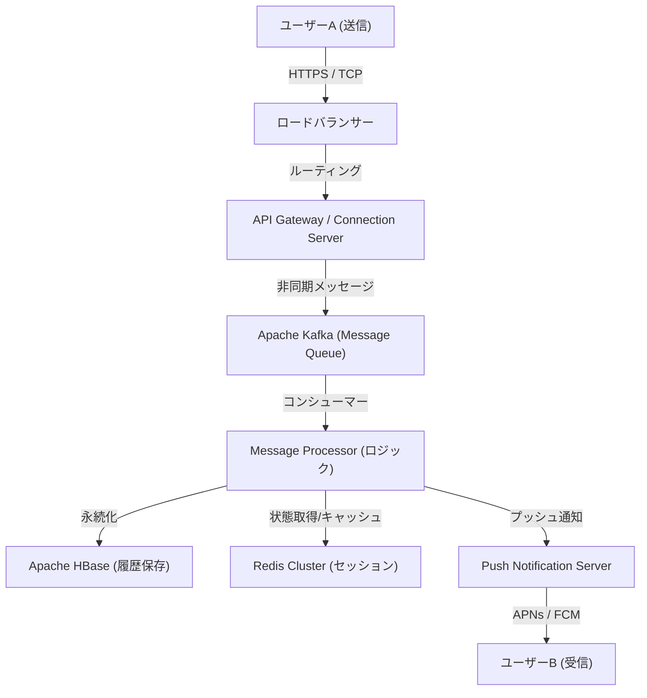

# مقدمة: "التواصل" الذي وُلد من أزمة غير مسبوقة

في 11 مارس 2011، ضرب زلزال شرق اليابان الكبير اليابان. سلطت هذه الكارثة التي جلبت دمارًا غير مسبوق الضوء على هشاشة البنية التحتية للاتصالات الحالية. مع تعطل خطوط الهاتف وصعوبة حتى التحقق من سلامة العائلة والأصدقاء، اضطر الكثير من الناس إلى الاعتماد على وسائل الاتصال القائمة على الإنترنت (مثل Twitter و Skype).

في ذلك الوقت، شهد فريق NHN Japan (حالياً LINE Yahoo) هذا المشهد وشعر بإحساس قوي بالمهمة. "نحن بحاجة إلى أداة اتصال بسيطة ومستقرة تتيح لك التواصل بشكل موثوق مع أحبائك تحت أي ظروف". من هذا الشعور الملح، بدأ مشروع LINE بوتيرة سريعة. في يونيو 2011، بعد بضعة أشهر فقط من الزلزال، أبصر LINE النور.

# الفصل الأول: انتشار الهواتف الذكية وانفجار ثقافة الملصقات

كان عام 2011، عندما ظهر LINE، أيضاً فترة تحول سريع من الهواتف المحمولة التقليدية (الهواتف المميزة) إلى الهواتف الذكية. استفاد LINE بالكامل من خصائص الهواتف الذكية المتمثلة في "حملها دائماً" و"تلقي إشعارات الدفع" لتقديم تجربة دردشة عالية في الوقت الفعلي.

ومع ذلك، فإن العامل الأكبر الذي دفع LINE من مجرد تطبيق دردشة إلى "بنية تحتية وطنية" هو بلا شك تقديم ميزة **"الملصقات (Stickers)"**.

## ثورة التواصل غير اللفظي التي أحدثتها الملصقات

قد تبدو الرسائل النصية أحيانًا باردة، أو قد يكون من الصعب نقل الفروق الدقيقة للمشاعر. خاصة في ثقافة عالية السياق مثل اليابان، يتم التركيز على "قراءة الجو" و "تخمين المشاعر". جعلت الملصقات من الممكن نقل المشاعر الغنية والفروق الدقيقة الدقيقة بنقرة واحدة فقط.

* **السهولة والسرعة**: توفر عناء كتابة رد وتسمح بالتفاعل الفوري.
* **تنوع التعبير**: لا يقتصر على المشاعر فحسب، بل يجسد بصرياً أيضاً التحيات اليومية مثل "فهمت" و"عمل جيد".
* **سوق المبدعين**: مع "LINE Creators Market" الذي تم إطلاقه في عام 2014، أصبح بإمكان أي شخص، من رسامي الرسوم المتحركة المحترفين إلى المستخدمين العاديين، إنشاء وبيع الملصقات، مما أدى إلى ولادة نظام بيئي فريد ومنطقة اقتصادية.

# الفصل الثاني: من تطبيق مراسلة إلى "تطبيق فائق"

مع توسع قاعدة المستخدمين، بدأ LINE في التطور من مجرد تطبيق مراسلة إلى "تطبيق فائق" يدعم جميع جوانب الحياة اليومية. كان هذا نموذجاً رائداً لتطبيقات مثل WeChat في الصين، ولكن تم تحسين LINE ليناسب الاحتياجات المحلية لليابان وجنوب شرق آسيا (مثل تايوان وتايلاند وإندونيسيا).

## مسار تطوير المنصة

1. **LINE GAME**: ألعاب ناجحة للغاية تستفيد من الرسوم البيانية الاجتماعية (علاقات الأصدقاء)، مثل "LINE POP" و "LINE: Disney Tsum Tsum". زادت هذه الألعاب بشكل كبير من وقت بقاء المستخدمين.
2. **LINE NEWS / Manga / Music**: ترسيخ مكانتها كمنصة لتوزيع المحتوى.
3. **LINE Pay**: خدمة دفع عبر الهاتف المحمول. ركوباً لموجة التحول نحو مجتمع غير نقدي، أتاحت الدفع في المتاجر الفعلية والتحويلات المالية بين الأفراد.
4. **حسابات LINE الرسمية (Official Accounts)**: أصبحت وجوداً لا غنى عنه كأداة لإدارة علاقات العملاء (CRM) للشركات والمتاجر للتواصل مباشرة مع المستخدمين.

وبهذه الطريقة، تطور LINE إلى منصة حيث يمكن إكمال جميع أنشطة اليوم، مثل "الاستيقاظ في الصباح وقراءة الأخبار، وقراءة المانغا في القطار، والتواصل مع الأصدقاء، والدفع في المتاجر الصغيرة".

# الفصل الثالث: البنية التحتية الضخمة وبنية الاتصالات التي تدعم LINE

مئات الملايين من المستخدمين النشطين شهرياً يرسلون ويستقبلون عشرات المليارات من الرسائل يومياً في الوقت الفعلي. ما هو الأساس التقني لمعالجة هذه الحركة الهائلة دون تأخير وبشكل موثوق؟

## تطور البنية التحتية للمراسلة واعتماد Erlang/HBase

بدأ LINE في أيامه الأولى بتكوين صغير الحجم، ولكن مع الزيادة السريعة في حركة المرور، أصبحت قابلية التوسع وتحمل الأخطاء مهاماً ملحة. لذلك، تم بناء بنية متخصصة في المعالجة في الوقت الفعلي.

### بوابة الوقت الفعلي
مجموعة من خوادم البوابة التي تحافظ على اتصال دائم (TCP/WebSocket) مع أجهزة المستخدمين. يتطلب هذا تقنية قادرة على معالجة عدد كبير من الاتصالات المتزامنة بموارد منخفضة. في LINE، يتم استخدام تقنيات مثل الإدخال/الإخراج غير المتزامن (Asynchronous I/O) ونموذج الممثل (Actor model) للتعامل مع مئات الآلاف من الاتصالات المتزامنة على خادم واحد.

### معالجة بيانات فائقة السرعة بواسطة HBase و Redis
* **Apache HBase**: قاعدة بيانات NoSQL موزعة لاستمرار سجل الرسائل الهائل. تتميز بقابلية التوسع الفائقة وتتيح قراءة وكتابة سجلات الدردشة الخاصة بكل مستخدم بسرعة عالية.
* **Redis**: تلعب دوراً كبيراً كطبقة تخزين مؤقت وقوائم انتظار مؤقتة. يتم استخدامها لتخزين البيانات التي تتطلب سرعة وصول بالميلي ثانية، مثل أحدث الرسائل ومعلومات الجلسات.

## الانتقال إلى بنية الخدمات المصغرة (Microservices)

من نظام متجانس (تطبيق واحد ضخم) في البداية، تم الانتقال تدريجياً إلى بنية الخدمات المصغرة، حيث يتم تقسيم الوظائف إلى خدمات مستقلة.

* **gRPC و Protobuf**: للاتصال بين الخدمات، يتم استخدام gRPC و Protocol Buffers السريعة والآمنة من حيث النوع. يتيح ذلك معالجة فعالة للحركة الهائلة التي تحدث بين مئات الخدمات المصغرة.
* **Apache Kafka**: يعمل Kafka كمركز للتواصل غير المتزامن وخطوط أنابيب البيانات بين الخدمات. يتم تسليم أحداث إرسال الرسائل، أحداث القراءة، وسجلات النظام إلى كل خدمة عبر Kafka.

## مزامنة مراكز البيانات العالمية

يمتلك LINE حصة ساحقة ليس فقط في اليابان، بل أيضاً في تايوان، تايلاند، إندونيسيا، وغيرها. لذلك، يتم تقديم الخدمات عبر مراكز بيانات متعددة (مناطق متعددة) لتقليل زمن الانتقال وتحسين التوافر. يتم تنفيذ مزامنة البيانات (النسخ المتماثل) بين مراكز البيانات بشكل غير متزامن، مع تطبيق آليات متقدمة لجعلها تبدو متسقة من وجهة نظر المستخدم.

# خاتمة: نحو مستقبل التواصل

وُلد LINE استجابة للحاجة الماسة "للتواصل مع الأحباء" جراء الحدث المأساوي لزلزال شرق اليابان الكبير. اختراع تواصل غير لفظي جديد من خلال الملصقات، والتطور إلى تطبيق فائق، وتقنيات الأنظمة الموزعة ذات المستوى العالمي التي تدعم ذلك.

اليوم، مع تطور تقنيات الذكاء الاصطناعي وبلوكتشين (Web3)، تتسارع موجة التكنولوجيا بشكل أكبر. يتجه LINE أيضاً نحو تطوير ميزات جديدة تدمج الذكاء الاصطناعي التوليدي وتقديم خدمات أكثر تخصيصاً.

ولكن بغض النظر عن مدى تطور التكنولوجيا أو مدى تعقيد التطبيق، فإن الفلسفة الأساسية لـ LINE تظل كما هي. إنها مهمة "Closing the Distance" (تقليص المسافة بين الناس حول العالم، وبين الناس والمعلومات/الخدمات). سيستمر LINE في التطور كبنية تحتية غير مرئية تدعم تواصلنا.
