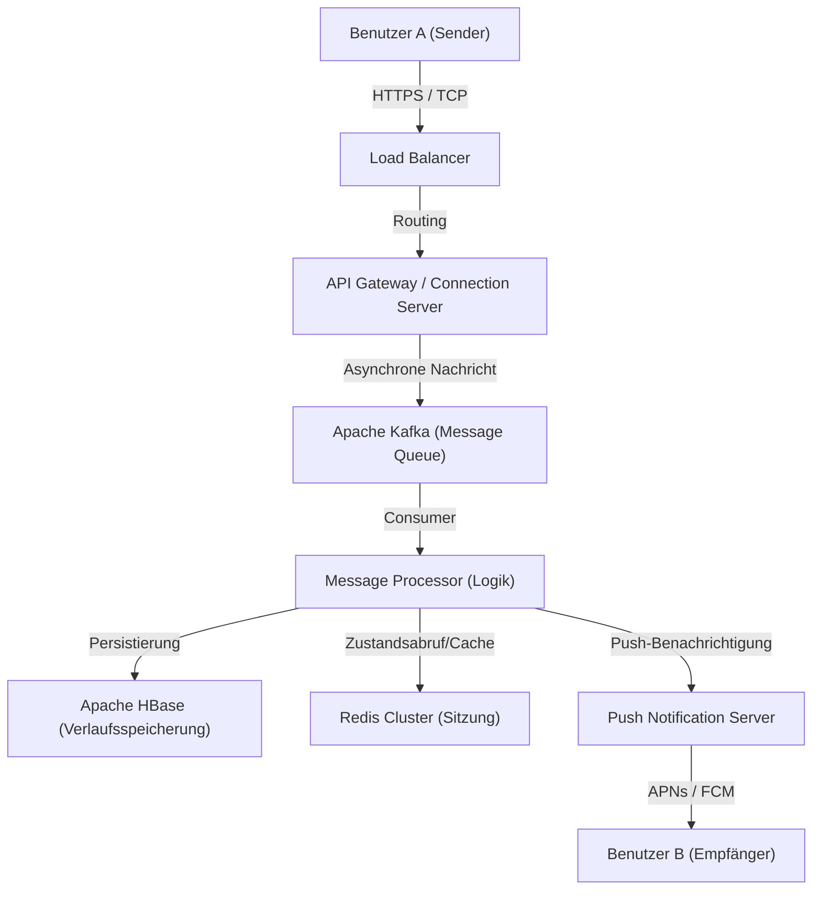

# Prolog: "Verbindung", geboren aus einer beispiellosen Krise

Am 11. März 2011 traf das große ostjapanische Erdbeben Japan. Diese Katastrophe verursachte beispiellose Schäden und deckte die Verwundbarkeit der bestehenden Kommunikationsinfrastruktur auf. Telefonleitungen waren überlastet, und selbst die Überprüfung der Sicherheit von Familie und Freunden war schwierig, was viele Menschen dazu zwang, sich auf internetbasierte Kommunikationsmittel (wie Twitter und Skype) zu verlassen.

Damals erlebte das Team von NHN Japan (jetzt LINE Yahoo) diesen Anblick und fühlte ein starkes Pflichtbewusstsein. "Wir brauchen ein einfaches, stabiles Kommunikationstool, das es uns ermöglicht, unter allen Umständen zuverlässig mit unseren Liebsten in Verbindung zu bleiben." Aus diesem dringenden Wunsch heraus startete das LINE-Projekt in rasantem Tempo. Nur wenige Monate nach dem Erdbeben, im Juni 2011, wurde LINE geboren.

# Kapitel 1: Die Verbreitung von Smartphones und die Explosion der Sticker-Kultur

Das Jahr 2011, in dem LINE erschien, war auch eine Zeit, in der der Übergang von Feature-Phones (Klapphandys) zu Smartphones rasch voranschritt. LINE nutzte die Eigenschaften von Smartphones, wie das "ständige Mitführen" und den "Empfang von Push-Benachrichtigungen", voll aus und bot ein hochgradig in Echtzeit ablaufendes Chat-Erlebnis.

Der wichtigste Faktor, der LINE von einer bloßen Chat-App zu einer "nationalen Infrastruktur" machte, war jedoch zweifellos die Einführung der **"Sticker" (Stamps)**-Funktion.

## Die durch Sticker ausgelöste Revolution der nonverbalen Kommunikation

Textnachrichten können sich manchmal kalt anfühlen oder es ist schwer, emotionale Nuancen zu vermitteln. Besonders in einer High-Context-Kultur wie der japanischen wird viel Wert darauf gelegt, "die Luft zu lesen" (die Stimmung zu erfassen) und "Gefühle zu erahnen". Sticker machten es möglich, reiche Emotionen und subtile Nuancen mit nur einem Fingertipp zu vermitteln.

* **Einfachheit und Geschwindigkeit**: Spart das mühsame Eintippen einer Antwort und ermöglicht eine sofortige Reaktion.
* **Vielfalt des Ausdrucks**: Nicht nur Emotionen wie Freude, Wut, Trauer und Spaß, sondern auch alltägliche Grüße wie "Verstanden" oder "Gute Arbeit" werden visualisiert.
* **Creators Market**: Mit dem Start des "LINE Creators Market" im Jahr 2014 konnte jeder, vom professionellen Animator bis zum normalen Nutzer, Sticker erstellen und verkaufen, was ein einzigartiges Ökosystem und eine eigene Wirtschaftszone schuf.

# Kapitel 2: Von der Messaging-App zur "Super-App"

Mit dem Wachstum der Nutzerbasis begann LINE, die Grenzen des reinen Messagings zu überschreiten und sich zu einer "Super-App" zu entwickeln, die alle Aspekte des täglichen Lebens unterstützt. Dies ist ein Modell, das durch Chinas WeChat und andere eingeführt wurde, aber LINE wurde für die lokalen Bedürfnisse in Japan und Südostasien (Taiwan, Thailand, Indonesien usw.) optimiert.

## Die Entwicklung der Plattform

1. **LINE GAME**: Spiele, die den Social Graph (Freundesnetzwerk) nutzen, wie "LINE POP" und "LINE: Disney Tsum Tsum", wurden große Hits und verlängerten die Verweildauer der Nutzer erheblich.
2. **LINE NEWS / Manga / Music**: Etablierte eine Position als Plattform für die Bereitstellung von Inhalten.
3. **LINE Pay**: Mobiler Zahlungsdienst. Auf der Welle des bargeldlosen Zahlungsverkehrs mitreitend, ermöglichte es Zahlungen in physischen Geschäften und Überweisungen zwischen Einzelpersonen.
4. **Offizielle LINE-Accounts (Official Accounts)**: Wurde zu einem unverzichtbaren CRM-Tool für Unternehmen und Geschäfte, um direkt mit Nutzern in Kontakt zu treten.

Auf diese Weise hat sich LINE zu einer Plattform entwickelt, auf der Sie alle Aktivitäten eines Tages abschließen können, wie z.B. "Morgens aufwachen und Nachrichten lesen, im Zug Manga lesen, Freunde kontaktieren und im Convenience-Store bezahlen."

# Kapitel 3: Die riesige Infrastruktur und Kommunikationsarchitektur hinter LINE

Hunderte Millionen monatlich aktiver Nutzer (MAU) senden und empfangen täglich zig Milliarden Nachrichten in Echtzeit. Welche technische Grundlage ist nötig, um diesen enormen Traffic verzögerungsfrei und zuverlässig zu verarbeiten?

## Entwicklung der Messaging-Infrastruktur und die Einführung von Erlang/HBase

Das frühe LINE startete mit einer kleinen Konfiguration, aber mit dem raschen Anstieg des Traffics wurden Skalierbarkeit und Fehlertoleranz zu dringenden Themen. Daher wurde eine auf Echtzeitverarbeitung spezialisierte Architektur aufgebaut.

### Echtzeit-Gateway

Eine Gruppe von Gateway-Servern, die eine ständige Verbindung (TCP/WebSocket) mit den Geräten der Nutzer aufrechterhalten. Hier ist Technologie gefragt, die eine große Anzahl gleichzeitiger Verbindungen mit geringen Ressourcen bewältigen kann. LINE nutzt asynchrones I/O und das Actor-Modell, um Hunderttausende von gleichzeitigen Verbindungen auf einem einzigen Server zu verarbeiten.

### Ultraschnelle Datenverarbeitung mit HBase und Redis

* **Apache HBase**: Eine verteilte NoSQL-Datenbank zur Persistierung riesiger Nachrichtenverläufe. Sie bietet eine hervorragende Skalierbarkeit und ermöglicht ein schnelles Lesen und Schreiben des Chatverlaufs jedes Nutzers.
* **Redis**: Spielt eine aktive Rolle als Caching-Schicht und temporäre Warteschlange. Es wird zum Speichern von Daten verwendet, die Zugriffsgeschwindigkeiten im Millisekundenbereich erfordern, wie z.B. aktuelle Nachrichten und Sitzungsinformationen.

## Übergang zur Microservices-Architektur

Es gab einen schrittweisen Übergang von einem frühen monolithischen (riesigen Einzelanwendungs-) System zu einer Microservices-Architektur, bei der Funktionen in unabhängige Dienste aufgeteilt wurden.

* **gRPC und Protobuf**: Für die Kommunikation zwischen den Diensten werden das schnelle und typsichere gRPC und Protocol Buffers verwendet. Dies ermöglicht eine effiziente Verarbeitung des enormen Traffics, der zwischen Hunderten von Microservices auftritt.
* **Apache Kafka**: Kafka fungiert als Hub im Zentrum asynchroner Kommunikation und Datenpipelines zwischen Diensten. Nachrichtenversandereignisse, Leseereignisse, Systemprotokolle usw. werden über Kafka an jeden Dienst verteilt.

## Globale Rechenzentrum-Synchronisation

LINE hat nicht nur in Japan, sondern auch in Taiwan, Thailand, Indonesien usw. einen überwältigenden Marktanteil. Daher wird der Dienst in mehreren Rechenzentren (Multi-Region) bereitgestellt, um Latenzen zu reduzieren und die Verfügbarkeit zu verbessern. Die Datensynchronisation (Replikation) zwischen Rechenzentren erfolgt asynchron, jedoch ist ein fortschrittlicher Mechanismus implementiert, der sicherstellt, dass die Daten für den Benutzer konsistent erscheinen.

# Fazit: Auf dem Weg in die Zukunft der Kommunikation

Geboren aus dem tragischen Ereignis des großen ostjapanischen Erdbebens, um dem dringenden Bedürfnis gerecht zu werden, "mit geliebten Menschen in Verbindung zu bleiben". Die Erfindung der neuen nonverbalen Kommunikation durch Sticker, die Entwicklung zu einer Super-App und die erstklassige verteilte Systemtechnologie, die dies unterstützt.

Gegenwärtig beschleunigt sich die Welle der Technologie durch die Entwicklung von KI-Technologien und Blockchain (Web3) weiter. LINE bewegt sich ebenfalls auf die Entwicklung neuer Funktionen unter Einbeziehung generativer KI und die Bereitstellung personalisierterer Dienste zu.

Aber egal wie sehr sich die Technologie weiterentwickelt und wie komplex die App wird, die zugrunde liegende Philosophie von LINE bleibt unverändert. Es ist die Mission von "Closing the Distance (die Distanz zwischen Menschen auf der ganzen Welt sowie zwischen Menschen und Informationen/Diensten verringern)". LINE wird sich auch in Zukunft als unsichtbare Infrastruktur, die unsere Kommunikation unterstützt, weiterentwickeln.
