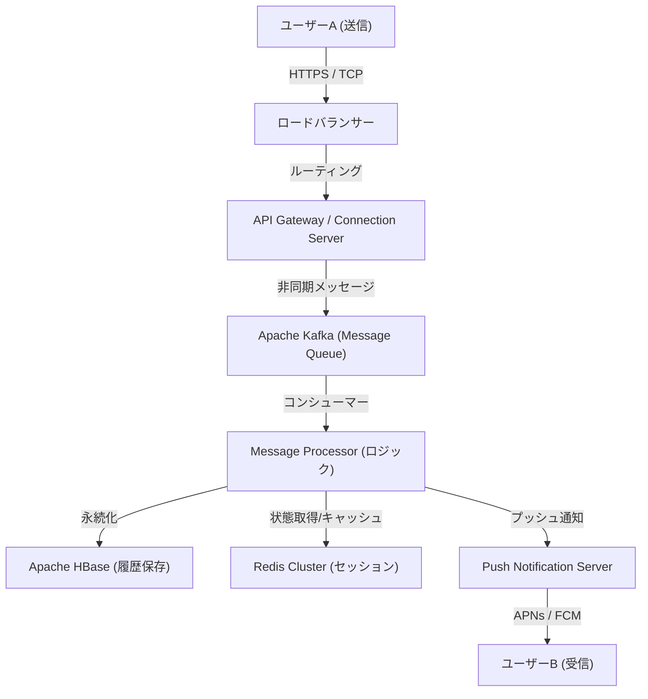

# Introduction: "Connection" Born from an Unprecedented Crisis

On March 11, 2011, the Great East Japan Earthquake struck Japan. This disaster, which caused unprecedented damage, exposed the vulnerability of existing communication infrastructures. With telephone lines overwhelmed and even confirming the safety of family and friends difficult, many people had no choice but to rely on internet-based communication tools (such as Twitter and Skype).

At that time, the team at NHN Japan (now LY Corporation) witnessed this scene and felt a strong sense of mission. "We need a simple and stable communication tool that can reliably connect people with their loved ones under any circumstances." Driven by this urgent desire, the LINE project kicked off at a rapid pace. Just a few months after the earthquake, in June 2011, LINE was born.

# Chapter 1: The Spread of Smartphones and the Explosion of Sticker Culture

The year 2011, when LINE appeared, was also a period of rapid transition from feature phones to smartphones. LINE fully leveraged the smartphone's characteristics of being "always carried around" and "able to receive push notifications," providing a highly real-time chat experience.

However, the biggest factor that propelled LINE from a mere chat app to a "national infrastructure" was undoubtedly the introduction of the **"Stickers"** feature.

## The Non-verbal Communication Revolution Brought by Stickers

Text messages can sometimes feel cold, and it can be difficult to convey the nuances of emotion. Especially in a high-context culture like Japan, "reading the room" and "guessing emotions" are highly valued. Stickers made it possible to convey rich emotions and subtle nuances with just a single tap.

* **Ease and Speed**: Saves the trouble of typing a reply and allows for immediate reactions.
* **Diversity of Expression**: Visualizes not only emotions like joy, anger, sorrow, and pleasure, but also everyday greetings like "Got it" and "Good work."
* **Creators Market**: With the launch of the "LINE Creators Market" in 2014, anyone from professional animators to general users could create and sell stickers, giving birth to a unique ecosystem and economic sphere.

# Chapter 2: From Messaging App to "Super App"

As its user base expanded, LINE began to evolve beyond mere messaging into a "super app" that supports every aspect of daily life. This was a model pioneered by apps like China's WeChat, but LINE was optimized for the local needs of Japan and Southeast Asia (Taiwan, Thailand, Indonesia, etc.).

## The Trajectory of Platform Expansion

1. **LINE GAME**: Games utilizing the social graph (friend connections), such as "LINE POP" and "LINE: Disney Tsum Tsum," became massive hits, significantly extending users' time spent on the app.
2. **LINE NEWS / Manga / Music**: Established its position as a content distribution platform.
3. **LINE Pay**: A mobile payment service. Riding the wave of cashless payments, it realized in-store payments and peer-to-peer money transfers.
4. **LINE Official Accounts**: Became an indispensable CRM tool for companies and stores to connect directly with users.

In this way, LINE grew into a platform where all actions of a day could be completed, such as "waking up and reading the news, reading manga on the train, contacting friends, and paying at the convenience store."

# Chapter 3: The Massive Infrastructure and Communication Architecture Supporting LINE

Hundreds of millions of Monthly Active Users (MAU) send and receive tens of billions of messages in real-time every day. What is the technical foundation for processing this tremendous traffic without delay and reliably?

## Evolution of the Messaging Foundation and Adoption of Erlang/HBase

The initial LINE started with a small-scale setup, but with the rapid surge in traffic, scalability and fault tolerance became urgent priorities. Thus, an architecture specialized for real-time processing was constructed.

### Real-time Gateway
A group of gateway servers that maintain constant connections (TCP/WebSocket) with user devices. This requires technology capable of handling massive simultaneous connections with low resources. LINE utilizes asynchronous I/O and the Actor model, employing ingenious techniques to handle hundreds of thousands of concurrent connections on a single server.

### Ultra-high-speed Data Processing with HBase and Redis
* **Apache HBase**: A distributed NoSQL database for persisting vast message histories. It excels in scalability and realizes high-speed reading and writing of each user's chat history.
* **Redis**: Plays a highly active role as a caching layer and temporary queuing. It is used to store data requiring access speeds in milliseconds, such as the latest messages and session information.

## Transition to Microservices Architecture

LINE gradually transitioned from an initial monolithic (huge single application) system to a microservices architecture divided into independent services for each function.

* **gRPC and Protobuf**: High-speed, type-safe gRPC and Protocol Buffers are adopted for communication between services. This efficiently processes the enormous traffic occurring among hundreds of microservices.
* **Apache Kafka**: Kafka plays the role of a hub, acting as the center of asynchronous communication and data pipelines between services. Message sending events, read events, system logs, etc., are distributed to each service via Kafka.

## Global Data Center Synchronization

LINE holds overwhelming market shares not only in Japan but also in Taiwan, Thailand, and Indonesia. Therefore, the service is deployed across multiple data centers (multi-region) to reduce latency and improve availability. Data synchronization (replication) between data centers is performed asynchronously, but a sophisticated mechanism is implemented so that it appears consistent to the users.

# Conclusion: Toward the Future of Communication

Born from the tragic event of the Great East Japan Earthquake to meet the earnest need to "connect with loved ones." The invention of a new non-verbal communication called stickers, the evolution into a super app, and the world-class distributed system technology supporting it all.

Currently, the wave of technology, such as the development of AI technology and blockchain (Web3), is accelerating further. LINE is also heading toward developing new features incorporating Generative AI and providing more personalized services.

However, no matter how much technology evolves and the app becomes more complex, LINE's underlying philosophy remains unchanged. That is the mission of "Closing the Distance" (shortening the distance between people, and between people and information/services around the world). LINE will undoubtedly continue to evolve as the invisible infrastructure supporting our communication.
