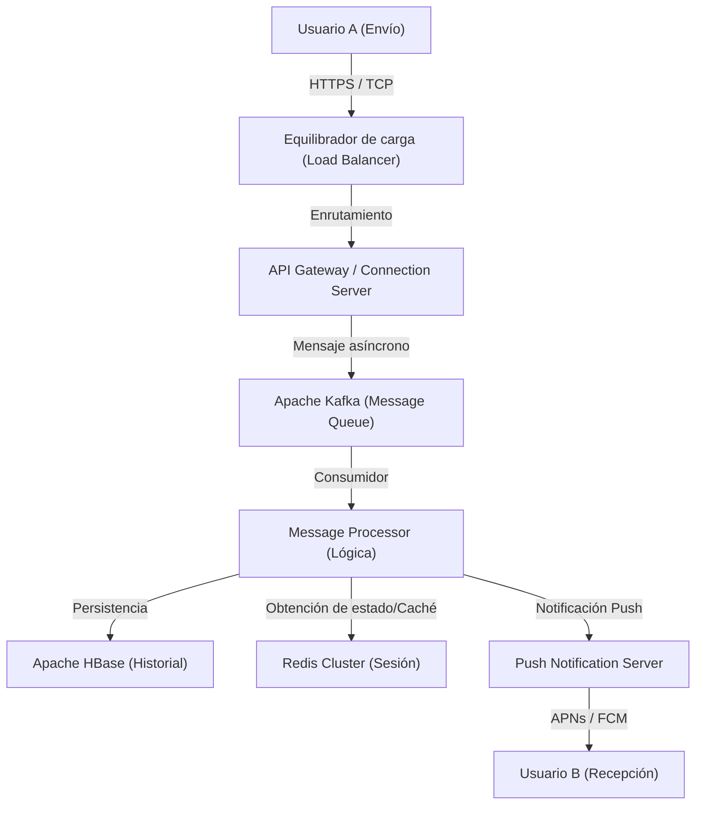

# Prólogo: La "conexión" que nació de una crisis sin precedentes

El 11 de marzo de 2011, el Gran Terremoto del Este de Japón sacudió al país. Este desastre, que causó daños sin precedentes, puso de manifiesto la vulnerabilidad de la infraestructura de comunicaciones existente. Las líneas telefónicas colapsaron y, en una situación en la que incluso confirmar la seguridad de familiares y amigos era difícil, muchas personas se vieron obligadas a depender de medios de comunicación basados en Internet (como Twitter y Skype).

En ese momento, el equipo de NHN Japan (actualmente LINE Yahoo), al presenciar esta escena, sintió un fuerte sentido de misión. "Necesitamos una herramienta de comunicación simple y estable que nos permita conectarnos de manera confiable con nuestros seres queridos bajo cualquier circunstancia". A partir de este profundo deseo, el proyecto LINE comenzó a un ritmo acelerado. Apenas unos meses después del terremoto, en junio de 2011, nació LINE.

# Capítulo 1: La popularización de los teléfonos inteligentes y la explosión de la cultura de los stickers

El año en que apareció LINE, 2011, fue también un período en el que la transición de los teléfonos móviles tradicionales a los teléfonos inteligentes avanzaba rápidamente. LINE aprovechó al máximo las características de los teléfonos inteligentes, como "llevarlo siempre contigo" y "poder recibir notificaciones push", para proporcionar una experiencia de chat altamente en tiempo real.

Sin embargo, el factor más importante que impulsó a LINE de ser una simple aplicación de chat a una "infraestructura nacional" fue, sin duda, la introducción de la función de **"Stickers" (Pegatinas o Estampas)**.

## La revolución de la comunicación no verbal provocada por los stickers

Los mensajes de texto a veces pueden parecer fríos, y puede ser difícil transmitir los matices emocionales. Especialmente en una cultura de alto contexto como Japón, se valora mucho "leer el ambiente" e "inferir los sentimientos". Los stickers hicieron posible transmitir emociones ricas y matices sutiles con un solo toque.

* **Facilidad y velocidad**: Ahorra el esfuerzo de escribir una respuesta, permitiendo reaccionar al instante.
* **Diversidad de expresión**: Visualiza no solo emociones como alegría, enojo, tristeza o diversión, sino también saludos cotidianos como "entendido" o "buen trabajo".
* **Creators Market (Mercado de Creadores)**: Con el lanzamiento de "LINE Creators Market" en 2014, desde animadores profesionales hasta usuarios generales, cualquiera podía crear y vender stickers, dando origen a un ecosistema y economía únicos.

# Capítulo 2: De una aplicación de mensajería a una "súper aplicación"

A medida que su base de usuarios se expandía, LINE comenzó a evolucionar más allá de la simple mensajería hacia una "súper aplicación" que apoya todas las situaciones de la vida diaria. Aunque este modelo fue precedido por WeChat en China, LINE fue optimizado para satisfacer las necesidades locales de Japón y el sudeste asiático (Taiwán, Tailandia, Indonesia, etc.).

## La trayectoria de la expansión de la plataforma

1. **LINE GAME**: Juegos que utilizan el grafo social (relaciones de amigos) como "LINE POP" y "LINE: Disney Tsum Tsum" se convirtieron en grandes éxitos. Esto aumentó significativamente el tiempo de permanencia de los usuarios.
2. **LINE NEWS / Manga / Music**: Se consolidó como una plataforma de distribución de contenido.
3. **LINE Pay**: Servicio de pago móvil. Subiéndose a la ola de la eliminación del efectivo, habilitó pagos en tiendas físicas y transferencias de persona a persona.
4. **Cuentas Oficiales de LINE (Official Accounts)**: Se convirtieron en una herramienta CRM indispensable para que las empresas y las tiendas se conecten directamente con los usuarios.

De esta manera, LINE creció hasta convertirse en una plataforma donde puedes completar todas tus actividades diarias: "leer las noticias al despertar, leer manga en el tren, contactar a amigos y pagar en la tienda de conveniencia".

# Capítulo 3: La infraestructura masiva y la arquitectura de comunicación que sustentan LINE

Cientos de millones de usuarios activos mensuales (MAU) envían y reciben decenas de miles de millones de mensajes en tiempo real todos los días. ¿Cuál es la base tecnológica para procesar este tremendo tráfico sin demoras y de manera confiable?

## La evolución de la infraestructura de mensajería y la adopción de Erlang/HBase

Aunque LINE comenzó con una configuración a pequeña escala, con el rápido aumento del tráfico, la escalabilidad y la tolerancia a fallos se volvieron urgentes. Por lo tanto, se construyó una arquitectura especializada en el procesamiento en tiempo real.

### Puerta de enlace en tiempo real (Real-time Gateway)

Un grupo de servidores de puerta de enlace que mantienen una conexión constante (TCP/WebSocket) con los dispositivos de los usuarios. Aquí se requiere tecnología capaz de procesar una gran cantidad de conexiones simultáneas con bajos recursos. En LINE, utilizando E/S asíncrona y el modelo de Actores (Actor model), han ideado formas de manejar cientos de miles de conexiones simultáneas en un solo servidor.

### Procesamiento de datos ultrarrápido con HBase y Redis

* **Apache HBase**: Una base de datos NoSQL distribuida para persistir un historial de mensajes masivo. Con una excelente escalabilidad, permite operaciones de lectura y escritura ultrarrápidas del historial de chat de cada usuario.
* **Redis**: Desempeña un papel importante como capa de caché y sistema de colas temporal. Se utiliza para almacenar datos que requieren velocidades de acceso en milisegundos, como los mensajes más recientes o la información de la sesión.

## Transición a una arquitectura de microservicios

Se realizó una transición gradual desde un sistema monolítico (una aplicación única y masiva) inicial hacia una arquitectura de microservicios dividida en servicios independientes por función.

* **gRPC y Protobuf**: Para la comunicación entre servicios, se utilizan gRPC y Protocol Buffers, que son rápidos y seguros en cuanto a tipos. Esto procesa eficientemente el enorme tráfico generado entre cientos de microservicios.
* **Apache Kafka**: Como el núcleo de la comunicación asíncrona y la canalización de datos entre servicios, Kafka actúa como un centro (hub). Eventos de envío de mensajes, eventos de lectura y registros del sistema se distribuyen a cada servicio a través de Kafka.

## Sincronización global de centros de datos

LINE tiene una participación de mercado abrumadora no solo en Japón, sino también en Taiwán, Tailandia e Indonesia. Por lo tanto, el servicio se implementa en múltiples centros de datos (multirregión) para reducir la latencia y mejorar la disponibilidad. La sincronización de datos (replicación) entre centros de datos se implementa mediante un mecanismo avanzado que, aunque se realiza de forma asíncrona, parece consistente para los usuarios.

# Conclusión: Hacia el futuro de la comunicación

LINE nació a partir del trágico evento del Gran Terremoto del Este de Japón para responder a la profunda necesidad de "conectarse con los seres queridos". La invención de una nueva comunicación no verbal llamada stickers, la evolución hacia una súper aplicación y la tecnología de sistemas distribuidos de clase mundial que la respalda.

En la actualidad, con el desarrollo de la tecnología de IA y blockchain (Web3), la ola tecnológica se está acelerando aún más. LINE también se dirige hacia el desarrollo de nuevas funciones que incorporan IA Generativa (Generative AI) y la provisión de servicios más personalizados.

Sin embargo, no importa cuánto evolucione la tecnología y cuán complejas se vuelvan las aplicaciones, la filosofía subyacente de LINE permanece inalterada. Es la misión de "Closing the Distance" (Acortar la distancia entre personas, y entre personas y servicios/información en todo el mundo). En el futuro, LINE continuará evolucionando como una infraestructura invisible que sustenta nuestra comunicación.
