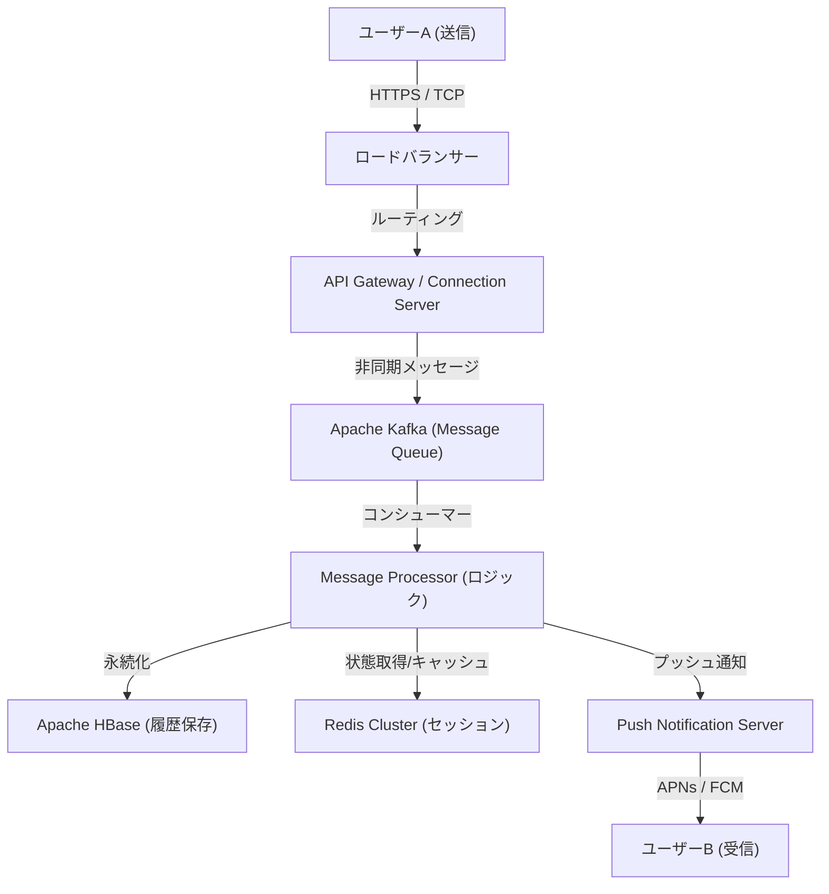

# Prologue : Le "lien" né d'une crise sans précédent

Le 11 mars 2011, le grand tremblement de terre de l'Est du Japon a frappé le Japon. Cette catastrophe, qui a causé des dégâts sans précédent, a mis en évidence la vulnérabilité de l'infrastructure de communication existante. Les lignes téléphoniques étant saturées, il était même difficile de confirmer la sécurité de sa famille et de ses amis, obligeant de nombreuses personnes à s'en remettre aux moyens de communication basés sur Internet (tels que Twitter et Skype).

À l'époque, l'équipe de NHN Japan (aujourd'hui LY Corporation) a été témoin de cette situation et a ressenti un fort sentiment de mission. "Nous avons besoin d'un outil de communication simple et stable qui permette aux gens de se connecter de manière fiable avec leurs proches, quelle que soit la situation." Motivé par ce désir impérieux, le projet LINE a démarré à un rythme effréné. En juin 2011, quelques mois seulement après le tremblement de terre, LINE voyait le jour.

# Chapitre 1 : La popularisation des smartphones et l'explosion de la culture des stickers

L'année 2011, date de l'apparition de LINE, fut également une période de transition rapide des téléphones portables traditionnels (feature phones) vers les smartphones. LINE a tiré pleinement parti des caractéristiques des smartphones, à savoir "les transporter partout" et "recevoir des notifications push", pour offrir une expérience de discussion en temps réel.

Cependant, le principal facteur qui a propulsé LINE du statut de simple application de discussion à celui d'"infrastructure nationale" est sans aucun doute l'introduction de la fonctionnalité des **"stickers" (autocollants)**.

## La révolution de la communication non verbale apportée par les stickers

Les messages textuels peuvent parfois sembler froids ou avoir du mal à transmettre des nuances émotionnelles. Surtout dans une culture à fort contexte comme le Japon, l'importance est accordée au fait de "lire l'atmosphère" et de "deviner les émotions". Les stickers ont permis de transmettre de riches émotions et de subtiles nuances en un seul clic.

* **Simplicité et rapidité** : Évite d'avoir à taper une réponse et permet de réagir immédiatement.
* **Diversité de l'expression** : Visualise non seulement les émotions (joie, colère, tristesse, plaisir), mais aussi les salutations quotidiennes telles que "Reçu" et "Bon travail".
* **Creators Market** : Lancé en 2014, le "LINE Creators Market" a permis à quiconque, des animateurs professionnels aux simples utilisateurs, de créer et de vendre des stickers, donnant naissance à un écosystème et à une sphère économique uniques.

# Chapitre 2 : D'une application de messagerie à une "super application"

Au fur et à mesure que sa base d'utilisateurs s'élargissait, LINE a dépassé le cadre de la simple messagerie pour commencer à évoluer vers une "super application" qui accompagne toutes les facettes de la vie quotidienne. Bien qu'il s'agisse d'un modèle précédé par des applications comme WeChat en Chine, LINE a été optimisée pour répondre aux besoins locaux du Japon et de l'Asie du Sud-Est (Taïwan, Thaïlande, Indonésie, etc.).

## L'évolution de son développement en plateforme

1. **LINE GAME** : Des jeux exploitant le graphe social (les relations entre amis) tels que "LINE POP" et "LINE: Disney Tsum Tsum" ont rencontré un énorme succès, allongeant considérablement le temps passé par les utilisateurs sur l'application.
2. **LINE NEWS / Manga / Music** : A établi sa position de plateforme de distribution de contenus.
3. **LINE Pay** : Service de paiement mobile. Surfant sur la vague de la dématérialisation des paiements, il a permis les paiements dans les magasins physiques et les transferts d'argent de pair à pair.
4. **Comptes officiels LINE (Official Accounts)** : Sont devenus un outil de CRM indispensable pour permettre aux entreprises et aux magasins de se connecter directement avec les utilisateurs.

Ainsi, LINE s'est développée en une plateforme permettant d'accomplir toutes les actions de la journée, comme "se lever le matin et lire les actualités, lire des mangas dans le train, contacter ses amis, et payer au dépanneur".

# Chapitre 3 : L'infrastructure colossale et l'architecture de communication qui soutiennent LINE

Des centaines de millions d'utilisateurs actifs mensuels (MAU) envoient et reçoivent des dizaines de milliards de messages en temps réel chaque jour. Quelle est la base technique pour traiter ce trafic faramineux sans retard et avec fiabilité ?

## Évolution de l'infrastructure de messagerie et adoption d'Erlang/HBase

À ses débuts, LINE a démarré avec une petite configuration, mais avec l'augmentation rapide du trafic, l'évolutivité et la tolérance aux pannes sont devenues urgentes. C'est pourquoi la construction d'une architecture spécialisée dans le traitement en temps réel a été entreprise.

### Passerelle en temps réel (Real-time Gateway)
Un groupe de serveurs passerelles qui maintiennent des connexions permanentes (TCP/WebSocket) avec les appareils des utilisateurs. Cela nécessite une technologie capable de gérer un grand nombre de connexions simultanées avec de faibles ressources. Chez LINE, des mesures ont été prises pour utiliser les E/S asynchrones et le modèle Acteur (Actor model) afin de gérer des centaines de milliers de connexions simultanées sur un seul serveur.

### Traitement de données ultra-rapide avec HBase et Redis
* **Apache HBase** : Une base de données NoSQL distribuée pour persister de vastes quantités d'historique de messages. Elle offre une excellente évolutivité et permet la lecture et l'écriture rapides de l'historique des discussions pour chaque utilisateur.
* **Redis** : Joue un rôle crucial en tant que couche de mise en cache et de file d'attente (queuing) temporaire. Il est utilisé pour stocker des données nécessitant des vitesses d'accès de l'ordre de la milliseconde, telles que les derniers messages et les informations de session.

## Transition vers l'architecture de microservices

Le système, initialement monolithique (une seule application géante), a progressivement migré vers une architecture de microservices, où il est divisé en services indépendants par fonctionnalité.

* **gRPC et Protobuf** : Pour la communication entre les services, les protocoles gRPC et Protocol Buffers, rapides et sûrs quant au type, ont été adoptés. Cela permet de traiter efficacement l'énorme trafic généré entre des centaines de microservices.
* **Apache Kafka** : Kafka joue le rôle de hub central pour la communication asynchrone et les pipelines de données entre les services. Les événements d'envoi de messages, les événements de lecture (vu) et les journaux système sont distribués à chaque service via Kafka.

## Synchronisation mondiale des centres de données

LINE ne détient pas seulement une part de marché écrasante au Japon, mais aussi à Taïwan, en Thaïlande, en Indonésie, etc. Par conséquent, les services sont déployés dans plusieurs centres de données (multi-régions) afin de réduire la latence et d'améliorer la disponibilité. La synchronisation des données (réplication) entre les centres de données s'effectue de manière asynchrone, mais un mécanisme avancé est mis en œuvre pour donner l'impression d'une cohérence du point de vue de l'utilisateur.

# Conclusion : Vers l'avenir de la communication

Née d'un événement tragique qu'est le grand tremblement de terre de l'Est du Japon, LINE a vu le jour pour répondre au besoin impérieux de "se connecter avec ses proches". L'invention d'une nouvelle communication non verbale avec les stickers, son évolution en une super application et les technologies de systèmes distribués de classe mondiale qui la soutiennent.

Actuellement, la vague technologique s'accélère avec le développement des technologies d'IA et de la blockchain (Web3). LINE s'oriente également vers le développement de nouvelles fonctionnalités intégrant l'IA générative et la fourniture de services plus personnalisés.

Cependant, quelle que soit l'évolution des technologies et la complexité de l'application, la philosophie fondamentale de LINE reste inchangée. Il s'agit de sa mission "Closing the Distance" (réduire la distance entre les personnes à travers le monde, ainsi qu'entre les personnes et les informations/services). À l'avenir, LINE continuera d'évoluer en tant qu'infrastructure invisible soutenant notre communication.
