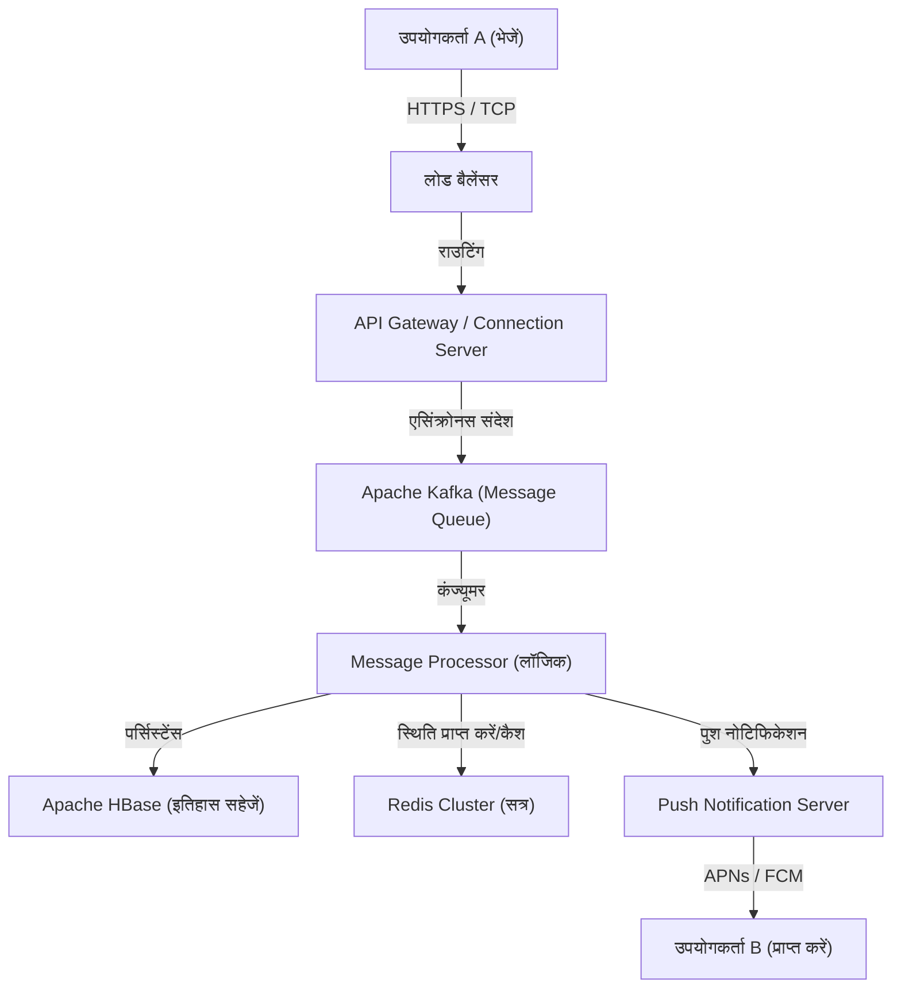

# प्रस्तावना: एक अभूतपूर्व संकट से पैदा हुआ "कनेक्शन"

11 मार्च 2011 को आए महान पूर्वी जापान भूकंप ने जापान को झकझोर कर रख दिया। इस अभूतपूर्व आपदा ने मौजूदा संचार बुनियादी ढांचे की कमजोरियों को उजागर किया। फोन लाइनें ठप हो गईं, और ऐसे समय में जब परिवार और दोस्तों की सुरक्षा की पुष्टि करना भी मुश्किल था, कई लोगों को इंटरनेट-आधारित संचार साधनों (जैसे Twitter और Skype) पर निर्भर होना पड़ा।

उस समय, NHN Japan (अब LINE Yahoo) की टीम ने इस दृश्य को देखा और एक मजबूत मिशन की भावना महसूस की। "हमें एक सरल और स्थिर संचार उपकरण की आवश्यकता है जो यह सुनिश्चित कर सके कि लोग किसी भी परिस्थिति में अपने प्रियजनों से जुड़ सकें।" इस गहरी इच्छा के साथ, LINE परियोजना तेज गति से शुरू हुई। भूकंप के कुछ ही महीनों बाद, जून 2011 में LINE का जन्म हुआ।

# अध्याय 1: स्मार्टफोन का प्रसार और स्टिकर संस्कृति का विस्फोट

2011, वह वर्ष जब LINE सामने आया, वह समय भी था जब फीचर फोन (गलाके) से स्मार्टफोन में तेजी से बदलाव हो रहा था। LINE ने स्मार्टफोन की "हमेशा साथ रहने" और "पुश नोटिफिकेशन प्राप्त करने" की विशेषताओं का पूरा फायदा उठाया, और एक उच्च रीयल-टाइम चैट अनुभव प्रदान किया।

हालांकि, LINE को एक साधारण चैट ऐप से "राष्ट्रीय बुनियादी ढांचे" में बदलने वाला सबसे बड़ा कारक निस्संदेह **"स्टिकर (Stickers)"** सुविधा की शुरुआत थी।

## स्टिकर द्वारा लाया गया अशाब्दिक संचार में क्रांति

टेक्स्ट संदेश कभी-कभी ठंडे लग सकते हैं, और भावनाओं की बारीकियों को व्यक्त करना मुश्किल हो सकता है। विशेष रूप से जापान जैसी उच्च-संदर्भ संस्कृति में, "माहौल को पढ़ना" और "भावनाओं का अनुमान लगाना" महत्वपूर्ण है। स्टिकर ने केवल एक टैप से समृद्ध भावनाओं और सूक्ष्म बारीकियों को व्यक्त करना संभव बना दिया।

* **सुविधा और गति**: उत्तर टाइप करने का समय बचाता है और त्वरित प्रतिक्रिया की अनुमति देता है।
* **अभिव्यक्ति की विविधता**: न केवल खुशी, क्रोध, दुख और आनंद, बल्कि रोजमर्रा के अभिवादन जैसे "समझ गया" और "अच्छे काम के लिए धन्यवाद" को भी विज़ुअलाइज़ करता है।
* **क्रिएटर्स मार्केट**: 2014 में शुरू हुए "LINE Creators Market" ने पेशेवर एनिमेटर्स से लेकर सामान्य उपयोगकर्ताओं तक, किसी को भी स्टिकर बनाने और बेचने की अनुमति दी, जिससे एक अनूठा इकोसिस्टम और अर्थव्यवस्था पैदा हुई।

# अध्याय 2: मैसेजिंग ऐप से "सुपर ऐप" तक

जैसे-जैसे इसका उपयोगकर्ता आधार बढ़ता गया, LINE ने केवल मैसेजिंग से आगे बढ़कर एक "सुपर ऐप" के रूप में विकसित होना शुरू किया जो दैनिक जीवन के हर पहलू का समर्थन करता है। यह एक मॉडल है जिसे चीन के WeChat ने पहले ही अपना लिया था, लेकिन LINE को जापान और दक्षिण पूर्व एशिया (ताइवान, थाईलैंड, इंडोनेशिया, आदि) की स्थानीय जरूरतों के अनुरूप अनुकूलित किया गया था।

## प्लेटफ़ॉर्म विस्तार का प्रक्षेपवक्र

1. **LINE GAME**: "LINE POP" और "LINE: Disney Tsum Tsum" जैसे गेम, जो सोशल ग्राफ़ (दोस्तों के नेटवर्क) का उपयोग करते थे, बड़ी हिट बन गए। इससे उपयोगकर्ताओं द्वारा ऐप पर बिताया जाने वाला समय काफी बढ़ गया।
2. **LINE NEWS / Manga / Music**: सामग्री वितरण मंच के रूप में अपनी स्थिति स्थापित की।
3. **LINE Pay**: मोबाइल भुगतान सेवा। कैशलेस समाज की लहर पर सवार होकर, इसने भौतिक दुकानों पर भुगतान और व्यक्तियों के बीच धन हस्तांतरण को सक्षम किया।
4. **LINE Official Accounts**: कंपनियों और दुकानों के लिए उपयोगकर्ताओं से सीधे जुड़ने के लिए एक अपरिहार्य CRM उपकरण बन गया।

इस तरह, LINE एक ऐसा प्लेटफ़ॉर्म बन गया जहाँ आप अपने दिन की सभी गतिविधियों को पूरा कर सकते हैं, जैसे "सुबह उठकर खबरें पढ़ना, ट्रेन में मंगा पढ़ना, दोस्तों से संपर्क करना और सुविधा स्टोर पर भुगतान करना।"

# अध्याय 3: LINE का विशाल इंफ्रास्ट्रक्चर और संचार आर्किटेक्चर

करोड़ों मासिक सक्रिय उपयोगकर्ता (MAU) हर दिन वास्तविक समय में अरबों संदेश भेजते और प्राप्त करते हैं। बिना किसी देरी के और मज़बूती से इस विशाल ट्रैफ़िक को संभालने के लिए तकनीकी आधार क्या है?

## मैसेजिंग आधार का विकास और Erlang/HBase को अपनाना

शुरुआती LINE एक छोटे पैमाने के सेटअप के साथ शुरू हुआ, लेकिन ट्रैफ़िक में तेजी से वृद्धि के साथ, स्केलेबिलिटी और फॉल्ट टॉलरेंस तत्काल आवश्यकता बन गए। इसलिए, विशेष रूप से रीयल-टाइम प्रोसेसिंग के लिए एक आर्किटेक्चर बनाया गया था।

### रीयल-टाइम गेटवे
गेटवे सर्वर का एक समूह जो उपयोगकर्ता के उपकरणों के साथ निरंतर कनेक्शन (TCP/WebSocket) बनाए रखता है। इसके लिए ऐसी तकनीक की आवश्यकता होती है जो कम संसाधनों के साथ बड़ी संख्या में एक साथ कनेक्शन को संभाल सके। LINE में, एसिंक्रोनस I/O और एक्टर मॉडल का उपयोग करके एक ही सर्वर पर सैकड़ों हजारों एक साथ कनेक्शन को संभालने के लिए विशेष उपाय किए गए हैं।

### HBase और Redis के माध्यम से अल्ट्रा-हाई-स्पीड डेटा प्रोसेसिंग
* **Apache HBase**: संदेशों के विशाल इतिहास को स्थायी बनाने के लिए एक वितरित NoSQL डेटाबेस। इसमें उत्कृष्ट स्केलेबिलिटी है और यह प्रत्येक उपयोगकर्ता के लिए चैट इतिहास को तेजी से पढ़ने और लिखने में सक्षम बनाता है।
* **Redis**: यह कैश लेयर और अस्थायी कतारबद्ध करने (queueing) के रूप में बहुत सक्रिय है। इसका उपयोग नवीनतम संदेशों और सत्र जानकारी जैसे डेटा को संग्रहीत करने के लिए किया जाता है, जिसके लिए मिलीसेकंड एक्सेस गति की आवश्यकता होती है।

## माइक्रोसर्विसेज आर्किटेक्चर की ओर स्थानांतरण

प्रारंभिक मोनोलिथिक (विशाल एकल एप्लिकेशन) प्रणाली से, LINE धीरे-धीरे एक माइक्रोसर्विसेज आर्किटेक्चर में स्थानांतरित हो गया, जो कार्यों को स्वतंत्र सेवाओं में विभाजित करता है।

* **gRPC और Protobuf**: सेवाओं के बीच संचार के लिए तेज़ और टाइप-सुरक्षित gRPC और Protocol Buffers को अपनाया गया है। यह सैकड़ों माइक्रोसर्विसेज के बीच उत्पन्न होने वाले भारी ट्रैफ़िक को कुशलतापूर्वक संभालता है।
* **Apache Kafka**: काफ्का सेवाओं और डेटा पाइपलाइनों के बीच एसिंक्रोनस संचार के लिए हब के रूप में कार्य करता है। संदेश भेजने की घटनाएं, पढ़ने की घटनाएं और सिस्टम लॉग काफ्का के माध्यम से प्रत्येक सेवा को वितरित किए जाते हैं।

## ग्लोबल डेटा सेंटर सिंक्रनाइज़ेशन

LINE का न केवल जापान में, बल्कि ताइवान, थाईलैंड, इंडोनेशिया आदि में भी एक बड़ा हिस्सा है। इसलिए, विलंबता को कम करने और उपलब्धता में सुधार करने के लिए सेवाओं को कई डेटा केंद्रों (मल्टी-रीजन) में तैनात किया जाता है। डेटा केंद्रों के बीच डेटा सिंक्रनाइज़ेशन (रेप्लिकेशन) एसिंक्रोनस रूप से किया जाता है, लेकिन एक उन्नत तंत्र लागू किया गया है जो इसे उपयोगकर्ता के दृष्टिकोण से सुसंगत बनाता है।

# निष्कर्ष: संचार के भविष्य की ओर

महान पूर्वी जापान भूकंप की दुखद घटना से, LINE का जन्म "प्रियजनों से जुड़ने" की सख्त जरूरत को पूरा करने के लिए हुआ था। स्टिकर के रूप में नए अशाब्दिक संचार का आविष्कार, एक सुपर ऐप के रूप में विकास, और विश्व स्तरीय वितरित प्रणाली तकनीक जो इसका समर्थन करती है।

वर्तमान में, एआई तकनीक और ब्लॉकचेन (Web3) के विकास के साथ, प्रौद्योगिकी की लहर और तेज हो रही है। LINE भी जनरेटिव एआई को शामिल करते हुए नई सुविधाओं के विकास और अधिक वैयक्तिकृत सेवाएं प्रदान करने की ओर बढ़ रहा है।

हालांकि, तकनीक कितनी भी विकसित हो जाए या ऐप कितने भी जटिल क्यों न हो जाएं, LINE का मूल दर्शन नहीं बदलता है। वह है "दूरी कम करना (Closing fixing the Distance) - दुनिया भर के लोगों और सूचना व सेवाओं के बीच की दूरी को कम करना" का मिशन। LINE हमारे संचार का समर्थन करने वाले एक अदृश्य बुनियादी ढांचे के रूप में विकसित होना जारी रखेगा।
