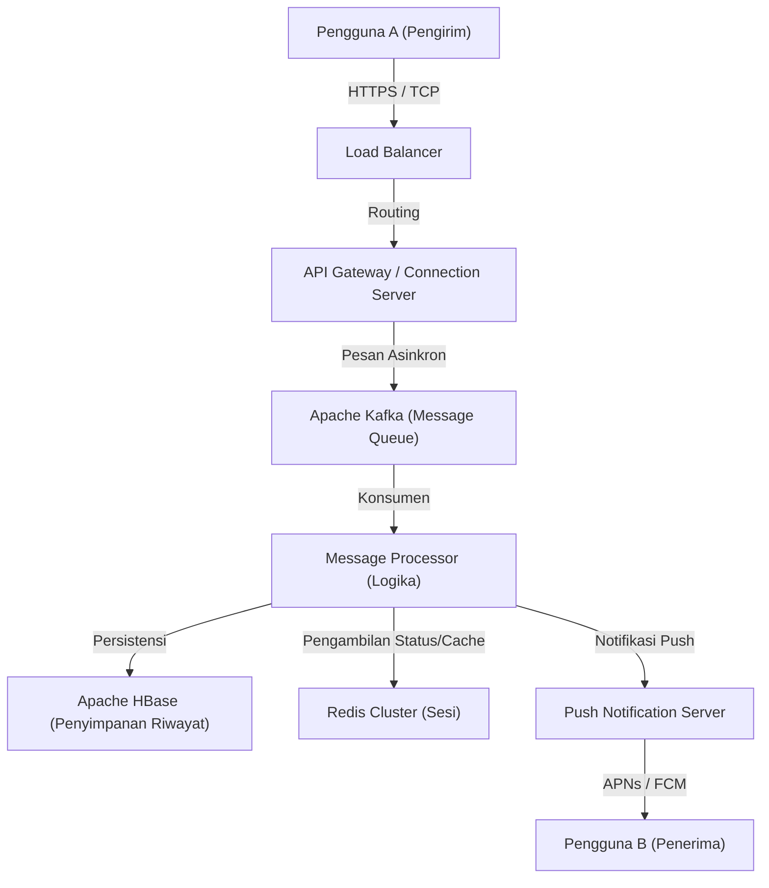

# Pendahuluan: "Koneksi" yang Lahir dari Krisis yang Belum Pernah Terjadi Sebelumnya

Pada tanggal 11 Maret 2011, Gempa Besar Jepang Timur melanda Jepang. Bencana yang membawa kerusakan belum pernah terjadi sebelumnya ini menyoroti kerentanan infrastruktur komunikasi yang ada. Jaringan telepon lumpuh, dan di tengah situasi di mana bahkan memeriksa keselamatan keluarga dan teman sangat sulit, banyak orang terpaksa bergantung pada sarana komunikasi berbasis internet (seperti Twitter dan Skype).

Pada saat itu, tim di NHN Japan (sekarang LY Corporation) menyaksikan pemandangan ini dan merasakan dorongan misi yang kuat. "Kita membutuhkan alat komunikasi yang sederhana dan stabil yang memungkinkan kita terhubung dengan andal dengan orang-orang terkasih dalam situasi apa pun." Dari keinginan yang mendesak ini, proyek LINE dimulai dengan langkah cepat. Hanya beberapa bulan setelah gempa, pada bulan Juni 2011, LINE dilahirkan.

# Bab 1: Penyebaran Ponsel Pintar dan Ledakan Budaya Stiker

Tahun 2011, ketika LINE muncul, juga merupakan masa di mana transisi dari ponsel fitur (ponsel flip) ke ponsel pintar berlangsung pesat. LINE memaksimalkan karakteristik ponsel pintar, yaitu "selalu dibawa" dan "dapat menerima notifikasi push," untuk menyediakan pengalaman obrolan dengan tingkat real-time yang tinggi.

Namun, faktor terbesar yang mendorong LINE dari sekadar aplikasi obrolan menjadi "infrastruktur nasional" tidak diragukan lagi adalah pengenalan fitur **"Stiker (Stickers)"**.

## Revolusi Komunikasi Non-verbal yang Dibawa oleh Stiker

Pesan teks terkadang bisa terasa dingin atau sulit untuk menyampaikan nuansa emosi. Khususnya dalam budaya konteks tinggi seperti di Jepang, "membaca suasana" dan "menebak emosi" sangat dihargai. Stiker memungkinkan pengguna untuk menyampaikan emosi yang kaya dan nuansa yang halus hanya dengan satu ketukan.

* **Kenyamanan dan Kecepatan**: Menghemat kerumitan mengetik balasan dan memungkinkan reaksi seketika.
* **Keberagaman Ekspresi**: Tidak hanya emosi seperti kegembiraan, kemarahan, kesedihan, dan kesenangan, tetapi sapaan sehari-hari seperti "Dimengerti" atau "Kerja bagus" juga divisualisasikan.
* **Creators Market**: Melalui "LINE Creators Market" yang diluncurkan pada tahun 2014, siapa pun mulai dari animator profesional hingga pengguna biasa dapat membuat dan menjual stiker, menciptakan ekosistem dan zona ekonomi yang unik.

# Bab 2: Dari Aplikasi Pesan Menjadi "Aplikasi Super"

Seiring dengan perluasan basis pengguna, LINE melampaui batas-batas pesan sederhana dan mulai berevolusi menjadi "aplikasi super" yang mendukung setiap aspek kehidupan sehari-hari. Ini adalah model yang dipelopori oleh aplikasi seperti WeChat di Tiongkok, tetapi LINE dioptimalkan untuk memenuhi kebutuhan lokal di Jepang dan Asia Tenggara (Taiwan, Thailand, Indonesia, dll.).

## Lintasan Perluasan Platform

1. **LINE GAME**: Game yang memanfaatkan grafik sosial (hubungan pertemanan) seperti "LINE POP" dan "LINE: Disney Tsum Tsum" menjadi sangat sukses. Hal ini secara signifikan meningkatkan waktu yang dihabiskan pengguna.
2. **LINE NEWS / Manga / Music**: Mengukuhkan posisinya sebagai platform distribusi konten.
3. **LINE Pay**: Layanan pembayaran seluler. Mengendarai gelombang masyarakat tanpa uang tunai (cashless), layanan ini memungkinkan pembayaran di toko fisik dan transfer uang antar individu.
4. **Akun Resmi LINE (Official Accounts)**: Menjadi alat CRM yang sangat penting bagi perusahaan dan toko untuk terhubung langsung dengan pengguna.

Dengan cara ini, LINE tumbuh menjadi platform di mana pengguna dapat menyelesaikan seluruh aktivitas harian mereka, seperti "bangun tidur dan membaca berita, membaca manga di kereta, menghubungi teman, dan melakukan pembayaran di toserba."

# Bab 3: Infrastruktur Raksasa dan Arsitektur Komunikasi yang Mendukung LINE

Ratusan juta pengguna aktif bulanan (MAU) mengirim dan menerima puluhan miliar pesan secara real-time setiap harinya. Seperti apa fondasi teknologi untuk memproses lalu lintas yang luar biasa ini tanpa penundaan dan dengan keandalan?

## Evolusi Infrastruktur Pesan dan Adopsi Erlang/HBase

LINE pada masa-masa awal dimulai dengan konfigurasi skala kecil, namun dengan lonjakan lalu lintas, skalabilitas dan toleransi kesalahan menjadi prioritas mendesak. Oleh karena itu, dibangunlah arsitektur yang dikhususkan untuk pemrosesan real-time.

### Gateway Real-time
Sekelompok server gateway yang mempertahankan koneksi persisten (TCP/WebSocket) dengan perangkat pengguna. Ini membutuhkan teknologi yang mampu memproses koneksi bersamaan dalam jumlah besar dengan sumber daya rendah. Di LINE, dengan memanfaatkan I/O asinkron dan model Aktor, berbagai upaya telah dilakukan untuk menangani ratusan ribu koneksi bersamaan pada satu server.

### Pemrosesan Data Berkecepatan Sangat Tinggi dengan HBase dan Redis
* **Apache HBase**: Basis data NoSQL terdistribusi untuk menyimpan riwayat pesan yang sangat besar. Memiliki skalabilitas yang sangat baik dan memungkinkan pembacaan dan penulisan riwayat obrolan setiap pengguna dengan kecepatan tinggi.
* **Redis**: Memainkan peran utama sebagai lapisan cache dan antrean (queuing) sementara. Ini digunakan untuk menyimpan data yang membutuhkan kecepatan akses dalam hitungan milidetik, seperti pesan terbaru dan informasi sesi.

## Transisi ke Arsitektur Layanan Mikro (Microservices)

Dari sistem monolitik awal (aplikasi tunggal raksasa), LINE secara bertahap beralih ke arsitektur layanan mikro di mana sistem dibagi menjadi layanan-layanan independen berdasarkan fungsinya.

* **gRPC dan Protobuf**: Untuk komunikasi antar layanan, gRPC dan Protocol Buffers yang cepat dan aman terhadap tipe (type-safe) telah diadopsi. Hal ini secara efisien memproses lalu lintas sangat besar yang terjadi di antara ratusan layanan mikro.
* **Apache Kafka**: Sebagai pusat komunikasi asinkron antar layanan dan saluran data, Kafka memainkan peran sebagai hub. Acara pengiriman pesan, acara tanda telah dibaca (read receipt), log sistem, dll., didistribusikan ke setiap layanan melalui Kafka.

## Sinkronisasi Pusat Data Global

LINE memiliki pangsa pasar yang luar biasa tidak hanya di Jepang, tetapi juga di Taiwan, Thailand, dan Indonesia. Oleh karena itu, LINE mengoperasikan layanannya di berbagai pusat data (multi-wilayah) dengan tujuan untuk mengurangi latensi dan meningkatkan ketersediaan. Sinkronisasi data (replikasi) antar pusat data dilakukan secara asinkron, namun sebuah mekanisme canggih diimplementasikan agar terlihat konsisten dari sudut pandang pengguna.

# Penutup: Menuju Masa Depan Komunikasi

Lahir dari peristiwa tragis Gempa Besar Jepang Timur untuk menjawab kebutuhan mendesak untuk "terhubung dengan orang-orang terkasih." Penemuan komunikasi non-verbal baru dalam bentuk stiker, evolusi menjadi aplikasi super, dan teknologi sistem terdistribusi kelas dunia yang mendukungnya.

Saat ini, gelombang teknologi terus berakselerasi dengan perkembangan teknologi AI dan blockchain (Web3). LINE juga bergerak menuju pengembangan fitur-fitur baru yang menggabungkan AI Generatif dan menyediakan layanan yang lebih dipersonalisasi.

Namun, terlepas dari seberapa jauh teknologi berevolusi dan seberapa kompleks aplikasinya, filosofi mendasar LINE tetap tidak berubah. Yaitu, misi untuk "Closing the Distance" (Menutup Jarak antara orang dengan orang, serta orang dengan informasi dan layanan di seluruh dunia). LINE akan terus berevolusi sebagai infrastruktur tak kasat mata yang mendukung komunikasi kita di masa depan.
