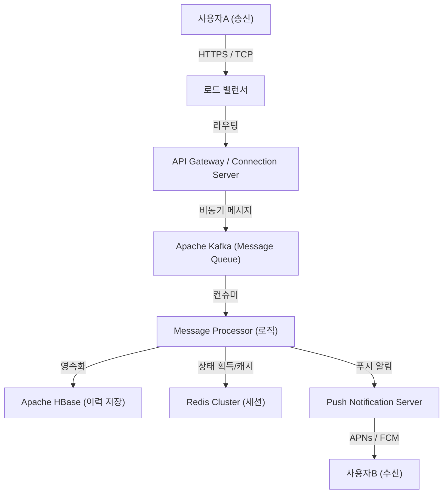

# 서장: 전대미문의 위기에서 탄생한 '연결'

2011년 3월 11일, 일본을 덮친 동일본 대지진. 전대미문의 피해를 가져온 이 재해는 기존 통신 인프라의 취약성을 여실히 드러냈습니다. 전화 회선은 마비되었고 가족이나 친구의 안부 확인조차 어려운 상황 속에서, 많은 사람들이 인터넷 기반의 통신 수단(Twitter나 Skype 등)에 의존할 수밖에 없었습니다.

당시 NHN Japan(현재의 라인야후) 팀은 이 광경을 목격하고 강력한 사명감을 가졌습니다. "어떤 상황에서도 소중한 사람과 확실하게 연결될 수 있는, 심플하고 안정적인 커뮤니케이션 툴이 필요하다." 이 간절한 마음에서 LINE 프로젝트는 급피치로 시작되었습니다. 지진으로부터 불과 몇 개월 후인 2011년 6월, LINE이 탄생했습니다.

# 제1장: 스마트폰의 보급과 스티커 문화의 폭발

LINE이 등장한 2011년은 피처폰에서 스마트폰으로의 전환이 급속하게 진행되던 시기이기도 했습니다. LINE은 스마트폰의 "항상 가지고 다닌다", "푸시 알림을 받을 수 있다"는 특성을 최대한 활용하여 실시간성이 높은 채팅 경험을 제공했습니다.

하지만 LINE을 단순한 채팅 앱에서 '국민적 인프라'로 밀어 올린 가장 큰 요인은 의심할 여지 없이 **'스티커(Stickers)'** 기능의 도입입니다.

## 스티커가 가져온 비언어적 커뮤니케이션의 혁명

텍스트 메시지는 때로 차갑게 느껴지거나 감정의 뉘앙스를 전달하기 어려울 때가 있습니다. 특히 일본과 같은 고맥락(high-context) 문화에서는 '분위기를 읽는 것', '감정을 헤아리는 것'이 중시됩니다. 스티커는 단 한 번의 탭으로 풍부한 감정이나 미묘한 뉘앙스를 전달할 수 있게 해 주었습니다.

* **간편함과 속도**: 답장을 치는 수고를 덜고 즉각적으로 반응할 수 있습니다.
* **표현의 다양성**: 희로애락뿐만 아니라 '알겠습니다', '수고하셨습니다'와 같은 일상적인 인사도 시각화합니다.
* **크리에이터스 마켓**: 2014년에 시작된 'LINE Creators Market'을 통해 프로 애니메이터부터 일반 사용자에 이르기까지 누구나 스티커를 제작하고 판매할 수 있게 되어, 독자적인 생태계와 경제권이 탄생했습니다.

# 제2장: 메시징 앱에서 '슈퍼 앱'으로

사용자 기반이 확대됨에 따라, LINE은 단순한 메시징의 틀을 넘어 일상생활의 모든 장면을 지원하는 '슈퍼 앱'으로 진화를 시작했습니다. 이는 중국의 WeChat 등이 선행했던 모델이지만, LINE은 일본 및 동남아시아(대만, 태국, 인도네시아 등)의 로컬 니즈에 맞춰 최적화되었습니다.

## 플랫폼 전개의 궤적

1. **LINE GAME**: 'LINE POP'이나 'LINE: 디즈니 썸썸' 등, 소셜 그래프(친구 관계)를 활용한 게임이 큰 히트를 쳤습니다. 사용자의 체류 시간을 대폭 늘렸습니다.
2. **LINE NEWS / 망가 / 뮤직**: 콘텐츠 전송 플랫폼으로서의 입지를 확립했습니다.
3. **LINE Pay**: 모바일 결제 서비스. 캐시리스화의 물결을 타고 오프라인 매장에서의 결제 및 개인 간 송금을 실현했습니다.
4. **LINE 공식 계정 (Official Accounts)**: 기업이나 점포가 사용자와 다이렉트로 연결되기 위한 CRM 툴로서 불가결한 존재가 되었습니다.

이렇게 하여 LINE은 '아침에 일어나서 뉴스를 읽고, 전철에서 만화를 보며, 친구와 연락을 취하고, 편의점에서 결제를 하는' 등 하루의 모든 행동을 완결할 수 있는 플랫폼으로 성장했습니다.

# 제3장: LINE을 지탱하는 초거대 인프라와 통신 아키텍처

수억 명의 월간 활성 사용자(MAU)가 매일 수백억 건의 메시지를 실시간으로 송수신합니다. 이 엄청난 트래픽을 지연 없이, 그리고 확실하게 처리하기 위한 기술적 기반은 어떤 것일까요?

## 메시징 기반의 변천과 Erlang/HBase의 도입

초기 LINE은 소규모 구성으로 시작했지만, 트래픽이 급증함에 따라 확장성과 내결함성이 급선무가 되었습니다. 이에 따라 실시간 처리에 특화된 아키텍처 구축이 이루어졌습니다.

### 실시간 게이트웨이
사용자의 기기와 상시 연결(TCP/WebSocket)을 유지하는 게이트웨이 서버군. 이곳에는 대량의 동시 접속을 적은 리소스로 처리할 수 있는 기술이 요구됩니다. LINE에서는 비동기 I/O나 Actor 모델을 활용하여 수십만 개의 동시 접속을 1대의 서버에서 처리하는 궁리를 기울이고 있습니다.

### HBase와 Redis를 통한 초고속 데이터 처리
* **Apache HBase**: 방대한 메시지 내역을 영속화하기 위한 분산 NoSQL 데이터베이스. 확장성이 뛰어나 사용자별 채팅 내역의 고속 읽기/쓰기를 실현하고 있습니다.
* **Redis**: 캐시 계층 및 임시 큐잉으로 맹활약하고 있습니다. 최신 메시지나 세션 정보 등 밀리초 단위의 접근 속도가 요구되는 데이터 저장에 사용되고 있습니다.

## 마이크로서비스 아키텍처로의 전환

초기의 모놀리식(거대한 단일 애플리케이션) 시스템에서 기능별로 독립된 서비스로 분할하는 마이크로서비스 아키텍처로 단계적으로 전환했습니다.

* **gRPC와 Protobuf**: 서비스 간 통신에는 빠르고 타입에 안전한 gRPC와 Protocol Buffers가 도입되었습니다. 이를 통해 수백 개의 마이크로서비스 간에 발생하는 막대한 트래픽을 효율적으로 처리하고 있습니다.
* **Apache Kafka**: 서비스 간의 비동기 통신 및 데이터 파이프라인의 중심으로서 Kafka가 허브 역할을 하고 있습니다. 메시지 송신 이벤트, 읽음 이벤트, 시스템 로그 등이 Kafka를 거쳐 각 서비스로 전송됩니다.

## 글로벌 데이터센터 동기화

LINE은 일본뿐만 아니라 대만, 태국, 인도네시아 등에서도 압도적인 점유율을 가지고 있습니다. 따라서 여러 데이터센터(멀티 리전)에서 서비스를 전개하여 레이턴시를 줄이고 가용성을 높이고 있습니다. 데이터센터 간의 데이터 동기화(레플리케이션)는 비동기로 이루어지면서도 사용자에게는 일관성 있게 보이는 고도의 시스템이 구현되어 있습니다.

# 결어: 커뮤니케이션의 미래를 향해

동일본 대지진이라는 비극적인 사건에서 '소중한 사람과 연결된다'는 간절한 니즈에 부응하기 위해 탄생한 LINE. 스티커라는 새로운 비언어적 커뮤니케이션의 발명, 슈퍼 앱으로 진화, 그리고 이를 지탱하는 세계 최고 수준의 분산 시스템 기술.

현재 AI 기술의 발전이나 블록체인(Web3) 등 테크놀로지의 물결은 더욱 가속화되고 있습니다. LINE 또한 Generative AI를 통합한 새로운 기능 개발이나, 더 개인화된 서비스 제공을 향해 나아가고 있습니다.

하지만 아무리 기술이 진화하고 앱이 복잡해지더라도 LINE의 근저에 있는 철학은 변하지 않습니다. 그것은 'Closing the Distance(전 세계의 사람과 사람, 사람과 정보·서비스 간의 거리를 좁힌다)'라는 미션입니다. 앞으로도 LINE은 우리의 커뮤니케이션을 지탱하는 보이지 않는 인프라로서 진화를 계속해 나갈 것입니다.
