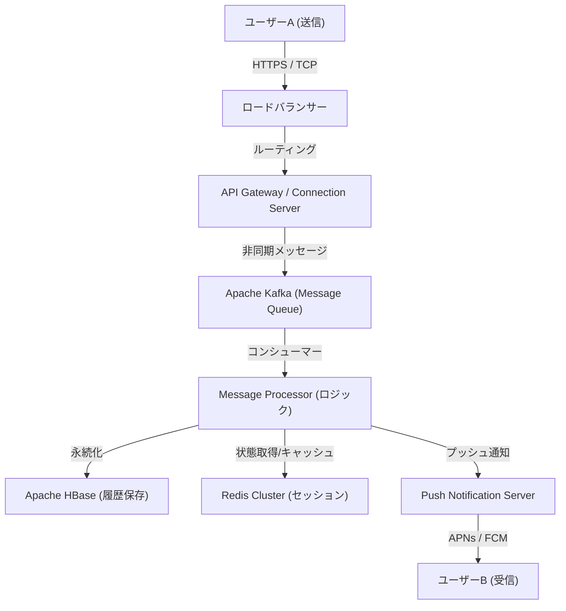

# 序章：未曾有の危機から生まれた「つながり」

2011年3月11日、日本を襲った東日本大震災。未曾有の被害をもたらしたこの災害は、既存の通信インフラの脆弱性を浮き彫りにしました。電話回線はパンクし、家族や友人の安否確認すら困難な状況の中で、多くの人々がインターネットベースの通信手段（TwitterやSkypeなど）に頼らざるを得なくなりました。

当時、NHN Japan（現在のLINEヤフー）のチームは、この光景を目の当たりにし、強力な使命感を抱きました。「どんな状況下でも、大切な人と確実につながることができる、シンプルで安定したコミュニケーションツールが必要だ」。この切実な思いから、LINEのプロジェクトは急ピッチでスタートしました。震災からわずか数ヶ月後の2011年6月、LINEは産声を上げました。

# 第1章：スマートフォンの普及とスタンプ文化の爆発

LINEが登場した2011年は、フィーチャーフォン（ガラケー）からスマートフォンへの移行が急速に進んでいた時期でもありました。LINEはスマートフォンの「常に持ち歩く」「プッシュ通知を受け取れる」という特性を最大限に活かし、リアルタイム性の高いチャット体験を提供しました。

しかし、LINEを単なるチャットアプリから「国民的インフラ」へと押し上げた最大の要因は、間違いなく**「スタンプ（Stickers）」**機能の導入です。

## スタンプがもたらした非言語コミュニケーションの革命

テキストメッセージは時に冷たく感じられたり、感情のニュアンスを伝えるのが難しかったりします。特に日本のような高コンテキスト文化においては、「空気を読む」「感情を推し量る」ことが重視されます。スタンプは、たった一度のタップで豊かな感情や微妙なニュアンスを伝えることを可能にしました。

* **手軽さとスピード**: 返信を打つ手間が省け、即座に反応できる。
* **表現の多様性**: 喜怒哀楽だけでなく、「了解」「お疲れ様」といった日常的な挨拶も視覚化。
* **クリエイターズマーケット**: 2014年に開始された「LINE Creators Market」により、プロのアニメーターから一般ユーザーまで、誰もがスタンプを制作・販売できるようになり、独自のエコシステムと経済圏が誕生しました。

# 第2章：メッセージングアプリから「スーパーアプリ」へ

ユーザーベースが拡大するにつれ、LINEは単なるメッセージングの枠を超え、日常生活のあらゆる場面をサポートする「スーパーアプリ」への進化を始めました。これは中国のWeChatなどが先行していたモデルですが、LINEは日本および東南アジア（台湾、タイ、インドネシアなど）のローカルニーズに合わせて最適化されました。

## プラットフォーム展開の軌跡

1. **LINE GAME**: 『LINE POP』や『LINE: ディズニーツムツム』など、ソーシャルグラフ（友だち関係）を活用したゲームが大ヒット。ユーザーの滞在時間を大幅に伸ばしました。
2. **LINE NEWS / マンガ / ミュージック**: コンテンツ配信プラットフォームとしての地位を確立。
3. **LINE Pay**: モバイル決済サービス。キャッシュレス化の波に乗り、実店舗での決済や個人間送金を実現。
4. **LINE公式アカウント (Official Accounts)**: 企業や店舗がユーザーとダイレクトにつながるためのCRMツールとして不可欠な存在に。

このようにして、LINEは「朝起きてニュースを読み、電車でマンガを読み、友人と連絡を取り、コンビニで支払いをする」といった、1日のすべての行動を完結できるプラットフォームへと成長しました。

# 第3章：LINEを支える超巨大インフラと通信アーキテクチャ

数億人の月間アクティブユーザー（MAU）が、毎日数百億通のメッセージをリアルタイムで送受信する。この途方もないトラフィックを遅延なく、かつ確実に処理するための技術的基盤は、どのようなものでしょうか。

## メッセージング基盤の変遷とErlang/HBaseの採用

初期のLINEは、小規模な構成でスタートしましたが、トラフィックの急増に伴い、スケーラビリティと耐障害性が急務となりました。そこで、リアルタイム処理に特化したアーキテクチャの構築が行われました。

### リアルタイムゲートウェイ
ユーザーのデバイスと常時接続（TCP/WebSocket）を維持するゲートウェイサーバー群。ここには大量の同時接続を低リソースで処理できる技術が求められます。LINEでは、非同期I/OやActorモデルを活用し、数十万の同時接続を1台のサーバーで捌く工夫が凝らされています。

### HBaseとRedisによる超高速データ処理
* **Apache HBase**: 膨大なメッセージ履歴を永続化するための分散NoSQLデータベース。スケーラビリティに優れ、ユーザーごとのチャット履歴の高速な読み書きを実現しています。
* **Redis**: キャッシュ層および一時的なキューイングとして大活躍しています。最新のメッセージやセッション情報など、ミリ秒単位のアクセス速度が求められるデータの保存に使用されています。

## マイクロサービスアーキテクチャへの移行

初期のモノリシック（巨大な単一アプリケーション）なシステムから、機能ごとに独立したサービスとして分割するマイクロサービスアーキテクチャへと段階的に移行しました。

* **gRPCとProtobuf**: サービス間の通信には、高速で型安全なgRPCとProtocol Buffersが採用されています。これにより、数百のマイクロサービス間で発生する莫大なトラフィックを効率的に処理しています。
* **Apache Kafka**: サービス間の非同期通信やデータパイプラインの中心として、Kafkaがハブの役割を果たしています。メッセージの送信イベント、既読イベント、システムログなどがKafkaを経由して各サービスへ配信されます。

## グローバルなデータセンター同期

LINEは日本だけでなく、台湾、タイ、インドネシアなどでも圧倒的なシェアを持っています。そのため、複数のデータセンター（マルチリージョン）でサービスを展開し、レイテンシの低減と可用性の向上を図っています。データセンター間でのデータ同期（レプリケーション）は、非同期で行われつつも、ユーザーからは一貫性があるように見える高度な仕組みが実装されています。

# 結語：コミュニケーションの未来へ向けて

東日本大震災という悲劇的な出来事から、「大切な人とつながる」という切実なニーズに応えるために生まれたLINE。スタンプという新しい非言語コミュニケーションの発明、スーパーアプリへの進化、そしてそれを支える世界トップクラスの分散システム技術。

現在、AI技術の発展やブロックチェーン（Web3）など、テクノロジーの波はさらに加速しています。LINEもまた、Generative AIを組み込んだ新機能の開発や、よりパーソナライズされたサービスの提供へと向かっています。

しかし、どれほど技術が進化し、アプリが複雑になっても、LINEの根底にある哲学は変わりません。それは、「Closing the Distance（世界中の人と人、人と情報・サービスとの距離を縮める）」というミッションです。これからもLINEは、私たちのコミュニケーションを支える見えないインフラとして、進化を続けていくことでしょう。
