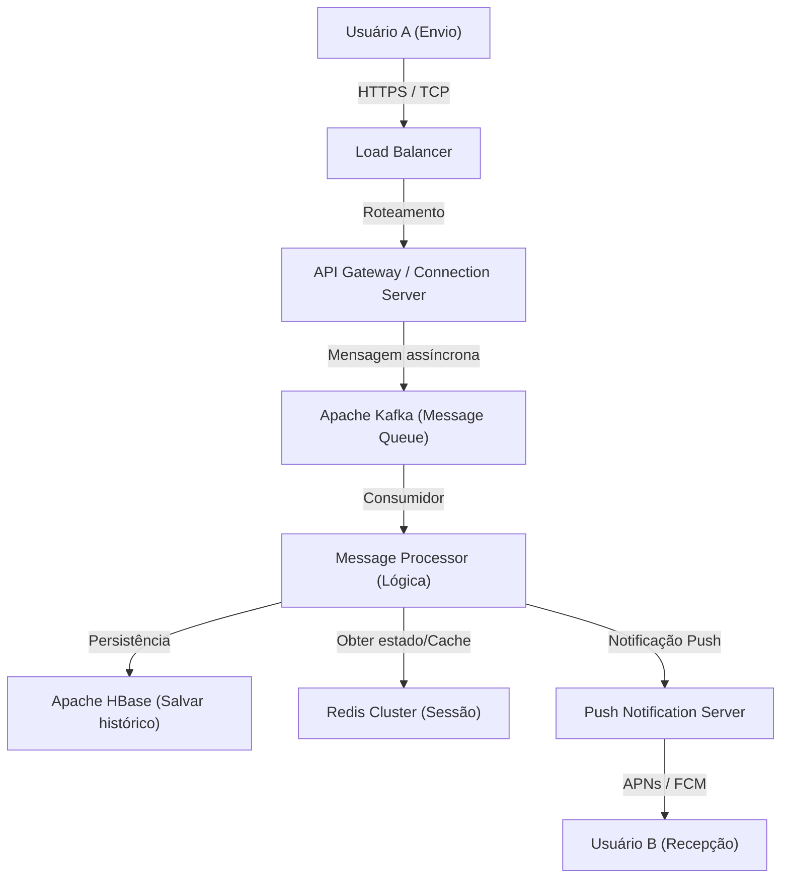

# Prólogo: "Conexões" nascidas de uma crise sem precedentes

Em 11 de março de 2011, o Grande Terremoto do Leste do Japão atingiu o país. Este desastre, que causou danos sem precedentes, expôs a vulnerabilidade da infraestrutura de comunicação existente. Com as linhas telefônicas sobrecarregadas e até mesmo a confirmação da segurança de familiares e amigos sendo difícil, muitas pessoas não tiveram escolha a não ser depender de meios de comunicação baseados na internet (como Twitter e Skype).

Naquela época, a equipe da NHN Japan (atualmente LY Corporation), ao testemunhar essa cena, sentiu um forte senso de missão. "Precisamos de uma ferramenta de comunicação simples e estável que possa conectar as pessoas com segurança aos seus entes queridos sob qualquer circunstância." Movido por esse desejo urgente, o projeto do LINE foi iniciado em ritmo acelerado. Em junho de 2011, apenas alguns meses após o terremoto, o LINE nasceu.

# Capítulo 1: A popularização dos smartphones e a explosão da cultura de stickers

O ano de 2011, quando o LINE foi lançado, foi também um período de rápida transição dos feature phones (celulares básicos) para os smartphones. O LINE aproveitou ao máximo as características dos smartphones, como "estar sempre à mão" e "poder receber notificações push", para fornecer uma experiência de chat em tempo real.

No entanto, o maior fator que impulsionou o LINE de um simples aplicativo de chat para uma "infraestrutura nacional" foi, sem dúvida, a introdução da função de **"Stickers (Adesivos)"**.

## A revolução da comunicação não verbal trazida pelos stickers

As mensagens de texto às vezes podem parecer frias ou dificultar a transmissão de nuances emocionais. Especialmente em uma cultura de alto contexto como o Japão, "ler o ambiente" e "estimar as emoções" são bastante valorizados. Os stickers tornaram possível transmitir emoções ricas e nuances sutis com apenas um toque.

* **Conveniência e velocidade**: Elimina o trabalho de digitar uma resposta, permitindo reações instantâneas.
* **Diversidade de expressão**: Visualiza não apenas alegria, raiva, tristeza e prazer, mas também saudações cotidianas como "Entendido" e "Bom trabalho".
* **Mercado de Criadores**: Com o "LINE Creators Market" lançado em 2014, qualquer pessoa, desde animadores profissionais até usuários comuns, passou a poder criar e vender stickers, criando um ecossistema e uma esfera econômica únicos.

# Capítulo 2: De aplicativo de mensagens a "Super App"

À medida que a base de usuários se expandia, o LINE começou a evoluir além do simples serviço de mensagens para se tornar um "super app" que suporta todos os aspectos da vida diária. Este é um modelo em que o WeChat da China e outros foram pioneiros, mas o LINE foi otimizado para as necessidades locais do Japão e do Sudeste Asiático (Taiwan, Tailândia, Indonésia, etc.).

## A trajetória de desenvolvimento da plataforma

1. **LINE GAME**: Jogos que utilizam o gráfico social (relacionamento entre amigos), como "LINE POP" e "LINE: Disney Tsum Tsum", tornaram-se grandes sucessos. Eles aumentaram significativamente o tempo de permanência do usuário no app.
2. **LINE NEWS / Manga / Music**: Estabeleceu sua posição como uma plataforma de distribuição de conteúdo.
3. **LINE Pay**: Serviço de pagamento móvel. Aproveitando a onda de transição para meios sem dinheiro em espécie, permitiu pagamentos em lojas físicas e transferências entre pessoas.
4. **Contas Oficiais do LINE (Official Accounts)**: Tornou-se uma ferramenta de CRM indispensável para que empresas e lojas se conectem diretamente com os usuários.

Dessa forma, o LINE cresceu e se tornou uma plataforma onde os usuários podem completar todas as ações de um dia inteiro, como "acordar de manhã e ler as notícias, ler mangás no trem, contatar amigos e fazer pagamentos em uma loja de conveniência".

# Capítulo 3: A infraestrutura massiva e a arquitetura de comunicação que suportam o LINE

Centenas de milhões de usuários ativos mensais (MAU) enviam e recebem dezenas de bilhões de mensagens em tempo real todos os dias. Qual é a base tecnológica para processar esse tráfego tremendo sem atrasos e de forma confiável?

## A evolução da base de mensagens e a adoção de Erlang/HBase

O LINE em seus primeiros dias começou com uma configuração de pequena escala, mas com o rápido aumento do tráfego, a escalabilidade e a tolerância a falhas tornaram-se necessidades urgentes. Portanto, uma arquitetura especializada no processamento em tempo real foi construída.

### Gateway em tempo real
Um grupo de servidores de gateway que mantém uma conexão constante (TCP/WebSocket) com os dispositivos dos usuários. Aqui, é necessária uma tecnologia capaz de processar um grande número de conexões simultâneas com baixo consumo de recursos. No LINE, o uso de E/S assíncrona e o modelo Actor são empregados para lidar com centenas de milhares de conexões simultâneas em um único servidor.

### Processamento de dados de ultra-alta velocidade com HBase e Redis
* **Apache HBase**: Um banco de dados NoSQL distribuído para persistir um enorme histórico de mensagens. Com excelente escalabilidade, ele permite a leitura e gravação em alta velocidade do histórico de chat de cada usuário.
* **Redis**: Desempenha um papel importante como camada de cache e fila temporária. É usado para armazenar dados que requerem velocidades de acesso da ordem de milissegundos, como as mensagens mais recentes e informações de sessão.

## Transição para arquitetura de microsserviços

Houve uma transição gradual de um sistema monolítico (um único aplicativo enorme) inicial para uma arquitetura de microsserviços, que divide o sistema em serviços independentes por função.

* **gRPC e Protobuf**: Para a comunicação entre serviços, foram adotados o gRPC rápido e seguro em termos de tipo, juntamente com Protocol Buffers. Isso permite o processamento eficiente da enorme quantidade de tráfego gerada entre centenas de microsserviços.
* **Apache Kafka**: O Kafka atua como um hub central para a comunicação assíncrona entre serviços e pipelines de dados. Eventos de envio de mensagens, eventos de leitura, e logs do sistema são distribuídos para cada serviço por meio do Kafka.

## Sincronização global de data centers

O LINE possui uma participação de mercado esmagadora não apenas no Japão, mas também em Taiwan, Tailândia, Indonésia e outros lugares. Portanto, ele implanta serviços em vários data centers (multirregiões) para reduzir a latência e melhorar a disponibilidade. A sincronização de dados (replicação) entre os data centers é implementada com um mecanismo avançado que, embora ocorra de forma assíncrona, parece consistente para o usuário.

# Conclusão: Rumo ao futuro da comunicação

Nascido do trágico evento do Grande Terremoto do Leste do Japão para atender à necessidade urgente de "conectar-se com entes queridos", o LINE. A invenção de uma nova comunicação não verbal chamada stickers, a evolução para um super app e a tecnologia de sistema distribuído de classe mundial que suporta tudo isso.

Atualmente, a onda tecnológica está acelerando ainda mais, com o desenvolvimento da tecnologia de IA e blockchain (Web3). O LINE também está se movendo em direção ao desenvolvimento de novos recursos incorporando IA generativa e ao fornecimento de serviços mais personalizados.

No entanto, não importa o quanto a tecnologia evolua e os aplicativos se tornem complexos, a filosofia subjacente do LINE permanece inalterada. Trata-se da missão de "Closing the Distance" (encurtar a distância entre pessoas, informações e serviços em todo o mundo). A partir de agora, o LINE continuará evoluindo como uma infraestrutura invisível que suporta a nossa comunicação.
