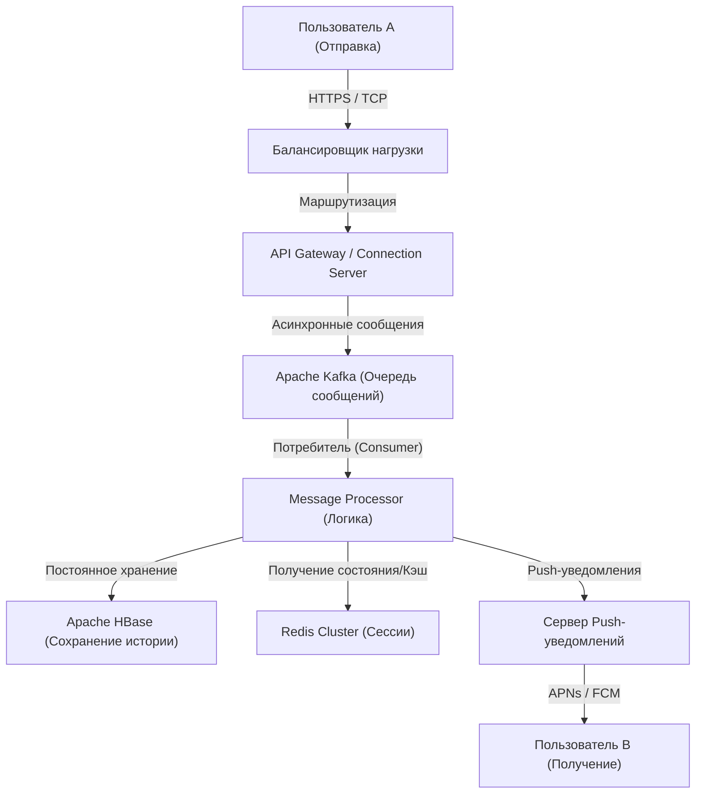

# Пролог: «Связь», рожденная из беспрецедентного кризиса

11 марта 2011 года на Японию обрушилось Великое восточно-японское землетрясение. Это стихийное бедствие, принесшее беспрецедентные разрушения, выявило уязвимость существующей телекоммуникационной инфраструктуры. Телефонные линии были перегружены, и в ситуации, когда даже проверить безопасность родных и друзей было сложно, многим людям пришлось полагаться на интернет-средства связи (такие как Twitter и Skype).

В то время команда NHN Japan (ныне LINE Yahoo), став свидетелем этой картины, почувствовала сильное чувство долга. «Нам нужен простой и стабильный инструмент коммуникации, который позволит надежно связаться с близкими людьми при любых обстоятельствах». Из этого острого желания проект LINE стартовал ускоренными темпами. Всего через несколько месяцев после землетрясения, в июне 2011 года, LINE появился на свет.

# Глава 1: Распространение смартфонов и взрыв культуры стикеров

2011 год, когда появился LINE, был также периодом стремительного перехода от функциональных телефонов (галакэ) к смартфонам. LINE максимально использовал такие особенности смартфонов, как «всегда под рукой» и «возможность получать push-уведомления», предоставив опыт общения в чате с высокой степенью работы в реальном времени.

Однако самым большим фактором, превратившим LINE из простого чат-приложения в «национальную инфраструктуру», несомненно, стало внедрение функции **«Стикеры (Stickers)»**.

## Революция в невербальном общении, вызванная стикерами

Текстовые сообщения иногда могут казаться холодными, или с их помощью бывает сложно передать эмоциональные нюансы. Особенно в культурах с высоким контекстом, таких как японская, большое значение придается умению «читать атмосферу» и «улавливать эмоции». Стикеры позволили передавать богатые эмоции и тонкие нюансы всего одним касанием.

* **Удобство и скорость**: Избавляет от необходимости печатать ответ, позволяя отреагировать мгновенно.
* **Разнообразие выражений**: Визуализация не только радости, гнева, печали и веселья, но и повседневных приветствий, таких как «Понял» или «Хорошая работа».
* **Рынок авторов (Creators Market)**: Благодаря запущенному в 2014 году «LINE Creators Market», создавать и продавать стикеры смог любой желающий, от профессиональных аниматоров до обычных пользователей, что привело к рождению уникальной экосистемы и экономической зоны.

# Глава 2: От мессенджера к «Суперприложению»

По мере расширения пользовательской базы LINE начал выходить за рамки простого обмена сообщениями, превращаясь в «Суперприложение», поддерживающее пользователей в любых повседневных ситуациях. Эта модель уже была реализована, например, китайским WeChat, но LINE был оптимизирован под локальные потребности Японии и Юго-Восточной Азии (Тайвань, Таиланд, Индонезия и др.).

## Траектория развития платформы

1. **LINE GAME**: Игры, использующие социальный граф (связи с друзьями), такие как "LINE POP" и "LINE: Disney Tsum Tsum", стали огромными хитами. Они значительно увеличили время пребывания пользователей в приложении.
2. **LINE NEWS / Manga / Music**: Утверждение статуса платформы для распространения контента.
3. **LINE Pay**: Сервис мобильных платежей. Оседлав волну безналичного расчета, он позволил совершать платежи в обычных магазинах и переводы между физическими лицами.
4. **Официальные аккаунты LINE (Official Accounts)**: Стали незаменимым CRM-инструментом для компаний и магазинов, позволяющим напрямую связываться с пользователями.

Таким образом, LINE вырос в платформу, на которой можно завершить все действия за день, например: «проснуться утром и почитать новости, почитать мангу в поезде, связаться с друзьями и расплатиться в круглосуточном магазине».

# Глава 3: Сверхогромная инфраструктура и архитектура связи, поддерживающие LINE

Сотни миллионов активных пользователей в месяц (MAU) ежедневно отправляют и получают десятки миллиардов сообщений в режиме реального времени. Какова же технологическая основа для обработки такого колоссального трафика без задержек и с высокой надежностью?

## Эволюция инфраструктуры обмена сообщениями и внедрение Erlang/HBase

На начальном этапе LINE стартовал с небольшой конфигурации, но в связи с резким ростом трафика масштабируемость и отказоустойчивость стали первоочередными задачами. В результате была построена архитектура, специализирующаяся на обработке данных в реальном времени.

### Шлюз реального времени (Real-time Gateway)
Группа серверов-шлюзов, поддерживающих постоянное соединение (TCP/WebSocket) с устройствами пользователей. Здесь требуются технологии, способные обрабатывать огромное количество одновременных подключений при низком потреблении ресурсов. В LINE используются такие решения, как асинхронный ввод-вывод (I/O) и модель Actor, что позволяет одному серверу обрабатывать сотни тысяч одновременных подключений.

### Сверхбыстрая обработка данных с помощью HBase и Redis
* **Apache HBase**: Распределенная NoSQL-база данных для постоянного хранения огромной истории сообщений. Она обладает превосходной масштабируемостью и обеспечивает высокоскоростное чтение и запись истории чатов для каждого пользователя.
* **Redis**: Активно используется как слой кэширования и для временных очередей. Применяется для хранения данных, требующих скорости доступа порядка миллисекунд, таких как последние сообщения и информация о сессиях.

## Переход к микросервисной архитектуре

Произошел поэтапный переход от первоначальной монолитной системы (огромного единого приложения) к микросервисной архитектуре, где система разделена на независимые сервисы по функциям.

* **gRPC и Protobuf**: Для связи между сервисами используются высокоскоростные и типобезопасные gRPC и Protocol Buffers. Это позволяет эффективно обрабатывать огромный трафик, возникающий между сотнями микросервисов.
* **Apache Kafka**: В качестве центра асинхронного взаимодействия между сервисами и конвейера данных Kafka играет роль хаба. События отправки сообщений, события прочтения, системные журналы и т.д. доставляются в каждый сервис через Kafka.

## Глобальная синхронизация дата-центров

LINE занимает лидирующие позиции не только в Японии, но и на Тайване, в Таиланде, Индонезии и других странах. Поэтому сервисы развернуты в нескольких дата-центрах (мультирегион) для снижения задержек и повышения доступности. Синхронизация данных (репликация) между дата-центрами выполняется асинхронно, но при этом реализованы сложные механизмы, благодаря которым для пользователя все выглядит согласованно.

# Заключение: Вперед, к будущему коммуникаций

LINE родился из потребности удовлетворить острое желание «связаться с близкими людьми» после трагического события — Великого восточно-японского землетрясения. Изобретение новой формы невербального общения в виде стикеров, эволюция в суперприложение и поддерживающие всё это технологии распределенных систем мирового класса.

В настоящее время развитие технологий, таких как ИИ и блокчейн (Web3), еще больше ускоряется. LINE также движется в сторону разработки новых функций со встроенным генеративным ИИ и предоставления более персонализированных сервисов.

Однако, как бы ни развивались технологии и как бы ни усложнялись приложения, фундаментальная философия LINE остается неизменной. Это миссия «Closing the Distance» (Сокращение расстояния между людьми, а также между людьми и информацией/сервисами по всему миру). LINE, несомненно, продолжит развиваться как невидимая инфраструктура, поддерживающая наше общение.
