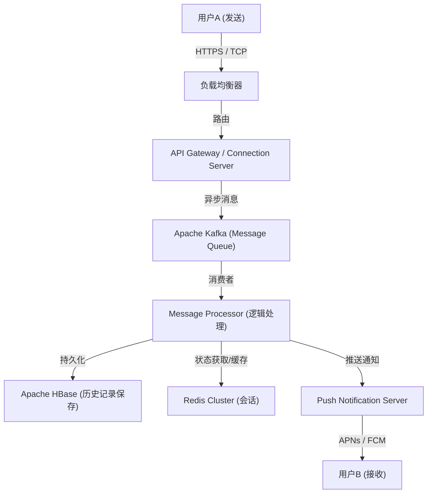

# 序章：前所未有的危机中诞生的“联系”

2011年3月11日，袭击日本的东日本大地震。这场带来前所未有破坏的灾难，暴露了现有通信基础设施的脆弱性。电话线路瘫痪，在甚至难以确认家人和朋友安危的情况下，许多人不得不依赖基于互联网的通信手段（如Twitter和Skype等）。

当时，NHN Japan（现在的LINE雅虎）的团队目睹了这一情景，产生了强烈的使命感。“无论在什么情况下，都需要一个能够确保与重要的人联系的，简单且稳定的通信工具。”出于这种迫切的想法，LINE项目快马加鞭地启动了。地震后仅仅几个月的2011年6月，LINE诞生了。

# 第1章：智能手机的普及与表情包文化的爆发

LINE出现的2011年，也是从功能手机（翻盖手机）向智能手机快速过渡的时期。LINE充分利用了智能手机“随身携带”和“能接收推送通知”的特点，提供了具有高实时性的聊天体验。

然而，将LINE从单纯的聊天应用推向“国民级基础设施”的最大因素，毫无疑问是引入了**“表情包（Stickers）”**功能。

## 表情包带来的非语言交流革命

文本信息有时会让人感觉冷漠，或者难以传达情感的细微差别。特别是在日本这样的高语境文化中，“察言观色”、“揣摩情感”非常重要。表情包使得只需轻轻一点，就能传达丰富的情感和微妙的语境。

* **便捷与速度**：省去了打字回复的麻烦，能够立即做出反应。
* **表达的多样性**：不仅是喜怒哀乐，还将“收到”、“辛苦了”等日常问候视觉化。
* **创作者市场**：通过2014年推出的“LINE Creators Market”，从专业动画师到普通用户，任何人都可以制作和销售表情包，诞生了独特的生态系统和经济圈。

# 第2章：从通讯应用到“超级应用”

随着用户群体的扩大，LINE超越了单纯的通讯范畴，开始向支持日常生活各个场景的“超级应用”进化。虽然这是一种由中国的微信等先行验证的模式，但LINE针对日本及东南亚（台湾、泰国、印度尼西亚等）的本地需求进行了优化。

## 平台扩张的轨迹

1. **LINE GAME**：《LINE POP》和《LINE: 迪士尼松松》等利用社交图谱（好友关系）的游戏大获成功。大幅延长了用户的停留时间。
2. **LINE NEWS / 漫画 / 音乐**：确立了作为内容分发平台的地位。
3. **LINE Pay**：移动支付服务。顺应无现金化浪潮，实现了实体店支付和个人间转账。
4. **LINE官方账号 (Official Accounts)**：成为了企业和店铺直接连接用户的不可或缺的CRM工具。

就这样，LINE成长为一个能够完成“早上起床看新闻，电车上看漫画，和朋友联系，在便利店付款”等一天所有行动的平台。

# 第3章：支撑LINE的超大型基础设施与通信架构

数亿月活跃用户（MAU）每天实时收发数百亿条消息。为了毫无延迟且可靠地处理这种庞大的流量，需要什么样的技术基础呢？

## 消息传递基础架构的演变与Erlang/HBase的采用

初期的LINE以小规模架构起步，但随着流量的激增，可扩展性和容错性成为了当务之急。因此，构建了专注于实时处理的架构。

### 实时网关
维持用户设备常连接（TCP/WebSocket）的网关服务器群。这里需要能够以低资源处理大量并发连接的技术。在LINE中，利用异步I/O和Actor模型，下足了功夫让单台服务器能够处理数十万并发连接。

### 基于HBase和Redis的超高速数据处理
* **Apache HBase**：用于持久化庞大消息历史记录的分布式NoSQL数据库。具有出色的可扩展性，实现了针对每个用户的聊天记录的高速读写。
* **Redis**：作为缓存层和临时队列大显身手。被用于保存最新消息和会话信息等要求毫秒级访问速度的数据。

## 向微服务架构的迁移

从最初的单体（巨大的单一应用程序）系统，逐步迁移到了将功能拆分为独立服务的微服务架构。

* **gRPC与Protobuf**：服务间通信采用了高速且类型安全的gRPC和Protocol Buffers。这有效地处理了数百个微服务之间产生的巨大流量。
* **Apache Kafka**：作为服务间异步通信和数据管道的中心，Kafka发挥了枢纽作用。消息发送事件、已读事件、系统日志等都通过Kafka分发到各个服务。

## 全球数据中心同步

LINE不仅在日本，在台湾、泰国、印度尼西亚等地也占据了压倒性的市场份额。因此，在多个数据中心（多区域）部署服务，以降低延迟并提高可用性。数据中心之间的数据同步（复制）虽然是异步进行的，但实现了一种高级机制，使对用户而言看起来具有一致性。

# 结语：迈向通信的未来

LINE诞生于东日本大地震这一悲剧事件，为了响应“与重要的人保持联系”的迫切需求。表情包这一新型非语言交流的发明、向超级应用的进化，以及支撑它的世界顶级的分布式系统技术。

现在，随着AI技术的发展和区块链（Web3）等，技术浪潮正在进一步加速。LINE也正在开发融合生成式AI的新功能，并向提供更加个性化的服务迈进。

然而，无论技术如何进步、应用变得多么复杂，LINE底层的哲学都不会改变。那就是“Closing the Distance（拉近全世界人与人、人与信息・服务的距离）”的使命。未来，LINE也将继续作为支撑我们交流的无形基础设施，不断发展进化。
