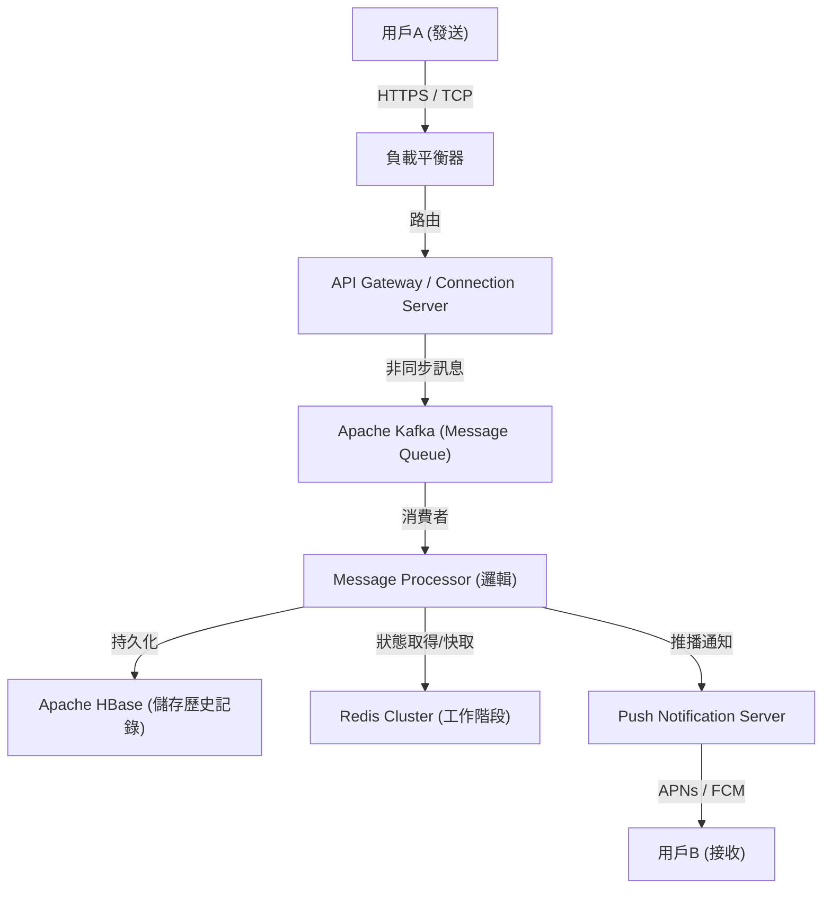

# 序章：從史無前例的危機中誕生的「連結」

2011年3月11日，襲擊日本的東日本大地震。這場帶來史無前例災情的災害，凸顯了現有通訊基礎設施的脆弱性。在電話線路癱瘓、連確認家人和朋友安危都困難重重的情況下，許多人不得不依賴基於網際網路的通訊方式（如Twitter或Skype等）。

當時，NHN Japan（現在的LINE雅虎）的團隊目睹了這個景象，抱持著強烈的使命感。「我們需要一個無論在什麼狀況下，都能確實與重要的人聯繫，簡單且穩定的通訊工具」。出於這個迫切的念頭，LINE的專案以極快的速度啟動。在震災後短短幾個月的2011年6月，LINE誕生了。

# 第1章：智慧型手機的普及與貼圖文化的爆發

LINE登場的2011年，也是從功能型手機急速過渡到智慧型手機的時期。LINE充分利用了智慧型手機「隨身攜帶」、「能接收推播通知」的特性，提供了具備高度即時性的聊天體驗。

然而，將LINE從單純的聊天應用推升至「國民級基礎設施」的最大要素，無疑是導入了**「貼圖（Stickers）」**功能。

## 貼圖帶來的非語言溝通革命

文字訊息有時會讓人感到冷漠，或者難以傳達情感的微妙差異。特別是在像日本這樣的高情境文化中，「察言觀色」、「揣測情感」受到高度重視。貼圖讓使用者只需點擊一次，就能傳達豐富的情感和微妙的含意。

* **便利性與速度**：省去打字回覆的麻煩，能立即做出反應。
* **表現的多樣性**：不只是喜怒哀樂，連「收到」、「辛苦了」等日常問候也視覺化。
* **創作者市集**：2014年推出的「LINE Creators Market」，讓從專業動畫師到一般使用者，任何人都能製作並販售貼圖，誕生了獨特的生態系統與經濟圈。

# 第2章：從通訊軟體走向「超級應用」

隨著用戶群的擴大，LINE超越了單純通訊的框架，開始進化為支援日常生活中各種場景的「超級應用」。雖然這是中國的WeChat等先行採用的模式，但LINE針對日本及東南亞（台灣、泰國、印尼等）的在地需求進行了最佳化。

## 平台發展的軌跡

1. **LINE GAME**：活用社交圖譜（好友關係）的遊戲如《LINE POP》和《LINE: 迪士尼TSUM TSUM》大受歡迎，大幅延長了用戶的停留時間。
2. **LINE NEWS / 漫畫 / 音樂**：確立了作為內容發布平台的地位。
3. **LINE Pay**：行動支付服務。乘著無現金化的浪潮，實現了實體店面的支付與個人間的轉帳。
4. **LINE官方帳號 (Official Accounts)**：成為企業和店家與用戶直接聯繫不可或缺的CRM工具。

就這樣，LINE成長為一個可以完成「早上起床看新聞、在電車上看漫畫、和朋友聯絡、在便利商店付款」等一整天所有行動的平台。

# 第3章：支撐LINE的超大型基礎設施與通訊架構

數億的月活躍用戶（MAU）每天即時收發數百億則訊息。為了在無延遲且確實的情況下處理這龐大流量的技術基礎，究竟是什麼樣的呢？

## 通訊基礎設施的演進與Erlang/HBase的採用

早期的LINE以小規模的架構起步，但隨著流量的激增，擴展性和容錯性成為當務之急。因此，建構了專門針對即時處理的架構。

### 即時閘道器
維持用戶設備常時連線（TCP/WebSocket）的閘道伺服器群。這裡需要能以低資源處理大量同時連線的技術。LINE活用了非同步I/O和Actor模型，下足功夫讓單台伺服器能處理數十萬的同時連線。

### HBase與Redis的超高速資料處理
* **Apache HBase**：用於將龐大訊息歷史記錄持久化的分散式NoSQL資料庫。具備優異的擴展性，實現了高速讀寫每個用戶的聊天記錄。
* **Redis**：在快取層與暫時性佇列中大顯身手。用於保存最新訊息和工作階段資訊等，需要毫秒級存取速度的資料。

## 轉向微服務架構

從初期單體式（巨大的單一應用程式）系統，逐步轉移到將各功能分割為獨立服務的微服務架構。

* **gRPC與Protobuf**：服務間的通訊採用了高速且型別安全的gRPC與Protocol Buffers。藉此有效率地處理數百個微服務間產生的龐大流量。
* **Apache Kafka**：Kafka作為服務間非同步通訊與資料管道的核心，扮演著樞紐的角色。發送訊息事件、已讀事件、系統日誌等，都會透過Kafka發布到各個服務。

## 全球資料中心同步

LINE不僅在日本，在台灣、泰國、印尼等地也擁有壓倒性的市佔率。因此，在多個資料中心（多區域）展開服務，以降低延遲並提升可用性。資料中心間的資料同步（複寫）雖然是以非同步方式進行，但實作了讓用戶看起來具有一致性的高度機制。

# 結語：邁向溝通的未來

從東日本大地震這場悲劇性事件中，為了回應「與重要的人聯繫」這個迫切需求而誕生的LINE。發明了貼圖這種新的非語言溝通方式、進化為超級應用，以及支撐這一切的世界頂級分散式系統技術。

現在，AI技術的發展與區塊鏈（Web3）等科技浪潮正進一步加速。LINE也正朝著開發整合Generative AI的新功能，以及提供更個人化服務的方向前進。

然而，無論技術如何進化、應用變得多麼複雜，LINE根底的哲學依然不變。那就是「Closing the Distance（拉近世界各地人與人、人與資訊・服務之間的距離）」這個使命。未來，LINE也將繼續作為支撐我們溝通的無形基礎設施，不斷進化吧。
