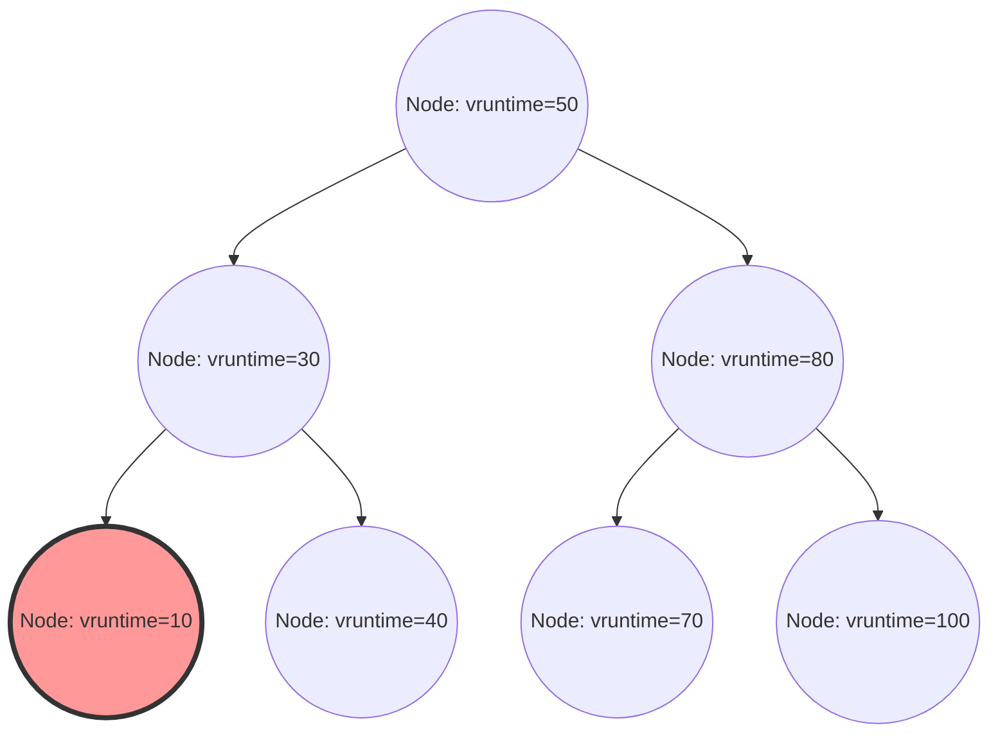

في نواة لينكس (Linux Kernel)، يُعد مجدول العمليات (Process Scheduler) أحد أهم المكونات التي تحدد الأداء العام للنظام، والإنتاجية (Throughput)، والاستجابة. إن "المجدول العادل تمامًا" (Completely Fair Scheduler - CFS)، والذي تربع كالمجدول الافتراضي في أنظمة لينكس الحديثة (من النواة 2.6.23 إلى 6.5) لسنوات طويلة، يُعتبر تحفة فنية تخلت تمامًا عن الجدولة التقليدية القائمة على الاستدلال (Heuristics)، سعيًا وراء "العدالة التامة" المبنية على نموذج رياضي صارم.

في هذا المقال، سنشرح بالتفصيل المعماري، من منظور البنية الداخلية لنواة لينكس ونظرية الجدولة، معمارية CFS، والحسابات الرياضية لوقت التنفيذ الافتراضي (vruntime)، وإدارة طابور التشغيل (Runqueue) باستخدام شجرة أحمر-أسود (Red-Black Tree)، وخوارزمية موازنة الحمل في بيئة متعددة الأنوية، بالإضافة إلى التطور نحو EEVDF (Earliest Eligible Virtual Deadline First) الذي تم تقديمه في النواة الحديثة 6.6 وما بعدها، بدقة تصل إلى مستوى الكود المصدري. بالنسبة لقراصنة النواة (Kernel Hackers)، ومبرمجي الأنظمة، والمهندسين الذين يتحدون ضبط الأداء في الطبقات الدنيا، فإن الفهم العميق للبنية الداخلية لـ CFS هو طريق لا مفر منه.

## الفصل الأول: تاريخ تطور مجدول لينكس وخلفية ولادة CFS

لفهم فلسفة تصميم CFS وجمالها بعمق، من الضروري أن نتتبع التحديات التي واجهها المجدول في تاريخ نواة لينكس وكيف تطور. كان تطور خوارزميات الجدولة تاريخًا من المعارك الشرسة مع المفاضلة بين المتطلبات المتعارضة: الإنتاجية (كمية المعالجة لكل وحدة زمنية) وزمن الاستجابة (Latency).

### ما قبل حقبة النواة 2.4: حدود مجدول O(N) ومعضلة الجدولة القائمة على الحقب

كان المجدول في حقبة لينكس 2.4 بسيطًا ولكنه كافٍ للتعامل مع أحمال العمل القياسية في ذلك الوقت. اعتمد هذا المجدول على خوارزمية قائمة على الحقبة (Epoch)، حيث يتم تخصيص شريحة زمنية (Time Slice) لكل عملية، وعندما تستنفد جميع العمليات شرائحها الزمنية، تبدأ حقبة جديدة.

ولكن مع انتشار الأنظمة متعددة المعالجات، بدأ هذا المجدول يكشف عن عيوب معمارية قاتلة. كان هذا العيب هو أن التعقيد الحسابي هو $O(N)$ (حيث N هو عدد العمليات القابلة للتنفيذ). كان النظام يمتلك طابور تشغيل (Runqueue) عالميًا واحدًا فقط، وفي كل مرة تتم فيها الجدولة، يتم فحص "جميع العمليات" في الطابور لتحديد العملية المثلى التالية للتنفيذ (تلك التي تمتلك أعلى أولوية ديناميكية).
الأكثر خطورة كان التحكم الإقصائي (Mutual Exclusion). نظرًا لأن طابور التشغيل بأكمله كان محميًا بقفل دوران عالمي واحد (`runqueue_lock`)، فقد اشتد التنافس على القفل مع زيادة عدد أنوية وحدة المعالجة المركزية (CPU). بينما يبحث أحد المعالجات عن العملية التالية لتنفيذها، يتم حظر جميع المعالجات الأخرى، وتُهدر دورات المعالج الثمينة في انتظار قفل الدوران (Busy Loop)، مما أدى إلى عنق زجاجة خطير في قابلية التوسع (ارتداد خط ذاكرة التخزين المؤقت - Cache Line Bouncing).

### النواة 2.6: Ingo Molnar وابتكار مجدول O(1)

لحل مشكلة قابلية التوسع والتعقيد الحسابي بشكل جذري، تم تقديم "مجدول O(1)" من قبل مخترق النواة الشهير Ingo Molnar أثناء عملية تطوير نواة لينكس 2.6. كما يوحي اسمه، تمتع هذا المجدول بخوارزمية ثورية لا تعتمد إطلاقًا على عدد العمليات في النظام، ويمكنه دائمًا تحديد العملية التالية في وقت ثابت $O(1)$.

احتوى مجدول O(1) على طوابير تشغيل مستقلة تمامًا لكل وحدة معالجة مركزية (Per-CPU Runqueue)، مما أدى إلى تحسين مشاكل قابلية التوسع في البيئات متعددة المعالجات بشكل كبير من خلال إلغاء القفل العالمي. احتفظ كل طابور تشغيل بمصفوفتين للأولويات: "مصفوفة نشطة" (Active Array) و "مصفوفة منتهية" (Expired Array). تتكون المصفوفات من قوائم مرتبطة (`list_head`) لـ 140 مستوى من الأولويات (0-139، حيث 0-99 هي أولويات الوقت الفعلي، و 100-139 تتوافق مع قيم nice العادية).

كان اختيار العمليات سريعًا للغاية. تم إعداد خريطة بت (Bitmap) لكل أولوية، ويتم تعيين البت إلى 1 في الأولوية التي توجد بها عمليات قابلة للتنفيذ. باستخدام "تعليمات البحث عن البت الأكثر أهمية" التي يوفرها العتاد (مثل `bsfl` أو `lzcnt` في x86)، يمكن لوحدة المعالجة المركزية تحديد أعلى أولوية في دورات ساعة ثابتة، وإحضار العملية في بداية قائمة تلك الأولوية في وقت $O(1)$. عندما تستنفد العملية شريحتها الزمنية، تنتقل إلى "المصفوفة المنتهية"، وعندما تصبح "المصفوفة النشطة" فارغة، يتم تبديل مؤشري المصفوفتين لتبدأ حقبة جديدة على الفور.

ومع ذلك، في حين أن مجدول O(1) كان مثاليًا من حيث الأداء، إلا أنه ورط نفسه في معضلة ضخمة أخرى: "تحديد التفاعلية" (Interactivity). لتحسين تجربة المستخدم في بيئات سطح المكتب (مثل استجابة تتبع الماوس ورسم النوافذ)، كان المجدول يستخدم استدلالات (Heuristics) مبنية على نسبة وقت النوم السابقة إلى وقت التنفيذ لتخمين ما إذا كانت العملية مقيدة بالإدخال/الإخراج (تفاعلية) أو مقيدة بوحدة المعالجة المركزية. العمليات التي تم تحديدها على أنها تفاعلية تم منحها دفعة أولوية ديناميكية (مكافأة)، وتم تطبيق معالجة استثنائية لإبقائها في المصفوفة النشطة بدلاً من نقلها إلى المصفوفة المنتهية حتى بعد استنفاد شريحتها الزمنية.
أصبح هذا المنطق الاستدلالي معقدًا ومربكًا بشكل متزايد مع كل تحديث لإصدار النواة، وفي حالات الحافة (Edge Cases)، تسبب في تخطي خطير للصوت في تطبيقات الوسائط المتعددة، وسلوكيات غامضة حيث عانت العمليات المقيدة بوحدة المعالجة المركزية من المجاعة التامة (Starvation).

### Con Kolivas و RSDL والتحول النموذجي نحو العدالة التامة

كان Con Kolivas، طبيب التخدير الذي عمل أيضًا كمخترق للنواة، هو من اعترض على الاستدلالات المعقدة للغاية لمجدول O(1) وعمليات الضبط الفوضوية. جادل بأن "استجابة سطح المكتب يمكن تحسينها ببساطة من خلال التوزيع العادل البحت، دون الحاجة إلى منطق تخمين معقد"، واقترح تصحيحات مثل مجدول Staircase ومجدول RSDL (Rotating Staircase Deadline) على القائمة البريدية (ML).

على الرغم من أن مجدول RSDL الخاص بـ Kolivas لم يتم دمجه في الخط الرئيسي (Mainline)، إلا أن فلسفته أعطت Ingo Molnar إلهامًا حاسمًا. تخلى Ingo Molnar تمامًا عن حسابات الأولوية الديناميكية المعقدة والأكواد الاستدلالية لمجدول O(1)، وكتب مجدولًا جديدًا تمامًا في غضون أسابيع قليلة بناءً على مبدأ واحد جميل: "تقسيم وقت وحدة المعالجة المركزية بشكل عادل تمامًا بين العمليات". كان هذا هو "المجدول العادل تمامًا (CFS)".
تم دمج CFS في الخط الرئيسي في إصدار لينكس 2.6.23، واستمر في العمل كقلب نابض لنظام لينكس لأكثر من 15 عامًا. كان هذا تحولًا نموذجيًا (Paradigm Shift) في غاية الأهمية في تاريخ أنظمة التشغيل، وهو العودة من القواعد التجريبية المعقدة إلى النماذج الرياضية.

## الفصل الثاني: الأسس الرياضية للاصطفاف العادل (Fair Queuing) ونموذج GPS

إن مفهوم "العدل التام" (Completely Fair) في CFS ليس مجرد شعار، بل يضرب بجذوره في "نموذج تخصيص الموارد المثالي" في نظرية أنظمة التشغيل ونظرية الشبكات.

### نموذج GPS (المشاركة المعممة للمعالج): اليوتوبيا

الشكل المثالي المطلق في نظرية الجدولة هو المفهوم المعروف باسم نموذج GPS (Generalized Processor Sharing) أو النموذج السائل (Fluid).
معالج GPS المثالي هو عتاد افتراضي يتجاهل القيود المادية. إذا كان هناك $N$ عملية قابلة للتنفيذ في النظام، فإن معالج GPS يوفر لكل عملية قوة معالجة تعادل بالضبط $1/N$ في نفس الوقت، وبالتوازي. أي أنه بدلاً من "التقسيم الزمني" لمورد وحدة المعالجة المركزية (شرائح زمنية) والتنفيذ بالتناوب، فإنه يقسمها "مكانيًا (أو أدائيًا)" ليجعل العمليات تتقدم باستمرار بتأخير يساوي صفر.

عندما يكون هناك اختلاف في أولويات العمليات (الوزن: Weight)، يتم توسيع نموذج GPS إلى الاصطفاف العادل الموزون (Weighted Fair Queuing - WFQ). عندما يكون لكل عملية $i$ في النظام وزن $w_i$، فإن العملية $i$ تتلقى دائمًا "بشكل مستمر" قدرة معالجة تتناسب مع نسبة وزنها إلى إجمالي الأوزان. معبرًا عنه بصيغة رياضية، فإن عرض النطاق الترددي لوحدة المعالجة المركزية $C_i$ الذي تتلقاه العملية $i$ هو كالتالي:

$$
C_i = \text{CPU Total Capacity} \times \frac{w_i}{\sum_{j=1}^{N} w_j}
$$

في هذا النموذج، تكلفة تبديل السياق (Context Switch) تساوي صفرًا، وتستمر العمليات في التقدم من خلال استهلاك النطاق الترددي المخصص لها من وحدة المعالجة المركزية باستمرار.

### تقريب نموذج GPS في الوقت المنفصل والنظرية الأساسية لـ CFS

ومع ذلك، فإن النواة المادية الحقيقية لوحدة المعالجة المركزية لا يمكنها تنفيذ سوى تسلسل أوامر واحد (خيط) في لحظة معينة (باستثناء SMT/Hyper-Threading). إن تنفيذ نموذج GPS كما هو على الأجهزة المادية يعد أمرًا مستحيلاً وفقًا لقوانين الفيزياء.
لذلك، من الضروري تقسيم الوقت إلى شرائح صغيرة وتبديل العمليات بسرعة عالية (تعدد الإرسال بتقسيم الزمن) لتقريب (محاكاة) نموذج GPS عند النظر إليه من منظور كلي. هذا هو المبدأ الأساسي لـ CFS، والذي يطبق مفهوم جدولة الحزم (WFQ) في موجهات الشبكات على جدولة وحدة المعالجة المركزية.

تقوم خوارزمية CFS دائمًا بحساب وتتبع "وقت وحدة المعالجة المركزية المثالي" الذي كان من المفترض أن تحصل عليه العمليات قيد التشغيل في النظام لو تم تنفيذها على معالج GPS مثالي. بعد ذلك، تقوم بالجدولة لتشغيل العملية التي لديها أكبر "خطأ (تأخير)" مقارنة بالوقت المستهلك فعليًا على وحدة المعالجة المركزية الحقيقية في الخطوة التالية.
هذه الساعة الافتراضية لتتبع "درجة التقدم على معالج GPS المثالي" هي بالضبط "وقت التنفيذ الافتراضي (vruntime)" الذي سيتم شرحه بالتفصيل في الفصل الثالث.

## الفصل الثالث: الرياضيات وآلية الحساب لوقت التنفيذ الافتراضي (vruntime)

جوهر خوارزمية CFS، والذي يتحكم في كل شيء، هو متغير عدد صحيح غير موقّع بحجم 64 بت يسمى `vruntime` (Virtual Runtime)، والذي تحتفظ به جميع العمليات (أو بدقة أكبر، `sched_entity`، وهي الوحدة الأساسية للجدولة).
قاعدة الجدولة في CFS بسيطة بشكل مدهش ولا تحتوي على عمليات مصفوفات معقدة مثل مجدول O(1).
**"حدد دائمًا المهمة التي تمتلك أصغر vruntime في طابور التشغيل، وقم بتنفيذها بعد ذلك."**

### معادلة التحويل من قيمة nice إلى الوزن (Weight)

في نظام لينكس، تُستخدم قيمة nice من `-20` (أعلى أولوية) إلى `19` (أدنى أولوية) لضبط أولوية العمليات من مساحة المستخدم. القيمة الافتراضية هي `0`.
في CFS، لا تُستخدم قيمة nice هذه مباشرة في الحسابات. بدلاً من ذلك، يتم تحويلها إلى "وزن (Weight)" يمثل نسبة التخصيص النسبي لوحدة المعالجة المركزية.

كان متطلب التصميم هنا هو: "إذا انخفضت قيمة nice بمقدار 1 (زادت الأولوية)، فإنها تحصل على حوالي 10٪ من وقت وحدة المعالجة المركزية أكثر مقارنة بالعمليات الأخرى، وإذا زادت قيمة nice بمقدار 1، فإنها تحصل على أقل بنسبة 10٪ تقريبًا". لتحقيق ذلك رياضيًا، تم تعريف الوزن ليتغير هندسيًا بالنسبة لقيمة nice. على وجه التحديد، تم تحديد نسبة الوزن (المضاعف) بين قيم nice المتجاورة لتكون حوالي $1.25$.
بما أن $1.25^3 \approx 1.953 \approx 2.0$، فإنه ينشأ ارتباط جميل حيث أنه إذا تغيرت قيمة nice بمقدار 3، فإن وقت وحدة المعالجة المركزية المخصص للعملية يتضاعف تقريبًا، أو ينخفض إلى النصف.

يوجد داخل النواة في ملف `kernel/sched/core.c` جدول بحث ثابت `sched_prio_to_weight` محدد بناءً على هذه النظرية.

```c
const int sched_prio_to_weight[40] = {
 /* -20 */     88761,     71755,     56483,     46273,     36291,
 /* -15 */     29154,     23254,     18705,     14949,     11916,
 /* -10 */      9548,      7620,      6100,      4904,      3906,
 /*  -5 */      3121,      2501,      1991,      1586,      1277,
 /*   0 */      1024,       820,       655,       526,       423,
 /*   5 */       335,       272,       215,       172,       137,
 /*  10 */       110,        87,        70,        56,        45,
 /*  15 */        36,        29,        23,        18,        15,
};
```
يُعرّف وزن المهمة بقيمة nice تساوي `0` بأنه `1024`، ويتم التعامل مع هذا كثابت ماكرو `NICE_0_LOAD` داخل النواة. تُجرى جميع الحسابات بناءً على هذا الـ `1024`.

### النموذج الرياضي وصيغة حساب زيادة vruntime

عندما يتم تنفيذ عملية ما لوقت حقيقي $\Delta exec$ (بالنانو ثانية) على وحدة المعالجة المركزية المادية، فإن `vruntime` لتلك العملية يزداد وفقًا للصيغة التالية:

$$
vruntime \mathrel{+}= \Delta exec \times \frac{NICE\_0\_LOAD}{weight}
$$

لنتأمل ما تعنيه هذه المعادلة بتطبيقها على قيم nice محددة.

1. **عندما تكون قيمة nice `0` (الوزن `1024`)**:
   تكون النسبة $\frac{1024}{1024} = 1$. وبالتالي، يزداد $vruntime$ بنفس الوتيرة التي يزداد بها الوقت الحقيقي $\Delta exec$. إذا تم التنفيذ لمدة 10 ملي ثانية حقيقية، سيتقدم vruntime بمقدار 10 ملي ثانية (10,000,000 نانو ثانية).
2. **عندما تكون قيمة nice `-5` (الوزن `3121`، أولوية عالية)**:
   تكون النسبة $\frac{1024}{3121} \approx 0.328$. أي أن $vruntime$ يزداد بوتيرة تقارب 1/3 من الوقت الحقيقي. نظرًا لأن زيادة vruntime أبطأ، يمكن للعملية أن تحافظ على حالة "أصغر vruntime" لفترة أطول مقارنة بالعمليات الأخرى، مما يؤدي إلى احتكار وحدة المعالجة المركزية لفترة أطول كنتيجة لذلك.
3. **عندما تكون قيمة nice `5` (الوزن `335`، أولوية منخفضة)**:
   تكون النسبة $\frac{1024}{335} \approx 3.05$. يزداد $vruntime$ بوتيرة شديدة تبلغ حوالي 3 أضعاف الوقت الحقيقي. نظرًا لأن vruntime يصبح كبيرًا بسرعة حتى مع القليل من التنفيذ، سيتم تجاوز العملية بسرعة بواسطة المهام الأخرى وتفقد مكانة "أصغر vruntime"، لتتنازل عن وحدة المعالجة المركزية.

بهذه الطريقة، تقوم CFS بتطبيع وقت التنفيذ المادي باستخدام "وزن" كل عملية لتختزله في بُعد المؤشر المطلق الفردي `vruntime`، وتحقق بذلك التحكم في الأولوية والعدالة في نفس الوقت.

### تجنب القسمة في تنفيذ النواة والعمليات الحسابية بالنقطة الثابتة

على الرغم من أن النموذج الرياضي كما هو موضح أعلاه، إلا أن تنفيذ عملية قسمة (تعليمة القسمة) $\frac{1}{weight}$ في كل مرة في مسار المجدول الذي يُستدعى عشرات الآلاف من المرات كل مللي ثانية في أعماق نواة نظام التشغيل، سيؤدي إلى عقوبة أداء خطيرة للغاية (خاصة في البنى القديمة حيث يبلغ التأخير عشرات إلى مئات دورات الساعة).

لذلك، تستخدم نواة لينكس تحسينًا ذكيًا للتخلص من عمليات القسمة تمامًا. يتم إعداد جدول بحث آخر `sched_prio_to_wmult` يحسب مسبقًا $\frac{2^{32}}{weight}$ (المعكوس مضروبًا في $2^{32}$)، ويستبدل القسمة تمامًا بالضرب وإزاحة لليمين بمقدار 32 بت (وهي تقنية أساسية في حسابات النقطة الثابتة).

```c
/* kernel/sched/fair.c : الهيكل المنطقي لـ calc_delta_fair() */
static inline u64 calc_delta_fair(u64 delta, struct sched_entity *se)
{
    if (unlikely(se->load.weight != NICE_0_LOAD)) {
        /*
         * لتجنب القسمة، استخدم فقط تعليمات الضرب والإزاحة
         * لحساب delta = delta * (NICE_0_LOAD / weight)
         */
        delta = __calc_delta(delta, NICE_0_LOAD, &se->load);
    }
    return delta;
}
```
في كل مرة يحدث فيها مقاطعة للمؤقت (Tick)، أو عند حدوث تبديل للسياق، يتم استدعاء وظيفة `update_curr()` في `kernel/sched/fair.c`، حيث يُقاس وقت التنفيذ الفعلي للمهمة الجارية بدقة متناهية، ويتم تحديث `vruntime` بدقة من خلال الوظيفة المذكورة أعلاه.

## الفصل الرابع: إدارة طابور التشغيل باستخدام شجرة أحمر-أسود (Red-Black Tree) وكيان الجدولة

في حين أن مجدول O(1) استخدم هياكل مصفوفات مبنية على الأولوية، تبنت CFS بنية بيانات متطورة تسمى "شجرة أحمر-أسود (Red-Black Tree, RB-tree)"، وهي نوع من أشجار البحث الثنائية المتوازنة ذاتيًا.

### هيكل cfs_rq وتجريد sched_entity

يحتفظ كل معالج (CPU) بهيكل بيانات طابور التشغيل الخاص بـ CFS والمسمى `struct cfs_rq` في الذاكرة. الأمر المثير للاهتمام هو أن الكائن الذي يتم تخزينه وجدولته مباشرة في طابور التشغيل ليس هو `task_struct` الذي يمثل العملية نفسها. تقوم CFS بتجريد أهداف الجدولة إلى مستوى أعلى وتتعامل معها كهيكل يسمى `struct sched_entity` (كيان الجدولة).

هذا التجريد في غاية الأهمية. لأنه بفضله، سواء كان هدف الجدولة عملية واحدة أو مجموعة من العمليات المجمعة بواسطة cgroups (مجموعات التحكم)، فإن CFS يمكنها التعامل معها بشفافية وبنفس الطريقة كـ `sched_entity` واحد. بفضل هذا، تم تحقيق جدولة المجموعات الهرمية (Group Scheduling) بشكل أنيق.

### العمليات على شجرة أحمر-أسود والتعقيد الحسابي للخوارزمية

تقوم CFS بتخزين جميع الكيانات القابلة للتنفيذ الموجودة في طابور التشغيل داخل شجرة أحمر-أسود باستخدام `vruntime` كمفتاح (معيار للترتيب). نظرًا لطبيعة شجرة البحث الثنائية، فإن هناك قاعدة تنص على أن العقدة الفرعية اليسرى لها قيمة أصغر من العقدة الأم، والعقدة الفرعية اليمنى لها قيمة أكبر من العقدة الأم.

- **البحث عن أفضل عملية (جلبها)**:
  قاعدة CFS هي "دائمًا نفذ العملية ذات vruntime الأصغر". في شجرة أحمر-أسود، توجد أصغر عقدة في أقصى اليسار بالنزول من الجذر نحو اليسار ثم اليسار، أي "العقدة الموجودة في أقصى اليسار السفلي للشجرة (`rb_leftmost`)".
  في كل مرة يتم فيها إدراج أو حذف من الشجرة، تحتفظ CFS دائمًا بمؤشر مخزن مؤقتًا إلى هذه العقدة `rb_leftmost` (`cfs_rq->rb_leftmost`). وبالتالي، فإن عملية اختيار المجدول للعملية التالية لتنفيذها (`pick_next_task_fair()`) لا تتطلب البحث في الشجرة، بل يكفي قراءة المؤشر المخزن مؤقتًا، وبالتالي يكتمل التعقيد الحسابي في $O(1)$.

- **إدراج وحذف العقد**:
  عندما تستيقظ عملية (Wake-up) من حالة السبات وتصبح قابلة للتنفيذ، أو عندما تنهي تنفيذها وتتنازل عن المعالج للعودة إلى الطابور، فإن التعقيد الحسابي للإدراج في شجرة أحمر-أسود (`enqueue_entity()`) أو الحذف منها (`dequeue_entity()`) هو $O(\log N)$ حيث N هو عدد العناصر في الطابور.
  مقارنة بمجدول O(1)، فقد تفاقم ترتيب التعقيد الحسابي، ولكن نظرًا لأن شجرة أحمر-أسود تحافظ دائمًا على التوازن الذاتي ويقتصر ارتفاع الشجرة على $\log N$، فحتى لو كان هناك عشرات الآلاف من العمليات في النظام، فلن يكون ارتفاع الشجرة سوى بضع عشرات من المستويات. بالنظر إلى موقع ذاكرة التخزين المؤقت، ثبت أن النفقات الإضافية لدورات وحدة المعالجة المركزية من الناحية العملية ضئيلة للغاية، وأرخص بكثير من تكلفة تنفيذ المنطق الاستدلالي المعقد في O(1).


*رسم بياني: البنية المنطقية لشجرة أحمر-أسود باستخدام vruntime كمفتاح. يتم دائمًا تخزين العقدة الموجودة في أقصى اليسار مؤقتًا (vruntime=10) كعملية تالية ليتم تنفيذها.*

### التدابير ضد الطفحان (Overflow) باستخدام min_vruntime والتصحيح عند الاستيقاظ

يُعتبر `vruntime` عددًا صحيحًا غير موقّع بـ 64 بت (`u64`)، وهو يتزايد باستمرار بالنانو ثانية. في خوادم المؤسسات التي تعمل باستمرار لفترات طويلة، توجد دائمًا احتمالية رياضية لحدوث طفحان (Overflow - ظاهرة الالتفاف حول العتبة والعودة إلى 0 بعد تجاوز الحد الأقصى).

علاوة على ذلك، تتمثل المشكلة العملية الأكثر شيوعًا في كيفية التعامل مع العمليات المنشأة حديثًا، أو العمليات التي استيقظت للتو بعد نوم طويل دام لساعات في انتظار إدخال/إخراج. إذا ظل `vruntime` لهذه العمليات عند 0 أو قيمة قديمة، فسيصبح قيمة أصغر بشكل ساحق مقارنة بـ `vruntime` للعمليات الأخرى في النظام الحالي (مثلاً تريليونات النانو ثانية). نتيجة لذلك، ستفترض CFS بالخطأ أن "هذه العملية لم تستخدم وحدة المعالجة المركزية على الإطلاق، وهي في حالة مؤسفة للغاية"، وستمنحها احتكارًا كاملاً لوحدة المعالجة المركزية (مما يؤدي إلى مجاعة لجميع العمليات الأخرى) حتى يلحق `vruntime` الخاص بها بالعمليات الأخرى.

لمنع ذلك تمامًا، يحتفظ هيكل `cfs_rq` بمتغير تتبع مهم يسمى `min_vruntime`.
يقوم `min_vruntime` بتتبع أصغر `vruntime` من بين جميع العمليات الموجودة حاليًا في طابور التشغيل هذا، ولكنه يخضع لقاعدة صارمة تسمح بـ **"الزيادة المطردة" فقط**. بمعنى أنه لا يعود بالزمن إلى الوراء أبدًا.

- **تهيئة العمليات الجديدة (عند الـ fork)**:
  عندما يتم إنشاء عملية جديدة، لا يبدأ الـ `vruntime` الأولي الخاص بها من الصفر، بل يتم تعديله بتعويض (تهيئة) إلى قيمة معقولة تعتمد على `vruntime` الخاص بالعملية الأم أو `min_vruntime` لطابور التشغيل الحالي.
- **تصحيح العمليات المستيقظة (Wake-up)**:
  عندما تستيقظ عملية نامت لفترة طويلة وتعود إلى طابور التشغيل، يتم إجراء تصحيح دقيق داخل دالة `enqueue_entity()`. تتم مقارنة الـ `vruntime` القديم للعملية بقيمة تُحسب بطرح قيمة جزاء معينة (مأخوذة من `sysctl_sched_latency` وما شابه) من `min_vruntime` الخاص بطابور التشغيل، ويتم اعتماد القيمة الأكبر.
  بمعنى أن `se->vruntime = max_vruntime(se->vruntime, cfs_rq->min_vruntime - Penalty)`، ويتم "رفع" الوقت قسراً لمطابقة ساعة النظام الكلية. بفضل هذا، يتم منع احتكار المعالج بشكل غير عادل عند الاستيقاظ من السبات الطويل، بينما يتم توفير مكافأة تأخير مناسبة لضمان الاستجابة عند الاستيقاظ من سبات قصير (مثل انتظار إدخال من لوحة المفاتيح).

بالإضافة إلى ذلك، في دالة المقارنة الخاصة بشجرة أحمر-أسود داخل النواة (`entity_before()`)، عند مقارنة حجم قيمتي `u64`، فإنه لا يتم مقارنتهما مباشرة، بل يتم أولاً تحويلهما إلى أعداد صحيحة موقعة بـ 64 بت (`s64`) وإجراء الطرح، ومن ثم تحديد الحجم بناءً على إشارة النتيجة. يعتبر هذا الاختراق الرياضي المعتمد على الحساب المعياري للمكمل لـ 2 (2's complement modular arithmetic) فعالاً، طالما أن الفرق بين القيمتين أقل من $2^{63}$، فإنه يمكنه تحديد العلاقة الزمنية الدقيقة بشكل صحيح حتى لو تعرضت إحدى القيم للطفحان وعادت إلى الصفر، مما يجعل مشكلة الالتفاف (Wraparound) غير ضارة بالمرة.

## الفصل الخامس: آلية موازنة الحمل (Load Balancing) في الأنظمة متعددة الأنوية و NUMA

في بنى الأجهزة الحديثة، لم تعد معالجات النواة الواحدة موجودة، وباتت المعماريات التي تحتوي على عشرات أو مئات الأنوية شائعة، فضلاً عن معماريات NUMA (الوصول غير المنتظم للذاكرة) حيث يعتمد تأخير الوصول إلى الذاكرة على المسافة المادية.
مهما بلغت خوارزمية الشجرة الحمراء-السوداء الخاصة بـ CFS من تحقيق لعدالة مثالية على وحدة معالجة مركزية (CPU) واحدة، إذا كان طابور إحدى وحدات المعالجة يغص بـ 100 عملية معلقة بينما وحدة المعالجة المجاورة فارغة تمامًا في حالة خمول، فإن الإنتاجية الإجمالية للنظام ستكون في أسوأ حالاتها. لذلك، يُعد ترحيل المهام (Migration) وموازنة الحمل في بيئات متعددة الأنوية نظامًا فرعيًا بالغ الأهمية.

### الطوبولوجيا الهرمية المعقدة لـ sched_domain و sched_group

تقوم نواة لينكس بتجريد طوبولوجيا المعالج المعقدة للأجهزة المادية وتقوم ببناء هياكل بيانات هرمية تدعى `sched_domain` و `sched_group` لإدارتها بكفاءة. عند بدء تشغيل النظام، يتم قراءة معلومات الأجهزة من ACPI أو Device Tree لإنشاء شجرة هرمية منطقية.

على سبيل المثال، تخيل نظامًا يحتوي على مقبسين ماديين (عقدتي NUMA)، كل مقبس به 4 أنوية مادية، وكل منها مُمكّن عليه تقنية SMT (مثل Hyper-Threading)، ليكون المجموع 16 خيطًا منطقيًا. في هذه الحالة، يبني المجدول التسلسل الهرمي (النطاقات) التالي من الأسفل إلى الأعلى:

1. **نطاق SMT (تعدد خيوط المعالجة المتزامن)**:
   وهو الطبقة السفلى. يتولى مسؤولية موازنة الحمل بين خيطين منطقيين يتشاركان في نفس النواة المادية. ونظرًا لأن ذاكرة التخزين المؤقت من المستوى الأول/الثاني (L1/L2) ووحدات التنفيذ مشتركة تمامًا هنا، فإن تكلفة (عقوبة) نقل مهمة ما تكون ضئيلة للغاية.
2. **نطاق MC (متعدد الأنوية)**:
   يتولى موازنة الحمل بين الأنوية المادية المتعددة الموجودة على نفس المقبس المادي (حزمة وحدة المعالجة المركزية). نظرًا لأنها عادة ما تتشارك في ذاكرة التخزين المؤقت من المستوى الثالث (LLC: Last Level Cache)، فإن العقوبة الناتجة عن أخطاء التخزين المؤقت عند نقل المهمة تعتبر متوسطة.
3. **نطاق NUMA**:
   الطبقة العليا. يتولى مسؤولية موازنة الحمل بين المقابس المادية المختلفة (عقد NUMA). إذا تم نقل عملية عبر هذا النطاق، فسيصبح الوصول إلى الذاكرة التي تستخدمها العملية وصولاً للذاكرة البعيدة، مما يسبب تدهورًا خطيرًا في زمن الاستجابة، ولذلك تم تعيين عقوبة النقل (المقاومة) بقيمة عالية جدًا.

يتم تشغيل موازنة الحمل (Load Balancing) في توقيتين: التنفيذ الدوري عبر مقاطعات المؤقت (Periodic Load Balance)، والتنفيذ قبل انتقال طابور تشغيل المعالج لحالة الخمول مباشرة (NewIdle Load Balance).
تتبع الخوارزمية النطاقات من أسفل التسلسل الهرمي (SMT) إلى أعلاه (NUMA). في كل نطاق، تُحسب متوسّطات الحمل لمجموعات الـ `sched_group` المنتمية له، ولا يتم سحب المهام (Pull) من المجموعة الأعلى حملاً إلى المجموعة الأقل حملاً (النفس) إلا في حال تجاوز الحمل لعتبة العقوبة المحددة لذلك النطاق.

### رياضيات خوارزمية تتبع حمل كل كيان (PELT - Per-Entity Load Tracking)

من أجل مقارنة "الحمل بين المجموعات" بدقة أثناء موازنة الحمل، يجب أولاً القدرة على قياس "حمل المهام" نفسها بدقة. في الماضي، استخدمت نواة لينكس طريقة تقريبية أخذت عينات فورية لعدد المهام المصطفة في طابور التشغيل (طول الطابور)، لكن هذا لم يُمكّنها من تقدير أحمال المهام المتقطعة ذات التكرار السريع بشكل دقيق، مما أدى إلى عمليات نقل مهام غير ملائمة.

لحل هذه المشكلة، الخوارزمية التي تم إدخالها مؤخرًا والتي حسنت من دقة جدولة النواة بشكل هائل هي خوارزمية **PELT (Per-Entity Load Tracking)**.
تقوم PELT بتتبع "التاريخ" الخاص بمدى استهلاك كل كيان (عملية أو مجموعة cgroup) لوقت المعالج بشكل مستمر، مع تطبيق الاضمحلال بدقة تصل إلى الميللي ثانية باستخدام المتوسط المتحرك المرجح أسيًا (EWMA: Exponentially Weighted Moving Average).

يُحسب الحمل $L_t$ لمهمة معينة في الزمن $t$ باستخدام علاقة تكرارية تعتمد على استهلاكها الحالي للمعالج $C_t$ والحمل التراكمي السابق $L_{t-1}$ كالتالي:

$$ L_t = C_t + y \times L_{t-1} $$

حيث $y$ هو عامل الاضمحلال (قيمة أكبر من 0 وأصغر من 1). في نواة لينكس، تم ضبط قيمة $y$ بحيث يتناقص تأثير التاريخ السابق بمقدار النصف تمامًا في كل 32 مللي ثانية (فترة عمر النصف 32ms) ($y^{32} = 0.5$).
بفضل هذا، يرتفع مقياس الحمل بسلاسة عندما تبدأ المهمة في استهلاك المعالج، وينخفض بسلاسة عندما تنام. لا يتم تزويد مؤشرات الحمل الدقيقة والمستقرة للغاية الناتجة عن PELT إلى موازنة أحمال CFS فحسب، بل يتم تقديمها أيضًا مباشرة إلى حاكم توفير الطاقة (Schedutil Governor الخاص بـ cpufreq) الذي يغير تردد التشغيل لوحدة المعالجة المركزية بشكل ديناميكي، مما يجعلها تقنية أساسية لتحقيق التوازن الأمثل بين الأداء وكفاءة الطاقة.

### التحكم في عرض النطاق الترددي لـ CFS (الحصص والكبح)

تعتبر الميزة التي لا غنى عنها كبنية تحتية للخدمات السحابية وتقنيات الحاويات الحديثة (Docker, Kubernetes) هي التقييد الصارم لاستخدام موارد المعالج (Bandwidth Control) من خلال cgroups. يحتوي CFS على آلية مدمجة مخصصة بالكامل للتحكم في عرض النطاق الترددي.

يتم تعريف التحكم في عرض النطاق الترددي في CFS بواسطة متغيرين: `cpu.cfs_period_us` (الفترة) و `cpu.cfs_quota_us` (الحصة/الحد الأقصى).
على سبيل المثال، لا يُسمح للمجموعة المندرجة ضمن cgroup والتي تم تعيين الفترة فيها إلى `100000` (100ms) والحصة إلى `50000` (50ms)، باستهلاك سوى 50 مللي ثانية كحد أقصى مجمعة (50٪ من نواة معالج واحدة) خلال فترة الـ 100 مللي ثانية.

أثناء تنفيذ العمليات، تقيس النواة وقت التنفيذ المستهلك باستخدام مؤقتات عالية الدقة وتقوم بطرحها من الحصة المخصصة لمجموعة cgroup. عندما تستهلك العمليات حصتها بالكامل، يتم اتخاذ إجراءات صارمة. حيث تقوم CFS بسحب (Dequeue) كافة الكيانات المنتمية لتلك الـ cgroup جسديًا من شجرة أحمر-أسود في طابور التشغيل وتعزلها في قائمة انتظار مخصصة في حالة غير قابلة للتنفيذ تدعى "الكبح (Throttled)".
في هذه الحالة، لن يتم تخصيص المعالج للعملية أبدًا، بغض النظر عن مدى رغبتها في التنفيذ. عندما تبدأ الفترة الزمنية التالية (period)، يتم إطلاق مؤقت الأجهزة ويتم تجديد الحصة كاملة (Refresh)، ويتم إعادة إدراج الكيانات المعزولة (enqueue) في شجرة أحمر-أسود لتستأنف عملها.
تُعد آلية الكبح هذه قوية للغاية، وتعمل كجدار دفاعي منيع يمنع "مشكلة الجار المزعج (Noisy Neighbor Problem)" في بيئات الاستئجار المتعدد، حيث يمكن لحاوية معينة أن تخرج عن السيطرة وتلتهم موارد وحدة المعالجة المركزية الخاصة بالحاويات الأخرى.

## الفصل السادس: المجدول في الوقت الفعلي والتطور نحو EEVDF الحديث (أبكر ميعاد افتراضي مؤهل أولاً)

يمتلك لينكس سياسات جدولة للوقت الفعلي متوافقة مع معايير POSIX (`SCHED_FIFO`، `SCHED_RR`)، وهي منفصلة تمامًا عن CFS (المخصصة للعمليات العادية: `SCHED_NORMAL`، `SCHED_BATCH`، `SCHED_IDLE`).
العمليات في الوقت الفعلي تمتلك أولوية مطلقة تتراوح من 0 إلى 99 (RT prio). وطالما أن هناك عملية قابلة للتنفيذ في الوقت الفعلي واحدة على الأقل في النظام، فإن كل عمليات CFS (في مساحة الأولوية من 100 إلى 139) ستُجرد تمامًا من حقوق تنفيذ المعالج. لا يستخدم مجدول الوقت الفعلي شجرة أحمر-أسود، بل يُدار بخوارزمية $O(1)$ البسيطة جدًا التي تعتمد على مصفوفات لكل أولوية وخريطة بت، وهو مخصص للتطبيقات التي تتطلب استجابة حتمية بالميكروثانية مثل التحكم الصناعي أو معالجة الصوت.

### الحدود الهيكلية لـ CFS وغياب ضمانات زمن الاستجابة (Latency)

الآن، وفي بيئة العمليات العادية، حقق CFS أداءً قريبًا من الكمال بالمعنى الحرفي للكلمة من حيث "العدالة الرياضية التامة في الإنتاجية طويلة المدى". ومع ذلك، ومع تطور الأنظمة وزيادة صرامة متطلبات بيئة سطح المكتب والهواتف المحمولة (مثل Android)، بدأت الحدود الهيكلية لـ CFS بالظهور بوضوح فيما يتعلق بـ "ضمان أزمنة استجابة معينة في غضون ملليمترات من الثانية".

كثمن للتخلص من الاستدلالات والحكم فقط بناءً على حجم الـ vruntime، يمكن للمهام المقيدة بالإدخال/الإخراج (مثل مهام رسم واجهة المستخدم التي تحتاج إلى التنفيذ لعدة ميكروثوانٍ فقط استجابة لضغطة زر ثم تعود للنوم) أن تُطمر مؤقتًا وسط قطيع من المهام كثيفة الاستهلاك لوحدة المعالجة المركزية (مثل تشفير الفيديو). ونتيجة لذلك، يتم تأخير ترتيب جدولتها، مما أدى في بعض الأحيان إلى حدوث تقطعات غير سارة في الشاشة (UI Jitter).
لتخفيف ذلك، أضاف مطورو النواة تصحيحات لنموذج CFS الرياضي البحت، عن طريق إدراج متغيرات ضبط مثل `sysctl kernel.sched_wakeup_granularity_ns` (عتبة الاستباقية عند الاستيقاظ) و `sched_min_granularity_ns`، بل واستمروا في إضافة أكواد استدلالية مصغرة (بشكل ساخر، تمامًا كما كان الحال في عهد O(1)). ولكن هذه لم تكن سوى حلول ترقيعية لم تنجح في تقديم ضمان رياضي أساسي لزمن الاستجابة.

### ثورة لينكس 6.6: تقديم مجدول EEVDF

لوضع حد لهذه المعضلة التي طال أمدها، وبفضل الجهود الجبارة التي بذلها بيتر زيلسترا (Peter Zijlstra)، المشرف على CFS، وفريقه، تم استبدال خوارزمية قلب CFS بالكامل في نواة لينكس 6.6 بخوارزمية جديدة كليًا تسمى **EEVDF (Earliest Eligible Virtual Deadline First)**. تم الاحتفاظ بأسماء الفئات في الكود المصدري (مثل `fair.c` و `sched_class fair_sched_class`) للتوافق، لكن منطق النواة تغيّر بشكل جذري.

تعود خوارزمية EEVDF في الواقع إلى ورقة بحثية أكاديمية قديمة نشرها إيون ستويكا (Ion Stoica) وحسين عبد الوهاب (Hussein Abdel-Wahab) عام 1995، وتمتلك خاصية مذهلة تكمن في التوفيق الرياضي بين "العدالة (Fairness)" و"ضمانات الاستجابة الصارمة (Latency Guarantee)" للعمليات.
في خوارزمية EEVDF، بدلاً من متغير `vruntime` الوحيد في CFS، يتم حساب وتتبع مؤشرين زمنيين هامين لإدارة تنفيذ العمليات.

1. **تقييم وقت الأهلية (Eligible Time) والتأخير (Lag)**:
   تقوم EEVDF بحساب مقدار "التأخير (Lag)" الذي تعاني منه العملية حاليًا مقارنة بنموذج GPS المثالي. تعتبر العملية ذات قيمة التأخير الموجبة (وهذا يعني أن حصة المعالج الفعلية أقل من المثالية، أي أنها عُوملت بشكل غير عادل) عملية "مؤهلة (Eligible)". وبالعكس، فإن العملية التي استهلكت المعالج أكثر من حصتها المثالية تعتبر غير مؤهلة.
2. **حساب الموعد النهائي الافتراضي (Virtual Deadline)**:
   يتم حساب الوقت النهائي الافتراضي الذي يجب أن تنتهي فيه العملية من استهلاك الشريحة الزمنية المطلوبة (وقت وحدة المعالجة المركزية) بافتراض عملها على معالج GPS مثالي.

قاعدة الجدولة في EEVDF أعلى درجة من CFS، وتتمثل في الآتي:
**"اختر العملية التي تتمتع بأبكر موعد نهائي افتراضي (Virtual Deadline) من بين مجموعة المهام التي هي حاليًا في حالة "مؤهل" (Eligible)، وقم بتنفيذها بعد ذلك."**

الفوائد التي جلبها هذا الانتقال لخوارزمية EEVDF لا تُقدر بثمن. لقد تم الاستغناء تمامًا عن "المنطق الاستدلالي المتعدد المتعلق بالاستيقاظ" الذي تراكم في CFS لعقود وأدى إلى تضخم الكود، وتم تنظيفه (حذفه).
علاوة على ذلك، تم إرساء إطار عمل يسمح بتحديد "طول الشريحة الزمنية المطلوبة" بوضوح لكل عملية (ومن المقرر إتاحته في المستقبل لمساحة المستخدمين من خلال تمديدات cgroups أو استدعاء النظام الجديد `sched_setattr`).
ونتيجة لذلك، يتم تعيين موعد نهائي افتراضي قريب جدًا (مبكر) لمهام واجهة المستخدم التفاعلية التي تتطلب شرائح زمنية قصيرة للغاية، مما يوفر ضمانًا رياضيًا بأنها ستقوم بالاستباق المؤكد (Preemption) على حساب مهام الحوسبة الثقيلة، ويتم تنفيذها على الفور. وبهذا أصبح من الممكن التحكم الكامل في أزمنة الاستجابة الدقيقة على مستوى الميللي ثانية دون التضحية بالإنتاجية.

## الخاتمة

يُمكن اعتبار المجدول العادل تمامًا (CFS) في نظام لينكس وتطوره اللاحق، EEVDF، قمة هندسة البرمجيات التي تمكنت من الجمع بين الخلفيات النظرية العميقة لنموذج GPS المثالي وخوارزمية WFQ المستمدة من الشبكات، وتطبيقها في حدود قيود الأداء القصوى في مساحة النواة، بالاعتماد على رياضيات `vruntime` وهيكل البيانات ذاتي التوازن المتطور المعروف بالشجرة الحمراء-السوداء.

بدأ هذا التاريخ بتحديات تنافس الأقفال في فجر عصر المعالجات المتعددة، مرورا بأفخاخ المنطق الاستدلالي لمجدول O(1)، ووصولاً للعودة للعدالة الرياضية مع CFS. من ثم استمر التطور بدمج خوارزمية PELT للتعامل مع بيئات الأنوية المتعددة وتعقيدات طوبولوجيا NUMA، وصولاً للتحكم الصارم في الحصص باستخدام cgroups والذي يعد عصب العصر السحابي. والآن يتوج مجدول لينكس هذه التطورات المستمرة بدمج الكأس المقدسة الأخيرة: الضمان المطلق لزمن الاستجابة من خلال EEVDF.

إن الفهم العميق للتطور التاريخي للمجدول الذي يعد جوهر نظام التشغيل، والبنية الداخلية المدعومة بالمعادلات الرياضية، لا يشبع الرغبة في المعرفة وحسب، بل يمثل سلاحًا قويًا للغاية لتحديد اختناقات الأداء في النظام الكلي، والتنبؤ بالسلوكيات في البرمجة متعددة الخيوط، وتصميم هندسة التطبيقات المتقدمة.

هذا كان استكشافًا معمقًا في عالم مجدول نظام لينكس الخفي، الذي يقبع في جوهر النواة ويمسك بزمام مصير كل العمليات.
