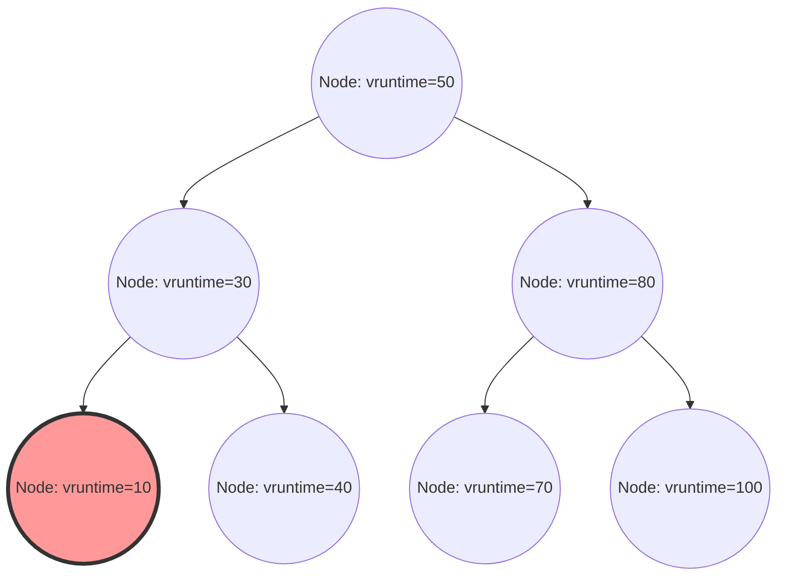

Einer der wichtigsten Bestandteile des Linux-Kernels, der die Gesamtleistung, den Durchsatz und die Reaktionsfähigkeit des Systems maßgeblich bestimmt, ist der Prozess-Scheduler. Der „Completely Fair Scheduler (CFS)“, der in modernen Linux-Systemen (von Kernel 2.6.23 bis 6.5) über viele Jahre als Standard-Scheduler herrschte, stellt ein Meisterwerk dar, das sich vollständig von der traditionellen heuristikbasierten Planung verabschiedet hat und nach „vollkommener Fairness“ auf der Grundlage strenger mathematischer Modelle strebt.

In diesem Artikel werden wir aus der Perspektive der internen Strukturen des Linux-Kernels und der Scheduling-Theorie die Architektur des CFS, die mathematische Berechnung der virtuellen Laufzeit (vruntime), die Verwaltung der Runqueue durch Rot-Schwarz-Bäume (Red-Black Trees), den Lastausgleichsalgorithmus in Multi-Core-Umgebungen sowie die Weiterentwicklung zum EEVDF (Earliest Eligible Virtual Deadline First), der im neuesten Kernel ab Version 6.6 eingeführt wurde, auf der Auflösungsebene des Quellcodes äußerst detailliert erklären. Für Kernel-Hacker, Systemprogrammierer und Ingenieure, die sich mit Performance-Tuning auf Low-Level-Ebene befassen, ist ein tiefes Verständnis der internen Struktur des CFS unumgänglich.

## Kapitel 1: Die Evolutionsgeschichte der Linux-Scheduler und der Hintergrund der Entstehung von CFS

Um die Designphilosophie des CFS und dessen Eleganz tiefgehend zu verstehen, muss man betrachten, mit welchen Problemen die Scheduler in der Geschichte des Linux-Kernels konfrontiert waren und wie sie sich weiterentwickelt haben. Die Evolution der Scheduling-Algorithmen war auch eine Geschichte des intensiven Kampfes mit dem Trade-off zwischen den widersprüchlichen Anforderungen von Durchsatz (Verarbeitungsmenge pro Zeiteinheit) und Latenz (Reaktionszeit).

### Die Ära vor dem 2.4-Kernel: Die Grenzen des O(N)-Schedulers und das epochale Dilemma

Der Scheduler in der Linux-2.4-Ära war einfach, aber ausreichend für die damaligen Standard-Workloads. Dieser Scheduler verwendete einen epochenbasierten Algorithmus, bei dem jedem Prozess ein Time-Slice (Zeitscheibe) zugewiesen wurde und eine neue Epoche begann, wenn alle Prozesse ihr Time-Slice aufgebraucht hatten.

Als jedoch Multiprozessorsysteme immer beliebter wurden, offenbarte dieser Scheduler einen fatalen Architekturfehler. Dieser lag in seiner Zeitkomplexität von $O(N)$ (wobei N die Anzahl der ausführbaren Prozesse ist). Das System verfügte insgesamt über nur eine globale Runqueue (Ausführungswarteschlange). Bei jedem Scheduling-Vorgang musste das System „alle Prozesse“ in der Warteschlange durchsuchen, um den optimalen nächsten Prozess (denjenigen mit der höchsten dynamischen Priorität) zu bestimmen.
Noch schwerwiegender war das Problem der gegenseitigen Aussperrung (Exclusion). Da die gesamte Runqueue durch einen einzigen globalen Spinlock (`runqueue_lock`) geschützt war, verschärfte sich der Lock-Konflikt mit zunehmender Anzahl von CPU-Kernen. Während eine CPU den als Nächstes auszuführenden Prozess suchte, wurden alle anderen CPUs blockiert, was zur Verschwendung wertvoller CPU-Zyklen durch das Warten auf Spinlocks (Busy-Loop) führte und einen massiven Flaschenhals in der Skalierbarkeit (Cache-Line-Bouncing) verursachte.

### Der 2.6-Kernel: Ingo Molnar und die Innovation des O(1)-Schedulers

Um diese Herausforderungen in Bezug auf Skalierbarkeit und Rechenaufwand grundlegend zu lösen, führte der renommierte Kernel-Hacker Ingo Molnar während der Entwicklung des Linux-2.6-Kernels den „O(1)-Scheduler“ ein. Wie der Name schon sagt, verfügte dieser Scheduler über einen bahnbrechenden Algorithmus, der es ermöglichte, den nächsten Prozess in konstanter Zeit $O(1)$ auszuwählen, völlig unabhängig von der Anzahl der Prozesse im System.

Der O(1)-Scheduler löste die Skalierbarkeitsprobleme in Multiprozessorumgebungen drastisch, indem er für jede CPU (jeden Prozessor) völlig unabhängige Runqueues (Per-CPU Runqueues) einführte und den globalen Lock abschaffte. Jede Runqueue hielt zwei prioritätsbasierte Arrays: das „Active-Array“ und das „Expired-Array“. Die Arrays bestanden aus verketteten Listen (`list_head`) für 140 verschiedene Prioritätsstufen (0 bis 139, wobei 0 bis 99 für Echtzeit-Prioritäten und 100 bis 139 für normale Nice-Werte reserviert waren).

Die Auswahl der Prozesse war extrem schnell. Es gab eine Bitmap für die Prioritäten, und die Bits der Prioritäten, für die ausführbare Prozesse existierten, wurden auf 1 gesetzt. Indem die CPU Hardwarebefehle zur „Suche nach dem höchstwertigen Bit“ (wie `bsfl` oder `lzcnt` bei x86) nutzte, konnte sie in konstanten Taktzyklen die höchste Priorität ermitteln und in $O(1)$ den Prozess an der Spitze der entsprechenden Prioritätsliste abrufen. Wenn ein Prozess sein Time-Slice aufgebraucht hatte, wurde er in das „Expired-Array“ verschoben. Sobald das „Active-Array“ leer war, wurden lediglich die Zeiger der beiden Arrays vertauscht, wodurch sofort eine neue Epoche gestartet wurde.

Obwohl der O(1)-Scheduler aus Leistungssicht perfekt war, brachte er ein anderes massives Dilemma mit sich: die „Bestimmung der Interaktivität“. Um das Nutzererlebnis in Desktop-Umgebungen (wie die Reaktionsfähigkeit der Maus oder das Zeichnen von Fenstern) zu verbessern, schätzte der Scheduler anhand heuristischer Methoden (Erfahrungswerte) ab dem Verhältnis von vergangener Schlaf- zu Ausführungszeit, ob ein Prozess I/O-gebunden (interaktiv) oder CPU-gebunden war. Prozessen, die als interaktiv eingestuft wurden, wurde ein dynamischer Prioritäts-Boost (Bonus) gewährt. Es gab eine Sonderbehandlung, bei der sie auch nach Aufbrauchen ihres Time-Slices im Active-Array verblieben, anstatt ins Expired-Array verschoben zu werden.
Diese heuristische Logik wurde mit jedem Kernel-Update komplexer und bizarrer. In Grenzfällen führte dies zu unerklärlichem Verhalten, wie z. B. schwerwiegenden Tonaussetzern in Multimedia-Anwendungen oder dem völligen Verhungern (Starvation) von CPU-gebundenen Prozessen.

### Con Kolivas' RSDL und der Paradigmenwechsel zur vollkommenen Fairness

Con Kolivas, der eigentlich Anästhesist war, aber auch als Kernel-Hacker agierte, kritisierte die extrem komplexen Heuristiken und endlosen Optimierungen des O(1)-Schedulers. Er argumentierte: „Die Reaktionsfähigkeit des Desktops kann ohne komplexe Vorhersagelogik allein durch eine rein faire Verteilung verbessert werden“, und schlug Patches wie den Staircase-Scheduler oder den RSDL-Scheduler (Rotating Staircase Deadline) in Mailinglisten vor.

Kolivas' RSDL-Scheduler wurde zwar nicht in den Mainline-Kernel aufgenommen, aber seine Philosophie lieferte Ingo Molnar eine entscheidende Inspiration. Ingo Molnar verwarf die komplexen dynamischen Prioritätsberechnungen und heuristischen Codes des O(1)-Schedulers vollständig und schrieb in nur wenigen Wochen einen völlig neuen Scheduler, basierend auf dem einzigen, schönen Prinzip: „Die CPU-Zeit vollkommen fair zwischen den Prozessen aufzuteilen“. Dies ist der „Completely Fair Scheduler (CFS)“.
Der CFS wurde im Linux-Kernel 2.6.23 in die Mainline integriert und hat in den folgenden mehr als 15 Jahren durchgehend als Herzstück von Linux fungiert. Dies war ein äußerst wichtiger Paradigmenwechsel in der Geschichte der Betriebssysteme – eine Rückkehr von komplexen Erfahrungswerten zu mathematischen Modellen.

## Kapitel 2: Mathematische Grundlagen des vollkommen fairen Queuings (Fair Queuing) und das GPS-Modell

Das Konzept der „vollkommenen Fairness“ (Completely Fair) des CFS ist nicht bloß ein Schlagwort, sondern verwurzelt in dem „idealen Ressourcenallokationsmodell“ aus der Betriebssystem- und Netzwerktheorie.

### Die Utopie des GPS-Modells (Generalized Processor Sharing)

Die ultimative Idealform in der Scheduling-Theorie ist ein Konzept namens GPS-Modell (Generalized Processor Sharing) oder Fluid-Modell (Flüssigkeitsmodell).
Ein idealer GPS-Prozessor ist eine virtuelle Hardware, die physikalische Einschränkungen ignoriert. Wenn es im System $N$ ausführbare Prozesse gibt, stellt der GPS-Prozessor jedem Prozess gleichzeitig, parallel und exakt $1/N$ der CPU-Leistung zur Verfügung. Das bedeutet, dass die Ressource CPU nicht „zeitlich aufgeteilt“ (Time-Slicing) und abwechselnd ausgeführt wird, sondern „räumlich (oder leistungstechnisch) aufgeteilt“ ist, sodass die Prozesse kontinuierlich und ohne jegliche Verzögerung fortschreiten.

Wenn es Unterschiede in der Priorität (Gewicht: Weight) der Prozesse gibt, das GPS-Modell wird auf Weighted Fair Queuing (WFQ) erweitert. Wenn jeder Prozess $i$ im System ein Gewicht $w_i$ hat, erhält Prozess $i$ „kontinuierlich“ eine Verarbeitungsleistung, die proportional zum Verhältnis seines Gewichts zur Summe aller Gewichte ist. Mathematisch ausgedrückt ist die CPU-Bandbreite $C_i$, die Prozess $i$ erhält:

$$
C_i = \text{CPU Total Capacity} \times \frac{w_i}{\sum_{j=1}^{N} w_j}
$$

In diesem Modell ist der Overhead durch Kontextwechsel null, und der Prozess schreitet kontinuierlich voran, indem er die ihm zustehende CPU-Bandbreite nutzt.

### Approximation von GPS in diskreter Zeit und das grundlegende Theorem des CFS

In der Realität kann ein physischer CPU-Kern zu einem bestimmten Zeitpunkt jedoch nur einen einzigen Befehlsstrom (Thread) gleichzeitig ausführen (abgesehen von SMT/Hyper-Threading). Es ist physikalisch unmöglich, das GPS-Modell direkt auf physischer Hardware zu implementieren.
Daher muss die Zeit in kleine Scheiben unterteilt und durch extrem schnelles Umschalten der Prozesse (Zeitmultiplexing) das GPS-Modell aus makroskopischer Sicht angenähert (emuliert) werden. Dies ist das Grundprinzip des CFS, das das Konzept des Packet-Schedulings (WFQ) in Netzwerk-Routern auf das CPU-Scheduling anwendet.

Der Algorithmus des CFS berechnet und verfolgt kontinuierlich die „ideale CPU-Zeit“, die die im System laufenden Prozesse erhalten hätten, wenn sie auf einem idealen GPS-Prozessor ausgeführt worden wären. Dann plant er die Ausführung des Prozesses, bei dem die „Abweichung (Verzögerung)“ von der tatsächlich auf der echten CPU verbrauchten Zeit am größten ist.
Die virtuelle Uhr, die diesen „Grad des Fortschritts auf dem idealen GPS-Prozessor“ verfolgt, ist die sogenannte „virtuelle Laufzeit (vruntime)“, die im dritten Kapitel ausführlich erklärt wird.

## Kapitel 3: Die Mathematik und der Berechnungsmechanismus der virtuellen Laufzeit (vruntime)

Der Kern des CFS-Algorithmus, der alles steuert, ist eine vorzeichenlose 64-Bit-Ganzzahl-Variable namens `vruntime` (Virtual Runtime), die von allen Prozessen (genauer gesagt der grundlegenden Scheduling-Einheit `sched_entity`) gehalten wird.
Die Scheduling-Regel des CFS erfordert keine komplexen Array-Operationen wie der O(1)-Scheduler und ist erstaunlich einfach:
**„Wähle immer den Task mit der geringsten vruntime in der Runqueue und führe ihn als Nächstes aus.“**

### Umrechnungsformel vom Nice-Wert zum Gewicht (Weight)

In Linux wird der Nice-Wert von `-20` (höchste Priorität) bis `19` (niedrigste Priorität) verwendet, um die Prozesspriorität vom Userspace aus anzupassen. Der Standardwert ist `0`.
Der CFS verwendet diesen Nice-Wert nicht direkt in seinen Berechnungen. Stattdessen wird er in ein „Gewicht (Weight)“ umgewandelt, das ein relatives CPU-Zuteilungsverhältnis darstellt.

Die Designanforderung bestand hierbei darin, dass „wenn der Nice-Wert um 1 sinkt (die Priorität steigt), der Prozess im Vergleich zu anderen Prozessen etwa 10 % mehr CPU-Zeit erhält, und wenn der Nice-Wert um 1 steigt, er etwa 10 % weniger erhält“. Um dies mathematisch zu realisieren, wurde das Gewicht so definiert, dass es sich in Abhängigkeit vom Nice-Wert in einer geometrischen Reihe ändert. Konkret beträgt das Verhältnis der Gewichte (der Multiplikator) zwischen benachbarten Nice-Werten etwa $1,25$.
Da $1,25^3 \approx 1,953 \approx 2,0$ ist, ergibt sich die elegante Beziehung, dass sich die dem Prozess zugewiesene CPU-Zeit bei einer Änderung des Nice-Werts um 3 etwa verdoppelt oder halbiert.

Innerhalb des Kernels in `kernel/sched/core.c` ist basierend auf dieser Theorie eine Lookup-Tabelle `sched_prio_to_weight` statisch definiert:

```c
const int sched_prio_to_weight[40] = {
 /* -20 */     88761,     71755,     56483,     46273,     36291,
 /* -15 */     29154,     23254,     18705,     14949,     11916,
 /* -10 */      9548,      7620,      6100,      4904,      3906,
 /*  -5 */      3121,      2501,      1991,      1586,      1277,
 /*   0 */      1024,       820,       655,       526,       423,
 /*   5 */       335,       272,       215,       172,       137,
 /*  10 */       110,        87,        70,        56,        45,
 /*  15 */        36,        29,        23,        18,        15,
};
```
Das Gewicht für einen Task mit dem Nice-Wert `0` ist als `1024` definiert. Im Kernel wird dies als Makro-Konstante `NICE_0_LOAD` behandelt. Alle Berechnungen werden mit diesem Wert `1024` als Basis durchgeführt.

### Mathematisches Modell und Berechnungsformel für den Anstieg der vruntime

Wenn ein Prozess für eine Echtzeit von $\Delta exec$ (in Nanosekunden) auf einer physischen CPU ausgeführt wird, erhöht sich die `vruntime` dieses Prozesses gemäß der folgenden Formel:

$$
vruntime \mathrel{+}= \Delta exec \times \frac{NICE\_0\_LOAD}{weight}
$$

Betrachten wir, was diese Gleichung bedeutet, indem wir konkrete Nice-Werte anwenden.

1. **Bei einem Nice-Wert von `0` (Gewicht `1024`)**: 
   Das Ergebnis ist $\frac{1024}{1024} = 1$. Folglich steigt die $vruntime$ im exakt gleichen Tempo wie die Echtzeit $\Delta exec$. Wird der Prozess 10 ms lang in Echtzeit ausgeführt, schreitet die vruntime ebenfalls um 10 ms (10.000.000 ns) voran.
2. **Bei einem Nice-Wert von `-5` (Gewicht `3121`, hohe Priorität)**:
   Das Ergebnis ist $\frac{1024}{3121} \approx 0,328$. Das bedeutet, dass die $vruntime$ nur etwa ein Drittel so schnell steigt wie die Echtzeit. Dass die vruntime langsamer wächst, bedeutet, dass der Zustand der „minimalen vruntime“ im Vergleich zu anderen Prozessen länger aufrechterhalten werden kann, was wiederum zur Folge hat, dass der Prozess die CPU über einen längeren Zeitraum monopolisieren kann.
3. **Bei einem Nice-Wert von `5` (Gewicht `335`, niedrige Priorität)**:
   Das Ergebnis ist $\frac{1024}{335} \approx 3,05$. Die $vruntime$ steigt drastisch mit etwa der dreifachen Geschwindigkeit der Echtzeit. Da die vruntime schon nach kurzer Ausführungszeit rapide ansteigt, wird der Prozess schnell von anderen Tasks überholt, verliert seine Position als Prozess mit der „minimalen vruntime“ und muss die CPU abgeben.

Auf diese Weise normalisiert der CFS die physische Ausführungszeit durch das jeweilige „Gewicht“ jedes Prozesses, wandelt sie in die Dimension eines einzigen absoluten Indikators, der `vruntime`, um und erreicht so gleichzeitig Prioritätssteuerung und Fairness.

### Vermeidung von Divisionen in der Kernel-Implementierung und Festkommaarithmetik

Das mathematische Modell ist wie oben beschrieben, aber tief im OS-Kernel, wo der Scheduler in Scheduling-Pfaden zehntausendfach pro Millisekunde aufgerufen wird, würde die Durchführung einer Division (Divisionsbefehl) durch $\frac{1}{weight}$ bei jedem Aufruf schwerwiegende Leistungseinbußen (insbesondere auf älteren Architekturen Verzögerungen von Dutzenden bis Hunderten von Taktzyklen) nach sich ziehen.

Daher führt der Linux-Kernel eine clevere Optimierung durch, um Divisionen vollständig zu eliminieren. Er berechnet im Voraus eine weitere Lookup-Tabelle `sched_prio_to_wmult`, die den Wert von $\frac{2^{32}}{weight}$ (der Kehrwert multipliziert mit $2^{32}$) speichert. Die Division wird dann vollständig durch Multiplikationen und 32-Bit-Rechtsshifts ersetzt (eine grundlegende Technik der Festkommaarithmetik).

```c
/* kernel/sched/fair.c : Logische Struktur von calc_delta_fair() */
static inline u64 calc_delta_fair(u64 delta, struct sched_entity *se)
{
    if (unlikely(se->load.weight != NICE_0_LOAD)) {
        /*
         * Vermeidet Divisionen und berechnet
         * delta = delta * (NICE_0_LOAD / weight)
         * ausschließlich durch Multiplikations- und Shift-Befehle
         */
        delta = __calc_delta(delta, NICE_0_LOAD, &se->load);
    }
    return delta;
}
```
Bei jedem Timer-Interrupt (Tick) oder Kontextwechsel wird die Funktion `update_curr()` in `kernel/sched/fair.c` aufgerufen. Sie misst die tatsächliche Ausführungszeit der aktuell ausgeführten Aufgabe präzise und aktualisiert die `vruntime` über die obige Funktion exakt.

## Kapitel 4: Verwaltung der Runqueue und Scheduling-Entitäten durch Rot-Schwarz-Bäume (Red-Black Tree)

Während der O(1)-Scheduler Array-Strukturen nach Prioritäten sortiert nutzte, verwendet der CFS eine elegante Datenstruktur namens „Rot-Schwarz-Baum (Red-Black Tree, RB-Tree)“, eine Art von balanciertem binärem Suchbaum.

### Die cfs_rq-Struktur und die Abstraktion der sched_entity

Jede CPU hält eine eigene CFS-Runqueue-Struktur `struct cfs_rq` im Speicher. Interessant ist, dass die Objekte, die direkt in der Runqueue gespeichert und geplant werden, nicht `task_struct`s sind, die die Prozesse selbst repräsentieren. Der CFS abstrahiert die Scheduling-Ziele um eine weitere Ebene und behandelt sie als Strukturen vom Typ `struct sched_entity` (Scheduling-Entität).

Diese Abstraktion ist von entscheidender Bedeutung. Sie ermöglicht es dem CFS, das Ziel des Schedulings transparent als ein und dieselbe einzige `sched_entity` zu behandeln, unabhängig davon, ob es sich um einen einzelnen Prozess oder um eine durch cgroups (Control Groups) gruppierte Sammlung von Prozessen handelt. Dadurch wird hierarchisches Gruppen-Scheduling (Group Scheduling) elegant realisiert.

### Baumoperationen im Rot-Schwarz-Baum und Zeitkomplexität des Algorithmus

Der CFS speichert alle ausführbaren Entitäten, die in der Runqueue existieren, in einem Rot-Schwarz-Baum und nutzt dabei die `vruntime` als Schlüssel (Sortierkriterium). Aufgrund der Eigenschaften von binären Suchbäumen gilt die Regel, dass linke Kindknoten immer kleinere Werte und rechte Kindknoten immer größere Werte als ihr Elternknoten aufweisen.

- **Suchen (Abrufen) des besten Prozesses**:
  Die Regel des CFS lautet: „Führe immer das Element mit der geringsten vruntime in der Runqueue als Nächstes aus.“ Der kleinste Knoten in einem Rot-Schwarz-Baum befindet sich am äußersten Ende, wenn man von der Wurzel aus immer weiter nach links geht, also beim „am weitesten links stehenden Knoten des Baumes (`rb_leftmost`)“.
  Jedes Mal, wenn ein Einfügen oder Löschen im Baum durchgeführt wird, speichert und cacht der CFS stets den Zeiger auf diesen `rb_leftmost`-Knoten (`cfs_rq->rb_leftmost`). Daher erfordert der Prozess der Auswahl des nächsten auszuführenden Tasks durch den Scheduler (`pick_next_task_fair()`) keine Baumsuche, sondern lediglich das Auslesen des gecachten Zeigers, wodurch die Berechnung in einer Komplexität von $O(1)$ abgeschlossen wird.

- **Einfügen und Löschen von Knoten**:
  Wenn ein Prozess aus dem Schlaf aufwacht (Wake-up) und in den ausführbaren Zustand übergeht, oder wenn er die Ausführung beendet, die CPU abgibt und in die Queue zurückkehrt, beträgt die Zeitkomplexität für das Einfügen (`enqueue_entity()`) oder Löschen (`dequeue_entity()`) in den Rot-Schwarz-Baum $O(\log N)$, wobei N die Anzahl der Elemente in der Warteschlange ist.
  Obwohl die algorithmische Komplexität im Vergleich zum O(1)-Scheduler schlechter ist, hält der Rot-Schwarz-Baum sich selbst stets in Balance, wodurch die Höhe des Baumes auf $\log N$ beschränkt bleibt. Selbst wenn im System Zehntausende von Prozessen existieren, beträgt die Baumhöhe nur wenig mehr als zehn Ebenen. Unter Berücksichtigung der Cache-Lokalität ist der reale CPU-Zyklus-Overhead extrem gering, und es hat sich gezeigt, dass er weitaus günstiger ist als die Kosten für die Ausführung der komplexen heuristischen Logik der O(1)-Ära.


*Abbildung: Die logische Struktur eines Rot-Schwarz-Baums mit vruntime als Schlüssel. Der am weitesten links stehende Knoten (vruntime=10) wird stets als nächster auszuführender Prozess gecacht.*

### Schutz vor Überläufen und Wake-up-Korrektur durch min_vruntime

Die `vruntime` ist eine vorzeichenlose 64-Bit-Ganzzahl (`u64`), die in Nanosekunden ununterbrochen wächst. Bei Enterprise-Servern, die über lange Zeiträume kontinuierlich laufen, besteht mathematisch gesehen immer die Möglichkeit eines Überlaufs (Wrap-Around-Phänomen, bei dem der Wert das Maximum überschreitet und auf 0 zurückfällt).

In der Praxis ist die Behandlung von frisch erstellten Prozessen oder solchen, die nach langem Schlaf, z. B. durch Warten auf I/O, wieder aufwachen, noch problematischer. Wäre die `vruntime` dieser Prozesse bei 0 oder auf einem sehr alten Wert verblieben, wäre sie im Vergleich zur `vruntime` anderer Prozesse im System (z. B. mehrere Billionen Nanosekunden) extrem klein. Als Folge würde der CFS fälschlicherweise annehmen: „Dieser Prozess hat die CPU überhaupt nicht genutzt und ist massiv benachteiligt“, woraufhin er dem Prozess erlauben würde, die CPU vollständig zu monopolisieren, bis seine `vruntime` zu den anderen Prozessen aufgeschlossen hätte (wodurch alle anderen Prozesse verhungern würden).

Um dies gänzlich zu verhindern, führt die `cfs_rq`-Struktur eine wichtige Tracking-Variable namens `min_vruntime` mit.
`min_vruntime` verfolgt den kleinsten `vruntime`-Wert aller aktuell in dieser Runqueue befindlichen Prozesse, aber ihr ist die strikte Regel auferlegt, **nur „monoton steigend“ zu sein**. Das bedeutet, dass sie niemals in die Vergangenheit zurückkehren darf.

- **Initialisierung neuer Prozesse (beim fork)**:
  Wird ein neuer Prozess erstellt, beginnt seine initiale `vruntime` nicht bei null, sondern wird durch eine Offset-Korrektur (Initialisierung) auf einen angemessenen Wert basierend auf der `vruntime` des Elternprozesses oder der `min_vruntime` der aktuellen Runqueue gesetzt.
- **Korrektur aufwachender Prozesse (Wake-up)**:
  Wenn ein Prozess nach langem Schlaf aufwacht und in die Runqueue zurückkehrt, wird innerhalb der `enqueue_entity()`-Funktion eine strikte Korrektur vorgenommen. Die alte `vruntime` des Prozesses wird mit einem Wert verglichen, der sich aus der `min_vruntime` der Runqueue abzüglich eines bestimmten Strafwertes (berechnet z. B. aus `sysctl_sched_latency`) ergibt, und der größere von beiden Werten wird verwendet.
  Das heißt: `se->vruntime = max_vruntime(se->vruntime, cfs_rq->min_vruntime - Strafwert)`. Die Zeit wird so gezwungenermaßen „hochgezogen“, um mit der Systemuhr übereinzustimmen. Dies verhindert eine ungerechtfertigte CPU-Monopolisierung bei der Rückkehr aus einem langen Schlaf und gewährt gleichzeitig einen angemessenen Verzögerungsbonus bei der Rückkehr aus kurzen Schlafphasen (z. B. Warten auf Tastatureingaben), um die Reaktionsfähigkeit zu gewährleisten.

Außerdem werden bei den Vergleichsfunktionen für Rot-Schwarz-Bäume innerhalb des Kernels (wie z. B. `entity_before()`) zwei `u64`-Werte nicht direkt verglichen. Stattdessen werden sie in eine vorzeichenbehaftete 64-Bit-Ganzzahl (`s64`) gecastet und subtrahiert. Das Vorzeichen des Ergebnisses bestimmt dann, welcher Wert größer ist. Dies ist ein Hack, der die modulare Arithmetik der Zweierkomplementdarstellung nutzt. Solange die Differenz zwischen den beiden Werten kleiner als $2^{63}$ ist, kann die zeitliche Reihenfolge korrekt ermittelt werden, selbst wenn einer der Werte übergelaufen ist und wieder bei 0 begonnen hat. Dadurch wird das Wrap-Around-Problem vollständig unschädlich gemacht.

## Kapitel 5: Der Lastausgleichsmechanismus (Load Balancing) in Multi-Core- und NUMA-Systemen

In modernen Hardware-Architekturen gibt es keine Single-Core-Prozessoren mehr. Stattdessen sind Multi-Core-Prozessoren mit Dutzenden bis Hunderten von Kernen sowie NUMA-Architekturen (Non-Uniform Memory Access), bei denen die Speicherzugriffsverzögerung von der physischen Distanz abhängt, allgegenwärtig.
Egal wie perfekt der reine Rot-Schwarz-Baum-Algorithmus des CFS die Fairness auf einer einzelnen CPU gewährleistet – wenn in der Warteschlange einer CPU 100 Prozesse festsitzen und das System ans Limit bringen, während die benachbarte CPU völlig untätig im Leerlauf verweilt, wäre der Systemdurchsatz im Ganzen katastrophal. Aus diesem Grund sind Task-Migration (Verschiebung) und Lastausgleich in Multi-Core-Umgebungen überaus kritische Subsysteme.

### Die komplexe hierarchische Topologie von sched_domain und sched_group

Der Linux-Kernel erstellt hierarchische Datenstrukturen namens `sched_domain` und `sched_group`, um die komplexe physische CPU-Hardware-Topologie zu abstrahieren und effizient zu verwalten. Beim Systemstart liest der Kernel die Hardware-Informationen aus ACPI oder Device-Trees und baut einen logischen hierarchischen Baum auf.

Stellen Sie sich beispielsweise ein System vor, das über zwei physische Sockel (NUMA-Knoten) verfügt. Jeder Sockel besitzt vier physische Kerne, und bei jedem Kern ist SMT (wie z. B. Hyper-Threading) aktiviert, was insgesamt 16 logische Threads ergibt. In diesem Fall baut der Scheduler von unten nach oben die folgende Hierarchie (Domänen) auf:

1. **SMT-Domäne (Simultaneous Multithreading)**:
   Die unterste Ebene. Zuständig für den Lastausgleich zwischen den beiden logischen Threads, die sich denselben physischen Kern teilen. Da L1/L2-Caches und Ausführungseinheiten hier vollständig gemeinsam genutzt werden, sind die Kosten (Strafen) für die Verschiebung eines Tasks minimal.
2. **MC-Domäne (Multi-Core)**:
   Zuständig für den Lastausgleich zwischen den mehreren physischen Kernen auf demselben physischen Sockel (CPU-Package). Da sie sich normalerweise den L3-Cache (LLC: Last Level Cache) teilen, ist die Strafe für Cache-Misses bei einer Taskverschiebung moderat.
3. **NUMA-Domäne**:
   Die oberste Ebene. Zuständig für den Lastausgleich zwischen verschiedenen physischen Sockeln (NUMA-Knoten). Wird ein Prozess über diese Grenze hinweg verschoben, wird der Zugriff des Prozesses auf seinen bisher genutzten Speicher zu einem Remote-Speicherzugriff, was eine drastische Verschlechterung der Latenz nach sich zieht. Daher ist die Migrationsstrafe (der Widerstandswert) hier extrem hoch angesetzt.

Das Load Balancing (Lastausgleich) wird zu zwei Zeitpunkten ausgelöst: periodisch durch Timer-Interrupts (Periodic Load Balance) und kurz bevor eine CPU-Runqueue leer wird und in den Leerlauf übergeht (NewIdle Load Balance).
Der Algorithmus durchläuft die Domänen von unten (SMT) nach oben (NUMA). In jeder Domäne berechnet er die durchschnittliche Last zwischen den dazugehörigen `sched_group`s. Nur wenn der Schwellenwert für die Strafe der jeweiligen Domäne überschritten wird, zieht (pullt) er einen Task aus der am stärksten ausgelasteten Gruppe in die am wenigsten ausgelastete Gruppe (sich selbst).

### Die Mathematik des PELT-Algorithmus (Per-Entity Load Tracking)

Um beim Load Balancing die „Last zwischen Gruppen“ präzise vergleichen zu können, muss man zunächst in der Lage sein, die „Last eines Tasks“ genau zu messen. Früher verwendete der Linux-Kernel eine grobe Methode, bei der die Anzahl der Tasks (Warteschlangenlänge) in der Runqueue momentan abgetastet wurde. Dadurch ließ sich die Last von stoßartigen Tasks, die schnell und oft zwischen EIN und AUS wechselten, nicht genau abschätzen, was zu unangemessenen Taskverschiebungen führte.

Um dieses Problem zu lösen, wurde vor einigen Jahren der **PELT-Algorithmus (Per-Entity Load Tracking)** eingeführt, der die Genauigkeit des Kernel-Schedulings drastisch verbesserte.
PELT ist ein Algorithmus, der den „Verlauf“, also wie viel CPU-Zeit jede Entität (Prozess oder cgroup) in der Vergangenheit verbraucht hat, kontinuierlich und mit einer Auflösung von Millisekunden verfolgt und mithilfe eines exponentiell gewichteten gleitenden Durchschnitts (EWMA: Exponentially Weighted Moving Average) abklingen lässt.

Die Last $L_t$ eines Tasks zum Zeitpunkt $t$ wird mithilfe des CPU-Verbrauchs $C_t$ der aktuellen Periode und der aus der Vergangenheit kumulierten Last $L_{t-1}$ durch die folgende Rekursionsformel berechnet:

$$ L_t = C_t + y \times L_{t-1} $$

Dabei ist $y$ der Abklingfaktor (ein Wert größer 0 und kleiner 1). Im Linux-Kernel ist der Wert von $y$ so kalibriert, dass der Einfluss der Vergangenheit exakt in 32 Millisekunden halbiert wird (Halbwertszeit von 32 ms, $y^{32} = 0,5$).
Beginnt ein Task, die CPU zu nutzen, steigt der Lastwert dadurch sanft an, und wenn der Task schläft, klingt der Wert sanft ab. Die hochpräzise und stabile Lastmetrik, die von PELT geliefert wird, wird nicht nur für das Load Balancing des CFS verwendet. Sie wird auch direkt in Stromspar-Governors eingespeist, die die Betriebsfrequenz der CPU dynamisch anpassen (wie der Schedutil-Governor von cpufreq), und bildet so die Kerntechnologie zur Erzielung eines optimalen Gleichgewichts zwischen Leistung und Energieeffizienz.

### CFS Bandwidth Control (Bandbreitensteuerung: Quoten und Throttling)

Ein absolut unverzichtbares Feature als Basis für moderne Cloud-Infrastrukturen und Container-Technologien (Docker, Kubernetes) ist die strikte Begrenzung der CPU-Ressourcennutzung (Bandwidth Control) durch cgroups. Der CFS enthält einen Mechanismus für vollständig kontrollierte Bandbreitenzuweisungen.

Die Bandbreitensteuerung des CFS wird durch zwei Parameter definiert: `cpu.cfs_period_us` (Periode) und `cpu.cfs_quota_us` (Quote/Limit).
Beispielsweise dürfen Prozesse, die zu einer cgroup gehören, für die eine Periode von `100000` (100 ms) und eine Quote von `50000` (50 ms) eingestellt ist, innerhalb eines Zeitfensters von 100 ms in Summe maximal 50 ms (50 % eines CPU-Kerns) auf der physischen CPU ausgeführt werden.

Wenn ein Prozess ausgeführt wird, verwendet der Kernel hochpräzise Timer, um die verbrauchte Ausführungszeit zu messen und subtrahiert diese von der der cgroup zugewiesenen Quote. Wenn ein Prozess seine Quote vollständig aufgebraucht hat, werden drastische Maßnahmen ergriffen. Der CFS zieht alle zu dieser cgroup gehörenden Entitäten physisch aus dem Rot-Schwarz-Baum der Runqueue (dequeue) und isoliert sie als nicht ausführbar in einer speziellen Warteliste (Throttled-Zustand).
In diesem Zustand bekommt der Prozess keinerlei CPU-Ressourcen zugewiesen, egal wie dringend er ausgeführt werden möchte. Wenn die nächste Periode beginnt, löst ein Hardware-Timer aus, die Quote wird vollständig wieder aufgefüllt (refreshed), und die isolierten Entitäten werden wieder in den Rot-Schwarz-Baum eingefügt (enqueue), sodass die Ausführung fortgesetzt werden kann.
Dieser Throttling-Mechanismus ist äußerst robust und fungiert als eiserner Schutzwall, um in Multi-Tenant-Umgebungen das „Noisy-Neighbor-Problem“ zu verhindern, bei dem ein außer Kontrolle geratener Container die CPU-Ressourcen anderer Container aufbraucht.

## Kapitel 6: Realtime-Scheduler und die Weiterentwicklung zum neuesten EEVDF (Earliest Eligible Virtual Deadline First)

Linux verfügt über Echtzeit-Scheduling-Richtlinien (`SCHED_FIFO`, `SCHED_RR`), die dem POSIX-Standard entsprechen und vollständig von CFS (für normale Prozesse: `SCHED_NORMAL`, `SCHED_BATCH`, `SCHED_IDLE`) getrennt sind.
Echtzeitprozesse haben eine absolute Priorität von 0 bis 99 (RT prio). Solange auch nur ein ausführbarer Echtzeitprozess im System vorhanden ist, wird allen CFS-Prozessen (im Prioritätsraum von 100 bis 139) die CPU-Ausführungsberechtigung vollständig entzogen. Der Realtime-Scheduler verwendet keinen Rot-Schwarz-Baum, sondern wird durch einen extrem einfachen $O(1)$-Algorithmus unter Verwendung von Arrays und Bitmaps nach Prioritäten (wie beim O(1)-Scheduler) verwaltet. Er wird beispielsweise für industrielle Steuerungen oder Audioverarbeitung eingesetzt, bei denen deterministische Reaktionszeiten im Mikrosekundenbereich gefordert sind.

### Strukturelle Grenzen von CFS und das Fehlen von Latenzgarantien (Verzögerungen)

In einer normalen Prozessumgebung erzielte der CFS im Hinblick auf „mathematisch vollkommene Fairness beim langfristigen Durchsatz“ eine geradezu perfekte Leistung. Als sich jedoch die Systeme weiterentwickelten und die Anforderungen an Desktop- und mobile Umgebungen (wie Android) strenger wurden, zeigten sich die architektonischen Grenzen des CFS im Hinblick auf die „Garantie einer bestimmten Latenz (Reaktionszeit) innerhalb weniger Millisekunden“.

Als Preis für den CFS, Heuristiken zu eliminieren und Entscheidungen rein anhand der Größe der vruntime zu treffen, kam es vor, dass I/O-gebundene Tasks (wie z.B. UI-Rendering-Tasks, die auf Tastatureingaben reagieren, sofort für einige zehn Mikrosekunden ausgeführt werden und dann wieder schlafen) vorübergehend von einem Schwarm rechenintensiver CPU-gebundener Tasks (wie Video-Encoding) „begraben“ wurden. Da ihre Reihenfolge beim Scheduling nach hinten rutschte, kam es zu unschönem Stottern auf dem Bildschirm (UI-Jitter).
Um dies zu mildern, wendeten die Kernel-Entwickler Patches auf das rein mathematische Modell des CFS an. Sie fügten Tuning-Parameter wie `sysctl kernel.sched_wakeup_granularity_ns` (Präemptions-Schwellenwert beim Aufwachen) und `sched_min_granularity_ns` hinzu und integrierten weiterhin (ironischerweise wie in der O(1)-Ära) unzählige kleine heuristische Codefragmente. Diese stellten jedoch nur symptomatische Behandlungen dar und führten nicht zu einer grundlegenden, mathematischen Garantie der Latenz.

### Die Linux-6.6-Revolution: Einführung des EEVDF-Schedulers

Um diesem jahrelangen Dilemma ein Ende zu bereiten, wurde dank der massiven Bemühungen von Peter Zijlstra, dem CFS-Maintainer, und anderen im Linux-6.6-Kernel der Kernalgorithmus von CFS endgültig und vollständig durch einen völlig neuen Algorithmus namens **EEVDF (Earliest Eligible Virtual Deadline First)** ersetzt. Aus Kompatibilitätsgründen blieben die Klassennamen im Quellcode (wie `fair.c` und `sched_class fair_sched_class`) erhalten, aber die Logik des Herzstücks wurde von Grund auf erneuert.

EEVDF ist in Wirklichkeit ein geschichtsträchtiger akademischer Algorithmus, der 1995 von Ion Stoica und Hussein Abdel-Wahab veröffentlicht wurde. Er besitzt die erstaunliche Eigenschaft, für Prozesse „Fairness (Fairness)“ und „strikte Latenzgarantie (Latency Guarantee)“ mathematisch in Einklang zu bringen.
Anstelle der einzelnen `vruntime` des CFS berechnet und verfolgt der EEVDF-Algorithmus zwei wichtige zeitliche Indikatoren zur Verwaltung der Prozessausführung.

1. **Bestimmung der Eligible Time (Berechtigungszeit) und des Lag (Verzögerung)**:
   EEVDF berechnet, wie viel „Lag“ (Verzögerung) ein Prozess im Vergleich zum idealen GPS-Modell aktuell hat. Ein Prozess, dessen Lag positiv ist (d. h. ihm wurde weniger CPU zugewiesen als idealerweise vorgesehen, er wird also ungerecht behandelt), wird als „Eligible“ (berechtigt) eingestuft. Umgekehrt sind Prozesse, die mehr CPU verbraucht haben als ideal, nicht berechtigt.
2. **Berechnung der Virtual Deadline (virtuelle Deadline)**:
   Es wird eine virtuelle Frist (Deadline) berechnet, bis zu der ein Prozess das von ihm angeforderte Time-Slice (CPU-Zeit) auf einem idealen GPS-Prozessor abgearbeitet haben sollte.

Die Scheduling-Regeln von EEVDF sind eine Stufe fortschrittlicher als beim CFS und lauten wie folgt:
**„Wähle aus der Menge der Tasks, die sich derzeit im Status ‚Eligible‘ (berechtigt) befinden, denjenigen mit der frühesten Virtual Deadline aus und führe ihn als Nächstes aus.“**

Die Vorteile dieser Umstellung auf den EEVDF-Algorithmus sind unermesslich. Die „zahlreichen heuristischen Logiken bezüglich des Aufwachens“, die sich im CFS über Jahrzehnte angesammelt und die Codebasis aufgebläht hatten, wurden überflüssig und restlos entfernt (gelöscht).
Darüber hinaus wurde ein Rahmen geschaffen, mit dem jeder Prozess die „gewünschte Time-Slice-Länge“ explizit angeben kann (dies soll in Zukunft durch cgroups-Erweiterungen oder einen neuen Systemaufruf `sched_setattr` auch für den Userspace freigegeben werden).
Auf diese Weise erhalten interaktive UI-Tasks, die extrem kurze Time-Slices anfordern, eine äußerst nahe (frühe) virtuelle Deadline. Dies garantiert mathematisch, dass sie schwere Berechnungsaufgaben zuverlässig verdrängen (Präemption) und sofort ausgeführt werden. Es ist nun möglich geworden, die Mikrolatenz im Millisekundenbereich vollständig zu kontrollieren, ohne dabei den Durchsatz opfern zu müssen.

## Fazit

Der Completely Fair Scheduler (CFS) von Linux und seine Weiterentwicklung EEVDF haben den tiefgreifenden theoretischen Hintergrund des idealen GPS-Modells und des aus der Netzwerktechnologie stammenden WFQ. Sie stellen einen absoluten Höhepunkt der Softwareentwicklung dar, der diese Theorien durch die Mathematik der `vruntime` und die elegante selbstbalancierende Datenstruktur der Rot-Schwarz-Bäume unter den extremen Leistungsbeschränkungen des Kernel-Space realisiert.

Die Geschichte begann mit den Problemen durch Lock-Konflikte in der Frühphase der Multiprozessorsysteme, durchlief die Fallen der Heuristik im O(1)-Scheduler und fand schließlich im CFS zurück zur mathematischen Fairness. Der Linux-Scheduler entwickelt sich unaufhaltsam weiter: über die Integration des PELT-Algorithmus zur Bewältigung der extremen Komplexität von Multi-Core- und NUMA-Topologien, zur Umsetzung strenger Bandbreitensteuerungen durch cgroups, die die Cloud-Ära stützen, bis hin zum heutigen EEVDF, der den letzten Heiligen Gral der absoluten Latenzgarantie integriert hat.

Das tiefe Verständnis der historischen Entwicklung und der mathematisch fundierten internen Struktur des Schedulers, des Herzstücks eines jeden Betriebssystems, befriedigt nicht nur das intellektuelle Bedürfnis. Es ist eine äußerst mächtige Waffe, um Leistungsengpässe im gesamten System zu identifizieren, das Verhalten in der Multithread-Programmierung vorherzusagen und hochgradig anspruchsvolle Anwendungsarchitekturen zu entwerfen.

Dies war eine Reise in die abgründige Welt des Schedulers, der das Zentrum des Linux-Kernels bildet und das Schicksal aller Prozesse in seinen Händen hält.
